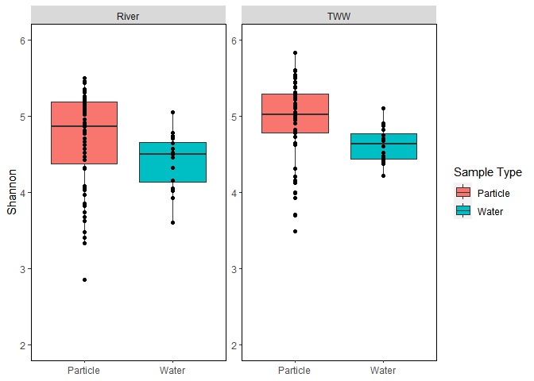
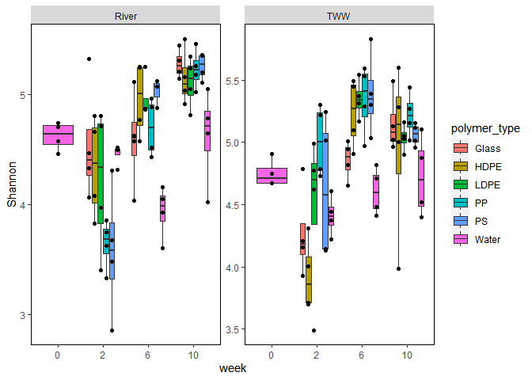
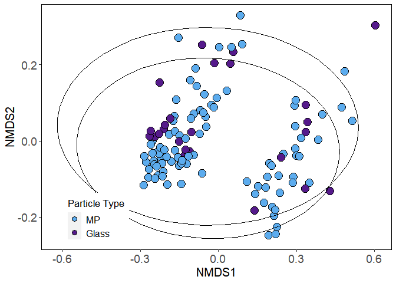
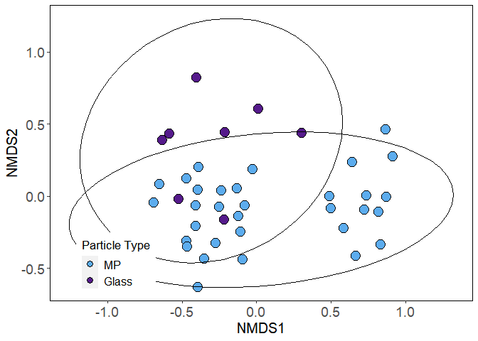
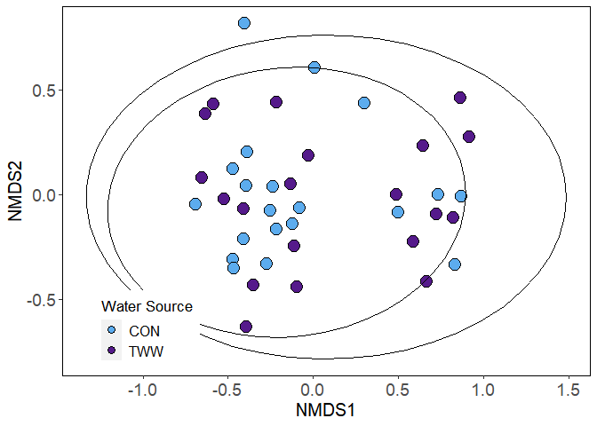
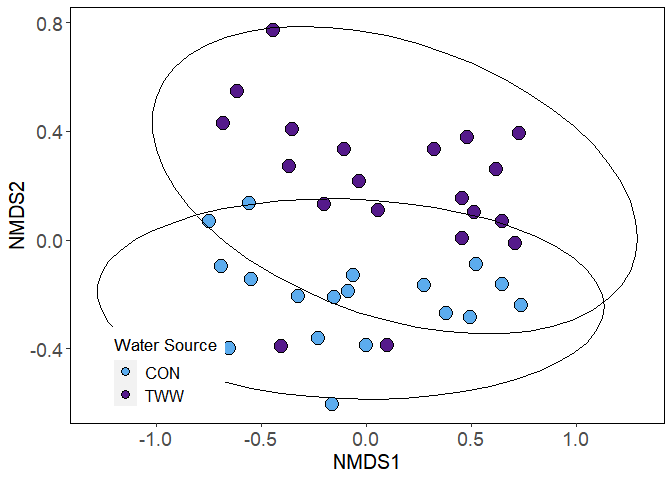

Analysis
================
Sarah Brown
2023-04-28

-   <a href="#1-load-packages-and-import-data"
    id="toc-1-load-packages-and-import-data">1 Load Packages and Import
    Data</a>
-   <a href="#2-preparing-the-data" id="toc-2-preparing-the-data">2
    Preparing the Data</a>
-   <a href="#3-alpha-diversity" id="toc-3-alpha-diversity">3 Alpha
    Diversity</a>
    -   <a href="#31-calculate-shannon-diversity-per-sample"
        id="toc-31-calculate-shannon-diversity-per-sample">3.1 Calculate Shannon
        Diversity per Sample</a>
    -   <a href="#32-create-alpha-diversity-boxplots"
        id="toc-32-create-alpha-diversity-boxplots">3.2 Create Alpha Diversity
        Boxplots</a>
        -   <a href="#321-comparison-particles-vs-water"
            id="toc-321-comparison-particles-vs-water">3.2.1 Comparison: particles
            vs. water</a>
        -   <a
            href="#322-comparison-particle-types-microplastic-glass-or-water-between-effluent-sources"
            id="toc-322-comparison-particle-types-microplastic-glass-or-water-between-effluent-sources">3.2.2
            Comparison: particle types (microplastic, glass, or water) between
            effluent sources</a>
        -   <a href="#323-comparison-polymer-types-by-effluent-source"
            id="toc-323-comparison-polymer-types-by-effluent-source">3.2.3
            Comparison: polymer types by effluent source</a>
        -   <a href="#324-comparison-particle_type-glass-vs-microplastics-over-time"
            id="toc-324-comparison-particle_type-glass-vs-microplastics-over-time">3.2.4
            Comparison: particle_type (glass vs. microplastics) over time</a>
        -   <a href="#325-comparison-polymer-types-over-time"
            id="toc-325-comparison-polymer-types-over-time">3.2.5 Comparison:
            polymer types over time</a>
-   <a href="#4-alpha-diversity-statistics"
    id="toc-4-alpha-diversity-statistics">4 Alpha Diversity statistics</a>
-   <a href="#5-nmds-plots" id="toc-5-nmds-plots">5 NMDS plots</a>
    -   <a href="#51-nmds-of-all-data" id="toc-51-nmds-of-all-data">5.1 NMDS of
        all data</a>
    -   <a
        href="#52-nmds-of-particles-glass-and-mps-only-no-water-bray-curtis-dissimilarity"
        id="toc-52-nmds-of-particles-glass-and-mps-only-no-water-bray-curtis-dissimilarity">5.2
        NMDS of particles (glass and MPs) only, no water, Bray-Curtis
        dissimilarity</a>
    -   <a
        href="#53-nmds-of-particles-glass-and-mps-only-no-water-unifrac-dissimmilarity"
        id="toc-53-nmds-of-particles-glass-and-mps-only-no-water-unifrac-dissimmilarity">5.3
        NMDS of particles (glass and MPs) only, no water, Unifrac
        dissimmilarity</a>
    -   <a
        href="#54-nmds-of-particles-glass-and-mps-only-no-water-at-2-weeks-bray-curtis-dissimilarity"
        id="toc-54-nmds-of-particles-glass-and-mps-only-no-water-at-2-weeks-bray-curtis-dissimilarity">5.4
        NMDS of particles (glass and MPs) only, no water, at 2 weeks,
        Bray-Curtis dissimilarity</a>
    -   <a
        href="#55-nmds-of-particles-glass-and-mps-only-no-water-at-6-weeks-bray-curtis-dissimilarity"
        id="toc-55-nmds-of-particles-glass-and-mps-only-no-water-at-6-weeks-bray-curtis-dissimilarity">5.5
        NMDS of particles (glass and MPs) only, no water, at 6 weeks,
        Bray-Curtis dissimilarity</a>
    -   <a
        href="#56-nmds-of-particles-glass-and-mps-only-no-water-at-10-weeks-bray-curtis-dissimilarity"
        id="toc-56-nmds-of-particles-glass-and-mps-only-no-water-at-10-weeks-bray-curtis-dissimilarity">5.6
        NMDS of particles (glass and MPs) only, no water, at 10 weeks,
        Bray-Curtis dissimilarity</a>
    -   <a href="#57-nmds-of-mps-only-bray-curtis-dissimilarity"
        id="toc-57-nmds-of-mps-only-bray-curtis-dissimilarity">5.7 NMDS of MP’s
        only, Bray-Curtis dissimilarity</a>
    -   <a href="#58-nmds-of-mps-only-at-2-weeks-bray-curtis-dissimilarity"
        id="toc-58-nmds-of-mps-only-at-2-weeks-bray-curtis-dissimilarity">5.8
        NMDS of MP’s only, at 2 weeks, Bray-Curtis dissimilarity</a>
    -   <a href="#59-nmds-of-mps-only-at-6-weeks-bray-curtis-dissimilarity"
        id="toc-59-nmds-of-mps-only-at-6-weeks-bray-curtis-dissimilarity">5.9
        NMDS of MP’s only, at 6 weeks, Bray-Curtis dissimilarity</a>
    -   <a href="#510-nmds-of-mps-only-at-10-weeks-bray-curtis-dissimilarity"
        id="toc-510-nmds-of-mps-only-at-10-weeks-bray-curtis-dissimilarity">5.10
        NMDS of MP’s only, at 10 weeks, Bray-Curtis dissimilarity</a>
-   <a href="#6-permanova-analysis" id="toc-6-permanova-analysis">6
    PERMANOVA Analysis</a>
    -   <a
        href="#61-permanova-analysis-of-particles-glass-and-mps-only-no-water-bray-and-unifrac"
        id="toc-61-permanova-analysis-of-particles-glass-and-mps-only-no-water-bray-and-unifrac">6.1
        PERMANOVA analysis of particles (glass and MPs) only, no water, bray and
        unifrac</a>
    -   <a
        href="#62-permanova-analysis-of-particles-glass-and-mps-only-no-water-at-2-weeks-bray"
        id="toc-62-permanova-analysis-of-particles-glass-and-mps-only-no-water-at-2-weeks-bray">6.2
        PERMANOVA analysis of particles (glass and MPs) only, no water at 2
        weeks, bray</a>
    -   <a
        href="#63-permanova-analysis-of-particles-glass-and-mps-only-no-water-at-6-weeks-bray"
        id="toc-63-permanova-analysis-of-particles-glass-and-mps-only-no-water-at-6-weeks-bray">6.3
        PERMANOVA analysis of particles (glass and MPs) only, no water at 6
        weeks, bray</a>
    -   <a
        href="#64-permanova-analysis-of-particles-glass-and-mps-only-no-water-at-10-weeks-bray"
        id="toc-64-permanova-analysis-of-particles-glass-and-mps-only-no-water-at-10-weeks-bray">6.4
        PERMANOVA analysis of particles (glass and MPs) only, no water at 10
        weeks, bray</a>
    -   <a
        href="#65-permanova-analysis-of-plastics-only-no-water-no-glass-at-2-weeks-bray"
        id="toc-65-permanova-analysis-of-plastics-only-no-water-no-glass-at-2-weeks-bray">6.5
        PERMANOVA analysis of plastics only, no water, no glass, at 2 weeks,
        bray</a>
    -   <a
        href="#66-permanova-analysis-of-plastics-only-no-water-no-glass-at-6-weeks-bray"
        id="toc-66-permanova-analysis-of-plastics-only-no-water-no-glass-at-6-weeks-bray">6.6
        PERMANOVA analysis of plastics only, no water, no glass, at 6 weeks,
        bray</a>
    -   <a
        href="#67-permanova-analysis-of-plastics-only-no-water-no-glass-at-10-weeks-bray"
        id="toc-67-permanova-analysis-of-plastics-only-no-water-no-glass-at-10-weeks-bray">6.7
        PERMANOVA analysis of plastics only, no water, no glass, at 10 weeks,
        bray</a>
-   <a href="#7-preliminary-data-fix" id="toc-7-preliminary-data-fix">7
    Preliminary Data Fix</a>
-   <a href="#8-differential-abundance-with-deseq2"
    id="toc-8-differential-abundance-with-deseq2">8 Differential abundance
    with DESeq2</a>
    -   <a href="#81-examining-filtration-cutoff"
        id="toc-81-examining-filtration-cutoff">8.1 Examining filtration
        cutoff</a>
    -   <a href="#82-filtering-the-phyloseq-object"
        id="toc-82-filtering-the-phyloseq-object">8.2 Filtering the phyloseq
        object</a>
    -   <a href="#83-mp-in-tww-vs-mp-in-river-water-all-timepoints"
        id="toc-83-mp-in-tww-vs-mp-in-river-water-all-timepoints">8.3 MP in TWW
        vs MP in River Water, all timepoints</a>
        -   <a href="#831-create-bar-plot-of-results---log-normalized-counts"
            id="toc-831-create-bar-plot-of-results---log-normalized-counts">8.3.1
            Create bar plot of results - log normalized counts</a>
    -   <a href="#84-mp-vs-glass-all-timepoints-combined-water-sources"
        id="toc-84-mp-vs-glass-all-timepoints-combined-water-sources">8.4 MP vs
        glass, all timepoints, combined water sources</a>
        -   <a href="#841-create-bar-plot-of-results---log-normalized-counts"
            id="toc-841-create-bar-plot-of-results---log-normalized-counts">8.4.1
            Create bar plot of results - log normalized counts</a>
    -   <a href="#85-mp-vs-glass-all-timepoints-river-water-only"
        id="toc-85-mp-vs-glass-all-timepoints-river-water-only">8.5 MP vs glass,
        all timepoints, river water only</a>
        -   <a href="#851-create-bar-plot-of-results---log-normalized-counts"
            id="toc-851-create-bar-plot-of-results---log-normalized-counts">8.5.1
            Create bar plot of results - log normalized counts</a>
    -   <a
        href="#86-examining-changes-in-bacterial-communities-on-glass-beads-over-time"
        id="toc-86-examining-changes-in-bacterial-communities-on-glass-beads-over-time">8.6
        Examining changes in bacterial communities on glass beads over time</a>
        -   <a
            href="#861-contrasts---2w-6w-10w-river-water-glass-only-vs-river-water"
            id="toc-861-contrasts---2w-6w-10w-river-water-glass-only-vs-river-water">8.6.1
            Contrasts - 2w, 6w, 10w river water glass only, vs river water</a>
        -   <a href="#862-contrasts---2w-6w-10w-tww-glass-only-vs-tww"
            id="toc-862-contrasts---2w-6w-10w-tww-glass-only-vs-tww">8.6.2 Contrasts
            - 2w, 6w, 10w TWW Glass only, vs TWW</a>
        -   <a href="#863-venn-diagrams" id="toc-863-venn-diagrams">8.6.3 Venn
            Diagrams</a>
    -   <a
        href="#87-examining-changes-in-bacterial-communities-on-microplastics-over-time"
        id="toc-87-examining-changes-in-bacterial-communities-on-microplastics-over-time">8.7
        Examining changes in bacterial communities on microplastics over
        time</a>
        -   <a href="#871-contrasts---2w-6w-10w-river-water-mps-only-vs-river-water"
            id="toc-871-contrasts---2w-6w-10w-river-water-mps-only-vs-river-water">8.7.1
            Contrasts - 2w, 6w, 10w river water MP’s only, vs river water</a>
        -   <a href="#872-contrasts---2w-6w-10w-tww-mps-only-vs-tww"
            id="toc-872-contrasts---2w-6w-10w-tww-mps-only-vs-tww">8.7.2 Contrasts -
            2w, 6w, 10w TWW MP’s only, vs TWW</a>
        -   <a href="#873-venn-diagrams" id="toc-873-venn-diagrams">8.7.3 Venn
            Diagrams</a>
        -   <a href="#874-superexacttest" id="toc-874-superexacttest">8.7.4
            SuperExactTest</a>
        -   <a href="#875-heatmap" id="toc-875-heatmap">8.7.5 Heatmap</a>
        -   <a href="#876-heatmap-at-genus-level"
            id="toc-876-heatmap-at-genus-level">8.7.6 Heatmap at genus level</a>
        -   <a href="#877-heatmap-at-family-level"
            id="toc-877-heatmap-at-family-level">8.7.7 Heatmap at family level</a>
        -   <a href="#878-heatmap-at-family-level-with-annotations"
            id="toc-878-heatmap-at-family-level-with-annotations">8.7.8 Heatmap at
            family level with annotations</a>
        -   <a href="#879-finding-asvs-enriched-on-con-mp--tww-mp"
            id="toc-879-finding-asvs-enriched-on-con-mp--tww-mp">8.7.9 Finding ASV’s
            enriched on CON MP &amp; TWW MP</a>
        -   <a
            href="#8710-phylogenetic-tree-comparing-asvs-enriched-on-con-vs-tww-mps"
            id="toc-8710-phylogenetic-tree-comparing-asvs-enriched-on-con-vs-tww-mps">8.7.10
            Phylogenetic tree comparing ASVs enriched on CON vs TWW MP’s</a>
    -   <a
        href="#88-comparing-bacterial-community-composition-between-glass-and-microplastics"
        id="toc-88-comparing-bacterial-community-composition-between-glass-and-microplastics">8.8
        Comparing bacterial community composition between glass and
        microplastics</a>
        -   <a href="#881-venn-diagram-river-water-timepoints"
            id="toc-881-venn-diagram-river-water-timepoints">8.8.1 Venn Diagram,
            river water timepoints</a>
        -   <a href="#882-finding-asvs-enriched-on-mp--glass"
            id="toc-882-finding-asvs-enriched-on-mp--glass">8.8.2 Finding ASV’s
            enriched on MP &amp; glass</a>
        -   <a href="#883-venn-diagram-tww" id="toc-883-venn-diagram-tww">8.8.3 Venn
            Diagram, TWW</a>
        -   <a href="#884-superexacttest" id="toc-884-superexacttest">8.8.4
            SuperExactTest</a>
-   <a href="#9-nmds-plots---filtered-dataset"
    id="toc-9-nmds-plots---filtered-dataset">9 NMDS plots - filtered
    dataset</a>
    -   <a href="#91-preparing-the-data" id="toc-91-preparing-the-data">9.1
        Preparing the data</a>
    -   <a href="#92-nmds-of-all-data" id="toc-92-nmds-of-all-data">9.2 NMDS of
        all data</a>
    -   <a
        href="#93-nmds-of-particles-glass-and-mps-only-no-water-bray-curtis-dissimilarity"
        id="toc-93-nmds-of-particles-glass-and-mps-only-no-water-bray-curtis-dissimilarity">9.3
        NMDS of particles (glass and MPs) only, no water, Bray-Curtis
        dissimilarity</a>
    -   <a
        href="#94-nmds-of-particles-glass-and-mps-only-no-water-at-2-weeks-bray-curtis-dissimilarity"
        id="toc-94-nmds-of-particles-glass-and-mps-only-no-water-at-2-weeks-bray-curtis-dissimilarity">9.4
        NMDS of particles (glass and MPs) only, no water, at 2 weeks,
        Bray-Curtis dissimilarity</a>
    -   <a
        href="#95-nmds-of-particles-glass-and-mps-only-no-water-at-6-weeks-bray-curtis-dissimilarity"
        id="toc-95-nmds-of-particles-glass-and-mps-only-no-water-at-6-weeks-bray-curtis-dissimilarity">9.5
        NMDS of particles (glass and MPs) only, no water, at 6 weeks,
        Bray-Curtis dissimilarity</a>
    -   <a
        href="#96-nmds-of-particles-glass-and-mps-only-no-water-at-10-weeks-bray-curtis-dissimilarity"
        id="toc-96-nmds-of-particles-glass-and-mps-only-no-water-at-10-weeks-bray-curtis-dissimilarity">9.6
        NMDS of particles (glass and MPs) only, no water, at 10 weeks,
        Bray-Curtis dissimilarity</a>
    -   <a href="#97-nmds-of-mps-only-bray-curtis-dissimilarity"
        id="toc-97-nmds-of-mps-only-bray-curtis-dissimilarity">9.7 NMDS of MP’s
        only, Bray-Curtis dissimilarity</a>
    -   <a href="#98-nmds-of-mps-only-at-2-weeks-bray-curtis-dissimilarity"
        id="toc-98-nmds-of-mps-only-at-2-weeks-bray-curtis-dissimilarity">9.8
        NMDS of MP’s only, at 2 weeks, Bray-Curtis dissimilarity</a>
    -   <a href="#99-nmds-of-mps-only-at-6-weeks-bray-curtis-dissimilarity"
        id="toc-99-nmds-of-mps-only-at-6-weeks-bray-curtis-dissimilarity">9.9
        NMDS of MP’s only, at 6 weeks, Bray-Curtis dissimilarity</a>
    -   <a href="#910-nmds-of-mps-only-at-10-weeks-bray-curtis-dissimilarity"
        id="toc-910-nmds-of-mps-only-at-10-weeks-bray-curtis-dissimilarity">9.10
        NMDS of MP’s only, at 10 weeks, Bray-Curtis dissimilarity</a>
-   <a href="#10-permanova-analysis---filtered-dataset"
    id="toc-10-permanova-analysis---filtered-dataset">10 PERMANOVA Analysis
    - filtered dataset</a>
    -   <a
        href="#101-permanova-analysis-of-particles-glass-and-mps-only-no-water-bray-and-unifrac"
        id="toc-101-permanova-analysis-of-particles-glass-and-mps-only-no-water-bray-and-unifrac">10.1
        PERMANOVA analysis of particles (glass and MPs) only, no water, bray and
        unifrac</a>
    -   <a
        href="#102-permanova-analysis-of-particles-glass-and-mps-only-no-water-at-2-weeks-bray"
        id="toc-102-permanova-analysis-of-particles-glass-and-mps-only-no-water-at-2-weeks-bray">10.2
        PERMANOVA analysis of particles (glass and MPs) only, no water at 2
        weeks, bray</a>
    -   <a
        href="#103-permanova-analysis-of-particles-glass-and-mps-only-no-water-at-6-weeks-bray"
        id="toc-103-permanova-analysis-of-particles-glass-and-mps-only-no-water-at-6-weeks-bray">10.3
        PERMANOVA analysis of particles (glass and MPs) only, no water at 6
        weeks, bray</a>
    -   <a
        href="#104-permanova-analysis-of-particles-glass-and-mps-only-no-water-at-10-weeks-bray"
        id="toc-104-permanova-analysis-of-particles-glass-and-mps-only-no-water-at-10-weeks-bray">10.4
        PERMANOVA analysis of particles (glass and MPs) only, no water at 10
        weeks, bray</a>
    -   <a href="#105-permanova-analysis-of-mps-only-bray"
        id="toc-105-permanova-analysis-of-mps-only-bray">10.5 PERMANOVA analysis
        of MP’s only, bray</a>
    -   <a
        href="#106-permanova-analysis-of-plastics-only-no-water-no-glass-at-2-weeks-bray"
        id="toc-106-permanova-analysis-of-plastics-only-no-water-no-glass-at-2-weeks-bray">10.6
        PERMANOVA analysis of plastics only, no water, no glass, at 2 weeks,
        bray</a>
    -   <a
        href="#107-permanova-analysis-of-plastics-only-no-water-no-glass-at-6-weeks-bray"
        id="toc-107-permanova-analysis-of-plastics-only-no-water-no-glass-at-6-weeks-bray">10.7
        PERMANOVA analysis of plastics only, no water, no glass, at 6 weeks,
        bray</a>
    -   <a
        href="#108-permanova-analysis-of-plastics-only-no-water-no-glass-at-10-weeks-bray"
        id="toc-108-permanova-analysis-of-plastics-only-no-water-no-glass-at-10-weeks-bray">10.8
        PERMANOVA analysis of plastics only, no water, no glass, at 10 weeks,
        bray</a>
-   <a href="#11-session-info" id="toc-11-session-info">11 Session Info</a>

# 1 Load Packages and Import Data

Here, we import the .qza files exported from QIIME2 using the qiime2R
package. The final object is a phyloseq object called MPphyseq.

``` r
library(ggplot2)
library(vegan)
library(plyr)
library(dplyr)
library(scales)
library(grid)
library(reshape2)
library(phyloseq)
library(picante)
library(tidyr)
library(viridis)
library(qiime2R)
library(DESeq2)
library(patchwork)
library(RColorBrewer)
library(microViz)
library(speedyseq)
library(ComplexHeatmap)
library(ggVennDiagram)
library(SuperExactTest)
library(nVennR)
library(ggh4x)

set.seed(13289)

#Create a phyloseq object from the .qza files exported from qiime2 using 
#the qiime2R package
MPphyseq <- qza_to_phyloseq(
  features="Qiime output/dada2-table.qza",
  tree="Qiime output/rooted-tree.qza",
  taxonomy="Qiime output/MP-taxonomy.qza",
  metadata = "Qiime output/MP-metadata.tsv"
)
```

# 2 Preparing the Data

Before performing any analyses, we need to examine the phyloseq object
and remove chloroplast and mitochondrial sequences:

``` r
#Check the rank names to make sure they are accurate
rank_names(MPphyseq)
```

    ## [1] "Kingdom" "Phylum"  "Class"   "Order"   "Family"  "Genus"   "Species"

``` r
#Correct output:[1] "Kingdom" "Phylum"  "Class"   "Order"   "Family"  
#                   "Genus"   "Species"

#Check sample variables
sample_variables(MPphyseq)
```

    ## [1] "effluent"               "week"                   "polymer_type"          
    ## [4] "bead_diameter"          "Channel"                "sample_type"           
    ## [7] "particle_type"          "particle_effluent"      "particle_effluent_time"

``` r
#Remove chloroplast sequences and any contaminant sequences
MPphyseq <- subset_taxa(MPphyseq, Kingdom != "d__Eukaryota")
MPphyseq <- subset_taxa(MPphyseq, Kingdom != "d__Archaea")
MPphyseq <- subset_taxa(MPphyseq, Order != "o__Chloroplast")
MPphyseq <- subset_taxa(MPphyseq, Order != "Chloroplast")
MPphyseq <- subset_taxa(MPphyseq, Family != "f__Mitochondria")
MPphyseq <- subset_taxa(MPphyseq, Family != "Mitochondria")

#Check that contaminant sequences are removed (easiest to save as data frame and search)
taxtabl <- as.data.frame(tax_table(MPphyseq))

#At this point, blanks and positive controls should also be removed
MPphyseq = subset_samples(MPphyseq, effluent != "FB")
```

``` r
#Examining the total number of reads and ASV's
readsumsdf = data.frame(nreads = sort(taxa_sums(MPphyseq), TRUE), 
                        sorted = 1:ntaxa(MPphyseq), type = "ASVs")
readsumsdf = rbind(readsumsdf, data.frame(nreads = sort(sample_sums(MPphyseq), 
                        TRUE), sorted = 1:nsamples(MPphyseq), type = "Samples"))
title = "Total number of reads"
p = ggplot(readsumsdf, aes(x = sorted, y = nreads)) + geom_bar(stat = "identity")
p + ggtitle(title) + scale_y_log10() + facet_wrap(~type, 1, scales = "free")
```

<!-- -->

``` r
#Rarefaction curve using vegan
#From: https://micca.readthedocs.io/en/latest/phyloseq.html
taxa_are_rows(MPphyseq)
```

    ## [1] TRUE

``` r
mat <- t(otu_table(MPphyseq))
class(mat) <- "matrix"
```

    ## Warning in class(mat) <- "matrix": Setting class(x) to "matrix" sets attribute
    ## to NULL; result will no longer be an S4 object

``` r
class(mat)
```

    ## [1] "matrix" "array"

``` r
mat <- as(t(otu_table(MPphyseq)), "matrix")
class(mat)
```

    ## [1] "matrix" "array"

``` r
raremax <- min(rowSums(mat))

system.time(rarecurve(mat, step = 100, sample = raremax, col = "blue", label = FALSE))
```

    ## Warning in rarecurve(mat, step = 100, sample = raremax, col = "blue", label =
    ## FALSE): most observed count data have counts 1, but smallest count is 2

<!-- -->

    ##    user  system elapsed 
    ##   25.98    1.58   27.61

``` r
#Re-label the variables; if you type in MPphyseq you will see that sample_data 
#is the matrix that holds the information that we want to change, so we need to 
#include sample_data in our code here

#Order factors
sample_data(MPphyseq)$effluent <- factor(sample_data(MPphyseq)$effluent, 
                                           levels = c("CON", "TWW"),
                                           labels = c("CON", "TWW"))

sample_data(MPphyseq)$polymer_type <- factor(sample_data(MPphyseq)$polymer_type, 
                                               levels = c("Glass", "HDPE", "LDPE", "PP", "PS", "water"),
                                               labels = c("Glass", "HDPE", "LDPE", "PP", "PS", "Water"))

sample_data(MPphyseq)$week <- factor(sample_data(MPphyseq)$week, 
                                       levels = c("0", "2", "6", "10"),
                                       labels = c("0", "2", "6", "10"))

sample_data(MPphyseq)$sample_type <- factor(sample_data(MPphyseq)$sample_type, 
                                              levels = c("Particle", "water"),
                                              labels = c("Particle", "Water"))

sample_data(MPphyseq)$particle_type <- factor(sample_data(MPphyseq)$particle_type, 
                                                levels = c("MP", "Glass", "water"),
                                                labels = c("MP", "Glass", "Water"))


#Transform to relative abundance. Save as new object.
MPphyseqRA = transform_sample_counts(MPphyseq, function(x){x / sum(x)})

#Subset samples into groups
sample_data(MPphyseqRA)
```

    ## Sample Data:        [ 151 samples by 9 sample variables ]:
    ##                effluent week  polymer_type bead_diameter Channel sample_type
    ##                <fct>    <fct> <fct>                <dbl> <fct>   <fct>      
    ##  1 ESF21MP-100 CON      10    HDPE                  3.18 7.1     Particle   
    ##  2 ESF21MP-101 TWW      10    HDPE                  3.18 5.2     Particle   
    ##  3 ESF21MP-102 CON      10    LDPE                  3.18 7.2     Particle   
    ##  4 ESF21MP-103 TWW      10    PP                    3.18 5.2     Particle   
    ##  5 ESF21MP-104 CON      10    PP                    3.18 7.2     Particle   
    ##  6 ESF21MP-105 TWW      10    HDPE                  3.18 8.1     Particle   
    ##  7 ESF21MP-106 CON      10    LDPE                  3.18 7.1     Particle   
    ##  8 ESF21MP-107 TWW      10    HDPE                  3.18 5.1     Particle   
    ##  9 ESF21MP-108 CON      10    LDPE                  3.18 8.2     Particle   
    ## 10 ESF21MP-109 CON      10    PP                    3.18 8.2     Particle   
    ## # ℹ 141 more samples
    ## # ℹ 3 more variables: particle_type <fct>, particle_effluent <fct>,
    ## #   particle_effluent_time <fct>

``` r
mp.con <- subset_samples(MPphyseqRA, effluent == "CON")
sample_data(mp.con)
```

    ## Sample Data:        [ 75 samples by 9 sample variables ]:
    ##                effluent week  polymer_type bead_diameter Channel sample_type
    ##                <fct>    <fct> <fct>                <dbl> <fct>   <fct>      
    ##  1 ESF21MP-100 CON      10    HDPE                  3.18 7.1     Particle   
    ##  2 ESF21MP-102 CON      10    LDPE                  3.18 7.2     Particle   
    ##  3 ESF21MP-104 CON      10    PP                    3.18 7.2     Particle   
    ##  4 ESF21MP-106 CON      10    LDPE                  3.18 7.1     Particle   
    ##  5 ESF21MP-108 CON      10    LDPE                  3.18 8.2     Particle   
    ##  6 ESF21MP-109 CON      10    PP                    3.18 8.2     Particle   
    ##  7 ESF21MP-111 CON      10    HDPE                  3.18 6.1     Particle   
    ##  8 ESF21MP-112 CON      10    Glass                 3.18 8.2     Particle   
    ##  9 ESF21MP-114 CON      10    PS                    3.18 7.2     Particle   
    ## 10 ESF21MP-117 CON      10    Glass                 3.18 7.1     Particle   
    ## # ℹ 65 more samples
    ## # ℹ 3 more variables: particle_type <fct>, particle_effluent <fct>,
    ## #   particle_effluent_time <fct>

``` r
mp.tww <- subset_samples(MPphyseqRA, effluent == "TWW")
sample_data(mp.tww)
```

    ## Sample Data:        [ 76 samples by 9 sample variables ]:
    ##                effluent week  polymer_type bead_diameter Channel sample_type
    ##                <fct>    <fct> <fct>                <dbl> <fct>   <fct>      
    ##  1 ESF21MP-101 TWW      10    HDPE                  3.18 5.2     Particle   
    ##  2 ESF21MP-103 TWW      10    PP                    3.18 5.2     Particle   
    ##  3 ESF21MP-105 TWW      10    HDPE                  3.18 8.1     Particle   
    ##  4 ESF21MP-107 TWW      10    HDPE                  3.18 5.1     Particle   
    ##  5 ESF21MP-110 TWW      10    HDPE                  3.18 6.2     Particle   
    ##  6 ESF21MP-113 TWW      10    LDPE                  3.18 6.2     Particle   
    ##  7 ESF21MP-115 TWW      10    Glass                 3.18 5.2     Particle   
    ##  8 ESF21MP-116 TWW      10    PP                    3.18 6.2     Particle   
    ##  9 ESF21MP-123 TWW      10    PS                    3.18 6.2     Particle   
    ## 10 ESF21MP-126 TWW      10    PP                    3.18 5.1     Particle   
    ## # ℹ 66 more samples
    ## # ℹ 3 more variables: particle_type <fct>, particle_effluent <fct>,
    ## #   particle_effluent_time <fct>

# 3 Alpha Diversity

Note that these data are not rarefied. We’ll use the Shannon diversity
index (based on richness AND evenness; examines how many different taxa
are present and how evenly they’re distributed within a sample) to
analyze alpha diversity between variable types. This means it considers
both the number of species and the inequality between species
abundances.

## 3.1 Calculate Shannon Diversity per Sample

Using the estimate_richness function in the phyloseq package to
calculate Shannon diversity. The estimate_richness function can also
take measures “Chao1” “ACE” “Simpson” and “Fisher”.

Note that running this code results in an error message stating that the
provided data does not have any singletons. See here for more
information:

<https://github.com/benjjneb/dada2/issues/214>

<https://forum.qiime2.org/t/singletons-and-diversity-richness-indices/2971/9>

``` r
#Calculating richness - Shannon diversity in a new dataframe
richness <- data.frame(estimate_richness(MPphyseqRA, measures = c("Shannon")))
richness <- setNames(cbind(rownames(richness), richness, row.names = NULL), 
                     c("sample-id", "Shannon"))

#Add the sample metadata to the dataframe
s <- data.frame(sample_data(MPphyseqRA))
s <- setNames(cbind(rownames(s), s, row.names = NULL), 
              c("sample-id", "effluent", "week", "polymer_type", 
                "bead_diameter", "Channel", "sample_type", "particle_type",
                "particle_effluent", "particle_effluent_time"))

alphadiv <- merge(s, richness, by = "sample-id")

#Order factors
alphadiv$polymer_type <- factor(alphadiv$polymer_type, 
                        levels = c("Glass", "HDPE", "LDPE", "PP", "PS", "Water"),
                        labels = c("Glass", "HDPE", "LDPE", "PP", "PS", "Water")) 

#Shows the calculated indices
knitr::kable(head(alphadiv)) %>% 
  kableExtra::kable_styling("striped", 
                            latex_options="scale_down") %>% 
  kableExtra::scroll_box(width = "100%")
```

<div
style="border: 1px solid #ddd; padding: 5px; overflow-x: scroll; width:100%; ">

<table class="table table-striped" style="margin-left: auto; margin-right: auto;">
<thead>
<tr>
<th style="text-align:left;">

sample-id

</th>
<th style="text-align:left;">

effluent

</th>
<th style="text-align:left;">

week

</th>
<th style="text-align:left;">

polymer_type

</th>
<th style="text-align:right;">

bead_diameter

</th>
<th style="text-align:left;">

Channel

</th>
<th style="text-align:left;">

sample_type

</th>
<th style="text-align:left;">

particle_type

</th>
<th style="text-align:left;">

particle_effluent

</th>
<th style="text-align:left;">

particle_effluent_time

</th>
<th style="text-align:right;">

Shannon

</th>
</tr>
</thead>
<tbody>
<tr>
<td style="text-align:left;">

ESF21MP-100

</td>
<td style="text-align:left;">

CON

</td>
<td style="text-align:left;">

10

</td>
<td style="text-align:left;">

HDPE

</td>
<td style="text-align:right;">

3.175

</td>
<td style="text-align:left;">

7.1

</td>
<td style="text-align:left;">

Particle

</td>
<td style="text-align:left;">

MP

</td>
<td style="text-align:left;">

MP_CON

</td>
<td style="text-align:left;">

MP_CON_10

</td>
<td style="text-align:right;">

5.500475

</td>
</tr>
<tr>
<td style="text-align:left;">

ESF21MP-101

</td>
<td style="text-align:left;">

TWW

</td>
<td style="text-align:left;">

10

</td>
<td style="text-align:left;">

HDPE

</td>
<td style="text-align:right;">

3.175

</td>
<td style="text-align:left;">

5.2

</td>
<td style="text-align:left;">

Particle

</td>
<td style="text-align:left;">

MP

</td>
<td style="text-align:left;">

MP_TWW

</td>
<td style="text-align:left;">

MP_TWW_10

</td>
<td style="text-align:right;">

5.285657

</td>
</tr>
<tr>
<td style="text-align:left;">

ESF21MP-102

</td>
<td style="text-align:left;">

CON

</td>
<td style="text-align:left;">

10

</td>
<td style="text-align:left;">

LDPE

</td>
<td style="text-align:right;">

3.175

</td>
<td style="text-align:left;">

7.2

</td>
<td style="text-align:left;">

Particle

</td>
<td style="text-align:left;">

MP

</td>
<td style="text-align:left;">

MP_CON

</td>
<td style="text-align:left;">

MP_CON_10

</td>
<td style="text-align:right;">

5.045258

</td>
</tr>
<tr>
<td style="text-align:left;">

ESF21MP-103

</td>
<td style="text-align:left;">

TWW

</td>
<td style="text-align:left;">

10

</td>
<td style="text-align:left;">

PP

</td>
<td style="text-align:right;">

3.175

</td>
<td style="text-align:left;">

5.2

</td>
<td style="text-align:left;">

Particle

</td>
<td style="text-align:left;">

MP

</td>
<td style="text-align:left;">

MP_TWW

</td>
<td style="text-align:left;">

MP_TWW_10

</td>
<td style="text-align:right;">

5.439320

</td>
</tr>
<tr>
<td style="text-align:left;">

ESF21MP-104

</td>
<td style="text-align:left;">

CON

</td>
<td style="text-align:left;">

10

</td>
<td style="text-align:left;">

PP

</td>
<td style="text-align:right;">

3.175

</td>
<td style="text-align:left;">

7.2

</td>
<td style="text-align:left;">

Particle

</td>
<td style="text-align:left;">

MP

</td>
<td style="text-align:left;">

MP_CON

</td>
<td style="text-align:left;">

MP_CON_10

</td>
<td style="text-align:right;">

5.174548

</td>
</tr>
<tr>
<td style="text-align:left;">

ESF21MP-105

</td>
<td style="text-align:left;">

TWW

</td>
<td style="text-align:left;">

10

</td>
<td style="text-align:left;">

HDPE

</td>
<td style="text-align:right;">

3.175

</td>
<td style="text-align:left;">

8.1

</td>
<td style="text-align:left;">

Particle

</td>
<td style="text-align:left;">

MP

</td>
<td style="text-align:left;">

MP_TWW

</td>
<td style="text-align:left;">

MP_TWW_10

</td>
<td style="text-align:right;">

3.987267

</td>
</tr>
</tbody>
</table>

</div>

## 3.2 Create Alpha Diversity Boxplots

### 3.2.1 Comparison: particles vs. water

``` r
#Plot
ggplot(data=alphadiv, aes(x=sample_type, y=Shannon), alpha=0.1) + 
  geom_boxplot(aes(fill=sample_type)) +
  geom_point(position=position_dodge(width=0.75),aes(group=sample_type)) +
  facet_wrap(~effluent, scale="free") +
  theme(legend.position="right",
        panel.border = element_rect(colour = "black", fill = NA, size = 0.5), 
        panel.background = element_blank())
```

<!-- -->

### 3.2.2 Comparison: particle types (microplastic, glass, or water) between effluent sources

``` r
#Plot
ggplot(data=alphadiv, aes(x=effluent, y=Shannon), alpha=0.1) + 
  geom_boxplot(aes(fill=effluent)) +
  geom_point(position=position_dodge(width=0.75),aes(group=effluent)) +
  facet_wrap(~particle_type, scale="free") +
  theme(legend.position="right",
        panel.border = element_rect(colour = "black", fill = NA, size = 0.5), 
        panel.background = element_blank())
```

<!-- -->

### 3.2.3 Comparison: polymer types by effluent source

``` r
#Plot
ggplot(data=alphadiv, aes(x=polymer_type, y=Shannon), alpha=0.1) + 
  geom_boxplot(aes(fill=polymer_type)) +
  geom_point(position=position_dodge(width=0.75),aes(group=polymer_type)) +
  facet_wrap(~effluent, scale="free") +
  theme(legend.position="right",
        panel.border = element_rect(colour = "black", fill = NA, size = 0.5), 
        panel.background = element_blank())
```

<!-- -->

### 3.2.4 Comparison: particle_type (glass vs. microplastics) over time

``` r
#Remove Water from particle_type
alphadiv.particle <- filter(alphadiv, particle_type != "Water")
sample_data(alphadiv.particle)
```

    ## Sample Data:        [ 119 samples by 11 sample variables ]:
    ##          sample.id effluent week  polymer_type bead_diameter Channel sample_type
    ##          <chr>     <fct>    <fct> <fct>                <dbl> <fct>   <fct>      
    ##  1 sa1   ESF21MP-… CON      10    HDPE                  3.18 7.1     Particle   
    ##  2 sa2   ESF21MP-… TWW      10    HDPE                  3.18 5.2     Particle   
    ##  3 sa3   ESF21MP-… CON      10    LDPE                  3.18 7.2     Particle   
    ##  4 sa4   ESF21MP-… TWW      10    PP                    3.18 5.2     Particle   
    ##  5 sa5   ESF21MP-… CON      10    PP                    3.18 7.2     Particle   
    ##  6 sa6   ESF21MP-… TWW      10    HDPE                  3.18 8.1     Particle   
    ##  7 sa7   ESF21MP-… CON      10    LDPE                  3.18 7.1     Particle   
    ##  8 sa8   ESF21MP-… TWW      10    HDPE                  3.18 5.1     Particle   
    ##  9 sa9   ESF21MP-… CON      10    LDPE                  3.18 8.2     Particle   
    ## 10 sa10  ESF21MP-… CON      10    PP                    3.18 8.2     Particle   
    ## # ℹ 109 more samples
    ## # ℹ 4 more variables: particle_type <fct>, particle_effluent <fct>,
    ## #   particle_effluent_time <fct>, Shannon <dbl>

``` r
#Plot
ggplot(data=alphadiv.particle, aes(x=week, y=Shannon), alpha=0.1) + 
  geom_boxplot(aes(fill=particle_type)) +
  geom_point(position=position_dodge(width=0.75),aes(group=particle_type)) +
  facet_wrap(~effluent, scale="free") +
  theme(legend.position="right",
        panel.border = element_rect(colour = "black", fill = NA, size = 0.5), 
        panel.background = element_blank())
```

<!-- -->

### 3.2.5 Comparison: polymer types over time

``` r
#Plot
ggplot(data=alphadiv, aes(x=week, y=Shannon), alpha=0.1) + 
geom_boxplot(aes(fill=polymer_type)) +
  geom_point(position=position_dodge(width=0.75),aes(group=polymer_type)) +
  facet_wrap(~effluent, scale="free") +
  theme(legend.position="right",
        panel.border = element_rect(colour = "black", fill = NA, size = 0.5), 
        panel.background = element_blank())
```

<!-- -->

# 4 Alpha Diversity statistics

Use section 7.2
<https://microbiome.github.io/course_2021_radboud/alpha-diversity.html>

Some information from the tutorial linked above: “To further investigate
if patient status could explain the variation of Shannon index, let’s do
a Wilcoxon test. This is a non-parametric test that doesn’t make
specific assumptions about the distribution, unlike popular parametric
tests, such as the t test, which assumes normally distributed
observations. Wilcoxon test can be used to estimate whether the
differences between two groups is statistically significant.”

``` r
#Wilcoxon test, where Shannon index is the variable that we are comparing
#Wilcoxon pairwise test is a non-parametric alternative to paired t-test

#Subset data by water source
mp.con.shannon <- subset(alphadiv, effluent == "CON")
mp.tww.shannon <- subset(alphadiv, effluent == "TWW")

#Subset by particle type - microplastics only (particle_type = MP)
mp.only.shannon <- subset(alphadiv, particle_type == "MP")

#Subset MP only dataframe by water source
mp.only.con.shannon <- subset(mp.only.shannon, effluent == "CON")
mp.only.tww.shannon <- subset(mp.only.shannon, effluent == "TWW")


#Test for differences in MP alpha diversity between CON and TWW (does not include 
#glass or water)
wilcoxon_shannon_effluent <- wilcox.test(Shannon ~ effluent, data = mp.only.shannon)
wilcoxon_shannon_effluent
```

    ## 
    ##  Wilcoxon rank sum exact test
    ## 
    ## data:  Shannon by effluent
    ## W = 784, p-value = 0.01505
    ## alternative hypothesis: true location shift is not equal to 0

``` r
#Wilcoxon rank sum exact test
#data:  Shannon by effluent
#W = 784, p-value = 0.01505
#alternative hypothesis: true location shift is not equal to 0


#Wilcoxon pairwise test - CON polymer type
con.shan.wil <- pairwise.wilcox.test(mp.con.shannon$Shannon, mp.con.shannon$polymer_type, p.adjust.method="fdr", paired=FALSE) 
con.shan.wil
```

    ## 
    ##  Pairwise comparisons using Wilcoxon rank sum exact test 
    ## 
    ## data:  mp.con.shannon$Shannon and mp.con.shannon$polymer_type 
    ## 
    ##       Glass HDPE  LDPE  PP    PS   
    ## HDPE  0.977 -     -     -     -    
    ## LDPE  0.977 0.977 -     -     -    
    ## PP    0.944 0.944 0.977 -     -    
    ## PS    0.977 0.977 0.977 0.977 -    
    ## Water 0.265 0.084 0.084 0.977 0.608
    ## 
    ## P value adjustment method: fdr

``` r
#Convert output to dataframe
con.shan.wil <- as.data.frame(con.shan.wil$p.value)

#Create table of p-values
knitr::kable(con.shan.wil) %>% 
  kableExtra::kable_styling("striped", 
                            latex_options="scale_down") %>% 
  kableExtra::scroll_box(width = "100%")
```

<div
style="border: 1px solid #ddd; padding: 5px; overflow-x: scroll; width:100%; ">

<table class="table table-striped" style="margin-left: auto; margin-right: auto;">
<thead>
<tr>
<th style="text-align:left;">
</th>
<th style="text-align:right;">

Glass

</th>
<th style="text-align:right;">

HDPE

</th>
<th style="text-align:right;">

LDPE

</th>
<th style="text-align:right;">

PP

</th>
<th style="text-align:right;">

PS

</th>
</tr>
</thead>
<tbody>
<tr>
<td style="text-align:left;">

HDPE

</td>
<td style="text-align:right;">

0.9774022

</td>
<td style="text-align:right;">

NA

</td>
<td style="text-align:right;">

NA

</td>
<td style="text-align:right;">

NA

</td>
<td style="text-align:right;">

NA

</td>
</tr>
<tr>
<td style="text-align:left;">

LDPE

</td>
<td style="text-align:right;">

0.9774022

</td>
<td style="text-align:right;">

0.9774022

</td>
<td style="text-align:right;">

NA

</td>
<td style="text-align:right;">

NA

</td>
<td style="text-align:right;">

NA

</td>
</tr>
<tr>
<td style="text-align:left;">

PP

</td>
<td style="text-align:right;">

0.9442133

</td>
<td style="text-align:right;">

0.9442133

</td>
<td style="text-align:right;">

0.9774022

</td>
<td style="text-align:right;">

NA

</td>
<td style="text-align:right;">

NA

</td>
</tr>
<tr>
<td style="text-align:left;">

PS

</td>
<td style="text-align:right;">

0.9774022

</td>
<td style="text-align:right;">

0.9774022

</td>
<td style="text-align:right;">

0.9774022

</td>
<td style="text-align:right;">

0.9774022

</td>
<td style="text-align:right;">

NA

</td>
</tr>
<tr>
<td style="text-align:left;">

Water

</td>
<td style="text-align:right;">

0.2649686

</td>
<td style="text-align:right;">

0.0844438

</td>
<td style="text-align:right;">

0.0844438

</td>
<td style="text-align:right;">

0.9774022

</td>
<td style="text-align:right;">

0.6084454

</td>
</tr>
</tbody>
</table>

</div>

``` r
#Wilcoxon pairwise test - TWW polymer type
tww.shan.wil <- pairwise.wilcox.test(mp.tww.shannon$Shannon, mp.tww.shannon$polymer_type, p.adjust.method="fdr", paired=FALSE) 
tww.shan.wil
```

    ## 
    ##  Pairwise comparisons using Wilcoxon rank sum exact test 
    ## 
    ## data:  mp.tww.shannon$Shannon and mp.tww.shannon$polymer_type 
    ## 
    ##       Glass   HDPE    LDPE    PP      PS     
    ## HDPE  0.93230 -       -       -       -      
    ## LDPE  0.38182 0.77384 -       -       -      
    ## PP    0.04535 0.38182 0.48557 -       -      
    ## PS    0.23407 0.51503 0.85580 0.51503 -      
    ## Water 0.38496 0.70948 0.01961 0.00019 0.02198
    ## 
    ## P value adjustment method: fdr

``` r
#Convert output to dataframe
tww.shan.wil <- as.data.frame(tww.shan.wil$p.value)

#Create table of p-values
knitr::kable(tww.shan.wil) %>% 
  kableExtra::kable_styling("striped", 
                            latex_options="scale_down") %>% 
  kableExtra::scroll_box(width = "100%")
```

<div
style="border: 1px solid #ddd; padding: 5px; overflow-x: scroll; width:100%; ">

<table class="table table-striped" style="margin-left: auto; margin-right: auto;">
<thead>
<tr>
<th style="text-align:left;">
</th>
<th style="text-align:right;">

Glass

</th>
<th style="text-align:right;">

HDPE

</th>
<th style="text-align:right;">

LDPE

</th>
<th style="text-align:right;">

PP

</th>
<th style="text-align:right;">

PS

</th>
</tr>
</thead>
<tbody>
<tr>
<td style="text-align:left;">

HDPE

</td>
<td style="text-align:right;">

0.9323005

</td>
<td style="text-align:right;">

NA

</td>
<td style="text-align:right;">

NA

</td>
<td style="text-align:right;">

NA

</td>
<td style="text-align:right;">

NA

</td>
</tr>
<tr>
<td style="text-align:left;">

LDPE

</td>
<td style="text-align:right;">

0.3818186

</td>
<td style="text-align:right;">

0.7738379

</td>
<td style="text-align:right;">

NA

</td>
<td style="text-align:right;">

NA

</td>
<td style="text-align:right;">

NA

</td>
</tr>
<tr>
<td style="text-align:left;">

PP

</td>
<td style="text-align:right;">

0.0453524

</td>
<td style="text-align:right;">

0.3818186

</td>
<td style="text-align:right;">

0.4855711

</td>
<td style="text-align:right;">

NA

</td>
<td style="text-align:right;">

NA

</td>
</tr>
<tr>
<td style="text-align:left;">

PS

</td>
<td style="text-align:right;">

0.2340730

</td>
<td style="text-align:right;">

0.5150254

</td>
<td style="text-align:right;">

0.8557986

</td>
<td style="text-align:right;">

0.5150254

</td>
<td style="text-align:right;">

NA

</td>
</tr>
<tr>
<td style="text-align:left;">

Water

</td>
<td style="text-align:right;">

0.3849570

</td>
<td style="text-align:right;">

0.7094812

</td>
<td style="text-align:right;">

0.0196108

</td>
<td style="text-align:right;">

0.0001923

</td>
<td style="text-align:right;">

0.021981

</td>
</tr>
</tbody>
</table>

</div>

``` r
#Test for differences in MP alpha diversity over time (MPs only, does not include 
#glass or water, separated by water source)

#Wilcoxon pairwise test - CON over time
con.shan.wil.time <- pairwise.wilcox.test(mp.only.con.shannon$Shannon, mp.only.con.shannon$week, p.adjust.method="fdr", paired=FALSE) 
con.shan.wil.time
```

    ## 
    ##  Pairwise comparisons using Wilcoxon rank sum exact test 
    ## 
    ## data:  mp.only.con.shannon$Shannon and mp.only.con.shannon$week 
    ## 
    ##    2       6     
    ## 6  5.1e-06 -     
    ## 10 1.0e-08 0.0036
    ## 
    ## P value adjustment method: fdr

``` r
#Convert output to dataframe
con.shan.wil.time <- as.data.frame(con.shan.wil.time$p.value)

#Create table of p-values
knitr::kable(con.shan.wil.time) %>% 
  kableExtra::kable_styling("striped", 
                            latex_options="scale_down") %>% 
  kableExtra::scroll_box(width = "100%")
```

<div
style="border: 1px solid #ddd; padding: 5px; overflow-x: scroll; width:100%; ">

<table class="table table-striped" style="margin-left: auto; margin-right: auto;">
<thead>
<tr>
<th style="text-align:left;">
</th>
<th style="text-align:right;">

2

</th>
<th style="text-align:right;">

6

</th>
</tr>
</thead>
<tbody>
<tr>
<td style="text-align:left;">

6

</td>
<td style="text-align:right;">

5.1e-06

</td>
<td style="text-align:right;">

NA

</td>
</tr>
<tr>
<td style="text-align:left;">

10

</td>
<td style="text-align:right;">

0.0e+00

</td>
<td style="text-align:right;">

0.0036348

</td>
</tr>
</tbody>
</table>

</div>

``` r
#Wilcoxon pairwise test - TWW over time
tww.shan.wil.time <- pairwise.wilcox.test(mp.only.tww.shannon$Shannon, mp.only.tww.shannon$week, p.adjust.method="fdr", paired=FALSE) 
tww.shan.wil.time
```

    ## 
    ##  Pairwise comparisons using Wilcoxon rank sum exact test 
    ## 
    ## data:  mp.only.tww.shannon$Shannon and mp.only.tww.shannon$week 
    ## 
    ##    2       6     
    ## 6  6.9e-05 -     
    ## 10 0.0059  0.0192
    ## 
    ## P value adjustment method: fdr

``` r
#Convert output to dataframe
tww.shan.wil.time <- as.data.frame(tww.shan.wil.time$p.value)

#Create table of p-values
knitr::kable(tww.shan.wil.time) %>% 
  kableExtra::kable_styling("striped", 
                            latex_options="scale_down") %>% 
  kableExtra::scroll_box(width = "100%")
```

<div
style="border: 1px solid #ddd; padding: 5px; overflow-x: scroll; width:100%; ">

<table class="table table-striped" style="margin-left: auto; margin-right: auto;">
<thead>
<tr>
<th style="text-align:left;">
</th>
<th style="text-align:right;">

2

</th>
<th style="text-align:right;">

6

</th>
</tr>
</thead>
<tbody>
<tr>
<td style="text-align:left;">

6

</td>
<td style="text-align:right;">

0.0000686

</td>
<td style="text-align:right;">

NA

</td>
</tr>
<tr>
<td style="text-align:left;">

10

</td>
<td style="text-align:right;">

0.0058854

</td>
<td style="text-align:right;">

0.0191736

</td>
</tr>
</tbody>
</table>

</div>

# 5 NMDS plots

Info below from:
<https://www.researchgate.net/post/How-to-choose-ordination-method-such-as-PCA-CA-PCoA-and-NMDS>

“So, how to choose a method? If you have a dataset that include null
values (e.g. most dataset from genotyping using fingerprinting methods
include null values, when for example a bacterial OTU is present in some
samples and not in others), I would advise you to use Bray-Curtis
similarity matrix and nMDS ordination. Bray-Curtis distance is chosen
because it is not affected by the number of null values between samples
like Euclidean distance, and nMDS is chosen because you can choose any
similarity matrix, not like PCA.”

``` r
#Choose colors
plot.colors <- c("steelblue2","purple4","darkorange","firebrick","springgreen4", "gold", "darkblue", "darkred", "steelblue", "yellowgreen","turquoise4", "orange","indianred","darkslategrey", "lightblue","darkgreen","mediumaquamarine","gray48","mediumorchid1", "#5F7FC7","#DA5724", "#508578", "#CBD588","#CD9BCD","#AD6F3B", "#673770","#D14285", "#652926", "#C84248", "#8569D5", "#5E738F","#D1A33D","#8A7C64", "#599861","dodgerblue","darkmagenta", "forestgreen","steelblue1", "cyan","mediumorchid3", "cadetblue3", "yellow")
```

## 5.1 NMDS of all data

``` r
all.nmds.source.ord <- ordinate(
  physeq = MPphyseqRA, 
  method = "NMDS", 
  distance = "bray"
)
```

    ## Run 0 stress 0.1196114 
    ## Run 1 stress 0.1192042 
    ## ... New best solution
    ## ... Procrustes: rmse 0.003020117  max resid 0.03601633 
    ## Run 2 stress 0.1192043 
    ## ... Procrustes: rmse 0.0001403711  max resid 0.001219389 
    ## ... Similar to previous best
    ## Run 3 stress 0.1192043 
    ## ... Procrustes: rmse 0.000137876  max resid 0.001209355 
    ## ... Similar to previous best
    ## Run 4 stress 0.2556104 
    ## Run 5 stress 0.1192043 
    ## ... Procrustes: rmse 0.0001405248  max resid 0.00122251 
    ## ... Similar to previous best
    ## Run 6 stress 0.1196115 
    ## ... Procrustes: rmse 0.003016129  max resid 0.03604685 
    ## Run 7 stress 0.1196115 
    ## ... Procrustes: rmse 0.003018382  max resid 0.03605449 
    ## Run 8 stress 0.1192043 
    ## ... Procrustes: rmse 0.0001354705  max resid 0.001186504 
    ## ... Similar to previous best
    ## Run 9 stress 0.2525856 
    ## Run 10 stress 0.1192042 
    ## ... Procrustes: rmse 1.322466e-05  max resid 0.0001491013 
    ## ... Similar to previous best
    ## Run 11 stress 0.2497196 
    ## Run 12 stress 0.1196115 
    ## ... Procrustes: rmse 0.003017549  max resid 0.03605093 
    ## Run 13 stress 0.1192043 
    ## ... Procrustes: rmse 0.0001335378  max resid 0.001162118 
    ## ... Similar to previous best
    ## Run 14 stress 0.1192043 
    ## ... Procrustes: rmse 0.00013897  max resid 0.001210276 
    ## ... Similar to previous best
    ## Run 15 stress 0.1192042 
    ## ... Procrustes: rmse 8.600527e-06  max resid 6.064923e-05 
    ## ... Similar to previous best
    ## Run 16 stress 0.1192042 
    ## ... Procrustes: rmse 9.190849e-06  max resid 0.0001056014 
    ## ... Similar to previous best
    ## Run 17 stress 0.1192042 
    ## ... Procrustes: rmse 1.053297e-05  max resid 0.0001210437 
    ## ... Similar to previous best
    ## Run 18 stress 0.1192043 
    ## ... Procrustes: rmse 0.0001360895  max resid 0.001184257 
    ## ... Similar to previous best
    ## Run 19 stress 0.1192043 
    ## ... Procrustes: rmse 0.0001359376  max resid 0.00118731 
    ## ... Similar to previous best
    ## Run 20 stress 0.1196114 
    ## ... Procrustes: rmse 0.003020665  max resid 0.03604157 
    ## *** Best solution repeated 12 times

``` r
#Plot, color coding by particle type
all.nmds.particle_type <- plot_ordination(
  physeq = MPphyseqRA,
  ordination = all.nmds.source.ord) + 
  scale_fill_manual(values = plot.colors, "Particle Type") +
  scale_shape_manual(values = c("MP" = 21, "Glass" = 21, "Water" = 21), name = "Particle Type") +
  geom_point(mapping = aes(fill = factor(particle_type), shape = particle_type, size = 5)) +
  guides(size=FALSE) +
  guides(shape = guide_legend(override.aes = list(size = 3))) +
  theme(plot.title = element_text(size = 18),
        text = element_text(size = 18), 
        axis.title = element_text(size = 15),
        panel.spacing = unit(1, "lines"), 
        panel.border = element_rect(colour = "black", fill = NA, size = 0.5), 
        panel.background = element_blank(), 
        legend.text = element_text(size = 15),
        legend.title = element_text(size = 15),
        legend.position = c(.99, .99),
        legend.justification = c("right", "top"),
        legend.box.just = "right",
        legend.margin = margin(6, 6, 6, 6)) +
  stat_ellipse(aes(group=particle_type))
```

    ## Warning: The `<scale>` argument of `guides()` cannot be `FALSE`. Use "none" instead as
    ## of ggplot2 3.3.4.
    ## This warning is displayed once every 8 hours.
    ## Call `lifecycle::last_lifecycle_warnings()` to see where this warning was
    ## generated.

``` r
print(all.nmds.particle_type)
```

<!-- -->

``` r
#Plot, color coding by water source
all.nmds.source <- plot_ordination(
  physeq = MPphyseqRA,
  ordination = all.nmds.source.ord) + 
  scale_fill_manual(values = plot.colors, "Water Source") +
  scale_shape_manual(values = c("TWW" = 21, "CON" = 21), name = "Water Source") +
  geom_point(mapping = aes(fill = factor(effluent), shape = effluent, size = 5)) +
  guides(size=FALSE) +
  guides(shape = guide_legend(override.aes = list(size = 3))) +
  theme(plot.title = element_text(size = 18),
        text = element_text(size = 18), 
        axis.title = element_text(size = 15),
        panel.spacing = unit(1, "lines"), 
        panel.border = element_rect(colour = "black", fill = NA, size = 0.5), 
        panel.background = element_blank(), 
        legend.text = element_text(size = 15),
        legend.title = element_text(size = 15),
        legend.position = c(.99, .99),
        legend.justification = c("right", "top"),
        legend.box.just = "right",
        legend.margin = margin(6, 6, 6, 6)) +
  stat_ellipse(aes(group=effluent))

print(all.nmds.source)
```

<!-- -->

``` r
#Plot, color coding by week
all.nmds.week <- plot_ordination(
  physeq = MPphyseqRA,
  ordination = all.nmds.source.ord) + 
  scale_fill_manual(values = plot.colors, "Week") +
  scale_shape_manual(values = c("0" = 21, "2" = 21, "6" = 21, "10" = 21), name = "Week") +
  geom_point(mapping = aes(fill = factor(week), shape = week, size = 5)) +
  guides(size=FALSE) +
  guides(shape = guide_legend(override.aes = list(size = 3))) +
  theme(plot.title = element_text(size = 18),
        text = element_text(size = 18), 
        axis.title = element_text(size = 15),
        panel.spacing = unit(1, "lines"), 
        panel.border = element_rect(colour = "black", fill = NA, size = 0.5), 
        panel.background = element_blank(), 
        legend.text = element_text(size = 15),
        legend.title = element_text(size = 15),
        legend.position = c(.99, .99),
        legend.justification = c("right", "top"),
        legend.box.just = "right",
        legend.margin = margin(6, 6, 6, 6)) +
  stat_ellipse(aes(group=week))

print(all.nmds.week)
```

<!-- -->

``` r
#Plot, color coding by sample type
all.nmds.sample.type <- plot_ordination(
  physeq = MPphyseqRA,
  ordination = all.nmds.source.ord) + 
  scale_fill_manual(values = plot.colors, "Sample Type") +
  scale_shape_manual(values = c("Particle" = 21, "Water" = 21), name = "Sample Type") +
  geom_point(mapping = aes(fill = factor(sample_type), shape = sample_type, size = 5)) +
  guides(size=FALSE) +
  guides(shape = guide_legend(override.aes = list(size = 3))) +
  theme(plot.title = element_text(size = 18),
        text = element_text(size = 18), 
        axis.title = element_text(size = 15),
        panel.spacing = unit(1, "lines"), 
        panel.border = element_rect(colour = "black", fill = NA, size = 0.5), 
        panel.background = element_blank(), 
        legend.text = element_text(size = 15),
        legend.title = element_text(size = 15),
        legend.position = c(.99, .99),
        legend.justification = c("right", "top"),
        legend.box.just = "right",
        legend.margin = margin(6, 6, 6, 6)) +
  stat_ellipse(aes(group=sample_type))

print(all.nmds.sample.type)
```

<!-- -->

``` r
#Use patchwork to combine these 4 plots
all_combo <- (all.nmds.particle_type | all.nmds.source)/(all.nmds.week | all.nmds.sample.type)

#Save as an svg file
ggsave(filename="Microplastics_NMDS_all_Bray.svg", plot=all_combo, width=12, height=10, device=svg)
```

## 5.2 NMDS of particles (glass and MPs) only, no water, Bray-Curtis dissimilarity

``` r
#Subset phyloseq object
sample_data(MPphyseqRA)
```

    ## Sample Data:        [ 151 samples by 9 sample variables ]:
    ##                effluent week  polymer_type bead_diameter Channel sample_type
    ##                <fct>    <fct> <fct>                <dbl> <fct>   <fct>      
    ##  1 ESF21MP-100 CON      10    HDPE                  3.18 7.1     Particle   
    ##  2 ESF21MP-101 TWW      10    HDPE                  3.18 5.2     Particle   
    ##  3 ESF21MP-102 CON      10    LDPE                  3.18 7.2     Particle   
    ##  4 ESF21MP-103 TWW      10    PP                    3.18 5.2     Particle   
    ##  5 ESF21MP-104 CON      10    PP                    3.18 7.2     Particle   
    ##  6 ESF21MP-105 TWW      10    HDPE                  3.18 8.1     Particle   
    ##  7 ESF21MP-106 CON      10    LDPE                  3.18 7.1     Particle   
    ##  8 ESF21MP-107 TWW      10    HDPE                  3.18 5.1     Particle   
    ##  9 ESF21MP-108 CON      10    LDPE                  3.18 8.2     Particle   
    ## 10 ESF21MP-109 CON      10    PP                    3.18 8.2     Particle   
    ## # ℹ 141 more samples
    ## # ℹ 3 more variables: particle_type <fct>, particle_effluent <fct>,
    ## #   particle_effluent_time <fct>

``` r
mp.count.particle <- subset_samples(MPphyseqRA, sample_type == "Particle")
sample_data(mp.count.particle)
```

    ## Sample Data:        [ 119 samples by 9 sample variables ]:
    ##                effluent week  polymer_type bead_diameter Channel sample_type
    ##                <fct>    <fct> <fct>                <dbl> <fct>   <fct>      
    ##  1 ESF21MP-100 CON      10    HDPE                  3.18 7.1     Particle   
    ##  2 ESF21MP-101 TWW      10    HDPE                  3.18 5.2     Particle   
    ##  3 ESF21MP-102 CON      10    LDPE                  3.18 7.2     Particle   
    ##  4 ESF21MP-103 TWW      10    PP                    3.18 5.2     Particle   
    ##  5 ESF21MP-104 CON      10    PP                    3.18 7.2     Particle   
    ##  6 ESF21MP-105 TWW      10    HDPE                  3.18 8.1     Particle   
    ##  7 ESF21MP-106 CON      10    LDPE                  3.18 7.1     Particle   
    ##  8 ESF21MP-107 TWW      10    HDPE                  3.18 5.1     Particle   
    ##  9 ESF21MP-108 CON      10    LDPE                  3.18 8.2     Particle   
    ## 10 ESF21MP-109 CON      10    PP                    3.18 8.2     Particle   
    ## # ℹ 109 more samples
    ## # ℹ 3 more variables: particle_type <fct>, particle_effluent <fct>,
    ## #   particle_effluent_time <fct>

``` r
#Create NMDS
particle.nmds.ord <- ordinate(
  physeq = mp.count.particle, 
  method = "NMDS", 
  distance = "bray"
)
```

    ## Run 0 stress 0.1017947 
    ## Run 1 stress 0.1076632 
    ## Run 2 stress 0.1442277 
    ## Run 3 stress 0.1388744 
    ## Run 4 stress 0.1026672 
    ## Run 5 stress 0.1071243 
    ## Run 6 stress 0.1023387 
    ## Run 7 stress 0.1157007 
    ## Run 8 stress 0.1076137 
    ## Run 9 stress 0.1167949 
    ## Run 10 stress 0.145546 
    ## Run 11 stress 0.1018313 
    ## ... Procrustes: rmse 0.01036151  max resid 0.09125091 
    ## Run 12 stress 0.1372268 
    ## Run 13 stress 0.1017993 
    ## ... Procrustes: rmse 0.01162527  max resid 0.07420455 
    ## Run 14 stress 0.1175158 
    ## Run 15 stress 0.1047221 
    ## Run 16 stress 0.1414873 
    ## Run 17 stress 0.1395887 
    ## Run 18 stress 0.1094373 
    ## Run 19 stress 0.1208653 
    ## Run 20 stress 0.114528 
    ## *** Best solution was not repeated -- monoMDS stopping criteria:
    ##      1: no. of iterations >= maxit
    ##     16: stress ratio > sratmax
    ##      3: scale factor of the gradient < sfgrmin

``` r
#Plot, color coding by particle type
particle.nmds.type <- plot_ordination(
  physeq = mp.count.particle,
  ordination = particle.nmds.ord) + 
  scale_fill_manual(values = plot.colors, "Particle Type") +
  scale_shape_manual(values = c("MP" = 21, "Glass" = 21), name = "Particle Type") +
  geom_point(mapping = aes(fill = factor(particle_type), shape = particle_type, size = 5)) +
  guides(size=FALSE) +
  guides(shape = guide_legend(override.aes = list(size = 3))) +
  theme(plot.title = element_text(size = 18),
        text = element_text(size = 18), 
        axis.title = element_text(size = 15),
        panel.spacing = unit(1, "lines"), 
        panel.border = element_rect(colour = "black", fill = NA, size = 0.5), 
        panel.background = element_blank(), 
        legend.text = element_text(size = 12),
        legend.title = element_text(size = 13),
        legend.position = c(.25, .23),
        legend.justification = c("right", "top"),
        legend.box.just = "right",
        legend.margin = margin(6, 6, 6, 6)) +
  stat_ellipse(aes(group=particle_type))

print(particle.nmds.type)
```

<!-- -->

``` r
#Plot, color coding by water source
particle.nmds.source <- plot_ordination(
  physeq = mp.count.particle,
  ordination = particle.nmds.ord) + 
  scale_fill_manual(values = plot.colors, "Water Source") +
  scale_shape_manual(values = c("CON" = 21, "TWW" = 21), name = "Water Source") +
  geom_point(mapping = aes(fill = factor(effluent), shape = effluent, size = 5)) +
  guides(size=FALSE) +
  guides(shape = guide_legend(override.aes = list(size = 3))) +
  theme(plot.title = element_text(size = 18),
        text = element_text(size = 18), 
        axis.title = element_text(size = 15),
        panel.spacing = unit(1, "lines"), 
        panel.border = element_rect(colour = "black", fill = NA, size = 0.5), 
        panel.background = element_blank(), 
        legend.text = element_text(size = 12),
        legend.title = element_text(size = 13),
        legend.position = c(.25, .23),
        legend.justification = c("right", "top"),
        legend.box.just = "right",
        legend.margin = margin(6, 6, 6, 6)) +
  stat_ellipse(aes(group=effluent))

print(particle.nmds.source)
```

<!-- -->

``` r
#Plot, color coding by week
particle.nmds.week <- plot_ordination(
  physeq = mp.count.particle,
  ordination = particle.nmds.ord) + 
  scale_fill_manual(values = plot.colors, "Week") +
  scale_shape_manual(values = c("2" = 21, "6" = 21, "10" = 21), name = "Week") +
  geom_point(mapping = aes(fill = factor(week), shape = week, size = 5)) +
  guides(size=FALSE) +
  guides(shape = guide_legend(override.aes = list(size = 3))) +
  theme(plot.title = element_text(size = 18),
        text = element_text(size = 18), 
        axis.title = element_text(size = 15),
        panel.spacing = unit(1, "lines"), 
        panel.border = element_rect(colour = "black", fill = NA, size = 0.5), 
        panel.background = element_blank(), 
        legend.text = element_text(size = 12),
        legend.title = element_text(size = 13),
        legend.position = c(.14, .27),
        legend.justification = c("right", "top"),
        legend.box.just = "right",
        legend.margin = margin(6, 6, 6, 6)) +
  stat_ellipse(aes(group=week))

print(particle.nmds.week)
```

<!-- -->

``` r
#Plot, color coding by polymer type
particle.nmds.polymer <- plot_ordination(
  physeq = mp.count.particle,
  ordination = particle.nmds.ord) + 
  scale_fill_manual(values = plot.colors, "Polymer Type") +
  scale_shape_manual(values = c("Glass" = 21, "HDPE" = 21, "LDPE" = 21, "PP" = 21,
                                "PS" = 21), name = "Polymer Type") +
  geom_point(mapping = aes(fill = factor(polymer_type), shape = polymer_type, size = 5)) +
  guides(size=FALSE) +
  guides(shape = guide_legend(override.aes = list(size = 3))) +
  theme(plot.title = element_text(size = 18),
        text = element_text(size = 18), 
        axis.title = element_text(size = 15),
        panel.spacing = unit(1, "lines"), 
        panel.border = element_rect(colour = "black", fill = NA, size = 0.5), 
        panel.background = element_blank(), 
        legend.text = element_text(size = 12),
        legend.title = element_text(size = 13),
        legend.position = c(.25, .4),
        legend.justification = c("right", "top"),
        legend.box.just = "right",
        legend.margin = margin(6, 6, 6, 6)) + 
  stat_ellipse(aes(group=polymer_type))

print(particle.nmds.polymer)
```

<!-- -->

``` r
#Use patchwork to combine these 4 plots
particle_combo <- (particle.nmds.type | particle.nmds.source)/(particle.nmds.week | particle.nmds.polymer)

#Save as an svg file
ggsave(filename="Microplastics_NMDS_particle.svg", plot=particle_combo, width=12, height=10, device=svg)
```

## 5.3 NMDS of particles (glass and MPs) only, no water, Unifrac dissimmilarity

``` r
#Subset phyloseq object
sample_data(MPphyseqRA)
```

    ## Sample Data:        [ 151 samples by 9 sample variables ]:
    ##                effluent week  polymer_type bead_diameter Channel sample_type
    ##                <fct>    <fct> <fct>                <dbl> <fct>   <fct>      
    ##  1 ESF21MP-100 CON      10    HDPE                  3.18 7.1     Particle   
    ##  2 ESF21MP-101 TWW      10    HDPE                  3.18 5.2     Particle   
    ##  3 ESF21MP-102 CON      10    LDPE                  3.18 7.2     Particle   
    ##  4 ESF21MP-103 TWW      10    PP                    3.18 5.2     Particle   
    ##  5 ESF21MP-104 CON      10    PP                    3.18 7.2     Particle   
    ##  6 ESF21MP-105 TWW      10    HDPE                  3.18 8.1     Particle   
    ##  7 ESF21MP-106 CON      10    LDPE                  3.18 7.1     Particle   
    ##  8 ESF21MP-107 TWW      10    HDPE                  3.18 5.1     Particle   
    ##  9 ESF21MP-108 CON      10    LDPE                  3.18 8.2     Particle   
    ## 10 ESF21MP-109 CON      10    PP                    3.18 8.2     Particle   
    ## # ℹ 141 more samples
    ## # ℹ 3 more variables: particle_type <fct>, particle_effluent <fct>,
    ## #   particle_effluent_time <fct>

``` r
mp.count.particle <- subset_samples(MPphyseqRA, sample_type == "Particle")
sample_data(mp.count.particle)
```

    ## Sample Data:        [ 119 samples by 9 sample variables ]:
    ##                effluent week  polymer_type bead_diameter Channel sample_type
    ##                <fct>    <fct> <fct>                <dbl> <fct>   <fct>      
    ##  1 ESF21MP-100 CON      10    HDPE                  3.18 7.1     Particle   
    ##  2 ESF21MP-101 TWW      10    HDPE                  3.18 5.2     Particle   
    ##  3 ESF21MP-102 CON      10    LDPE                  3.18 7.2     Particle   
    ##  4 ESF21MP-103 TWW      10    PP                    3.18 5.2     Particle   
    ##  5 ESF21MP-104 CON      10    PP                    3.18 7.2     Particle   
    ##  6 ESF21MP-105 TWW      10    HDPE                  3.18 8.1     Particle   
    ##  7 ESF21MP-106 CON      10    LDPE                  3.18 7.1     Particle   
    ##  8 ESF21MP-107 TWW      10    HDPE                  3.18 5.1     Particle   
    ##  9 ESF21MP-108 CON      10    LDPE                  3.18 8.2     Particle   
    ## 10 ESF21MP-109 CON      10    PP                    3.18 8.2     Particle   
    ## # ℹ 109 more samples
    ## # ℹ 3 more variables: particle_type <fct>, particle_effluent <fct>,
    ## #   particle_effluent_time <fct>

``` r
#Create NMDS
particle.nmds.ord.unifrac <- ordinate(
  physeq = mp.count.particle, 
  method = "NMDS", 
  distance = "unifrac"
)
```

    ## Run 0 stress 0.1264411 
    ## Run 1 stress 0.1332796 
    ## Run 2 stress 0.138241 
    ## Run 3 stress 0.1588469 
    ## Run 4 stress 0.1489849 
    ## Run 5 stress 0.1522587 
    ## Run 6 stress 0.126441 
    ## ... New best solution
    ## ... Procrustes: rmse 7.573144e-05  max resid 0.0007740656 
    ## ... Similar to previous best
    ## Run 7 stress 0.1578381 
    ## Run 8 stress 0.1448147 
    ## Run 9 stress 0.1603287 
    ## Run 10 stress 0.1505072 
    ## Run 11 stress 0.1291196 
    ## Run 12 stress 0.1264395 
    ## ... New best solution
    ## ... Procrustes: rmse 0.0004090938  max resid 0.002927674 
    ## ... Similar to previous best
    ## Run 13 stress 0.1453214 
    ## Run 14 stress 0.1378687 
    ## Run 15 stress 0.1615247 
    ## Run 16 stress 0.1405801 
    ## Run 17 stress 0.1413548 
    ## Run 18 stress 0.1298408 
    ## Run 19 stress 0.1490303 
    ## Run 20 stress 0.1264392 
    ## ... New best solution
    ## ... Procrustes: rmse 6.837453e-05  max resid 0.0006904768 
    ## ... Similar to previous best
    ## *** Best solution repeated 1 times

``` r
#Plot, color coding by particle type
particle.nmds.type.unifrac <- plot_ordination(
  physeq = mp.count.particle,
  ordination = particle.nmds.ord.unifrac) + 
  scale_fill_manual(values = plot.colors, "Particle Type") +
  scale_shape_manual(values = c("MP" = 21, "Glass" = 21), name = "Particle Type") +
  geom_point(mapping = aes(fill = factor(particle_type), shape = particle_type, size = 5)) +
  guides(size=FALSE) +
  guides(shape = guide_legend(override.aes = list(size = 3))) +
  theme(plot.title = element_text(size = 18),
        text = element_text(size = 18), 
        axis.title = element_text(size = 15),
        panel.spacing = unit(1, "lines"), 
        panel.border = element_rect(colour = "black", fill = NA, size = 0.5), 
        panel.background = element_blank(), 
        legend.text = element_text(size = 12),
        legend.title = element_text(size = 13),
        legend.position = c(.25, .23),
        legend.justification = c("right", "top"),
        legend.box.just = "right",
        legend.margin = margin(6, 6, 6, 6)) +
  stat_ellipse(aes(group=particle_type))

print(particle.nmds.type.unifrac)
```

<!-- -->

``` r
#Plot, color coding by water source
particle.nmds.source.unifrac <- plot_ordination(
  physeq = mp.count.particle,
  ordination = particle.nmds.ord.unifrac) + 
  scale_fill_manual(values = plot.colors, "Water Source") +
  scale_shape_manual(values = c("CON" = 21, "TWW" = 21), name = "Water Source") +
  geom_point(mapping = aes(fill = factor(effluent), shape = effluent, size = 5)) +
  guides(size=FALSE) +
  guides(shape = guide_legend(override.aes = list(size = 3))) +
  theme(plot.title = element_text(size = 18),
        text = element_text(size = 18), 
        axis.title = element_text(size = 15),
        panel.spacing = unit(1, "lines"), 
        panel.border = element_rect(colour = "black", fill = NA, size = 0.5), 
        panel.background = element_blank(), 
        legend.text = element_text(size = 12),
        legend.title = element_text(size = 13),
        legend.position = c(.25, .23),
        legend.justification = c("right", "top"),
        legend.box.just = "right",
        legend.margin = margin(6, 6, 6, 6)) +
  stat_ellipse(aes(group=effluent))

print(particle.nmds.source.unifrac)
```

<!-- -->

``` r
#Plot, color coding by week
particle.nmds.week.unifrac <- plot_ordination(
  physeq = mp.count.particle,
  ordination = particle.nmds.ord.unifrac) + 
  scale_fill_manual(values = plot.colors, "Week") +
  scale_shape_manual(values = c("2" = 21, "6" = 21, "10" = 21), name = "Week") +
  geom_point(mapping = aes(fill = factor(week), shape = week, size = 5)) +
  guides(size=FALSE) +
  guides(shape = guide_legend(override.aes = list(size = 3))) +
  theme(plot.title = element_text(size = 18),
        text = element_text(size = 18), 
        axis.title = element_text(size = 15),
        panel.spacing = unit(1, "lines"), 
        panel.border = element_rect(colour = "black", fill = NA, size = 0.5), 
        panel.background = element_blank(), 
        legend.text = element_text(size = 12),
        legend.title = element_text(size = 13),
        legend.position = c(.14, .27),
        legend.justification = c("right", "top"),
        legend.box.just = "right",
        legend.margin = margin(6, 6, 6, 6)) +
  stat_ellipse(aes(group=week))

print(particle.nmds.week.unifrac)
```

<!-- -->

``` r
#Plot, color coding by polymer type
particle.nmds.polymer.unifrac <- plot_ordination(
  physeq = mp.count.particle,
  ordination = particle.nmds.ord.unifrac) + 
  scale_fill_manual(values = plot.colors, "Polymer Type") +
  scale_shape_manual(values = c("Glass" = 21, "HDPE" = 21, "LDPE" = 21, "PP" = 21,
                                "PS" = 21), name = "Polymer Type") +
  geom_point(mapping = aes(fill = factor(polymer_type), shape = polymer_type, size = 5)) +
  guides(size=FALSE) +
  guides(shape = guide_legend(override.aes = list(size = 3))) +
  theme(plot.title = element_text(size = 18),
        text = element_text(size = 18), 
        axis.title = element_text(size = 15),
        panel.spacing = unit(1, "lines"), 
        panel.border = element_rect(colour = "black", fill = NA, size = 0.5), 
        panel.background = element_blank(), 
        legend.text = element_text(size = 12),
        legend.title = element_text(size = 13),
        legend.position = c(.25, .4),
        legend.justification = c("right", "top"),
        legend.box.just = "right",
        legend.margin = margin(6, 6, 6, 6)) + 
  stat_ellipse(aes(group=polymer_type))

print(particle.nmds.polymer.unifrac)
```

<!-- -->

``` r
#Use patchwork to combine these 4 plots
particle_combo_unifrac <- (particle.nmds.type.unifrac | particle.nmds.source.unifrac)/(particle.nmds.week.unifrac | particle.nmds.polymer.unifrac)

#Save as an svg file
ggsave(filename="Microplastics_NMDS_particle_Unifrac.svg", plot=particle_combo_unifrac, width=12, height=10, device=svg)
```

## 5.4 NMDS of particles (glass and MPs) only, no water, at 2 weeks, Bray-Curtis dissimilarity

``` r
#Subset phyloseq object
sample_data(MPphyseqRA)
```

    ## Sample Data:        [ 151 samples by 9 sample variables ]:
    ##                effluent week  polymer_type bead_diameter Channel sample_type
    ##                <fct>    <fct> <fct>                <dbl> <fct>   <fct>      
    ##  1 ESF21MP-100 CON      10    HDPE                  3.18 7.1     Particle   
    ##  2 ESF21MP-101 TWW      10    HDPE                  3.18 5.2     Particle   
    ##  3 ESF21MP-102 CON      10    LDPE                  3.18 7.2     Particle   
    ##  4 ESF21MP-103 TWW      10    PP                    3.18 5.2     Particle   
    ##  5 ESF21MP-104 CON      10    PP                    3.18 7.2     Particle   
    ##  6 ESF21MP-105 TWW      10    HDPE                  3.18 8.1     Particle   
    ##  7 ESF21MP-106 CON      10    LDPE                  3.18 7.1     Particle   
    ##  8 ESF21MP-107 TWW      10    HDPE                  3.18 5.1     Particle   
    ##  9 ESF21MP-108 CON      10    LDPE                  3.18 8.2     Particle   
    ## 10 ESF21MP-109 CON      10    PP                    3.18 8.2     Particle   
    ## # ℹ 141 more samples
    ## # ℹ 3 more variables: particle_type <fct>, particle_effluent <fct>,
    ## #   particle_effluent_time <fct>

``` r
mp.count.particle <- subset_samples(MPphyseqRA, sample_type == "Particle")
sample_data(mp.count.particle)
```

    ## Sample Data:        [ 119 samples by 9 sample variables ]:
    ##                effluent week  polymer_type bead_diameter Channel sample_type
    ##                <fct>    <fct> <fct>                <dbl> <fct>   <fct>      
    ##  1 ESF21MP-100 CON      10    HDPE                  3.18 7.1     Particle   
    ##  2 ESF21MP-101 TWW      10    HDPE                  3.18 5.2     Particle   
    ##  3 ESF21MP-102 CON      10    LDPE                  3.18 7.2     Particle   
    ##  4 ESF21MP-103 TWW      10    PP                    3.18 5.2     Particle   
    ##  5 ESF21MP-104 CON      10    PP                    3.18 7.2     Particle   
    ##  6 ESF21MP-105 TWW      10    HDPE                  3.18 8.1     Particle   
    ##  7 ESF21MP-106 CON      10    LDPE                  3.18 7.1     Particle   
    ##  8 ESF21MP-107 TWW      10    HDPE                  3.18 5.1     Particle   
    ##  9 ESF21MP-108 CON      10    LDPE                  3.18 8.2     Particle   
    ## 10 ESF21MP-109 CON      10    PP                    3.18 8.2     Particle   
    ## # ℹ 109 more samples
    ## # ℹ 3 more variables: particle_type <fct>, particle_effluent <fct>,
    ## #   particle_effluent_time <fct>

``` r
mp.count.particle.2 <- subset_samples(mp.count.particle, week == "2")
sample_data(mp.count.particle.2)
```

    ## Sample Data:        [ 40 samples by 9 sample variables ]:
    ##               effluent week  polymer_type bead_diameter Channel sample_type
    ##               <fct>    <fct> <fct>                <dbl> <fct>   <fct>      
    ##  1 ESF21MP-13 TWW      2     Glass                 3.18 5.1     Particle   
    ##  2 ESF21MP-14 CON      2     PP                    3.18 8.2     Particle   
    ##  3 ESF21MP-15 CON      2     PS                    3.18 7.2     Particle   
    ##  4 ESF21MP-16 TWW      2     LDPE                  3.18 8.1     Particle   
    ##  5 ESF21MP-17 CON      2     PP                    3.18 7.1     Particle   
    ##  6 ESF21MP-18 TWW      2     HDPE                  3.18 6.2     Particle   
    ##  7 ESF21MP-19 CON      2     PP                    3.18 7.2     Particle   
    ##  8 ESF21MP-20 CON      2     PS                    3.18 8.2     Particle   
    ##  9 ESF21MP-21 TWW      2     Glass                 3.18 6.2     Particle   
    ## 10 ESF21MP-22 TWW      2     PP                    3.18 5.2     Particle   
    ## # ℹ 30 more samples
    ## # ℹ 3 more variables: particle_type <fct>, particle_effluent <fct>,
    ## #   particle_effluent_time <fct>

``` r
#Create NMDS
particle.nmds.ord.2 <- ordinate(
  physeq = mp.count.particle.2, 
  method = "NMDS", 
  distance = "bray"
)
```

    ## Run 0 stress 0.1281395 
    ## Run 1 stress 0.1820425 
    ## Run 2 stress 0.1434137 
    ## Run 3 stress 0.1288956 
    ## Run 4 stress 0.1282618 
    ## ... Procrustes: rmse 0.004194574  max resid 0.01984043 
    ## Run 5 stress 0.1654133 
    ## Run 6 stress 0.1518454 
    ## Run 7 stress 0.143509 
    ## Run 8 stress 0.1286093 
    ## ... Procrustes: rmse 0.01132506  max resid 0.06340231 
    ## Run 9 stress 0.1286909 
    ## Run 10 stress 0.151851 
    ## Run 11 stress 0.1434047 
    ## Run 12 stress 0.1284389 
    ## ... Procrustes: rmse 0.005996356  max resid 0.02083784 
    ## Run 13 stress 0.167647 
    ## Run 14 stress 0.1675512 
    ## Run 15 stress 0.1470451 
    ## Run 16 stress 0.1282653 
    ## ... Procrustes: rmse 0.004604908  max resid 0.02096873 
    ## Run 17 stress 0.1282653 
    ## ... Procrustes: rmse 0.004603798  max resid 0.02097218 
    ## Run 18 stress 0.1281626 
    ## ... Procrustes: rmse 0.003687417  max resid 0.01660264 
    ## Run 19 stress 0.1281626 
    ## ... Procrustes: rmse 0.003687687  max resid 0.01660887 
    ## Run 20 stress 0.1518454 
    ## *** Best solution was not repeated -- monoMDS stopping criteria:
    ##     13: stress ratio > sratmax
    ##      7: scale factor of the gradient < sfgrmin

``` r
#Plot, color coding by particle type
particle.nmds.type.2 <- plot_ordination(
  physeq = mp.count.particle.2,
  ordination = particle.nmds.ord.2) + 
  scale_fill_manual(values = plot.colors, "Particle Type") +
  scale_shape_manual(values = c("MP" = 21, "Glass" = 21), name = "Particle Type") +
  geom_point(mapping = aes(fill = factor(particle_type), shape = particle_type, size = 5)) +
  guides(size=FALSE) +
  guides(shape = guide_legend(override.aes = list(size = 3))) +
  theme(plot.title = element_text(size = 18),
        text = element_text(size = 18), 
        axis.title = element_text(size = 15),
        panel.spacing = unit(1, "lines"), 
        panel.border = element_rect(colour = "black", fill = NA, size = 0.5), 
        panel.background = element_blank(), 
        legend.text = element_text(size = 12),
        legend.title = element_text(size = 13),
        legend.position = c(.25, .23),
        legend.justification = c("right", "top"),
        legend.box.just = "right",
        legend.margin = margin(6, 6, 6, 6)) +
  stat_ellipse(aes(group=particle_type))

print(particle.nmds.type.2)
```

<!-- -->

``` r
#Plot, color coding by water source
particle.nmds.source.2 <- plot_ordination(
  physeq = mp.count.particle.2,
  ordination = particle.nmds.ord.2) + 
  scale_fill_manual(values = plot.colors, "Water Source") +
  scale_shape_manual(values = c("CON" = 21, "TWW" = 21), name = "Water Source") +
  geom_point(mapping = aes(fill = factor(effluent), shape = effluent, size = 5)) +
  guides(size=FALSE) +
  guides(shape = guide_legend(override.aes = list(size = 3))) +
  theme(plot.title = element_text(size = 18),
        text = element_text(size = 18), 
        axis.title = element_text(size = 15),
        panel.spacing = unit(1, "lines"), 
        panel.border = element_rect(colour = "black", fill = NA, size = 0.5), 
        panel.background = element_blank(), 
        legend.text = element_text(size = 12),
        legend.title = element_text(size = 13),
        legend.position = c(.26, .23),
        legend.justification = c("right", "top"),
        legend.box.just = "right",
        legend.margin = margin(6, 6, 6, 6)) +
  stat_ellipse(aes(group=effluent))

print(particle.nmds.source.2)
```

<!-- -->

``` r
#Plot, color coding by polymer type
particle.nmds.polymer.2 <- plot_ordination(
  physeq = mp.count.particle.2,
  ordination = particle.nmds.ord.2) + 
  scale_fill_manual(values = plot.colors, "Polymer Type") +
  scale_shape_manual(values = c("Glass" = 21, "HDPE" = 21, "LDPE" = 21, "PP" = 21,
                                "PS" = 21), name = "Polymer Type") +
  geom_point(mapping = aes(fill = factor(polymer_type), shape = polymer_type, size = 5)) +
  guides(size=FALSE) +
  guides(shape = guide_legend(override.aes = list(size = 3))) +
  theme(plot.title = element_text(size = 18),
        text = element_text(size = 18), 
        axis.title = element_text(size = 15),
        panel.spacing = unit(1, "lines"), 
        panel.border = element_rect(colour = "black", fill = NA, size = 0.5), 
        panel.background = element_blank(), 
        legend.text = element_text(size = 12),
        legend.title = element_text(size = 13),
        legend.position = c(.13, .4),
        legend.justification = c("right", "top"),
        legend.box.just = "right",
        legend.margin = margin(6, 6, 6, 6)) + 
  stat_ellipse(aes(group=polymer_type))

print(particle.nmds.polymer.2)
```

<!-- -->

``` r
#Use patchwork to combine these 4 plots
particle_combo_2 <- (particle.nmds.type.2 | particle.nmds.source.2)/particle.nmds.polymer.2

#Save as an svg file
ggsave(filename="Microplastics_NMDS_particle_2w.svg", plot=particle_combo_2, width=12, height=10, device=svg)
```

## 5.5 NMDS of particles (glass and MPs) only, no water, at 6 weeks, Bray-Curtis dissimilarity

``` r
#Subset phyloseq object
sample_data(MPphyseqRA)
```

    ## Sample Data:        [ 151 samples by 9 sample variables ]:
    ##                effluent week  polymer_type bead_diameter Channel sample_type
    ##                <fct>    <fct> <fct>                <dbl> <fct>   <fct>      
    ##  1 ESF21MP-100 CON      10    HDPE                  3.18 7.1     Particle   
    ##  2 ESF21MP-101 TWW      10    HDPE                  3.18 5.2     Particle   
    ##  3 ESF21MP-102 CON      10    LDPE                  3.18 7.2     Particle   
    ##  4 ESF21MP-103 TWW      10    PP                    3.18 5.2     Particle   
    ##  5 ESF21MP-104 CON      10    PP                    3.18 7.2     Particle   
    ##  6 ESF21MP-105 TWW      10    HDPE                  3.18 8.1     Particle   
    ##  7 ESF21MP-106 CON      10    LDPE                  3.18 7.1     Particle   
    ##  8 ESF21MP-107 TWW      10    HDPE                  3.18 5.1     Particle   
    ##  9 ESF21MP-108 CON      10    LDPE                  3.18 8.2     Particle   
    ## 10 ESF21MP-109 CON      10    PP                    3.18 8.2     Particle   
    ## # ℹ 141 more samples
    ## # ℹ 3 more variables: particle_type <fct>, particle_effluent <fct>,
    ## #   particle_effluent_time <fct>

``` r
mp.count.particle <- subset_samples(MPphyseqRA, sample_type == "Particle")
sample_data(mp.count.particle)
```

    ## Sample Data:        [ 119 samples by 9 sample variables ]:
    ##                effluent week  polymer_type bead_diameter Channel sample_type
    ##                <fct>    <fct> <fct>                <dbl> <fct>   <fct>      
    ##  1 ESF21MP-100 CON      10    HDPE                  3.18 7.1     Particle   
    ##  2 ESF21MP-101 TWW      10    HDPE                  3.18 5.2     Particle   
    ##  3 ESF21MP-102 CON      10    LDPE                  3.18 7.2     Particle   
    ##  4 ESF21MP-103 TWW      10    PP                    3.18 5.2     Particle   
    ##  5 ESF21MP-104 CON      10    PP                    3.18 7.2     Particle   
    ##  6 ESF21MP-105 TWW      10    HDPE                  3.18 8.1     Particle   
    ##  7 ESF21MP-106 CON      10    LDPE                  3.18 7.1     Particle   
    ##  8 ESF21MP-107 TWW      10    HDPE                  3.18 5.1     Particle   
    ##  9 ESF21MP-108 CON      10    LDPE                  3.18 8.2     Particle   
    ## 10 ESF21MP-109 CON      10    PP                    3.18 8.2     Particle   
    ## # ℹ 109 more samples
    ## # ℹ 3 more variables: particle_type <fct>, particle_effluent <fct>,
    ## #   particle_effluent_time <fct>

``` r
mp.count.particle.6 <- subset_samples(mp.count.particle, week == "6")
sample_data(mp.count.particle.6)
```

    ## Sample Data:        [ 39 samples by 9 sample variables ]:
    ##               effluent week  polymer_type bead_diameter Channel sample_type
    ##               <fct>    <fct> <fct>                <dbl> <fct>   <fct>      
    ##  1 ESF21MP-56 TWW      6     PS                    3.18 5.1     Particle   
    ##  2 ESF21MP-57 CON      6     LDPE                  3.18 8.2     Particle   
    ##  3 ESF21MP-58 CON      6     HDPE                  3.18 8.2     Particle   
    ##  4 ESF21MP-59 CON      6     PS                    3.18 7.1     Particle   
    ##  5 ESF21MP-60 CON      6     PP                    3.18 6.1     Particle   
    ##  6 ESF21MP-61 TWW      6     Glass                 3.18 8.1     Particle   
    ##  7 ESF21MP-62 TWW      6     PP                    3.18 8.1     Particle   
    ##  8 ESF21MP-63 TWW      6     PP                    3.18 5.2     Particle   
    ##  9 ESF21MP-64 TWW      6     Glass                 3.18 5.2     Particle   
    ## 10 ESF21MP-65 TWW      6     Glass                 3.18 6.2     Particle   
    ## # ℹ 29 more samples
    ## # ℹ 3 more variables: particle_type <fct>, particle_effluent <fct>,
    ## #   particle_effluent_time <fct>

``` r
#Create NMDS
particle.nmds.ord.6 <- ordinate(
  physeq = mp.count.particle.6, 
  method = "NMDS", 
  distance = "bray"
)
```

    ## Run 0 stress 0.1368226 
    ## Run 1 stress 0.193434 
    ## Run 2 stress 0.1368226 
    ## ... New best solution
    ## ... Procrustes: rmse 2.670527e-06  max resid 1.130653e-05 
    ## ... Similar to previous best
    ## Run 3 stress 0.1376895 
    ## Run 4 stress 0.1379991 
    ## Run 5 stress 0.1368226 
    ## ... Procrustes: rmse 1.590819e-06  max resid 7.09089e-06 
    ## ... Similar to previous best
    ## Run 6 stress 0.1368226 
    ## ... Procrustes: rmse 1.783912e-06  max resid 6.414241e-06 
    ## ... Similar to previous best
    ## Run 7 stress 0.1371105 
    ## ... Procrustes: rmse 0.006947133  max resid 0.03289965 
    ## Run 8 stress 0.1371105 
    ## ... Procrustes: rmse 0.006947445  max resid 0.03289998 
    ## Run 9 stress 0.1368226 
    ## ... Procrustes: rmse 4.072151e-06  max resid 2.187141e-05 
    ## ... Similar to previous best
    ## Run 10 stress 0.1376895 
    ## Run 11 stress 0.1368226 
    ## ... Procrustes: rmse 1.879968e-06  max resid 5.637197e-06 
    ## ... Similar to previous best
    ## Run 12 stress 0.1371105 
    ## ... Procrustes: rmse 0.006948261  max resid 0.03290617 
    ## Run 13 stress 0.1368226 
    ## ... Procrustes: rmse 1.481556e-06  max resid 4.126926e-06 
    ## ... Similar to previous best
    ## Run 14 stress 0.1376895 
    ## Run 15 stress 0.1379991 
    ## Run 16 stress 0.1376895 
    ## Run 17 stress 0.1371105 
    ## ... Procrustes: rmse 0.006947755  max resid 0.03290151 
    ## Run 18 stress 0.1368226 
    ## ... Procrustes: rmse 5.241538e-06  max resid 2.720707e-05 
    ## ... Similar to previous best
    ## Run 19 stress 0.1379991 
    ## Run 20 stress 0.1368226 
    ## ... Procrustes: rmse 1.727994e-06  max resid 5.737606e-06 
    ## ... Similar to previous best
    ## *** Best solution repeated 8 times

``` r
#Plot, color coding by particle type
particle.nmds.type.6 <- plot_ordination(
  physeq = mp.count.particle.6,
  ordination = particle.nmds.ord.6) + 
  scale_fill_manual(values = plot.colors, "Particle Type") +
  scale_shape_manual(values = c("MP" = 21, "Glass" = 21), name = "Particle Type") +
  geom_point(mapping = aes(fill = factor(particle_type), shape = particle_type, size = 5)) +
  guides(size=FALSE) +
  guides(shape = guide_legend(override.aes = list(size = 3))) +
  theme(plot.title = element_text(size = 18),
        text = element_text(size = 18), 
        axis.title = element_text(size = 15),
        panel.spacing = unit(1, "lines"), 
        panel.border = element_rect(colour = "black", fill = NA, size = 0.5), 
        panel.background = element_blank(), 
        legend.text = element_text(size = 12),
        legend.title = element_text(size = 13),
        legend.position = c(.25, .23),
        legend.justification = c("right", "top"),
        legend.box.just = "right",
        legend.margin = margin(6, 6, 6, 6)) +
  stat_ellipse(aes(group=particle_type))

print(particle.nmds.type.6)
```

<!-- -->

``` r
#Plot, color coding by water source
particle.nmds.source.6 <- plot_ordination(
  physeq = mp.count.particle.6,
  ordination = particle.nmds.ord.6) + 
  scale_fill_manual(values = plot.colors, "Water Source") +
  scale_shape_manual(values = c("CON" = 21, "TWW" = 21), name = "Water Source") +
  geom_point(mapping = aes(fill = factor(effluent), shape = effluent, size = 5)) +
  guides(size=FALSE) +
  guides(shape = guide_legend(override.aes = list(size = 3))) +
  theme(plot.title = element_text(size = 18),
        text = element_text(size = 18), 
        axis.title = element_text(size = 15),
        panel.spacing = unit(1, "lines"), 
        panel.border = element_rect(colour = "black", fill = NA, size = 0.5), 
        panel.background = element_blank(), 
        legend.text = element_text(size = 12),
        legend.title = element_text(size = 13),
        legend.position = c(.26, .23),
        legend.justification = c("right", "top"),
        legend.box.just = "right",
        legend.margin = margin(6, 6, 6, 6)) +
  stat_ellipse(aes(group=effluent))

print(particle.nmds.source.6)
```

<!-- -->

``` r
#Plot, color coding by polymer type
particle.nmds.polymer.6 <- plot_ordination(
  physeq = mp.count.particle.6,
  ordination = particle.nmds.ord.6) + 
  scale_fill_manual(values = plot.colors, "Polymer Type") +
  scale_shape_manual(values = c("Glass" = 21, "HDPE" = 21, "LDPE" = 21, "PP" = 21,
                                "PS" = 21), name = "Polymer Type") +
  geom_point(mapping = aes(fill = factor(polymer_type), shape = polymer_type, size = 5)) +
  guides(size=FALSE) +
  guides(shape = guide_legend(override.aes = list(size = 3))) +
  theme(plot.title = element_text(size = 18),
        text = element_text(size = 18), 
        axis.title = element_text(size = 15),
        panel.spacing = unit(1, "lines"), 
        panel.border = element_rect(colour = "black", fill = NA, size = 0.5), 
        panel.background = element_blank(), 
        legend.text = element_text(size = 12),
        legend.title = element_text(size = 13),
        legend.position = c(.13, .4),
        legend.justification = c("right", "top"),
        legend.box.just = "right",
        legend.margin = margin(6, 6, 6, 6)) + 
  stat_ellipse(aes(group=polymer_type))

print(particle.nmds.polymer.6)
```

<!-- -->

``` r
#Use patchwork to combine these 4 plots
particle_combo_6 <- (particle.nmds.type.6 | particle.nmds.source.6)/particle.nmds.polymer.6

#Save as an svg file
ggsave(filename="Microplastics_NMDS_particle_6w.svg", plot=particle_combo_6, width=12, height=10, device=svg)
```

## 5.6 NMDS of particles (glass and MPs) only, no water, at 10 weeks, Bray-Curtis dissimilarity

``` r
#Subset phyloseq object
sample_data(MPphyseqRA)
```

    ## Sample Data:        [ 151 samples by 9 sample variables ]:
    ##                effluent week  polymer_type bead_diameter Channel sample_type
    ##                <fct>    <fct> <fct>                <dbl> <fct>   <fct>      
    ##  1 ESF21MP-100 CON      10    HDPE                  3.18 7.1     Particle   
    ##  2 ESF21MP-101 TWW      10    HDPE                  3.18 5.2     Particle   
    ##  3 ESF21MP-102 CON      10    LDPE                  3.18 7.2     Particle   
    ##  4 ESF21MP-103 TWW      10    PP                    3.18 5.2     Particle   
    ##  5 ESF21MP-104 CON      10    PP                    3.18 7.2     Particle   
    ##  6 ESF21MP-105 TWW      10    HDPE                  3.18 8.1     Particle   
    ##  7 ESF21MP-106 CON      10    LDPE                  3.18 7.1     Particle   
    ##  8 ESF21MP-107 TWW      10    HDPE                  3.18 5.1     Particle   
    ##  9 ESF21MP-108 CON      10    LDPE                  3.18 8.2     Particle   
    ## 10 ESF21MP-109 CON      10    PP                    3.18 8.2     Particle   
    ## # ℹ 141 more samples
    ## # ℹ 3 more variables: particle_type <fct>, particle_effluent <fct>,
    ## #   particle_effluent_time <fct>

``` r
mp.count.particle <- subset_samples(MPphyseqRA, sample_type == "Particle")
sample_data(mp.count.particle)
```

    ## Sample Data:        [ 119 samples by 9 sample variables ]:
    ##                effluent week  polymer_type bead_diameter Channel sample_type
    ##                <fct>    <fct> <fct>                <dbl> <fct>   <fct>      
    ##  1 ESF21MP-100 CON      10    HDPE                  3.18 7.1     Particle   
    ##  2 ESF21MP-101 TWW      10    HDPE                  3.18 5.2     Particle   
    ##  3 ESF21MP-102 CON      10    LDPE                  3.18 7.2     Particle   
    ##  4 ESF21MP-103 TWW      10    PP                    3.18 5.2     Particle   
    ##  5 ESF21MP-104 CON      10    PP                    3.18 7.2     Particle   
    ##  6 ESF21MP-105 TWW      10    HDPE                  3.18 8.1     Particle   
    ##  7 ESF21MP-106 CON      10    LDPE                  3.18 7.1     Particle   
    ##  8 ESF21MP-107 TWW      10    HDPE                  3.18 5.1     Particle   
    ##  9 ESF21MP-108 CON      10    LDPE                  3.18 8.2     Particle   
    ## 10 ESF21MP-109 CON      10    PP                    3.18 8.2     Particle   
    ## # ℹ 109 more samples
    ## # ℹ 3 more variables: particle_type <fct>, particle_effluent <fct>,
    ## #   particle_effluent_time <fct>

``` r
mp.count.particle.10 <- subset_samples(mp.count.particle, week == "10")
sample_data(mp.count.particle.10)
```

    ## Sample Data:        [ 40 samples by 9 sample variables ]:
    ##                effluent week  polymer_type bead_diameter Channel sample_type
    ##                <fct>    <fct> <fct>                <dbl> <fct>   <fct>      
    ##  1 ESF21MP-100 CON      10    HDPE                  3.18 7.1     Particle   
    ##  2 ESF21MP-101 TWW      10    HDPE                  3.18 5.2     Particle   
    ##  3 ESF21MP-102 CON      10    LDPE                  3.18 7.2     Particle   
    ##  4 ESF21MP-103 TWW      10    PP                    3.18 5.2     Particle   
    ##  5 ESF21MP-104 CON      10    PP                    3.18 7.2     Particle   
    ##  6 ESF21MP-105 TWW      10    HDPE                  3.18 8.1     Particle   
    ##  7 ESF21MP-106 CON      10    LDPE                  3.18 7.1     Particle   
    ##  8 ESF21MP-107 TWW      10    HDPE                  3.18 5.1     Particle   
    ##  9 ESF21MP-108 CON      10    LDPE                  3.18 8.2     Particle   
    ## 10 ESF21MP-109 CON      10    PP                    3.18 8.2     Particle   
    ## # ℹ 30 more samples
    ## # ℹ 3 more variables: particle_type <fct>, particle_effluent <fct>,
    ## #   particle_effluent_time <fct>

``` r
#Create NMDS
particle.nmds.ord.10 <- ordinate(
  physeq = mp.count.particle.10, 
  method = "NMDS", 
  distance = "bray"
)
```

    ## Run 0 stress 0.1751021 
    ## Run 1 stress 0.1776031 
    ## Run 2 stress 0.1742015 
    ## ... New best solution
    ## ... Procrustes: rmse 0.03559954  max resid 0.1203584 
    ## Run 3 stress 0.173008 
    ## ... New best solution
    ## ... Procrustes: rmse 0.02563651  max resid 0.0975791 
    ## Run 4 stress 0.1751024 
    ## Run 5 stress 0.175103 
    ## Run 6 stress 0.1732016 
    ## ... Procrustes: rmse 0.02882185  max resid 0.1485015 
    ## Run 7 stress 0.1958781 
    ## Run 8 stress 0.1948914 
    ## Run 9 stress 0.1742015 
    ## Run 10 stress 0.1751027 
    ## Run 11 stress 0.1961379 
    ## Run 12 stress 0.1808015 
    ## Run 13 stress 0.175102 
    ## Run 14 stress 0.1742017 
    ## Run 15 stress 0.1732414 
    ## ... Procrustes: rmse 0.02738812  max resid 0.1480146 
    ## Run 16 stress 0.1834873 
    ## Run 17 stress 0.1742016 
    ## Run 18 stress 0.1732415 
    ## ... Procrustes: rmse 0.02744555  max resid 0.1489426 
    ## Run 19 stress 0.1732405 
    ## ... Procrustes: rmse 0.02741634  max resid 0.148507 
    ## Run 20 stress 0.1730081 
    ## ... Procrustes: rmse 6.197389e-05  max resid 0.0002763833 
    ## ... Similar to previous best
    ## *** Best solution repeated 1 times

``` r
#Plot, color coding by particle type
particle.nmds.type.10 <- plot_ordination(
  physeq = mp.count.particle.10,
  ordination = particle.nmds.ord.10) + 
  scale_fill_manual(values = plot.colors, "Particle Type") +
  scale_shape_manual(values = c("MP" = 21, "Glass" = 21), name = "Particle Type") +
  geom_point(mapping = aes(fill = factor(particle_type), shape = particle_type, size = 5)) +
  guides(size=FALSE) +
  guides(shape = guide_legend(override.aes = list(size = 3))) +
  theme(plot.title = element_text(size = 18),
        text = element_text(size = 18), 
        axis.title = element_text(size = 15),
        panel.spacing = unit(1, "lines"), 
        panel.border = element_rect(colour = "black", fill = NA, size = 0.5), 
        panel.background = element_blank(), 
        legend.text = element_text(size = 12),
        legend.title = element_text(size = 13),
        legend.position = c(.25, .23),
        legend.justification = c("right", "top"),
        legend.box.just = "right",
        legend.margin = margin(6, 6, 6, 6)) +
  stat_ellipse(aes(group=particle_type))

print(particle.nmds.type.10)
```

<!-- -->

``` r
#Plot, color coding by water source
particle.nmds.source.10 <- plot_ordination(
  physeq = mp.count.particle.10,
  ordination = particle.nmds.ord.10) + 
  scale_fill_manual(values = plot.colors, "Water Source") +
  scale_shape_manual(values = c("CON" = 21, "TWW" = 21), name = "Water Source") +
  geom_point(mapping = aes(fill = factor(effluent), shape = effluent, size = 5)) +
  guides(size=FALSE) +
  guides(shape = guide_legend(override.aes = list(size = 3))) +
  theme(plot.title = element_text(size = 18),
        text = element_text(size = 18), 
        axis.title = element_text(size = 15),
        panel.spacing = unit(1, "lines"), 
        panel.border = element_rect(colour = "black", fill = NA, size = 0.5), 
        panel.background = element_blank(), 
        legend.text = element_text(size = 12),
        legend.title = element_text(size = 13),
        legend.position = c(.26, .23),
        legend.justification = c("right", "top"),
        legend.box.just = "right",
        legend.margin = margin(6, 6, 6, 6)) +
  stat_ellipse(aes(group=effluent))

print(particle.nmds.source.10)
```

<!-- -->

``` r
#Plot, color coding by polymer type
particle.nmds.polymer.10 <- plot_ordination(
  physeq = mp.count.particle.10,
  ordination = particle.nmds.ord.10) + 
  scale_fill_manual(values = plot.colors, "Polymer Type") +
  scale_shape_manual(values = c("Glass" = 21, "HDPE" = 21, "LDPE" = 21, "PP" = 21,
                                "PS" = 21), name = "Polymer Type") +
  geom_point(mapping = aes(fill = factor(polymer_type), shape = polymer_type, size = 5)) +
  guides(size=FALSE) +
  guides(shape = guide_legend(override.aes = list(size = 3))) +
  theme(plot.title = element_text(size = 18),
        text = element_text(size = 18), 
        axis.title = element_text(size = 15),
        panel.spacing = unit(1, "lines"), 
        panel.border = element_rect(colour = "black", fill = NA, size = 0.5), 
        panel.background = element_blank(), 
        legend.text = element_text(size = 12),
        legend.title = element_text(size = 13),
        legend.position = c(.13, .4),
        legend.justification = c("right", "top"),
        legend.box.just = "right",
        legend.margin = margin(6, 6, 6, 6)) + 
  stat_ellipse(aes(group=polymer_type))

print(particle.nmds.polymer.10)
```

<!-- -->

``` r
#Use patchwork to combine these 4 plots
particle_combo_10 <- (particle.nmds.type.10 | particle.nmds.source.10)/particle.nmds.polymer.10

#Save as an svg file
ggsave(filename="Microplastics_NMDS_particle_10w.svg", plot=particle_combo_10, width=12, height=10, device=svg)
```

## 5.7 NMDS of MP’s only, Bray-Curtis dissimilarity

``` r
#Subset phyloseq object
sample_data(MPphyseqRA)
```

    ## Sample Data:        [ 151 samples by 9 sample variables ]:
    ##                effluent week  polymer_type bead_diameter Channel sample_type
    ##                <fct>    <fct> <fct>                <dbl> <fct>   <fct>      
    ##  1 ESF21MP-100 CON      10    HDPE                  3.18 7.1     Particle   
    ##  2 ESF21MP-101 TWW      10    HDPE                  3.18 5.2     Particle   
    ##  3 ESF21MP-102 CON      10    LDPE                  3.18 7.2     Particle   
    ##  4 ESF21MP-103 TWW      10    PP                    3.18 5.2     Particle   
    ##  5 ESF21MP-104 CON      10    PP                    3.18 7.2     Particle   
    ##  6 ESF21MP-105 TWW      10    HDPE                  3.18 8.1     Particle   
    ##  7 ESF21MP-106 CON      10    LDPE                  3.18 7.1     Particle   
    ##  8 ESF21MP-107 TWW      10    HDPE                  3.18 5.1     Particle   
    ##  9 ESF21MP-108 CON      10    LDPE                  3.18 8.2     Particle   
    ## 10 ESF21MP-109 CON      10    PP                    3.18 8.2     Particle   
    ## # ℹ 141 more samples
    ## # ℹ 3 more variables: particle_type <fct>, particle_effluent <fct>,
    ## #   particle_effluent_time <fct>

``` r
mp.count.plastics <- subset_samples(MPphyseqRA, particle_type == "MP")
sample_data(mp.count.plastics)
```

    ## Sample Data:        [ 94 samples by 9 sample variables ]:
    ##                effluent week  polymer_type bead_diameter Channel sample_type
    ##                <fct>    <fct> <fct>                <dbl> <fct>   <fct>      
    ##  1 ESF21MP-100 CON      10    HDPE                  3.18 7.1     Particle   
    ##  2 ESF21MP-101 TWW      10    HDPE                  3.18 5.2     Particle   
    ##  3 ESF21MP-102 CON      10    LDPE                  3.18 7.2     Particle   
    ##  4 ESF21MP-103 TWW      10    PP                    3.18 5.2     Particle   
    ##  5 ESF21MP-104 CON      10    PP                    3.18 7.2     Particle   
    ##  6 ESF21MP-105 TWW      10    HDPE                  3.18 8.1     Particle   
    ##  7 ESF21MP-106 CON      10    LDPE                  3.18 7.1     Particle   
    ##  8 ESF21MP-107 TWW      10    HDPE                  3.18 5.1     Particle   
    ##  9 ESF21MP-108 CON      10    LDPE                  3.18 8.2     Particle   
    ## 10 ESF21MP-109 CON      10    PP                    3.18 8.2     Particle   
    ## # ℹ 84 more samples
    ## # ℹ 3 more variables: particle_type <fct>, particle_effluent <fct>,
    ## #   particle_effluent_time <fct>

``` r
#Create NMDS
plastics.nmds.ord <- ordinate(
  physeq = mp.count.plastics, 
  method = "NMDS", 
  distance = "bray"
)
```

    ## Run 0 stress 0.0906446 
    ## Run 1 stress 0.1100625 
    ## Run 2 stress 0.0910503 
    ## ... Procrustes: rmse 0.005449012  max resid 0.04369918 
    ## Run 3 stress 0.1096974 
    ## Run 4 stress 0.09118657 
    ## Run 5 stress 0.09906436 
    ## Run 6 stress 0.09216605 
    ## Run 7 stress 0.1025907 
    ## Run 8 stress 0.09942206 
    ## Run 9 stress 0.1279967 
    ## Run 10 stress 0.1379118 
    ## Run 11 stress 0.09019216 
    ## ... New best solution
    ## ... Procrustes: rmse 0.008057865  max resid 0.07473316 
    ## Run 12 stress 0.09372715 
    ## Run 13 stress 0.09063217 
    ## ... Procrustes: rmse 0.007960912  max resid 0.07480319 
    ## Run 14 stress 0.1326301 
    ## Run 15 stress 0.09210116 
    ## Run 16 stress 0.1006688 
    ## Run 17 stress 0.09889356 
    ## Run 18 stress 0.09311166 
    ## Run 19 stress 0.1158858 
    ## Run 20 stress 0.1172545 
    ## *** Best solution was not repeated -- monoMDS stopping criteria:
    ##     16: stress ratio > sratmax
    ##      4: scale factor of the gradient < sfgrmin

``` r
#Plot, color coding by water source
plastics.nmds.source <- plot_ordination(
  physeq = mp.count.plastics,
  ordination = plastics.nmds.ord) + 
  scale_fill_manual(values = plot.colors, "Water Source") +
  scale_shape_manual(values = c("CON" = 21, "TWW" = 21), name = "Water Source") +
  geom_point(mapping = aes(fill = factor(effluent), shape = effluent, size = 5)) +
  guides(size=FALSE) +
  guides(shape = guide_legend(override.aes = list(size = 3))) +
  theme(plot.title = element_text(size = 18),
        text = element_text(size = 18), 
        axis.title = element_text(size = 15),
        panel.spacing = unit(1, "lines"), 
        panel.border = element_rect(colour = "black", fill = NA, size = 0.5), 
        panel.background = element_blank(), 
        legend.text = element_text(size = 12),
        legend.title = element_text(size = 13),
        legend.position = c(.25, .23),
        legend.justification = c("right", "top"),
        legend.box.just = "right",
        legend.margin = margin(6, 6, 6, 6)) +
  stat_ellipse(aes(group=effluent))

print(plastics.nmds.source)
```

<!-- -->

``` r
#Plot, color coding by week
plastics.nmds.week <- plot_ordination(
  physeq = mp.count.plastics,
  ordination = plastics.nmds.ord) + 
  scale_fill_manual(values = plot.colors, "Week") +
  scale_shape_manual(values = c("2" = 21, "6" = 21, "10" = 21), name = "Week") +
  geom_point(mapping = aes(fill = factor(week), shape = week, size = 5)) +
  guides(size=FALSE) +
  guides(shape = guide_legend(override.aes = list(size = 3))) +
  theme(plot.title = element_text(size = 18),
        text = element_text(size = 18), 
        axis.title = element_text(size = 15),
        panel.spacing = unit(1, "lines"), 
        panel.border = element_rect(colour = "black", fill = NA, size = 0.5), 
        panel.background = element_blank(), 
        legend.text = element_text(size = 12),
        legend.title = element_text(size = 13),
        legend.position = c(.14, .27),
        legend.justification = c("right", "top"),
        legend.box.just = "right",
        legend.margin = margin(6, 6, 6, 6)) +
  stat_ellipse(aes(group=week))

print(plastics.nmds.week)
```

<!-- -->

``` r
#Plot, color coding by polymer type
plastics.nmds.polymer <- plot_ordination(
  physeq = mp.count.plastics,
  ordination = plastics.nmds.ord) + 
  scale_fill_manual(values = plot.colors, "Polymer Type") +
  scale_shape_manual(values = c("HDPE" = 21, "LDPE" = 21, "PP" = 21,
                                "PS" = 21), name = "Polymer Type") +
  geom_point(mapping = aes(fill = factor(polymer_type), shape = polymer_type, size = 5)) +
  guides(size=FALSE) +
  guides(shape = guide_legend(override.aes = list(size = 3))) +
  theme(plot.title = element_text(size = 18),
        text = element_text(size = 18), 
        axis.title = element_text(size = 15),
        panel.spacing = unit(1, "lines"), 
        panel.border = element_rect(colour = "black", fill = NA, size = 0.5), 
        panel.background = element_blank(), 
        legend.text = element_text(size = 12),
        legend.title = element_text(size = 13),
        legend.position = c(.25, .4),
        legend.justification = c("right", "top"),
        legend.box.just = "right",
        legend.margin = margin(6, 6, 6, 6)) + 
  stat_ellipse(aes(group=polymer_type))

print(plastics.nmds.polymer)
```

<!-- -->

``` r
#Use patchwork to combine these 4 plots
plastics_combo <- (plastics.nmds.source | plastics.nmds.week)/(plastics.nmds.polymer)

#Save as an svg file
ggsave(filename="Microplastics_NMDS_particle.svg", plot=plastics_combo, width=12, height=10, device=svg)
```

## 5.8 NMDS of MP’s only, at 2 weeks, Bray-Curtis dissimilarity

``` r
#Subset phyloseq object
sample_data(MPphyseqRA)
```

    ## Sample Data:        [ 151 samples by 9 sample variables ]:
    ##                effluent week  polymer_type bead_diameter Channel sample_type
    ##                <fct>    <fct> <fct>                <dbl> <fct>   <fct>      
    ##  1 ESF21MP-100 CON      10    HDPE                  3.18 7.1     Particle   
    ##  2 ESF21MP-101 TWW      10    HDPE                  3.18 5.2     Particle   
    ##  3 ESF21MP-102 CON      10    LDPE                  3.18 7.2     Particle   
    ##  4 ESF21MP-103 TWW      10    PP                    3.18 5.2     Particle   
    ##  5 ESF21MP-104 CON      10    PP                    3.18 7.2     Particle   
    ##  6 ESF21MP-105 TWW      10    HDPE                  3.18 8.1     Particle   
    ##  7 ESF21MP-106 CON      10    LDPE                  3.18 7.1     Particle   
    ##  8 ESF21MP-107 TWW      10    HDPE                  3.18 5.1     Particle   
    ##  9 ESF21MP-108 CON      10    LDPE                  3.18 8.2     Particle   
    ## 10 ESF21MP-109 CON      10    PP                    3.18 8.2     Particle   
    ## # ℹ 141 more samples
    ## # ℹ 3 more variables: particle_type <fct>, particle_effluent <fct>,
    ## #   particle_effluent_time <fct>

``` r
mp.count.plastics <- subset_samples(MPphyseqRA, particle_type == "MP")
sample_data(mp.count.plastics)
```

    ## Sample Data:        [ 94 samples by 9 sample variables ]:
    ##                effluent week  polymer_type bead_diameter Channel sample_type
    ##                <fct>    <fct> <fct>                <dbl> <fct>   <fct>      
    ##  1 ESF21MP-100 CON      10    HDPE                  3.18 7.1     Particle   
    ##  2 ESF21MP-101 TWW      10    HDPE                  3.18 5.2     Particle   
    ##  3 ESF21MP-102 CON      10    LDPE                  3.18 7.2     Particle   
    ##  4 ESF21MP-103 TWW      10    PP                    3.18 5.2     Particle   
    ##  5 ESF21MP-104 CON      10    PP                    3.18 7.2     Particle   
    ##  6 ESF21MP-105 TWW      10    HDPE                  3.18 8.1     Particle   
    ##  7 ESF21MP-106 CON      10    LDPE                  3.18 7.1     Particle   
    ##  8 ESF21MP-107 TWW      10    HDPE                  3.18 5.1     Particle   
    ##  9 ESF21MP-108 CON      10    LDPE                  3.18 8.2     Particle   
    ## 10 ESF21MP-109 CON      10    PP                    3.18 8.2     Particle   
    ## # ℹ 84 more samples
    ## # ℹ 3 more variables: particle_type <fct>, particle_effluent <fct>,
    ## #   particle_effluent_time <fct>

``` r
mp.count.plastics.2 <- subset_samples(mp.count.plastics, week == "2")
sample_data(mp.count.plastics.2)
```

    ## Sample Data:        [ 32 samples by 9 sample variables ]:
    ##               effluent week  polymer_type bead_diameter Channel sample_type
    ##               <fct>    <fct> <fct>                <dbl> <fct>   <fct>      
    ##  1 ESF21MP-14 CON      2     PP                    3.18 8.2     Particle   
    ##  2 ESF21MP-15 CON      2     PS                    3.18 7.2     Particle   
    ##  3 ESF21MP-16 TWW      2     LDPE                  3.18 8.1     Particle   
    ##  4 ESF21MP-17 CON      2     PP                    3.18 7.1     Particle   
    ##  5 ESF21MP-18 TWW      2     HDPE                  3.18 6.2     Particle   
    ##  6 ESF21MP-19 CON      2     PP                    3.18 7.2     Particle   
    ##  7 ESF21MP-20 CON      2     PS                    3.18 8.2     Particle   
    ##  8 ESF21MP-22 TWW      2     PP                    3.18 5.2     Particle   
    ##  9 ESF21MP-23 TWW      2     PP                    3.18 5.1     Particle   
    ## 10 ESF21MP-24 CON      2     LDPE                  3.18 7.1     Particle   
    ## # ℹ 22 more samples
    ## # ℹ 3 more variables: particle_type <fct>, particle_effluent <fct>,
    ## #   particle_effluent_time <fct>

``` r
#Create NMDS
plastics.nmds.ord.2 <- ordinate(
  physeq = mp.count.plastics.2, 
  method = "NMDS", 
  distance = "bray"
)
```

    ## Run 0 stress 0.1006479 
    ## Run 1 stress 0.100644 
    ## ... New best solution
    ## ... Procrustes: rmse 0.009336887  max resid 0.04401116 
    ## Run 2 stress 0.1448678 
    ## Run 3 stress 0.1196414 
    ## Run 4 stress 0.1020324 
    ## Run 5 stress 0.1020467 
    ## Run 6 stress 0.1006479 
    ## ... Procrustes: rmse 0.009335637  max resid 0.04398474 
    ## Run 7 stress 0.123803 
    ## Run 8 stress 0.1006479 
    ## ... Procrustes: rmse 0.009335639  max resid 0.04397973 
    ## Run 9 stress 0.1232929 
    ## Run 10 stress 0.144748 
    ## Run 11 stress 0.1004876 
    ## ... New best solution
    ## ... Procrustes: rmse 0.006551887  max resid 0.0275618 
    ## Run 12 stress 0.1004876 
    ## ... New best solution
    ## ... Procrustes: rmse 5.081744e-06  max resid 2.211711e-05 
    ## ... Similar to previous best
    ## Run 13 stress 0.1236859 
    ## Run 14 stress 0.1015608 
    ## Run 15 stress 0.1015608 
    ## Run 16 stress 0.1020467 
    ## Run 17 stress 0.1196294 
    ## Run 18 stress 0.1196294 
    ## Run 19 stress 0.101698 
    ## Run 20 stress 0.100644 
    ## ... Procrustes: rmse 0.006501823  max resid 0.0273215 
    ## *** Best solution repeated 1 times

``` r
#Plot, color coding by water source
plastics.nmds.source.2 <- plot_ordination(
  physeq = mp.count.plastics.2,
  ordination = plastics.nmds.ord.2) + 
  scale_fill_manual(values = plot.colors, "Water Source") +
  scale_shape_manual(values = c("CON" = 21, "TWW" = 21), name = "Water Source") +
  geom_point(mapping = aes(fill = factor(effluent), shape = effluent, size = 5)) +
  guides(size=FALSE) +
  guides(shape = guide_legend(override.aes = list(size = 3))) +
  theme(plot.title = element_text(size = 18),
        text = element_text(size = 18), 
        axis.title = element_text(size = 15),
        panel.spacing = unit(1, "lines"), 
        panel.border = element_rect(colour = "black", fill = NA, size = 0.5), 
        panel.background = element_blank(), 
        legend.text = element_text(size = 12),
        legend.title = element_text(size = 13),
        legend.position = c(.26, .23),
        legend.justification = c("right", "top"),
        legend.box.just = "right",
        legend.margin = margin(6, 6, 6, 6)) +
  stat_ellipse(aes(group=effluent))

print(plastics.nmds.source.2)
```

<!-- -->

``` r
#Plot, color coding by polymer type
plastics.nmds.polymer.2 <- plot_ordination(
  physeq = mp.count.plastics.2,
  ordination = plastics.nmds.ord.2) + 
  scale_fill_manual(values = plot.colors, "Polymer Type") +
  scale_shape_manual(values = c("Glass" = 21, "HDPE" = 21, "LDPE" = 21, "PP" = 21,
                                "PS" = 21), name = "Polymer Type") +
  geom_point(mapping = aes(fill = factor(polymer_type), shape = polymer_type, size = 5)) +
  guides(size=FALSE) +
  guides(shape = guide_legend(override.aes = list(size = 3))) +
  theme(plot.title = element_text(size = 18),
        text = element_text(size = 18), 
        axis.title = element_text(size = 15),
        panel.spacing = unit(1, "lines"), 
        panel.border = element_rect(colour = "black", fill = NA, size = 0.5), 
        panel.background = element_blank(), 
        legend.text = element_text(size = 12),
        legend.title = element_text(size = 13),
        legend.position = c(.26, .3),
        legend.justification = c("right", "top"),
        legend.box.just = "right",
        legend.margin = margin(6, 6, 6, 6)) + 
  stat_ellipse(aes(group=polymer_type))

print(plastics.nmds.polymer.2)
```

<!-- -->

``` r
#Use patchwork to combine these 4 plots
plastics_combo_2 <- (plastics.nmds.source.2 | plastics.nmds.polymer.2)

#Save as an svg file
ggsave(filename="Microplastics_NMDS_plastics_2w.svg", plot=plastics_combo_2, width=12, height=6, device=svg)
```

## 5.9 NMDS of MP’s only, at 6 weeks, Bray-Curtis dissimilarity

``` r
#Subset phyloseq object
sample_data(MPphyseqRA)
```

    ## Sample Data:        [ 151 samples by 9 sample variables ]:
    ##                effluent week  polymer_type bead_diameter Channel sample_type
    ##                <fct>    <fct> <fct>                <dbl> <fct>   <fct>      
    ##  1 ESF21MP-100 CON      10    HDPE                  3.18 7.1     Particle   
    ##  2 ESF21MP-101 TWW      10    HDPE                  3.18 5.2     Particle   
    ##  3 ESF21MP-102 CON      10    LDPE                  3.18 7.2     Particle   
    ##  4 ESF21MP-103 TWW      10    PP                    3.18 5.2     Particle   
    ##  5 ESF21MP-104 CON      10    PP                    3.18 7.2     Particle   
    ##  6 ESF21MP-105 TWW      10    HDPE                  3.18 8.1     Particle   
    ##  7 ESF21MP-106 CON      10    LDPE                  3.18 7.1     Particle   
    ##  8 ESF21MP-107 TWW      10    HDPE                  3.18 5.1     Particle   
    ##  9 ESF21MP-108 CON      10    LDPE                  3.18 8.2     Particle   
    ## 10 ESF21MP-109 CON      10    PP                    3.18 8.2     Particle   
    ## # ℹ 141 more samples
    ## # ℹ 3 more variables: particle_type <fct>, particle_effluent <fct>,
    ## #   particle_effluent_time <fct>

``` r
mp.count.plastics <- subset_samples(MPphyseqRA, particle_type == "MP")
sample_data(mp.count.plastics)
```

    ## Sample Data:        [ 94 samples by 9 sample variables ]:
    ##                effluent week  polymer_type bead_diameter Channel sample_type
    ##                <fct>    <fct> <fct>                <dbl> <fct>   <fct>      
    ##  1 ESF21MP-100 CON      10    HDPE                  3.18 7.1     Particle   
    ##  2 ESF21MP-101 TWW      10    HDPE                  3.18 5.2     Particle   
    ##  3 ESF21MP-102 CON      10    LDPE                  3.18 7.2     Particle   
    ##  4 ESF21MP-103 TWW      10    PP                    3.18 5.2     Particle   
    ##  5 ESF21MP-104 CON      10    PP                    3.18 7.2     Particle   
    ##  6 ESF21MP-105 TWW      10    HDPE                  3.18 8.1     Particle   
    ##  7 ESF21MP-106 CON      10    LDPE                  3.18 7.1     Particle   
    ##  8 ESF21MP-107 TWW      10    HDPE                  3.18 5.1     Particle   
    ##  9 ESF21MP-108 CON      10    LDPE                  3.18 8.2     Particle   
    ## 10 ESF21MP-109 CON      10    PP                    3.18 8.2     Particle   
    ## # ℹ 84 more samples
    ## # ℹ 3 more variables: particle_type <fct>, particle_effluent <fct>,
    ## #   particle_effluent_time <fct>

``` r
mp.count.plastics.6 <- subset_samples(mp.count.plastics, week == "6")
sample_data(mp.count.plastics.6)
```

    ## Sample Data:        [ 30 samples by 9 sample variables ]:
    ##               effluent week  polymer_type bead_diameter Channel sample_type
    ##               <fct>    <fct> <fct>                <dbl> <fct>   <fct>      
    ##  1 ESF21MP-56 TWW      6     PS                    3.18 5.1     Particle   
    ##  2 ESF21MP-57 CON      6     LDPE                  3.18 8.2     Particle   
    ##  3 ESF21MP-58 CON      6     HDPE                  3.18 8.2     Particle   
    ##  4 ESF21MP-59 CON      6     PS                    3.18 7.1     Particle   
    ##  5 ESF21MP-60 CON      6     PP                    3.18 6.1     Particle   
    ##  6 ESF21MP-62 TWW      6     PP                    3.18 8.1     Particle   
    ##  7 ESF21MP-63 TWW      6     PP                    3.18 5.2     Particle   
    ##  8 ESF21MP-66 CON      6     HDPE                  3.18 6.1     Particle   
    ##  9 ESF21MP-70 CON      6     PP                    3.18 7.1     Particle   
    ## 10 ESF21MP-71 CON      6     PP                    3.18 8.2     Particle   
    ## # ℹ 20 more samples
    ## # ℹ 3 more variables: particle_type <fct>, particle_effluent <fct>,
    ## #   particle_effluent_time <fct>

``` r
#Create NMDS
plastics.nmds.ord.6 <- ordinate(
  physeq = mp.count.plastics.6, 
  method = "NMDS", 
  distance = "bray"
)
```

    ## Run 0 stress 0.132907 
    ## Run 1 stress 0.1329068 
    ## ... New best solution
    ## ... Procrustes: rmse 0.0003393883  max resid 0.001630482 
    ## ... Similar to previous best
    ## Run 2 stress 0.1388296 
    ## Run 3 stress 0.1352466 
    ## Run 4 stress 0.1329072 
    ## ... Procrustes: rmse 0.000312474  max resid 0.001503162 
    ## ... Similar to previous best
    ## Run 5 stress 0.1388296 
    ## Run 6 stress 0.1329072 
    ## ... Procrustes: rmse 0.0004618235  max resid 0.002219865 
    ## ... Similar to previous best
    ## Run 7 stress 0.1388296 
    ## Run 8 stress 0.1388297 
    ## Run 9 stress 0.1329069 
    ## ... Procrustes: rmse 7.709343e-05  max resid 0.0003706832 
    ## ... Similar to previous best
    ## Run 10 stress 0.1432044 
    ## Run 11 stress 0.1329068 
    ## ... Procrustes: rmse 0.000158094  max resid 0.000760204 
    ## ... Similar to previous best
    ## Run 12 stress 0.1388296 
    ## Run 13 stress 0.1992613 
    ## Run 14 stress 0.1388296 
    ## Run 15 stress 0.1352469 
    ## Run 16 stress 0.1352466 
    ## Run 17 stress 0.132907 
    ## ... Procrustes: rmse 0.0003310371  max resid 0.00158784 
    ## ... Similar to previous best
    ## Run 18 stress 0.1388296 
    ## Run 19 stress 0.1329074 
    ## ... Procrustes: rmse 0.0004097312  max resid 0.001969663 
    ## ... Similar to previous best
    ## Run 20 stress 0.1386649 
    ## *** Best solution repeated 7 times

``` r
#Plot, color coding by water source
plastics.nmds.source.6 <- plot_ordination(
  physeq = mp.count.plastics.6,
  ordination = plastics.nmds.ord.6) + 
  scale_fill_manual(values = plot.colors, "Water Source") +
  scale_shape_manual(values = c("CON" = 21, "TWW" = 21), name = "Water Source") +
  geom_point(mapping = aes(fill = factor(effluent), shape = effluent, size = 5)) +
  guides(size=FALSE) +
  guides(shape = guide_legend(override.aes = list(size = 3))) +
  theme(plot.title = element_text(size = 18),
        text = element_text(size = 18), 
        axis.title = element_text(size = 15),
        panel.spacing = unit(1, "lines"), 
        panel.border = element_rect(colour = "black", fill = NA, size = 0.5), 
        panel.background = element_blank(), 
        legend.text = element_text(size = 12),
        legend.title = element_text(size = 13),
        legend.position = c(.26, .23),
        legend.justification = c("right", "top"),
        legend.box.just = "right",
        legend.margin = margin(6, 6, 6, 6)) +
  stat_ellipse(aes(group=effluent))

print(plastics.nmds.source.6)
```

<!-- -->

``` r
#Plot, color coding by polymer type
plastics.nmds.polymer.6 <- plot_ordination(
  physeq = mp.count.plastics.6,
  ordination = plastics.nmds.ord.6) + 
  scale_fill_manual(values = plot.colors, "Polymer Type") +
  scale_shape_manual(values = c("Glass" = 21, "HDPE" = 21, "LDPE" = 21, "PP" = 21,
                                "PS" = 21), name = "Polymer Type") +
  geom_point(mapping = aes(fill = factor(polymer_type), shape = polymer_type, size = 5)) +
  guides(size=FALSE) +
  guides(shape = guide_legend(override.aes = list(size = 3))) +
  theme(plot.title = element_text(size = 18),
        text = element_text(size = 18), 
        axis.title = element_text(size = 15),
        panel.spacing = unit(1, "lines"), 
        panel.border = element_rect(colour = "black", fill = NA, size = 0.5), 
        panel.background = element_blank(), 
        legend.text = element_text(size = 12),
        legend.title = element_text(size = 13),
        legend.position = c(.26, .3),
        legend.justification = c("right", "top"),
        legend.box.just = "right",
        legend.margin = margin(6, 6, 6, 6)) + 
  stat_ellipse(aes(group=polymer_type))

print(plastics.nmds.polymer.6)
```

<!-- -->

``` r
#Use patchwork to combine these 4 plots
plastics_combo_6 <- (plastics.nmds.source.6 | plastics.nmds.polymer.6)

#Save as an svg file
ggsave(filename="Microplastics_NMDS_plastics_6w.svg", plot=plastics_combo_6, width=12, height=6, device=svg)
```

## 5.10 NMDS of MP’s only, at 10 weeks, Bray-Curtis dissimilarity

``` r
#Subset phyloseq object
sample_data(MPphyseqRA)
```

    ## Sample Data:        [ 151 samples by 9 sample variables ]:
    ##                effluent week  polymer_type bead_diameter Channel sample_type
    ##                <fct>    <fct> <fct>                <dbl> <fct>   <fct>      
    ##  1 ESF21MP-100 CON      10    HDPE                  3.18 7.1     Particle   
    ##  2 ESF21MP-101 TWW      10    HDPE                  3.18 5.2     Particle   
    ##  3 ESF21MP-102 CON      10    LDPE                  3.18 7.2     Particle   
    ##  4 ESF21MP-103 TWW      10    PP                    3.18 5.2     Particle   
    ##  5 ESF21MP-104 CON      10    PP                    3.18 7.2     Particle   
    ##  6 ESF21MP-105 TWW      10    HDPE                  3.18 8.1     Particle   
    ##  7 ESF21MP-106 CON      10    LDPE                  3.18 7.1     Particle   
    ##  8 ESF21MP-107 TWW      10    HDPE                  3.18 5.1     Particle   
    ##  9 ESF21MP-108 CON      10    LDPE                  3.18 8.2     Particle   
    ## 10 ESF21MP-109 CON      10    PP                    3.18 8.2     Particle   
    ## # ℹ 141 more samples
    ## # ℹ 3 more variables: particle_type <fct>, particle_effluent <fct>,
    ## #   particle_effluent_time <fct>

``` r
mp.count.plastics <- subset_samples(MPphyseqRA, particle_type == "MP")
sample_data(mp.count.plastics)
```

    ## Sample Data:        [ 94 samples by 9 sample variables ]:
    ##                effluent week  polymer_type bead_diameter Channel sample_type
    ##                <fct>    <fct> <fct>                <dbl> <fct>   <fct>      
    ##  1 ESF21MP-100 CON      10    HDPE                  3.18 7.1     Particle   
    ##  2 ESF21MP-101 TWW      10    HDPE                  3.18 5.2     Particle   
    ##  3 ESF21MP-102 CON      10    LDPE                  3.18 7.2     Particle   
    ##  4 ESF21MP-103 TWW      10    PP                    3.18 5.2     Particle   
    ##  5 ESF21MP-104 CON      10    PP                    3.18 7.2     Particle   
    ##  6 ESF21MP-105 TWW      10    HDPE                  3.18 8.1     Particle   
    ##  7 ESF21MP-106 CON      10    LDPE                  3.18 7.1     Particle   
    ##  8 ESF21MP-107 TWW      10    HDPE                  3.18 5.1     Particle   
    ##  9 ESF21MP-108 CON      10    LDPE                  3.18 8.2     Particle   
    ## 10 ESF21MP-109 CON      10    PP                    3.18 8.2     Particle   
    ## # ℹ 84 more samples
    ## # ℹ 3 more variables: particle_type <fct>, particle_effluent <fct>,
    ## #   particle_effluent_time <fct>

``` r
mp.count.plastics.10 <- subset_samples(mp.count.plastics, week == "10")
sample_data(mp.count.plastics.10)
```

    ## Sample Data:        [ 32 samples by 9 sample variables ]:
    ##                effluent week  polymer_type bead_diameter Channel sample_type
    ##                <fct>    <fct> <fct>                <dbl> <fct>   <fct>      
    ##  1 ESF21MP-100 CON      10    HDPE                  3.18 7.1     Particle   
    ##  2 ESF21MP-101 TWW      10    HDPE                  3.18 5.2     Particle   
    ##  3 ESF21MP-102 CON      10    LDPE                  3.18 7.2     Particle   
    ##  4 ESF21MP-103 TWW      10    PP                    3.18 5.2     Particle   
    ##  5 ESF21MP-104 CON      10    PP                    3.18 7.2     Particle   
    ##  6 ESF21MP-105 TWW      10    HDPE                  3.18 8.1     Particle   
    ##  7 ESF21MP-106 CON      10    LDPE                  3.18 7.1     Particle   
    ##  8 ESF21MP-107 TWW      10    HDPE                  3.18 5.1     Particle   
    ##  9 ESF21MP-108 CON      10    LDPE                  3.18 8.2     Particle   
    ## 10 ESF21MP-109 CON      10    PP                    3.18 8.2     Particle   
    ## # ℹ 22 more samples
    ## # ℹ 3 more variables: particle_type <fct>, particle_effluent <fct>,
    ## #   particle_effluent_time <fct>

``` r
#Create NMDS
plastics.nmds.ord.10 <- ordinate(
  physeq = mp.count.plastics.10, 
  method = "NMDS", 
  distance = "bray"
)
```

    ## Run 0 stress 0.1498502 
    ## Run 1 stress 0.1498499 
    ## ... New best solution
    ## ... Procrustes: rmse 0.001038776  max resid 0.003825573 
    ## ... Similar to previous best
    ## Run 2 stress 0.1524235 
    ## Run 3 stress 0.1524236 
    ## Run 4 stress 0.1498989 
    ## ... Procrustes: rmse 0.003928969  max resid 0.01573983 
    ## Run 5 stress 0.1554437 
    ## Run 6 stress 0.1498501 
    ## ... Procrustes: rmse 0.0001101525  max resid 0.000405424 
    ## ... Similar to previous best
    ## Run 7 stress 0.1540032 
    ## Run 8 stress 0.1524227 
    ## Run 9 stress 0.1600847 
    ## Run 10 stress 0.1498983 
    ## ... Procrustes: rmse 0.00380634  max resid 0.01583073 
    ## Run 11 stress 0.1544375 
    ## Run 12 stress 0.1540031 
    ## Run 13 stress 0.1498496 
    ## ... New best solution
    ## ... Procrustes: rmse 0.0002176203  max resid 0.0008013007 
    ## ... Similar to previous best
    ## Run 14 stress 0.1524229 
    ## Run 15 stress 0.1498503 
    ## ... Procrustes: rmse 0.0004454058  max resid 0.001639545 
    ## ... Similar to previous best
    ## Run 16 stress 0.1524251 
    ## Run 17 stress 0.1524238 
    ## Run 18 stress 0.1540031 
    ## Run 19 stress 0.1524234 
    ## Run 20 stress 0.1554431 
    ## *** Best solution repeated 2 times

``` r
#Plot, color coding by water source
plastics.nmds.source.10 <- plot_ordination(
  physeq = mp.count.plastics.10,
  ordination = plastics.nmds.ord.10) + 
  scale_fill_manual(values = plot.colors, "Water Source") +
  scale_shape_manual(values = c("CON" = 21, "TWW" = 21), name = "Water Source") +
  geom_point(mapping = aes(fill = factor(effluent), shape = effluent, size = 5)) +
  guides(size=FALSE) +
  guides(shape = guide_legend(override.aes = list(size = 3))) +
  theme(plot.title = element_text(size = 18),
        text = element_text(size = 18), 
        axis.title = element_text(size = 15),
        panel.spacing = unit(1, "lines"), 
        panel.border = element_rect(colour = "black", fill = NA, size = 0.5), 
        panel.background = element_blank(), 
        legend.text = element_text(size = 12),
        legend.title = element_text(size = 13),
        legend.position = c(.26, .23),
        legend.justification = c("right", "top"),
        legend.box.just = "right",
        legend.margin = margin(6, 6, 6, 6)) +
  stat_ellipse(aes(group=effluent))

print(plastics.nmds.source.10)
```

<!-- -->

``` r
#Plot, color coding by polymer type
plastics.nmds.polymer.10 <- plot_ordination(
  physeq = mp.count.plastics.10,
  ordination = plastics.nmds.ord.10) + 
  scale_fill_manual(values = plot.colors, "Polymer Type") +
  scale_shape_manual(values = c("Glass" = 21, "HDPE" = 21, "LDPE" = 21, "PP" = 21,
                                "PS" = 21), name = "Polymer Type") +
  geom_point(mapping = aes(fill = factor(polymer_type), shape = polymer_type, size = 5)) +
  guides(size=FALSE) +
  guides(shape = guide_legend(override.aes = list(size = 3))) +
  theme(plot.title = element_text(size = 18),
        text = element_text(size = 18), 
        axis.title = element_text(size = 15),
        panel.spacing = unit(1, "lines"), 
        panel.border = element_rect(colour = "black", fill = NA, size = 0.5), 
        panel.background = element_blank(), 
        legend.text = element_text(size = 12),
        legend.title = element_text(size = 13),
        legend.position = c(.26, .3),
        legend.justification = c("right", "top"),
        legend.box.just = "right",
        legend.margin = margin(6, 6, 6, 6)) + 
  stat_ellipse(aes(group=polymer_type))

print(plastics.nmds.polymer.10)
```

    ## Warning in MASS::cov.trob(data[, vars]): Probable convergence failure

<!-- -->

``` r
#Use patchwork to combine these 2 plots
plastics_combo_10 <- (plastics.nmds.source.10 | plastics.nmds.polymer.10)

#Save as an svg file
ggsave(filename="Microplastics_NMDS_plastics_10w.svg", plot=plastics_combo_10, width=12, height=6, device=svg)
```

    ## Warning in MASS::cov.trob(data[, vars]): Probable convergence failure

# 6 PERMANOVA Analysis

Using the relative abundance-transformed phyloseq object here
(MPphyseqRA). The adonis PERMANOVA function requires the input to be an
abundance table; the output of this function will tell you if
environmental factors are influencing differences in bacterial community
composition. Useful sources with information on how to interpret
PERMANOVA results:

<https://forum.qiime2.org/t/adonis-vs-anosim-vs-permanova/9744>

<https://forum.qiime2.org/t/adonis-correct-interpretation-of-interaction-among-factors/10327>

<https://sites.google.com/site/mb3gustame/hypothesis-tests/manova/npmanova>

## 6.1 PERMANOVA analysis of particles (glass and MPs) only, no water, bray and unifrac

``` r
#Subset phyloseq object
mp.particle.RA <- subset_samples(MPphyseqRA, sample_type == "Particle")
sample_data(mp.particle.RA)
```

    ## Sample Data:        [ 119 samples by 9 sample variables ]:
    ##                effluent week  polymer_type bead_diameter Channel sample_type
    ##                <fct>    <fct> <fct>                <dbl> <fct>   <fct>      
    ##  1 ESF21MP-100 CON      10    HDPE                  3.18 7.1     Particle   
    ##  2 ESF21MP-101 TWW      10    HDPE                  3.18 5.2     Particle   
    ##  3 ESF21MP-102 CON      10    LDPE                  3.18 7.2     Particle   
    ##  4 ESF21MP-103 TWW      10    PP                    3.18 5.2     Particle   
    ##  5 ESF21MP-104 CON      10    PP                    3.18 7.2     Particle   
    ##  6 ESF21MP-105 TWW      10    HDPE                  3.18 8.1     Particle   
    ##  7 ESF21MP-106 CON      10    LDPE                  3.18 7.1     Particle   
    ##  8 ESF21MP-107 TWW      10    HDPE                  3.18 5.1     Particle   
    ##  9 ESF21MP-108 CON      10    LDPE                  3.18 8.2     Particle   
    ## 10 ESF21MP-109 CON      10    PP                    3.18 8.2     Particle   
    ## # ℹ 109 more samples
    ## # ℹ 3 more variables: particle_type <fct>, particle_effluent <fct>,
    ## #   particle_effluent_time <fct>

``` r
#Run PERMANOVA with Bray-Curtis dissimilarity
particle_bray <- phyloseq::distance(mp.particle.RA, method = "bray")
particle_bray_df <- data.frame(sample_data(mp.particle.RA))
all <- adonis(particle_bray ~ particle_type*effluent*week*polymer_type, data = particle_bray_df)
```

    ## 'adonis' will be deprecated: use 'adonis2' instead

``` r
all$aov.tab
```

    ## Permutation: free
    ## Number of permutations: 999
    ## 
    ## Terms added sequentially (first to last)
    ## 
    ##                              Df SumsOfSqs MeanSqs F.Model      R2 Pr(>F)    
    ## particle_type                 1     0.589  0.5892   3.856 0.01755  0.002 ** 
    ## effluent                      1     1.094  1.0942   7.161 0.03258  0.001 ***
    ## week                          2    12.137  6.0687  39.717 0.36144  0.001 ***
    ## polymer_type                  4     0.928  0.2321   1.519 0.02765  0.039 *  
    ## particle_type:effluent        1     0.238  0.2382   1.559 0.00709  0.122    
    ## particle_type:week            2     0.693  0.3466   2.268 0.02064  0.010 ** 
    ## effluent:week                 2     1.057  0.5283   3.457 0.03146  0.002 ** 
    ## effluent:polymer_type         3     0.654  0.2181   1.427 0.01948  0.087 .  
    ## week:polymer_type             6     0.990  0.1651   1.080 0.02949  0.298    
    ## particle_type:effluent:week   2     0.461  0.2304   1.508 0.01372  0.082 .  
    ## effluent:week:polymer_type    6     1.292  0.2153   1.409 0.03846  0.033 *  
    ## Residuals                    88    13.446  0.1528         0.40042           
    ## Total                       118    33.580                 1.00000           
    ## ---
    ## Signif. codes:  0 '***' 0.001 '**' 0.01 '*' 0.05 '.' 0.1 ' ' 1

``` r
#Convert output to dataframe
all.pvalue <- as.data.frame(all$aov.tab)

#Create table of p-values
knitr::kable(all.pvalue) %>% 
  kableExtra::kable_styling("striped", 
                            latex_options="scale_down") %>% 
  kableExtra::scroll_box(width = "100%")
```

<div
style="border: 1px solid #ddd; padding: 5px; overflow-x: scroll; width:100%; ">

<table class="table table-striped" style="margin-left: auto; margin-right: auto;">
<thead>
<tr>
<th style="text-align:left;">
</th>
<th style="text-align:right;">

Df

</th>
<th style="text-align:right;">

SumsOfSqs

</th>
<th style="text-align:right;">

MeanSqs

</th>
<th style="text-align:right;">

F.Model

</th>
<th style="text-align:right;">

R2

</th>
<th style="text-align:right;">

Pr(\>F)

</th>
</tr>
</thead>
<tbody>
<tr>
<td style="text-align:left;">

particle_type

</td>
<td style="text-align:right;">

1

</td>
<td style="text-align:right;">

0.5892420

</td>
<td style="text-align:right;">

0.5892420

</td>
<td style="text-align:right;">

3.856355

</td>
<td style="text-align:right;">

0.0175472

</td>
<td style="text-align:right;">

0.002

</td>
</tr>
<tr>
<td style="text-align:left;">

effluent

</td>
<td style="text-align:right;">

1

</td>
<td style="text-align:right;">

1.0941608

</td>
<td style="text-align:right;">

1.0941608

</td>
<td style="text-align:right;">

7.160849

</td>
<td style="text-align:right;">

0.0325834

</td>
<td style="text-align:right;">

0.001

</td>
</tr>
<tr>
<td style="text-align:left;">

week

</td>
<td style="text-align:right;">

2

</td>
<td style="text-align:right;">

12.1373003

</td>
<td style="text-align:right;">

6.0686502

</td>
<td style="text-align:right;">

39.716912

</td>
<td style="text-align:right;">

0.3614409

</td>
<td style="text-align:right;">

0.001

</td>
</tr>
<tr>
<td style="text-align:left;">

polymer_type

</td>
<td style="text-align:right;">

4

</td>
<td style="text-align:right;">

0.9284125

</td>
<td style="text-align:right;">

0.2321031

</td>
<td style="text-align:right;">

1.519023

</td>
<td style="text-align:right;">

0.0276475

</td>
<td style="text-align:right;">

0.039

</td>
</tr>
<tr>
<td style="text-align:left;">

particle_type:effluent

</td>
<td style="text-align:right;">

1

</td>
<td style="text-align:right;">

0.2381740

</td>
<td style="text-align:right;">

0.2381740

</td>
<td style="text-align:right;">

1.558755

</td>
<td style="text-align:right;">

0.0070927

</td>
<td style="text-align:right;">

0.122

</td>
</tr>
<tr>
<td style="text-align:left;">

particle_type:week

</td>
<td style="text-align:right;">

2

</td>
<td style="text-align:right;">

0.6931109

</td>
<td style="text-align:right;">

0.3465555

</td>
<td style="text-align:right;">

2.268068

</td>
<td style="text-align:right;">

0.0206404

</td>
<td style="text-align:right;">

0.010

</td>
</tr>
<tr>
<td style="text-align:left;">

effluent:week

</td>
<td style="text-align:right;">

2

</td>
<td style="text-align:right;">

1.0565792

</td>
<td style="text-align:right;">

0.5282896

</td>
<td style="text-align:right;">

3.457446

</td>
<td style="text-align:right;">

0.0314642

</td>
<td style="text-align:right;">

0.002

</td>
</tr>
<tr>
<td style="text-align:left;">

effluent:polymer_type

</td>
<td style="text-align:right;">

3

</td>
<td style="text-align:right;">

0.6543098

</td>
<td style="text-align:right;">

0.2181033

</td>
<td style="text-align:right;">

1.427399

</td>
<td style="text-align:right;">

0.0194849

</td>
<td style="text-align:right;">

0.087

</td>
</tr>
<tr>
<td style="text-align:left;">

week:polymer_type

</td>
<td style="text-align:right;">

6

</td>
<td style="text-align:right;">

0.9904509

</td>
<td style="text-align:right;">

0.1650751

</td>
<td style="text-align:right;">

1.080351

</td>
<td style="text-align:right;">

0.0294950

</td>
<td style="text-align:right;">

0.298

</td>
</tr>
<tr>
<td style="text-align:left;">

particle_type:effluent:week

</td>
<td style="text-align:right;">

2

</td>
<td style="text-align:right;">

0.4607298

</td>
<td style="text-align:right;">

0.2303649

</td>
<td style="text-align:right;">

1.507647

</td>
<td style="text-align:right;">

0.0137202

</td>
<td style="text-align:right;">

0.082

</td>
</tr>
<tr>
<td style="text-align:left;">

effluent:week:polymer_type

</td>
<td style="text-align:right;">

6

</td>
<td style="text-align:right;">

1.2916572

</td>
<td style="text-align:right;">

0.2152762

</td>
<td style="text-align:right;">

1.408897

</td>
<td style="text-align:right;">

0.0384647

</td>
<td style="text-align:right;">

0.033

</td>
</tr>
<tr>
<td style="text-align:left;">

Residuals

</td>
<td style="text-align:right;">

88

</td>
<td style="text-align:right;">

13.4461919

</td>
<td style="text-align:right;">

0.1527976

</td>
<td style="text-align:right;">

NA

</td>
<td style="text-align:right;">

0.4004188

</td>
<td style="text-align:right;">

NA

</td>
</tr>
<tr>
<td style="text-align:left;">

Total

</td>
<td style="text-align:right;">

118

</td>
<td style="text-align:right;">

33.5803193

</td>
<td style="text-align:right;">

NA

</td>
<td style="text-align:right;">

NA

</td>
<td style="text-align:right;">

1.0000000

</td>
<td style="text-align:right;">

NA

</td>
</tr>
</tbody>
</table>

</div>

``` r
#Run PERMANOVA with Bray-Curtis dissimilarity, only looking at particle type (glass vs. plastic)
particle_only_bray <- phyloseq::distance(mp.particle.RA, method = "bray")
particle_only_bray_df <- data.frame(sample_data(mp.particle.RA))
only_particle <- adonis(particle_only_bray ~ particle_type, data = particle_only_bray_df)
```

    ## 'adonis' will be deprecated: use 'adonis2' instead

``` r
only_particle$aov.tab
```

    ## Permutation: free
    ## Number of permutations: 999
    ## 
    ## Terms added sequentially (first to last)
    ## 
    ##                Df SumsOfSqs MeanSqs F.Model      R2 Pr(>F)  
    ## particle_type   1     0.589 0.58924  2.0897 0.01755  0.034 *
    ## Residuals     117    32.991 0.28198         0.98245         
    ## Total         118    33.580                 1.00000         
    ## ---
    ## Signif. codes:  0 '***' 0.001 '**' 0.01 '*' 0.05 '.' 0.1 ' ' 1

``` r
#Convert output to dataframe
only.particle.pvalue <- as.data.frame(only_particle$aov.tab)

#Create table of p-values
knitr::kable(only.particle.pvalue) %>% 
  kableExtra::kable_styling("striped", 
                            latex_options="scale_down") %>% 
  kableExtra::scroll_box(width = "100%")
```

<div
style="border: 1px solid #ddd; padding: 5px; overflow-x: scroll; width:100%; ">

<table class="table table-striped" style="margin-left: auto; margin-right: auto;">
<thead>
<tr>
<th style="text-align:left;">
</th>
<th style="text-align:right;">

Df

</th>
<th style="text-align:right;">

SumsOfSqs

</th>
<th style="text-align:right;">

MeanSqs

</th>
<th style="text-align:right;">

F.Model

</th>
<th style="text-align:right;">

R2

</th>
<th style="text-align:right;">

Pr(\>F)

</th>
</tr>
</thead>
<tbody>
<tr>
<td style="text-align:left;">

particle_type

</td>
<td style="text-align:right;">

1

</td>
<td style="text-align:right;">

0.589242

</td>
<td style="text-align:right;">

0.589242

</td>
<td style="text-align:right;">

2.089696

</td>
<td style="text-align:right;">

0.0175472

</td>
<td style="text-align:right;">

0.034

</td>
</tr>
<tr>
<td style="text-align:left;">

Residuals

</td>
<td style="text-align:right;">

117

</td>
<td style="text-align:right;">

32.991077

</td>
<td style="text-align:right;">

0.281975

</td>
<td style="text-align:right;">

NA

</td>
<td style="text-align:right;">

0.9824528

</td>
<td style="text-align:right;">

NA

</td>
</tr>
<tr>
<td style="text-align:left;">

Total

</td>
<td style="text-align:right;">

118

</td>
<td style="text-align:right;">

33.580319

</td>
<td style="text-align:right;">

NA

</td>
<td style="text-align:right;">

NA

</td>
<td style="text-align:right;">

1.0000000

</td>
<td style="text-align:right;">

NA

</td>
</tr>
</tbody>
</table>

</div>

``` r
#Run PERMANOVA with Unifrac dissimilarity
particle_unifrac <- phyloseq::distance(mp.particle.RA, method = "unifrac")
particle_unifrac_df <- data.frame(sample_data(mp.particle.RA))
all_unifrac <- adonis(particle_unifrac ~ particle_type*effluent*week*polymer_type, data = particle_unifrac_df)
```

    ## 'adonis' will be deprecated: use 'adonis2' instead

``` r
all_unifrac$aov.tab
```

    ## Permutation: free
    ## Number of permutations: 999
    ## 
    ## Terms added sequentially (first to last)
    ## 
    ##                              Df SumsOfSqs MeanSqs F.Model      R2 Pr(>F)    
    ## particle_type                 1     0.582  0.5819  1.9706 0.01375  0.007 ** 
    ## effluent                      1     0.887  0.8869  3.0032 0.02096  0.001 ***
    ## week                          2     6.417  3.2085 10.8650 0.15167  0.001 ***
    ## polymer_type                  4     1.265  0.3162  1.0708 0.02990  0.199    
    ## particle_type:effluent        1     0.302  0.3020  1.0228 0.00714  0.363    
    ## particle_type:week            2     0.771  0.3854  1.3053 0.01822  0.039 *  
    ## effluent:week                 2     1.046  0.5231  1.7714 0.02473  0.001 ***
    ## effluent:polymer_type         3     0.941  0.3136  1.0620 0.02224  0.263    
    ## week:polymer_type             6     1.726  0.2876  0.9740 0.04079  0.576    
    ## particle_type:effluent:week   2     0.578  0.2889  0.9783 0.01366  0.498    
    ## effluent:week:polymer_type    6     1.808  0.3014  1.0206 0.04274  0.353    
    ## Residuals                    88    25.987  0.2953         0.61421           
    ## Total                       118    42.309                 1.00000           
    ## ---
    ## Signif. codes:  0 '***' 0.001 '**' 0.01 '*' 0.05 '.' 0.1 ' ' 1

``` r
#Convert output to dataframe
all.unifrac.pvalue <- as.data.frame(all_unifrac$aov.tab)

#Create table of p-values
knitr::kable(all.unifrac.pvalue) %>% 
  kableExtra::kable_styling("striped", 
                            latex_options="scale_down") %>% 
  kableExtra::scroll_box(width = "100%")
```

<div
style="border: 1px solid #ddd; padding: 5px; overflow-x: scroll; width:100%; ">

<table class="table table-striped" style="margin-left: auto; margin-right: auto;">
<thead>
<tr>
<th style="text-align:left;">
</th>
<th style="text-align:right;">

Df

</th>
<th style="text-align:right;">

SumsOfSqs

</th>
<th style="text-align:right;">

MeanSqs

</th>
<th style="text-align:right;">

F.Model

</th>
<th style="text-align:right;">

R2

</th>
<th style="text-align:right;">

Pr(\>F)

</th>
</tr>
</thead>
<tbody>
<tr>
<td style="text-align:left;">

particle_type

</td>
<td style="text-align:right;">

1

</td>
<td style="text-align:right;">

0.5819336

</td>
<td style="text-align:right;">

0.5819336

</td>
<td style="text-align:right;">

1.9706402

</td>
<td style="text-align:right;">

0.0137544

</td>
<td style="text-align:right;">

0.007

</td>
</tr>
<tr>
<td style="text-align:left;">

effluent

</td>
<td style="text-align:right;">

1

</td>
<td style="text-align:right;">

0.8868614

</td>
<td style="text-align:right;">

0.8868614

</td>
<td style="text-align:right;">

3.0032373

</td>
<td style="text-align:right;">

0.0209616

</td>
<td style="text-align:right;">

0.001

</td>
</tr>
<tr>
<td style="text-align:left;">

week

</td>
<td style="text-align:right;">

2

</td>
<td style="text-align:right;">

6.4169235

</td>
<td style="text-align:right;">

3.2084617

</td>
<td style="text-align:right;">

10.8650261

</td>
<td style="text-align:right;">

0.1516685

</td>
<td style="text-align:right;">

0.001

</td>
</tr>
<tr>
<td style="text-align:left;">

polymer_type

</td>
<td style="text-align:right;">

4

</td>
<td style="text-align:right;">

1.2648500

</td>
<td style="text-align:right;">

0.3162125

</td>
<td style="text-align:right;">

1.0708113

</td>
<td style="text-align:right;">

0.0298956

</td>
<td style="text-align:right;">

0.199

</td>
</tr>
<tr>
<td style="text-align:left;">

particle_type:effluent

</td>
<td style="text-align:right;">

1

</td>
<td style="text-align:right;">

0.3020229

</td>
<td style="text-align:right;">

0.3020229

</td>
<td style="text-align:right;">

1.0227601

</td>
<td style="text-align:right;">

0.0071385

</td>
<td style="text-align:right;">

0.363

</td>
</tr>
<tr>
<td style="text-align:left;">

particle_type:week

</td>
<td style="text-align:right;">

2

</td>
<td style="text-align:right;">

0.7708856

</td>
<td style="text-align:right;">

0.3854428

</td>
<td style="text-align:right;">

1.3052504

</td>
<td style="text-align:right;">

0.0182204

</td>
<td style="text-align:right;">

0.039

</td>
</tr>
<tr>
<td style="text-align:left;">

effluent:week

</td>
<td style="text-align:right;">

2

</td>
<td style="text-align:right;">

1.0462004

</td>
<td style="text-align:right;">

0.5231002

</td>
<td style="text-align:right;">

1.7714088

</td>
<td style="text-align:right;">

0.0247277

</td>
<td style="text-align:right;">

0.001

</td>
</tr>
<tr>
<td style="text-align:left;">

effluent:polymer_type

</td>
<td style="text-align:right;">

3

</td>
<td style="text-align:right;">

0.9408149

</td>
<td style="text-align:right;">

0.3136050

</td>
<td style="text-align:right;">

1.0619812

</td>
<td style="text-align:right;">

0.0222368

</td>
<td style="text-align:right;">

0.263

</td>
</tr>
<tr>
<td style="text-align:left;">

week:polymer_type

</td>
<td style="text-align:right;">

6

</td>
<td style="text-align:right;">

1.7257006

</td>
<td style="text-align:right;">

0.2876168

</td>
<td style="text-align:right;">

0.9739757

</td>
<td style="text-align:right;">

0.0407881

</td>
<td style="text-align:right;">

0.576

</td>
</tr>
<tr>
<td style="text-align:left;">

particle_type:effluent:week

</td>
<td style="text-align:right;">

2

</td>
<td style="text-align:right;">

0.5777812

</td>
<td style="text-align:right;">

0.2888906

</td>
<td style="text-align:right;">

0.9782893

</td>
<td style="text-align:right;">

0.0136563

</td>
<td style="text-align:right;">

0.498

</td>
</tr>
<tr>
<td style="text-align:left;">

effluent:week:polymer_type

</td>
<td style="text-align:right;">

6

</td>
<td style="text-align:right;">

1.8083474

</td>
<td style="text-align:right;">

0.3013912

</td>
<td style="text-align:right;">

1.0206210

</td>
<td style="text-align:right;">

0.0427416

</td>
<td style="text-align:right;">

0.353

</td>
</tr>
<tr>
<td style="text-align:left;">

Residuals

</td>
<td style="text-align:right;">

88

</td>
<td style="text-align:right;">

25.9865581

</td>
<td style="text-align:right;">

0.2953018

</td>
<td style="text-align:right;">

NA

</td>
<td style="text-align:right;">

0.6142105

</td>
<td style="text-align:right;">

NA

</td>
</tr>
<tr>
<td style="text-align:left;">

Total

</td>
<td style="text-align:right;">

118

</td>
<td style="text-align:right;">

42.3088794

</td>
<td style="text-align:right;">

NA

</td>
<td style="text-align:right;">

NA

</td>
<td style="text-align:right;">

1.0000000

</td>
<td style="text-align:right;">

NA

</td>
</tr>
</tbody>
</table>

</div>

## 6.2 PERMANOVA analysis of particles (glass and MPs) only, no water at 2 weeks, bray

``` r
#Subset phyloseq object
mp.particle.RA <- subset_samples(MPphyseqRA, sample_type == "Particle")
sample_data(mp.particle.RA)
```

    ## Sample Data:        [ 119 samples by 9 sample variables ]:
    ##                effluent week  polymer_type bead_diameter Channel sample_type
    ##                <fct>    <fct> <fct>                <dbl> <fct>   <fct>      
    ##  1 ESF21MP-100 CON      10    HDPE                  3.18 7.1     Particle   
    ##  2 ESF21MP-101 TWW      10    HDPE                  3.18 5.2     Particle   
    ##  3 ESF21MP-102 CON      10    LDPE                  3.18 7.2     Particle   
    ##  4 ESF21MP-103 TWW      10    PP                    3.18 5.2     Particle   
    ##  5 ESF21MP-104 CON      10    PP                    3.18 7.2     Particle   
    ##  6 ESF21MP-105 TWW      10    HDPE                  3.18 8.1     Particle   
    ##  7 ESF21MP-106 CON      10    LDPE                  3.18 7.1     Particle   
    ##  8 ESF21MP-107 TWW      10    HDPE                  3.18 5.1     Particle   
    ##  9 ESF21MP-108 CON      10    LDPE                  3.18 8.2     Particle   
    ## 10 ESF21MP-109 CON      10    PP                    3.18 8.2     Particle   
    ## # ℹ 109 more samples
    ## # ℹ 3 more variables: particle_type <fct>, particle_effluent <fct>,
    ## #   particle_effluent_time <fct>

``` r
mp.particle.RA.2 <- subset_samples(mp.particle.RA, week == "2")
sample_data(mp.particle.RA.2)
```

    ## Sample Data:        [ 40 samples by 9 sample variables ]:
    ##               effluent week  polymer_type bead_diameter Channel sample_type
    ##               <fct>    <fct> <fct>                <dbl> <fct>   <fct>      
    ##  1 ESF21MP-13 TWW      2     Glass                 3.18 5.1     Particle   
    ##  2 ESF21MP-14 CON      2     PP                    3.18 8.2     Particle   
    ##  3 ESF21MP-15 CON      2     PS                    3.18 7.2     Particle   
    ##  4 ESF21MP-16 TWW      2     LDPE                  3.18 8.1     Particle   
    ##  5 ESF21MP-17 CON      2     PP                    3.18 7.1     Particle   
    ##  6 ESF21MP-18 TWW      2     HDPE                  3.18 6.2     Particle   
    ##  7 ESF21MP-19 CON      2     PP                    3.18 7.2     Particle   
    ##  8 ESF21MP-20 CON      2     PS                    3.18 8.2     Particle   
    ##  9 ESF21MP-21 TWW      2     Glass                 3.18 6.2     Particle   
    ## 10 ESF21MP-22 TWW      2     PP                    3.18 5.2     Particle   
    ## # ℹ 30 more samples
    ## # ℹ 3 more variables: particle_type <fct>, particle_effluent <fct>,
    ## #   particle_effluent_time <fct>

``` r
#Run PERMANOVA with bray-curtis dissimilarity
particle_bray_2 <- phyloseq::distance(mp.particle.RA.2, method = "bray")
particle_bray_2_df <- data.frame(sample_data(mp.particle.RA.2))
particle.2.adonis <- adonis(particle_bray_2 ~ particle_type*effluent*polymer_type, data = particle_bray_2_df)
```

    ## 'adonis' will be deprecated: use 'adonis2' instead

``` r
particle.2.adonis$aov.tab
```

    ## Permutation: free
    ## Number of permutations: 999
    ## 
    ## Terms added sequentially (first to last)
    ## 
    ##                        Df SumsOfSqs MeanSqs F.Model      R2 Pr(>F)    
    ## particle_type           1    0.6032 0.60325  4.1091 0.07989  0.001 ***
    ## effluent                1    0.6247 0.62466  4.2549 0.08273  0.002 ** 
    ## polymer_type            3    0.6199 0.20663  1.4075 0.08210  0.095 .  
    ## particle_type:effluent  1    0.3824 0.38242  2.6049 0.05065  0.017 *  
    ## effluent:polymer_type   3    0.9161 0.30537  2.0801 0.12133  0.010 ** 
    ## Residuals              30    4.4042 0.14681         0.58330           
    ## Total                  39    7.5506                 1.00000           
    ## ---
    ## Signif. codes:  0 '***' 0.001 '**' 0.01 '*' 0.05 '.' 0.1 ' ' 1

``` r
#Convert output to dataframe
particle.2.pvalue <- as.data.frame(particle.2.adonis$aov.tab)

#Create table of p-values
knitr::kable(particle.2.pvalue) %>% 
  kableExtra::kable_styling("striped", 
                            latex_options="scale_down") %>% 
  kableExtra::scroll_box(width = "100%")
```

<div
style="border: 1px solid #ddd; padding: 5px; overflow-x: scroll; width:100%; ">

<table class="table table-striped" style="margin-left: auto; margin-right: auto;">
<thead>
<tr>
<th style="text-align:left;">
</th>
<th style="text-align:right;">

Df

</th>
<th style="text-align:right;">

SumsOfSqs

</th>
<th style="text-align:right;">

MeanSqs

</th>
<th style="text-align:right;">

F.Model

</th>
<th style="text-align:right;">

R2

</th>
<th style="text-align:right;">

Pr(\>F)

</th>
</tr>
</thead>
<tbody>
<tr>
<td style="text-align:left;">

particle_type

</td>
<td style="text-align:right;">

1

</td>
<td style="text-align:right;">

0.6032478

</td>
<td style="text-align:right;">

0.6032478

</td>
<td style="text-align:right;">

4.109087

</td>
<td style="text-align:right;">

0.0798941

</td>
<td style="text-align:right;">

0.001

</td>
</tr>
<tr>
<td style="text-align:left;">

effluent

</td>
<td style="text-align:right;">

1

</td>
<td style="text-align:right;">

0.6246612

</td>
<td style="text-align:right;">

0.6246612

</td>
<td style="text-align:right;">

4.254947

</td>
<td style="text-align:right;">

0.0827301

</td>
<td style="text-align:right;">

0.002

</td>
</tr>
<tr>
<td style="text-align:left;">

polymer_type

</td>
<td style="text-align:right;">

3

</td>
<td style="text-align:right;">

0.6198982

</td>
<td style="text-align:right;">

0.2066327

</td>
<td style="text-align:right;">

1.407501

</td>
<td style="text-align:right;">

0.0820993

</td>
<td style="text-align:right;">

0.095

</td>
</tr>
<tr>
<td style="text-align:left;">

particle_type:effluent

</td>
<td style="text-align:right;">

1

</td>
<td style="text-align:right;">

0.3824226

</td>
<td style="text-align:right;">

0.3824226

</td>
<td style="text-align:right;">

2.604912

</td>
<td style="text-align:right;">

0.0506480

</td>
<td style="text-align:right;">

0.017

</td>
</tr>
<tr>
<td style="text-align:left;">

effluent:polymer_type

</td>
<td style="text-align:right;">

3

</td>
<td style="text-align:right;">

0.9161147

</td>
<td style="text-align:right;">

0.3053716

</td>
<td style="text-align:right;">

2.080071

</td>
<td style="text-align:right;">

0.1213302

</td>
<td style="text-align:right;">

0.010

</td>
</tr>
<tr>
<td style="text-align:left;">

Residuals

</td>
<td style="text-align:right;">

30

</td>
<td style="text-align:right;">

4.4042469

</td>
<td style="text-align:right;">

0.1468082

</td>
<td style="text-align:right;">

NA

</td>
<td style="text-align:right;">

0.5832983

</td>
<td style="text-align:right;">

NA

</td>
</tr>
<tr>
<td style="text-align:left;">

Total

</td>
<td style="text-align:right;">

39

</td>
<td style="text-align:right;">

7.5505915

</td>
<td style="text-align:right;">

NA

</td>
<td style="text-align:right;">

NA

</td>
<td style="text-align:right;">

1.0000000

</td>
<td style="text-align:right;">

NA

</td>
</tr>
</tbody>
</table>

</div>

## 6.3 PERMANOVA analysis of particles (glass and MPs) only, no water at 6 weeks, bray

``` r
#Subset phyloseq object
mp.particle.RA <- subset_samples(MPphyseqRA, sample_type == "Particle")
sample_data(mp.particle.RA)
```

    ## Sample Data:        [ 119 samples by 9 sample variables ]:
    ##                effluent week  polymer_type bead_diameter Channel sample_type
    ##                <fct>    <fct> <fct>                <dbl> <fct>   <fct>      
    ##  1 ESF21MP-100 CON      10    HDPE                  3.18 7.1     Particle   
    ##  2 ESF21MP-101 TWW      10    HDPE                  3.18 5.2     Particle   
    ##  3 ESF21MP-102 CON      10    LDPE                  3.18 7.2     Particle   
    ##  4 ESF21MP-103 TWW      10    PP                    3.18 5.2     Particle   
    ##  5 ESF21MP-104 CON      10    PP                    3.18 7.2     Particle   
    ##  6 ESF21MP-105 TWW      10    HDPE                  3.18 8.1     Particle   
    ##  7 ESF21MP-106 CON      10    LDPE                  3.18 7.1     Particle   
    ##  8 ESF21MP-107 TWW      10    HDPE                  3.18 5.1     Particle   
    ##  9 ESF21MP-108 CON      10    LDPE                  3.18 8.2     Particle   
    ## 10 ESF21MP-109 CON      10    PP                    3.18 8.2     Particle   
    ## # ℹ 109 more samples
    ## # ℹ 3 more variables: particle_type <fct>, particle_effluent <fct>,
    ## #   particle_effluent_time <fct>

``` r
mp.particle.RA.6 <- subset_samples(mp.particle.RA, week == "6")
sample_data(mp.particle.RA.6)
```

    ## Sample Data:        [ 39 samples by 9 sample variables ]:
    ##               effluent week  polymer_type bead_diameter Channel sample_type
    ##               <fct>    <fct> <fct>                <dbl> <fct>   <fct>      
    ##  1 ESF21MP-56 TWW      6     PS                    3.18 5.1     Particle   
    ##  2 ESF21MP-57 CON      6     LDPE                  3.18 8.2     Particle   
    ##  3 ESF21MP-58 CON      6     HDPE                  3.18 8.2     Particle   
    ##  4 ESF21MP-59 CON      6     PS                    3.18 7.1     Particle   
    ##  5 ESF21MP-60 CON      6     PP                    3.18 6.1     Particle   
    ##  6 ESF21MP-61 TWW      6     Glass                 3.18 8.1     Particle   
    ##  7 ESF21MP-62 TWW      6     PP                    3.18 8.1     Particle   
    ##  8 ESF21MP-63 TWW      6     PP                    3.18 5.2     Particle   
    ##  9 ESF21MP-64 TWW      6     Glass                 3.18 5.2     Particle   
    ## 10 ESF21MP-65 TWW      6     Glass                 3.18 6.2     Particle   
    ## # ℹ 29 more samples
    ## # ℹ 3 more variables: particle_type <fct>, particle_effluent <fct>,
    ## #   particle_effluent_time <fct>

``` r
#Run PERMANOVA with bray-curtis dissimilarity
particle_bray_6 <- phyloseq::distance(mp.particle.RA.6, method = "bray")
particle_bray_6_df <- data.frame(sample_data(mp.particle.RA.6))
particle.6.adonis <- adonis(particle_bray_6 ~ particle_type*effluent*polymer_type, data = particle_bray_6_df)
```

    ## 'adonis' will be deprecated: use 'adonis2' instead

``` r
particle.6.adonis$aov.tab
```

    ## Permutation: free
    ## Number of permutations: 999
    ## 
    ## Terms added sequentially (first to last)
    ## 
    ##                        Df SumsOfSqs MeanSqs F.Model      R2 Pr(>F)    
    ## particle_type           1    0.3888 0.38881  2.0160 0.04689  0.030 *  
    ## effluent                1    0.8186 0.81863  4.2446 0.09873  0.001 ***
    ## polymer_type            4    0.7984 0.19959  1.0349 0.09629  0.373    
    ## particle_type:effluent  1    0.1859 0.18594  0.9641 0.02243  0.433    
    ## effluent:polymer_type   3    0.6992 0.23307  1.2085 0.08433  0.179    
    ## Residuals              28    5.4002 0.19287         0.65132           
    ## Total                  38    8.2912                 1.00000           
    ## ---
    ## Signif. codes:  0 '***' 0.001 '**' 0.01 '*' 0.05 '.' 0.1 ' ' 1

``` r
#Convert output to dataframe
particle.6.pvalue <- as.data.frame(particle.6.adonis$aov.tab)

#Create table of p-values
knitr::kable(particle.6.pvalue) %>% 
  kableExtra::kable_styling("striped", 
                            latex_options="scale_down") %>% 
  kableExtra::scroll_box(width = "100%")
```

<div
style="border: 1px solid #ddd; padding: 5px; overflow-x: scroll; width:100%; ">

<table class="table table-striped" style="margin-left: auto; margin-right: auto;">
<thead>
<tr>
<th style="text-align:left;">
</th>
<th style="text-align:right;">

Df

</th>
<th style="text-align:right;">

SumsOfSqs

</th>
<th style="text-align:right;">

MeanSqs

</th>
<th style="text-align:right;">

F.Model

</th>
<th style="text-align:right;">

R2

</th>
<th style="text-align:right;">

Pr(\>F)

</th>
</tr>
</thead>
<tbody>
<tr>
<td style="text-align:left;">

particle_type

</td>
<td style="text-align:right;">

1

</td>
<td style="text-align:right;">

0.3888138

</td>
<td style="text-align:right;">

0.3888138

</td>
<td style="text-align:right;">

2.0159829

</td>
<td style="text-align:right;">

0.0468947

</td>
<td style="text-align:right;">

0.030

</td>
</tr>
<tr>
<td style="text-align:left;">

effluent

</td>
<td style="text-align:right;">

1

</td>
<td style="text-align:right;">

0.8186332

</td>
<td style="text-align:right;">

0.8186332

</td>
<td style="text-align:right;">

4.2445784

</td>
<td style="text-align:right;">

0.0987350

</td>
<td style="text-align:right;">

0.001

</td>
</tr>
<tr>
<td style="text-align:left;">

polymer_type

</td>
<td style="text-align:right;">

4

</td>
<td style="text-align:right;">

0.7983766

</td>
<td style="text-align:right;">

0.1995941

</td>
<td style="text-align:right;">

1.0348872

</td>
<td style="text-align:right;">

0.0962919

</td>
<td style="text-align:right;">

0.373

</td>
</tr>
<tr>
<td style="text-align:left;">

particle_type:effluent

</td>
<td style="text-align:right;">

1

</td>
<td style="text-align:right;">

0.1859421

</td>
<td style="text-align:right;">

0.1859421

</td>
<td style="text-align:right;">

0.9641017

</td>
<td style="text-align:right;">

0.0224264

</td>
<td style="text-align:right;">

0.433

</td>
</tr>
<tr>
<td style="text-align:left;">

effluent:polymer_type

</td>
<td style="text-align:right;">

3

</td>
<td style="text-align:right;">

0.6992134

</td>
<td style="text-align:right;">

0.2330711

</td>
<td style="text-align:right;">

1.2084640

</td>
<td style="text-align:right;">

0.0843318

</td>
<td style="text-align:right;">

0.179

</td>
</tr>
<tr>
<td style="text-align:left;">

Residuals

</td>
<td style="text-align:right;">

28

</td>
<td style="text-align:right;">

5.4002371

</td>
<td style="text-align:right;">

0.1928656

</td>
<td style="text-align:right;">

NA

</td>
<td style="text-align:right;">

0.6513203

</td>
<td style="text-align:right;">

NA

</td>
</tr>
<tr>
<td style="text-align:left;">

Total

</td>
<td style="text-align:right;">

38

</td>
<td style="text-align:right;">

8.2912162

</td>
<td style="text-align:right;">

NA

</td>
<td style="text-align:right;">

NA

</td>
<td style="text-align:right;">

1.0000000

</td>
<td style="text-align:right;">

NA

</td>
</tr>
</tbody>
</table>

</div>

## 6.4 PERMANOVA analysis of particles (glass and MPs) only, no water at 10 weeks, bray

``` r
#Subset phyloseq object
mp.particle.RA <- subset_samples(MPphyseqRA, sample_type == "Particle")
sample_data(mp.particle.RA)
```

    ## Sample Data:        [ 119 samples by 9 sample variables ]:
    ##                effluent week  polymer_type bead_diameter Channel sample_type
    ##                <fct>    <fct> <fct>                <dbl> <fct>   <fct>      
    ##  1 ESF21MP-100 CON      10    HDPE                  3.18 7.1     Particle   
    ##  2 ESF21MP-101 TWW      10    HDPE                  3.18 5.2     Particle   
    ##  3 ESF21MP-102 CON      10    LDPE                  3.18 7.2     Particle   
    ##  4 ESF21MP-103 TWW      10    PP                    3.18 5.2     Particle   
    ##  5 ESF21MP-104 CON      10    PP                    3.18 7.2     Particle   
    ##  6 ESF21MP-105 TWW      10    HDPE                  3.18 8.1     Particle   
    ##  7 ESF21MP-106 CON      10    LDPE                  3.18 7.1     Particle   
    ##  8 ESF21MP-107 TWW      10    HDPE                  3.18 5.1     Particle   
    ##  9 ESF21MP-108 CON      10    LDPE                  3.18 8.2     Particle   
    ## 10 ESF21MP-109 CON      10    PP                    3.18 8.2     Particle   
    ## # ℹ 109 more samples
    ## # ℹ 3 more variables: particle_type <fct>, particle_effluent <fct>,
    ## #   particle_effluent_time <fct>

``` r
mp.particle.RA.10 <- subset_samples(mp.particle.RA, week == "10")
sample_data(mp.particle.RA.10)
```

    ## Sample Data:        [ 40 samples by 9 sample variables ]:
    ##                effluent week  polymer_type bead_diameter Channel sample_type
    ##                <fct>    <fct> <fct>                <dbl> <fct>   <fct>      
    ##  1 ESF21MP-100 CON      10    HDPE                  3.18 7.1     Particle   
    ##  2 ESF21MP-101 TWW      10    HDPE                  3.18 5.2     Particle   
    ##  3 ESF21MP-102 CON      10    LDPE                  3.18 7.2     Particle   
    ##  4 ESF21MP-103 TWW      10    PP                    3.18 5.2     Particle   
    ##  5 ESF21MP-104 CON      10    PP                    3.18 7.2     Particle   
    ##  6 ESF21MP-105 TWW      10    HDPE                  3.18 8.1     Particle   
    ##  7 ESF21MP-106 CON      10    LDPE                  3.18 7.1     Particle   
    ##  8 ESF21MP-107 TWW      10    HDPE                  3.18 5.1     Particle   
    ##  9 ESF21MP-108 CON      10    LDPE                  3.18 8.2     Particle   
    ## 10 ESF21MP-109 CON      10    PP                    3.18 8.2     Particle   
    ## # ℹ 30 more samples
    ## # ℹ 3 more variables: particle_type <fct>, particle_effluent <fct>,
    ## #   particle_effluent_time <fct>

``` r
#Run PERMANOVA with bray-curtis dissimilarity
particle_bray_10 <- phyloseq::distance(mp.particle.RA.10, method = "bray")
particle_bray_10_df <- data.frame(sample_data(mp.particle.RA.10))
particle.10.adonis <- adonis(particle_bray_10 ~ particle_type*effluent*polymer_type, data = particle_bray_10_df)
```

    ## 'adonis' will be deprecated: use 'adonis2' instead

``` r
particle.10.adonis$aov.tab
```

    ## Permutation: free
    ## Number of permutations: 999
    ## 
    ## Terms added sequentially (first to last)
    ## 
    ##                        Df SumsOfSqs MeanSqs F.Model      R2 Pr(>F)    
    ## particle_type           1    0.3058 0.30579  2.5190 0.05466  0.002 ** 
    ## effluent                1    0.7139 0.71390  5.8811 0.12760  0.001 ***
    ## polymer_type            3    0.4750 0.15833  1.3043 0.08490  0.067 .  
    ## particle_type:effluent  1    0.1304 0.13039  1.0741 0.02331  0.353    
    ## effluent:polymer_type   3    0.3280 0.10934  0.9007 0.05863  0.724    
    ## Residuals              30    3.6417 0.12139         0.65091           
    ## Total                  39    5.5948                 1.00000           
    ## ---
    ## Signif. codes:  0 '***' 0.001 '**' 0.01 '*' 0.05 '.' 0.1 ' ' 1

``` r
#Convert output to dataframe
particle.10.pvalue <- as.data.frame(particle.10.adonis$aov.tab)

#Create table of p-values
knitr::kable(particle.10.pvalue) %>% 
  kableExtra::kable_styling("striped", 
                            latex_options="scale_down") %>% 
  kableExtra::scroll_box(width = "100%")
```

<div
style="border: 1px solid #ddd; padding: 5px; overflow-x: scroll; width:100%; ">

<table class="table table-striped" style="margin-left: auto; margin-right: auto;">
<thead>
<tr>
<th style="text-align:left;">
</th>
<th style="text-align:right;">

Df

</th>
<th style="text-align:right;">

SumsOfSqs

</th>
<th style="text-align:right;">

MeanSqs

</th>
<th style="text-align:right;">

F.Model

</th>
<th style="text-align:right;">

R2

</th>
<th style="text-align:right;">

Pr(\>F)

</th>
</tr>
</thead>
<tbody>
<tr>
<td style="text-align:left;">

particle_type

</td>
<td style="text-align:right;">

1

</td>
<td style="text-align:right;">

0.3057867

</td>
<td style="text-align:right;">

0.3057867

</td>
<td style="text-align:right;">

2.5190378

</td>
<td style="text-align:right;">

0.0546555

</td>
<td style="text-align:right;">

0.002

</td>
</tr>
<tr>
<td style="text-align:left;">

effluent

</td>
<td style="text-align:right;">

1

</td>
<td style="text-align:right;">

0.7139049

</td>
<td style="text-align:right;">

0.7139049

</td>
<td style="text-align:right;">

5.8810725

</td>
<td style="text-align:right;">

0.1276014

</td>
<td style="text-align:right;">

0.001

</td>
</tr>
<tr>
<td style="text-align:left;">

polymer_type

</td>
<td style="text-align:right;">

3

</td>
<td style="text-align:right;">

0.4749935

</td>
<td style="text-align:right;">

0.1583312

</td>
<td style="text-align:right;">

1.3043151

</td>
<td style="text-align:right;">

0.0848990

</td>
<td style="text-align:right;">

0.067

</td>
</tr>
<tr>
<td style="text-align:left;">

particle_type:effluent

</td>
<td style="text-align:right;">

1

</td>
<td style="text-align:right;">

0.1303871

</td>
<td style="text-align:right;">

0.1303871

</td>
<td style="text-align:right;">

1.0741151

</td>
<td style="text-align:right;">

0.0233050

</td>
<td style="text-align:right;">

0.353

</td>
</tr>
<tr>
<td style="text-align:left;">

effluent:polymer_type

</td>
<td style="text-align:right;">

3

</td>
<td style="text-align:right;">

0.3280247

</td>
<td style="text-align:right;">

0.1093416

</td>
<td style="text-align:right;">

0.9007441

</td>
<td style="text-align:right;">

0.0586302

</td>
<td style="text-align:right;">

0.724

</td>
</tr>
<tr>
<td style="text-align:left;">

Residuals

</td>
<td style="text-align:right;">

30

</td>
<td style="text-align:right;">

3.6417078

</td>
<td style="text-align:right;">

0.1213903

</td>
<td style="text-align:right;">

NA

</td>
<td style="text-align:right;">

0.6509088

</td>
<td style="text-align:right;">

NA

</td>
</tr>
<tr>
<td style="text-align:left;">

Total

</td>
<td style="text-align:right;">

39

</td>
<td style="text-align:right;">

5.5948047

</td>
<td style="text-align:right;">

NA

</td>
<td style="text-align:right;">

NA

</td>
<td style="text-align:right;">

1.0000000

</td>
<td style="text-align:right;">

NA

</td>
</tr>
</tbody>
</table>

</div>

## 6.5 PERMANOVA analysis of plastics only, no water, no glass, at 2 weeks, bray

``` r
#Subset phyloseq object
mp.count.plastics <- subset_samples(MPphyseqRA, particle_type == "MP")
sample_data(mp.count.plastics)
```

    ## Sample Data:        [ 94 samples by 9 sample variables ]:
    ##                effluent week  polymer_type bead_diameter Channel sample_type
    ##                <fct>    <fct> <fct>                <dbl> <fct>   <fct>      
    ##  1 ESF21MP-100 CON      10    HDPE                  3.18 7.1     Particle   
    ##  2 ESF21MP-101 TWW      10    HDPE                  3.18 5.2     Particle   
    ##  3 ESF21MP-102 CON      10    LDPE                  3.18 7.2     Particle   
    ##  4 ESF21MP-103 TWW      10    PP                    3.18 5.2     Particle   
    ##  5 ESF21MP-104 CON      10    PP                    3.18 7.2     Particle   
    ##  6 ESF21MP-105 TWW      10    HDPE                  3.18 8.1     Particle   
    ##  7 ESF21MP-106 CON      10    LDPE                  3.18 7.1     Particle   
    ##  8 ESF21MP-107 TWW      10    HDPE                  3.18 5.1     Particle   
    ##  9 ESF21MP-108 CON      10    LDPE                  3.18 8.2     Particle   
    ## 10 ESF21MP-109 CON      10    PP                    3.18 8.2     Particle   
    ## # ℹ 84 more samples
    ## # ℹ 3 more variables: particle_type <fct>, particle_effluent <fct>,
    ## #   particle_effluent_time <fct>

``` r
mp.count.plastics.2 <- subset_samples(mp.count.plastics, week == "2")
sample_data(mp.count.plastics.2)
```

    ## Sample Data:        [ 32 samples by 9 sample variables ]:
    ##               effluent week  polymer_type bead_diameter Channel sample_type
    ##               <fct>    <fct> <fct>                <dbl> <fct>   <fct>      
    ##  1 ESF21MP-14 CON      2     PP                    3.18 8.2     Particle   
    ##  2 ESF21MP-15 CON      2     PS                    3.18 7.2     Particle   
    ##  3 ESF21MP-16 TWW      2     LDPE                  3.18 8.1     Particle   
    ##  4 ESF21MP-17 CON      2     PP                    3.18 7.1     Particle   
    ##  5 ESF21MP-18 TWW      2     HDPE                  3.18 6.2     Particle   
    ##  6 ESF21MP-19 CON      2     PP                    3.18 7.2     Particle   
    ##  7 ESF21MP-20 CON      2     PS                    3.18 8.2     Particle   
    ##  8 ESF21MP-22 TWW      2     PP                    3.18 5.2     Particle   
    ##  9 ESF21MP-23 TWW      2     PP                    3.18 5.1     Particle   
    ## 10 ESF21MP-24 CON      2     LDPE                  3.18 7.1     Particle   
    ## # ℹ 22 more samples
    ## # ℹ 3 more variables: particle_type <fct>, particle_effluent <fct>,
    ## #   particle_effluent_time <fct>

``` r
#Run PERMANOVA with bray-curtis dissimilarity
plastics_bray_2 <- phyloseq::distance(mp.count.plastics.2, method = "bray")
plastics_bray_2_df <- data.frame(sample_data(mp.count.plastics.2))
plastics.2.adonis <- adonis(plastics_bray_2 ~ effluent*polymer_type, data = plastics_bray_2_df)
```

    ## 'adonis' will be deprecated: use 'adonis2' instead

``` r
plastics.2.adonis$aov.tab
```

    ## Permutation: free
    ## Number of permutations: 999
    ## 
    ## Terms added sequentially (first to last)
    ## 
    ##                       Df SumsOfSqs MeanSqs F.Model      R2 Pr(>F)   
    ## effluent               1    0.6536 0.65357  4.4775 0.11481  0.002 **
    ## polymer_type           3    0.6199 0.20663  1.4156 0.10889  0.146   
    ## effluent:polymer_type  3    0.9161 0.30537  2.0921 0.16093  0.019 * 
    ## Residuals             24    3.5032 0.14597         0.61538          
    ## Total                 31    5.6928                 1.00000          
    ## ---
    ## Signif. codes:  0 '***' 0.001 '**' 0.01 '*' 0.05 '.' 0.1 ' ' 1

``` r
#Convert output to dataframe
plastics.2.pvalue <- as.data.frame(plastics.2.adonis$aov.tab)

#Create table of p-values
knitr::kable(plastics.2.pvalue) %>% 
  kableExtra::kable_styling("striped", 
                            latex_options="scale_down") %>% 
  kableExtra::scroll_box(width = "100%")
```

<div
style="border: 1px solid #ddd; padding: 5px; overflow-x: scroll; width:100%; ">

<table class="table table-striped" style="margin-left: auto; margin-right: auto;">
<thead>
<tr>
<th style="text-align:left;">
</th>
<th style="text-align:right;">

Df

</th>
<th style="text-align:right;">

SumsOfSqs

</th>
<th style="text-align:right;">

MeanSqs

</th>
<th style="text-align:right;">

F.Model

</th>
<th style="text-align:right;">

R2

</th>
<th style="text-align:right;">

Pr(\>F)

</th>
</tr>
</thead>
<tbody>
<tr>
<td style="text-align:left;">

effluent

</td>
<td style="text-align:right;">

1

</td>
<td style="text-align:right;">

0.6535661

</td>
<td style="text-align:right;">

0.6535661

</td>
<td style="text-align:right;">

4.477522

</td>
<td style="text-align:right;">

0.1148065

</td>
<td style="text-align:right;">

0.002

</td>
</tr>
<tr>
<td style="text-align:left;">

polymer_type

</td>
<td style="text-align:right;">

3

</td>
<td style="text-align:right;">

0.6198982

</td>
<td style="text-align:right;">

0.2066327

</td>
<td style="text-align:right;">

1.415622

</td>
<td style="text-align:right;">

0.1088923

</td>
<td style="text-align:right;">

0.146

</td>
</tr>
<tr>
<td style="text-align:left;">

effluent:polymer_type

</td>
<td style="text-align:right;">

3

</td>
<td style="text-align:right;">

0.9161147

</td>
<td style="text-align:right;">

0.3053716

</td>
<td style="text-align:right;">

2.092073

</td>
<td style="text-align:right;">

0.1609262

</td>
<td style="text-align:right;">

0.019

</td>
</tr>
<tr>
<td style="text-align:left;">

Residuals

</td>
<td style="text-align:right;">

24

</td>
<td style="text-align:right;">

3.5031849

</td>
<td style="text-align:right;">

0.1459660

</td>
<td style="text-align:right;">

NA

</td>
<td style="text-align:right;">

0.6153751

</td>
<td style="text-align:right;">

NA

</td>
</tr>
<tr>
<td style="text-align:left;">

Total

</td>
<td style="text-align:right;">

31

</td>
<td style="text-align:right;">

5.6927640

</td>
<td style="text-align:right;">

NA

</td>
<td style="text-align:right;">

NA

</td>
<td style="text-align:right;">

1.0000000

</td>
<td style="text-align:right;">

NA

</td>
</tr>
</tbody>
</table>

</div>

## 6.6 PERMANOVA analysis of plastics only, no water, no glass, at 6 weeks, bray

``` r
#Subset phyloseq object
mp.count.plastics <- subset_samples(MPphyseqRA, particle_type == "MP")
sample_data(mp.count.plastics)
```

    ## Sample Data:        [ 94 samples by 9 sample variables ]:
    ##                effluent week  polymer_type bead_diameter Channel sample_type
    ##                <fct>    <fct> <fct>                <dbl> <fct>   <fct>      
    ##  1 ESF21MP-100 CON      10    HDPE                  3.18 7.1     Particle   
    ##  2 ESF21MP-101 TWW      10    HDPE                  3.18 5.2     Particle   
    ##  3 ESF21MP-102 CON      10    LDPE                  3.18 7.2     Particle   
    ##  4 ESF21MP-103 TWW      10    PP                    3.18 5.2     Particle   
    ##  5 ESF21MP-104 CON      10    PP                    3.18 7.2     Particle   
    ##  6 ESF21MP-105 TWW      10    HDPE                  3.18 8.1     Particle   
    ##  7 ESF21MP-106 CON      10    LDPE                  3.18 7.1     Particle   
    ##  8 ESF21MP-107 TWW      10    HDPE                  3.18 5.1     Particle   
    ##  9 ESF21MP-108 CON      10    LDPE                  3.18 8.2     Particle   
    ## 10 ESF21MP-109 CON      10    PP                    3.18 8.2     Particle   
    ## # ℹ 84 more samples
    ## # ℹ 3 more variables: particle_type <fct>, particle_effluent <fct>,
    ## #   particle_effluent_time <fct>

``` r
mp.count.plastics.6 <- subset_samples(mp.count.plastics, week == "6")
sample_data(mp.count.plastics.6)
```

    ## Sample Data:        [ 30 samples by 9 sample variables ]:
    ##               effluent week  polymer_type bead_diameter Channel sample_type
    ##               <fct>    <fct> <fct>                <dbl> <fct>   <fct>      
    ##  1 ESF21MP-56 TWW      6     PS                    3.18 5.1     Particle   
    ##  2 ESF21MP-57 CON      6     LDPE                  3.18 8.2     Particle   
    ##  3 ESF21MP-58 CON      6     HDPE                  3.18 8.2     Particle   
    ##  4 ESF21MP-59 CON      6     PS                    3.18 7.1     Particle   
    ##  5 ESF21MP-60 CON      6     PP                    3.18 6.1     Particle   
    ##  6 ESF21MP-62 TWW      6     PP                    3.18 8.1     Particle   
    ##  7 ESF21MP-63 TWW      6     PP                    3.18 5.2     Particle   
    ##  8 ESF21MP-66 CON      6     HDPE                  3.18 6.1     Particle   
    ##  9 ESF21MP-70 CON      6     PP                    3.18 7.1     Particle   
    ## 10 ESF21MP-71 CON      6     PP                    3.18 8.2     Particle   
    ## # ℹ 20 more samples
    ## # ℹ 3 more variables: particle_type <fct>, particle_effluent <fct>,
    ## #   particle_effluent_time <fct>

``` r
#Run PERMANOVA with bray-curtis dissimilarity
plastics_bray_6 <- phyloseq::distance(mp.count.plastics.6, method = "bray")
plastics_bray_6_df <- data.frame(sample_data(mp.count.plastics.6))
plastics.6.adonis <- adonis(plastics_bray_6 ~ effluent*polymer_type, data = plastics_bray_6_df)
```

    ## 'adonis' will be deprecated: use 'adonis2' instead

``` r
plastics.6.adonis$aov.tab
```

    ## Permutation: free
    ## Number of permutations: 999
    ## 
    ## Terms added sequentially (first to last)
    ## 
    ##                       Df SumsOfSqs MeanSqs F.Model      R2 Pr(>F)    
    ## effluent               1    0.6744 0.67440  3.7845 0.11356  0.001 ***
    ## polymer_type           3    0.6445 0.21485  1.2056 0.10853  0.213    
    ## effluent:polymer_type  3    0.6992 0.23307  1.3079 0.11774  0.126    
    ## Residuals             22    3.9204 0.17820         0.66016           
    ## Total                 29    5.9386                 1.00000           
    ## ---
    ## Signif. codes:  0 '***' 0.001 '**' 0.01 '*' 0.05 '.' 0.1 ' ' 1

``` r
#Convert output to dataframe
plastics.6.pvalue <- as.data.frame(plastics.6.adonis$aov.tab)

#Create table of p-values
knitr::kable(plastics.6.pvalue) %>% 
  kableExtra::kable_styling("striped", 
                            latex_options="scale_down") %>% 
  kableExtra::scroll_box(width = "100%")
```

<div
style="border: 1px solid #ddd; padding: 5px; overflow-x: scroll; width:100%; ">

<table class="table table-striped" style="margin-left: auto; margin-right: auto;">
<thead>
<tr>
<th style="text-align:left;">
</th>
<th style="text-align:right;">

Df

</th>
<th style="text-align:right;">

SumsOfSqs

</th>
<th style="text-align:right;">

MeanSqs

</th>
<th style="text-align:right;">

F.Model

</th>
<th style="text-align:right;">

R2

</th>
<th style="text-align:right;">

Pr(\>F)

</th>
</tr>
</thead>
<tbody>
<tr>
<td style="text-align:left;">

effluent

</td>
<td style="text-align:right;">

1

</td>
<td style="text-align:right;">

0.6744038

</td>
<td style="text-align:right;">

0.6744038

</td>
<td style="text-align:right;">

3.784521

</td>
<td style="text-align:right;">

0.1135634

</td>
<td style="text-align:right;">

0.001

</td>
</tr>
<tr>
<td style="text-align:left;">

polymer_type

</td>
<td style="text-align:right;">

3

</td>
<td style="text-align:right;">

0.6445374

</td>
<td style="text-align:right;">

0.2148458

</td>
<td style="text-align:right;">

1.205640

</td>
<td style="text-align:right;">

0.1085342

</td>
<td style="text-align:right;">

0.213

</td>
</tr>
<tr>
<td style="text-align:left;">

effluent:polymer_type

</td>
<td style="text-align:right;">

3

</td>
<td style="text-align:right;">

0.6992134

</td>
<td style="text-align:right;">

0.2330711

</td>
<td style="text-align:right;">

1.307915

</td>
<td style="text-align:right;">

0.1177411

</td>
<td style="text-align:right;">

0.126

</td>
</tr>
<tr>
<td style="text-align:left;">

Residuals

</td>
<td style="text-align:right;">

22

</td>
<td style="text-align:right;">

3.9204128

</td>
<td style="text-align:right;">

0.1782006

</td>
<td style="text-align:right;">

NA

</td>
<td style="text-align:right;">

0.6601614

</td>
<td style="text-align:right;">

NA

</td>
</tr>
<tr>
<td style="text-align:left;">

Total

</td>
<td style="text-align:right;">

29

</td>
<td style="text-align:right;">

5.9385674

</td>
<td style="text-align:right;">

NA

</td>
<td style="text-align:right;">

NA

</td>
<td style="text-align:right;">

1.0000000

</td>
<td style="text-align:right;">

NA

</td>
</tr>
</tbody>
</table>

</div>

## 6.7 PERMANOVA analysis of plastics only, no water, no glass, at 10 weeks, bray

``` r
#Subset phyloseq object
mp.count.plastics <- subset_samples(MPphyseqRA, particle_type == "MP")
sample_data(mp.count.plastics)
```

    ## Sample Data:        [ 94 samples by 9 sample variables ]:
    ##                effluent week  polymer_type bead_diameter Channel sample_type
    ##                <fct>    <fct> <fct>                <dbl> <fct>   <fct>      
    ##  1 ESF21MP-100 CON      10    HDPE                  3.18 7.1     Particle   
    ##  2 ESF21MP-101 TWW      10    HDPE                  3.18 5.2     Particle   
    ##  3 ESF21MP-102 CON      10    LDPE                  3.18 7.2     Particle   
    ##  4 ESF21MP-103 TWW      10    PP                    3.18 5.2     Particle   
    ##  5 ESF21MP-104 CON      10    PP                    3.18 7.2     Particle   
    ##  6 ESF21MP-105 TWW      10    HDPE                  3.18 8.1     Particle   
    ##  7 ESF21MP-106 CON      10    LDPE                  3.18 7.1     Particle   
    ##  8 ESF21MP-107 TWW      10    HDPE                  3.18 5.1     Particle   
    ##  9 ESF21MP-108 CON      10    LDPE                  3.18 8.2     Particle   
    ## 10 ESF21MP-109 CON      10    PP                    3.18 8.2     Particle   
    ## # ℹ 84 more samples
    ## # ℹ 3 more variables: particle_type <fct>, particle_effluent <fct>,
    ## #   particle_effluent_time <fct>

``` r
mp.count.plastics.10 <- subset_samples(mp.count.plastics, week == "10")
sample_data(mp.count.plastics.10)
```

    ## Sample Data:        [ 32 samples by 9 sample variables ]:
    ##                effluent week  polymer_type bead_diameter Channel sample_type
    ##                <fct>    <fct> <fct>                <dbl> <fct>   <fct>      
    ##  1 ESF21MP-100 CON      10    HDPE                  3.18 7.1     Particle   
    ##  2 ESF21MP-101 TWW      10    HDPE                  3.18 5.2     Particle   
    ##  3 ESF21MP-102 CON      10    LDPE                  3.18 7.2     Particle   
    ##  4 ESF21MP-103 TWW      10    PP                    3.18 5.2     Particle   
    ##  5 ESF21MP-104 CON      10    PP                    3.18 7.2     Particle   
    ##  6 ESF21MP-105 TWW      10    HDPE                  3.18 8.1     Particle   
    ##  7 ESF21MP-106 CON      10    LDPE                  3.18 7.1     Particle   
    ##  8 ESF21MP-107 TWW      10    HDPE                  3.18 5.1     Particle   
    ##  9 ESF21MP-108 CON      10    LDPE                  3.18 8.2     Particle   
    ## 10 ESF21MP-109 CON      10    PP                    3.18 8.2     Particle   
    ## # ℹ 22 more samples
    ## # ℹ 3 more variables: particle_type <fct>, particle_effluent <fct>,
    ## #   particle_effluent_time <fct>

``` r
#Run PERMANOVA with bray-curtis dissimilarity
plastics_bray_10 <- phyloseq::distance(mp.count.plastics.10, method = "bray")
plastics_bray_10_df <- data.frame(sample_data(mp.count.plastics.10))
plastics.10.adonis <- adonis(plastics_bray_10 ~ effluent*polymer_type, data = plastics_bray_10_df)
```

    ## 'adonis' will be deprecated: use 'adonis2' instead

``` r
plastics.10.adonis$aov.tab
```

    ## Permutation: free
    ## Number of permutations: 999
    ## 
    ## Terms added sequentially (first to last)
    ## 
    ##                       Df SumsOfSqs MeanSqs F.Model      R2 Pr(>F)    
    ## effluent               1    0.6089 0.60890  5.2855 0.14578  0.001 ***
    ## polymer_type           3    0.4750 0.15833  1.3744 0.11372  0.033 *  
    ## effluent:polymer_type  3    0.3280 0.10934  0.9491 0.07854  0.572    
    ## Residuals             24    2.7649 0.11520         0.66196           
    ## Total                 31    4.1768                 1.00000           
    ## ---
    ## Signif. codes:  0 '***' 0.001 '**' 0.01 '*' 0.05 '.' 0.1 ' ' 1

``` r
#Convert output to dataframe
plastics.10.pvalue <- as.data.frame(plastics.10.adonis$aov.tab)

#Create table of p-values
knitr::kable(plastics.10.pvalue) %>% 
  kableExtra::kable_styling("striped", 
                            latex_options="scale_down") %>% 
  kableExtra::scroll_box(width = "100%")
```

<div
style="border: 1px solid #ddd; padding: 5px; overflow-x: scroll; width:100%; ">

<table class="table table-striped" style="margin-left: auto; margin-right: auto;">
<thead>
<tr>
<th style="text-align:left;">
</th>
<th style="text-align:right;">

Df

</th>
<th style="text-align:right;">

SumsOfSqs

</th>
<th style="text-align:right;">

MeanSqs

</th>
<th style="text-align:right;">

F.Model

</th>
<th style="text-align:right;">

R2

</th>
<th style="text-align:right;">

Pr(\>F)

</th>
</tr>
</thead>
<tbody>
<tr>
<td style="text-align:left;">

effluent

</td>
<td style="text-align:right;">

1

</td>
<td style="text-align:right;">

0.6089026

</td>
<td style="text-align:right;">

0.6089026

</td>
<td style="text-align:right;">

5.2854854

</td>
<td style="text-align:right;">

0.1457825

</td>
<td style="text-align:right;">

0.001

</td>
</tr>
<tr>
<td style="text-align:left;">

polymer_type

</td>
<td style="text-align:right;">

3

</td>
<td style="text-align:right;">

0.4749935

</td>
<td style="text-align:right;">

0.1583312

</td>
<td style="text-align:right;">

1.3743693

</td>
<td style="text-align:right;">

0.1137222

</td>
<td style="text-align:right;">

0.033

</td>
</tr>
<tr>
<td style="text-align:left;">

effluent:polymer_type

</td>
<td style="text-align:right;">

3

</td>
<td style="text-align:right;">

0.3280247

</td>
<td style="text-align:right;">

0.1093416

</td>
<td style="text-align:right;">

0.9491226

</td>
<td style="text-align:right;">

0.0785352

</td>
<td style="text-align:right;">

0.572

</td>
</tr>
<tr>
<td style="text-align:left;">

Residuals

</td>
<td style="text-align:right;">

24

</td>
<td style="text-align:right;">

2.7648666

</td>
<td style="text-align:right;">

0.1152028

</td>
<td style="text-align:right;">

NA

</td>
<td style="text-align:right;">

0.6619601

</td>
<td style="text-align:right;">

NA

</td>
</tr>
<tr>
<td style="text-align:left;">

Total

</td>
<td style="text-align:right;">

31

</td>
<td style="text-align:right;">

4.1767873

</td>
<td style="text-align:right;">

NA

</td>
<td style="text-align:right;">

NA

</td>
<td style="text-align:right;">

1.0000000

</td>
<td style="text-align:right;">

NA

</td>
</tr>
</tbody>
</table>

</div>

# 7 Preliminary Data Fix

This section should be run prior to running any subsequent code for
generating community composition heatmaps or analyses with DESeq2.
Currently, some of the taxonomic levels have NA’s or short values such
as “g\_” or “uncultured” which are uninformative. The tax_fix function
from the microViz package fills in these unknown values with useful
information from higher taxonomic levels.

``` r
#First, view the tax_table
knitr::kable(head(tax_table(MPphyseq))) %>% 
  kableExtra::kable_styling("striped") %>% 
  kableExtra::scroll_box(width = "100%")
```

<div
style="border: 1px solid #ddd; padding: 5px; overflow-x: scroll; width:100%; ">

<table class="table table-striped" style="margin-left: auto; margin-right: auto;">
<thead>
<tr>
<th style="text-align:left;">
</th>
<th style="text-align:left;">

Kingdom

</th>
<th style="text-align:left;">

Phylum

</th>
<th style="text-align:left;">

Class

</th>
<th style="text-align:left;">

Order

</th>
<th style="text-align:left;">

Family

</th>
<th style="text-align:left;">

Genus

</th>
<th style="text-align:left;">

Species

</th>
</tr>
</thead>
<tbody>
<tr>
<td style="text-align:left;">

6c6329563025798ecf5ed71379c5a80d

</td>
<td style="text-align:left;">

d\_\_Bacteria

</td>
<td style="text-align:left;">

Verrucomicrobiota

</td>
<td style="text-align:left;">

Omnitrophia

</td>
<td style="text-align:left;">

Omnitrophales

</td>
<td style="text-align:left;">

Omnitrophaceae

</td>
<td style="text-align:left;">

Candidatus_Omnitrophus

</td>
<td style="text-align:left;">

Omnitrophica_bacterium

</td>
</tr>
<tr>
<td style="text-align:left;">

e8f4924f7b107e750183e75895f01be5

</td>
<td style="text-align:left;">

d\_\_Bacteria

</td>
<td style="text-align:left;">

Verrucomicrobiota

</td>
<td style="text-align:left;">

Omnitrophia

</td>
<td style="text-align:left;">

Omnitrophales

</td>
<td style="text-align:left;">

Omnitrophaceae

</td>
<td style="text-align:left;">

Candidatus_Omnitrophus

</td>
<td style="text-align:left;">

NA

</td>
</tr>
<tr>
<td style="text-align:left;">

89e245aa21af297e0166a1520b72a118

</td>
<td style="text-align:left;">

d\_\_Bacteria

</td>
<td style="text-align:left;">

Verrucomicrobiota

</td>
<td style="text-align:left;">

Omnitrophia

</td>
<td style="text-align:left;">

Omnitrophales

</td>
<td style="text-align:left;">

Omnitrophaceae

</td>
<td style="text-align:left;">

Candidatus_Omnitrophus

</td>
<td style="text-align:left;">

NA

</td>
</tr>
<tr>
<td style="text-align:left;">

598d8abf02b1b98c72d280347e4109c1

</td>
<td style="text-align:left;">

d\_\_Bacteria

</td>
<td style="text-align:left;">

Verrucomicrobiota

</td>
<td style="text-align:left;">

Omnitrophia

</td>
<td style="text-align:left;">

Omnitrophales

</td>
<td style="text-align:left;">

Omnitrophaceae

</td>
<td style="text-align:left;">

Candidatus_Omnitrophus

</td>
<td style="text-align:left;">

Omnitrophica_bacterium

</td>
</tr>
<tr>
<td style="text-align:left;">

fade98ffb166e21509a32d9aeed9fb61

</td>
<td style="text-align:left;">

d\_\_Bacteria

</td>
<td style="text-align:left;">

Verrucomicrobiota

</td>
<td style="text-align:left;">

Omnitrophia

</td>
<td style="text-align:left;">

Omnitrophales

</td>
<td style="text-align:left;">

Omnitrophales

</td>
<td style="text-align:left;">

Omnitrophales

</td>
<td style="text-align:left;">

uncultured_bacterium

</td>
</tr>
<tr>
<td style="text-align:left;">

45f49fc1186bbb96ca8cf83f830dee51

</td>
<td style="text-align:left;">

d\_\_Bacteria

</td>
<td style="text-align:left;">

Verrucomicrobiota

</td>
<td style="text-align:left;">

Omnitrophia

</td>
<td style="text-align:left;">

Omnitrophales

</td>
<td style="text-align:left;">

Omnitrophaceae

</td>
<td style="text-align:left;">

Candidatus_Omnitrophus

</td>
<td style="text-align:left;">

uncultured_bacterium

</td>
</tr>
</tbody>
</table>

</div>

``` r
#Now fix the labels
MPphyseq <- tax_fix(MPphyseq)

#View the relabeled tax_table
knitr::kable(head(tax_table(MPphyseq))) %>% 
  kableExtra::kable_styling("striped") %>% 
  kableExtra::scroll_box(width = "100%")
```

<div
style="border: 1px solid #ddd; padding: 5px; overflow-x: scroll; width:100%; ">

<table class="table table-striped" style="margin-left: auto; margin-right: auto;">
<thead>
<tr>
<th style="text-align:left;">
</th>
<th style="text-align:left;">

Kingdom

</th>
<th style="text-align:left;">

Phylum

</th>
<th style="text-align:left;">

Class

</th>
<th style="text-align:left;">

Order

</th>
<th style="text-align:left;">

Family

</th>
<th style="text-align:left;">

Genus

</th>
<th style="text-align:left;">

Species

</th>
</tr>
</thead>
<tbody>
<tr>
<td style="text-align:left;">

6c6329563025798ecf5ed71379c5a80d

</td>
<td style="text-align:left;">

d\_\_Bacteria

</td>
<td style="text-align:left;">

Verrucomicrobiota

</td>
<td style="text-align:left;">

Omnitrophia

</td>
<td style="text-align:left;">

Omnitrophales

</td>
<td style="text-align:left;">

Omnitrophaceae

</td>
<td style="text-align:left;">

Candidatus_Omnitrophus

</td>
<td style="text-align:left;">

Omnitrophica_bacterium

</td>
</tr>
<tr>
<td style="text-align:left;">

e8f4924f7b107e750183e75895f01be5

</td>
<td style="text-align:left;">

d\_\_Bacteria

</td>
<td style="text-align:left;">

Verrucomicrobiota

</td>
<td style="text-align:left;">

Omnitrophia

</td>
<td style="text-align:left;">

Omnitrophales

</td>
<td style="text-align:left;">

Omnitrophaceae

</td>
<td style="text-align:left;">

Candidatus_Omnitrophus

</td>
<td style="text-align:left;">

Candidatus_Omnitrophus Genus

</td>
</tr>
<tr>
<td style="text-align:left;">

89e245aa21af297e0166a1520b72a118

</td>
<td style="text-align:left;">

d\_\_Bacteria

</td>
<td style="text-align:left;">

Verrucomicrobiota

</td>
<td style="text-align:left;">

Omnitrophia

</td>
<td style="text-align:left;">

Omnitrophales

</td>
<td style="text-align:left;">

Omnitrophaceae

</td>
<td style="text-align:left;">

Candidatus_Omnitrophus

</td>
<td style="text-align:left;">

Candidatus_Omnitrophus Genus

</td>
</tr>
<tr>
<td style="text-align:left;">

598d8abf02b1b98c72d280347e4109c1

</td>
<td style="text-align:left;">

d\_\_Bacteria

</td>
<td style="text-align:left;">

Verrucomicrobiota

</td>
<td style="text-align:left;">

Omnitrophia

</td>
<td style="text-align:left;">

Omnitrophales

</td>
<td style="text-align:left;">

Omnitrophaceae

</td>
<td style="text-align:left;">

Candidatus_Omnitrophus

</td>
<td style="text-align:left;">

Omnitrophica_bacterium

</td>
</tr>
<tr>
<td style="text-align:left;">

fade98ffb166e21509a32d9aeed9fb61

</td>
<td style="text-align:left;">

d\_\_Bacteria

</td>
<td style="text-align:left;">

Verrucomicrobiota

</td>
<td style="text-align:left;">

Omnitrophia

</td>
<td style="text-align:left;">

Omnitrophales

</td>
<td style="text-align:left;">

Omnitrophales

</td>
<td style="text-align:left;">

Omnitrophales

</td>
<td style="text-align:left;">

uncultured_bacterium

</td>
</tr>
<tr>
<td style="text-align:left;">

45f49fc1186bbb96ca8cf83f830dee51

</td>
<td style="text-align:left;">

d\_\_Bacteria

</td>
<td style="text-align:left;">

Verrucomicrobiota

</td>
<td style="text-align:left;">

Omnitrophia

</td>
<td style="text-align:left;">

Omnitrophales

</td>
<td style="text-align:left;">

Omnitrophaceae

</td>
<td style="text-align:left;">

Candidatus_Omnitrophus

</td>
<td style="text-align:left;">

uncultured_bacterium

</td>
</tr>
</tbody>
</table>

</div>

# 8 Differential abundance with DESeq2

## 8.1 Examining filtration cutoff

Before we filter the phyloseq object in preparation for importing it
into DESeq2, we’ll check to see how many ASV’s we’d end up filtering out
at each cutoff level. In the first part of this code, we calculate in
how many samples each ASV is not present, and then we divide by the
total number of samples to get the proportion of samples in which each
ASV is not present. The bar plot we produce here includes a dashed blue
line at 0.9, to show how many ASV’s would be removed if we filtered
samples that contained 0’s in more than 90% of the samples.

``` r
#For each ASV, find the number of samples in which each ASV is 0, then divide by the total number of samples
test_filter_method4 <- as.data.frame(rowSums(otu_table(MPphyseq) == 0)/ncol(otu_table(MPphyseq))) 

#Change the name of the column in the test_filter_method4 dataframe; this column contains the proportion of samples in which each ASV is 0
colnames(test_filter_method4) <- c('samplew0')

#Create a bar plot
ggplot(data = test_filter_method4) +
  geom_bar(mapping = aes(x= samplew0)) + 
  geom_vline(xintercept = 0.9, linetype="dotted", color = "blue", size=1.5) +
  labs(x = "Proportion of samples in which ASV = 0", y = "# of ASV's") +
  theme(text = element_text(size = 18), 
        axis.title = element_text(size = 15),
        panel.spacing = unit(1, "lines"), 
        panel.border = element_rect(colour = "black", fill = NA, size = 0.5), 
        panel.background = element_blank())
```

    ## Warning: Using `size` aesthetic for lines was deprecated in ggplot2 3.4.0.
    ## ℹ Please use `linewidth` instead.
    ## This warning is displayed once every 8 hours.
    ## Call `lifecycle::last_lifecycle_warnings()` to see where this warning was
    ## generated.

<!-- -->

Now trying to graph the relative abundance of the ASV’s that would be
filtered out if the cutoff was 90%. Here, I’m mostly interested in
seeing if any of the ASV’s that would be filtered out had a high
relative abundance in one or more of the samples they were present in.

``` r
#Find relative abundance first
MPphyseqRA_cutoff = transform_sample_counts(MPphyseq, function(x){x / sum(x)})

#Creating a phyloseq object that contains only those ASV's that have 0's in more than 90% of samples
ps.taxa.90 <- prune_taxa(rowSums(otu_table(MPphyseqRA_cutoff) == 0) > ncol(otu_table(MPphyseq)) * 0.9, MPphyseqRA_cutoff)

#Turning this phyloseq object into a dataframe
ps.taxa.90.df <- as.data.frame(otu_table(ps.taxa.90))

#Find maximum value in each row - this will give us the max value for each ASV
ps.taxa.90.df$max <- apply(ps.taxa.90.df[1:151], 1, max)

#Finding the column name that the max value came from
ps.taxa.90.df$max_name <- (colnames(ps.taxa.90.df)[max.col(ps.taxa.90.df[1:151])])

#Making the row names into a column called ASV
library(tibble)
```

    ## Warning: package 'tibble' was built under R version 4.2.3

``` r
ps.taxa.90.df <- tibble::rownames_to_column(ps.taxa.90.df, "ASV")


#Now we can finally create a graph that shows how many of these ASV's have high relative abundances
raretax_max <- ggplot(data = ps.taxa.90.df) +
   geom_point(mapping = aes(y= max, x=ASV)) + 
    geom_hline(yintercept = 0.01, linetype="solid", color = "blue", size=1.5) +
   #scale_y_continuous(limits = c(0, 20)) +
   labs(x = "ASV", y = "Maximum relative abundance") +
   theme(text = element_text(size = 18), 
        axis.title = element_text(size = 15),
        panel.spacing = unit(1, "lines"), 
        panel.border = element_rect(colour = "black", fill = NA, size = 0.5), 
        panel.background = element_blank(),
        axis.text.x=element_blank())

print(raretax_max)
```

<!-- -->

Table time! Here, I’ll just print out a table that contains all the
ASV’s with a maximum relative abundance value over 1%.

``` r
#Filter the dataframe above to contain only samples with a max relative abundance value greater than 0.01 and keep only selected columns
top_vals <- ps.taxa.90.df %>% 
  select(c(ASV, max, max_name)) %>%
  filter(max >= 0.01)

#Add sample meta data to see which samples contained these ASV's

#First, create a dataframe from the phyloseq metadata
s <- data.frame(sample_data(MPphyseqRA_cutoff))

#Now create a max_name column to match the one in top_vals so that they can be merged
s <- tibble::rownames_to_column(s, "max_name")

#Merge based on the max_name columns
top_vals <- merge(s, top_vals, by = "max_name")

#Remove unecessary columns for easy display as a table
top_vals <- top_vals %>% 
  select(!c(bead_diameter, Channel, particle_effluent, particle_effluent_time)) 

#View the last few rows of the table
knitr::kable(tail(top_vals)) %>% 
  kableExtra::kable_styling("striped") %>% 
  kableExtra::scroll_box(width = "100%")
```

<div
style="border: 1px solid #ddd; padding: 5px; overflow-x: scroll; width:100%; ">

<table class="table table-striped" style="margin-left: auto; margin-right: auto;">
<thead>
<tr>
<th style="text-align:left;">
</th>
<th style="text-align:left;">

max_name

</th>
<th style="text-align:left;">

effluent

</th>
<th style="text-align:left;">

week

</th>
<th style="text-align:left;">

polymer_type

</th>
<th style="text-align:left;">

sample_type

</th>
<th style="text-align:left;">

particle_type

</th>
<th style="text-align:left;">

ASV

</th>
<th style="text-align:right;">

max

</th>
</tr>
</thead>
<tbody>
<tr>
<td style="text-align:left;">

63

</td>
<td style="text-align:left;">

ESF21MP-93

</td>
<td style="text-align:left;">

TWW

</td>
<td style="text-align:left;">

6

</td>
<td style="text-align:left;">

PP

</td>
<td style="text-align:left;">

Particle

</td>
<td style="text-align:left;">

MP

</td>
<td style="text-align:left;">

171f9a324f97f1cfd82dfc97297b654e

</td>
<td style="text-align:right;">

0.0167921

</td>
</tr>
<tr>
<td style="text-align:left;">

64

</td>
<td style="text-align:left;">

ESF21MP-95

</td>
<td style="text-align:left;">

CON

</td>
<td style="text-align:left;">

6

</td>
<td style="text-align:left;">

Glass

</td>
<td style="text-align:left;">

Particle

</td>
<td style="text-align:left;">

Glass

</td>
<td style="text-align:left;">

61cd58eb0632b57766bb21715729fb17

</td>
<td style="text-align:right;">

0.0579493

</td>
</tr>
<tr>
<td style="text-align:left;">

65

</td>
<td style="text-align:left;">

ESF21MP-95

</td>
<td style="text-align:left;">

CON

</td>
<td style="text-align:left;">

6

</td>
<td style="text-align:left;">

Glass

</td>
<td style="text-align:left;">

Particle

</td>
<td style="text-align:left;">

Glass

</td>
<td style="text-align:left;">

4286301788a9a7aee943827696d24de5

</td>
<td style="text-align:right;">

0.0112494

</td>
</tr>
<tr>
<td style="text-align:left;">

66

</td>
<td style="text-align:left;">

ESF21MP-95

</td>
<td style="text-align:left;">

CON

</td>
<td style="text-align:left;">

6

</td>
<td style="text-align:left;">

Glass

</td>
<td style="text-align:left;">

Particle

</td>
<td style="text-align:left;">

Glass

</td>
<td style="text-align:left;">

3b8a42c16aa5159f7b5f6ccd60079e36

</td>
<td style="text-align:right;">

0.0129057

</td>
</tr>
<tr>
<td style="text-align:left;">

67

</td>
<td style="text-align:left;">

ESF21MP-96

</td>
<td style="text-align:left;">

CON

</td>
<td style="text-align:left;">

10

</td>
<td style="text-align:left;">

PP

</td>
<td style="text-align:left;">

Particle

</td>
<td style="text-align:left;">

MP

</td>
<td style="text-align:left;">

630afe4e854c06f7ed5d7c13415e73a5

</td>
<td style="text-align:right;">

0.0134555

</td>
</tr>
<tr>
<td style="text-align:left;">

68

</td>
<td style="text-align:left;">

ESF21MP-96

</td>
<td style="text-align:left;">

CON

</td>
<td style="text-align:left;">

10

</td>
<td style="text-align:left;">

PP

</td>
<td style="text-align:left;">

Particle

</td>
<td style="text-align:left;">

MP

</td>
<td style="text-align:left;">

977df7b088d2941ca3d67d06a5aa557a

</td>
<td style="text-align:right;">

0.0107964

</td>
</tr>
</tbody>
</table>

</div>

``` r
#View the whole table
knitr::kable(top_vals) %>% 
  kableExtra::kable_styling("striped") %>% 
  kableExtra::scroll_box(width = "100%")
```

<div
style="border: 1px solid #ddd; padding: 5px; overflow-x: scroll; width:100%; ">

<table class="table table-striped" style="margin-left: auto; margin-right: auto;">
<thead>
<tr>
<th style="text-align:left;">

max_name

</th>
<th style="text-align:left;">

effluent

</th>
<th style="text-align:left;">

week

</th>
<th style="text-align:left;">

polymer_type

</th>
<th style="text-align:left;">

sample_type

</th>
<th style="text-align:left;">

particle_type

</th>
<th style="text-align:left;">

ASV

</th>
<th style="text-align:right;">

max

</th>
</tr>
</thead>
<tbody>
<tr>
<td style="text-align:left;">

ESF21MP-102

</td>
<td style="text-align:left;">

CON

</td>
<td style="text-align:left;">

10

</td>
<td style="text-align:left;">

LDPE

</td>
<td style="text-align:left;">

Particle

</td>
<td style="text-align:left;">

MP

</td>
<td style="text-align:left;">

992f92cb5a2f42daad3b19eb2f4c8209

</td>
<td style="text-align:right;">

0.0165046

</td>
</tr>
<tr>
<td style="text-align:left;">

ESF21MP-106

</td>
<td style="text-align:left;">

CON

</td>
<td style="text-align:left;">

10

</td>
<td style="text-align:left;">

LDPE

</td>
<td style="text-align:left;">

Particle

</td>
<td style="text-align:left;">

MP

</td>
<td style="text-align:left;">

db37c64ea9d7439548921c6e7b95203e

</td>
<td style="text-align:right;">

0.0164020

</td>
</tr>
<tr>
<td style="text-align:left;">

ESF21MP-108

</td>
<td style="text-align:left;">

CON

</td>
<td style="text-align:left;">

10

</td>
<td style="text-align:left;">

LDPE

</td>
<td style="text-align:left;">

Particle

</td>
<td style="text-align:left;">

MP

</td>
<td style="text-align:left;">

478319a37837a95da812aa085f0beab4

</td>
<td style="text-align:right;">

0.0109148

</td>
</tr>
<tr>
<td style="text-align:left;">

ESF21MP-111

</td>
<td style="text-align:left;">

CON

</td>
<td style="text-align:left;">

10

</td>
<td style="text-align:left;">

HDPE

</td>
<td style="text-align:left;">

Particle

</td>
<td style="text-align:left;">

MP

</td>
<td style="text-align:left;">

65658b4b511f848caf5a38db1f4f372c

</td>
<td style="text-align:right;">

0.0100621

</td>
</tr>
<tr>
<td style="text-align:left;">

ESF21MP-111

</td>
<td style="text-align:left;">

CON

</td>
<td style="text-align:left;">

10

</td>
<td style="text-align:left;">

HDPE

</td>
<td style="text-align:left;">

Particle

</td>
<td style="text-align:left;">

MP

</td>
<td style="text-align:left;">

013765eb8af0bb53409e9322f28f56f4

</td>
<td style="text-align:right;">

0.0229073

</td>
</tr>
<tr>
<td style="text-align:left;">

ESF21MP-113

</td>
<td style="text-align:left;">

TWW

</td>
<td style="text-align:left;">

10

</td>
<td style="text-align:left;">

LDPE

</td>
<td style="text-align:left;">

Particle

</td>
<td style="text-align:left;">

MP

</td>
<td style="text-align:left;">

eda97271c29a0d3d78ce5939e2cd25db

</td>
<td style="text-align:right;">

0.0222859

</td>
</tr>
<tr>
<td style="text-align:left;">

ESF21MP-115

</td>
<td style="text-align:left;">

TWW

</td>
<td style="text-align:left;">

10

</td>
<td style="text-align:left;">

Glass

</td>
<td style="text-align:left;">

Particle

</td>
<td style="text-align:left;">

Glass

</td>
<td style="text-align:left;">

49c9fbf40300a6bef20f486b87620b62

</td>
<td style="text-align:right;">

0.0148013

</td>
</tr>
<tr>
<td style="text-align:left;">

ESF21MP-115

</td>
<td style="text-align:left;">

TWW

</td>
<td style="text-align:left;">

10

</td>
<td style="text-align:left;">

Glass

</td>
<td style="text-align:left;">

Particle

</td>
<td style="text-align:left;">

Glass

</td>
<td style="text-align:left;">

be517b868f55e680a8487ab9c9c50746

</td>
<td style="text-align:right;">

0.0892715

</td>
</tr>
<tr>
<td style="text-align:left;">

ESF21MP-117

</td>
<td style="text-align:left;">

CON

</td>
<td style="text-align:left;">

10

</td>
<td style="text-align:left;">

Glass

</td>
<td style="text-align:left;">

Particle

</td>
<td style="text-align:left;">

Glass

</td>
<td style="text-align:left;">

175224a7e06f1a9996c765e0280c41fc

</td>
<td style="text-align:right;">

0.0640986

</td>
</tr>
<tr>
<td style="text-align:left;">

ESF21MP-121

</td>
<td style="text-align:left;">

CON

</td>
<td style="text-align:left;">

10

</td>
<td style="text-align:left;">

HDPE

</td>
<td style="text-align:left;">

Particle

</td>
<td style="text-align:left;">

MP

</td>
<td style="text-align:left;">

1b8e607e3799ad95b613ccf269cfd24e

</td>
<td style="text-align:right;">

0.0885157

</td>
</tr>
<tr>
<td style="text-align:left;">

ESF21MP-122

</td>
<td style="text-align:left;">

CON

</td>
<td style="text-align:left;">

10

</td>
<td style="text-align:left;">

LDPE

</td>
<td style="text-align:left;">

Particle

</td>
<td style="text-align:left;">

MP

</td>
<td style="text-align:left;">

5eb0f8f819d5ac287c2de0b4ec395565

</td>
<td style="text-align:right;">

0.0179173

</td>
</tr>
<tr>
<td style="text-align:left;">

ESF21MP-122

</td>
<td style="text-align:left;">

CON

</td>
<td style="text-align:left;">

10

</td>
<td style="text-align:left;">

LDPE

</td>
<td style="text-align:left;">

Particle

</td>
<td style="text-align:left;">

MP

</td>
<td style="text-align:left;">

5bed12a7494ec97e297b5b792fecda13

</td>
<td style="text-align:right;">

0.0559464

</td>
</tr>
<tr>
<td style="text-align:left;">

ESF21MP-127

</td>
<td style="text-align:left;">

TWW

</td>
<td style="text-align:left;">

10

</td>
<td style="text-align:left;">

PS

</td>
<td style="text-align:left;">

Particle

</td>
<td style="text-align:left;">

MP

</td>
<td style="text-align:left;">

092195296cefcf51fc3a6d0a74bf9f1b

</td>
<td style="text-align:right;">

0.0278323

</td>
</tr>
<tr>
<td style="text-align:left;">

ESF21MP-132

</td>
<td style="text-align:left;">

TWW

</td>
<td style="text-align:left;">

10

</td>
<td style="text-align:left;">

PS

</td>
<td style="text-align:left;">

Particle

</td>
<td style="text-align:left;">

MP

</td>
<td style="text-align:left;">

d9c0e3f307a4c08813fa6b653d5cc3c2

</td>
<td style="text-align:right;">

0.0216998

</td>
</tr>
<tr>
<td style="text-align:left;">

ESF21MP-14

</td>
<td style="text-align:left;">

CON

</td>
<td style="text-align:left;">

2

</td>
<td style="text-align:left;">

PP

</td>
<td style="text-align:left;">

Particle

</td>
<td style="text-align:left;">

MP

</td>
<td style="text-align:left;">

090cb114c19429a593ff79dad37c757f

</td>
<td style="text-align:right;">

0.0104795

</td>
</tr>
<tr>
<td style="text-align:left;">

ESF21MP-21

</td>
<td style="text-align:left;">

TWW

</td>
<td style="text-align:left;">

2

</td>
<td style="text-align:left;">

Glass

</td>
<td style="text-align:left;">

Particle

</td>
<td style="text-align:left;">

Glass

</td>
<td style="text-align:left;">

7f30a3bd5dbeb6fe15774acfd742de9f

</td>
<td style="text-align:right;">

0.0101674

</td>
</tr>
<tr>
<td style="text-align:left;">

ESF21MP-31

</td>
<td style="text-align:left;">

CON

</td>
<td style="text-align:left;">

2

</td>
<td style="text-align:left;">

LDPE

</td>
<td style="text-align:left;">

Particle

</td>
<td style="text-align:left;">

MP

</td>
<td style="text-align:left;">

d8f59fc91500172a095b68c52be074dd

</td>
<td style="text-align:right;">

0.0105549

</td>
</tr>
<tr>
<td style="text-align:left;">

ESF21MP-40

</td>
<td style="text-align:left;">

CON

</td>
<td style="text-align:left;">

2

</td>
<td style="text-align:left;">

LDPE

</td>
<td style="text-align:left;">

Particle

</td>
<td style="text-align:left;">

MP

</td>
<td style="text-align:left;">

ca636ffbcc8128dab6cb27758336a60a

</td>
<td style="text-align:right;">

0.0121716

</td>
</tr>
<tr>
<td style="text-align:left;">

ESF21MP-43

</td>
<td style="text-align:left;">

TWW

</td>
<td style="text-align:left;">

2

</td>
<td style="text-align:left;">

PP

</td>
<td style="text-align:left;">

Particle

</td>
<td style="text-align:left;">

MP

</td>
<td style="text-align:left;">

87a27092690fb0d09ac04cc990dbbcb9

</td>
<td style="text-align:right;">

0.0315661

</td>
</tr>
<tr>
<td style="text-align:left;">

ESF21MP-48

</td>
<td style="text-align:left;">

TWW

</td>
<td style="text-align:left;">

2

</td>
<td style="text-align:left;">

Glass

</td>
<td style="text-align:left;">

Particle

</td>
<td style="text-align:left;">

Glass

</td>
<td style="text-align:left;">

58a74f0521d7e47b39f901fa259a8a6e

</td>
<td style="text-align:right;">

0.0263120

</td>
</tr>
<tr>
<td style="text-align:left;">

ESF21MP-48

</td>
<td style="text-align:left;">

TWW

</td>
<td style="text-align:left;">

2

</td>
<td style="text-align:left;">

Glass

</td>
<td style="text-align:left;">

Particle

</td>
<td style="text-align:left;">

Glass

</td>
<td style="text-align:left;">

0a10dcd33d0fc8e71cfad355128766e4

</td>
<td style="text-align:right;">

0.0121309

</td>
</tr>
<tr>
<td style="text-align:left;">

ESF21MP-5-1-0

</td>
<td style="text-align:left;">

TWW

</td>
<td style="text-align:left;">

0

</td>
<td style="text-align:left;">

Water

</td>
<td style="text-align:left;">

Water

</td>
<td style="text-align:left;">

Water

</td>
<td style="text-align:left;">

460b5576527744dc3f91d5ba11cb3a1f

</td>
<td style="text-align:right;">

0.0175895

</td>
</tr>
<tr>
<td style="text-align:left;">

ESF21MP-5-1-2

</td>
<td style="text-align:left;">

TWW

</td>
<td style="text-align:left;">

2

</td>
<td style="text-align:left;">

Water

</td>
<td style="text-align:left;">

Water

</td>
<td style="text-align:left;">

Water

</td>
<td style="text-align:left;">

906008b3029dde6e57b0854c40e1dd4e

</td>
<td style="text-align:right;">

0.0195895

</td>
</tr>
<tr>
<td style="text-align:left;">

ESF21MP-5-1-2

</td>
<td style="text-align:left;">

TWW

</td>
<td style="text-align:left;">

2

</td>
<td style="text-align:left;">

Water

</td>
<td style="text-align:left;">

Water

</td>
<td style="text-align:left;">

Water

</td>
<td style="text-align:left;">

5e8ad17b4c179064a29c319abda296af

</td>
<td style="text-align:right;">

0.0239843

</td>
</tr>
<tr>
<td style="text-align:left;">

ESF21MP-5-1-6

</td>
<td style="text-align:left;">

TWW

</td>
<td style="text-align:left;">

6

</td>
<td style="text-align:left;">

Water

</td>
<td style="text-align:left;">

Water

</td>
<td style="text-align:left;">

Water

</td>
<td style="text-align:left;">

e08b92658da23d9750619a769961afa6

</td>
<td style="text-align:right;">

0.0107765

</td>
</tr>
<tr>
<td style="text-align:left;">

ESF21MP-5-2-2

</td>
<td style="text-align:left;">

TWW

</td>
<td style="text-align:left;">

2

</td>
<td style="text-align:left;">

Water

</td>
<td style="text-align:left;">

Water

</td>
<td style="text-align:left;">

Water

</td>
<td style="text-align:left;">

494083f852e83cc63c86bcc245660768

</td>
<td style="text-align:right;">

0.0213834

</td>
</tr>
<tr>
<td style="text-align:left;">

ESF21MP-5-2-6

</td>
<td style="text-align:left;">

TWW

</td>
<td style="text-align:left;">

6

</td>
<td style="text-align:left;">

Water

</td>
<td style="text-align:left;">

Water

</td>
<td style="text-align:left;">

Water

</td>
<td style="text-align:left;">

477c3787c0dc4cf6c08dda5845068002

</td>
<td style="text-align:right;">

0.0192352

</td>
</tr>
<tr>
<td style="text-align:left;">

ESF21MP-5-2-6

</td>
<td style="text-align:left;">

TWW

</td>
<td style="text-align:left;">

6

</td>
<td style="text-align:left;">

Water

</td>
<td style="text-align:left;">

Water

</td>
<td style="text-align:left;">

Water

</td>
<td style="text-align:left;">

3dd55ccb1cf8e054b12b225c563e5529

</td>
<td style="text-align:right;">

0.0100357

</td>
</tr>
<tr>
<td style="text-align:left;">

ESF21MP-5-2-6

</td>
<td style="text-align:left;">

TWW

</td>
<td style="text-align:left;">

6

</td>
<td style="text-align:left;">

Water

</td>
<td style="text-align:left;">

Water

</td>
<td style="text-align:left;">

Water

</td>
<td style="text-align:left;">

96711874f49a15fc3d29367a380e487f

</td>
<td style="text-align:right;">

0.0215920

</td>
</tr>
<tr>
<td style="text-align:left;">

ESF21MP-5-2-6

</td>
<td style="text-align:left;">

TWW

</td>
<td style="text-align:left;">

6

</td>
<td style="text-align:left;">

Water

</td>
<td style="text-align:left;">

Water

</td>
<td style="text-align:left;">

Water

</td>
<td style="text-align:left;">

2a3e2234e257f6b5cfffe8c9b6d202dd

</td>
<td style="text-align:right;">

0.0153577

</td>
</tr>
<tr>
<td style="text-align:left;">

ESF21MP-54

</td>
<td style="text-align:left;">

CON

</td>
<td style="text-align:left;">

2

</td>
<td style="text-align:left;">

Glass

</td>
<td style="text-align:left;">

Particle

</td>
<td style="text-align:left;">

Glass

</td>
<td style="text-align:left;">

7a10b72fe25d955964de15c96e844b44

</td>
<td style="text-align:right;">

0.0115753

</td>
</tr>
<tr>
<td style="text-align:left;">

ESF21MP-54

</td>
<td style="text-align:left;">

CON

</td>
<td style="text-align:left;">

2

</td>
<td style="text-align:left;">

Glass

</td>
<td style="text-align:left;">

Particle

</td>
<td style="text-align:left;">

Glass

</td>
<td style="text-align:left;">

68dd3ad6f96b97182118d1641e267d61

</td>
<td style="text-align:right;">

0.0121649

</td>
</tr>
<tr>
<td style="text-align:left;">

ESF21MP-54

</td>
<td style="text-align:left;">

CON

</td>
<td style="text-align:left;">

2

</td>
<td style="text-align:left;">

Glass

</td>
<td style="text-align:left;">

Particle

</td>
<td style="text-align:left;">

Glass

</td>
<td style="text-align:left;">

f8edc1711d2394e648ef34e8f557956d

</td>
<td style="text-align:right;">

0.0107303

</td>
</tr>
<tr>
<td style="text-align:left;">

ESF21MP-54

</td>
<td style="text-align:left;">

CON

</td>
<td style="text-align:left;">

2

</td>
<td style="text-align:left;">

Glass

</td>
<td style="text-align:left;">

Particle

</td>
<td style="text-align:left;">

Glass

</td>
<td style="text-align:left;">

c3c6b35a7e7fd0a56aab3c29bd47737b

</td>
<td style="text-align:right;">

0.0210872

</td>
</tr>
<tr>
<td style="text-align:left;">

ESF21MP-6-1-0

</td>
<td style="text-align:left;">

CON

</td>
<td style="text-align:left;">

0

</td>
<td style="text-align:left;">

Water

</td>
<td style="text-align:left;">

Water

</td>
<td style="text-align:left;">

Water

</td>
<td style="text-align:left;">

36bae15cdc976a84ac6aed89237851f4

</td>
<td style="text-align:right;">

0.0216569

</td>
</tr>
<tr>
<td style="text-align:left;">

ESF21MP-6-1-10

</td>
<td style="text-align:left;">

CON

</td>
<td style="text-align:left;">

10

</td>
<td style="text-align:left;">

Water

</td>
<td style="text-align:left;">

Water

</td>
<td style="text-align:left;">

Water

</td>
<td style="text-align:left;">

cb3fd4e524abe49fbdfa06ab31c76cb2

</td>
<td style="text-align:right;">

0.0143423

</td>
</tr>
<tr>
<td style="text-align:left;">

ESF21MP-6-2-0

</td>
<td style="text-align:left;">

TWW

</td>
<td style="text-align:left;">

0

</td>
<td style="text-align:left;">

Water

</td>
<td style="text-align:left;">

Water

</td>
<td style="text-align:left;">

Water

</td>
<td style="text-align:left;">

a0cf1d2f3ec13c5ae57db76c4eeb9fe7

</td>
<td style="text-align:right;">

0.0132243

</td>
</tr>
<tr>
<td style="text-align:left;">

ESF21MP-6-2-6

</td>
<td style="text-align:left;">

TWW

</td>
<td style="text-align:left;">

6

</td>
<td style="text-align:left;">

Water

</td>
<td style="text-align:left;">

Water

</td>
<td style="text-align:left;">

Water

</td>
<td style="text-align:left;">

2304112e9b871e05b0e8a85224fd468c

</td>
<td style="text-align:right;">

0.0109977

</td>
</tr>
<tr>
<td style="text-align:left;">

ESF21MP-6-2-6

</td>
<td style="text-align:left;">

TWW

</td>
<td style="text-align:left;">

6

</td>
<td style="text-align:left;">

Water

</td>
<td style="text-align:left;">

Water

</td>
<td style="text-align:left;">

Water

</td>
<td style="text-align:left;">

2e7876e95891482b942691381b80679f

</td>
<td style="text-align:right;">

0.0484030

</td>
</tr>
<tr>
<td style="text-align:left;">

ESF21MP-60

</td>
<td style="text-align:left;">

CON

</td>
<td style="text-align:left;">

6

</td>
<td style="text-align:left;">

PP

</td>
<td style="text-align:left;">

Particle

</td>
<td style="text-align:left;">

MP

</td>
<td style="text-align:left;">

fd5b3997d928b185c4d30a836c4c3bff

</td>
<td style="text-align:right;">

0.0116345

</td>
</tr>
<tr>
<td style="text-align:left;">

ESF21MP-60

</td>
<td style="text-align:left;">

CON

</td>
<td style="text-align:left;">

6

</td>
<td style="text-align:left;">

PP

</td>
<td style="text-align:left;">

Particle

</td>
<td style="text-align:left;">

MP

</td>
<td style="text-align:left;">

3c5c9befccfd9033b71507e3c0b85b69

</td>
<td style="text-align:right;">

0.0413424

</td>
</tr>
<tr>
<td style="text-align:left;">

ESF21MP-65

</td>
<td style="text-align:left;">

TWW

</td>
<td style="text-align:left;">

6

</td>
<td style="text-align:left;">

Glass

</td>
<td style="text-align:left;">

Particle

</td>
<td style="text-align:left;">

Glass

</td>
<td style="text-align:left;">

d1a3da918723d0765ca375cf72e2b803

</td>
<td style="text-align:right;">

0.1132501

</td>
</tr>
<tr>
<td style="text-align:left;">

ESF21MP-7-1-10

</td>
<td style="text-align:left;">

CON

</td>
<td style="text-align:left;">

10

</td>
<td style="text-align:left;">

Water

</td>
<td style="text-align:left;">

Water

</td>
<td style="text-align:left;">

Water

</td>
<td style="text-align:left;">

e0375868cadb65bf58e81efc25200e9e

</td>
<td style="text-align:right;">

0.0125200

</td>
</tr>
<tr>
<td style="text-align:left;">

ESF21MP-7-2-0

</td>
<td style="text-align:left;">

CON

</td>
<td style="text-align:left;">

0

</td>
<td style="text-align:left;">

Water

</td>
<td style="text-align:left;">

Water

</td>
<td style="text-align:left;">

Water

</td>
<td style="text-align:left;">

8b2279803a49bcb9f005630c9967d4f6

</td>
<td style="text-align:right;">

0.0188028

</td>
</tr>
<tr>
<td style="text-align:left;">

ESF21MP-7-2-0

</td>
<td style="text-align:left;">

CON

</td>
<td style="text-align:left;">

0

</td>
<td style="text-align:left;">

Water

</td>
<td style="text-align:left;">

Water

</td>
<td style="text-align:left;">

Water

</td>
<td style="text-align:left;">

e6992ff9f89cd40af16e14b402ab2a84

</td>
<td style="text-align:right;">

0.0127652

</td>
</tr>
<tr>
<td style="text-align:left;">

ESF21MP-7-2-0

</td>
<td style="text-align:left;">

CON

</td>
<td style="text-align:left;">

0

</td>
<td style="text-align:left;">

Water

</td>
<td style="text-align:left;">

Water

</td>
<td style="text-align:left;">

Water

</td>
<td style="text-align:left;">

dda9375e51479ea5e751005d287d9e46

</td>
<td style="text-align:right;">

0.0182853

</td>
</tr>
<tr>
<td style="text-align:left;">

ESF21MP-7-2-0

</td>
<td style="text-align:left;">

CON

</td>
<td style="text-align:left;">

0

</td>
<td style="text-align:left;">

Water

</td>
<td style="text-align:left;">

Water

</td>
<td style="text-align:left;">

Water

</td>
<td style="text-align:left;">

a6a3cc27bcef74ba30bf444743a25d97

</td>
<td style="text-align:right;">

0.0119372

</td>
</tr>
<tr>
<td style="text-align:left;">

ESF21MP-7-2-2

</td>
<td style="text-align:left;">

CON

</td>
<td style="text-align:left;">

2

</td>
<td style="text-align:left;">

Water

</td>
<td style="text-align:left;">

Water

</td>
<td style="text-align:left;">

Water

</td>
<td style="text-align:left;">

71e972284209ad012527608478c001df

</td>
<td style="text-align:right;">

0.0218429

</td>
</tr>
<tr>
<td style="text-align:left;">

ESF21MP-7-2-2

</td>
<td style="text-align:left;">

CON

</td>
<td style="text-align:left;">

2

</td>
<td style="text-align:left;">

Water

</td>
<td style="text-align:left;">

Water

</td>
<td style="text-align:left;">

Water

</td>
<td style="text-align:left;">

5eb77094f1d796f138c49742300eaeaa

</td>
<td style="text-align:right;">

0.0184388

</td>
</tr>
<tr>
<td style="text-align:left;">

ESF21MP-70

</td>
<td style="text-align:left;">

CON

</td>
<td style="text-align:left;">

6

</td>
<td style="text-align:left;">

PP

</td>
<td style="text-align:left;">

Particle

</td>
<td style="text-align:left;">

MP

</td>
<td style="text-align:left;">

7b36db944473d3283a03335cc5f1a4f3

</td>
<td style="text-align:right;">

0.0111249

</td>
</tr>
<tr>
<td style="text-align:left;">

ESF21MP-75

</td>
<td style="text-align:left;">

CON

</td>
<td style="text-align:left;">

6

</td>
<td style="text-align:left;">

LDPE

</td>
<td style="text-align:left;">

Particle

</td>
<td style="text-align:left;">

MP

</td>
<td style="text-align:left;">

26de62814b4b2992eef4d45b4fd9bc00

</td>
<td style="text-align:right;">

0.0346941

</td>
</tr>
<tr>
<td style="text-align:left;">

ESF21MP-75

</td>
<td style="text-align:left;">

CON

</td>
<td style="text-align:left;">

6

</td>
<td style="text-align:left;">

LDPE

</td>
<td style="text-align:left;">

Particle

</td>
<td style="text-align:left;">

MP

</td>
<td style="text-align:left;">

645c59a8229f5f3e345532d5044786ca

</td>
<td style="text-align:right;">

0.0289338

</td>
</tr>
<tr>
<td style="text-align:left;">

ESF21MP-77

</td>
<td style="text-align:left;">

TWW

</td>
<td style="text-align:left;">

6

</td>
<td style="text-align:left;">

LDPE

</td>
<td style="text-align:left;">

Particle

</td>
<td style="text-align:left;">

MP

</td>
<td style="text-align:left;">

343e35e45202d295f68789456657fc22

</td>
<td style="text-align:right;">

0.0132329

</td>
</tr>
<tr>
<td style="text-align:left;">

ESF21MP-77

</td>
<td style="text-align:left;">

TWW

</td>
<td style="text-align:left;">

6

</td>
<td style="text-align:left;">

LDPE

</td>
<td style="text-align:left;">

Particle

</td>
<td style="text-align:left;">

MP

</td>
<td style="text-align:left;">

479c62bea7e5a57466cccad98bf72e58

</td>
<td style="text-align:right;">

0.0122877

</td>
</tr>
<tr>
<td style="text-align:left;">

ESF21MP-79

</td>
<td style="text-align:left;">

CON

</td>
<td style="text-align:left;">

6

</td>
<td style="text-align:left;">

HDPE

</td>
<td style="text-align:left;">

Particle

</td>
<td style="text-align:left;">

MP

</td>
<td style="text-align:left;">

027136cd9b80cd4468ba40145f707976

</td>
<td style="text-align:right;">

0.0131485

</td>
</tr>
<tr>
<td style="text-align:left;">

ESF21MP-8-1-10

</td>
<td style="text-align:left;">

TWW

</td>
<td style="text-align:left;">

10

</td>
<td style="text-align:left;">

Water

</td>
<td style="text-align:left;">

Water

</td>
<td style="text-align:left;">

Water

</td>
<td style="text-align:left;">

9d9b0f8488f01f1ded32bc2e0b57f953

</td>
<td style="text-align:right;">

0.0196617

</td>
</tr>
<tr>
<td style="text-align:left;">

ESF21MP-8-1-2

</td>
<td style="text-align:left;">

TWW

</td>
<td style="text-align:left;">

2

</td>
<td style="text-align:left;">

Water

</td>
<td style="text-align:left;">

Water

</td>
<td style="text-align:left;">

Water

</td>
<td style="text-align:left;">

cac437b21699b062ebabd990ee1f6413

</td>
<td style="text-align:right;">

0.0135325

</td>
</tr>
<tr>
<td style="text-align:left;">

ESF21MP-8-1-6

</td>
<td style="text-align:left;">

TWW

</td>
<td style="text-align:left;">

6

</td>
<td style="text-align:left;">

Water

</td>
<td style="text-align:left;">

Water

</td>
<td style="text-align:left;">

Water

</td>
<td style="text-align:left;">

7353aad27634c36c96d733127f4dbdc2

</td>
<td style="text-align:right;">

0.0325447

</td>
</tr>
<tr>
<td style="text-align:left;">

ESF21MP-8-2-10

</td>
<td style="text-align:left;">

CON

</td>
<td style="text-align:left;">

10

</td>
<td style="text-align:left;">

Water

</td>
<td style="text-align:left;">

Water

</td>
<td style="text-align:left;">

Water

</td>
<td style="text-align:left;">

9886c91d619ee130594094cd7189ddc4

</td>
<td style="text-align:right;">

0.0923820

</td>
</tr>
<tr>
<td style="text-align:left;">

ESF21MP-8-2-2

</td>
<td style="text-align:left;">

CON

</td>
<td style="text-align:left;">

2

</td>
<td style="text-align:left;">

Water

</td>
<td style="text-align:left;">

Water

</td>
<td style="text-align:left;">

Water

</td>
<td style="text-align:left;">

3c17a27e5f5efc271e2c5b8139155d27

</td>
<td style="text-align:right;">

0.0311607

</td>
</tr>
<tr>
<td style="text-align:left;">

ESF21MP-80

</td>
<td style="text-align:left;">

TWW

</td>
<td style="text-align:left;">

6

</td>
<td style="text-align:left;">

PS

</td>
<td style="text-align:left;">

Particle

</td>
<td style="text-align:left;">

MP

</td>
<td style="text-align:left;">

b91926660fdbdb14704ca9be178eae4e

</td>
<td style="text-align:right;">

0.0121635

</td>
</tr>
<tr>
<td style="text-align:left;">

ESF21MP-92

</td>
<td style="text-align:left;">

CON

</td>
<td style="text-align:left;">

6

</td>
<td style="text-align:left;">

PS

</td>
<td style="text-align:left;">

Particle

</td>
<td style="text-align:left;">

MP

</td>
<td style="text-align:left;">

54ecf83cb907aa38ea47d819b4bcc946

</td>
<td style="text-align:right;">

0.0808535

</td>
</tr>
<tr>
<td style="text-align:left;">

ESF21MP-93

</td>
<td style="text-align:left;">

TWW

</td>
<td style="text-align:left;">

6

</td>
<td style="text-align:left;">

PP

</td>
<td style="text-align:left;">

Particle

</td>
<td style="text-align:left;">

MP

</td>
<td style="text-align:left;">

171f9a324f97f1cfd82dfc97297b654e

</td>
<td style="text-align:right;">

0.0167921

</td>
</tr>
<tr>
<td style="text-align:left;">

ESF21MP-95

</td>
<td style="text-align:left;">

CON

</td>
<td style="text-align:left;">

6

</td>
<td style="text-align:left;">

Glass

</td>
<td style="text-align:left;">

Particle

</td>
<td style="text-align:left;">

Glass

</td>
<td style="text-align:left;">

61cd58eb0632b57766bb21715729fb17

</td>
<td style="text-align:right;">

0.0579493

</td>
</tr>
<tr>
<td style="text-align:left;">

ESF21MP-95

</td>
<td style="text-align:left;">

CON

</td>
<td style="text-align:left;">

6

</td>
<td style="text-align:left;">

Glass

</td>
<td style="text-align:left;">

Particle

</td>
<td style="text-align:left;">

Glass

</td>
<td style="text-align:left;">

4286301788a9a7aee943827696d24de5

</td>
<td style="text-align:right;">

0.0112494

</td>
</tr>
<tr>
<td style="text-align:left;">

ESF21MP-95

</td>
<td style="text-align:left;">

CON

</td>
<td style="text-align:left;">

6

</td>
<td style="text-align:left;">

Glass

</td>
<td style="text-align:left;">

Particle

</td>
<td style="text-align:left;">

Glass

</td>
<td style="text-align:left;">

3b8a42c16aa5159f7b5f6ccd60079e36

</td>
<td style="text-align:right;">

0.0129057

</td>
</tr>
<tr>
<td style="text-align:left;">

ESF21MP-96

</td>
<td style="text-align:left;">

CON

</td>
<td style="text-align:left;">

10

</td>
<td style="text-align:left;">

PP

</td>
<td style="text-align:left;">

Particle

</td>
<td style="text-align:left;">

MP

</td>
<td style="text-align:left;">

630afe4e854c06f7ed5d7c13415e73a5

</td>
<td style="text-align:right;">

0.0134555

</td>
</tr>
<tr>
<td style="text-align:left;">

ESF21MP-96

</td>
<td style="text-align:left;">

CON

</td>
<td style="text-align:left;">

10

</td>
<td style="text-align:left;">

PP

</td>
<td style="text-align:left;">

Particle

</td>
<td style="text-align:left;">

MP

</td>
<td style="text-align:left;">

977df7b088d2941ca3d67d06a5aa557a

</td>
<td style="text-align:right;">

0.0107964

</td>
</tr>
</tbody>
</table>

</div>

## 8.2 Filtering the phyloseq object

Now that we’ve examined how many ASV’s we’d be filtering out at each
cutoff level, we’ll choose a cutoff level that will allow us to remove
sparse features within the data set. The cutoff level we’ve chosen here
is 90% (i.e., samples that contained 0 in more than 90% of the samples
will be filtered out).

``` r
ps.taxa.all.filt <- prune_taxa(rowSums(otu_table(MPphyseq) == 0) < ncol(otu_table(MPphyseq)) * 0.9, MPphyseq)
```

## 8.3 MP in TWW vs MP in River Water, all timepoints

``` r
#Need to use the count data here, not the relative abundance data

#Important note from http://bioconductor.org/packages/devel/bioc/vignettes/DESeq2/inst/doc/DESeq2.html#variations-to-the-standard-workflow
#"Typically, we recommend users to run samples from all groups together, and then
#use the contrast argument of the results function to extract comparisons of 
#interest after fitting the model using DESeq."

#Convert phyloseq object to DESeqDataSet and then estimate dispersions
#Note: The default multiple-inference correction is Benjamini-Hochberg, and 
#occurs within the DESeq function.

#Convert phyloseq object to deseq object
mp_effluent_deseq = phyloseq_to_deseq2(ps.taxa.all.filt, ~ particle_effluent)
```

    ## converting counts to integer mode

``` r
#If you try to run the DESeq function on this data set as is, you will receive the 
#following error message: 

#estimating size factors
#Error in estimateSizeFactorsForMatrix(counts(object), locfunc = locfunc,: 
#every gene contains at least one zero, cannot compute log geometric means

#So we need to estimate the size factors using estimateSizeFactors, because when there are zeros in each row,
#the default size factor estimation will not work. In the past, it was
#recommended to use pseudocounts to account for zeros in microbiome analyses, but the 
#latest version of DESeq provides estimateSizeFactors as an alternative estimator for transformed
#values. These alternative estimators are capable of accounting for the fact that zeros 
#exist in the each row of the dataset.

#See the following sources for more information:
#https://yanhui09.github.io/microbiome_analysis/1_microbiome_r.html
#https://support.bioconductor.org/p/63229/
#vignette("DESeq2")

#Estimate the size factors; using type="poscounts" which calculates a modified geometric
#mean by "taking the n-th root of the product of the non-zero counts" Source:
#https://support.bioconductor.org/p/9138471/#:~:text=From%20help%3A%20The%20%22poscounts%22%20estimator%20deals%20with%20a,root%20of%20the%20product%20of%20the%20non-zero%20counts.
mp_effluent_deseq <- estimateSizeFactors(mp_effluent_deseq, type = "poscounts")

#Make sure that the control is the first level in the sample_type group so that 
#the default log2 changes are calculated as treatment vs. control instead of 
#vice versa
mp_effluent_deseq$particle_effluent <- relevel(factor(mp_effluent_deseq$particle_effluent), "MP_CON")

#Now we can run DESeq
mp_effluent_deseq = DESeq(mp_effluent_deseq, test="Wald", fitType="parametric")
```

    ## using pre-existing size factors

    ## estimating dispersions

    ## gene-wise dispersion estimates

    ## mean-dispersion relationship

    ## -- note: fitType='parametric', but the dispersion trend was not well captured by the
    ##    function: y = a/x + b, and a local regression fit was automatically substituted.
    ##    specify fitType='local' or 'mean' to avoid this message next time.

    ## final dispersion estimates

    ## fitting model and testing

    ## -- replacing outliers and refitting for 33 genes
    ## -- DESeq argument 'minReplicatesForReplace' = 7 
    ## -- original counts are preserved in counts(dds)

    ## estimating dispersions

    ## fitting model and testing

``` r
#Check which comparisons are contained in the deseq object:
resultsNames(mp_effluent_deseq)
```

    ## [1] "Intercept"                            
    ## [2] "particle_effluent_Glass_CON_vs_MP_CON"
    ## [3] "particle_effluent_Glass_TWW_vs_MP_CON"
    ## [4] "particle_effluent_MP_TWW_vs_MP_CON"   
    ## [5] "particle_effluent_water_vs_MP_CON"

``` r
#We just want to look at the difference between microplastics in TWW and those in river
#Creating a results table with the information we're interested in
res_mp <- results(mp_effluent_deseq, contrast=c("particle_effluent","MP_TWW","MP_CON"), alpha=0.05)

#Show results summary
summary(res_mp)
```

    ## 
    ## out of 994 with nonzero total read count
    ## adjusted p-value < 0.05
    ## LFC > 0 (up)       : 25, 2.5%
    ## LFC < 0 (down)     : 14, 1.4%
    ## outliers [1]       : 0, 0%
    ## low counts [2]     : 0, 0%
    ## (mean count < 1)
    ## [1] see 'cooksCutoff' argument of ?results
    ## [2] see 'independentFiltering' argument of ?results

``` r
#Note that results here are the log2 fold changes and p-values for the last variable in the design formula

#We can also examine the metadata information to understand what each results column shows us:
mcols(res_mp, use.names=TRUE)
```

    ## DataFrame with 6 rows and 2 columns
    ##                        type            description
    ##                 <character>            <character>
    ## baseMean       intermediate mean of normalized c..
    ## log2FoldChange      results log2 fold change (ML..
    ## lfcSE               results standard error: part..
    ## stat                results Wald statistic: part..
    ## pvalue              results Wald test p-value: p..
    ## padj                results   BH adjusted p-values

``` r
#Here are what the columns represent:
#baseMean: mean of normalized counts for all samples
#log2FoldChange: log2 fold change
#lfcSE: standard error
#stat: Wald statistic
#pvalue: Wald test p-value
#padj: BH adjusted p-values

#Log fold change shrinkage on the effluent_TWW_vs_CON comparison
resLFC <- lfcShrink(mp_effluent_deseq, coef="particle_effluent_MP_TWW_vs_MP_CON", type="apeglm")
```

    ## using 'apeglm' for LFC shrinkage. If used in published research, please cite:
    ##     Zhu, A., Ibrahim, J.G., Love, M.I. (2018) Heavy-tailed prior distributions for
    ##     sequence count data: removing the noise and preserving large differences.
    ##     Bioinformatics. https://doi.org/10.1093/bioinformatics/bty895

``` r
resLFC
```

    ## log2 fold change (MAP): particle effluent MP TWW vs MP CON 
    ## Wald test p-value: particle effluent MP TWW vs MP CON 
    ## DataFrame with 994 rows and 5 columns
    ##                                   baseMean log2FoldChange     lfcSE      pvalue
    ##                                  <numeric>      <numeric> <numeric>   <numeric>
    ## 76986812e0cdb639a25c936952004967  43.84147     2.09236366  2.120506 6.12826e-01
    ## 143eedc0b2cf4ff8f1ca0448594d1191   8.39989    -0.02466287  1.015511 9.79050e-01
    ## cdc12d12977ac7193527fac20a6c8711   1.72097     0.14570305  0.779933 7.86091e-01
    ## 0e8d660cbd4a72352ad4109b2440286e   8.97585     6.91489118  1.402556 1.51553e-07
    ## a94d8fee872266a54b1e5706d6bcfbac  20.51734    -0.00952737  0.605032 9.80758e-01
    ## ...                                    ...            ...       ...         ...
    ## 3c0d84f8bf9a3a8ea5cc05ad9b99c209   7.92815      0.3232889  0.741761    0.538155
    ## 2b0dbc8ca8b74471b0029ee9d61a4c60  41.23416     -0.0549949  0.709436    0.905863
    ## 15456227e48f1103584e352c6ba34637  36.36373      0.1012571  0.657843    0.845854
    ## 6c0bf239702859ae989d886f1985b1e4 440.45002     -0.1629733  0.619760    0.734338
    ## 84bc6ce045f212f439b979e3862bb33e 178.19931     -0.1348485  0.739012    0.775982
    ##                                         padj
    ##                                    <numeric>
    ## 76986812e0cdb639a25c936952004967 9.86025e-01
    ## 143eedc0b2cf4ff8f1ca0448594d1191 9.94963e-01
    ## cdc12d12977ac7193527fac20a6c8711 9.94963e-01
    ## 0e8d660cbd4a72352ad4109b2440286e 1.25536e-05
    ## a94d8fee872266a54b1e5706d6bcfbac 9.94963e-01
    ## ...                                      ...
    ## 3c0d84f8bf9a3a8ea5cc05ad9b99c209    0.972157
    ## 2b0dbc8ca8b74471b0029ee9d61a4c60    0.994963
    ## 15456227e48f1103584e352c6ba34637    0.994963
    ## 6c0bf239702859ae989d886f1985b1e4    0.994963
    ## 84bc6ce045f212f439b979e3862bb33e    0.994963

``` r
#"It is more useful visualize the MA-plot for the shrunken log2 fold changes, 
#which remove the noise associated with log2 fold changes from low count genes 
#without requiring arbitrary filtering thresholds."
#https://www.bioconductor.org/packages/devel/bioc/vignettes/DESeq2/inst/doc/DESeq2.html#why-un-normalized-counts
plotMA(resLFC)
```

<!-- -->

``` r
#Add taxonomic information
sigtab = cbind(as(res_mp, "data.frame"), as(tax_table(MPphyseq)[rownames(res_mp), ], "matrix"))

#Convert to dataframe
df_mp_effluent_deseq <- as.data.frame(sigtab)

#Filter based on adj p-value, removing non-significant values (p>0.05)
#This also removes p-values that are NA; NA p-values exist because when p-values do not
#pass the filter threshold (p-values less than 0.1) they are set to NA 
#More information in vignette("DESeq2") under "Note on p-values set to NA"
df_mp_effluent_deseq_filt <- filter(df_mp_effluent_deseq, padj <= 0.05)

#Order by adjusted p-value
df_mp_effluent_deseq_filt = df_mp_effluent_deseq_filt[order(df_mp_effluent_deseq_filt$padj, na.last=NA), ]
```

### 8.3.1 Create bar plot of results - log normalized counts

``` r
#Find normalized counts
mp_effluent_deseq_norm_counts <- as.data.frame(counts(mp_effluent_deseq, normalize = TRUE))

#Make the rownames a column
sig_norm_counts <- tibble::rownames_to_column(mp_effluent_deseq_norm_counts, var = "ASV")

#Gathering the normalized counts into 2 columns
sig_norm_counts_a <- gather(sig_norm_counts, key = "samplename",
                                value = "normalized_counts", -ASV)

#Create a column with the filtered deseq dataframe rownames as well
taxa_all <- data.frame(df_mp_effluent_deseq_filt) %>%
  tibble::rownames_to_column(var = "ASV")

#Add normalized counts to the deseq dataframe
sig_norm_counts_filt <- taxa_all %>%
  left_join(sig_norm_counts_a, by = "ASV") %>%
  filter(ASV == ASV) 

#Create dataframe out of the phyloseq metadata so that we can ID these samples
meta <- data.frame(sample_data(MPphyseq)) %>%
  tibble::rownames_to_column(var = "samplename")

#Merge metadata with sig_norm_counts_filt
sig_norm_counts_filt <- sig_norm_counts_filt %>%
  left_join(meta, by = "samplename")

#Filter: Remove deseq results columns that aren't relevant for the following graph,
#and filter the particle_effluent column so that the dataset includes only the 
#samples contrasted in deseq
sig_norm_counts_filt <- sig_norm_counts_filt %>% 
  select(-baseMean, -lfcSE, -stat, -pvalue, -padj) %>%
  filter(particle_effluent %in% c("MP_CON", "MP_TWW"))

#Add 1 to account for 0's and then log transform the count data
sig_norm_counts_filt$log_normalized_counts <- log(sig_norm_counts_filt$normalized_counts+1)

#Creating a new column that combines both the Class and Species level information
#so that Species level identifiers that are not unique to one Class (such as Ambiguous_taxa or
#uncultured bacterium) aren't merged into a single large category when graphed
sig_norm_counts_filt$Class_species <- paste(sig_norm_counts_filt$Class, sig_norm_counts_filt$Species, sep="_")

#Ordering the ASV's according to the LFC - checked the df_mp_effluent_deseq_filt 
#dataframe, sorted the LFC column from highest to lowest, and then listed those
#ASV's in order below. I'm also changing the names here, since some of them were 
#the same and resulted in compiled results of individual ASV's.
sig_norm_counts_filt$ASV <- factor(sig_norm_counts_filt$ASV, 
    levels = c("b31be1b89bb580e3611089a09fd79e29", "95af0bbbf415e44ac7854156b9d705ee", "f882c09fa8f86b1dacf0e446785efef2", 
"29d2ec379830cfcfc5578be97c3dec89", "f85a8d563437c3cea39fc5f2af7e6e63", "3c7e95f662321ce2f815e078166c202c", "0e8d660cbd4a72352ad4109b2440286e", "422dfd34b05fa810d62aeb6e3aeb58d6", "f62a44b4783d1735155f79805963c684",
"389974c99c6715e7c7106d51898c674f", "d26d64c914d51eba60fac72e280f924b", "059fcc1d8c88fd6bfeb5b46f47153e51", "9ec9e77a8f648020b9abcdbd083f380c", "1bbd65d1eaae9bbeb8a62e899f84279f", "dfe1441045b1f7bf092220bb04fe44dd",
"ba0c17748bcff9933f301d83964993b9", "bcac6add792dd24ab3bf3f6ffbb04fb4", "f9bd449cffe24a59560af012e7f138e9", "fa0218d20cc873b75d9f44d0cf83b289", "19232e46a609413e5ff35c0a827cbce3", "5246be93b22bbff1860fb674ac8fae76",
"e4763bb938478b368fd72e9a60aff0a5", "fb12f0dcfe3e7c59dcdfd8b205764d43", "0836b1890d1fb5eaa54f48ccc4542828", "ae16f3705ee4d4b892616eb6d9a1c133", "7921c20395343a1e79eb8bca4c057597", "6c929215c17f0fd84f034a9d95dce8ce",
"5dc375716659a1f435f14a8187d63e1c", "c78f0af35b685d61df034ab8c3d15c13", "cc1842a912c816f43f297d1ec736dc50", "d98b02d9e03f0ebb0f00a0147d720d93", "cac60cec0955acc359ab0ef9171dd831", "f29b7d44e1eee8fb456e135e369f884b",
"2e443e898dc4bc5a287aa6491d69d932", "e787389f8bbfabef66615e5e72558118", "f06e759c41e4de352d45170a911e2eda", "8fae55cee0eca1189a65b2b220858bb2", "f513f17828d5fb1a8a8f372dd0196b20", "003e1af271c8df544128140b451ed817"),
    labels = c("Hyphomicrobium Genus", 
"Pseudomonas Genus", "Mycobacterium Genus", 
"Rhizobiaceae Family", "Flavobacterium_longum", 
"Terrimonas Genus", "Uncultured Rickettsiaceae bacterium", 
"Pirellula Genus", "Aquabacterium Genus", 
"Comamonadaceae Family", "Gemmatimonadetes bacterium", 
"Uncultured Rhizobiales ASV 1", "Brevundimonas Genus", 
"Uncultured Chryseoglobus bacterium", "Uncultured Rhizobiales ASV 2", 
"Uncultured OM190 bacterium", "Uncultured Micavibrionales bacterium", "Sphingorhabdus Genus", "Sphingomonadaceae Family", 
"Luteolibacter Genus", "Uncultured Rickettsiales bacterium",
"Uncultured Rhizobiales Genus", "HgcI clade Genus", 
"Uncultured OLB12 bacterium", "Reyranella Genus", 
"Tychonema CCAP 1459-11B Genus", "Nocardioidaceae Family",
"Comamonadaceae Family ASV 2", "Pedobacter Genus", 
"AKYH767 Genus", "Uncultured Acanthamoeba", 
"Parcubacteria bacterium", "Comamonadaceae Family ASV 3", 
"Hyphomicrobium Metagenome", "Gracilibacteria Genus", 
"Leeia oryzae", "Haliangium Metagenome", 
"Uncultured Hyphomicrobiaceae", "Pedobacter sp."))

#Create dot plot
mp_effluent_plot <- ggplot(sig_norm_counts_filt) +
  geom_point(aes(x = Species, y = log_normalized_counts, color = effluent)) +
  xlab("Species") +
  ylab("Log transformed normalized counts") +
  theme_bw() +
  theme(axis.text.x = element_text(angle = 45, hjust = 1),
        panel.grid.major = element_blank(),
        panel.grid.minor = element_blank())

print(mp_effluent_plot)
```

<!-- -->

``` r
#Boxplot version
mp_effluent_boxplot <- ggplot(sig_norm_counts_filt, aes(x = Species, y = log_normalized_counts, fill = effluent)) +    
  geom_boxplot() +
  scale_y_continuous(limits=c(0, 10)) +
  xlab("Species") +
  ylab("Log transformed normalized counts") +
  theme_bw() +
  theme(axis.text.x = element_text(angle = 45, hjust = 1),
        panel.grid.major = element_blank(),
        panel.grid.minor = element_blank())

print(mp_effluent_boxplot)
```

<!-- -->

``` r
#Barplot version
mp_effluent_barplot <- ggplot(sig_norm_counts_filt, aes(x = ASV, y = log_normalized_counts, fill = effluent)) +
  stat_summary(geom = "bar", fun = mean, position = "dodge", colour = "black") +
  stat_summary(geom = "errorbar", fun.data = mean_se, position = "dodge") +
  xlab("Species") +
  ylab("Log transformed normalized counts") +
  theme_bw() +
  theme(axis.text.x = element_text(angle = 45, hjust = 1),
        panel.grid.major = element_blank(),
        panel.grid.minor = element_blank()) 
  
#facet_grid(. ~ Class, scales = "free") 

print(mp_effluent_barplot)
```

<!-- -->

## 8.4 MP vs glass, all timepoints, combined water sources

``` r
#Convert phyloseq object from above to a deseq object with the correct category
mp_v_glass_deseq = phyloseq_to_deseq2(ps.taxa.all.filt, ~ particle_type)
```

    ## converting counts to integer mode

``` r
#Estimate the size factors
mp_v_glass_deseq <- estimateSizeFactors(mp_v_glass_deseq, type = "poscounts")

#Make sure that the control is the first level in the sample_type group so that 
#the default log2 changes are calculated as treatment vs. control instead of 
#vice versa
mp_v_glass_deseq$particle_type <- relevel(factor(mp_v_glass_deseq$particle_type), "Glass")

#Now we can run DESeq
mp_v_glass_deseq = DESeq(mp_v_glass_deseq, test="Wald", fitType="parametric")
```

    ## using pre-existing size factors

    ## estimating dispersions

    ## gene-wise dispersion estimates

    ## mean-dispersion relationship

    ## -- note: fitType='parametric', but the dispersion trend was not well captured by the
    ##    function: y = a/x + b, and a local regression fit was automatically substituted.
    ##    specify fitType='local' or 'mean' to avoid this message next time.

    ## final dispersion estimates

    ## fitting model and testing

    ## -- replacing outliers and refitting for 113 genes
    ## -- DESeq argument 'minReplicatesForReplace' = 7 
    ## -- original counts are preserved in counts(dds)

    ## estimating dispersions

    ## fitting model and testing

``` r
#Check which comparisons are contained in the deseq object:
resultsNames(mp_v_glass_deseq)
```

    ## [1] "Intercept"                    "particle_type_MP_vs_Glass"   
    ## [3] "particle_type_Water_vs_Glass"

``` r
#We just want to look at the difference between microplastics in TWW and those in river
#Creating a results table with the information we're interested in
res_mp_v_glass <- results(mp_v_glass_deseq, contrast=c("particle_type","MP","Glass"), alpha=0.05)

#Show results summary
summary(res_mp_v_glass)
```

    ## 
    ## out of 994 with nonzero total read count
    ## adjusted p-value < 0.05
    ## LFC > 0 (up)       : 24, 2.4%
    ## LFC < 0 (down)     : 2, 0.2%
    ## outliers [1]       : 0, 0%
    ## low counts [2]     : 116, 12%
    ## (mean count < 3)
    ## [1] see 'cooksCutoff' argument of ?results
    ## [2] see 'independentFiltering' argument of ?results

``` r
#Log fold change shrinkage on each comparison
resLFC_mp_v_glass <- lfcShrink(mp_v_glass_deseq, coef="particle_type_MP_vs_Glass", type="apeglm")
```

    ## using 'apeglm' for LFC shrinkage. If used in published research, please cite:
    ##     Zhu, A., Ibrahim, J.G., Love, M.I. (2018) Heavy-tailed prior distributions for
    ##     sequence count data: removing the noise and preserving large differences.
    ##     Bioinformatics. https://doi.org/10.1093/bioinformatics/bty895

``` r
resLFC_mp_v_glass
```

    ## log2 fold change (MAP): particle type MP vs Glass 
    ## Wald test p-value: particle type MP vs Glass 
    ## DataFrame with 994 rows and 5 columns
    ##                                   baseMean log2FoldChange     lfcSE    pvalue
    ##                                  <numeric>      <numeric> <numeric> <numeric>
    ## 76986812e0cdb639a25c936952004967  43.84147     -1.0068273  0.969121  0.536335
    ## 143eedc0b2cf4ff8f1ca0448594d1191   8.39989     -0.0358345  0.914675  0.926967
    ## cdc12d12977ac7193527fac20a6c8711   1.72097      0.0910874  0.752244  0.852844
    ## 0e8d660cbd4a72352ad4109b2440286e   8.97585      0.2602571  0.873850  0.476206
    ## a94d8fee872266a54b1e5706d6bcfbac  20.51734     -0.4719231  0.633879  0.333128
    ## ...                                    ...            ...       ...       ...
    ## 3c0d84f8bf9a3a8ea5cc05ad9b99c209   7.92815      -0.162291  0.694293 0.7208006
    ## 2b0dbc8ca8b74471b0029ee9d61a4c60  41.23416       0.874356  1.077796 0.0807401
    ## 15456227e48f1103584e352c6ba34637  36.36373       0.262270  0.690903 0.5728514
    ## 6c0bf239702859ae989d886f1985b1e4 440.45002       0.579635  0.735560 0.2312729
    ## 84bc6ce045f212f439b979e3862bb33e 178.19931       0.538386  0.895986 0.2399462
    ##                                       padj
    ##                                  <numeric>
    ## 76986812e0cdb639a25c936952004967  0.993664
    ## 143eedc0b2cf4ff8f1ca0448594d1191  0.993664
    ## cdc12d12977ac7193527fac20a6c8711  0.993664
    ## 0e8d660cbd4a72352ad4109b2440286e  0.993664
    ## a94d8fee872266a54b1e5706d6bcfbac  0.993664
    ## ...                                    ...
    ## 3c0d84f8bf9a3a8ea5cc05ad9b99c209  0.993664
    ## 2b0dbc8ca8b74471b0029ee9d61a4c60  0.657833
    ## 15456227e48f1103584e352c6ba34637  0.993664
    ## 6c0bf239702859ae989d886f1985b1e4  0.974672
    ## 84bc6ce045f212f439b979e3862bb33e  0.974672

``` r
#"It is more useful visualize the MA-plot for the shrunken log2 fold changes, 
#which remove the noise associated with log2 fold changes from low count genes 
#without requiring arbitrary filtering thresholds."
#https://www.bioconductor.org/packages/devel/bioc/vignettes/DESeq2/inst/doc/DESeq2.html#why-un-normalized-counts
plotMA(resLFC_mp_v_glass)
```

<!-- -->

``` r
#Add taxonomic information
sigtab_mp_v_glass = cbind(as(res_mp_v_glass, "data.frame"), as(tax_table(MPphyseq)[rownames(res_mp_v_glass), ], "matrix"))

#Convert to dataframe
df_mp_v_glass_deseq <- as.data.frame(sigtab_mp_v_glass)

#Filter based on adj p-value, removing non-significant values (p>0.05)
#This also removes p-values that are NA; NA p-values exist because when p-values do not pass the filter threshold (p-values less than 0.1) they are set to NA 
#More information in vignette("DESeq2") under "Note on p-values set to NA"
df_mp_v_glass_deseq_filt <- filter(df_mp_v_glass_deseq, padj <= 0.05)

#Order by adjusted p-value
df_mp_v_glass_deseq_filt = df_mp_v_glass_deseq_filt[order(df_mp_v_glass_deseq_filt$padj, na.last=NA), ]
```

### 8.4.1 Create bar plot of results - log normalized counts

``` r
#Find normalized counts
mp_v_glass_deseq_norm_counts <- as.data.frame(counts(mp_v_glass_deseq, normalize = TRUE))

#Make the rownames a column
sig_norm_counts_mp_glass <- tibble::rownames_to_column(mp_v_glass_deseq_norm_counts, var = "ASV")

#Gathering the normalized counts into 2 columns
sig_norm_counts_mp_glass_a <- gather(sig_norm_counts_mp_glass, key = "samplename",
                                value = "normalized_counts", -ASV)

#Create a column with the filtered deseq dataframe rownames as well
taxa_all_mp_glass <- data.frame(df_mp_v_glass_deseq_filt) %>%
  tibble::rownames_to_column(var = "ASV")

#Add normalized counts to the deseq dataframe
mp_v_glass_sig_norm_counts_filt <- taxa_all_mp_glass %>%
  left_join(sig_norm_counts_mp_glass_a, by = "ASV") %>%
  filter(ASV == ASV) 

#Create dataframe out of the phyloseq metadata so that we can ID these samples
meta <- data.frame(sample_data(MPphyseq)) %>%
  tibble::rownames_to_column(var = "samplename")

#Merge metadata with sig_norm_counts_filt
mp_v_glass_sig_norm_counts_filt <- mp_v_glass_sig_norm_counts_filt %>%
  left_join(meta, by = "samplename")

#Filter: Remove deseq results columns that aren't relevant for the following graph,
#and filter the particle_effluent column so that the dataset includes only the 
#samples contrasted in deseq
mp_v_glass_sig_norm_counts_filt <- mp_v_glass_sig_norm_counts_filt %>% 
  select(-baseMean, -lfcSE, -stat, -pvalue, -padj) %>%
  filter(particle_type %in% c("MP", "Glass"))

#Add 1 to account for 0's and then log transform the count data
mp_v_glass_sig_norm_counts_filt$log_normalized_counts <- log(mp_v_glass_sig_norm_counts_filt$normalized_counts+1)

#Creating a new column that combines both the Class and Species level information
#so that Species level identifiers that are not unique to one Class (such as Ambiguous_taxa or
#uncultured bacterium) aren't merged into a single large category when graphed
mp_v_glass_sig_norm_counts_filt$Class_species <- paste(mp_v_glass_sig_norm_counts_filt$Class, mp_v_glass_sig_norm_counts_filt$Species, sep="_")


#Ordering the ASV's according to the LFC - checked the df_mp_effluent_deseq_filt 
#dataframe, sorted the LFC column from highest to lowest, and then listed those
#ASV's in order below. I'm also changing the names here, since some of them were 
#the same and resulted in compiled results of individual ASV's.

mp_v_glass_sig_norm_counts_filt$ASV <- factor(mp_v_glass_sig_norm_counts_filt$ASV, 
    levels = c("e83d3a9ae4b566edc8ec920cc3e8f0f8", 
"abd0fbdd7476bd431022c83b9996b932", "a91e1037bb22ad2cf89dff794df117aa",
"f62a44b4783d1735155f79805963c684", "ebfbc7b35234a42a899f633d1ebd0485",
"422dfd34b05fa810d62aeb6e3aeb58d6", "a95e1ac9cc3cb387894d32a12fe26029",
"ae3fb80642ecc01c124115e63a705835", "1bf834043265c0accda0413d393b1611",
"74083e6ac07f52136a9abee84b159d9b", "7cf1fe0262bdd789a550c1b9a418ffdf",
"68d1d1b5c2b9ac1be5e6ee7a11326096", "665bccf9db8c98bffb0a4dfae7bd29bd",
"ac0e7cdc059f2055d79572a61d20c715", "f42e78dbbd0f72b18b83a5704a5efa6b",
"212b0396860f119d035b5964aad3b498", "e54de549032a1326d6a55c2a269250aa",
"54893c58fae0301d0e2856f08979ffff", "9761d928d5de6a325502f15050f9b961",
"fac89bef8aba259524236d1cddd0186e", "105c8c20b86e93ee958d1e2a76e39c1a",
"17bb4907c8c278121e08bd58c65689a1", "e582b6e0d5066cbec5e4a9dcadc6f2a9",
"574e3638b2a0734d17cf4677544db213", "95f28495a1f3cd633e80872b93267b5f",
"b7f66f8c352894f4583505c00e0b542d"),
    labels = c("Comamonadaceae Family",
"Hyphomicrobium Genus", "Uncultured Gaiellales",
"Aquabacterium Genus", "Ferruginibacter Genus",
"Pirellula Genus", "Uncultured Blastocatellia",
"Uncultured Gaiellales", "Uncultured Rhizobiales Incertae Sedis",
"Pseudorhodoplanes Genus", "Flavobacterium Genus",
"Rhodobacteraceae Family", "Uncultured Moraxellaceae Genus",
"Uncultured Micavibrionales", "Uncultured Gemmataceae",
"Uncultured Sphingorhabdus", "Uncultured Sphingorhabdus",
"Uncultured Ketobacter", "Uncultured Sphingorhabdus",
"Uncultured Anaerolineae", "Uncultured Truepera Genus",
"Uncultured Ilumatobacteraceae", "Uncultured Kineosporia",
"Pirellula Genus", "Uncultured Saprospiraceae Genus",
"Sediminibacterium Genus"))

#Create dot plot
mp_v_glass_plot <- ggplot(mp_v_glass_sig_norm_counts_filt) +
  geom_point(aes(x = Species, y = log_normalized_counts, color = particle_type)) +
  xlab("Species") +
  ylab("Log transformed normalized counts") +
  theme_bw() +
  theme(axis.text.x = element_text(angle = 45, hjust = 1),
        panel.grid.major = element_blank(),
        panel.grid.minor = element_blank())

print(mp_v_glass_plot)
```

<!-- -->

``` r
#Boxplot version
mp_v_glass_boxplot <- ggplot(mp_v_glass_sig_norm_counts_filt, aes(x = Species, y = log_normalized_counts, fill = particle_type)) +    
  geom_boxplot() +
  scale_y_continuous(limits=c(0, 10)) +
  xlab("Species") +
  ylab("Log transformed normalized counts") +
  theme_bw() +
  theme(axis.text.x = element_text(angle = 45, hjust = 1),
        panel.grid.major = element_blank(),
        panel.grid.minor = element_blank())

print(mp_v_glass_boxplot)
```

<!-- -->

``` r
#Barplot version
mp_v_glass_barplot <- ggplot(mp_v_glass_sig_norm_counts_filt, aes(x = ASV, y = log_normalized_counts, fill = particle_type)) +
  stat_summary(geom = "bar", fun = mean, position = "dodge", colour = "black") +
  stat_summary(geom = "errorbar", fun.data = mean_se, position = "dodge") +
  xlab("Species") +
  ylab("Log transformed normalized counts") +
  theme_bw() +
  theme(axis.text.x = element_text(angle = 45, hjust = 1),
        panel.grid.major = element_blank(),
        panel.grid.minor = element_blank()) 
  
#facet_grid(. ~ Class, scales = "free") 

print(mp_v_glass_barplot)
```

<!-- -->

## 8.5 MP vs glass, all timepoints, river water only

``` r
#Convert phyloseq object from above to a deseq object with the correct category
mp_v_glass_river_deseq = phyloseq_to_deseq2(ps.taxa.all.filt, ~ particle_effluent)
```

    ## converting counts to integer mode

``` r
#Estimate the size factors
mp_v_glass_river_deseq <- estimateSizeFactors(mp_v_glass_river_deseq, type = "poscounts")

#Make sure that the control is the first level in the sample_type group so that 
#the default log2 changes are calculated as treatment vs. control instead of 
#vice versa
mp_v_glass_river_deseq$particle_effluent <- relevel(factor(mp_v_glass_river_deseq$particle_effluent), "Glass_CON")

#Now we can run DESeq
mp_v_glass_river_deseq = DESeq(mp_v_glass_river_deseq, test="Wald", fitType="parametric")
```

    ## using pre-existing size factors

    ## estimating dispersions

    ## gene-wise dispersion estimates

    ## mean-dispersion relationship

    ## -- note: fitType='parametric', but the dispersion trend was not well captured by the
    ##    function: y = a/x + b, and a local regression fit was automatically substituted.
    ##    specify fitType='local' or 'mean' to avoid this message next time.

    ## final dispersion estimates

    ## fitting model and testing

    ## -- replacing outliers and refitting for 33 genes
    ## -- DESeq argument 'minReplicatesForReplace' = 7 
    ## -- original counts are preserved in counts(dds)

    ## estimating dispersions

    ## fitting model and testing

``` r
#Check which comparisons are contained in the deseq object:
resultsNames(mp_v_glass_river_deseq)
```

    ## [1] "Intercept"                               
    ## [2] "particle_effluent_Glass_TWW_vs_Glass_CON"
    ## [3] "particle_effluent_MP_CON_vs_Glass_CON"   
    ## [4] "particle_effluent_MP_TWW_vs_Glass_CON"   
    ## [5] "particle_effluent_water_vs_Glass_CON"

``` r
#We just want to look at the difference between microplastics and glass in river water
#Creating a results table with the information we're interested in
res_mp_v_glass_river <- results(mp_v_glass_river_deseq, contrast=c("particle_effluent","MP_CON","Glass_CON"), alpha=0.05)

#Show results summary
summary(res_mp_v_glass_river)
```

    ## 
    ## out of 994 with nonzero total read count
    ## adjusted p-value < 0.05
    ## LFC > 0 (up)       : 26, 2.6%
    ## LFC < 0 (down)     : 1, 0.1%
    ## outliers [1]       : 0, 0%
    ## low counts [2]     : 0, 0%
    ## (mean count < 1)
    ## [1] see 'cooksCutoff' argument of ?results
    ## [2] see 'independentFiltering' argument of ?results

``` r
#Log fold change shrinkage on each comparison
resLFC_mp_v_glass_river <- lfcShrink(mp_v_glass_river_deseq, coef="particle_effluent_MP_CON_vs_Glass_CON", type="apeglm")
```

    ## using 'apeglm' for LFC shrinkage. If used in published research, please cite:
    ##     Zhu, A., Ibrahim, J.G., Love, M.I. (2018) Heavy-tailed prior distributions for
    ##     sequence count data: removing the noise and preserving large differences.
    ##     Bioinformatics. https://doi.org/10.1093/bioinformatics/bty895

``` r
resLFC_mp_v_glass_river
```

    ## log2 fold change (MAP): particle effluent MP CON vs Glass CON 
    ## Wald test p-value: particle effluent MP CON vs Glass CON 
    ## DataFrame with 994 rows and 5 columns
    ##                                   baseMean log2FoldChange     lfcSE    pvalue
    ##                                  <numeric>      <numeric> <numeric> <numeric>
    ## 76986812e0cdb639a25c936952004967  43.84147     -4.8161894  2.806325  0.275891
    ## 143eedc0b2cf4ff8f1ca0448594d1191   8.39989     -0.0347828  1.016399  0.902141
    ## cdc12d12977ac7193527fac20a6c8711   1.72097      0.1301084  0.917045  0.777664
    ## 0e8d660cbd4a72352ad4109b2440286e   8.97585      0.3077672  1.046338  0.721429
    ## a94d8fee872266a54b1e5706d6bcfbac  20.51734      0.2772368  0.822910  0.579169
    ## ...                                    ...            ...       ...       ...
    ## 3c0d84f8bf9a3a8ea5cc05ad9b99c209   7.92815      -0.282703  0.855879  0.575668
    ## 2b0dbc8ca8b74471b0029ee9d61a4c60  41.23416       0.635904  1.180997  0.119451
    ## 15456227e48f1103584e352c6ba34637  36.36373       0.375486  0.914392  0.429137
    ## 6c0bf239702859ae989d886f1985b1e4 440.45002       0.453256  0.898985  0.373508
    ## 84bc6ce045f212f439b979e3862bb33e 178.19931       0.344530  0.976121  0.433742
    ##                                       padj
    ##                                  <numeric>
    ## 76986812e0cdb639a25c936952004967  0.997916
    ## 143eedc0b2cf4ff8f1ca0448594d1191  0.997916
    ## cdc12d12977ac7193527fac20a6c8711  0.997916
    ## 0e8d660cbd4a72352ad4109b2440286e  0.997916
    ## a94d8fee872266a54b1e5706d6bcfbac  0.997916
    ## ...                                    ...
    ## 3c0d84f8bf9a3a8ea5cc05ad9b99c209  0.997916
    ## 2b0dbc8ca8b74471b0029ee9d61a4c60  0.997916
    ## 15456227e48f1103584e352c6ba34637  0.997916
    ## 6c0bf239702859ae989d886f1985b1e4  0.997916
    ## 84bc6ce045f212f439b979e3862bb33e  0.997916

``` r
#"It is more useful visualize the MA-plot for the shrunken log2 fold changes, 
#which remove the noise associated with log2 fold changes from low count genes 
#without requiring arbitrary filtering thresholds."
#https://www.bioconductor.org/packages/devel/bioc/vignettes/DESeq2/inst/doc/DESeq2.html#why-un-normalized-counts
plotMA(resLFC_mp_v_glass_river)
```

<!-- -->

``` r
#Add taxonomic information
sigtab_mp_v_glass_river = cbind(as(res_mp_v_glass_river, "data.frame"), as(tax_table(MPphyseq)[rownames(res_mp_v_glass_river), ], "matrix"))

#Convert to dataframe
df_mp_v_glass_river_deseq <- as.data.frame(sigtab_mp_v_glass_river)

#Filter based on adj p-value, removing non-significant values (p>0.05)
#This also removes p-values that are NA; NA p-values exist because when p-values do not pass the filter threshold (p-values less than 0.1) they are set to NA 
#More information in vignette("DESeq2") under "Note on p-values set to NA"
df_mp_v_glass_river_deseq_filt <- filter(df_mp_v_glass_river_deseq, padj <= 0.05)

#Order by adjusted p-value
df_mp_v_glass_river_deseq_filt = df_mp_v_glass_river_deseq_filt[order(df_mp_v_glass_river_deseq_filt$padj, na.last=NA), ]
```

### 8.5.1 Create bar plot of results - log normalized counts

``` r
#Find normalized counts
mp_v_glass_river_deseq_norm_counts <- as.data.frame(counts(mp_v_glass_river_deseq, normalize = TRUE))

#Make the rownames a column
sig_norm_counts_mp_glass_river <- tibble::rownames_to_column(mp_v_glass_river_deseq_norm_counts, var = "ASV")

#Gathering the normalized counts into 2 columns
sig_norm_counts_mp_glass_river_a <- gather(sig_norm_counts_mp_glass_river, key = "samplename", value = "normalized_counts", -ASV)

#Create a column with the filtered deseq dataframe rownames as well
taxa_all_mp_glass_river <- data.frame(df_mp_v_glass_river_deseq_filt) %>%
  tibble::rownames_to_column(var = "ASV")

#Add normalized counts to the deseq dataframe
mp_v_glass_river_sig_norm_counts_filt <- taxa_all_mp_glass_river %>%
  left_join(sig_norm_counts_mp_glass_river_a, by = "ASV") %>%
  filter(ASV == ASV) 

#Create dataframe out of the phyloseq metadata so that we can ID these samples
meta <- data.frame(sample_data(MPphyseq)) %>%
  tibble::rownames_to_column(var = "samplename")

#Merge metadata with sig_norm_counts_filt
mp_v_glass_river_sig_norm_counts_filt <- mp_v_glass_river_sig_norm_counts_filt %>%
  left_join(meta, by = "samplename")

#Filter: Remove deseq results columns that aren't relevant for the following graph,and filter the particle_effluent column so that the dataset includes only the samples contrasted in deseq
mp_v_glass_river_sig_norm_counts_filt <- mp_v_glass_river_sig_norm_counts_filt %>%   select(-baseMean, -lfcSE, -stat, -pvalue, -padj) %>%
  filter(particle_type %in% c("MP", "Glass")) %>%
  filter(effluent %in% c("CON"))

#Add 1 to account for 0's and then log transform the count data
mp_v_glass_river_sig_norm_counts_filt$log_normalized_counts <- log(mp_v_glass_river_sig_norm_counts_filt$normalized_counts+1)

#Creating a new column that combines both the Class and Species level information
#so that Species level identifiers that are not unique to one Class (such as Ambiguous_taxa or
#uncultured bacterium) aren't merged into a single large category when graphed
mp_v_glass_river_sig_norm_counts_filt$Class_species <- paste(mp_v_glass_river_sig_norm_counts_filt$Class, mp_v_glass_river_sig_norm_counts_filt$Species, sep="_")

#Ordering the ASV's according to the LFC - checked the dataframe, sorted the LFC column from highest to lowest, and then listed those ASV's in order below. I'm also changing the names here, since some of them were the same and resulted in compiled results of individual ASV's.
mp_v_glass_river_sig_norm_counts_filt$ASV <- factor(mp_v_glass_river_sig_norm_counts_filt$ASV, 
    levels = c("abd0fbdd7476bd431022c83b9996b932", 
"566dcce23831f01974d7faa119d1a04b", "a91e1037bb22ad2cf89dff794df117aa",
"e83d3a9ae4b566edc8ec920cc3e8f0f8", "9943198d8600ba3300ddd2a55a23ea03",
"2e443e898dc4bc5a287aa6491d69d932", "a5146a2f02a75661dddcde0b55d011ff",
"1bf834043265c0accda0413d393b1611", "d445c17d3507ef68861f392e8d3d6fa8",
"403ca22e6c6abcdc7c4cd2a9b200d3ec", "698efa3367bdfade818ea2c90c4bf0ca",
"d12afb35d31c7d7e3c581249f11985e7", "25a958acb77cd495c521b56ae500fb64",
"1906cb6358f38d0ae5aa315ef00a0a71", "a761e859355039395824c375d161e32e",
"c2b8240fbc0bef85ca5f128c69556a76", "e916bc8b4b153d3d0103159b941ee071",
"8e41c8dcbd322ea1fb44b4c6fc2509b5", "bcac6add792dd24ab3bf3f6ffbb04fb4",
"f62a44b4783d1735155f79805963c684", "8b1f74e4b28b736bb08ff78f7225984f",
"3c7e95f662321ce2f815e078166c202c", "ba14dccaca1ae8d138d8f2f4e29415a0",
"ae3fb80642ecc01c124115e63a705835", "105c8c20b86e93ee958d1e2a76e39c1a",
"98d31549e02be1d0545d751e5f065343", "b31be1b89bb580e3611089a09fd79e29"),
    labels = c("Hyphomicrobium Genus 1", 
"Silvanigrella Genus", "Gaiellales order metagenome",
"Comamonadaceae Family", "Rhizobiaceae metagenome",
"Hyphomicrobium metagenome 1", "Uncultured Candidatus Nomurabacteria bacterium",
"Uncultured Rhizobiales Incertae Sedis bacterium", "Hyphomicrobium metagenome 2", "Uncultured Parviterribacter", "Uncultured Sphingomonadaceae", 
"Hydrogenophaga Genus", "Candidatus Ovatusbacter Genus", 
"Uncultured Gemmatimonadaceae genus", "Comamonadaceae Family",
"Uncultured Haliscomenobacter", "Phytoplasma sp",
"Uncultured Gemmatimonadaceae bacterium", "Micavibrionales",
"Aquabacterium Genus", "Uncultured Rhodocyclaceae",
"Terrimonas Genus", "Rheinheimera Genus",
"Gaiellales metagenome", "Uncultured Truepera Genus bacterium",
"Pirellula Genus", "Hyphomicrobium Genus 2"))

#Barplot version
mp_v_glass_river_barplot <- ggplot(mp_v_glass_river_sig_norm_counts_filt, aes(x = ASV, y = log_normalized_counts, fill = particle_type)) +
  stat_summary(geom = "bar", fun = mean, position = "dodge", colour = "black") +
  stat_summary(geom = "errorbar", fun.data = mean_se, position = "dodge") +
  xlab("Species") +
  ylab("Log transformed normalized counts") +
  theme_bw() +
  theme(axis.text.x = element_text(angle = 45, hjust = 1),
        panel.grid.major = element_blank(),
        panel.grid.minor = element_blank()) 
  
print(mp_v_glass_river_barplot)
```

<!-- -->

``` r
#Save as an svg file
ggsave(filename="Microplastics_direct_compare_enriched_barplot.svg", plot=mp_v_glass_river_barplot, width=12, height=6, device=svg)
```

## 8.6 Examining changes in bacterial communities on glass beads over time

### 8.6.1 Contrasts - 2w, 6w, 10w river water glass only, vs river water

``` r
#Convert phyloseq object from above to deseq object with the correct category
mp_glass_deseq = phyloseq_to_deseq2(ps.taxa.all.filt, ~ particle_effluent_time)
```

    ## converting counts to integer mode

``` r
#Estimate the size factors
mp_glass_deseq <- estimateSizeFactors(mp_glass_deseq, type = "poscounts")

#Make sure that the control is the first level in the sample_type group so that 
#the default log2 changes are calculated as treatment vs. control instead of 
#vice versa
mp_glass_deseq$particle_effluent_time <- relevel(factor(mp_glass_deseq$particle_effluent_time), "CON_water")

#Now we can run DESeq
mp_glass_deseq = DESeq(mp_glass_deseq, test="Wald", fitType="parametric")
```

    ## using pre-existing size factors

    ## estimating dispersions

    ## gene-wise dispersion estimates

    ## mean-dispersion relationship

    ## final dispersion estimates

    ## fitting model and testing

    ## -- replacing outliers and refitting for 5 genes
    ## -- DESeq argument 'minReplicatesForReplace' = 7 
    ## -- original counts are preserved in counts(dds)

    ## estimating dispersions

    ## fitting model and testing

``` r
#Check which comparisons are contained in the deseq object:
resultsNames(mp_glass_deseq)
```

    ##  [1] "Intercept"                                       
    ##  [2] "particle_effluent_time_Glass_CON_10_vs_CON_water"
    ##  [3] "particle_effluent_time_Glass_CON_2_vs_CON_water" 
    ##  [4] "particle_effluent_time_Glass_CON_6_vs_CON_water" 
    ##  [5] "particle_effluent_time_Glass_TWW_10_vs_CON_water"
    ##  [6] "particle_effluent_time_Glass_TWW_2_vs_CON_water" 
    ##  [7] "particle_effluent_time_Glass_TWW_6_vs_CON_water" 
    ##  [8] "particle_effluent_time_MP_CON_10_vs_CON_water"   
    ##  [9] "particle_effluent_time_MP_CON_2_vs_CON_water"    
    ## [10] "particle_effluent_time_MP_CON_6_vs_CON_water"    
    ## [11] "particle_effluent_time_MP_TWW_10_vs_CON_water"   
    ## [12] "particle_effluent_time_MP_TWW_2_vs_CON_water"    
    ## [13] "particle_effluent_time_MP_TWW_6_vs_CON_water"    
    ## [14] "particle_effluent_time_TWW_water_vs_CON_water"

``` r
#We just want to look at the difference between microplastics at 2, 6, and 10 weeks compared to water
#Creating results tables with the information we're interested in
res_CON_2_glass <- results(mp_glass_deseq, contrast=c("particle_effluent_time","Glass_CON_2","CON_water"), alpha=0.05)
res_CON_6_glass <- results(mp_glass_deseq, contrast=c("particle_effluent_time","Glass_CON_6","CON_water"), alpha=0.05)
res_CON_10_glass <- results(mp_glass_deseq, contrast=c("particle_effluent_time","Glass_CON_10","CON_water"), alpha=0.05)

#Show results summary
summary(res_CON_2_glass)
```

    ## 
    ## out of 994 with nonzero total read count
    ## adjusted p-value < 0.05
    ## LFC > 0 (up)       : 97, 9.8%
    ## LFC < 0 (down)     : 121, 12%
    ## outliers [1]       : 1, 0.1%
    ## low counts [2]     : 154, 15%
    ## (mean count < 3)
    ## [1] see 'cooksCutoff' argument of ?results
    ## [2] see 'independentFiltering' argument of ?results

``` r
summary(res_CON_6_glass)
```

    ## 
    ## out of 994 with nonzero total read count
    ## adjusted p-value < 0.05
    ## LFC > 0 (up)       : 153, 15%
    ## LFC < 0 (down)     : 54, 5.4%
    ## outliers [1]       : 1, 0.1%
    ## low counts [2]     : 250, 25%
    ## (mean count < 4)
    ## [1] see 'cooksCutoff' argument of ?results
    ## [2] see 'independentFiltering' argument of ?results

``` r
summary(res_CON_10_glass)
```

    ## 
    ## out of 994 with nonzero total read count
    ## adjusted p-value < 0.05
    ## LFC > 0 (up)       : 128, 13%
    ## LFC < 0 (down)     : 66, 6.6%
    ## outliers [1]       : 1, 0.1%
    ## low counts [2]     : 308, 31%
    ## (mean count < 5)
    ## [1] see 'cooksCutoff' argument of ?results
    ## [2] see 'independentFiltering' argument of ?results

``` r
#Log fold change shrinkage on each comparison
resLFC_CON2_glass <- lfcShrink(mp_glass_deseq, coef="particle_effluent_time_Glass_CON_2_vs_CON_water", type="apeglm")
```

    ## using 'apeglm' for LFC shrinkage. If used in published research, please cite:
    ##     Zhu, A., Ibrahim, J.G., Love, M.I. (2018) Heavy-tailed prior distributions for
    ##     sequence count data: removing the noise and preserving large differences.
    ##     Bioinformatics. https://doi.org/10.1093/bioinformatics/bty895

``` r
resLFC_CON2_glass
```

    ## log2 fold change (MAP): particle effluent time Glass CON 2 vs CON water 
    ## Wald test p-value: particle effluent time Glass CON 2 vs CON water 
    ## DataFrame with 994 rows and 5 columns
    ##                                   baseMean log2FoldChange     lfcSE      pvalue
    ##                                  <numeric>      <numeric> <numeric>   <numeric>
    ## 76986812e0cdb639a25c936952004967  43.84147     -0.4793783   1.19744  0.00061644
    ## 143eedc0b2cf4ff8f1ca0448594d1191   8.39989     -0.0779034   1.02459  0.08054731
    ## cdc12d12977ac7193527fac20a6c8711   1.72097      0.6934611   1.33599  0.27269965
    ## 0e8d660cbd4a72352ad4109b2440286e   8.97585     -0.0343689   1.01374  0.01794138
    ## a94d8fee872266a54b1e5706d6bcfbac  20.51734      0.9138497   1.23466  0.14929058
    ## ...                                    ...            ...       ...         ...
    ## 3c0d84f8bf9a3a8ea5cc05ad9b99c209   7.92815       0.156213  0.944743 6.88354e-01
    ## 2b0dbc8ca8b74471b0029ee9d61a4c60  41.23416       0.326183  0.938493 5.06624e-01
    ## 15456227e48f1103584e352c6ba34637  36.36373      -0.224270  0.970812 5.34335e-01
    ## 6c0bf239702859ae989d886f1985b1e4 440.45002      -0.494712  1.033739 2.48874e-01
    ## 84bc6ce045f212f439b979e3862bb33e 178.19931      -0.066335  1.008724 1.48440e-06
    ##                                         padj
    ##                                    <numeric>
    ## 76986812e0cdb639a25c936952004967  0.00295603
    ## 143eedc0b2cf4ff8f1ca0448594d1191  0.18925155
    ## cdc12d12977ac7193527fac20a6c8711          NA
    ## 0e8d660cbd4a72352ad4109b2440286e  0.05572701
    ## a94d8fee872266a54b1e5706d6bcfbac  0.28829851
    ## ...                                      ...
    ## 3c0d84f8bf9a3a8ea5cc05ad9b99c209 8.61756e-01
    ## 2b0dbc8ca8b74471b0029ee9d61a4c60 6.94701e-01
    ## 15456227e48f1103584e352c6ba34637 7.27487e-01
    ## 6c0bf239702859ae989d886f1985b1e4 4.07339e-01
    ## 84bc6ce045f212f439b979e3862bb33e 1.25486e-05

``` r
resLFC_CON6_glass <- lfcShrink(mp_glass_deseq, coef="particle_effluent_time_Glass_CON_6_vs_CON_water", type="apeglm")
```

    ## using 'apeglm' for LFC shrinkage. If used in published research, please cite:
    ##     Zhu, A., Ibrahim, J.G., Love, M.I. (2018) Heavy-tailed prior distributions for
    ##     sequence count data: removing the noise and preserving large differences.
    ##     Bioinformatics. https://doi.org/10.1093/bioinformatics/bty895

``` r
resLFC_CON6_glass
```

    ## log2 fold change (MAP): particle effluent time Glass CON 6 vs CON water 
    ## Wald test p-value: particle effluent time Glass CON 6 vs CON water 
    ## DataFrame with 994 rows and 5 columns
    ##                                   baseMean log2FoldChange     lfcSE      pvalue
    ##                                  <numeric>      <numeric> <numeric>   <numeric>
    ## 76986812e0cdb639a25c936952004967  43.84147     -0.4870979   1.20691 1.41276e-05
    ## 143eedc0b2cf4ff8f1ca0448594d1191   8.39989     -0.0779116   1.02456 1.26196e-01
    ## cdc12d12977ac7193527fac20a6c8711   1.72097      0.3787666   1.07445 6.63804e-01
    ## 0e8d660cbd4a72352ad4109b2440286e   8.97585     -0.0192750   1.01524 7.65938e-02
    ## a94d8fee872266a54b1e5706d6bcfbac  20.51734      0.6526118   1.06407 2.40325e-01
    ## ...                                    ...            ...       ...         ...
    ## 3c0d84f8bf9a3a8ea5cc05ad9b99c209   7.92815       0.767982  1.247909 1.74793e-01
    ## 2b0dbc8ca8b74471b0029ee9d61a4c60  41.23416       0.234230  0.921747 6.15758e-01
    ## 15456227e48f1103584e352c6ba34637  36.36373      -0.136966  0.935876 7.21488e-01
    ## 6c0bf239702859ae989d886f1985b1e4 440.45002       0.933183  1.030854 1.64314e-01
    ## 84bc6ce045f212f439b979e3862bb33e 178.19931       7.116306  2.785629 1.19540e-21
    ##                                         padj
    ##                                    <numeric>
    ## 76986812e0cdb639a25c936952004967 0.000112732
    ## 143eedc0b2cf4ff8f1ca0448594d1191 0.277986325
    ## cdc12d12977ac7193527fac20a6c8711          NA
    ## 0e8d660cbd4a72352ad4109b2440286e 0.193839333
    ## a94d8fee872266a54b1e5706d6bcfbac 0.426154614
    ## ...                                      ...
    ## 3c0d84f8bf9a3a8ea5cc05ad9b99c209 3.41720e-01
    ## 2b0dbc8ca8b74471b0029ee9d61a4c60 7.82964e-01
    ## 15456227e48f1103584e352c6ba34637 8.70684e-01
    ## 6c0bf239702859ae989d886f1985b1e4 3.28628e-01
    ## 84bc6ce045f212f439b979e3862bb33e 6.67718e-20

``` r
resLFC_CON10_glass <- lfcShrink(mp_glass_deseq, coef="particle_effluent_time_Glass_CON_10_vs_CON_water", type="apeglm")
```

    ## using 'apeglm' for LFC shrinkage. If used in published research, please cite:
    ##     Zhu, A., Ibrahim, J.G., Love, M.I. (2018) Heavy-tailed prior distributions for
    ##     sequence count data: removing the noise and preserving large differences.
    ##     Bioinformatics. https://doi.org/10.1093/bioinformatics/bty895

``` r
resLFC_CON10_glass
```

    ## log2 fold change (MAP): particle effluent time Glass CON 10 vs CON water 
    ## Wald test p-value: particle effluent time Glass CON 10 vs CON water 
    ## DataFrame with 994 rows and 5 columns
    ##                                   baseMean log2FoldChange     lfcSE      pvalue
    ##                                  <numeric>      <numeric> <numeric>   <numeric>
    ## 76986812e0cdb639a25c936952004967  43.84147     -0.4870961  1.206906 1.45417e-05
    ## 143eedc0b2cf4ff8f1ca0448594d1191   8.39989     -0.0778513  1.024556 1.26921e-01
    ## cdc12d12977ac7193527fac20a6c8711   1.72097      0.5523149  1.189585 4.25699e-01
    ## 0e8d660cbd4a72352ad4109b2440286e   8.97585     -0.0190247  1.015285 7.86622e-02
    ## a94d8fee872266a54b1e5706d6bcfbac  20.51734      0.3576865  0.942627 4.47568e-01
    ## ...                                    ...            ...       ...         ...
    ## 3c0d84f8bf9a3a8ea5cc05ad9b99c209   7.92815       0.317617  0.974651 4.71472e-01
    ## 2b0dbc8ca8b74471b0029ee9d61a4c60  41.23416      -0.424999  1.153524 2.89134e-02
    ## 15456227e48f1103584e352c6ba34637  36.36373       1.019289  1.250420 1.42531e-01
    ## 6c0bf239702859ae989d886f1985b1e4 440.45002       4.383119  1.366312 4.53207e-04
    ## 84bc6ce045f212f439b979e3862bb33e 178.19931      13.230130  2.862007 7.80233e-35
    ##                                         padj
    ##                                    <numeric>
    ## 76986812e0cdb639a25c936952004967  0.00011391
    ## 143eedc0b2cf4ff8f1ca0448594d1191  0.25667209
    ## cdc12d12977ac7193527fac20a6c8711          NA
    ## 0e8d660cbd4a72352ad4109b2440286e  0.18302591
    ## a94d8fee872266a54b1e5706d6bcfbac  0.63094831
    ## ...                                      ...
    ## 3c0d84f8bf9a3a8ea5cc05ad9b99c209 6.49195e-01
    ## 2b0dbc8ca8b74471b0029ee9d61a4c60 8.26396e-02
    ## 15456227e48f1103584e352c6ba34637 2.82259e-01
    ## 6c0bf239702859ae989d886f1985b1e4 2.34935e-03
    ## 84bc6ce045f212f439b979e3862bb33e 7.85806e-33

``` r
#"It is more useful visualize the MA-plot for the shrunken log2 fold changes, 
#which remove the noise associated with log2 fold changes from low count genes 
#without requiring arbitrary filtering thresholds."
#https://www.bioconductor.org/packages/devel/bioc/vignettes/DESeq2/inst/doc/DESeq2.html#why-un-normalized-counts
plotMA(resLFC_CON2_glass)
```

<!-- -->

``` r
plotMA(resLFC_CON6_glass)
```

<!-- -->

``` r
plotMA(resLFC_CON10_glass)
```

<!-- -->

``` r
#Add taxonomic information
sigtab_CON2_glass = cbind(as(res_CON_2_glass, "data.frame"), as(tax_table(MPphyseq)[rownames(res_CON_2_glass), ], "matrix"))
sigtab_CON6_glass = cbind(as(res_CON_6_glass, "data.frame"), as(tax_table(MPphyseq)[rownames(res_CON_6_glass), ], "matrix"))
sigtab_CON10_glass = cbind(as(res_CON_10_glass, "data.frame"), as(tax_table(MPphyseq)[rownames(res_CON_10_glass), ], "matrix"))

#Convert to dataframe
df_mp_glass_deseq_CON2 <- as.data.frame(sigtab_CON2_glass)
df_mp_glass_deseq_CON6 <- as.data.frame(sigtab_CON6_glass)
df_mp_glass_deseq_CON10 <- as.data.frame(sigtab_CON10_glass)

#Filter based on adj p-value, removing non-significant values (p>0.05)
#This also removes p-values that are NA; NA p-values exist because when p-values do not pass the filter threshold (p-values less than 0.1) they are set to NA 
#More information in vignette("DESeq2") under "Note on p-values set to NA"
df_mp_glass_deseq_CON2_filt <- filter(df_mp_glass_deseq_CON2, padj <= 0.05)
df_mp_glass_deseq_CON6_filt <- filter(df_mp_glass_deseq_CON6, padj <= 0.05)
df_mp_glass_deseq_CON10_filt <- filter(df_mp_glass_deseq_CON10, padj <= 0.05)

#Order by adjusted p-value
df_mp_glass_deseq_CON2_filt = df_mp_glass_deseq_CON2_filt[order(df_mp_glass_deseq_CON2_filt$padj, na.last=NA), ]
df_mp_glass_deseq_CON6_filt = df_mp_glass_deseq_CON6_filt[order(df_mp_glass_deseq_CON6_filt$padj, na.last=NA), ]
df_mp_glass_deseq_CON10_filt = df_mp_glass_deseq_CON10_filt[order(df_mp_glass_deseq_CON10_filt$padj, na.last=NA), ]
```

### 8.6.2 Contrasts - 2w, 6w, 10w TWW Glass only, vs TWW

``` r
#Convert phyloseq object from above to deseq object with the correct category
mp_glass_deseq_TWW = phyloseq_to_deseq2(ps.taxa.all.filt, ~ particle_effluent_time)
```

    ## converting counts to integer mode

``` r
#Estimate the size factors
mp_glass_deseq_TWW <- estimateSizeFactors(mp_glass_deseq_TWW, type = "poscounts")

#Make sure that the control is the first level in the sample_type group so that 
#the default log2 changes are calculated as treatment vs. control instead of 
#vice versa
mp_glass_deseq_TWW$particle_effluent_time <- relevel(factor(mp_glass_deseq_TWW$particle_effluent_time), "TWW_water")

#Now we can run DESeq
mp_glass_deseq_TWW = DESeq(mp_glass_deseq_TWW, test="Wald", fitType="parametric")
```

    ## using pre-existing size factors

    ## estimating dispersions

    ## gene-wise dispersion estimates

    ## mean-dispersion relationship

    ## final dispersion estimates

    ## fitting model and testing

    ## -- replacing outliers and refitting for 5 genes
    ## -- DESeq argument 'minReplicatesForReplace' = 7 
    ## -- original counts are preserved in counts(dds)

    ## estimating dispersions

    ## fitting model and testing

``` r
#Check which comparisons are contained in the deseq object:
resultsNames(mp_glass_deseq_TWW)
```

    ##  [1] "Intercept"                                       
    ##  [2] "particle_effluent_time_CON_water_vs_TWW_water"   
    ##  [3] "particle_effluent_time_Glass_CON_10_vs_TWW_water"
    ##  [4] "particle_effluent_time_Glass_CON_2_vs_TWW_water" 
    ##  [5] "particle_effluent_time_Glass_CON_6_vs_TWW_water" 
    ##  [6] "particle_effluent_time_Glass_TWW_10_vs_TWW_water"
    ##  [7] "particle_effluent_time_Glass_TWW_2_vs_TWW_water" 
    ##  [8] "particle_effluent_time_Glass_TWW_6_vs_TWW_water" 
    ##  [9] "particle_effluent_time_MP_CON_10_vs_TWW_water"   
    ## [10] "particle_effluent_time_MP_CON_2_vs_TWW_water"    
    ## [11] "particle_effluent_time_MP_CON_6_vs_TWW_water"    
    ## [12] "particle_effluent_time_MP_TWW_10_vs_TWW_water"   
    ## [13] "particle_effluent_time_MP_TWW_2_vs_TWW_water"    
    ## [14] "particle_effluent_time_MP_TWW_6_vs_TWW_water"

``` r
#We just want to look at the difference between microplastics at 2, 6, and 10 weeks compared to water
#Creating results tables with the information we're interested in
res_TWW_2_glass <- results(mp_glass_deseq_TWW, contrast=c("particle_effluent_time","Glass_TWW_2","TWW_water"), alpha=0.05)
res_TWW_6_glass <- results(mp_glass_deseq_TWW, contrast=c("particle_effluent_time","Glass_TWW_6","TWW_water"), alpha=0.05)
res_TWW_10_glass <- results(mp_glass_deseq_TWW, contrast=c("particle_effluent_time","Glass_TWW_10","TWW_water"), alpha=0.05)

#Show results summary
summary(res_TWW_2_glass)
```

    ## 
    ## out of 994 with nonzero total read count
    ## adjusted p-value < 0.05
    ## LFC > 0 (up)       : 85, 8.6%
    ## LFC < 0 (down)     : 126, 13%
    ## outliers [1]       : 1, 0.1%
    ## low counts [2]     : 154, 15%
    ## (mean count < 3)
    ## [1] see 'cooksCutoff' argument of ?results
    ## [2] see 'independentFiltering' argument of ?results

``` r
summary(res_TWW_6_glass)
```

    ## 
    ## out of 994 with nonzero total read count
    ## adjusted p-value < 0.05
    ## LFC > 0 (up)       : 130, 13%
    ## LFC < 0 (down)     : 60, 6%
    ## outliers [1]       : 1, 0.1%
    ## low counts [2]     : 173, 17%
    ## (mean count < 3)
    ## [1] see 'cooksCutoff' argument of ?results
    ## [2] see 'independentFiltering' argument of ?results

``` r
summary(res_TWW_10_glass)
```

    ## 
    ## out of 994 with nonzero total read count
    ## adjusted p-value < 0.05
    ## LFC > 0 (up)       : 142, 14%
    ## LFC < 0 (down)     : 64, 6.4%
    ## outliers [1]       : 1, 0.1%
    ## low counts [2]     : 173, 17%
    ## (mean count < 3)
    ## [1] see 'cooksCutoff' argument of ?results
    ## [2] see 'independentFiltering' argument of ?results

``` r
#Log fold change shrinkage on each comparison
resLFC_TWW2_glass <- lfcShrink(mp_glass_deseq_TWW, coef="particle_effluent_time_Glass_TWW_2_vs_TWW_water", type="apeglm")
```

    ## using 'apeglm' for LFC shrinkage. If used in published research, please cite:
    ##     Zhu, A., Ibrahim, J.G., Love, M.I. (2018) Heavy-tailed prior distributions for
    ##     sequence count data: removing the noise and preserving large differences.
    ##     Bioinformatics. https://doi.org/10.1093/bioinformatics/bty895

``` r
resLFC_TWW2_glass
```

    ## log2 fold change (MAP): particle effluent time Glass TWW 2 vs TWW water 
    ## Wald test p-value: particle effluent time Glass TWW 2 vs TWW water 
    ## DataFrame with 994 rows and 5 columns
    ##                                   baseMean log2FoldChange     lfcSE      pvalue
    ##                                  <numeric>      <numeric> <numeric>   <numeric>
    ## 76986812e0cdb639a25c936952004967  43.84147     -0.4875368   1.20746 2.30629e-06
    ## 143eedc0b2cf4ff8f1ca0448594d1191   8.39989     -0.0778935   1.02458 9.07146e-02
    ## cdc12d12977ac7193527fac20a6c8711   1.72097     -0.0421560   1.01260 8.18923e-01
    ## 0e8d660cbd4a72352ad4109b2440286e   8.97585      1.1363312   2.08682 6.93813e-02
    ## a94d8fee872266a54b1e5706d6bcfbac  20.51734      0.9967925   1.28642 1.39388e-01
    ## ...                                    ...            ...       ...         ...
    ## 3c0d84f8bf9a3a8ea5cc05ad9b99c209   7.92815      -0.256057   1.05965 3.24241e-01
    ## 2b0dbc8ca8b74471b0029ee9d61a4c60  41.23416       0.553671   1.01865 3.22246e-01
    ## 15456227e48f1103584e352c6ba34637  36.36373      -0.579519   1.28754 2.06378e-03
    ## 6c0bf239702859ae989d886f1985b1e4 440.45002      -8.229461   3.45559 1.81393e-05
    ## 84bc6ce045f212f439b979e3862bb33e 178.19931      -0.496796   1.17727 1.14427e-16
    ##                                         padj
    ##                                    <numeric>
    ## 76986812e0cdb639a25c936952004967 1.85407e-05
    ## 143eedc0b2cf4ff8f1ca0448594d1191 2.22712e-01
    ## cdc12d12977ac7193527fac20a6c8711          NA
    ## 0e8d660cbd4a72352ad4109b2440286e 1.81588e-01
    ## a94d8fee872266a54b1e5706d6bcfbac 2.98558e-01
    ## ...                                      ...
    ## 3c0d84f8bf9a3a8ea5cc05ad9b99c209 5.34965e-01
    ## 2b0dbc8ca8b74471b0029ee9d61a4c60 5.33606e-01
    ## 15456227e48f1103584e352c6ba34637 8.63420e-03
    ## 6c0bf239702859ae989d886f1985b1e4 1.30476e-04
    ## 84bc6ce045f212f439b979e3862bb33e 3.60884e-15

``` r
resLFC_TWW6_glass <- lfcShrink(mp_glass_deseq_TWW, coef="particle_effluent_time_Glass_TWW_6_vs_TWW_water", type="apeglm")
```

    ## using 'apeglm' for LFC shrinkage. If used in published research, please cite:
    ##     Zhu, A., Ibrahim, J.G., Love, M.I. (2018) Heavy-tailed prior distributions for
    ##     sequence count data: removing the noise and preserving large differences.
    ##     Bioinformatics. https://doi.org/10.1093/bioinformatics/bty895

``` r
resLFC_TWW6_glass
```

    ## log2 fold change (MAP): particle effluent time Glass TWW 6 vs TWW water 
    ## Wald test p-value: particle effluent time Glass TWW 6 vs TWW water 
    ## DataFrame with 994 rows and 5 columns
    ##                                   baseMean log2FoldChange     lfcSE      pvalue
    ##                                  <numeric>      <numeric> <numeric>   <numeric>
    ## 76986812e0cdb639a25c936952004967  43.84147     -0.6609997   1.38760 2.61021e-06
    ## 143eedc0b2cf4ff8f1ca0448594d1191   8.39989     -0.0974161   1.02707 1.03579e-01
    ## cdc12d12977ac7193527fac20a6c8711   1.72097      0.8252723   1.52691 1.62107e-01
    ## 0e8d660cbd4a72352ad4109b2440286e   8.97585      0.7815483   1.37977 1.32124e-01
    ## a94d8fee872266a54b1e5706d6bcfbac  20.51734      0.8034034   1.13447 1.83514e-01
    ## ...                                    ...            ...       ...         ...
    ## 3c0d84f8bf9a3a8ea5cc05ad9b99c209   7.92815      0.5432372  1.081080 2.49803e-01
    ## 2b0dbc8ca8b74471b0029ee9d61a4c60  41.23416     -0.0628121  0.917810 8.62848e-01
    ## 15456227e48f1103584e352c6ba34637  36.36373     -0.2102681  0.937833 5.96148e-01
    ## 6c0bf239702859ae989d886f1985b1e4 440.45002      0.5855465  0.883000 3.13858e-01
    ## 84bc6ce045f212f439b979e3862bb33e 178.19931     -0.5427491  1.182113 3.41035e-16
    ##                                         padj
    ##                                    <numeric>
    ## 76986812e0cdb639a25c936952004967 2.23481e-05
    ## 143eedc0b2cf4ff8f1ca0448594d1191 2.45880e-01
    ## cdc12d12977ac7193527fac20a6c8711          NA
    ## 0e8d660cbd4a72352ad4109b2440286e 2.89305e-01
    ## a94d8fee872266a54b1e5706d6bcfbac 3.57641e-01
    ## ...                                      ...
    ## 3c0d84f8bf9a3a8ea5cc05ad9b99c209 4.34243e-01
    ## 2b0dbc8ca8b74471b0029ee9d61a4c60 9.77611e-01
    ## 15456227e48f1103584e352c6ba34637 7.83484e-01
    ## 6c0bf239702859ae989d886f1985b1e4 5.03494e-01
    ## 84bc6ce045f212f439b979e3862bb33e 1.03947e-14

``` r
resLFC_TWW10_glass <- lfcShrink(mp_glass_deseq_TWW, coef="particle_effluent_time_Glass_TWW_10_vs_TWW_water", type="apeglm")
```

    ## using 'apeglm' for LFC shrinkage. If used in published research, please cite:
    ##     Zhu, A., Ibrahim, J.G., Love, M.I. (2018) Heavy-tailed prior distributions for
    ##     sequence count data: removing the noise and preserving large differences.
    ##     Bioinformatics. https://doi.org/10.1093/bioinformatics/bty895

``` r
resLFC_TWW10_glass
```

    ## log2 fold change (MAP): particle effluent time Glass TWW 10 vs TWW water 
    ## Wald test p-value: particle effluent time Glass TWW 10 vs TWW water 
    ## DataFrame with 994 rows and 5 columns
    ##                                   baseMean log2FoldChange     lfcSE      pvalue
    ##                                  <numeric>      <numeric> <numeric>   <numeric>
    ## 76986812e0cdb639a25c936952004967  43.84147     -0.4869512   1.20673 2.11947e-05
    ## 143eedc0b2cf4ff8f1ca0448594d1191   8.39989     -0.0778053   1.02454 1.40407e-01
    ## cdc12d12977ac7193527fac20a6c8711   1.72097      0.7080536   1.35407 2.60868e-01
    ## 0e8d660cbd4a72352ad4109b2440286e   8.97585     -0.1308129   1.02215 4.62254e-05
    ## a94d8fee872266a54b1e5706d6bcfbac  20.51734      1.7202632   1.80739 6.05395e-02
    ## ...                                    ...            ...       ...         ...
    ## 3c0d84f8bf9a3a8ea5cc05ad9b99c209   7.92815       1.586674   2.60789 5.24739e-02
    ## 2b0dbc8ca8b74471b0029ee9d61a4c60  41.23416      -0.301245   1.04534 2.72297e-01
    ## 15456227e48f1103584e352c6ba34637  36.36373       1.613610   1.61211 7.18010e-02
    ## 6c0bf239702859ae989d886f1985b1e4 440.45002       4.561955   1.36649 3.00788e-04
    ## 84bc6ce045f212f439b979e3862bb33e 178.19931       7.210432   1.76290 2.89668e-05
    ##                                         padj
    ##                                    <numeric>
    ## 76986812e0cdb639a25c936952004967 0.000204139
    ## 143eedc0b2cf4ff8f1ca0448594d1191 0.332828919
    ## cdc12d12977ac7193527fac20a6c8711          NA
    ## 0e8d660cbd4a72352ad4109b2440286e 0.000399022
    ## a94d8fee872266a54b1e5706d6bcfbac 0.187775116
    ## ...                                      ...
    ## 3c0d84f8bf9a3a8ea5cc05ad9b99c209 0.168468898
    ## 2b0dbc8ca8b74471b0029ee9d61a4c60 0.493357991
    ## 15456227e48f1103584e352c6ba34637 0.212614758
    ## 6c0bf239702859ae989d886f1985b1e4 0.002133494
    ## 84bc6ce045f212f439b979e3862bb33e 0.000262422

``` r
#"It is more useful visualize the MA-plot for the shrunken log2 fold changes, 
#which remove the noise associated with log2 fold changes from low count genes 
#without requiring arbitrary filtering thresholds."
#https://www.bioconductor.org/packages/devel/bioc/vignettes/DESeq2/inst/doc/DESeq2.html#why-un-normalized-counts
plotMA(resLFC_TWW2_glass)
```

<!-- -->

``` r
plotMA(resLFC_TWW6_glass)
```

<!-- -->

``` r
plotMA(resLFC_TWW10_glass)
```

<!-- -->

``` r
#Add taxonomic information
sigtab_TWW2_glass = cbind(as(res_TWW_2_glass, "data.frame"), as(tax_table(MPphyseq)[rownames(res_TWW_2_glass), ], "matrix"))
sigtab_TWW6_glass = cbind(as(res_TWW_6_glass, "data.frame"), as(tax_table(MPphyseq)[rownames(res_TWW_6_glass), ], "matrix"))
sigtab_TWW10_glass = cbind(as(res_TWW_10_glass, "data.frame"), as(tax_table(MPphyseq)[rownames(res_TWW_10_glass), ], "matrix"))

#Convert to dataframe
df_mp_glass_deseq_TWW2 <- as.data.frame(sigtab_TWW2_glass)
df_mp_glass_deseq_TWW6 <- as.data.frame(sigtab_TWW6_glass)
df_mp_glass_deseq_TWW10 <- as.data.frame(sigtab_TWW10_glass)

#Filter based on adj p-value, removing non-significant values (p>0.05)
#This also removes p-values that are NA; NA p-values exist because when p-values do not pass the filter threshold (p-values less than 0.1) they are set to NA 
#More information in vignette("DESeq2") under "Note on p-values set to NA"
df_mp_glass_deseq_TWW2_filt <- filter(df_mp_glass_deseq_TWW2, padj <= 0.05)
df_mp_glass_deseq_TWW6_filt <- filter(df_mp_glass_deseq_TWW6, padj <= 0.05)
df_mp_glass_deseq_TWW10_filt <- filter(df_mp_glass_deseq_TWW10, padj <= 0.05)

#Order by adjusted p-value
df_mp_glass_deseq_TWW2_filt = df_mp_glass_deseq_TWW2_filt[order(df_mp_glass_deseq_TWW2_filt$padj, na.last=NA), ]
df_mp_glass_deseq_TWW6_filt = df_mp_glass_deseq_TWW6_filt[order(df_mp_glass_deseq_TWW6_filt$padj, na.last=NA), ]
df_mp_glass_deseq_TWW10_filt = df_mp_glass_deseq_TWW10_filt[order(df_mp_glass_deseq_TWW10_filt$padj, na.last=NA), ]
```

### 8.6.3 Venn Diagrams

This section includes the preparation of the DESeq2 glass bead results
for plotting with the ggVennDiagram package. First, we’ll filter the
DESeq dataframes so that they only include ASV’s with positive
log2foldchanges - the point here is to keep only ASV’s that were higher
in abundance on glass then in the water. Then, we’ll create 3 venn
diagrams - 1) a comparison of 2, 6, and 10 week glass bead communities
in river water, 2) a comparison of 2, 6, and 10 week glass bead
communities in TWW, and 3) a comparison of the communities on glass
beads during all timepoints and across water sources.

``` r
#Filter the river water glass dataframes
df_mp_glass_deseq_CON2_filt <- filter(df_mp_glass_deseq_CON2_filt, 
                                     log2FoldChange > 0)
df_mp_glass_deseq_CON6_filt <- filter(df_mp_glass_deseq_CON6_filt, 
                                     log2FoldChange > 0)
df_mp_glass_deseq_CON10_filt <- filter(df_mp_glass_deseq_CON10_filt, 
                                      log2FoldChange > 0)

#Filter the TWW glass dataframes
df_mp_glass_deseq_TWW2_filt <- filter(df_mp_glass_deseq_TWW2_filt, 
                                     log2FoldChange > 0)
df_mp_glass_deseq_TWW6_filt <- filter(df_mp_glass_deseq_TWW6_filt, 
                                     log2FoldChange > 0)
df_mp_glass_deseq_TWW10_filt <- filter(df_mp_glass_deseq_TWW10_filt, 
                                      log2FoldChange > 0)

#Create a column with the filtered deseq dataframe rownames and then filter to contain only ASV's
taxa_glass_CON2 <- data.frame(df_mp_glass_deseq_CON2_filt) %>%
  tibble::rownames_to_column(var = "Glass_CON_2") %>%
  select(Glass_CON_2)

taxa_glass_CON6 <- data.frame(df_mp_glass_deseq_CON6_filt) %>%
  tibble::rownames_to_column(var = "Glass_CON_6") %>%
  select(Glass_CON_6)

taxa_glass_CON10 <- data.frame(df_mp_glass_deseq_CON10_filt) %>%
  tibble::rownames_to_column(var = "Glass_CON_10") %>%
  select(Glass_CON_10)


taxa_glass_TWW2 <- data.frame(df_mp_glass_deseq_TWW2_filt) %>%
  tibble::rownames_to_column(var = "Glass_TWW_2") %>%
  select(Glass_TWW_2)

taxa_glass_TWW6 <- data.frame(df_mp_glass_deseq_TWW6_filt) %>%
  tibble::rownames_to_column(var = "Glass_TWW_6") %>%
  select(Glass_TWW_6)

taxa_glass_TWW10 <- data.frame(df_mp_glass_deseq_TWW10_filt) %>%
  tibble::rownames_to_column(var = "Glass_TWW_10") %>%
  select(Glass_TWW_10)

#Make each dataframe into a list
list_G_CON_2 <- list(taxa_glass_CON2$Glass_CON_2)
list_G_CON_6 <- list(taxa_glass_CON6$Glass_CON_6)
list_G_CON_10 <- list(taxa_glass_CON10$Glass_CON_10)

list_G_TWW_2 <- list(taxa_glass_TWW2$Glass_TWW_2)
list_G_TWW_6 <- list(taxa_glass_TWW6$Glass_TWW_6)
list_G_TWW_10 <- list(taxa_glass_TWW10$Glass_TWW_10)

#Change to characters
taxa_glass_CON2_chr <- as.character(list_G_CON_2[[1]])
taxa_glass_CON6_chr <- as.character(list_G_CON_6[[1]])
taxa_glass_CON10_chr <- as.character(list_G_CON_10[[1]])

taxa_glass_TWW2_chr <- as.character(list_G_TWW_2[[1]])
taxa_glass_TWW6_chr <- as.character(list_G_TWW_6[[1]])
taxa_glass_TWW10_chr <- as.character(list_G_TWW_10[[1]])

#Make list for ggVennDiagram
glass_time_comparisons <- list(taxa_glass_CON2_chr, taxa_glass_CON6_chr, taxa_glass_CON10_chr, taxa_glass_TWW2_chr, taxa_glass_TWW6_chr, taxa_glass_TWW10_chr) %>%
  setNames(c("Glass_CON_2", "Glass_CON_6", "Glass_CON_10", "Glass_TWW_2", "Glass_TWW_6", "Glass_TWW_10"))


#Another test of ggVennDiagram - Only the river water comparisons
glass_time_comparisons_river <- list(taxa_glass_CON2_chr, taxa_glass_CON6_chr, taxa_glass_CON10_chr) %>%
  setNames(c("River Week 2", "River Week 6", "River Week 10"))

#Make Venn Diagram
ggVennDiagram(glass_time_comparisons_river, label_alpha = 0) + scale_fill_gradient(low="blue",high = "red") +
  theme(legend.position = "bottom", legend.direction = "horizontal")
```

<!-- -->

``` r
#Another test of ggVennDiagram - only the TWW comparisons
glass_time_comparisons_tww <- list(taxa_glass_TWW2_chr, taxa_glass_TWW6_chr, taxa_glass_TWW10_chr) %>%
  setNames(c("TWW Week 2", "TWW Week 6", "TWW Week 10"))

#Make Venn Diagram
ggVennDiagram(glass_time_comparisons_tww, label_alpha = 0) + scale_fill_gradient(low="blue",high = "red") +
  theme(legend.position = "bottom", legend.direction = "horizontal")
```

<!-- -->

## 8.7 Examining changes in bacterial communities on microplastics over time

### 8.7.1 Contrasts - 2w, 6w, 10w river water MP’s only, vs river water

``` r
#Convert phyloseq object from above to deseq object with the correct category
mp_time_deseq = phyloseq_to_deseq2(ps.taxa.all.filt, ~ particle_effluent_time)
```

    ## converting counts to integer mode

``` r
#Estimate the size factors
mp_time_deseq <- estimateSizeFactors(mp_time_deseq, type = "poscounts")

#Make sure that the control is the first level in the sample_type group so that 
#the default log2 changes are calculated as treatment vs. control instead of 
#vice versa
mp_time_deseq$particle_effluent_time <- relevel(factor(mp_time_deseq$particle_effluent_time), "CON_water")

#Now we can run DESeq
mp_time_deseq = DESeq(mp_time_deseq, test="Wald", fitType="parametric")
```

    ## using pre-existing size factors

    ## estimating dispersions

    ## gene-wise dispersion estimates

    ## mean-dispersion relationship

    ## final dispersion estimates

    ## fitting model and testing

    ## -- replacing outliers and refitting for 5 genes
    ## -- DESeq argument 'minReplicatesForReplace' = 7 
    ## -- original counts are preserved in counts(dds)

    ## estimating dispersions

    ## fitting model and testing

``` r
#Check which comparisons are contained in the deseq object:
resultsNames(mp_time_deseq)
```

    ##  [1] "Intercept"                                       
    ##  [2] "particle_effluent_time_Glass_CON_10_vs_CON_water"
    ##  [3] "particle_effluent_time_Glass_CON_2_vs_CON_water" 
    ##  [4] "particle_effluent_time_Glass_CON_6_vs_CON_water" 
    ##  [5] "particle_effluent_time_Glass_TWW_10_vs_CON_water"
    ##  [6] "particle_effluent_time_Glass_TWW_2_vs_CON_water" 
    ##  [7] "particle_effluent_time_Glass_TWW_6_vs_CON_water" 
    ##  [8] "particle_effluent_time_MP_CON_10_vs_CON_water"   
    ##  [9] "particle_effluent_time_MP_CON_2_vs_CON_water"    
    ## [10] "particle_effluent_time_MP_CON_6_vs_CON_water"    
    ## [11] "particle_effluent_time_MP_TWW_10_vs_CON_water"   
    ## [12] "particle_effluent_time_MP_TWW_2_vs_CON_water"    
    ## [13] "particle_effluent_time_MP_TWW_6_vs_CON_water"    
    ## [14] "particle_effluent_time_TWW_water_vs_CON_water"

``` r
#We just want to look at the difference between microplastics at 2, 6, and 10 weeks compared to water
#Creating results tables with the information we're interested in
res_CON_2 <- results(mp_time_deseq, contrast=c("particle_effluent_time","MP_CON_2","CON_water"), alpha=0.05)
res_CON_6 <- results(mp_time_deseq, contrast=c("particle_effluent_time","MP_CON_6","CON_water"), alpha=0.05)
res_CON_10 <- results(mp_time_deseq, contrast=c("particle_effluent_time","MP_CON_10","CON_water"), alpha=0.05)

#Show results summary
summary(res_CON_2)
```

    ## 
    ## out of 994 with nonzero total read count
    ## adjusted p-value < 0.05
    ## LFC > 0 (up)       : 189, 19%
    ## LFC < 0 (down)     : 175, 18%
    ## outliers [1]       : 1, 0.1%
    ## low counts [2]     : 154, 15%
    ## (mean count < 3)
    ## [1] see 'cooksCutoff' argument of ?results
    ## [2] see 'independentFiltering' argument of ?results

``` r
summary(res_CON_6)
```

    ## 
    ## out of 994 with nonzero total read count
    ## adjusted p-value < 0.05
    ## LFC > 0 (up)       : 287, 29%
    ## LFC < 0 (down)     : 70, 7%
    ## outliers [1]       : 1, 0.1%
    ## low counts [2]     : 78, 7.8%
    ## (mean count < 2)
    ## [1] see 'cooksCutoff' argument of ?results
    ## [2] see 'independentFiltering' argument of ?results

``` r
summary(res_CON_10)
```

    ## 
    ## out of 994 with nonzero total read count
    ## adjusted p-value < 0.05
    ## LFC > 0 (up)       : 286, 29%
    ## LFC < 0 (down)     : 92, 9.3%
    ## outliers [1]       : 1, 0.1%
    ## low counts [2]     : 97, 9.8%
    ## (mean count < 2)
    ## [1] see 'cooksCutoff' argument of ?results
    ## [2] see 'independentFiltering' argument of ?results

``` r
#Log fold change shrinkage on each comparison
resLFC_CON2 <- lfcShrink(mp_time_deseq, coef="particle_effluent_time_MP_CON_2_vs_CON_water", type="apeglm")
```

    ## using 'apeglm' for LFC shrinkage. If used in published research, please cite:
    ##     Zhu, A., Ibrahim, J.G., Love, M.I. (2018) Heavy-tailed prior distributions for
    ##     sequence count data: removing the noise and preserving large differences.
    ##     Bioinformatics. https://doi.org/10.1093/bioinformatics/bty895

``` r
resLFC_CON2
```

    ## log2 fold change (MAP): particle effluent time MP CON 2 vs CON water 
    ## Wald test p-value: particle effluent time MP CON 2 vs CON water 
    ## DataFrame with 994 rows and 5 columns
    ##                                   baseMean log2FoldChange     lfcSE      pvalue
    ##                                  <numeric>      <numeric> <numeric>   <numeric>
    ## 76986812e0cdb639a25c936952004967  43.84147    -13.8583112   3.69332 1.53772e-13
    ## 143eedc0b2cf4ff8f1ca0448594d1191   8.39989     -0.3261683   1.10049 1.09495e-02
    ## cdc12d12977ac7193527fac20a6c8711   1.72097     -0.0949198   1.01061 8.90876e-01
    ## 0e8d660cbd4a72352ad4109b2440286e   8.97585      0.5770999   1.19805 1.67008e-11
    ## a94d8fee872266a54b1e5706d6bcfbac  20.51734      2.7047724   1.58883 3.85209e-03
    ## ...                                    ...            ...       ...         ...
    ## 3c0d84f8bf9a3a8ea5cc05ad9b99c209   7.92815      -0.487542   1.01354 3.03590e-01
    ## 2b0dbc8ca8b74471b0029ee9d61a4c60  41.23416       3.809938   1.54505 6.92603e-04
    ## 15456227e48f1103584e352c6ba34637  36.36373      -1.149220   1.19550 7.31343e-02
    ## 6c0bf239702859ae989d886f1985b1e4 440.45002     -10.841899   3.24093 3.69398e-12
    ## 84bc6ce045f212f439b979e3862bb33e 178.19931      -0.119171   1.00925 8.12648e-38
    ##                                         padj
    ##                                    <numeric>
    ## 76986812e0cdb639a25c936952004967 1.32407e-12
    ## 143eedc0b2cf4ff8f1ca0448594d1191 2.92688e-02
    ## cdc12d12977ac7193527fac20a6c8711 9.43486e-01
    ## 0e8d660cbd4a72352ad4109b2440286e 1.18612e-10
    ## a94d8fee872266a54b1e5706d6bcfbac 1.13578e-02
    ## ...                                      ...
    ## 3c0d84f8bf9a3a8ea5cc05ad9b99c209 4.58822e-01
    ## 2b0dbc8ca8b74471b0029ee9d61a4c60 2.30789e-03
    ## 15456227e48f1103584e352c6ba34637 1.42891e-01
    ## 6c0bf239702859ae989d886f1985b1e4 2.78623e-11
    ## 84bc6ce045f212f439b979e3862bb33e 2.47096e-36

``` r
resLFC_CON6 <- lfcShrink(mp_time_deseq, coef="particle_effluent_time_MP_CON_6_vs_CON_water", type="apeglm")
```

    ## using 'apeglm' for LFC shrinkage. If used in published research, please cite:
    ##     Zhu, A., Ibrahim, J.G., Love, M.I. (2018) Heavy-tailed prior distributions for
    ##     sequence count data: removing the noise and preserving large differences.
    ##     Bioinformatics. https://doi.org/10.1093/bioinformatics/bty895

``` r
resLFC_CON6
```

    ## log2 fold change (MAP): particle effluent time MP CON 6 vs CON water 
    ## Wald test p-value: particle effluent time MP CON 6 vs CON water 
    ## DataFrame with 994 rows and 5 columns
    ##                                   baseMean log2FoldChange     lfcSE      pvalue
    ##                                  <numeric>      <numeric> <numeric>   <numeric>
    ## 76986812e0cdb639a25c936952004967  43.84147    -13.0844032   3.58950 4.48631e-12
    ## 143eedc0b2cf4ff8f1ca0448594d1191   8.39989     -0.3036095   1.08938 1.82321e-02
    ## cdc12d12977ac7193527fac20a6c8711   1.72097      1.0107606   1.92598 4.16091e-02
    ## 0e8d660cbd4a72352ad4109b2440286e   8.97585     -0.0509433   1.01120 3.59577e-09
    ## a94d8fee872266a54b1e5706d6bcfbac  20.51734      1.8324203   1.58547 1.83379e-02
    ## ...                                    ...            ...       ...         ...
    ## 3c0d84f8bf9a3a8ea5cc05ad9b99c209   7.92815       0.822295  1.253996 1.13398e-01
    ## 2b0dbc8ca8b74471b0029ee9d61a4c60  41.23416      -1.923814  1.906905 1.93144e-02
    ## 15456227e48f1103584e352c6ba34637  36.36373       0.834987  1.016279 1.56278e-01
    ## 6c0bf239702859ae989d886f1985b1e4 440.45002       3.051548  0.998299 1.90823e-04
    ## 84bc6ce045f212f439b979e3862bb33e 178.19931      11.170496  2.492420 3.00333e-62
    ##                                         padj
    ##                                    <numeric>
    ## 76986812e0cdb639a25c936952004967 3.87261e-11
    ## 143eedc0b2cf4ff8f1ca0448594d1191 4.53326e-02
    ## cdc12d12977ac7193527fac20a6c8711          NA
    ## 0e8d660cbd4a72352ad4109b2440286e 2.36700e-08
    ## a94d8fee872266a54b1e5706d6bcfbac 4.54721e-02
    ## ...                                      ...
    ## 3c0d84f8bf9a3a8ea5cc05ad9b99c209 2.00050e-01
    ## 2b0dbc8ca8b74471b0029ee9d61a4c60 4.76234e-02
    ## 15456227e48f1103584e352c6ba34637 2.55294e-01
    ## 6c0bf239702859ae989d886f1985b1e4 7.27512e-04
    ## 84bc6ce045f212f439b979e3862bb33e 2.49823e-60

``` r
resLFC_CON10 <- lfcShrink(mp_time_deseq, coef="particle_effluent_time_MP_CON_10_vs_CON_water", type="apeglm")
```

    ## using 'apeglm' for LFC shrinkage. If used in published research, please cite:
    ##     Zhu, A., Ibrahim, J.G., Love, M.I. (2018) Heavy-tailed prior distributions for
    ##     sequence count data: removing the noise and preserving large differences.
    ##     Bioinformatics. https://doi.org/10.1093/bioinformatics/bty895

``` r
resLFC_CON10
```

    ## log2 fold change (MAP): particle effluent time MP CON 10 vs CON water 
    ## Wald test p-value: particle effluent time MP CON 10 vs CON water 
    ## DataFrame with 994 rows and 5 columns
    ##                                   baseMean log2FoldChange     lfcSE      pvalue
    ##                                  <numeric>      <numeric> <numeric>   <numeric>
    ## 76986812e0cdb639a25c936952004967  43.84147    -13.1899950  3.586325 1.85160e-12
    ## 143eedc0b2cf4ff8f1ca0448594d1191   8.39989     -0.3259026  1.100255 1.64552e-02
    ## cdc12d12977ac7193527fac20a6c8711   1.72097      0.8340468  1.539917 1.16249e-01
    ## 0e8d660cbd4a72352ad4109b2440286e   8.97585     -0.0529339  1.011099 3.29486e-10
    ## a94d8fee872266a54b1e5706d6bcfbac  20.51734      0.5396414  0.925387 2.81892e-01
    ## ...                                    ...            ...       ...         ...
    ## 3c0d84f8bf9a3a8ea5cc05ad9b99c209   7.92815       0.450512  0.980786 3.35991e-01
    ## 2b0dbc8ca8b74471b0029ee9d61a4c60  41.23416      -1.515499  1.617677 3.51298e-02
    ## 15456227e48f1103584e352c6ba34637  36.36373       2.910889  1.390106 2.28895e-03
    ## 6c0bf239702859ae989d886f1985b1e4 440.45002       5.887280  0.948420 3.38677e-11
    ## 84bc6ce045f212f439b979e3862bb33e 178.19931      14.788981  2.561968 2.67101e-84
    ##                                         padj
    ##                                    <numeric>
    ## 76986812e0cdb639a25c936952004967 1.54950e-11
    ## 143eedc0b2cf4ff8f1ca0448594d1191 4.00466e-02
    ## cdc12d12977ac7193527fac20a6c8711 2.09643e-01
    ## 0e8d660cbd4a72352ad4109b2440286e 2.34574e-09
    ## a94d8fee872266a54b1e5706d6bcfbac 4.17585e-01
    ## ...                                      ...
    ## 3c0d84f8bf9a3a8ea5cc05ad9b99c209 4.80563e-01
    ## 2b0dbc8ca8b74471b0029ee9d61a4c60 7.70832e-02
    ## 15456227e48f1103584e352c6ba34637 7.11290e-03
    ## 6c0bf239702859ae989d886f1985b1e4 2.56427e-10
    ## 84bc6ce045f212f439b979e3862bb33e 3.18518e-82

``` r
#"It is more useful visualize the MA-plot for the shrunken log2 fold changes, 
#which remove the noise associated with log2 fold changes from low count genes 
#without requiring arbitrary filtering thresholds."
#https://www.bioconductor.org/packages/devel/bioc/vignettes/DESeq2/inst/doc/DESeq2.html#why-un-normalized-counts
plotMA(resLFC_CON2)
```

<!-- -->

``` r
plotMA(resLFC_CON6)
```

<!-- -->

``` r
plotMA(resLFC_CON10)
```

<!-- -->

``` r
#Add taxonomic information
sigtab_CON2 = cbind(as(res_CON_2, "data.frame"), as(tax_table(MPphyseq)[rownames(res_CON_2), ], "matrix"))
sigtab_CON6 = cbind(as(res_CON_6, "data.frame"), as(tax_table(MPphyseq)[rownames(res_CON_6), ], "matrix"))
sigtab_CON10 = cbind(as(res_CON_10, "data.frame"), as(tax_table(MPphyseq)[rownames(res_CON_10), ], "matrix"))

#Convert to dataframe
df_mp_time_deseq_CON2 <- as.data.frame(sigtab_CON2)
df_mp_time_deseq_CON6 <- as.data.frame(sigtab_CON6)
df_mp_time_deseq_CON10 <- as.data.frame(sigtab_CON10)

#Filter based on adj p-value, removing non-significant values (p>0.05)
#This also removes p-values that are NA; NA p-values exist because when p-values do not
#pass the filter threshold (p-values less than 0.1) they are set to NA 
#More information in vignette("DESeq2") under "Note on p-values set to NA"
df_mp_time_deseq_CON2_filt <- filter(df_mp_time_deseq_CON2, padj <= 0.05)
df_mp_time_deseq_CON6_filt <- filter(df_mp_time_deseq_CON6, padj <= 0.05)
df_mp_time_deseq_CON10_filt <- filter(df_mp_time_deseq_CON10, padj <= 0.05)

#Order by adjusted p-value
df_mp_time_deseq_CON2_filt = df_mp_time_deseq_CON2_filt[order(df_mp_time_deseq_CON2_filt$padj, na.last=NA), ]
df_mp_time_deseq_CON6_filt = df_mp_time_deseq_CON6_filt[order(df_mp_time_deseq_CON6_filt$padj, na.last=NA), ]
df_mp_time_deseq_CON10_filt = df_mp_time_deseq_CON10_filt[order(df_mp_time_deseq_CON10_filt$padj, na.last=NA), ]
```

### 8.7.2 Contrasts - 2w, 6w, 10w TWW MP’s only, vs TWW

``` r
#Estimate the size factors
mp_time_deseq_TWW <- estimateSizeFactors(mp_time_deseq, type = "poscounts")

#Make sure that the control is the first level in the sample_type group so that 
#the default log2 changes are calculated as treatment vs. control instead of 
#vice versa
mp_time_deseq_TWW$particle_effluent_time <- relevel(factor(mp_time_deseq_TWW$particle_effluent_time), "TWW_water")

#Now we can run DESeq
mp_time_deseq_TWW = DESeq(mp_time_deseq_TWW, test="Wald", fitType="parametric")
```

    ## using pre-existing size factors

    ## estimating dispersions

    ## found already estimated dispersions, replacing these

    ## gene-wise dispersion estimates

    ## mean-dispersion relationship

    ## final dispersion estimates

    ## fitting model and testing

    ## -- replacing outliers and refitting for 5 genes
    ## -- DESeq argument 'minReplicatesForReplace' = 7 
    ## -- original counts are preserved in counts(dds)

    ## estimating dispersions

    ## fitting model and testing

``` r
#Check which comparisons are contained in the deseq object:
resultsNames(mp_time_deseq_TWW)
```

    ##  [1] "Intercept"                                       
    ##  [2] "particle_effluent_time_CON_water_vs_TWW_water"   
    ##  [3] "particle_effluent_time_Glass_CON_10_vs_TWW_water"
    ##  [4] "particle_effluent_time_Glass_CON_2_vs_TWW_water" 
    ##  [5] "particle_effluent_time_Glass_CON_6_vs_TWW_water" 
    ##  [6] "particle_effluent_time_Glass_TWW_10_vs_TWW_water"
    ##  [7] "particle_effluent_time_Glass_TWW_2_vs_TWW_water" 
    ##  [8] "particle_effluent_time_Glass_TWW_6_vs_TWW_water" 
    ##  [9] "particle_effluent_time_MP_CON_10_vs_TWW_water"   
    ## [10] "particle_effluent_time_MP_CON_2_vs_TWW_water"    
    ## [11] "particle_effluent_time_MP_CON_6_vs_TWW_water"    
    ## [12] "particle_effluent_time_MP_TWW_10_vs_TWW_water"   
    ## [13] "particle_effluent_time_MP_TWW_2_vs_TWW_water"    
    ## [14] "particle_effluent_time_MP_TWW_6_vs_TWW_water"

``` r
#We just want to look at the difference between microplastics at 2, 6, and 10 weeks compared to water
#Creating results tables with the information we're interested in
res_TWW_2 <- results(mp_time_deseq_TWW, contrast=c("particle_effluent_time","MP_TWW_2","TWW_water"), alpha=0.05)
res_TWW_6 <- results(mp_time_deseq_TWW, contrast=c("particle_effluent_time","MP_TWW_6","TWW_water"), alpha=0.05)
res_TWW_10 <- results(mp_time_deseq_TWW, contrast=c("particle_effluent_time","MP_TWW_10","TWW_water"), alpha=0.05)

#Show results summary
summary(res_TWW_2)
```

    ## 
    ## out of 994 with nonzero total read count
    ## adjusted p-value < 0.05
    ## LFC > 0 (up)       : 206, 21%
    ## LFC < 0 (down)     : 141, 14%
    ## outliers [1]       : 1, 0.1%
    ## low counts [2]     : 134, 13%
    ## (mean count < 3)
    ## [1] see 'cooksCutoff' argument of ?results
    ## [2] see 'independentFiltering' argument of ?results

``` r
summary(res_TWW_6)
```

    ## 
    ## out of 994 with nonzero total read count
    ## adjusted p-value < 0.05
    ## LFC > 0 (up)       : 303, 30%
    ## LFC < 0 (down)     : 64, 6.4%
    ## outliers [1]       : 1, 0.1%
    ## low counts [2]     : 192, 19%
    ## (mean count < 4)
    ## [1] see 'cooksCutoff' argument of ?results
    ## [2] see 'independentFiltering' argument of ?results

``` r
summary(res_TWW_10)
```

    ## 
    ## out of 994 with nonzero total read count
    ## adjusted p-value < 0.05
    ## LFC > 0 (up)       : 289, 29%
    ## LFC < 0 (down)     : 92, 9.3%
    ## outliers [1]       : 1, 0.1%
    ## low counts [2]     : 173, 17%
    ## (mean count < 3)
    ## [1] see 'cooksCutoff' argument of ?results
    ## [2] see 'independentFiltering' argument of ?results

``` r
#Log fold change shrinkage on each comparison
resLFC_TWW2 <- lfcShrink(mp_time_deseq_TWW, coef="particle_effluent_time_MP_TWW_2_vs_TWW_water", type="apeglm")
```

    ## using 'apeglm' for LFC shrinkage. If used in published research, please cite:
    ##     Zhu, A., Ibrahim, J.G., Love, M.I. (2018) Heavy-tailed prior distributions for
    ##     sequence count data: removing the noise and preserving large differences.
    ##     Bioinformatics. https://doi.org/10.1093/bioinformatics/bty895

``` r
resLFC_TWW2
```

    ## log2 fold change (MAP): particle effluent time MP TWW 2 vs TWW water 
    ## Wald test p-value: particle effluent time MP TWW 2 vs TWW water 
    ## DataFrame with 994 rows and 5 columns
    ##                                   baseMean log2FoldChange     lfcSE      pvalue
    ##                                  <numeric>      <numeric> <numeric>   <numeric>
    ## 76986812e0cdb639a25c936952004967  43.84147      -8.597891   1.43283 1.96467e-11
    ## 143eedc0b2cf4ff8f1ca0448594d1191   8.39989      -0.326257   1.10056 1.00429e-02
    ## cdc12d12977ac7193527fac20a6c8711   1.72097       0.676455   1.30902 2.88804e-01
    ## 0e8d660cbd4a72352ad4109b2440286e   8.97585       5.873365   2.52589 9.48496e-04
    ## a94d8fee872266a54b1e5706d6bcfbac  20.51734       0.644411   0.96442 2.26383e-01
    ## ...                                    ...            ...       ...         ...
    ## 3c0d84f8bf9a3a8ea5cc05ad9b99c209   7.92815       0.547451  1.048343 2.27529e-01
    ## 2b0dbc8ca8b74471b0029ee9d61a4c60  41.23416       2.672872  1.635449 6.49877e-03
    ## 15456227e48f1103584e352c6ba34637  36.36373      -3.869537  1.468462 3.03362e-04
    ## 6c0bf239702859ae989d886f1985b1e4 440.45002      -1.430503  0.957625 2.91033e-02
    ## 84bc6ce045f212f439b979e3862bb33e 178.19931      -4.694362  2.920044 5.84493e-47
    ##                                         padj
    ##                                    <numeric>
    ## 76986812e0cdb639a25c936952004967 1.44974e-10
    ## 143eedc0b2cf4ff8f1ca0448594d1191 2.62551e-02
    ## cdc12d12977ac7193527fac20a6c8711          NA
    ## 0e8d660cbd4a72352ad4109b2440286e 3.01345e-03
    ## a94d8fee872266a54b1e5706d6bcfbac 3.65327e-01
    ## ...                                      ...
    ## 3c0d84f8bf9a3a8ea5cc05ad9b99c209 3.66531e-01
    ## 2b0dbc8ca8b74471b0029ee9d61a4c60 1.81801e-02
    ## 15456227e48f1103584e352c6ba34637 1.07588e-03
    ## 6c0bf239702859ae989d886f1985b1e4 6.49501e-02
    ## 84bc6ce045f212f439b979e3862bb33e 2.67406e-45

``` r
resLFC_TWW6 <- lfcShrink(mp_time_deseq_TWW, coef="particle_effluent_time_MP_TWW_6_vs_TWW_water", type="apeglm")
```

    ## using 'apeglm' for LFC shrinkage. If used in published research, please cite:
    ##     Zhu, A., Ibrahim, J.G., Love, M.I. (2018) Heavy-tailed prior distributions for
    ##     sequence count data: removing the noise and preserving large differences.
    ##     Bioinformatics. https://doi.org/10.1093/bioinformatics/bty895

``` r
resLFC_TWW6
```

    ## log2 fold change (MAP): particle effluent time MP TWW 6 vs TWW water 
    ## Wald test p-value: particle effluent time MP TWW 6 vs TWW water 
    ## DataFrame with 994 rows and 5 columns
    ##                                   baseMean log2FoldChange     lfcSE      pvalue
    ##                                  <numeric>      <numeric> <numeric>   <numeric>
    ## 76986812e0cdb639a25c936952004967  43.84147     -13.235342   3.60058 2.19410e-12
    ## 143eedc0b2cf4ff8f1ca0448594d1191   8.39989      -0.303658   1.08942 1.71039e-02
    ## cdc12d12977ac7193527fac20a6c8711   1.72097       4.723576   5.18178 3.07672e-02
    ## 0e8d660cbd4a72352ad4109b2440286e   8.97585       4.452482   3.01444 4.73519e-03
    ## a94d8fee872266a54b1e5706d6bcfbac  20.51734       0.926941   1.12256 1.13751e-01
    ## ...                                    ...            ...       ...         ...
    ## 3c0d84f8bf9a3a8ea5cc05ad9b99c209   7.92815       2.112242  2.903989 1.17986e-02
    ## 2b0dbc8ca8b74471b0029ee9d61a4c60  41.23416      -0.336570  0.874533 4.87656e-01
    ## 15456227e48f1103584e352c6ba34637  36.36373       0.784793  0.988285 1.81593e-01
    ## 6c0bf239702859ae989d886f1985b1e4 440.45002       2.318857  1.006838 2.38238e-03
    ## 84bc6ce045f212f439b979e3862bb33e 178.19931       4.833327  1.350656 1.87357e-05
    ##                                         padj
    ##                                    <numeric>
    ## 76986812e0cdb639a25c936952004967 1.95623e-11
    ## 143eedc0b2cf4ff8f1ca0448594d1191 4.44607e-02
    ## cdc12d12977ac7193527fac20a6c8711 7.22954e-02
    ## 0e8d660cbd4a72352ad4109b2440286e 1.45253e-02
    ## a94d8fee872266a54b1e5706d6bcfbac 2.03484e-01
    ## ...                                      ...
    ## 3c0d84f8bf9a3a8ea5cc05ad9b99c209 3.28158e-02
    ## 2b0dbc8ca8b74471b0029ee9d61a4c60 6.08454e-01
    ## 15456227e48f1103584e352c6ba34637 2.93130e-01
    ## 6c0bf239702859ae989d886f1985b1e4 7.89164e-03
    ## 84bc6ce045f212f439b979e3862bb33e 8.84843e-05

``` r
resLFC_TWW10 <- lfcShrink(mp_time_deseq_TWW, coef="particle_effluent_time_MP_TWW_10_vs_TWW_water", type="apeglm")
```

    ## using 'apeglm' for LFC shrinkage. If used in published research, please cite:
    ##     Zhu, A., Ibrahim, J.G., Love, M.I. (2018) Heavy-tailed prior distributions for
    ##     sequence count data: removing the noise and preserving large differences.
    ##     Bioinformatics. https://doi.org/10.1093/bioinformatics/bty895

``` r
resLFC_TWW10
```

    ## log2 fold change (MAP): particle effluent time MP TWW 10 vs TWW water 
    ## Wald test p-value: particle effluent time MP TWW 10 vs TWW water 
    ## DataFrame with 994 rows and 5 columns
    ##                                   baseMean log2FoldChange     lfcSE      pvalue
    ##                                  <numeric>      <numeric> <numeric>   <numeric>
    ## 76986812e0cdb639a25c936952004967  43.84147     -13.175902  3.585905 2.00706e-12
    ## 143eedc0b2cf4ff8f1ca0448594d1191   8.39989      -0.325836  1.100194 1.76963e-02
    ## cdc12d12977ac7193527fac20a6c8711   1.72097       0.736885  1.387166 2.10293e-01
    ## 0e8d660cbd4a72352ad4109b2440286e   8.97585      -0.489586  1.138423 1.34889e-15
    ## a94d8fee872266a54b1e5706d6bcfbac  20.51734       0.587063  0.937743 2.64226e-01
    ## ...                                    ...            ...       ...         ...
    ## 3c0d84f8bf9a3a8ea5cc05ad9b99c209   7.92815       1.745913  2.619183 1.57554e-02
    ## 2b0dbc8ca8b74471b0029ee9d61a4c60  41.23416      -0.804576  1.094359 1.46545e-01
    ## 15456227e48f1103584e352c6ba34637  36.36373       2.281240  1.400908 8.94309e-03
    ## 6c0bf239702859ae989d886f1985b1e4 440.45002       5.756139  0.950055 8.45052e-11
    ## 84bc6ce045f212f439b979e3862bb33e 178.19931       8.863189  1.274677 1.94435e-13
    ##                                         padj
    ##                                    <numeric>
    ## 76986812e0cdb639a25c936952004967 1.51741e-11
    ## 143eedc0b2cf4ff8f1ca0448594d1191 4.04157e-02
    ## cdc12d12977ac7193527fac20a6c8711          NA
    ## 0e8d660cbd4a72352ad4109b2440286e 1.31442e-14
    ## a94d8fee872266a54b1e5706d6bcfbac 3.67820e-01
    ## ...                                      ...
    ## 3c0d84f8bf9a3a8ea5cc05ad9b99c209 3.68466e-02
    ## 2b0dbc8ca8b74471b0029ee9d61a4c60 2.25473e-01
    ## 15456227e48f1103584e352c6ba34637 2.34122e-02
    ## 6c0bf239702859ae989d886f1985b1e4 5.78992e-10
    ## 84bc6ce045f212f439b979e3862bb33e 1.56440e-12

``` r
#"It is more useful visualize the MA-plot for the shrunken log2 fold changes, 
#which remove the noise associated with log2 fold changes from low count genes 
#without requiring arbitrary filtering thresholds."
#https://www.bioconductor.org/packages/devel/bioc/vignettes/DESeq2/inst/doc/DESeq2.html#why-un-normalized-counts
plotMA(resLFC_TWW2)
```

<!-- -->

``` r
plotMA(resLFC_TWW6)
```

<!-- -->

``` r
plotMA(resLFC_TWW10)
```

<!-- -->

``` r
#Add taxonomic information
sigtab_TWW2 = cbind(as(res_TWW_2, "data.frame"), as(tax_table(MPphyseq)[rownames(res_TWW_2), ], "matrix"))
sigtab_TWW6 = cbind(as(res_TWW_6, "data.frame"), as(tax_table(MPphyseq)[rownames(res_TWW_6), ], "matrix"))
sigtab_TWW10 = cbind(as(res_TWW_10, "data.frame"), as(tax_table(MPphyseq)[rownames(res_TWW_10), ], "matrix"))

#Convert to dataframe
df_mp_time_deseq_TWW2 <- as.data.frame(sigtab_TWW2)
df_mp_time_deseq_TWW6 <- as.data.frame(sigtab_TWW6)
df_mp_time_deseq_TWW10 <- as.data.frame(sigtab_TWW10)

#Filter based on adj p-value, removing non-significant values (p>0.05)
#This also removes p-values that are NA; NA p-values exist because when p-values do not
#pass the filter threshold (p-values less than 0.1) they are set to NA 
#More information in vignette("DESeq2") under "Note on p-values set to NA"
df_mp_time_deseq_TWW2_filt <- filter(df_mp_time_deseq_TWW2, padj <= 0.05)
df_mp_time_deseq_TWW6_filt <- filter(df_mp_time_deseq_TWW6, padj <= 0.05)
df_mp_time_deseq_TWW10_filt <- filter(df_mp_time_deseq_TWW10, padj <= 0.05)

#Order by adjusted p-value
df_mp_time_deseq_TWW2_filt = df_mp_time_deseq_TWW2_filt[order(df_mp_time_deseq_TWW2_filt$padj, na.last=NA), ]
df_mp_time_deseq_TWW6_filt = df_mp_time_deseq_TWW6_filt[order(df_mp_time_deseq_TWW6_filt$padj, na.last=NA), ]
df_mp_time_deseq_TWW10_filt = df_mp_time_deseq_TWW10_filt[order(df_mp_time_deseq_TWW10_filt$padj, na.last=NA), ]
```

### 8.7.3 Venn Diagrams

This section includes the preparation of the DESeq2 MP results for
plotting with the ggVennDiagram package. First, we’ll filter the DESeq
dataframes so that they only include ASV’s with positive
log2foldchanges - the point here is to keep only ASV’s that were higher
in abundance on MP than in the water. Then, we’ll create 3 venn
diagrams - 1) a comparison of 2, 6, and 10 week MP communities in river
water, 2) a comparison of 2, 6, and 10 week MP communities in TWW, and
3) a comparison of the communities on MP during all timepoints and
across water sources.

``` r
#Filter the river water MP dataframes
df_mp_time_deseq_CON2_filt <- filter(df_mp_time_deseq_CON2_filt, 
                                     log2FoldChange > 0)
df_mp_time_deseq_CON6_filt <- filter(df_mp_time_deseq_CON6_filt, 
                                     log2FoldChange > 0)
df_mp_time_deseq_CON10_filt <- filter(df_mp_time_deseq_CON10_filt, 
                                      log2FoldChange > 0)

#Filter the TWW MP dataframes
df_mp_time_deseq_TWW2_filt <- filter(df_mp_time_deseq_TWW2_filt, 
                                     log2FoldChange > 0)
df_mp_time_deseq_TWW6_filt <- filter(df_mp_time_deseq_TWW6_filt, 
                                     log2FoldChange > 0)
df_mp_time_deseq_TWW10_filt <- filter(df_mp_time_deseq_TWW10_filt, 
                                      log2FoldChange > 0)

#Create a column with the filtered deseq dataframe rownames and then filter to 
#contain only ASV's
taxa_MP_CON2 <- data.frame(df_mp_time_deseq_CON2_filt) %>%
  tibble::rownames_to_column(var = "MP_CON_2") %>%
  select(MP_CON_2)

taxa_MP_CON6 <- data.frame(df_mp_time_deseq_CON6_filt) %>%
  tibble::rownames_to_column(var = "MP_CON_6") %>%
  select(MP_CON_6)

taxa_MP_CON10 <- data.frame(df_mp_time_deseq_CON10_filt) %>%
  tibble::rownames_to_column(var = "MP_CON_10") %>%
  select(MP_CON_10)


taxa_MP_TWW2 <- data.frame(df_mp_time_deseq_TWW2_filt) %>%
  tibble::rownames_to_column(var = "MP_TWW_2") %>%
  select(MP_TWW_2)

taxa_MP_TWW6 <- data.frame(df_mp_time_deseq_TWW6_filt) %>%
  tibble::rownames_to_column(var = "MP_TWW_6") %>%
  select(MP_TWW_6)

taxa_MP_TWW10 <- data.frame(df_mp_time_deseq_TWW10_filt) %>%
  tibble::rownames_to_column(var = "MP_TWW_10") %>%
  select(MP_TWW_10)

#Make each dataframe into a list
list_MP_CON_2 <- list(taxa_MP_CON2$MP_CON_2)
list_MP_CON_6 <- list(taxa_MP_CON6$MP_CON_6)
list_MP_CON_10 <- list(taxa_MP_CON10$MP_CON_10)

list_MP_TWW_2 <- list(taxa_MP_TWW2$MP_TWW_2)
list_MP_TWW_6 <- list(taxa_MP_TWW6$MP_TWW_6)
list_MP_TWW_10 <- list(taxa_MP_TWW10$MP_TWW_10)

#Change to characters
taxa_MP_CON2_chr <- as.character(list_MP_CON_2[[1]])
taxa_MP_CON6_chr <- as.character(list_MP_CON_6[[1]])
taxa_MP_CON10_chr <- as.character(list_MP_CON_10[[1]])

taxa_MP_TWW2_chr <- as.character(list_MP_TWW_2[[1]])
taxa_MP_TWW6_chr <- as.character(list_MP_TWW_6[[1]])
taxa_MP_TWW10_chr <- as.character(list_MP_TWW_10[[1]])


#Make list for ggVennDiagram
MP_time_comparisons <- list(taxa_MP_CON2_chr, taxa_MP_CON6_chr, taxa_MP_CON10_chr, taxa_MP_TWW2_chr, taxa_MP_TWW6_chr, taxa_MP_TWW10_chr) %>%
  setNames(c("MP_CON_2", "MP_CON_6", "MP_CON_10", "MP_TWW_2", "MP_TWW_6", "MP_TWW_10"))

#Make Venn Diagram - all comparisons
ggVennDiagram(MP_time_comparisons) + scale_fill_gradient(low="blue",high = "red")
```

<!-- -->

``` r
#Another test of ggVennDiagram - Only the river water comparisons
MP_time_comparisons2 <- list(taxa_MP_CON2_chr, taxa_MP_CON6_chr, taxa_MP_CON10_chr) %>%
  setNames(c("Week 2", "Week 6", "Week 10"))

#Make Venn Diagram
ggVennDiagram(MP_time_comparisons2, label_alpha = 0) + scale_fill_gradient(low="blue",high = "red") +
  theme(legend.position = "bottom", legend.direction = "horizontal")
```

<!-- -->

``` r
#Another test of ggVennDiagram - only the TWW comparisons
MP_time_comparisons3 <- list(taxa_MP_TWW2_chr, taxa_MP_TWW6_chr, taxa_MP_TWW10_chr) %>%
  setNames(c("Week 2", "Week 6", "Week 10"))

#Make Venn Diagram
TWW_Venn <- ggVennDiagram(MP_time_comparisons3, label_alpha = 0) + scale_fill_gradient(low="blue",high = "red") +
  theme(legend.position = "bottom", legend.direction = "horizontal")
```

### 8.7.4 SuperExactTest

``` r
#Using the list MP_time_comparisons from ggVennDiagram above 

#Run the super exact test; n is the total number in the deseq datasets from above
res=supertest(MP_time_comparisons, n=994)

#Plot SuperExactTest results - circular plot
plot(res, sort.by="size", margin=c(2,2,2,2), color.scale.pos=c(0.85,1), legend.pos=c(0.9,0.15))
```

<!-- -->

``` r
#Another plot - bar plot,  only intersections among 4 to 6 sets
plot(res, Layout="landscape", degree=4:6, sort.by="size", margin=c(0.5,5,1,2))
```

<!-- -->

``` r
#Plotting all intersections as a bar chart 
plot(res, Layout="landscape", sort.by="size", margin=c(0.5,5,1,2))
```

<!-- -->

``` r
#Plotting only intersections among 1-3 sets
plot(res, Layout="landscape", degree=1:3, sort.by="size", margin=c(0.5,5,1,2))
```

<!-- -->

``` r
#View a summary of the SuperExactTest results
summary(res)
```

    ## A msets object with 6 sets: MP_CON_2 MP_CON_6 MP_CON_10 MP_TWW_2 MP_TWW_6 MP_TWW_10 
    ## Background size: 994 
    ## Summary of intersections:
    ##                                                            Intersections Degree
    ## 000001                                                         MP_TWW_10      1
    ## 000010                                                          MP_TWW_6      1
    ## 000011                                              MP_TWW_6 & MP_TWW_10      2
    ## 000100                                                          MP_TWW_2      1
    ## 000101                                              MP_TWW_2 & MP_TWW_10      2
    ## 000110                                               MP_TWW_2 & MP_TWW_6      2
    ## 000111                                   MP_TWW_2 & MP_TWW_6 & MP_TWW_10      3
    ## 001000                                                         MP_CON_10      1
    ## 001001                                             MP_CON_10 & MP_TWW_10      2
    ## 001010                                              MP_CON_10 & MP_TWW_6      2
    ## 001011                                  MP_CON_10 & MP_TWW_6 & MP_TWW_10      3
    ## 001100                                              MP_CON_10 & MP_TWW_2      2
    ## 001101                                  MP_CON_10 & MP_TWW_2 & MP_TWW_10      3
    ## 001110                                   MP_CON_10 & MP_TWW_2 & MP_TWW_6      3
    ## 001111                       MP_CON_10 & MP_TWW_2 & MP_TWW_6 & MP_TWW_10      4
    ## 010000                                                          MP_CON_6      1
    ## 010001                                              MP_CON_6 & MP_TWW_10      2
    ## 010010                                               MP_CON_6 & MP_TWW_6      2
    ## 010011                                   MP_CON_6 & MP_TWW_6 & MP_TWW_10      3
    ## 010100                                               MP_CON_6 & MP_TWW_2      2
    ## 010101                                   MP_CON_6 & MP_TWW_2 & MP_TWW_10      3
    ## 010110                                    MP_CON_6 & MP_TWW_2 & MP_TWW_6      3
    ## 010111                        MP_CON_6 & MP_TWW_2 & MP_TWW_6 & MP_TWW_10      4
    ## 011000                                              MP_CON_6 & MP_CON_10      2
    ## 011001                                  MP_CON_6 & MP_CON_10 & MP_TWW_10      3
    ## 011010                                   MP_CON_6 & MP_CON_10 & MP_TWW_6      3
    ## 011011                       MP_CON_6 & MP_CON_10 & MP_TWW_6 & MP_TWW_10      4
    ## 011100                                   MP_CON_6 & MP_CON_10 & MP_TWW_2      3
    ## 011101                       MP_CON_6 & MP_CON_10 & MP_TWW_2 & MP_TWW_10      4
    ## 011110                        MP_CON_6 & MP_CON_10 & MP_TWW_2 & MP_TWW_6      4
    ## 011111            MP_CON_6 & MP_CON_10 & MP_TWW_2 & MP_TWW_6 & MP_TWW_10      5
    ## 100000                                                          MP_CON_2      1
    ## 100001                                              MP_CON_2 & MP_TWW_10      2
    ## 100010                                               MP_CON_2 & MP_TWW_6      2
    ## 100011                                   MP_CON_2 & MP_TWW_6 & MP_TWW_10      3
    ## 100100                                               MP_CON_2 & MP_TWW_2      2
    ## 100101                                   MP_CON_2 & MP_TWW_2 & MP_TWW_10      3
    ## 100110                                    MP_CON_2 & MP_TWW_2 & MP_TWW_6      3
    ## 100111                        MP_CON_2 & MP_TWW_2 & MP_TWW_6 & MP_TWW_10      4
    ## 101000                                              MP_CON_2 & MP_CON_10      2
    ## 101001                                  MP_CON_2 & MP_CON_10 & MP_TWW_10      3
    ## 101010                                   MP_CON_2 & MP_CON_10 & MP_TWW_6      3
    ## 101011                       MP_CON_2 & MP_CON_10 & MP_TWW_6 & MP_TWW_10      4
    ## 101100                                   MP_CON_2 & MP_CON_10 & MP_TWW_2      3
    ## 101101                       MP_CON_2 & MP_CON_10 & MP_TWW_2 & MP_TWW_10      4
    ## 101110                        MP_CON_2 & MP_CON_10 & MP_TWW_2 & MP_TWW_6      4
    ## 101111            MP_CON_2 & MP_CON_10 & MP_TWW_2 & MP_TWW_6 & MP_TWW_10      5
    ## 110000                                               MP_CON_2 & MP_CON_6      2
    ## 110001                                   MP_CON_2 & MP_CON_6 & MP_TWW_10      3
    ## 110010                                    MP_CON_2 & MP_CON_6 & MP_TWW_6      3
    ## 110011                        MP_CON_2 & MP_CON_6 & MP_TWW_6 & MP_TWW_10      4
    ## 110100                                    MP_CON_2 & MP_CON_6 & MP_TWW_2      3
    ## 110101                        MP_CON_2 & MP_CON_6 & MP_TWW_2 & MP_TWW_10      4
    ## 110110                         MP_CON_2 & MP_CON_6 & MP_TWW_2 & MP_TWW_6      4
    ## 110111             MP_CON_2 & MP_CON_6 & MP_TWW_2 & MP_TWW_6 & MP_TWW_10      5
    ## 111000                                   MP_CON_2 & MP_CON_6 & MP_CON_10      3
    ## 111001                       MP_CON_2 & MP_CON_6 & MP_CON_10 & MP_TWW_10      4
    ## 111010                        MP_CON_2 & MP_CON_6 & MP_CON_10 & MP_TWW_6      4
    ## 111011            MP_CON_2 & MP_CON_6 & MP_CON_10 & MP_TWW_6 & MP_TWW_10      5
    ## 111100                        MP_CON_2 & MP_CON_6 & MP_CON_10 & MP_TWW_2      4
    ## 111101            MP_CON_2 & MP_CON_6 & MP_CON_10 & MP_TWW_2 & MP_TWW_10      5
    ## 111110             MP_CON_2 & MP_CON_6 & MP_CON_10 & MP_TWW_2 & MP_TWW_6      5
    ## 111111 MP_CON_2 & MP_CON_6 & MP_CON_10 & MP_TWW_2 & MP_TWW_6 & MP_TWW_10      6
    ##        Observed.Overlap Expected.Overlap         FE       P.value
    ## 000001              289               NA         NA            NA
    ## 000010              303               NA         NA            NA
    ## 000011              230       88.0955734   2.610801 1.010697e-101
    ## 000100              206               NA         NA            NA
    ## 000101              110       59.8933602   1.836598  7.995186e-17
    ## 000110              145       62.7947686   2.309110  2.189809e-41
    ## 000111              106       18.2572315   5.805919  2.655990e-67
    ## 001000              286               NA         NA            NA
    ## 001001              217       83.1529175   2.609650  3.182250e-92
    ## 001010              192       87.1810865   2.202313  4.577616e-55
    ## 001011              172       25.3474185   6.785701 2.147026e-142
    ## 001100               91       59.2716298   1.535305  7.468240e-08
    ## 001101               80       17.2328984   4.642284  4.452684e-39
    ## 001110               87       18.0677101   4.815220  9.126304e-45
    ## 001111               78        5.2530867  14.848413  2.505083e-78
    ## 010000              287               NA         NA            NA
    ## 010001              194       83.4436620   2.324922  2.381821e-62
    ## 010010              221       87.4859155   2.526121  8.780386e-90
    ## 010011              172       25.4360459   6.762057 5.232847e-142
    ## 010100              125       59.4788732   2.101587  2.013492e-27
    ## 010101               87       17.2931533   5.030893  1.512828e-46
    ## 010110              111       18.1308839   6.122151  1.751854e-74
    ## 010111               84        5.2714542  15.934882  2.141028e-88
    ## 011000              207       82.5774648   2.506737  1.520289e-79
    ## 011001              169       24.0089410   7.039044 8.029487e-143
    ## 011010              166       25.1720039   6.594628 1.388764e-132
    ## 011011              149        7.3186208  20.359027 8.853439e-199
    ## 011100               84       17.1136396   4.908366  1.265147e-43
    ## 011101               73        4.9756960  14.671314  4.145274e-72
    ## 011110               80        5.2167332  15.335268  5.928816e-82
    ## 011111               71        1.5167363  46.811037 1.027720e-107
    ## 100000              189               NA         NA            NA
    ## 100001               88       54.9507042   1.601435  9.555425e-09
    ## 100010              119       57.6126761   2.065518  3.416470e-25
    ## 100011               86       16.7505668   5.134155  4.784749e-47
    ## 100100              154       39.1690141   3.931679  7.877889e-99
    ## 100101               76       11.3881741   6.673590  4.350725e-50
    ## 100110              104       11.9398504   8.710327  5.924501e-89
    ## 100111               74        3.4714454  21.316769  1.845297e-87
    ## 101000               92       54.3802817   1.691790  7.487868e-11
    ## 101001               72       15.8107660   4.553859  4.905307e-34
    ## 101010               79       16.5766855   4.765730  1.090707e-39
    ## 101011               70        4.8195796  14.524088  1.351375e-68
    ## 101100               69       11.2699578   6.122472  8.017066e-42
    ## 101101               61        3.2766779  18.616417  4.654361e-66
    ## 101110               65        3.4354097  18.920596  1.567841e-71
    ## 101111               59        0.9988264  59.069327  1.354224e-94
    ## 110000              127       54.5704225   2.327268  5.977167e-35
    ## 110001               80       15.8660484   5.042213  2.276138e-42
    ## 110010              103       16.6346459   6.191896  8.223814e-69
    ## 110011               78        4.8364313  16.127594  8.476789e-82
    ## 110100              101       11.3093632   8.930653  6.885368e-87
    ## 110101               69        3.2881348  20.984541  4.325730e-80
    ## 110110               89        3.4474216  25.816396 1.153417e-117
    ## 110111               67        1.0023188  66.845003 3.890562e-113
    ## 111000               88       15.7013489   5.604614  4.371825e-52
    ## 111001               69        4.5650803  15.114740  8.629426e-69
    ## 111010               76        4.7862261  15.878899  8.994727e-79
    ## 111011               67        1.3915688  48.147100 4.817212e-102
    ## 111100               67        3.2540019  20.590031  8.418052e-77
    ## 111101               59        0.9460830  62.362390  3.913562e-96
    ## 111110               63        0.9919141  63.513567 5.342109e-104
    ## 111111               57        0.2883935 197.646602 1.256553e-122
    ##                        Elements
    ## 000001 004ee5606a47f51fcc6b ...
    ## 000010 004ee5606a47f51fcc6b ...
    ## 000011 004ee5606a47f51fcc6b ...
    ## 000100 003af54128f08f88f4cc ...
    ## 000101 0132278ac2aa36023994 ...
    ## 000110 0132278ac2aa36023994 ...
    ## 000111 0132278ac2aa36023994 ...
    ## 001000 004ee5606a47f51fcc6b ...
    ## 001001 004ee5606a47f51fcc6b ...
    ## 001010 004ee5606a47f51fcc6b ...
    ## 001011 004ee5606a47f51fcc6b ...
    ## 001100 054e74172c4bfa7b3f17 ...
    ## 001101 054e74172c4bfa7b3f17 ...
    ## 001110 054e74172c4bfa7b3f17 ...
    ## 001111 054e74172c4bfa7b3f17 ...
    ## 010000 004ee5606a47f51fcc6b ...
    ## 010001 004ee5606a47f51fcc6b ...
    ## 010010 004ee5606a47f51fcc6b ...
    ## 010011 004ee5606a47f51fcc6b ...
    ## 010100 0132278ac2aa36023994 ...
    ## 010101 0132278ac2aa36023994 ...
    ## 010110 0132278ac2aa36023994 ...
    ## 010111 0132278ac2aa36023994 ...
    ## 011000 004ee5606a47f51fcc6b ...
    ## 011001 004ee5606a47f51fcc6b ...
    ## 011010 004ee5606a47f51fcc6b ...
    ## 011011 004ee5606a47f51fcc6b ...
    ## 011100 054e74172c4bfa7b3f17 ...
    ## 011101 054e74172c4bfa7b3f17 ...
    ## 011110 054e74172c4bfa7b3f17 ...
    ## 011111 054e74172c4bfa7b3f17 ...
    ## 100000 003af54128f08f88f4cc ...
    ## 100001 0132278ac2aa36023994 ...
    ## 100010 0132278ac2aa36023994 ...
    ## 100011 0132278ac2aa36023994 ...
    ## 100100 003af54128f08f88f4cc ...
    ## 100101 0132278ac2aa36023994 ...
    ## 100110 0132278ac2aa36023994 ...
    ## 100111 0132278ac2aa36023994 ...
    ## 101000 054e74172c4bfa7b3f17 ...
    ## 101001 054e74172c4bfa7b3f17 ...
    ## 101010 054e74172c4bfa7b3f17 ...
    ## 101011 054e74172c4bfa7b3f17 ...
    ## 101100 054e74172c4bfa7b3f17 ...
    ## 101101 054e74172c4bfa7b3f17 ...
    ## 101110 054e74172c4bfa7b3f17 ...
    ## 101111 054e74172c4bfa7b3f17 ...
    ## 110000 0132278ac2aa36023994 ...
    ## 110001 0132278ac2aa36023994 ...
    ## 110010 0132278ac2aa36023994 ...
    ## 110011 0132278ac2aa36023994 ...
    ## 110100 0132278ac2aa36023994 ...
    ## 110101 0132278ac2aa36023994 ...
    ## 110110 0132278ac2aa36023994 ...
    ## 110111 0132278ac2aa36023994 ...
    ## 111000 054e74172c4bfa7b3f17 ...
    ## 111001 054e74172c4bfa7b3f17 ...
    ## 111010 054e74172c4bfa7b3f17 ...
    ## 111011 054e74172c4bfa7b3f17 ...
    ## 111100 054e74172c4bfa7b3f17 ...
    ## 111101 054e74172c4bfa7b3f17 ...
    ## 111110 054e74172c4bfa7b3f17 ...
    ## 111111 054e74172c4bfa7b3f17 ...

### 8.7.5 Heatmap

This section creates a heatmap of the DESeq2 results for all
particle_effluent_time categories (MP_CON_2, MP_CON_6, MP_CON_10,
MP_TWW_2, MP_TWW_6, MP_TWW_10). The heatmap is based on the normalized
relative abundance data calculated by DESeq2, and only the ASV’s with
positive log2FoldChanges (i.e., those that were higher in abundance on
MP than in the water in each of the six groups) are included in the
final heatmap dataset. The first part of this code goes through
combining all of the data necessary for creating the heatmap, while the
second section includes the actual heatmap creation.

``` r
#Find normalized counts of the ASV's from the deseq object
mp_time_deseq_norm_counts <- as.data.frame(counts(mp_time_deseq, normalize = TRUE))

#Make the rownames a column
sig_norm_counts_time <- tibble::rownames_to_column(mp_time_deseq_norm_counts, var = "ASV")

#Gathering the normalized counts into 2 columns
sig_norm_counts_time_long <- gather(sig_norm_counts_time, key = "samplename",
                                value = "normalized_counts", -ASV)

#Create dataframe out of the phyloseq metadata so that we can ID these samples
meta_time_heatmap <- data.frame(sample_data(MPphyseq)) %>%
  tibble::rownames_to_column(var = "samplename")

#Merge metadata with sig_norm_counts_time_long so that it includes metadata
sig_norm_counts_time_long <- sig_norm_counts_time_long %>%
  left_join(meta_time_heatmap, by = "samplename")

#Filter: Remove columns that aren't relevant for the following graph, and filter the particle_effluent_time column so that the dataset includes only the samples contrasted in deseq. The last two lines of the code below calculate the average abundance of each ASV for each of the six particle_effluent_time categories (MP_CON_2, MP_CON_6, MP_CON_10, MP_TWW_2, MP_TWW_6, MP_TWW_10).
sig_norm_counts_time_long_2 <- sig_norm_counts_time_long %>% 
  filter(particle_effluent_time %in% c("MP_CON_2", "MP_CON_6", "MP_CON_10",
                                       "MP_TWW_2", "MP_TWW_6", "MP_TWW_10")) %>%
  group_by(ASV, particle_effluent_time) %>%
    dplyr::summarize(Mean = mean(normalized_counts, na.rm=TRUE))
```

    ## `summarise()` has grouped output by 'ASV'. You can override using the `.groups`
    ## argument.

``` r
#Add 1 to the averaged normalized count data to account for 0's and then log transform the count data
sig_norm_counts_time_long_2$log_normalized_counts <- log(sig_norm_counts_time_long_2$Mean+1)


#Grab ASV's from the filtered DESeq2 lists (which contain only positive log2FoldChanges). Make sure the new columns created for each of the six sets have the same label for the ASV column so that they can be merged into one dataset later.
taxa_MP_CON2_heatmap <- data.frame(df_mp_time_deseq_CON2_filt) %>%
  tibble::rownames_to_column(var = "ASV") %>%
  select(ASV)

taxa_MP_CON6_heatmap <- data.frame(df_mp_time_deseq_CON6_filt) %>%
  tibble::rownames_to_column(var = "ASV") %>%
  select(ASV)

taxa_MP_CON10_heatmap <- data.frame(df_mp_time_deseq_CON10_filt) %>%
  tibble::rownames_to_column(var = "ASV") %>%
  select(ASV)


taxa_MP_TWW2_heatmap <- data.frame(df_mp_time_deseq_TWW2_filt) %>%
  tibble::rownames_to_column(var = "ASV") %>%
  select(ASV)

taxa_MP_TWW6_heatmap <- data.frame(df_mp_time_deseq_TWW6_filt) %>%
  tibble::rownames_to_column(var = "ASV") %>%
  select(ASV)

taxa_MP_TWW10_heatmap <- data.frame(df_mp_time_deseq_TWW10_filt) %>%
  tibble::rownames_to_column(var = "ASV") %>%
  select(ASV)

#Merge these dataframes; note that "all=TRUE" keeps all values from the ASV column, even those that don't match across all dataframes
DESeq_sig_taxa_MP <- merge(taxa_MP_CON2_heatmap, taxa_MP_CON6_heatmap, by = "ASV", all=TRUE)

DESeq_sig_taxa_MP <- merge(DESeq_sig_taxa_MP, taxa_MP_CON10_heatmap, by = "ASV", all=TRUE)

DESeq_sig_taxa_MP <- merge(DESeq_sig_taxa_MP, taxa_MP_TWW2_heatmap, by = "ASV", all=TRUE)

DESeq_sig_taxa_MP <- merge(DESeq_sig_taxa_MP, taxa_MP_TWW6_heatmap, by = "ASV", all=TRUE)

DESeq_sig_taxa_MP <- merge(DESeq_sig_taxa_MP, taxa_MP_TWW10_heatmap, by = "ASV", all=TRUE)


#Now we can filter the sig_norm_counts_time_long_2 dataframe (which includes the log normalized count data that we need) based on these ASV's; here we use left_join, which will only include the row names listed in DESeq_sig_taxa_MP.
sig_norm_counts_time_long_filt <- DESeq_sig_taxa_MP %>%
  left_join(sig_norm_counts_time_long_2, by = "ASV") 

#Now we can restructure this dataframe so that each group in the particle_effluent_time column is a separate column
sig_norm_counts_heatmap_format <- sig_norm_counts_time_long_filt %>%
  select(-Mean) %>% 
  pivot_wider(names_from = particle_effluent_time, values_from = log_normalized_counts)  

#This dataframe now contains the average log normalized counts (extracted from DESeq2) for each significant ASV in each treatment category. We also need to add taxonomic information to each ASV so that we can ID these ASV's. First, create a dataframe containing the taxonomic information for each ASV:
tax_tab_df <- data.frame((tax_table(MPphyseq))) %>%
  tibble::rownames_to_column(var = "ASV")

#And then left_join that taxonomic information with the dataframe containing the DESeq ASV's with log normalized counts:
sig_norm_counts_time_long_filt_tax <- sig_norm_counts_heatmap_format %>%
  left_join(tax_tab_df, by = "ASV")

#Finally, order alphabetically by Class:
sig_norm_counts_time_long_filt_tax <- sig_norm_counts_time_long_filt_tax[order(sig_norm_counts_time_long_filt_tax$Class),]
```

``` r
#Pheatmap only takes a matrix that contains numeric values as input - 
#grab only the columns with the numeric values we want to examine
matrix_sig_ASVs <- as.matrix(sig_norm_counts_time_long_filt_tax[2:7])

#Make sure the sig_norm_counts_time_long_filt_tax data is a dataframe
sig_norm_counts_time_long_filt_tax <- as.data.frame(sig_norm_counts_time_long_filt_tax)
class(sig_norm_counts_time_long_filt_tax)
```

    ## [1] "data.frame"

``` r
#Add the Species level names to the rows
rownames(matrix_sig_ASVs) <- as.character(sig_norm_counts_time_long_filt_tax[, "Species"])

#Create a dataframe containing metadata; be sure to label the rows using row.names with the same names as the columns in matrix_2w
metadata_sig_ASVs <- data.frame(
  effluent = c("River", "River", "River", "TWW", "TWW", "TWW"),
  week = c("10", "2", "6", "10", "2", "6")
)

row.names(metadata_sig_ASVs) <- c("MP_CON_10", "MP_CON_2", "MP_CON_6", 
                                  "MP_TWW_10", "MP_TWW_2", "MP_TWW_6") 
   
#Define the annotation color for columns and rows
annotation_col = data.frame(
  effluent = as.factor(metadata_sig_ASVs$effluent), 
  week = as.factor(metadata_sig_ASVs$week),
  check.names = FALSE)

rownames(annotation_col) = rownames(metadata_sig_ASVs)

annotation_row = data.frame(
  Class = as.factor(sig_norm_counts_time_long_filt_tax[, "Class"]))

rownames(annotation_row) = rownames(matrix_sig_ASVs)
```

    ## Error in `.rowNamesDF<-`(x, value = value): duplicate 'row.names' are not allowed

``` r
#Choose and assign colors
#ann_color should be named vectors
class_col = colorRampPalette(brewer.pal(9,"RdYlBu"))(31)
names(class_col) = levels(annotation_row$Class)
ann_colors = list(
  effluent = c(River = "red", TWW = "blue"),
  week = c('2' = "red", '6' = "blue", '10' = "yellow"),
  Class = class_col)

#Plot heatmap; the scale = "column" function normalizes the values of the 
#matrix by column; could also normalize by row instead
#If you want to view the relative abundance data without a normalization, remove
#the scale function from the code entirely 
abundant_heatmap_all_sig_ASVs <- ComplexHeatmap::pheatmap(matrix_sig_ASVs, 
                         annotation_col = annotation_col, 
                         annotation_row = annotation_row, 
                         annotation_colors = ann_colors,
                         cluster_rows = FALSE)

print(abundant_heatmap_all_sig_ASVs)
```

<!-- -->

### 8.7.6 Heatmap at genus level

Same heatmap as above, but concatenated by genus level so that trends
can be more easily discerned.

``` r
#First, left_join that taxonomic information with the dataframe containing the DESeq ASV's with log normalized counts:
sig_norm_counts_tax_genus <- sig_norm_counts_time_long_filt %>%
  left_join(tax_tab_df, by = "ASV")

#Group by genus
sig_norm_counts_time_long_filt_genus <- sig_norm_counts_tax_genus %>% 
  group_by(particle_effluent_time, 
           Kingdom, Phylum, Class, Order, Family, Genus) %>%
  dplyr::summarize(log_normalized_counts = mean(log_normalized_counts, na.rm=TRUE)) %>%
  arrange(Class)
```

    ## `summarise()` has grouped output by 'particle_effluent_time', 'Kingdom',
    ## 'Phylum', 'Class', 'Order', 'Family'. You can override using the `.groups`
    ## argument.

``` r
#Now we can restructure this dataframe so that each group in the particle_effluent_time column is a separate column
sig_norm_counts_heatmap_format_genus <- sig_norm_counts_time_long_filt_genus %>%
    pivot_wider(names_from = particle_effluent_time, values_from = log_normalized_counts) 

#Now create the heatmap

#Pheatmap only takes a matrix that contains numeric values as input - 
#grab only the columns with the numeric values we want to examine
matrix_sig_ASVs_genus <- as.matrix(sig_norm_counts_heatmap_format_genus[7:12])

#Make sure the sig_norm_counts_time_long_filt_tax data is a dataframe
sig_norm_counts_heatmap_format_genus <- as.data.frame(sig_norm_counts_heatmap_format_genus)
class(sig_norm_counts_heatmap_format_genus)
```

    ## [1] "data.frame"

``` r
#Add the Species level names to the rows
rownames(matrix_sig_ASVs_genus) <- as.character(sig_norm_counts_heatmap_format_genus[, "Genus"])

#Create a dataframe containing metadata; be sure to label the rows using row.names with the same names as the columns in matrix_sig_ASVs_genus
metadata_sig_ASVs_genus <- data.frame(
  effluent = c("River", "River", "River", "TWW", "TWW", "TWW"),
  week = c("10", "2", "6", "10", "2", "6")
)

row.names(metadata_sig_ASVs_genus) <- c("MP_CON_10", "MP_CON_2", "MP_CON_6", 
                                  "MP_TWW_10", "MP_TWW_2", "MP_TWW_6") 
   
#Define the annotation color for columns and rows
annotation_col_genus = data.frame(
  effluent = as.factor(metadata_sig_ASVs_genus$effluent), 
  week = as.factor(metadata_sig_ASVs_genus$week),
  check.names = FALSE)

rownames(annotation_col_genus) = rownames(metadata_sig_ASVs_genus)

annotation_row = data.frame(
  Class = as.factor(sig_norm_counts_heatmap_format_genus[, "Class"]))

rownames(annotation_row) = rownames(matrix_sig_ASVs_genus)
```

    ## Error in `.rowNamesDF<-`(x, value = value): duplicate 'row.names' are not allowed

``` r
#Choose and assign colors
#ann_color should be named vectors
class_col = colorRampPalette(brewer.pal(9,"RdYlBu"))(31)
names(class_col) = levels(annotation_row$Class)
ann_colors = list(
  effluent = c(River = "red", TWW = "blue"),
  week = c('2' = "red", '6' = "blue", '10' = "yellow"),
  Class = class_col)

#Plot heatmap; the scale = "column" function normalizes the values of the 
#matrix by column; could also normalize by row instead
#If you want to view the relative abundance data without a normalization, remove
#the scale function from the code entirely 
heatmap_sig_ASVs_genus <- ComplexHeatmap::pheatmap(matrix_sig_ASVs_genus, 
                         annotation_col = annotation_col, 
                         annotation_row = annotation_row, 
                         annotation_colors = ann_colors,
                         cluster_rows = FALSE)

print(heatmap_sig_ASVs_genus)
```

<!-- -->

``` r
#Save as a png file
png("Microplastics_sig_ASVs_genus.png", width=12,height=18,units="in",res=1200)
draw(heatmap_sig_ASVs_genus)
dev.off()
```

    ## png 
    ##   2

### 8.7.7 Heatmap at family level

``` r
#First, left_join that taxonomic information with the dataframe containing the DESeq ASV's with log normalized counts:
sig_norm_counts_tax_family <- sig_norm_counts_time_long_filt %>%
  left_join(tax_tab_df, by = "ASV")

#Group by family
sig_norm_counts_time_long_filt_family <- sig_norm_counts_tax_family %>% 
  group_by(particle_effluent_time, 
           Kingdom, Phylum, Class, Order, Family) %>%
  dplyr::summarize(log_normalized_counts = mean(log_normalized_counts, na.rm=TRUE)) %>%
  arrange(Class)
```

    ## `summarise()` has grouped output by 'particle_effluent_time', 'Kingdom',
    ## 'Phylum', 'Class', 'Order'. You can override using the `.groups` argument.

``` r
#Now we can restructure this dataframe so that each group in the particle_effluent_time column is a separate column
sig_norm_counts_heatmap_format_family <- sig_norm_counts_time_long_filt_family %>%
    pivot_wider(names_from = particle_effluent_time, values_from = log_normalized_counts) 

#Now create the heatmap

#Pheatmap only takes a matrix that contains numeric values as input - 
#grab only the columns with the numeric values we want to examine
matrix_sig_ASVs_family <- as.matrix(sig_norm_counts_heatmap_format_family[6:11])

#Make sure the sig_norm_counts_time_long_filt_tax data is a dataframe
sig_norm_counts_heatmap_format_family <- as.data.frame(sig_norm_counts_heatmap_format_family)
class(sig_norm_counts_heatmap_format_family)
```

    ## [1] "data.frame"

``` r
#Add the Species level names to the rows
rownames(matrix_sig_ASVs_family) <- as.character(sig_norm_counts_heatmap_format_family[, "Family"])

#Create a dataframe containing metadata; be sure to label the rows using row.names with the same names as the columns in matrix_sig_ASVs_genus
metadata_sig_ASVs_family <- data.frame(
  effluent = c("River", "River", "River", "TWW", "TWW", "TWW"),
  week = c("10", "2", "6", "10", "2", "6")
)

row.names(metadata_sig_ASVs_family) <- c("MP_CON_10", "MP_CON_2", "MP_CON_6", 
                                  "MP_TWW_10", "MP_TWW_2", "MP_TWW_6") 
   
#Define the annotations for columns and rows
annotation_col_family = data.frame(
  effluent = as.factor(metadata_sig_ASVs_family$effluent), 
  week = as.factor(metadata_sig_ASVs_family$week),
  check.names = FALSE)

rownames(annotation_col_family) = rownames(metadata_sig_ASVs_family)

annotation_row = data.frame(
  Class = as.factor(sig_norm_counts_heatmap_format_family[, "Class"]))

rownames(annotation_row) = rownames(matrix_sig_ASVs_family)
```

    ## Error in `.rowNamesDF<-`(x, value = value): duplicate 'row.names' are not allowed

``` r
#Choose and assign colors
#ann_color should be named vectors
class_col = colorRampPalette(brewer.pal(9,"RdYlBu"))(31)
names(class_col) = levels(annotation_row$Class)
ann_colors = list(
  effluent = c(River = "red", TWW = "blue"),
  week = c('2' = "red", '6' = "blue", '10' = "yellow"),
  Class = class_col)

#Plot heatmap; the scale = "column" function normalizes the values of the 
#matrix by column; could also normalize by row instead
#If you want to view the relative abundance data without a normalization, remove
#the scale function from the code entirely 
heatmap_sig_ASVs_family <- ComplexHeatmap::pheatmap(matrix_sig_ASVs_family, 
                         annotation_col = annotation_col_family, 
                         annotation_row = annotation_row, 
                         annotation_colors = ann_colors,
                         cluster_rows = FALSE,
                         cluster_cols = TRUE)

print(heatmap_sig_ASVs_family)
```

<!-- -->

### 8.7.8 Heatmap at family level with annotations

``` r
#Now create the heatmap

#Pheatmap only takes a matrix that contains numeric values as input - 
#grab only the columns with the numeric values we want to examine
matrix_sig_ASVs_family <- as.matrix(sig_norm_counts_heatmap_format_family[6:11])

#Make sure the sig_norm_counts_time_long_filt_tax data is a dataframe
sig_norm_counts_heatmap_format_family <- as.data.frame(sig_norm_counts_heatmap_format_family)
class(sig_norm_counts_heatmap_format_family)
```

    ## [1] "data.frame"

``` r
#Add the Family level names to the rows
rownames(matrix_sig_ASVs_family) <- as.character(sig_norm_counts_heatmap_format_family[, "Family"])

#Remove the column names; if you want the heatmap annotated on the bottom, don't run this part
matrix_sig_ASVs_family = as.matrix(matrix_sig_ASVs_family)
colnames(matrix_sig_ASVs_family) = NULL


#Create a dataframe containing metadata; be sure to label the rows using row.names with the same names as the columns in matrix_sig_ASVs_family
metadata_sig_ASVs_family <- data.frame(
  effluent = c("River", "River", "River", "TWW", "TWW", "TWW"),
  week = c("10", "2", "6", "10", "2", "6")
)

row.names(metadata_sig_ASVs_family) <- c("MP_CON_10", "MP_CON_2", "MP_CON_6", 
                                  "MP_TWW_10", "MP_TWW_2", "MP_TWW_6")

#Create dataframe
annotation_col_family = data.frame(
  effluent = as.factor(metadata_sig_ASVs_family$effluent), 
  week = as.factor(metadata_sig_ASVs_family$week),
  check.names = FALSE)

rownames(annotation_col_family) = rownames(metadata_sig_ASVs_family)

#Define annotations for row
annotation_row = data.frame(
  Class = as.factor(sig_norm_counts_heatmap_format_family[, "Class"]))

#rownames(annotation_row) = rownames(matrix_sig_ASVs_family)


#Define annotations for top
top_annotation = HeatmapAnnotation(foo = anno_block(gp = gpar(fill = "lightgrey"),
        labels = c("2", "2", "6", "6", "10", "10"), 
        labels_gp = gpar(col = "black", fontsize = 10)))

#Make the actual heatmap
heatmap_sig_ASVs_family <- ComplexHeatmap::pheatmap(matrix_sig_ASVs_family,
                         column_split = annotation_col_family, 
                         top_annotation = top_annotation,
                         annotation_row = annotation_row,
                         annotation_colors = ann_colors,
                         cluster_rows = FALSE,
                         cluster_cols = TRUE,
                         show_column_dend = FALSE) 
 
print(heatmap_sig_ASVs_family)
```

<!-- -->

``` r
#Save as a png file
png("Microplastics_sig_ASVs_family.png", width=12,height=18,units="in",res=1200)
draw(heatmap_sig_ASVs_family)
dev.off()
```

    ## png 
    ##   2

### 8.7.9 Finding ASV’s enriched on CON MP & TWW MP

``` r
#Combine all river water MP timepoints. To do this, we'll use the dataframes created from the filtered DESeq2 lists above. Note that "all=TRUE" keeps all values from the ASV column, even those that don't match across all dataframes
DESeq_sig_taxa_MP_CON <- merge(taxa_MP_CON2_heatmap, taxa_MP_CON6_heatmap, by = "ASV", all=TRUE)

DESeq_sig_taxa_MP_CON <- merge(DESeq_sig_taxa_MP_CON, taxa_MP_CON10_heatmap, by = "ASV", all=TRUE)

#Now combine all TWW MP timepoints.
DESeq_sig_taxa_MP_TWW <- merge(taxa_MP_TWW2_heatmap, taxa_MP_TWW6_heatmap, by = "ASV", all=TRUE)

DESeq_sig_taxa_MP_TWW <- merge(DESeq_sig_taxa_MP_TWW, taxa_MP_TWW10_heatmap, by = "ASV", all=TRUE)

#Make each dataframe into a list
list_MP_CON_all <- list(DESeq_sig_taxa_MP_CON$ASV)
list_MP_TWW_all <- list(DESeq_sig_taxa_MP_TWW$ASV)

#Change to characters
taxa_MP_CON_chr <- as.character(list_MP_CON_all[[1]])
taxa_MP_TWW_chr <- as.character(list_MP_TWW_all[[1]])

#Make list for ggVennDiagram
MP_TWW_CON_comparison <- list(taxa_MP_CON_chr, taxa_MP_TWW_chr) %>%
  setNames(c("CON", "TWW"))

#Make Venn Diagram - TWW vs CON comparison
ggVennDiagram(MP_TWW_CON_comparison) + scale_fill_gradient(low="blue",high = "red")


#Now finding unique TWW ASV's using nVennR; for some reason, you can't extract the intersections from ggVennDiagram plots, but you can easily do it with nVennR plots, so we'll use nVennR here to get the ASV's that we're interested in (the ones only present on TWW MP). 
nVennR_plot_test_TWW <- plotVenn(list(DESeq_sig_taxa_MP_TWW, DESeq_sig_taxa_MP_CON), sNames=c("TWW", "CON"))
```

<!-- -->

``` r
#Grab the list of ASV's comprising each region from nVennR plot objects
TWW_Venn_categories <- nVennR_plot_test_TWW[["reg"]]

#Within this new list is a list of ASV's for each Venn diagram region. We have to compare the number of characters in each list in TWW_Venn_categories to the Venn diagrams in order to determine which list (numbered as 1-3) is each region of the Venn diagram. Then, we can create individual dataframes containing the ASV's for each Venn diagram region.
Venn_TWW_only <- data.frame(TWW_Venn_categories[[2]])

#Rename column as ASV
Venn_TWW_only <- Venn_TWW_only %>% rename_at('TWW_Venn_categories..2..', ~'ASV')
```

Now that we have a dataframe containing the ASV’s that are unique to the
TWW MP’s, and a dataframe containing the log normalized count data,
we’ll add the normalized count data to the TWW ASV dataframe and
rearrange it in order to get it into a format suitable for graphing.

``` r
#Find normalized counts of the ASV's from the deseq object
mp_time_deseq_norm_counts <- as.data.frame(counts(mp_time_deseq, normalize = TRUE))

#Make the rownames a column
sig_norm_counts_time <- tibble::rownames_to_column(mp_time_deseq_norm_counts, var = "ASV")

#Gathering the normalized counts into 2 columns
sig_norm_counts_time_long <- gather(sig_norm_counts_time, key = "samplename",
                                value = "normalized_counts", -ASV)

#Add normalized counts to the deseq dataframe
Venn_TWW_only_counts <- Venn_TWW_only %>%
  left_join(sig_norm_counts_time_long, by = "ASV") %>%
  filter(ASV == ASV) 

#Create dataframe out of the phyloseq metadata so that we can ID these samples
meta <- data.frame(sample_data(MPphyseq)) %>%
  tibble::rownames_to_column(var = "samplename")

#Merge metadata with Venn_TWW_only_counts
Venn_TWW_only_counts <- Venn_TWW_only_counts %>%
  left_join(meta, by = "samplename")

#Filter: Remove deseq results columns that aren't relevant for the following graph,
#and filter the particle_effluent column so that the dataset includes only the 
#samples contrasted in deseq
Venn_TWW_only_counts <- Venn_TWW_only_counts %>% 
  filter(particle_effluent %in% c("MP_CON", "MP_TWW"))

#Add 1 to account for 0's and then log transform the count data
Venn_TWW_only_counts$log_normalized_counts <- log(Venn_TWW_only_counts$normalized_counts+1)

#Add taxonomy
tax_tab_df <- data.frame((tax_table(MPphyseq))) %>%
  tibble::rownames_to_column(var = "ASV")

#And then left_join that taxonomic information with the dataframe containing the DESeq ASV's with log normalized counts:
Venn_TWW_only_tax <- Venn_TWW_only_counts %>%
  left_join(tax_tab_df, by = "ASV")

#Creating a new column that combines both the Class and Species level information
#so that Species level identifiers that are not unique to one Class (such as Ambiguous_taxa or uncultured bacterium) aren't merged into a single large category when graphed
Venn_TWW_only_tax$Class_species <- paste(Venn_TWW_only_tax$Class, Venn_TWW_only_tax$Species, sep="_")

#Finally, order alphabetically by Class:
Venn_TWW_only_tax <- Venn_TWW_only_tax[order(Venn_TWW_only_tax$Class),]

#Ordering the ASV's. I'm also changing the names here, since some of them were 
#the same and resulted in compiled results of individual ASV's.
Venn_TWW_only_tax$ASV <- factor(Venn_TWW_only_tax$ASV, 
    levels = c("2a6dae61b2de8737200dbe19c7d59bf8", 
"56dfd3a857d6d28af59709494a394146", "7f68b5cb17ef3b54f27e21f466aea988",
"c2475a24bb2470fc76e4cbd21eb84d71", "29d2ec379830cfcfc5578be97c3dec89",
"2a2243baf6753b2ef1966b60e6aad77e", "2ca52274a8215581e9a5d1e7bebe9f13",
"4c4a823cad28a748fc4f7b3456d60c0a", "5246be93b22bbff1860fb674ac8fae76",
"84b1ac7156d2cfffc75f32498516c27b", "9145226ceadf751f775e029451da1af7",
"96050a68d7cc36ee7db73c1dca70bb03", "b31be1b89bb580e3611089a09fd79e29",
"b89167e054fe7c610f28568f7856e09a", "d2c8f95d88c0869736acf50d7a887318",
"263a8852574830e626fffd9f37dfae2f", "33eb097fa2020689c74765f69e597433",
"43adcb719dafe832475eb1a80a4158e3", "544a2fccd4424034ad383f9b5c19da6a",
"7f19a4562410a14448ff303b602da84c", "9055fdc0bf9fa7dd4d49a67d6c705dfe",
"a0222761fcaff1d31b3989547a61585c", "b980088bc90b1608f940645ce4764538",
"de20414ed676f940ebabaa16c5230346", "e5c8f31705ae991221de2a5dff050a57",
"e86f59429ce9ded69f030efabd334c6a", "f85a8d563437c3cea39fc5f2af7e6e63",
"ff8d1852cc3c9dc71215e4599040adb6", "aad670faa4a136367fc62281300476a8",
"7921c20395343a1e79eb8bca4c057597", "0421106b66647db14d8ed69d01ea3611",
"344290542e48f66d0f4415ffa9a38c5d", "4f21b7663b40127efbf90c804dfc0c01",
"52e5524a6e2ce31bfcb205de002f0269", "54872d114b686c741881a9e8f1490c38",
"59c0df61c5681fc16930b34d7f16484e", "7583f3e8bd25cea09fd93c46fe9a7ae2",
"96f2ea1bc29e65821a2d41321f44bbe9", "a7e72d531eb0cdf659428d2c5b4d7d7c",
"b8fb10ff84dac2887c68af3765c299a0", "ba7514af0613a537e7c3898eb68f26fd",
"c47f2ca6b0a12c9e3e5365d1124ba227", "df626b652a656ed681a97a0148443c7d",
"ec33e3a0b12a36bbecbab978e5c3d285", "73000169a5403b78bdba446eb3341ad3",
"d3730d2ea6f0bd97baada418fbafe0ea", "016877611e2fe48c9d1c6f72a87e99a0",
"0ed7039c73efb1ef597a6c91e456c595", "1a97184c6eb51c28c91e545f2c5670b1",
"250b3741ab97faee29ce3f485f6ca693", "25803d13372d703d797574d40b45502a",
"308c77da094f92bc8d72e19bc189980d", "422dfd34b05fa810d62aeb6e3aeb58d6",
"45d56e0f4181e23e94846640660e2a4f", "516cbbb75c0b06047ea38d8266bb02ca",
"b715ac10e42a625caaf8578574b409d5", "f7084ae926cc6dc493e235d38c6268ea",
"103184d8cd0e4e5314a832452c411097", "3c0d84f8bf9a3a8ea5cc05ad9b99c209",
"5798cab1b7f6bb1402038540f9a1ce58", "615c776a4b385cac49ee4fbc41797f0c",
"e6608048edd6ac9283b9a520959fc92d", "bd92fe8e683cd9c1bee36e9928e8badb"),
    labels = c("Ilumatobacter Genus",
"Uncult Microtrichales", "CL500-29 metagenome",
"Uncult Bryobacter", "Rhizobiaceae Family",
"Uncult Phreatobacter", "Phenylobacterium Genus",
"Candidatus Alysiosphaera metagenome", "Uncult Rickettsiales Order bacterium", "Rhodobacteraceae Family ASV 1", "Novosphingobium Genus",
"Uncult Rhodospirillaceae Genus", "Hyphomicrobium Genus",
"Brevundimonas Genus", "Rhodobacteraceae Family ASV 2",
"Haliscomenobacter sp", "Uncult Devosia", 
"Phaeodactylibacter Genus", "Uncult Microscillaceae Genus",
"Uncult Saprospiraceae Genus ASV 1", "Uncult Trachelomonas",
"Uncult Bacteroidetes", "Uncult Saprospiraceae Genus ASV 2",
"Uncult Chitinophagales Genus", "NS9 marine group Genus ASV 1",
"Terrimonas Genus", "Flavobacterium longum",
"NS9 marine group Genus ASV 2", "   11-24 Genus",
"Tychonema CCAP 1459-11B Genus", "Unknown Family",
"Hydrogenophaga Genus", "Comamonadaceae Family ASV 1",
"Acidibacter Genus", "Comamonadaceae Family ASV 2", 
"CCD24 Genus", "Uncult Steroidobacteraceae Genus", 
"Comamonadaceae Family ASV 3", "TRA3-20 Genus",
"Comamonadaceae Family ASV 4", "Inhella Genus",
"Hydrogenophaga Genus", "Variovorax Genus",
"Myxococcaceae Family", "Uncult OM190 bacterium",
"OM190 Genus", "Uncult Gemmataceae",
"Planctomyces sp", "Pirellula staleyi",
"Gemmata sp", "Uncult Planctomycetaceae",
"Gemmataceae Family", "Pirellula Genus ASV 1",
"Gemmata Metagenome", "Pirellula Genus ASV 2",
"Uncult Pirellula bacterium 1", "Blastopirellula Genus",
"Uncult Phaselicystis bacterium 2", "Haliangium Genus ASV 1",
"mle1-27 Genus", "Haliangium Genus ASV 2",
"Gaiella Genus", "Opitutus Genus"))
```

#### 8.7.9.1 Graphing TWW ASV’s - abundance bar plot

``` r
#Below, I use the ggh4x function interaction in the bar plot to get the class level names added to the species 

mp_effluent_barplot <- ggplot(Venn_TWW_only_tax, aes(x = interaction(ASV, Class), y = log_normalized_counts, fill = effluent)) +
  stat_summary(geom = "bar", fun = mean, position = "dodge", colour = "black") +
  stat_summary(geom = "errorbar", fun.data = mean_se, position = "dodge") +
  xlab("Class") +
  ylab("Log transformed normalized counts") +
  theme_bw() +
  scale_x_discrete(guide = guide_axis_nested(n.dodge = 1)) +
  theme(axis.text.x = element_text(angle = 45, hjust = 1),
        panel.grid.major = element_blank(),
        panel.grid.minor = element_blank(),
        ggh4x.axis.nesttext.x = element_text(angle = 45)) 
  
print(mp_effluent_barplot)
```

<!-- -->

``` r
#Save as an svg file
ggsave(filename="Microplastics_mp_effluent_barplot.svg", plot=mp_effluent_barplot, width=12, height=6, device=svg)
```

### 8.7.10 Phylogenetic tree comparing ASVs enriched on CON vs TWW MP’s

Attempting to make a dataframe containing heatmap data that specifies
which ASV’s were enriched in TWW vs River water:

``` r
#Create dataframe that can be used as a heatmap for the phylogenetic tree

#Create new columns
TWW_enriched <- rep(c(1), times=419)
CON_enriched <- rep(c(1), times=424)

#Add new columns to dataframes
DESeq_sig_taxa_MP_TWW_phylo <- cbind(DESeq_sig_taxa_MP_TWW, TWW_enriched)
DESeq_sig_taxa_MP_CON_phylo <- cbind(DESeq_sig_taxa_MP_CON, CON_enriched)

#Merge dataframes into one
phylo_heatmap <- merge(DESeq_sig_taxa_MP_TWW_phylo, DESeq_sig_taxa_MP_CON_phylo, by = "ASV", all=TRUE)

#Change NA's to 0's
phylo_heatmap[is.na(phylo_heatmap)] <- 0

#Make the ASV column into row names
phylo_heatmap <- data.frame(phylo_heatmap) %>%
  tibble::column_to_rownames(var = "ASV")


#Now we can use the above dataframe to create a single column with discrete variables

#Add a column named A with the variable TWW/CON if an ASV is present in both TWW and CON MP
phylo_heatmap_extra <- phylo_heatmap %>%
     mutate(A = ifelse(
                TWW_enriched == 1 &
                CON_enriched == 1, 
                          "TWW/CON", ""))

#Add a column named B with the variable TWW if an ASV is present in TWW MP's
phylo_heatmap_extra <- phylo_heatmap_extra %>%
     mutate(B = ifelse(
                TWW_enriched == 1 &
                CON_enriched == 0, 
                          "TWW", ""))

#Add a column named C with the variable CON if an ASV is present in CON MP's
phylo_heatmap_extra <- phylo_heatmap_extra %>%
     mutate(C = ifelse(
                TWW_enriched == 0 &
                CON_enriched == 1, 
                          "CON", ""))

#Combine columns
phylo_heatmap_extra <- phylo_heatmap_extra %>% 
  unite(Effluent, c(A, B, C), sep = "", remove = FALSE) %>%
  select(Effluent)
```

``` r
#Make the dataframe containing the log2fold change ASV list from DESeq2 into a list
list_MP_all <- list(DESeq_sig_taxa_MP$ASV)

#Change that list to characters
taxa_MP_all_chr <- as.character(list_MP_all[[1]])

#Filter the phyloseq object to include only the ASV's listed in taxa_MP_all_chr
my_subset <- subset(otu_table(ps.taxa.all.filt), rownames(otu_table(ps.taxa.all.filt)) %in% taxa_MP_all_chr)

#Merge into new phyloseq object
sig.tax.phyloseq <- merge_phyloseq(my_subset, tax_table(ps.taxa.all.filt), sample_data(ps.taxa.all.filt), phy_tree(ps.taxa.all.filt))

#Filter the phyloseq object
#Subset samples into groups
sample_data(sig.tax.phyloseq)
```

    ## Sample Data:        [ 151 samples by 9 sample variables ]:
    ##                effluent week  polymer_type bead_diameter Channel sample_type
    ##                <fct>    <fct> <fct>                <dbl> <fct>   <fct>      
    ##  1 ESF21MP-100 CON      10    HDPE                  3.18 7.1     Particle   
    ##  2 ESF21MP-101 TWW      10    HDPE                  3.18 5.2     Particle   
    ##  3 ESF21MP-102 CON      10    LDPE                  3.18 7.2     Particle   
    ##  4 ESF21MP-103 TWW      10    PP                    3.18 5.2     Particle   
    ##  5 ESF21MP-104 CON      10    PP                    3.18 7.2     Particle   
    ##  6 ESF21MP-105 TWW      10    HDPE                  3.18 8.1     Particle   
    ##  7 ESF21MP-106 CON      10    LDPE                  3.18 7.1     Particle   
    ##  8 ESF21MP-107 TWW      10    HDPE                  3.18 5.1     Particle   
    ##  9 ESF21MP-108 CON      10    LDPE                  3.18 8.2     Particle   
    ## 10 ESF21MP-109 CON      10    PP                    3.18 8.2     Particle   
    ## # ℹ 141 more samples
    ## # ℹ 3 more variables: particle_type <fct>, particle_effluent <fct>,
    ## #   particle_effluent_time <fct>

``` r
sig.tax.phyloseq <- subset_samples(sig.tax.phyloseq, particle_type == "MP")

sample_data(sig.tax.phyloseq)
```

    ## Sample Data:        [ 94 samples by 9 sample variables ]:
    ##                effluent week  polymer_type bead_diameter Channel sample_type
    ##                <fct>    <fct> <fct>                <dbl> <fct>   <fct>      
    ##  1 ESF21MP-100 CON      10    HDPE                  3.18 7.1     Particle   
    ##  2 ESF21MP-101 TWW      10    HDPE                  3.18 5.2     Particle   
    ##  3 ESF21MP-102 CON      10    LDPE                  3.18 7.2     Particle   
    ##  4 ESF21MP-103 TWW      10    PP                    3.18 5.2     Particle   
    ##  5 ESF21MP-104 CON      10    PP                    3.18 7.2     Particle   
    ##  6 ESF21MP-105 TWW      10    HDPE                  3.18 8.1     Particle   
    ##  7 ESF21MP-106 CON      10    LDPE                  3.18 7.1     Particle   
    ##  8 ESF21MP-107 TWW      10    HDPE                  3.18 5.1     Particle   
    ##  9 ESF21MP-108 CON      10    LDPE                  3.18 8.2     Particle   
    ## 10 ESF21MP-109 CON      10    PP                    3.18 8.2     Particle   
    ## # ℹ 84 more samples
    ## # ℹ 3 more variables: particle_type <fct>, particle_effluent <fct>,
    ## #   particle_effluent_time <fct>

``` r
#Create color scheme
class_col = colorRampPalette(brewer.pal(9,"RdYlBu"))(31)


#Create the phylogenetic tree with the ggtree package 
library(ggtree)
```

    ## Warning: package 'ggtree' was built under R version 4.2.2

    ## ggtree v3.6.2 For help: https://yulab-smu.top/treedata-book/
    ## 
    ## If you use the ggtree package suite in published research, please cite
    ## the appropriate paper(s):
    ## 
    ## Guangchuang Yu, David Smith, Huachen Zhu, Yi Guan, Tommy Tsan-Yuk Lam.
    ## ggtree: an R package for visualization and annotation of phylogenetic
    ## trees with their covariates and other associated data. Methods in
    ## Ecology and Evolution. 2017, 8(1):28-36. doi:10.1111/2041-210X.12628
    ## 
    ## G Yu. Data Integration, Manipulation and Visualization of Phylogenetic
    ## Trees (1st ed.). Chapman and Hall/CRC. 2022. ISBN: 9781032233574
    ## 
    ## Guangchuang Yu.  Data Integration, Manipulation and Visualization of
    ## Phylogenetic Trees (1st edition). Chapman and Hall/CRC. 2022,
    ## doi:10.1201/9781003279242

    ## 
    ## Attaching package: 'ggtree'

    ## The following object is masked from 'package:IRanges':
    ## 
    ##     collapse

    ## The following object is masked from 'package:S4Vectors':
    ## 
    ##     expand

    ## The following object is masked from 'package:tidyr':
    ## 
    ##     expand

    ## The following object is masked from 'package:nlme':
    ## 
    ##     collapse

    ## The following object is masked from 'package:ape':
    ## 
    ##     rotate

``` r
p <- ggtree(sig.tax.phyloseq, layout="circular", branch.length = 'none') + 
  geom_tippoint(aes(color=Class), size=3, alpha=.75) +
  scale_color_manual(values = class_col)
```

    ## ! # Invaild edge matrix for <phylo>. A <tbl_df> is returned.

    ## ! # Invaild edge matrix for <phylo>. A <tbl_df> is returned.

``` r
print(p)
```

<!-- -->

``` r
#Add heatmap to tree
pwithheatmap <- gheatmap(p, phylo_heatmap_extra, offset = .5, color=NULL, 
         width = 0.05,               
         colnames_position="top", 
         colnames_angle=90, colnames_offset_y = 1, 
         hjust=0, font.size=2) +
  scale_fill_manual(values = c("red", "blue", "green"), "Water Source")
```

    ## Scale for fill is already present.
    ## Adding another scale for fill, which will replace the existing scale.

``` r
print(pwithheatmap)
```

<!-- -->

``` r
#Save as an svg file
ggsave(filename="TWW_MP_phylo_heatmap.svg", plot=pwithheatmap, width=9.5, height=6, device=svg)


#Test of the phylogenetic tree with the branches colored by class
p <- ggtree(sig.tax.phyloseq, layout="circular", branch.length = 'none', aes(color=Class)) + 
  scale_color_manual(values = class_col)
```

    ## ! # Invaild edge matrix for <phylo>. A <tbl_df> is returned.
    ## ! # Invaild edge matrix for <phylo>. A <tbl_df> is returned.

``` r
print(p)
```

<!-- -->

## 8.8 Comparing bacterial community composition between glass and microplastics

The following section examines the similarities between microbial
communities present on glass beads and those present on MP’s, split by
effluent type (i.e., river water vs TWW). To do this, we’ll be using the
results from the DESeq2 tests above.

### 8.8.1 Venn Diagram, river water timepoints

We can use the filtered dataframes created above containing the DESeq2
results to create a Venn diagram displaying the overlap between the taxa
present on glass beads at different timepoints. To compare MP
communities at different timepoints to glass bead communities at
different timepoints, we then create an additional Venn diagram
displaying the overlap in taxa between these six data points.

``` r
#Make Venn Diagram - glass and MP in river water comparisons
CON_MP_glass_comparisons <- list(taxa_MP_CON2_chr, taxa_MP_CON6_chr, taxa_MP_CON10_chr, taxa_glass_CON2_chr, taxa_glass_CON6_chr, taxa_glass_CON10_chr) %>%
  setNames(c("MP_CON_2", "MP_CON_6", "MP_CON_10", "Glass_CON_2", "Glass_CON_6", "Glass_CON_10"))

ggVennDiagram(CON_MP_glass_comparisons) + scale_fill_gradient(low="blue",high = "red")
```

<!-- -->

### 8.8.2 Finding ASV’s enriched on MP & glass

Looking specifically at river water MP and glass ASV’s.

``` r
#Combine all river water MP timepoints. To do this, we'll use the dataframes created from the filtered DESeq2 lists above. Note that "all=TRUE" keeps all values from the ASV column, even those that don't match across all dataframes. This way we get a single dataframe containing all unique ASV's that were enriched on MP's compared to river water over all timepoints.
DESeq_sig_taxa_MP_CON <- merge(taxa_MP_CON2_heatmap, taxa_MP_CON6_heatmap, by = "ASV", all=TRUE)

DESeq_sig_taxa_MP_CON <- merge(DESeq_sig_taxa_MP_CON, taxa_MP_CON10_heatmap, by = "ASV", all=TRUE)


#For the glass ASV's - create a column with the filtered deseq dataframe rownames and then filter to contain only ASV's; this had already been done for the river water MP ASV's (in the heatmap section) so here I'm doing the same for the glass river water ASV's
taxa_glass_CON2_heatmap <- data.frame(df_mp_glass_deseq_CON2_filt) %>%
  tibble::rownames_to_column(var = "ASV") %>%
  select(ASV)

taxa_glass_CON6_heatmap <- data.frame(df_mp_glass_deseq_CON6_filt) %>%
  tibble::rownames_to_column(var = "ASV") %>%
  select(ASV)

taxa_glass_CON10_heatmap <- data.frame(df_mp_glass_deseq_CON10_filt) %>%
  tibble::rownames_to_column(var = "ASV") %>%
  select(ASV)

#Now combine all river water glass timepoints.
DESeq_sig_taxa_glass_CON <- merge(taxa_glass_CON2_heatmap, taxa_glass_CON6_heatmap, by = "ASV", all=TRUE)

DESeq_sig_taxa_glass_CON <- merge(DESeq_sig_taxa_glass_CON, taxa_glass_CON10_heatmap, by = "ASV", all=TRUE)

#Make each dataframe into a list
list_MP_CON_all <- list(DESeq_sig_taxa_MP_CON$ASV)
list_glass_CON_all <- list(DESeq_sig_taxa_glass_CON$ASV)

#Change to characters
taxa_MP_CON_chr <- as.character(list_MP_CON_all[[1]])
taxa_glass_CON_chr <- as.character(list_glass_CON_all[[1]])

#Make list for ggVennDiagram
MP_glass_CON_comparison <- list(taxa_MP_CON_chr, taxa_glass_CON_chr) %>%
  setNames(c("MP", "Glass"))

#Make Venn Diagram - MP vs glass in river water comparison
ggVennDiagram(MP_glass_CON_comparison) + scale_fill_gradient(low="blue",high = "red")


#Now finding MP ASV's using nVennR; for some reason, you can't extract the intersections from ggVennDiagram plots, but you can easily do it with nVennR plots, so we'll use nVennR here to get the ASV's that we're interested in (the ones only present on TWW MP). 
nVennR_plot_test_River_MP <- plotVenn(list(DESeq_sig_taxa_glass_CON, DESeq_sig_taxa_MP_CON), sNames=c("Glass", "MP"))
```

<!-- -->

``` r
#Grab the list of ASV's comprising each region from nVennR plot objects
River_MP_Venn_categories <- nVennR_plot_test_River_MP[["reg"]]

#Within this new list is a list of ASV's for each Venn diagram region. We have to compare the number of characters in each list in TWW_Venn_categories to the Venn diagrams in order to determine which list (numbered as 1-3) is each region of the Venn diagram. Then, we can create individual dataframes containing the ASV's for each Venn diagram region.
Venn_River_MP_only <- data.frame(River_MP_Venn_categories[[1]])

#Rename column as ASV
Venn_River_MP_only <- Venn_River_MP_only %>% rename_at('River_MP_Venn_categories..1..', ~'ASV')
```

Now that we have a dataframe containing the ASV’s that are unique to the
MP’s, and a dataframe containing the log normalized count data, we’ll
add the normalized count data to the MP ASV dataframe and rearrange it
in order to get it into a format suitable for graphing.

#### 8.8.2.1 Prep for graphing MP ASV’s - abundance bar plot

``` r
#Find normalized counts of the ASV's from the deseq object
mp_time_deseq_norm_counts <- as.data.frame(counts(mp_time_deseq, normalize = TRUE))

#Make the rownames a column
sig_norm_counts_time <- tibble::rownames_to_column(mp_time_deseq_norm_counts, var = "ASV")

#Gathering the normalized counts into 2 columns
sig_norm_counts_time_long <- gather(sig_norm_counts_time, key = "samplename",
                                value = "normalized_counts", -ASV)

#Add normalized counts to the deseq dataframe
Venn_MP_only_counts <- Venn_River_MP_only %>%
  left_join(sig_norm_counts_time_long, by = "ASV") %>%
  filter(ASV == ASV) 

#Create dataframe out of the phyloseq metadata so that we can ID these samples
meta <- data.frame(sample_data(MPphyseq)) %>%
  tibble::rownames_to_column(var = "samplename")

#Merge metadata with Venn_MP_only_counts
Venn_MP_only_counts <- Venn_MP_only_counts %>%
  left_join(meta, by = "samplename")

#Filter: Remove deseq results columns that aren't relevant for the following graph and filter the particle_effluent column so that the dataset includes only the samples contrasted in deseq
Venn_MP_only_counts <- Venn_MP_only_counts %>% 
  filter(particle_effluent %in% c("MP_CON", "Glass_CON"))

#Add 1 to account for 0's and then log transform the count data
Venn_MP_only_counts$log_normalized_counts <- log(Venn_MP_only_counts$normalized_counts+1)

#Get taxonomy
tax_tab_df <- data.frame((tax_table(MPphyseq))) %>%
  tibble::rownames_to_column(var = "ASV")

#And then left_join that taxonomic information with the dataframe containing the DESeq ASV's with log normalized counts:
Venn_MP_only_tax <- Venn_MP_only_counts %>%
  left_join(tax_tab_df, by = "ASV")

#Creating a new column that combines both the Class and Species level information
#so that Species level identifiers that are not unique to one Class (such as Ambiguous_taxa or uncultured bacterium) aren't merged into a single large category when graphed
#Venn_TWW_only_tax$Class_species <- paste(Venn_TWW_only_tax$Class, Venn_TWW_only_tax$Species, sep="_")

#Finally, order alphabetically by Class:
Venn_MP_only_tax <- Venn_MP_only_tax[order(Venn_MP_only_tax$Class),]
```

#### 8.8.2.2 Graphing MP ASV’s - abundance bar plot

Since there’s 204 individual ASV’s, I’ll actually be plotting them at
the genus level here.

``` r
#Below, I use the ggh4x function interaction in the bar plot to get the class level names added to the species 

mp_plastisphere_only_barplot <- ggplot(Venn_MP_only_tax, aes(x = interaction(Genus, Class), y = log_normalized_counts, fill = particle_type)) +
  stat_summary(geom = "bar", fun = mean, position = "dodge", colour = "black") +
  stat_summary(geom = "errorbar", fun.data = mean_se, position = "dodge") +
  xlab("Class") +
  ylab("Log transformed normalized counts") +
  theme_bw() +
  scale_x_discrete(guide = guide_axis_nested(n.dodge = 1)) +
  theme(axis.text.x = element_text(angle = 45, hjust = 1, size = 5),
        panel.grid.major = element_blank(),
        panel.grid.minor = element_blank(),
        ggh4x.axis.nesttext.x = element_text(angle = 45)) 
  
print(mp_plastisphere_only_barplot)
```

<!-- -->

``` r
#Save as an svg file
ggsave(filename="Microplastics_mp_enriched_barplot.svg", plot=mp_plastisphere_only_barplot, width=12, height=6, device=svg)
```

#### 8.8.2.3 Creating file for export to Plastic DB

Assign taxonomy to the ASV’s enriched on MP’s in river water for export
to the [Plastic DB](https://plasticdb.org/annotatelist) database.

``` r
#Get taxonomy
tax_tab_df <- data.frame((tax_table(MPphyseq))) %>%
  tibble::rownames_to_column(var = "ASV")

#And then left_join that taxonomic information with the dataframe containing the DESeq ASV's that were enriched on river water MP's:
river_MP_tax_plasticdb <- Venn_River_MP_only %>%
  left_join(tax_tab_df, by = "ASV")

#Export to csv
write.csv(river_MP_tax_plasticdb, "river_MP_tax_plasticdb.csv")
```

#### 8.8.2.4 Phylogenetic tree comparing ASVs enriched on river water MP’s vs glass

``` r
#Create dataframe that can be used as a heatmap for the phylogenetic tree

#Create new columns
glass_enriched <- rep(c(1), times=221)
MP_enriched <- rep(c(1), times=424)

#Add new columns to dataframes
DESeq_sig_taxa_CON_glass_phylo <- cbind(DESeq_sig_taxa_glass_CON, glass_enriched)
DESeq_sig_taxa_CON_MP_phylo <- cbind(DESeq_sig_taxa_MP_CON, MP_enriched)

#Merge dataframes into one
plastisphere_phylo_heatmap <- merge(DESeq_sig_taxa_CON_glass_phylo, DESeq_sig_taxa_CON_MP_phylo, by = "ASV", all=TRUE)

#Change NA's to 0's
plastisphere_phylo_heatmap[is.na(plastisphere_phylo_heatmap)] <- 0

#Make the ASV column into row names
plastisphere_phylo_heatmap <- data.frame(plastisphere_phylo_heatmap) %>%
  tibble::column_to_rownames(var = "ASV")


#Now we can use the above dataframe to create a single column with discrete variables

#Add a column named A with the variable MP/glass if an ASV is present in both MP and glass
plastisphere_phylo_heatmap_extra <- plastisphere_phylo_heatmap %>%
     mutate(A = ifelse(
                glass_enriched == 1 &
                MP_enriched == 1, 
                          "MP/glass", ""))

#Add a column named B with the variable Glass if an ASV is present in only Glass 
plastisphere_phylo_heatmap_extra <- plastisphere_phylo_heatmap_extra %>%
     mutate(B = ifelse(
                glass_enriched == 1 &
                MP_enriched == 0, 
                          "Glass", ""))

#Add a column named C with the variable MP if an ASV is present in only MP
plastisphere_phylo_heatmap_extra <- plastisphere_phylo_heatmap_extra %>%
     mutate(C = ifelse(
                glass_enriched == 0 &
                MP_enriched == 1, 
                          "MP", ""))

#Combine columns
plastisphere_phylo_heatmap_extra <- plastisphere_phylo_heatmap_extra %>% 
  unite(Substrate, c(A, B, C), sep = "", remove = FALSE) %>%
  select(Substrate)
```

Now we need to create a phyloseq object containing only the list of
enriched ASV’s; the phyloseq object is necessary for creating the
phylogenetic tree, since that’s where the phylogenetic information is
stored.

``` r
#Make the dataframe containing the ASVs into a list

#First, change row names to a column called ASV
plastisphere_list <- data.frame(plastisphere_phylo_heatmap_extra) %>%
  tibble::rownames_to_column(var = "ASV")

#Now change to a list
plastisphere_list <- list(plastisphere_list$ASV)

#Change that list to characters
plastisphere_list_chr <- as.character(plastisphere_list[[1]])

#Filter the phyloseq object to include only the ASV's listed in plastisphere_list_chr
my_subset2 <- subset(otu_table(ps.taxa.all.filt), rownames(otu_table(ps.taxa.all.filt)) %in% plastisphere_list_chr)

#Merge into new phyloseq object
plastisphere.sig.tax.phyloseq <- merge_phyloseq(my_subset2, tax_table(ps.taxa.all.filt), sample_data(ps.taxa.all.filt), phy_tree(ps.taxa.all.filt))
```

    ## Found more than one class "phylo" in cache; using the first, from namespace 'phyloseq'

    ## Also defined by 'tidytree'

    ## Found more than one class "phylo" in cache; using the first, from namespace 'phyloseq'

    ## Also defined by 'tidytree'

    ## Found more than one class "phylo" in cache; using the first, from namespace 'phyloseq'

    ## Also defined by 'tidytree'

    ## Found more than one class "phylo" in cache; using the first, from namespace 'phyloseq'

    ## Also defined by 'tidytree'

``` r
#Filter the phyloseq object
sample_data(plastisphere.sig.tax.phyloseq)
```

    ## Sample Data:        [ 151 samples by 9 sample variables ]:
    ##                effluent week  polymer_type bead_diameter Channel sample_type
    ##                <fct>    <fct> <fct>                <dbl> <fct>   <fct>      
    ##  1 ESF21MP-100 CON      10    HDPE                  3.18 7.1     Particle   
    ##  2 ESF21MP-101 TWW      10    HDPE                  3.18 5.2     Particle   
    ##  3 ESF21MP-102 CON      10    LDPE                  3.18 7.2     Particle   
    ##  4 ESF21MP-103 TWW      10    PP                    3.18 5.2     Particle   
    ##  5 ESF21MP-104 CON      10    PP                    3.18 7.2     Particle   
    ##  6 ESF21MP-105 TWW      10    HDPE                  3.18 8.1     Particle   
    ##  7 ESF21MP-106 CON      10    LDPE                  3.18 7.1     Particle   
    ##  8 ESF21MP-107 TWW      10    HDPE                  3.18 5.1     Particle   
    ##  9 ESF21MP-108 CON      10    LDPE                  3.18 8.2     Particle   
    ## 10 ESF21MP-109 CON      10    PP                    3.18 8.2     Particle   
    ## # ℹ 141 more samples
    ## # ℹ 3 more variables: particle_type <fct>, particle_effluent <fct>,
    ## #   particle_effluent_time <fct>

``` r
plastisphere.sig.tax.phyloseq <- subset_samples(plastisphere.sig.tax.phyloseq, effluent == "CON")
```

    ## Found more than one class "phylo" in cache; using the first, from namespace 'phyloseq'
    ## Also defined by 'tidytree'

    ## Found more than one class "phylo" in cache; using the first, from namespace 'phyloseq'

    ## Also defined by 'tidytree'

    ## Found more than one class "phylo" in cache; using the first, from namespace 'phyloseq'

    ## Also defined by 'tidytree'

    ## Found more than one class "phylo" in cache; using the first, from namespace 'phyloseq'

    ## Also defined by 'tidytree'

``` r
plastisphere.sig.tax.phyloseq <- subset_samples(plastisphere.sig.tax.phyloseq, sample_type == "Particle")
```

    ## Found more than one class "phylo" in cache; using the first, from namespace 'phyloseq'
    ## Also defined by 'tidytree'

    ## Found more than one class "phylo" in cache; using the first, from namespace 'phyloseq'

    ## Also defined by 'tidytree'

    ## Found more than one class "phylo" in cache; using the first, from namespace 'phyloseq'

    ## Also defined by 'tidytree'

    ## Found more than one class "phylo" in cache; using the first, from namespace 'phyloseq'

    ## Also defined by 'tidytree'

``` r
sample_data(plastisphere.sig.tax.phyloseq)
```

    ## Sample Data:        [ 59 samples by 9 sample variables ]:
    ##                effluent week  polymer_type bead_diameter Channel sample_type
    ##                <fct>    <fct> <fct>                <dbl> <fct>   <fct>      
    ##  1 ESF21MP-100 CON      10    HDPE                  3.18 7.1     Particle   
    ##  2 ESF21MP-102 CON      10    LDPE                  3.18 7.2     Particle   
    ##  3 ESF21MP-104 CON      10    PP                    3.18 7.2     Particle   
    ##  4 ESF21MP-106 CON      10    LDPE                  3.18 7.1     Particle   
    ##  5 ESF21MP-108 CON      10    LDPE                  3.18 8.2     Particle   
    ##  6 ESF21MP-109 CON      10    PP                    3.18 8.2     Particle   
    ##  7 ESF21MP-111 CON      10    HDPE                  3.18 6.1     Particle   
    ##  8 ESF21MP-112 CON      10    Glass                 3.18 8.2     Particle   
    ##  9 ESF21MP-114 CON      10    PS                    3.18 7.2     Particle   
    ## 10 ESF21MP-117 CON      10    Glass                 3.18 7.1     Particle   
    ## # ℹ 49 more samples
    ## # ℹ 3 more variables: particle_type <fct>, particle_effluent <fct>,
    ## #   particle_effluent_time <fct>

Now we can create the phylogenetic tree.

``` r
#Create color scheme
class_col = colorRampPalette(brewer.pal(9,"RdYlBu"))(31)


#Create the phylogenetic tree with the ggtree package 
library(ggtree)

p_plastisphere <- ggtree(plastisphere.sig.tax.phyloseq, layout="circular", branch.length = 'none') + 
  geom_tippoint(aes(color=Class), size=3, alpha=.75) +
  scale_color_manual(values = class_col)
```

    ## ! # Invaild edge matrix for <phylo>. A <tbl_df> is returned.
    ## ! # Invaild edge matrix for <phylo>. A <tbl_df> is returned.

``` r
print(p_plastisphere)
```

<!-- -->

``` r
#Add heatmap to tree
p_plastisphere_withheatmap <- gheatmap(p_plastisphere, plastisphere_phylo_heatmap_extra, offset = .5, color=NULL, 
         width = 0.05,               
         colnames_position="top", 
         colnames_angle=90, colnames_offset_y = 1, 
         hjust=0, font.size=2) +
  scale_fill_manual(values = c("red", "blue", "green"), "Particle Type")
```

    ## Scale for fill is already present.
    ## Adding another scale for fill, which will replace the existing scale.

``` r
print(p_plastisphere_withheatmap)
```

<!-- -->

``` r
#Save as pdf
#ggsave(filename="plastisphere_phylo_heatmap.pdf", plot=p_plastisphere_withheatmap, width=9.5, height=6, device=cairo_pdf)

#Save as an svg file
ggsave(filename="plastisphere_phylo_heatmap.svg", plot=p_plastisphere_withheatmap, width=9.5, height=6, device=svg)


#Using test data
tree <- rtree(50)

ggtree(tree, layout = "fan", branch.length = 'none') + geom_hilight(node= 52, fill="#b5e521", alpha=.6, extendto=18)+ geom_text(aes(label=node))
```

    ## Found more than one class "phylo" in cache; using the first, from namespace 'phyloseq'

    ## Also defined by 'tidytree'

    ## Scale for y is already present.
    ## Adding another scale for y, which will replace the existing scale.

<!-- -->

``` r
#Testing the hilight function
dat <- data.frame(id=c(827, 828, 829), type=c("A", "B", "A"))
test <- ggtree(plastisphere.sig.tax.phyloseq, layout = "fan", branch.length = 'none') + geom_text(aes(label=node))
```

    ## ! # Invaild edge matrix for <phylo>. A <tbl_df> is returned.
    ## ! # Invaild edge matrix for <phylo>. A <tbl_df> is returned.
    ## Scale for y is already present.
    ## Adding another scale for y, which will replace the existing scale.

``` r
test + geom_hilight(data=dat, mapping=aes(node=id, fill=type), type = "rect", alpha=0.68, extendto=28)
```

<!-- -->

I’m also going to create a dataframe containing the
plastisphere_phylo_heatmap_extra data with the phylogenetic data

### 8.8.3 Venn Diagram, TWW

Now we’ll apply the same methods as above to compare TWW glass bead
communties to TWW MP communities.

``` r
#Make Venn Diagram - glass and MP in TWW comparisons
TWW_MP_glass_comparisons <- list(taxa_MP_TWW2_chr, taxa_MP_TWW6_chr, taxa_MP_TWW10_chr, taxa_glass_TWW2_chr, taxa_glass_TWW6_chr, taxa_glass_TWW10_chr) %>%
  setNames(c("MP_TWW_2", "MP_TWW_6", "MP_TWW_10", "Glass_TWW_2", "Glass_TWW_6", "Glass_TWW_10"))

ggVennDiagram(TWW_MP_glass_comparisons) + scale_fill_gradient(low="blue",high = "red")
```

<!-- -->

### 8.8.4 SuperExactTest

``` r
#Grabbing lists from the Venn diagram sections for MP and glass beads, above in order to create a list with all MP and glass comparisons across water types
all_effluent_MP_glass_comparisons <- list(
          taxa_MP_CON2_chr, taxa_MP_CON6_chr, taxa_MP_CON10_chr, 
          taxa_MP_TWW2_chr, taxa_MP_TWW6_chr, taxa_MP_TWW10_chr, 
          taxa_glass_CON2_chr, taxa_glass_CON6_chr, taxa_glass_CON10_chr,        
          taxa_glass_TWW2_chr, taxa_glass_TWW6_chr, taxa_glass_TWW10_chr) %>%
  setNames(c(
          "MP_CON_2", "MP_CON_6", "MP_CON_10",
          "MP_TWW_2", "MP_TWW_6", "MP_TWW_10", 
          "Glass_CON_2", "Glass_CON_6", "Glass_CON_10",
          "Glass_TWW_2", "Glass_TWW_6", "Glass_TWW_10"))


#Run the super exact test; n is the total number in the deseq datasets from above
res_all_glass_mp=supertest(all_effluent_MP_glass_comparisons, n=994)

#Plot SuperExactTest results - circular plot
plot(res_all_glass_mp, sort.by="size", margin=c(2,2,2,2), color.scale.pos=c(0.85,1), legend.pos=c(0.9,0.15))
```

<!-- -->

``` r
#Another plot - bar plot,  only intersections among 6 sets
plot(res_all_glass_mp, Layout="landscape", degree=6, sort.by="size", margin=c(0.5,5,1,2))
```

<!-- -->

The plots produced above are very crowded, making it difficult to
actually see the results.

``` r
#Create a dataframe out of the SuperExactTest results
res_all_glass_mp_df <- summary(res_all_glass_mp)$Table
```

# 9 NMDS plots - filtered dataset

The NMDS analyses completed above were run on the full phyloseq object,
which contained all ASV’s, including those with very low abundance and
minimal presence in the samples. Now we’ll re-run the NMDS analyses on
the filtered phyloseq object that we imported into DESeq2.

## 9.1 Preparing the data

Before we can create NMDS plots, we need to transform the filtered
phyloseq object from counts to relative abundance and then make the
variables factors.

``` r
#Transform to relative abundance. Save as new object.
MPfiltRA = transform_sample_counts(ps.taxa.all.filt, function(x){x / sum(x)})
```

    ## Found more than one class "phylo" in cache; using the first, from namespace 'phyloseq'

    ## Also defined by 'tidytree'

    ## Found more than one class "phylo" in cache; using the first, from namespace 'phyloseq'

    ## Also defined by 'tidytree'

    ## Found more than one class "phylo" in cache; using the first, from namespace 'phyloseq'

    ## Also defined by 'tidytree'

    ## Found more than one class "phylo" in cache; using the first, from namespace 'phyloseq'

    ## Also defined by 'tidytree'

``` r
#Order factors
sample_data(MPfiltRA)$effluent <- factor(sample_data(MPfiltRA)$effluent, 
                                           levels = c("CON", "TWW"),
                                           labels = c("CON", "TWW"))
```

    ## Found more than one class "phylo" in cache; using the first, from namespace 'phyloseq'
    ## Also defined by 'tidytree'

    ## Found more than one class "phylo" in cache; using the first, from namespace 'phyloseq'

    ## Also defined by 'tidytree'

    ## Found more than one class "phylo" in cache; using the first, from namespace 'phyloseq'

    ## Also defined by 'tidytree'

    ## Found more than one class "phylo" in cache; using the first, from namespace 'phyloseq'

    ## Also defined by 'tidytree'

``` r
sample_data(MPfiltRA)$polymer_type <- factor(sample_data(MPfiltRA)$polymer_type, 
                        levels = c("Glass", "HDPE", "LDPE", "PP", "PS", "Water"),
                        labels = c("Glass", "HDPE", "LDPE", "PP", "PS", "Water"))
```

    ## Found more than one class "phylo" in cache; using the first, from namespace 'phyloseq'
    ## Also defined by 'tidytree'

    ## Found more than one class "phylo" in cache; using the first, from namespace 'phyloseq'

    ## Also defined by 'tidytree'

    ## Found more than one class "phylo" in cache; using the first, from namespace 'phyloseq'

    ## Also defined by 'tidytree'

    ## Found more than one class "phylo" in cache; using the first, from namespace 'phyloseq'

    ## Also defined by 'tidytree'

``` r
sample_data(MPfiltRA)$week <- factor(sample_data(MPfiltRA)$week, 
                                       levels = c("0", "2", "6", "10"),
                                       labels = c("0", "2", "6", "10"))
```

    ## Found more than one class "phylo" in cache; using the first, from namespace 'phyloseq'
    ## Also defined by 'tidytree'

    ## Found more than one class "phylo" in cache; using the first, from namespace 'phyloseq'

    ## Also defined by 'tidytree'

    ## Found more than one class "phylo" in cache; using the first, from namespace 'phyloseq'

    ## Also defined by 'tidytree'

    ## Found more than one class "phylo" in cache; using the first, from namespace 'phyloseq'

    ## Also defined by 'tidytree'

``` r
sample_data(MPfiltRA)$sample_type <- factor(sample_data(MPfiltRA)$sample_type, 
                                              levels = c("Particle", "water"),
                                              labels = c("Particle", "Water"))
```

    ## Found more than one class "phylo" in cache; using the first, from namespace 'phyloseq'
    ## Also defined by 'tidytree'

    ## Found more than one class "phylo" in cache; using the first, from namespace 'phyloseq'

    ## Also defined by 'tidytree'

    ## Found more than one class "phylo" in cache; using the first, from namespace 'phyloseq'

    ## Also defined by 'tidytree'

    ## Found more than one class "phylo" in cache; using the first, from namespace 'phyloseq'

    ## Also defined by 'tidytree'

``` r
sample_data(MPfiltRA)$particle_type <- factor(sample_data(MPfiltRA)$particle_type, 
                                              levels = c("MP", "Glass", "water"),
                                              labels = c("MP", "Glass", "Water"))
```

    ## Found more than one class "phylo" in cache; using the first, from namespace 'phyloseq'
    ## Also defined by 'tidytree'

    ## Found more than one class "phylo" in cache; using the first, from namespace 'phyloseq'

    ## Also defined by 'tidytree'

    ## Found more than one class "phylo" in cache; using the first, from namespace 'phyloseq'

    ## Also defined by 'tidytree'

    ## Found more than one class "phylo" in cache; using the first, from namespace 'phyloseq'

    ## Also defined by 'tidytree'

## 9.2 NMDS of all data

Now we can create an NMDS plot using the filtered data that plots all
sample variables (i.e., effluent type, polymer type, time point, etc.).

``` r
filt.nmds.source.ord <- ordinate(
  physeq = MPfiltRA, 
  method = "NMDS", 
  distance = "bray"
)
```

    ## Run 0 stress 0.1213057 
    ## Run 1 stress 0.1213057 
    ## ... New best solution
    ## ... Procrustes: rmse 8.567338e-06  max resid 6.395958e-05 
    ## ... Similar to previous best
    ## Run 2 stress 0.1208281 
    ## ... New best solution
    ## ... Procrustes: rmse 0.003603568  max resid 0.04278489 
    ## Run 3 stress 0.1208281 
    ## ... New best solution
    ## ... Procrustes: rmse 1.557988e-05  max resid 0.0001582067 
    ## ... Similar to previous best
    ## Run 4 stress 0.1208281 
    ## ... Procrustes: rmse 1.242241e-05  max resid 0.0001029508 
    ## ... Similar to previous best
    ## Run 5 stress 0.1208281 
    ## ... Procrustes: rmse 9.777538e-06  max resid 7.050797e-05 
    ## ... Similar to previous best
    ## Run 6 stress 0.1213057 
    ## ... Procrustes: rmse 0.003606655  max resid 0.04282102 
    ## Run 7 stress 0.1208281 
    ## ... Procrustes: rmse 8.935675e-06  max resid 7.015644e-05 
    ## ... Similar to previous best
    ## Run 8 stress 0.1217571 
    ## Run 9 stress 0.1208281 
    ## ... Procrustes: rmse 6.048601e-06  max resid 4.778749e-05 
    ## ... Similar to previous best
    ## Run 10 stress 0.1208282 
    ## ... Procrustes: rmse 7.996611e-05  max resid 0.0007061458 
    ## ... Similar to previous best
    ## Run 11 stress 0.1208281 
    ## ... Procrustes: rmse 6.370922e-06  max resid 6.78857e-05 
    ## ... Similar to previous best
    ## Run 12 stress 0.1217571 
    ## Run 13 stress 0.1208281 
    ## ... Procrustes: rmse 6.043759e-06  max resid 4.380211e-05 
    ## ... Similar to previous best
    ## Run 14 stress 0.1217572 
    ## Run 15 stress 0.1213057 
    ## ... Procrustes: rmse 0.003606503  max resid 0.04282257 
    ## Run 16 stress 0.1208281 
    ## ... Procrustes: rmse 6.458899e-06  max resid 4.352422e-05 
    ## ... Similar to previous best
    ## Run 17 stress 0.1208281 
    ## ... Procrustes: rmse 2.315476e-06  max resid 1.818589e-05 
    ## ... Similar to previous best
    ## Run 18 stress 0.1208281 
    ## ... Procrustes: rmse 4.28914e-06  max resid 3.871036e-05 
    ## ... Similar to previous best
    ## Run 19 stress 0.1208281 
    ## ... Procrustes: rmse 9.328542e-06  max resid 7.445676e-05 
    ## ... Similar to previous best
    ## Run 20 stress 0.1213057 
    ## ... Procrustes: rmse 0.003606624  max resid 0.04282359 
    ## *** Best solution repeated 12 times

``` r
#Plot, color coding by particle type
filt.nmds.particle_type <- plot_ordination(
  physeq = MPfiltRA,
  ordination = filt.nmds.source.ord) + 
  scale_fill_manual(values = plot.colors, "Particle Type") +
  scale_shape_manual(values = c("MP" = 21, "Glass" = 21, "Water" = 21), name = "Particle Type") +
  geom_point(mapping = aes(fill = factor(particle_type), shape = particle_type, size = 5)) +
  guides(size=FALSE) +
  guides(shape = guide_legend(override.aes = list(size = 3))) +
  theme(plot.title = element_text(size = 18),
        text = element_text(size = 18), 
        axis.title = element_text(size = 15),
        panel.spacing = unit(1, "lines"), 
        panel.border = element_rect(colour = "black", fill = NA, size = 0.5), 
        panel.background = element_blank(), 
        legend.text = element_text(size = 15),
        legend.title = element_text(size = 15),
        legend.position = c(.99, .99),
        legend.justification = c("right", "top"),
        legend.box.just = "right",
        legend.margin = margin(6, 6, 6, 6)) +
  stat_ellipse(aes(group=particle_type))

print(filt.nmds.particle_type)
```

    ## Warning: Removed 32 rows containing missing values (`geom_point()`).

<!-- -->

``` r
#Plot, color coding by water source
filt.nmds.source <- plot_ordination(
  physeq = MPfiltRA,
  ordination = filt.nmds.source.ord) + 
  scale_fill_manual(values = plot.colors, "Water Source") +
  scale_shape_manual(values = c("TWW" = 21, "CON" = 21), name = "Water Source") +
  geom_point(mapping = aes(fill = factor(effluent), shape = effluent, size = 5)) +
  guides(size=FALSE) +
  guides(shape = guide_legend(override.aes = list(size = 3))) +
  theme(plot.title = element_text(size = 18),
        text = element_text(size = 18), 
        axis.title = element_text(size = 15),
        panel.spacing = unit(1, "lines"), 
        panel.border = element_rect(colour = "black", fill = NA, size = 0.5), 
        panel.background = element_blank(), 
        legend.text = element_text(size = 15),
        legend.title = element_text(size = 15),
        legend.position = c(.99, .99),
        legend.justification = c("right", "top"),
        legend.box.just = "right",
        legend.margin = margin(6, 6, 6, 6)) +
  stat_ellipse(aes(group=effluent))

print(filt.nmds.source)
```

<!-- -->

``` r
#Plot, color coding by week
filt.nmds.week <- plot_ordination(
  physeq = MPfiltRA,
  ordination = filt.nmds.source.ord) + 
  scale_fill_manual(values = plot.colors, "Week") +
  scale_shape_manual(values = c("0" = 21, "2" = 21, "6" = 21, "10" = 21), name = "Week") +
  geom_point(mapping = aes(fill = factor(week), shape = week, size = 5)) +
  guides(size=FALSE) +
  guides(shape = guide_legend(override.aes = list(size = 3))) +
  theme(plot.title = element_text(size = 18),
        text = element_text(size = 18), 
        axis.title = element_text(size = 15),
        panel.spacing = unit(1, "lines"), 
        panel.border = element_rect(colour = "black", fill = NA, size = 0.5), 
        panel.background = element_blank(), 
        legend.text = element_text(size = 15),
        legend.title = element_text(size = 15),
        legend.position = c(.99, .99),
        legend.justification = c("right", "top"),
        legend.box.just = "right",
        legend.margin = margin(6, 6, 6, 6)) +
  stat_ellipse(aes(group=week))

print(filt.nmds.week)
```

<!-- -->

``` r
#Plot, color coding by sample type
filt.nmds.sample.type <- plot_ordination(
  physeq = MPfiltRA,
  ordination = filt.nmds.source.ord) + 
  scale_fill_manual(values = plot.colors, "Sample Type") +
  scale_shape_manual(values = c("Particle" = 21, "Water" = 21), name = "Sample Type") +
  geom_point(mapping = aes(fill = factor(sample_type), shape = sample_type, size = 5)) +
  guides(size=FALSE) +
  guides(shape = guide_legend(override.aes = list(size = 3))) +
  theme(plot.title = element_text(size = 18),
        text = element_text(size = 18), 
        axis.title = element_text(size = 15),
        panel.spacing = unit(1, "lines"), 
        panel.border = element_rect(colour = "black", fill = NA, size = 0.5), 
        panel.background = element_blank(), 
        legend.text = element_text(size = 15),
        legend.title = element_text(size = 15),
        legend.position = c(.99, .99),
        legend.justification = c("right", "top"),
        legend.box.just = "right",
        legend.margin = margin(6, 6, 6, 6)) +
  stat_ellipse(aes(group=sample_type))

print(filt.nmds.sample.type)
```

    ## Warning: Removed 32 rows containing missing values (`geom_point()`).

<!-- -->

``` r
#Use patchwork to combine these 4 plots
filt_all_combo <- (filt.nmds.particle_type | filt.nmds.source)/(filt.nmds.week | filt.nmds.sample.type)

#Save as an svg file
ggsave(filename="Microplastics_filt_NMDS_all_Bray.svg", plot=filt_all_combo, width=12, height=10, device=svg)
```

    ## Warning: Removed 32 rows containing missing values (`geom_point()`).
    ## Removed 32 rows containing missing values (`geom_point()`).

## 9.3 NMDS of particles (glass and MPs) only, no water, Bray-Curtis dissimilarity

``` r
#Subset phyloseq object
sample_data(MPfiltRA)
```

    ## Sample Data:        [ 151 samples by 9 sample variables ]:
    ##                effluent week  polymer_type bead_diameter Channel sample_type
    ##                <fct>    <fct> <fct>                <dbl> <fct>   <fct>      
    ##  1 ESF21MP-100 CON      10    HDPE                  3.18 7.1     Particle   
    ##  2 ESF21MP-101 TWW      10    HDPE                  3.18 5.2     Particle   
    ##  3 ESF21MP-102 CON      10    LDPE                  3.18 7.2     Particle   
    ##  4 ESF21MP-103 TWW      10    PP                    3.18 5.2     Particle   
    ##  5 ESF21MP-104 CON      10    PP                    3.18 7.2     Particle   
    ##  6 ESF21MP-105 TWW      10    HDPE                  3.18 8.1     Particle   
    ##  7 ESF21MP-106 CON      10    LDPE                  3.18 7.1     Particle   
    ##  8 ESF21MP-107 TWW      10    HDPE                  3.18 5.1     Particle   
    ##  9 ESF21MP-108 CON      10    LDPE                  3.18 8.2     Particle   
    ## 10 ESF21MP-109 CON      10    PP                    3.18 8.2     Particle   
    ## # ℹ 141 more samples
    ## # ℹ 3 more variables: particle_type <fct>, particle_effluent <fct>,
    ## #   particle_effluent_time <fct>

``` r
mp.filt.particle <- subset_samples(MPfiltRA, sample_type == "Particle")
```

    ## Found more than one class "phylo" in cache; using the first, from namespace 'phyloseq'

    ## Also defined by 'tidytree'

    ## Found more than one class "phylo" in cache; using the first, from namespace 'phyloseq'

    ## Also defined by 'tidytree'

    ## Found more than one class "phylo" in cache; using the first, from namespace 'phyloseq'

    ## Also defined by 'tidytree'

    ## Found more than one class "phylo" in cache; using the first, from namespace 'phyloseq'

    ## Also defined by 'tidytree'

``` r
sample_data(MPfiltRA)
```

    ## Sample Data:        [ 151 samples by 9 sample variables ]:
    ##                effluent week  polymer_type bead_diameter Channel sample_type
    ##                <fct>    <fct> <fct>                <dbl> <fct>   <fct>      
    ##  1 ESF21MP-100 CON      10    HDPE                  3.18 7.1     Particle   
    ##  2 ESF21MP-101 TWW      10    HDPE                  3.18 5.2     Particle   
    ##  3 ESF21MP-102 CON      10    LDPE                  3.18 7.2     Particle   
    ##  4 ESF21MP-103 TWW      10    PP                    3.18 5.2     Particle   
    ##  5 ESF21MP-104 CON      10    PP                    3.18 7.2     Particle   
    ##  6 ESF21MP-105 TWW      10    HDPE                  3.18 8.1     Particle   
    ##  7 ESF21MP-106 CON      10    LDPE                  3.18 7.1     Particle   
    ##  8 ESF21MP-107 TWW      10    HDPE                  3.18 5.1     Particle   
    ##  9 ESF21MP-108 CON      10    LDPE                  3.18 8.2     Particle   
    ## 10 ESF21MP-109 CON      10    PP                    3.18 8.2     Particle   
    ## # ℹ 141 more samples
    ## # ℹ 3 more variables: particle_type <fct>, particle_effluent <fct>,
    ## #   particle_effluent_time <fct>

``` r
#Create NMDS
mp.filt.particle.nmds.ord <- ordinate(
  physeq = mp.filt.particle, 
  method = "NMDS", 
  distance = "bray"
)
```

    ## Run 0 stress 0.1016472 
    ## Run 1 stress 0.1264933 
    ## Run 2 stress 0.1023654 
    ## Run 3 stress 0.1139836 
    ## Run 4 stress 0.1182733 
    ## Run 5 stress 0.1081397 
    ## Run 6 stress 0.1075915 
    ## Run 7 stress 0.1024223 
    ## Run 8 stress 0.1015374 
    ## ... New best solution
    ## ... Procrustes: rmse 0.01354751  max resid 0.08328985 
    ## Run 9 stress 0.1176393 
    ## Run 10 stress 0.100787 
    ## ... New best solution
    ## ... Procrustes: rmse 0.006628883  max resid 0.06680942 
    ## Run 11 stress 0.1373998 
    ## Run 12 stress 0.101882 
    ## Run 13 stress 0.1150996 
    ## Run 14 stress 0.1142727 
    ## Run 15 stress 0.1155673 
    ## Run 16 stress 0.1078579 
    ## Run 17 stress 0.1081708 
    ## Run 18 stress 0.1022758 
    ## Run 19 stress 0.1016934 
    ## Run 20 stress 0.1189174 
    ## *** Best solution was not repeated -- monoMDS stopping criteria:
    ##     15: stress ratio > sratmax
    ##      5: scale factor of the gradient < sfgrmin

``` r
#Plot, color coding by particle type
particle.nmds.type.filt <- plot_ordination(
  physeq = mp.filt.particle,
  ordination = mp.filt.particle.nmds.ord) + 
  scale_fill_manual(values = plot.colors, "Particle Type") +
  scale_shape_manual(values = c("MP" = 21, "Glass" = 21), name = "Particle Type") +
  geom_point(mapping = aes(fill = factor(particle_type), shape = particle_type, size = 5)) +
  guides(size=FALSE) +
  guides(shape = guide_legend(override.aes = list(size = 3))) +
  theme(plot.title = element_text(size = 18),
        text = element_text(size = 18), 
        axis.title = element_text(size = 15),
        panel.spacing = unit(1, "lines"), 
        panel.border = element_rect(colour = "black", fill = NA, size = 0.5), 
        panel.background = element_blank(), 
        legend.text = element_text(size = 12),
        legend.title = element_text(size = 13),
        legend.position = c(.25, .23),
        legend.justification = c("right", "top"),
        legend.box.just = "right",
        legend.margin = margin(6, 6, 6, 6)) +
  stat_ellipse(aes(group=particle_type))

print(particle.nmds.type.filt)
```

<!-- -->

``` r
#Plot, color coding by water source
particle.nmds.source.filt <- plot_ordination(
  physeq = mp.filt.particle,
  ordination = mp.filt.particle.nmds.ord) + 
  scale_fill_manual(values = plot.colors, "Water Source") +
  scale_shape_manual(values = c("CON" = 21, "TWW" = 21), name = "Water Source") +
  geom_point(mapping = aes(fill = factor(effluent), shape = effluent, size = 5)) +
  guides(size=FALSE) +
  guides(shape = guide_legend(override.aes = list(size = 3))) +
  theme(plot.title = element_text(size = 18),
        text = element_text(size = 18), 
        axis.title = element_text(size = 15),
        panel.spacing = unit(1, "lines"), 
        panel.border = element_rect(colour = "black", fill = NA, size = 0.5), 
        panel.background = element_blank(), 
        legend.text = element_text(size = 12),
        legend.title = element_text(size = 13),
        legend.position = c(.25, .23),
        legend.justification = c("right", "top"),
        legend.box.just = "right",
        legend.margin = margin(6, 6, 6, 6)) +
  stat_ellipse(aes(group=effluent))

print(particle.nmds.source.filt)
```

<!-- -->

``` r
#Plot, color coding by week
particle.nmds.week.filt <- plot_ordination(
  physeq = mp.filt.particle,
  ordination = mp.filt.particle.nmds.ord) + 
  scale_fill_manual(values = plot.colors, "Week") +
  scale_shape_manual(values = c("2" = 21, "6" = 21, "10" = 21), name = "Week") +
  geom_point(mapping = aes(fill = factor(week), shape = week, size = 5)) +
  guides(size=FALSE) +
  guides(shape = guide_legend(override.aes = list(size = 3))) +
  theme(plot.title = element_text(size = 18),
        text = element_text(size = 18), 
        axis.title = element_text(size = 15),
        panel.spacing = unit(1, "lines"), 
        panel.border = element_rect(colour = "black", fill = NA, size = 0.5), 
        panel.background = element_blank(), 
        legend.text = element_text(size = 12),
        legend.title = element_text(size = 13),
        legend.position = c(.14, .27),
        legend.justification = c("right", "top"),
        legend.box.just = "right",
        legend.margin = margin(6, 6, 6, 6)) +
  stat_ellipse(aes(group=week))

print(particle.nmds.week.filt)
```

<!-- -->

``` r
#Plot, color coding by polymer type
particle.nmds.polymer.filt <- plot_ordination(
  physeq = mp.filt.particle,
  ordination = mp.filt.particle.nmds.ord) + 
  scale_fill_manual(values = plot.colors, "Polymer Type") +
  scale_shape_manual(values = c("Glass" = 21, "HDPE" = 21, "LDPE" = 21, "PP" = 21,
  "PS" = 21), name = "Polymer Type") +
  geom_point(mapping = aes(fill = factor(polymer_type), shape = polymer_type, size = 5)) +
  guides(size=FALSE) +
  guides(shape = guide_legend(override.aes = list(size = 3))) +
  theme(plot.title = element_text(size = 18),
        text = element_text(size = 18), 
        axis.title = element_text(size = 15),
        panel.spacing = unit(1, "lines"), 
        panel.border = element_rect(colour = "black", fill = NA, size = 0.5), 
        panel.background = element_blank(), 
        legend.text = element_text(size = 12),
        legend.title = element_text(size = 13),
        legend.position = c(.25, .4),
        legend.justification = c("right", "top"),
        legend.box.just = "right",
        legend.margin = margin(6, 6, 6, 6)) + 
  stat_ellipse(aes(group=polymer_type))

print(particle.nmds.polymer.filt)
```

<!-- -->

``` r
#Use patchwork to combine these 4 plots
particle_combo_filt <- (particle.nmds.type.filt | particle.nmds.source.filt)/(particle.nmds.week.filt | particle.nmds.polymer.filt)

#Save as an svg file
ggsave(filename="Microplastics_filt_NMDS_particle.svg", plot=particle_combo_filt, width=12, height=10, device=svg)
```

## 9.4 NMDS of particles (glass and MPs) only, no water, at 2 weeks, Bray-Curtis dissimilarity

``` r
#Subset phyloseq object
sample_data(MPfiltRA)
```

    ## Sample Data:        [ 151 samples by 9 sample variables ]:
    ##                effluent week  polymer_type bead_diameter Channel sample_type
    ##                <fct>    <fct> <fct>                <dbl> <fct>   <fct>      
    ##  1 ESF21MP-100 CON      10    HDPE                  3.18 7.1     Particle   
    ##  2 ESF21MP-101 TWW      10    HDPE                  3.18 5.2     Particle   
    ##  3 ESF21MP-102 CON      10    LDPE                  3.18 7.2     Particle   
    ##  4 ESF21MP-103 TWW      10    PP                    3.18 5.2     Particle   
    ##  5 ESF21MP-104 CON      10    PP                    3.18 7.2     Particle   
    ##  6 ESF21MP-105 TWW      10    HDPE                  3.18 8.1     Particle   
    ##  7 ESF21MP-106 CON      10    LDPE                  3.18 7.1     Particle   
    ##  8 ESF21MP-107 TWW      10    HDPE                  3.18 5.1     Particle   
    ##  9 ESF21MP-108 CON      10    LDPE                  3.18 8.2     Particle   
    ## 10 ESF21MP-109 CON      10    PP                    3.18 8.2     Particle   
    ## # ℹ 141 more samples
    ## # ℹ 3 more variables: particle_type <fct>, particle_effluent <fct>,
    ## #   particle_effluent_time <fct>

``` r
mp.count.particle.filt <- subset_samples(MPfiltRA, sample_type == "Particle")
```

    ## Found more than one class "phylo" in cache; using the first, from namespace 'phyloseq'

    ## Also defined by 'tidytree'

    ## Found more than one class "phylo" in cache; using the first, from namespace 'phyloseq'

    ## Also defined by 'tidytree'

    ## Found more than one class "phylo" in cache; using the first, from namespace 'phyloseq'

    ## Also defined by 'tidytree'

    ## Found more than one class "phylo" in cache; using the first, from namespace 'phyloseq'

    ## Also defined by 'tidytree'

``` r
sample_data(mp.count.particle.filt)
```

    ## Sample Data:        [ 119 samples by 9 sample variables ]:
    ##                effluent week  polymer_type bead_diameter Channel sample_type
    ##                <fct>    <fct> <fct>                <dbl> <fct>   <fct>      
    ##  1 ESF21MP-100 CON      10    HDPE                  3.18 7.1     Particle   
    ##  2 ESF21MP-101 TWW      10    HDPE                  3.18 5.2     Particle   
    ##  3 ESF21MP-102 CON      10    LDPE                  3.18 7.2     Particle   
    ##  4 ESF21MP-103 TWW      10    PP                    3.18 5.2     Particle   
    ##  5 ESF21MP-104 CON      10    PP                    3.18 7.2     Particle   
    ##  6 ESF21MP-105 TWW      10    HDPE                  3.18 8.1     Particle   
    ##  7 ESF21MP-106 CON      10    LDPE                  3.18 7.1     Particle   
    ##  8 ESF21MP-107 TWW      10    HDPE                  3.18 5.1     Particle   
    ##  9 ESF21MP-108 CON      10    LDPE                  3.18 8.2     Particle   
    ## 10 ESF21MP-109 CON      10    PP                    3.18 8.2     Particle   
    ## # ℹ 109 more samples
    ## # ℹ 3 more variables: particle_type <fct>, particle_effluent <fct>,
    ## #   particle_effluent_time <fct>

``` r
mp.count.particle.2.filt <- subset_samples(mp.count.particle.filt, week == "2")
```

    ## Found more than one class "phylo" in cache; using the first, from namespace 'phyloseq'
    ## Also defined by 'tidytree'

    ## Found more than one class "phylo" in cache; using the first, from namespace 'phyloseq'

    ## Also defined by 'tidytree'

    ## Found more than one class "phylo" in cache; using the first, from namespace 'phyloseq'

    ## Also defined by 'tidytree'

    ## Found more than one class "phylo" in cache; using the first, from namespace 'phyloseq'

    ## Also defined by 'tidytree'

``` r
sample_data(mp.count.particle.2.filt)
```

    ## Sample Data:        [ 40 samples by 9 sample variables ]:
    ##               effluent week  polymer_type bead_diameter Channel sample_type
    ##               <fct>    <fct> <fct>                <dbl> <fct>   <fct>      
    ##  1 ESF21MP-13 TWW      2     Glass                 3.18 5.1     Particle   
    ##  2 ESF21MP-14 CON      2     PP                    3.18 8.2     Particle   
    ##  3 ESF21MP-15 CON      2     PS                    3.18 7.2     Particle   
    ##  4 ESF21MP-16 TWW      2     LDPE                  3.18 8.1     Particle   
    ##  5 ESF21MP-17 CON      2     PP                    3.18 7.1     Particle   
    ##  6 ESF21MP-18 TWW      2     HDPE                  3.18 6.2     Particle   
    ##  7 ESF21MP-19 CON      2     PP                    3.18 7.2     Particle   
    ##  8 ESF21MP-20 CON      2     PS                    3.18 8.2     Particle   
    ##  9 ESF21MP-21 TWW      2     Glass                 3.18 6.2     Particle   
    ## 10 ESF21MP-22 TWW      2     PP                    3.18 5.2     Particle   
    ## # ℹ 30 more samples
    ## # ℹ 3 more variables: particle_type <fct>, particle_effluent <fct>,
    ## #   particle_effluent_time <fct>

``` r
#Create NMDS
filt.particle.nmds.ord.2 <- ordinate(
  physeq = mp.count.particle.2.filt, 
  method = "NMDS", 
  distance = "bray"
)
```

    ## Run 0 stress 0.1241162 
    ## Run 1 stress 0.1404004 
    ## Run 2 stress 0.124253 
    ## ... Procrustes: rmse 0.004178323  max resid 0.01994914 
    ## Run 3 stress 0.1241162 
    ## ... New best solution
    ## ... Procrustes: rmse 2.099436e-05  max resid 8.164779e-05 
    ## ... Similar to previous best
    ## Run 4 stress 0.1241162 
    ## ... New best solution
    ## ... Procrustes: rmse 1.642122e-05  max resid 7.670547e-05 
    ## ... Similar to previous best
    ## Run 5 stress 0.1252107 
    ## Run 6 stress 0.1241992 
    ## ... Procrustes: rmse 0.002710867  max resid 0.01237266 
    ## Run 7 stress 0.16309 
    ## Run 8 stress 0.1472623 
    ## Run 9 stress 0.1241992 
    ## ... Procrustes: rmse 0.002687941  max resid 0.01227769 
    ## Run 10 stress 0.1241162 
    ## ... Procrustes: rmse 7.332596e-06  max resid 2.131879e-05 
    ## ... Similar to previous best
    ## Run 11 stress 0.1404751 
    ## Run 12 stress 0.1255857 
    ## Run 13 stress 0.1247378 
    ## Run 14 stress 0.1241162 
    ## ... Procrustes: rmse 9.415072e-06  max resid 4.1791e-05 
    ## ... Similar to previous best
    ## Run 15 stress 0.1251099 
    ## Run 16 stress 0.1252108 
    ## Run 17 stress 0.1242666 
    ## ... Procrustes: rmse 0.004712758  max resid 0.02242057 
    ## Run 18 stress 0.124253 
    ## ... Procrustes: rmse 0.004178676  max resid 0.01995532 
    ## Run 19 stress 0.124253 
    ## ... Procrustes: rmse 0.004178851  max resid 0.01995712 
    ## Run 20 stress 0.1248596 
    ## *** Best solution repeated 3 times

``` r
#Plot, color coding by particle type
filt.particle.nmds.type.2 <- plot_ordination(
  physeq = mp.count.particle.2.filt,
  ordination = filt.particle.nmds.ord.2) + 
  scale_fill_manual(values = plot.colors, "Particle Type") +
  scale_shape_manual(values = c("MP" = 21, "Glass" = 21), name = "Particle Type") +
  geom_point(mapping = aes(fill = factor(particle_type), shape = particle_type, size = 5)) +
  guides(size=FALSE) +
  guides(shape = guide_legend(override.aes = list(size = 3))) +
  theme(plot.title = element_text(size = 18),
        text = element_text(size = 18), 
        axis.title = element_text(size = 15),
        panel.spacing = unit(1, "lines"), 
        panel.border = element_rect(colour = "black", fill = NA, size = 0.5), 
        panel.background = element_blank(), 
        legend.text = element_text(size = 12),
        legend.title = element_text(size = 13),
        legend.position = c(.25, .23),
        legend.justification = c("right", "top"),
        legend.box.just = "right",
        legend.margin = margin(6, 6, 6, 6)) +
  stat_ellipse(aes(group=particle_type))

print(filt.particle.nmds.type.2)
```

<!-- -->

``` r
#Plot, color coding by water source
filt.particle.nmds.source.2 <- plot_ordination(
  physeq = mp.count.particle.2.filt,
  ordination = filt.particle.nmds.ord.2) + 
  scale_fill_manual(values = plot.colors, "Water Source") +
  scale_shape_manual(values = c("CON" = 21, "TWW" = 21), name = "Water Source") +
  geom_point(mapping = aes(fill = factor(effluent), shape = effluent, size = 5)) +
  guides(size=FALSE) +
  guides(shape = guide_legend(override.aes = list(size = 3))) +
  theme(plot.title = element_text(size = 18),
        text = element_text(size = 18), 
        axis.title = element_text(size = 15),
        panel.spacing = unit(1, "lines"), 
        panel.border = element_rect(colour = "black", fill = NA, size = 0.5), 
        panel.background = element_blank(), 
        legend.text = element_text(size = 12),
        legend.title = element_text(size = 13),
        legend.position = c(.26, .23),
        legend.justification = c("right", "top"),
        legend.box.just = "right",
        legend.margin = margin(6, 6, 6, 6)) +
  stat_ellipse(aes(group=effluent))

print(filt.particle.nmds.source.2)
```

<!-- -->

``` r
#Plot, color coding by polymer type
filt.particle.nmds.polymer.2 <- plot_ordination(
  physeq = mp.count.particle.2.filt,
  ordination = filt.particle.nmds.ord.2) + 
  scale_fill_manual(values = plot.colors, "Polymer Type") +
  scale_shape_manual(values = c("Glass" = 21, "HDPE" = 21, "LDPE" = 21, "PP" = 21,
  "PS" = 21), name = "Polymer Type") +
  geom_point(mapping = aes(fill = factor(polymer_type), shape = polymer_type, size = 5)) +
  guides(size=FALSE) +
  guides(shape = guide_legend(override.aes = list(size = 3))) +
  theme(plot.title = element_text(size = 18),
        text = element_text(size = 18), 
        axis.title = element_text(size = 15),
        panel.spacing = unit(1, "lines"), 
        panel.border = element_rect(colour = "black", fill = NA, size = 0.5), 
        panel.background = element_blank(), 
        legend.text = element_text(size = 12),
        legend.title = element_text(size = 13),
        legend.position = c(.13, .4),
        legend.justification = c("right", "top"),
        legend.box.just = "right",
        legend.margin = margin(6, 6, 6, 6)) + 
  stat_ellipse(aes(group=polymer_type))

print(filt.particle.nmds.polymer.2)
```

<!-- -->

``` r
#Use patchwork to combine these 4 plots
filt_particle_combo_2 <- (filt.particle.nmds.type.2 | filt.particle.nmds.source.2)/filt.particle.nmds.polymer.2

#Save as an svg file
ggsave(filename="Microplastics_filt_NMDS_particle_2w.svg", plot=filt_particle_combo_2, width=12, height=10, device=svg)
```

## 9.5 NMDS of particles (glass and MPs) only, no water, at 6 weeks, Bray-Curtis dissimilarity

``` r
#Subset phyloseq object
sample_data(MPfiltRA)
```

    ## Sample Data:        [ 151 samples by 9 sample variables ]:
    ##                effluent week  polymer_type bead_diameter Channel sample_type
    ##                <fct>    <fct> <fct>                <dbl> <fct>   <fct>      
    ##  1 ESF21MP-100 CON      10    HDPE                  3.18 7.1     Particle   
    ##  2 ESF21MP-101 TWW      10    HDPE                  3.18 5.2     Particle   
    ##  3 ESF21MP-102 CON      10    LDPE                  3.18 7.2     Particle   
    ##  4 ESF21MP-103 TWW      10    PP                    3.18 5.2     Particle   
    ##  5 ESF21MP-104 CON      10    PP                    3.18 7.2     Particle   
    ##  6 ESF21MP-105 TWW      10    HDPE                  3.18 8.1     Particle   
    ##  7 ESF21MP-106 CON      10    LDPE                  3.18 7.1     Particle   
    ##  8 ESF21MP-107 TWW      10    HDPE                  3.18 5.1     Particle   
    ##  9 ESF21MP-108 CON      10    LDPE                  3.18 8.2     Particle   
    ## 10 ESF21MP-109 CON      10    PP                    3.18 8.2     Particle   
    ## # ℹ 141 more samples
    ## # ℹ 3 more variables: particle_type <fct>, particle_effluent <fct>,
    ## #   particle_effluent_time <fct>

``` r
mp.count.particle.filt <- subset_samples(MPfiltRA, sample_type == "Particle")
```

    ## Found more than one class "phylo" in cache; using the first, from namespace 'phyloseq'

    ## Also defined by 'tidytree'

    ## Found more than one class "phylo" in cache; using the first, from namespace 'phyloseq'

    ## Also defined by 'tidytree'

    ## Found more than one class "phylo" in cache; using the first, from namespace 'phyloseq'

    ## Also defined by 'tidytree'

    ## Found more than one class "phylo" in cache; using the first, from namespace 'phyloseq'

    ## Also defined by 'tidytree'

``` r
sample_data(mp.count.particle.filt)
```

    ## Sample Data:        [ 119 samples by 9 sample variables ]:
    ##                effluent week  polymer_type bead_diameter Channel sample_type
    ##                <fct>    <fct> <fct>                <dbl> <fct>   <fct>      
    ##  1 ESF21MP-100 CON      10    HDPE                  3.18 7.1     Particle   
    ##  2 ESF21MP-101 TWW      10    HDPE                  3.18 5.2     Particle   
    ##  3 ESF21MP-102 CON      10    LDPE                  3.18 7.2     Particle   
    ##  4 ESF21MP-103 TWW      10    PP                    3.18 5.2     Particle   
    ##  5 ESF21MP-104 CON      10    PP                    3.18 7.2     Particle   
    ##  6 ESF21MP-105 TWW      10    HDPE                  3.18 8.1     Particle   
    ##  7 ESF21MP-106 CON      10    LDPE                  3.18 7.1     Particle   
    ##  8 ESF21MP-107 TWW      10    HDPE                  3.18 5.1     Particle   
    ##  9 ESF21MP-108 CON      10    LDPE                  3.18 8.2     Particle   
    ## 10 ESF21MP-109 CON      10    PP                    3.18 8.2     Particle   
    ## # ℹ 109 more samples
    ## # ℹ 3 more variables: particle_type <fct>, particle_effluent <fct>,
    ## #   particle_effluent_time <fct>

``` r
mp.count.particle.6.filt <- subset_samples(mp.count.particle.filt, week == "6")
```

    ## Found more than one class "phylo" in cache; using the first, from namespace 'phyloseq'
    ## Also defined by 'tidytree'

    ## Found more than one class "phylo" in cache; using the first, from namespace 'phyloseq'

    ## Also defined by 'tidytree'

    ## Found more than one class "phylo" in cache; using the first, from namespace 'phyloseq'

    ## Also defined by 'tidytree'

    ## Found more than one class "phylo" in cache; using the first, from namespace 'phyloseq'

    ## Also defined by 'tidytree'

``` r
sample_data(mp.count.particle.6.filt)
```

    ## Sample Data:        [ 39 samples by 9 sample variables ]:
    ##               effluent week  polymer_type bead_diameter Channel sample_type
    ##               <fct>    <fct> <fct>                <dbl> <fct>   <fct>      
    ##  1 ESF21MP-56 TWW      6     PS                    3.18 5.1     Particle   
    ##  2 ESF21MP-57 CON      6     LDPE                  3.18 8.2     Particle   
    ##  3 ESF21MP-58 CON      6     HDPE                  3.18 8.2     Particle   
    ##  4 ESF21MP-59 CON      6     PS                    3.18 7.1     Particle   
    ##  5 ESF21MP-60 CON      6     PP                    3.18 6.1     Particle   
    ##  6 ESF21MP-61 TWW      6     Glass                 3.18 8.1     Particle   
    ##  7 ESF21MP-62 TWW      6     PP                    3.18 8.1     Particle   
    ##  8 ESF21MP-63 TWW      6     PP                    3.18 5.2     Particle   
    ##  9 ESF21MP-64 TWW      6     Glass                 3.18 5.2     Particle   
    ## 10 ESF21MP-65 TWW      6     Glass                 3.18 6.2     Particle   
    ## # ℹ 29 more samples
    ## # ℹ 3 more variables: particle_type <fct>, particle_effluent <fct>,
    ## #   particle_effluent_time <fct>

``` r
#Create NMDS
filt.particle.nmds.ord.6 <- ordinate(
  physeq = mp.count.particle.6.filt, 
  method = "NMDS", 
  distance = "bray"
)
```

    ## Run 0 stress 0.131296 
    ## Run 1 stress 0.1325192 
    ## Run 2 stress 0.131296 
    ## ... New best solution
    ## ... Procrustes: rmse 3.865874e-06  max resid 1.306575e-05 
    ## ... Similar to previous best
    ## Run 3 stress 0.131296 
    ## ... Procrustes: rmse 1.57715e-06  max resid 4.907705e-06 
    ## ... Similar to previous best
    ## Run 4 stress 0.1325192 
    ## Run 5 stress 0.131296 
    ## ... Procrustes: rmse 2.331201e-06  max resid 7.691324e-06 
    ## ... Similar to previous best
    ## Run 6 stress 0.131296 
    ## ... New best solution
    ## ... Procrustes: rmse 1.157502e-06  max resid 4.374406e-06 
    ## ... Similar to previous best
    ## Run 7 stress 0.1325192 
    ## Run 8 stress 0.1325192 
    ## Run 9 stress 0.1325192 
    ## Run 10 stress 0.1780231 
    ## Run 11 stress 0.1325192 
    ## Run 12 stress 0.1325192 
    ## Run 13 stress 0.131296 
    ## ... Procrustes: rmse 7.297513e-07  max resid 1.573193e-06 
    ## ... Similar to previous best
    ## Run 14 stress 0.1325192 
    ## Run 15 stress 0.1325192 
    ## Run 16 stress 0.1325192 
    ## Run 17 stress 0.1325192 
    ## Run 18 stress 0.131296 
    ## ... Procrustes: rmse 1.955646e-06  max resid 8.123738e-06 
    ## ... Similar to previous best
    ## Run 19 stress 0.131296 
    ## ... New best solution
    ## ... Procrustes: rmse 3.757021e-07  max resid 1.264593e-06 
    ## ... Similar to previous best
    ## Run 20 stress 0.131296 
    ## ... Procrustes: rmse 3.482266e-06  max resid 1.196617e-05 
    ## ... Similar to previous best
    ## *** Best solution repeated 2 times

``` r
#Plot, color coding by particle type
filt.particle.nmds.type.6 <- plot_ordination(
  physeq = mp.count.particle.6.filt,
  ordination = filt.particle.nmds.ord.6) + 
  scale_fill_manual(values = plot.colors, "Particle Type") +
  scale_shape_manual(values = c("MP" = 21, "Glass" = 21), name = "Particle Type") +
  geom_point(mapping = aes(fill = factor(particle_type), shape = particle_type, size = 5)) +
  guides(size=FALSE) +
  guides(shape = guide_legend(override.aes = list(size = 3))) +
  theme(plot.title = element_text(size = 18),
        text = element_text(size = 18), 
        axis.title = element_text(size = 15),
        panel.spacing = unit(1, "lines"), 
        panel.border = element_rect(colour = "black", fill = NA, size = 0.5), 
        panel.background = element_blank(), 
        legend.text = element_text(size = 12),
        legend.title = element_text(size = 13),
        legend.position = c(.25, .23),
        legend.justification = c("right", "top"),
        legend.box.just = "right",
        legend.margin = margin(6, 6, 6, 6)) +
  stat_ellipse(aes(group=particle_type))

print(filt.particle.nmds.type.6)
```

<!-- -->

``` r
#Plot, color coding by water source
filt.particle.nmds.source.6 <- plot_ordination(
  physeq = mp.count.particle.6.filt,
  ordination = filt.particle.nmds.ord.6) + 
  scale_fill_manual(values = plot.colors, "Water Source") +
  scale_shape_manual(values = c("CON" = 21, "TWW" = 21), name = "Water Source") +
  geom_point(mapping = aes(fill = factor(effluent), shape = effluent, size = 5)) +
  guides(size=FALSE) +
  guides(shape = guide_legend(override.aes = list(size = 3))) +
  theme(plot.title = element_text(size = 18),
        text = element_text(size = 18), 
        axis.title = element_text(size = 15),
        panel.spacing = unit(1, "lines"), 
        panel.border = element_rect(colour = "black", fill = NA, size = 0.5), 
        panel.background = element_blank(), 
        legend.text = element_text(size = 12),
        legend.title = element_text(size = 13),
        legend.position = c(.26, .23),
        legend.justification = c("right", "top"),
        legend.box.just = "right",
        legend.margin = margin(6, 6, 6, 6)) +
  stat_ellipse(aes(group=effluent))

print(filt.particle.nmds.source.6)
```

<!-- -->

``` r
#Plot, color coding by polymer type
filt.particle.nmds.polymer.6 <- plot_ordination(
  physeq = mp.count.particle.6.filt,
  ordination = filt.particle.nmds.ord.6) + 
  scale_fill_manual(values = plot.colors, "Polymer Type") +
  scale_shape_manual(values = c("Glass" = 21, "HDPE" = 21, "LDPE" = 21, "PP" = 21,
  "PS" = 21), name = "Polymer Type") +
  geom_point(mapping = aes(fill = factor(polymer_type), shape = polymer_type, size = 5)) +
  guides(size=FALSE) +
  guides(shape = guide_legend(override.aes = list(size = 3))) +
  theme(plot.title = element_text(size = 18),
        text = element_text(size = 18), 
        axis.title = element_text(size = 15),
        panel.spacing = unit(1, "lines"), 
        panel.border = element_rect(colour = "black", fill = NA, size = 0.5), 
        panel.background = element_blank(), 
        legend.text = element_text(size = 12),
        legend.title = element_text(size = 13),
        legend.position = c(.13, .4),
        legend.justification = c("right", "top"),
        legend.box.just = "right",
        legend.margin = margin(6, 6, 6, 6)) + 
  stat_ellipse(aes(group=polymer_type))

print(filt.particle.nmds.polymer.6)
```

<!-- -->

``` r
#Use patchwork to combine these 4 plots
filt_particle_combo_6 <- (filt.particle.nmds.type.6 | filt.particle.nmds.source.6)/filt.particle.nmds.polymer.6

#Save as an svg file
ggsave(filename="Microplastics_filt_NMDS_particle_6w.svg", plot=filt_particle_combo_6, width=12, height=10, device=svg)
```

## 9.6 NMDS of particles (glass and MPs) only, no water, at 10 weeks, Bray-Curtis dissimilarity

``` r
#Subset phyloseq object
sample_data(MPfiltRA)
```

    ## Sample Data:        [ 151 samples by 9 sample variables ]:
    ##                effluent week  polymer_type bead_diameter Channel sample_type
    ##                <fct>    <fct> <fct>                <dbl> <fct>   <fct>      
    ##  1 ESF21MP-100 CON      10    HDPE                  3.18 7.1     Particle   
    ##  2 ESF21MP-101 TWW      10    HDPE                  3.18 5.2     Particle   
    ##  3 ESF21MP-102 CON      10    LDPE                  3.18 7.2     Particle   
    ##  4 ESF21MP-103 TWW      10    PP                    3.18 5.2     Particle   
    ##  5 ESF21MP-104 CON      10    PP                    3.18 7.2     Particle   
    ##  6 ESF21MP-105 TWW      10    HDPE                  3.18 8.1     Particle   
    ##  7 ESF21MP-106 CON      10    LDPE                  3.18 7.1     Particle   
    ##  8 ESF21MP-107 TWW      10    HDPE                  3.18 5.1     Particle   
    ##  9 ESF21MP-108 CON      10    LDPE                  3.18 8.2     Particle   
    ## 10 ESF21MP-109 CON      10    PP                    3.18 8.2     Particle   
    ## # ℹ 141 more samples
    ## # ℹ 3 more variables: particle_type <fct>, particle_effluent <fct>,
    ## #   particle_effluent_time <fct>

``` r
mp.count.particle.filt <- subset_samples(MPfiltRA, sample_type == "Particle")
```

    ## Found more than one class "phylo" in cache; using the first, from namespace 'phyloseq'

    ## Also defined by 'tidytree'

    ## Found more than one class "phylo" in cache; using the first, from namespace 'phyloseq'

    ## Also defined by 'tidytree'

    ## Found more than one class "phylo" in cache; using the first, from namespace 'phyloseq'

    ## Also defined by 'tidytree'

    ## Found more than one class "phylo" in cache; using the first, from namespace 'phyloseq'

    ## Also defined by 'tidytree'

``` r
sample_data(mp.count.particle.filt)
```

    ## Sample Data:        [ 119 samples by 9 sample variables ]:
    ##                effluent week  polymer_type bead_diameter Channel sample_type
    ##                <fct>    <fct> <fct>                <dbl> <fct>   <fct>      
    ##  1 ESF21MP-100 CON      10    HDPE                  3.18 7.1     Particle   
    ##  2 ESF21MP-101 TWW      10    HDPE                  3.18 5.2     Particle   
    ##  3 ESF21MP-102 CON      10    LDPE                  3.18 7.2     Particle   
    ##  4 ESF21MP-103 TWW      10    PP                    3.18 5.2     Particle   
    ##  5 ESF21MP-104 CON      10    PP                    3.18 7.2     Particle   
    ##  6 ESF21MP-105 TWW      10    HDPE                  3.18 8.1     Particle   
    ##  7 ESF21MP-106 CON      10    LDPE                  3.18 7.1     Particle   
    ##  8 ESF21MP-107 TWW      10    HDPE                  3.18 5.1     Particle   
    ##  9 ESF21MP-108 CON      10    LDPE                  3.18 8.2     Particle   
    ## 10 ESF21MP-109 CON      10    PP                    3.18 8.2     Particle   
    ## # ℹ 109 more samples
    ## # ℹ 3 more variables: particle_type <fct>, particle_effluent <fct>,
    ## #   particle_effluent_time <fct>

``` r
mp.count.particle.10.filt <- subset_samples(mp.count.particle.filt, week == "10")
```

    ## Found more than one class "phylo" in cache; using the first, from namespace 'phyloseq'
    ## Also defined by 'tidytree'

    ## Found more than one class "phylo" in cache; using the first, from namespace 'phyloseq'

    ## Also defined by 'tidytree'

    ## Found more than one class "phylo" in cache; using the first, from namespace 'phyloseq'

    ## Also defined by 'tidytree'

    ## Found more than one class "phylo" in cache; using the first, from namespace 'phyloseq'

    ## Also defined by 'tidytree'

``` r
sample_data(mp.count.particle.10.filt)
```

    ## Sample Data:        [ 40 samples by 9 sample variables ]:
    ##                effluent week  polymer_type bead_diameter Channel sample_type
    ##                <fct>    <fct> <fct>                <dbl> <fct>   <fct>      
    ##  1 ESF21MP-100 CON      10    HDPE                  3.18 7.1     Particle   
    ##  2 ESF21MP-101 TWW      10    HDPE                  3.18 5.2     Particle   
    ##  3 ESF21MP-102 CON      10    LDPE                  3.18 7.2     Particle   
    ##  4 ESF21MP-103 TWW      10    PP                    3.18 5.2     Particle   
    ##  5 ESF21MP-104 CON      10    PP                    3.18 7.2     Particle   
    ##  6 ESF21MP-105 TWW      10    HDPE                  3.18 8.1     Particle   
    ##  7 ESF21MP-106 CON      10    LDPE                  3.18 7.1     Particle   
    ##  8 ESF21MP-107 TWW      10    HDPE                  3.18 5.1     Particle   
    ##  9 ESF21MP-108 CON      10    LDPE                  3.18 8.2     Particle   
    ## 10 ESF21MP-109 CON      10    PP                    3.18 8.2     Particle   
    ## # ℹ 30 more samples
    ## # ℹ 3 more variables: particle_type <fct>, particle_effluent <fct>,
    ## #   particle_effluent_time <fct>

``` r
#Create NMDS
filt.particle.nmds.ord.10 <- ordinate(
  physeq = mp.count.particle.10.filt, 
  method = "NMDS", 
  distance = "bray"
)
```

    ## Run 0 stress 0.1865793 
    ## Run 1 stress 0.2112638 
    ## Run 2 stress 0.2054442 
    ## Run 3 stress 0.186579 
    ## ... New best solution
    ## ... Procrustes: rmse 0.0004466826  max resid 0.002355948 
    ## ... Similar to previous best
    ## Run 4 stress 0.1865792 
    ## ... Procrustes: rmse 0.0003828317  max resid 0.002016493 
    ## ... Similar to previous best
    ## Run 5 stress 0.1865791 
    ## ... Procrustes: rmse 0.0001121957  max resid 0.0003943146 
    ## ... Similar to previous best
    ## Run 6 stress 0.1865793 
    ## ... Procrustes: rmse 0.0004650426  max resid 0.002447325 
    ## ... Similar to previous best
    ## Run 7 stress 0.1865793 
    ## ... Procrustes: rmse 0.0004215741  max resid 0.002219242 
    ## ... Similar to previous best
    ## Run 8 stress 0.186579 
    ## ... Procrustes: rmse 5.052311e-05  max resid 0.0002494862 
    ## ... Similar to previous best
    ## Run 9 stress 0.1865794 
    ## ... Procrustes: rmse 0.0002877741  max resid 0.001511267 
    ## ... Similar to previous best
    ## Run 10 stress 0.1902352 
    ## Run 11 stress 0.1999388 
    ## Run 12 stress 0.1865796 
    ## ... Procrustes: rmse 0.0003776386  max resid 0.001991609 
    ## ... Similar to previous best
    ## Run 13 stress 0.2136069 
    ## Run 14 stress 0.1865792 
    ## ... Procrustes: rmse 0.0002089092  max resid 0.001101239 
    ## ... Similar to previous best
    ## Run 15 stress 0.2113856 
    ## Run 16 stress 0.1865791 
    ## ... Procrustes: rmse 0.000116231  max resid 0.0006007873 
    ## ... Similar to previous best
    ## Run 17 stress 0.186579 
    ## ... Procrustes: rmse 0.0002355919  max resid 0.001196821 
    ## ... Similar to previous best
    ## Run 18 stress 0.1865792 
    ## ... Procrustes: rmse 0.0003592392  max resid 0.001895196 
    ## ... Similar to previous best
    ## Run 19 stress 0.1865795 
    ## ... Procrustes: rmse 0.0003580597  max resid 0.001875691 
    ## ... Similar to previous best
    ## Run 20 stress 0.18658 
    ## ... Procrustes: rmse 0.0006546835  max resid 0.003422581 
    ## ... Similar to previous best
    ## *** Best solution repeated 14 times

``` r
#Plot, color coding by particle type
filt.particle.nmds.type.10 <- plot_ordination(
  physeq = mp.count.particle.10.filt,
  ordination = filt.particle.nmds.ord.10) + 
  scale_fill_manual(values = plot.colors, "Particle Type") +
  scale_shape_manual(values = c("MP" = 21, "Glass" = 21), name = "Particle Type") +
  geom_point(mapping = aes(fill = factor(particle_type), shape = particle_type, size = 5)) +
  guides(size=FALSE) +
  guides(shape = guide_legend(override.aes = list(size = 3))) +
  theme(plot.title = element_text(size = 18),
        text = element_text(size = 18), 
        axis.title = element_text(size = 15),
        panel.spacing = unit(1, "lines"), 
        panel.border = element_rect(colour = "black", fill = NA, size = 0.5), 
        panel.background = element_blank(), 
        legend.text = element_text(size = 12),
        legend.title = element_text(size = 13),
        legend.position = c(.25, .23),
        legend.justification = c("right", "top"),
        legend.box.just = "right",
        legend.margin = margin(6, 6, 6, 6)) +
  stat_ellipse(aes(group=particle_type))

print(filt.particle.nmds.type.10)
```

<!-- -->

``` r
#Plot, color coding by water source
filt.particle.nmds.source.10 <- plot_ordination(
  physeq = mp.count.particle.10.filt,
  ordination = filt.particle.nmds.ord.10) + 
  scale_fill_manual(values = plot.colors, "Water Source") +
  scale_shape_manual(values = c("CON" = 21, "TWW" = 21), name = "Water Source") +
  geom_point(mapping = aes(fill = factor(effluent), shape = effluent, size = 5)) +
  guides(size=FALSE) +
  guides(shape = guide_legend(override.aes = list(size = 3))) +
  theme(plot.title = element_text(size = 18),
        text = element_text(size = 18), 
        axis.title = element_text(size = 15),
        panel.spacing = unit(1, "lines"), 
        panel.border = element_rect(colour = "black", fill = NA, size = 0.5), 
        panel.background = element_blank(), 
        legend.text = element_text(size = 12),
        legend.title = element_text(size = 13),
        legend.position = c(.26, .23),
        legend.justification = c("right", "top"),
        legend.box.just = "right",
        legend.margin = margin(6, 6, 6, 6)) +
  stat_ellipse(aes(group=effluent))

print(filt.particle.nmds.source.10)
```

<!-- -->

``` r
#Plot, color coding by polymer type
filt.particle.nmds.polymer.10 <- plot_ordination(
  physeq = mp.count.particle.10.filt,
  ordination = filt.particle.nmds.ord.10) + 
  scale_fill_manual(values = plot.colors, "Polymer Type") +
  scale_shape_manual(values = c("Glass" = 21, "HDPE" = 21, "LDPE" = 21, "PP" = 21,
  "PS" = 21), name = "Polymer Type") +
  geom_point(mapping = aes(fill = factor(polymer_type), shape = polymer_type, size = 5)) +
  guides(size=FALSE) +
  guides(shape = guide_legend(override.aes = list(size = 3))) +
  theme(plot.title = element_text(size = 18),
        text = element_text(size = 18), 
        axis.title = element_text(size = 15),
        panel.spacing = unit(1, "lines"), 
        panel.border = element_rect(colour = "black", fill = NA, size = 0.5), 
        panel.background = element_blank(), 
        legend.text = element_text(size = 12),
        legend.title = element_text(size = 13),
        legend.position = c(.13, .4),
        legend.justification = c("right", "top"),
        legend.box.just = "right",
        legend.margin = margin(6, 6, 6, 6)) + 
  stat_ellipse(aes(group=polymer_type))

print(filt.particle.nmds.polymer.10)
```

<!-- -->

``` r
#Use patchwork to combine these 4 plots
filt_particle_combo_10 <- (filt.particle.nmds.type.10 | filt.particle.nmds.source.10)/filt.particle.nmds.polymer.10

#Save as an svg file
ggsave(filename="Microplastics_filt_NMDS_particle_10w.svg", plot=filt_particle_combo_10, width=12, height=10, device=svg)
```

## 9.7 NMDS of MP’s only, Bray-Curtis dissimilarity

``` r
#Subset phyloseq object
sample_data(MPfiltRA)
```

    ## Sample Data:        [ 151 samples by 9 sample variables ]:
    ##                effluent week  polymer_type bead_diameter Channel sample_type
    ##                <fct>    <fct> <fct>                <dbl> <fct>   <fct>      
    ##  1 ESF21MP-100 CON      10    HDPE                  3.18 7.1     Particle   
    ##  2 ESF21MP-101 TWW      10    HDPE                  3.18 5.2     Particle   
    ##  3 ESF21MP-102 CON      10    LDPE                  3.18 7.2     Particle   
    ##  4 ESF21MP-103 TWW      10    PP                    3.18 5.2     Particle   
    ##  5 ESF21MP-104 CON      10    PP                    3.18 7.2     Particle   
    ##  6 ESF21MP-105 TWW      10    HDPE                  3.18 8.1     Particle   
    ##  7 ESF21MP-106 CON      10    LDPE                  3.18 7.1     Particle   
    ##  8 ESF21MP-107 TWW      10    HDPE                  3.18 5.1     Particle   
    ##  9 ESF21MP-108 CON      10    LDPE                  3.18 8.2     Particle   
    ## 10 ESF21MP-109 CON      10    PP                    3.18 8.2     Particle   
    ## # ℹ 141 more samples
    ## # ℹ 3 more variables: particle_type <fct>, particle_effluent <fct>,
    ## #   particle_effluent_time <fct>

``` r
mp.count.plastics.filt <- subset_samples(MPfiltRA, particle_type == "MP")
```

    ## Found more than one class "phylo" in cache; using the first, from namespace 'phyloseq'

    ## Also defined by 'tidytree'

    ## Found more than one class "phylo" in cache; using the first, from namespace 'phyloseq'

    ## Also defined by 'tidytree'

    ## Found more than one class "phylo" in cache; using the first, from namespace 'phyloseq'

    ## Also defined by 'tidytree'

    ## Found more than one class "phylo" in cache; using the first, from namespace 'phyloseq'

    ## Also defined by 'tidytree'

``` r
sample_data(mp.count.plastics.filt)
```

    ## Sample Data:        [ 94 samples by 9 sample variables ]:
    ##                effluent week  polymer_type bead_diameter Channel sample_type
    ##                <fct>    <fct> <fct>                <dbl> <fct>   <fct>      
    ##  1 ESF21MP-100 CON      10    HDPE                  3.18 7.1     Particle   
    ##  2 ESF21MP-101 TWW      10    HDPE                  3.18 5.2     Particle   
    ##  3 ESF21MP-102 CON      10    LDPE                  3.18 7.2     Particle   
    ##  4 ESF21MP-103 TWW      10    PP                    3.18 5.2     Particle   
    ##  5 ESF21MP-104 CON      10    PP                    3.18 7.2     Particle   
    ##  6 ESF21MP-105 TWW      10    HDPE                  3.18 8.1     Particle   
    ##  7 ESF21MP-106 CON      10    LDPE                  3.18 7.1     Particle   
    ##  8 ESF21MP-107 TWW      10    HDPE                  3.18 5.1     Particle   
    ##  9 ESF21MP-108 CON      10    LDPE                  3.18 8.2     Particle   
    ## 10 ESF21MP-109 CON      10    PP                    3.18 8.2     Particle   
    ## # ℹ 84 more samples
    ## # ℹ 3 more variables: particle_type <fct>, particle_effluent <fct>,
    ## #   particle_effluent_time <fct>

``` r
#Create NMDS
filt.plastics.nmds.ord <- ordinate(
  physeq = mp.count.plastics.filt, 
  method = "NMDS", 
  distance = "bray"
)
```

    ## Run 0 stress 0.08992767 
    ## Run 1 stress 0.08994162 
    ## ... Procrustes: rmse 0.00126375  max resid 0.007350858 
    ## ... Similar to previous best
    ## Run 2 stress 0.09100794 
    ## Run 3 stress 0.08963742 
    ## ... New best solution
    ## ... Procrustes: rmse 0.0110839  max resid 0.08018842 
    ## Run 4 stress 0.09274048 
    ## Run 5 stress 0.09790557 
    ## Run 6 stress 0.09042226 
    ## Run 7 stress 0.08936268 
    ## ... New best solution
    ## ... Procrustes: rmse 0.006758426  max resid 0.04916308 
    ## Run 8 stress 0.08937372 
    ## ... Procrustes: rmse 0.002576082  max resid 0.01917623 
    ## Run 9 stress 0.08949414 
    ## ... Procrustes: rmse 0.006824299  max resid 0.04912756 
    ## Run 10 stress 0.09033177 
    ## Run 11 stress 0.09090946 
    ## Run 12 stress 0.127455 
    ## Run 13 stress 0.09726476 
    ## Run 14 stress 0.09032412 
    ## Run 15 stress 0.08943743 
    ## ... Procrustes: rmse 0.001979985  max resid 0.01558413 
    ## Run 16 stress 0.09791173 
    ## Run 17 stress 0.09100945 
    ## Run 18 stress 0.08993889 
    ## Run 19 stress 0.08949421 
    ## ... Procrustes: rmse 0.006813812  max resid 0.04913205 
    ## Run 20 stress 0.09204189 
    ## *** Best solution was not repeated -- monoMDS stopping criteria:
    ##     18: stress ratio > sratmax
    ##      2: scale factor of the gradient < sfgrmin

``` r
#Plot, color coding by water source
filt.plastics.nmds.source <- plot_ordination(
  physeq = mp.count.plastics.filt,
  ordination = filt.plastics.nmds.ord) + 
  scale_fill_manual(values = plot.colors, "Water Source") +
  scale_shape_manual(values = c("CON" = 21, "TWW" = 21), name = "Water Source") +
  geom_point(mapping = aes(fill = factor(effluent), shape = effluent, size = 5)) +
  guides(size=FALSE) +
  guides(shape = guide_legend(override.aes = list(size = 3))) +
  theme(plot.title = element_text(size = 18),
        text = element_text(size = 18), 
        axis.title = element_text(size = 15),
        panel.spacing = unit(1, "lines"), 
        panel.border = element_rect(colour = "black", fill = NA, size = 0.5), 
        panel.background = element_blank(), 
        legend.text = element_text(size = 12),
        legend.title = element_text(size = 13),
        legend.position = c(.25, .23),
        legend.justification = c("right", "top"),
        legend.box.just = "right",
        legend.margin = margin(6, 6, 6, 6)) +
  stat_ellipse(aes(group=effluent))

print(filt.plastics.nmds.source)
```

<!-- -->

``` r
#Plot, color coding by week
filt.plastics.nmds.week <- plot_ordination(
  physeq = mp.count.plastics.filt,
  ordination = filt.plastics.nmds.ord) + 
  scale_fill_manual(values = plot.colors, "Week") +
  scale_shape_manual(values = c("2" = 21, "6" = 21, "10" = 21), name = "Week") +
  geom_point(mapping = aes(fill = factor(week), shape = week, size = 5)) +
  guides(size=FALSE) +
  guides(shape = guide_legend(override.aes = list(size = 3))) +
  theme(plot.title = element_text(size = 18),
        text = element_text(size = 18), 
        axis.title = element_text(size = 15),
        panel.spacing = unit(1, "lines"), 
        panel.border = element_rect(colour = "black", fill = NA, size = 0.5), 
        panel.background = element_blank(), 
        legend.text = element_text(size = 12),
        legend.title = element_text(size = 13),
        legend.position = c(.14, .27),
        legend.justification = c("right", "top"),
        legend.box.just = "right",
        legend.margin = margin(6, 6, 6, 6)) +
  stat_ellipse(aes(group=week))

print(filt.plastics.nmds.week)
```

<!-- -->

``` r
#Plot, color coding by polymer type
filt.plastics.nmds.polymer <- plot_ordination(
  physeq = mp.count.plastics.filt,
  ordination = filt.plastics.nmds.ord) + 
  scale_fill_manual(values = plot.colors, "Polymer Type") +
  scale_shape_manual(values = c("HDPE" = 21, "LDPE" = 21, "PP" = 21,
  "PS" = 21), name = "Polymer Type") +
  geom_point(mapping = aes(fill = factor(polymer_type), shape = polymer_type, size = 5)) +
  guides(size=FALSE) +
  guides(shape = guide_legend(override.aes = list(size = 3))) +
  theme(plot.title = element_text(size = 18),
        text = element_text(size = 18), 
        axis.title = element_text(size = 15),
        panel.spacing = unit(1, "lines"), 
        panel.border = element_rect(colour = "black", fill = NA, size = 0.5), 
        panel.background = element_blank(), 
        legend.text = element_text(size = 12),
        legend.title = element_text(size = 13),
        legend.position = c(.25, .4),
        legend.justification = c("right", "top"),
        legend.box.just = "right",
        legend.margin = margin(6, 6, 6, 6)) + 
  stat_ellipse(aes(group=polymer_type))

print(filt.plastics.nmds.polymer)
```

<!-- -->

``` r
#Use patchwork to combine these 4 plots
filt_plastics_combo <- (filt.plastics.nmds.source | filt.plastics.nmds.week)/(filt.plastics.nmds.polymer)

#Save as an svg file
ggsave(filename="Microplastics_filt_NMDS_particle.svg", plot=filt_plastics_combo, width=12, height=10, device=svg)
```

## 9.8 NMDS of MP’s only, at 2 weeks, Bray-Curtis dissimilarity

\*Need to update this section

``` r
#Subset phyloseq object
sample_data(MPfiltRA)
```

    ## Sample Data:        [ 151 samples by 9 sample variables ]:
    ##                effluent week  polymer_type bead_diameter Channel sample_type
    ##                <fct>    <fct> <fct>                <dbl> <fct>   <fct>      
    ##  1 ESF21MP-100 CON      10    HDPE                  3.18 7.1     Particle   
    ##  2 ESF21MP-101 TWW      10    HDPE                  3.18 5.2     Particle   
    ##  3 ESF21MP-102 CON      10    LDPE                  3.18 7.2     Particle   
    ##  4 ESF21MP-103 TWW      10    PP                    3.18 5.2     Particle   
    ##  5 ESF21MP-104 CON      10    PP                    3.18 7.2     Particle   
    ##  6 ESF21MP-105 TWW      10    HDPE                  3.18 8.1     Particle   
    ##  7 ESF21MP-106 CON      10    LDPE                  3.18 7.1     Particle   
    ##  8 ESF21MP-107 TWW      10    HDPE                  3.18 5.1     Particle   
    ##  9 ESF21MP-108 CON      10    LDPE                  3.18 8.2     Particle   
    ## 10 ESF21MP-109 CON      10    PP                    3.18 8.2     Particle   
    ## # ℹ 141 more samples
    ## # ℹ 3 more variables: particle_type <fct>, particle_effluent <fct>,
    ## #   particle_effluent_time <fct>

``` r
mp.count.plastics.filt <- subset_samples(MPfiltRA, particle_type == "MP")
```

    ## Found more than one class "phylo" in cache; using the first, from namespace 'phyloseq'

    ## Also defined by 'tidytree'

    ## Found more than one class "phylo" in cache; using the first, from namespace 'phyloseq'

    ## Also defined by 'tidytree'

    ## Found more than one class "phylo" in cache; using the first, from namespace 'phyloseq'

    ## Also defined by 'tidytree'

    ## Found more than one class "phylo" in cache; using the first, from namespace 'phyloseq'

    ## Also defined by 'tidytree'

``` r
sample_data(mp.count.plastics.filt)
```

    ## Sample Data:        [ 94 samples by 9 sample variables ]:
    ##                effluent week  polymer_type bead_diameter Channel sample_type
    ##                <fct>    <fct> <fct>                <dbl> <fct>   <fct>      
    ##  1 ESF21MP-100 CON      10    HDPE                  3.18 7.1     Particle   
    ##  2 ESF21MP-101 TWW      10    HDPE                  3.18 5.2     Particle   
    ##  3 ESF21MP-102 CON      10    LDPE                  3.18 7.2     Particle   
    ##  4 ESF21MP-103 TWW      10    PP                    3.18 5.2     Particle   
    ##  5 ESF21MP-104 CON      10    PP                    3.18 7.2     Particle   
    ##  6 ESF21MP-105 TWW      10    HDPE                  3.18 8.1     Particle   
    ##  7 ESF21MP-106 CON      10    LDPE                  3.18 7.1     Particle   
    ##  8 ESF21MP-107 TWW      10    HDPE                  3.18 5.1     Particle   
    ##  9 ESF21MP-108 CON      10    LDPE                  3.18 8.2     Particle   
    ## 10 ESF21MP-109 CON      10    PP                    3.18 8.2     Particle   
    ## # ℹ 84 more samples
    ## # ℹ 3 more variables: particle_type <fct>, particle_effluent <fct>,
    ## #   particle_effluent_time <fct>

``` r
mp.count.plastics.2.filt <- subset_samples(mp.count.plastics.filt, week == "2")
```

    ## Found more than one class "phylo" in cache; using the first, from namespace 'phyloseq'
    ## Also defined by 'tidytree'

    ## Found more than one class "phylo" in cache; using the first, from namespace 'phyloseq'

    ## Also defined by 'tidytree'

    ## Found more than one class "phylo" in cache; using the first, from namespace 'phyloseq'

    ## Also defined by 'tidytree'

    ## Found more than one class "phylo" in cache; using the first, from namespace 'phyloseq'

    ## Also defined by 'tidytree'

``` r
sample_data(mp.count.plastics.2.filt)
```

    ## Sample Data:        [ 32 samples by 9 sample variables ]:
    ##               effluent week  polymer_type bead_diameter Channel sample_type
    ##               <fct>    <fct> <fct>                <dbl> <fct>   <fct>      
    ##  1 ESF21MP-14 CON      2     PP                    3.18 8.2     Particle   
    ##  2 ESF21MP-15 CON      2     PS                    3.18 7.2     Particle   
    ##  3 ESF21MP-16 TWW      2     LDPE                  3.18 8.1     Particle   
    ##  4 ESF21MP-17 CON      2     PP                    3.18 7.1     Particle   
    ##  5 ESF21MP-18 TWW      2     HDPE                  3.18 6.2     Particle   
    ##  6 ESF21MP-19 CON      2     PP                    3.18 7.2     Particle   
    ##  7 ESF21MP-20 CON      2     PS                    3.18 8.2     Particle   
    ##  8 ESF21MP-22 TWW      2     PP                    3.18 5.2     Particle   
    ##  9 ESF21MP-23 TWW      2     PP                    3.18 5.1     Particle   
    ## 10 ESF21MP-24 CON      2     LDPE                  3.18 7.1     Particle   
    ## # ℹ 22 more samples
    ## # ℹ 3 more variables: particle_type <fct>, particle_effluent <fct>,
    ## #   particle_effluent_time <fct>

``` r
#Create NMDS
filt.plastics.nmds.ord.2 <- ordinate(
  physeq = mp.count.plastics.2.filt, 
  method = "NMDS", 
  distance = "bray"
)
```

    ## Run 0 stress 0.09557137 
    ## Run 1 stress 0.1175108 
    ## Run 2 stress 0.1158715 
    ## Run 3 stress 0.09536893 
    ## ... New best solution
    ## ... Procrustes: rmse 0.007461051  max resid 0.02889258 
    ## Run 4 stress 0.1177306 
    ## Run 5 stress 0.1177306 
    ## Run 6 stress 0.09467859 
    ## ... New best solution
    ## ... Procrustes: rmse 0.009466957  max resid 0.04552331 
    ## Run 7 stress 0.09467859 
    ## ... Procrustes: rmse 3.362612e-06  max resid 1.598068e-05 
    ## ... Similar to previous best
    ## Run 8 stress 0.09536893 
    ## Run 9 stress 0.09536895 
    ## Run 10 stress 0.1336416 
    ## Run 11 stress 0.09467859 
    ## ... New best solution
    ## ... Procrustes: rmse 3.014949e-06  max resid 1.278533e-05 
    ## ... Similar to previous best
    ## Run 12 stress 0.09557135 
    ## Run 13 stress 0.1456923 
    ## Run 14 stress 0.09467859 
    ## ... New best solution
    ## ... Procrustes: rmse 7.87791e-07  max resid 1.971051e-06 
    ## ... Similar to previous best
    ## Run 15 stress 0.09496361 
    ## ... Procrustes: rmse 0.007387013  max resid 0.02847802 
    ## Run 16 stress 0.09467859 
    ## ... Procrustes: rmse 3.044136e-06  max resid 9.571745e-06 
    ## ... Similar to previous best
    ## Run 17 stress 0.1463096 
    ## Run 18 stress 0.0949636 
    ## ... Procrustes: rmse 0.00737625  max resid 0.02845572 
    ## Run 19 stress 0.1161792 
    ## Run 20 stress 0.1158715 
    ## *** Best solution repeated 2 times

``` r
#Plot, color coding by water source
filt.plastics.nmds.source.2 <- plot_ordination(
  physeq = mp.count.plastics.2.filt,
  ordination = filt.plastics.nmds.ord.2) + 
  scale_fill_manual(values = plot.colors, "Water Source") +
  scale_shape_manual(values = c("CON" = 21, "TWW" = 21), name = "Water Source") +
  geom_point(mapping = aes(fill = factor(effluent), shape = effluent, size = 5)) +
  guides(size=FALSE) +
  guides(shape = guide_legend(override.aes = list(size = 3))) +
  theme(plot.title = element_text(size = 18),
        text = element_text(size = 18), 
        axis.title = element_text(size = 15),
        panel.spacing = unit(1, "lines"), 
        panel.border = element_rect(colour = "black", fill = NA, size = 0.5), 
        panel.background = element_blank(), 
        legend.text = element_text(size = 12),
        legend.title = element_text(size = 13),
        legend.position = c(.26, .23),
        legend.justification = c("right", "top"),
        legend.box.just = "right",
        legend.margin = margin(6, 6, 6, 6)) +
  stat_ellipse(aes(group=effluent))

print(filt.plastics.nmds.source.2)
```

<!-- -->

``` r
#Plot, color coding by polymer type
filt.plastics.nmds.polymer.2 <- plot_ordination(
  physeq = mp.count.plastics.2.filt,
  ordination = filt.plastics.nmds.ord.2) + 
  scale_fill_manual(values = plot.colors, "Polymer Type") +
  scale_shape_manual(values = c("Glass" = 21, "HDPE" = 21, "LDPE" = 21, "PP" = 21,
  "PS" = 21), name = "Polymer Type") +
  geom_point(mapping = aes(fill = factor(polymer_type), shape = polymer_type, size = 5)) +
  guides(size=FALSE) +
  guides(shape = guide_legend(override.aes = list(size = 3))) +
  theme(plot.title = element_text(size = 18),
        text = element_text(size = 18), 
        axis.title = element_text(size = 15),
        panel.spacing = unit(1, "lines"), 
        panel.border = element_rect(colour = "black", fill = NA, size = 0.5), 
        panel.background = element_blank(), 
        legend.text = element_text(size = 12),
        legend.title = element_text(size = 13),
        legend.position = c(.26, .3),
        legend.justification = c("right", "top"),
        legend.box.just = "right",
        legend.margin = margin(6, 6, 6, 6)) + 
  stat_ellipse(aes(group=polymer_type))

print(filt.plastics.nmds.polymer.2)
```

<!-- -->

``` r
#Use patchwork to combine these 4 plots
filt_plastics_combo_2 <- (filt.plastics.nmds.source.2 | filt.plastics.nmds.polymer.2)

#Save as an svg file
ggsave(filename="Microplastics_filt_NMDS_plastics_2w.svg", plot=filt_plastics_combo_2, width=12, height=6, device=svg)
```

## 9.9 NMDS of MP’s only, at 6 weeks, Bray-Curtis dissimilarity

``` r
#Subset phyloseq object
sample_data(MPfiltRA)
```

    ## Sample Data:        [ 151 samples by 9 sample variables ]:
    ##                effluent week  polymer_type bead_diameter Channel sample_type
    ##                <fct>    <fct> <fct>                <dbl> <fct>   <fct>      
    ##  1 ESF21MP-100 CON      10    HDPE                  3.18 7.1     Particle   
    ##  2 ESF21MP-101 TWW      10    HDPE                  3.18 5.2     Particle   
    ##  3 ESF21MP-102 CON      10    LDPE                  3.18 7.2     Particle   
    ##  4 ESF21MP-103 TWW      10    PP                    3.18 5.2     Particle   
    ##  5 ESF21MP-104 CON      10    PP                    3.18 7.2     Particle   
    ##  6 ESF21MP-105 TWW      10    HDPE                  3.18 8.1     Particle   
    ##  7 ESF21MP-106 CON      10    LDPE                  3.18 7.1     Particle   
    ##  8 ESF21MP-107 TWW      10    HDPE                  3.18 5.1     Particle   
    ##  9 ESF21MP-108 CON      10    LDPE                  3.18 8.2     Particle   
    ## 10 ESF21MP-109 CON      10    PP                    3.18 8.2     Particle   
    ## # ℹ 141 more samples
    ## # ℹ 3 more variables: particle_type <fct>, particle_effluent <fct>,
    ## #   particle_effluent_time <fct>

``` r
mp.count.plastics.filt <- subset_samples(MPfiltRA, particle_type == "MP")
```

    ## Found more than one class "phylo" in cache; using the first, from namespace 'phyloseq'

    ## Also defined by 'tidytree'

    ## Found more than one class "phylo" in cache; using the first, from namespace 'phyloseq'

    ## Also defined by 'tidytree'

    ## Found more than one class "phylo" in cache; using the first, from namespace 'phyloseq'

    ## Also defined by 'tidytree'

    ## Found more than one class "phylo" in cache; using the first, from namespace 'phyloseq'

    ## Also defined by 'tidytree'

``` r
sample_data(mp.count.plastics.filt)
```

    ## Sample Data:        [ 94 samples by 9 sample variables ]:
    ##                effluent week  polymer_type bead_diameter Channel sample_type
    ##                <fct>    <fct> <fct>                <dbl> <fct>   <fct>      
    ##  1 ESF21MP-100 CON      10    HDPE                  3.18 7.1     Particle   
    ##  2 ESF21MP-101 TWW      10    HDPE                  3.18 5.2     Particle   
    ##  3 ESF21MP-102 CON      10    LDPE                  3.18 7.2     Particle   
    ##  4 ESF21MP-103 TWW      10    PP                    3.18 5.2     Particle   
    ##  5 ESF21MP-104 CON      10    PP                    3.18 7.2     Particle   
    ##  6 ESF21MP-105 TWW      10    HDPE                  3.18 8.1     Particle   
    ##  7 ESF21MP-106 CON      10    LDPE                  3.18 7.1     Particle   
    ##  8 ESF21MP-107 TWW      10    HDPE                  3.18 5.1     Particle   
    ##  9 ESF21MP-108 CON      10    LDPE                  3.18 8.2     Particle   
    ## 10 ESF21MP-109 CON      10    PP                    3.18 8.2     Particle   
    ## # ℹ 84 more samples
    ## # ℹ 3 more variables: particle_type <fct>, particle_effluent <fct>,
    ## #   particle_effluent_time <fct>

``` r
mp.count.plastics.6.filt <- subset_samples(mp.count.plastics.filt, week == "6")
```

    ## Found more than one class "phylo" in cache; using the first, from namespace 'phyloseq'
    ## Also defined by 'tidytree'

    ## Found more than one class "phylo" in cache; using the first, from namespace 'phyloseq'

    ## Also defined by 'tidytree'

    ## Found more than one class "phylo" in cache; using the first, from namespace 'phyloseq'

    ## Also defined by 'tidytree'

    ## Found more than one class "phylo" in cache; using the first, from namespace 'phyloseq'

    ## Also defined by 'tidytree'

``` r
sample_data(mp.count.plastics.6.filt)
```

    ## Sample Data:        [ 30 samples by 9 sample variables ]:
    ##               effluent week  polymer_type bead_diameter Channel sample_type
    ##               <fct>    <fct> <fct>                <dbl> <fct>   <fct>      
    ##  1 ESF21MP-56 TWW      6     PS                    3.18 5.1     Particle   
    ##  2 ESF21MP-57 CON      6     LDPE                  3.18 8.2     Particle   
    ##  3 ESF21MP-58 CON      6     HDPE                  3.18 8.2     Particle   
    ##  4 ESF21MP-59 CON      6     PS                    3.18 7.1     Particle   
    ##  5 ESF21MP-60 CON      6     PP                    3.18 6.1     Particle   
    ##  6 ESF21MP-62 TWW      6     PP                    3.18 8.1     Particle   
    ##  7 ESF21MP-63 TWW      6     PP                    3.18 5.2     Particle   
    ##  8 ESF21MP-66 CON      6     HDPE                  3.18 6.1     Particle   
    ##  9 ESF21MP-70 CON      6     PP                    3.18 7.1     Particle   
    ## 10 ESF21MP-71 CON      6     PP                    3.18 8.2     Particle   
    ## # ℹ 20 more samples
    ## # ℹ 3 more variables: particle_type <fct>, particle_effluent <fct>,
    ## #   particle_effluent_time <fct>

``` r
#Create NMDS
filt.plastics.nmds.ord.6 <- ordinate(
  physeq = mp.count.plastics.6.filt, 
  method = "NMDS", 
  distance = "bray"
)
```

    ## Run 0 stress 0.1294263 
    ## Run 1 stress 0.1294263 
    ## ... Procrustes: rmse 6.664181e-05  max resid 0.0002814846 
    ## ... Similar to previous best
    ## Run 2 stress 0.1294263 
    ## ... New best solution
    ## ... Procrustes: rmse 4.717058e-05  max resid 0.000193272 
    ## ... Similar to previous best
    ## Run 3 stress 0.1406003 
    ## Run 4 stress 0.1294262 
    ## ... New best solution
    ## ... Procrustes: rmse 3.55905e-05  max resid 0.0001558199 
    ## ... Similar to previous best
    ## Run 5 stress 0.1426192 
    ## Run 6 stress 0.1379907 
    ## Run 7 stress 0.1314016 
    ## Run 8 stress 0.1294263 
    ## ... Procrustes: rmse 6.87057e-05  max resid 0.000296835 
    ## ... Similar to previous best
    ## Run 9 stress 0.1294262 
    ## ... New best solution
    ## ... Procrustes: rmse 0.0001609473  max resid 0.0006950422 
    ## ... Similar to previous best
    ## Run 10 stress 0.1379907 
    ## Run 11 stress 0.1294263 
    ## ... Procrustes: rmse 0.0002036163  max resid 0.000880171 
    ## ... Similar to previous best
    ## Run 12 stress 0.1294262 
    ## ... Procrustes: rmse 0.0001552846  max resid 0.0006678382 
    ## ... Similar to previous best
    ## Run 13 stress 0.1379907 
    ## Run 14 stress 0.1426192 
    ## Run 15 stress 0.1714542 
    ## Run 16 stress 0.1316656 
    ## Run 17 stress 0.1316656 
    ## Run 18 stress 0.1294263 
    ## ... Procrustes: rmse 0.0002352971  max resid 0.001022007 
    ## ... Similar to previous best
    ## Run 19 stress 0.1316656 
    ## Run 20 stress 0.1426694 
    ## *** Best solution repeated 4 times

``` r
#Plot, color coding by water source
filt.plastics.nmds.source.6 <- plot_ordination(
  physeq = mp.count.plastics.6.filt,
  ordination = filt.plastics.nmds.ord.6) + 
  scale_fill_manual(values = plot.colors, "Water Source") +
  scale_shape_manual(values = c("CON" = 21, "TWW" = 21), name = "Water Source") +
  geom_point(mapping = aes(fill = factor(effluent), shape = effluent, size = 5)) +
  guides(size=FALSE) +
  guides(shape = guide_legend(override.aes = list(size = 3))) +
  theme(plot.title = element_text(size = 18),
        text = element_text(size = 18), 
        axis.title = element_text(size = 15),
        panel.spacing = unit(1, "lines"), 
        panel.border = element_rect(colour = "black", fill = NA, size = 0.5), 
        panel.background = element_blank(), 
        legend.text = element_text(size = 12),
        legend.title = element_text(size = 13),
        legend.position = c(.26, .23),
        legend.justification = c("right", "top"),
        legend.box.just = "right",
        legend.margin = margin(6, 6, 6, 6)) +
  stat_ellipse(aes(group=effluent))

print(filt.plastics.nmds.source.6)
```

<!-- -->

``` r
#Plot, color coding by polymer type
filt.plastics.nmds.polymer.6 <- plot_ordination(
  physeq = mp.count.plastics.6.filt,
  ordination = filt.plastics.nmds.ord.6) + 
  scale_fill_manual(values = plot.colors, "Polymer Type") +
  scale_shape_manual(values = c("Glass" = 21, "HDPE" = 21, "LDPE" = 21, "PP" = 21,
  "PS" = 21), name = "Polymer Type") +
  geom_point(mapping = aes(fill = factor(polymer_type), shape = polymer_type, size = 5)) +
  guides(size=FALSE) +
  guides(shape = guide_legend(override.aes = list(size = 3))) +
  theme(plot.title = element_text(size = 18),
        text = element_text(size = 18), 
        axis.title = element_text(size = 15),
        panel.spacing = unit(1, "lines"), 
        panel.border = element_rect(colour = "black", fill = NA, size = 0.5), 
        panel.background = element_blank(), 
        legend.text = element_text(size = 12),
        legend.title = element_text(size = 13),
        legend.position = c(.26, .3),
        legend.justification = c("right", "top"),
        legend.box.just = "right",
        legend.margin = margin(6, 6, 6, 6)) + 
  stat_ellipse(aes(group=polymer_type))

print(filt.plastics.nmds.polymer.6)
```

<!-- -->

``` r
#Use patchwork to combine these 4 plots
filt_plastics_combo_6 <- (filt.plastics.nmds.source.6 | filt.plastics.nmds.polymer.6)

#Save as an svg file
ggsave(filename="Microplastics_filt_NMDS_plastics_6w.svg", plot=filt_plastics_combo_6, width=12, height=6, device=svg)
```

## 9.10 NMDS of MP’s only, at 10 weeks, Bray-Curtis dissimilarity

``` r
#Subset phyloseq object
sample_data(MPfiltRA)
```

    ## Sample Data:        [ 151 samples by 9 sample variables ]:
    ##                effluent week  polymer_type bead_diameter Channel sample_type
    ##                <fct>    <fct> <fct>                <dbl> <fct>   <fct>      
    ##  1 ESF21MP-100 CON      10    HDPE                  3.18 7.1     Particle   
    ##  2 ESF21MP-101 TWW      10    HDPE                  3.18 5.2     Particle   
    ##  3 ESF21MP-102 CON      10    LDPE                  3.18 7.2     Particle   
    ##  4 ESF21MP-103 TWW      10    PP                    3.18 5.2     Particle   
    ##  5 ESF21MP-104 CON      10    PP                    3.18 7.2     Particle   
    ##  6 ESF21MP-105 TWW      10    HDPE                  3.18 8.1     Particle   
    ##  7 ESF21MP-106 CON      10    LDPE                  3.18 7.1     Particle   
    ##  8 ESF21MP-107 TWW      10    HDPE                  3.18 5.1     Particle   
    ##  9 ESF21MP-108 CON      10    LDPE                  3.18 8.2     Particle   
    ## 10 ESF21MP-109 CON      10    PP                    3.18 8.2     Particle   
    ## # ℹ 141 more samples
    ## # ℹ 3 more variables: particle_type <fct>, particle_effluent <fct>,
    ## #   particle_effluent_time <fct>

``` r
mp.count.plastics.filt <- subset_samples(MPfiltRA, particle_type == "MP")
```

    ## Found more than one class "phylo" in cache; using the first, from namespace 'phyloseq'

    ## Also defined by 'tidytree'

    ## Found more than one class "phylo" in cache; using the first, from namespace 'phyloseq'

    ## Also defined by 'tidytree'

    ## Found more than one class "phylo" in cache; using the first, from namespace 'phyloseq'

    ## Also defined by 'tidytree'

    ## Found more than one class "phylo" in cache; using the first, from namespace 'phyloseq'

    ## Also defined by 'tidytree'

``` r
sample_data(mp.count.plastics.filt)
```

    ## Sample Data:        [ 94 samples by 9 sample variables ]:
    ##                effluent week  polymer_type bead_diameter Channel sample_type
    ##                <fct>    <fct> <fct>                <dbl> <fct>   <fct>      
    ##  1 ESF21MP-100 CON      10    HDPE                  3.18 7.1     Particle   
    ##  2 ESF21MP-101 TWW      10    HDPE                  3.18 5.2     Particle   
    ##  3 ESF21MP-102 CON      10    LDPE                  3.18 7.2     Particle   
    ##  4 ESF21MP-103 TWW      10    PP                    3.18 5.2     Particle   
    ##  5 ESF21MP-104 CON      10    PP                    3.18 7.2     Particle   
    ##  6 ESF21MP-105 TWW      10    HDPE                  3.18 8.1     Particle   
    ##  7 ESF21MP-106 CON      10    LDPE                  3.18 7.1     Particle   
    ##  8 ESF21MP-107 TWW      10    HDPE                  3.18 5.1     Particle   
    ##  9 ESF21MP-108 CON      10    LDPE                  3.18 8.2     Particle   
    ## 10 ESF21MP-109 CON      10    PP                    3.18 8.2     Particle   
    ## # ℹ 84 more samples
    ## # ℹ 3 more variables: particle_type <fct>, particle_effluent <fct>,
    ## #   particle_effluent_time <fct>

``` r
mp.count.plastics.10.filt <- subset_samples(mp.count.plastics.filt, week == "10")
```

    ## Found more than one class "phylo" in cache; using the first, from namespace 'phyloseq'
    ## Also defined by 'tidytree'

    ## Found more than one class "phylo" in cache; using the first, from namespace 'phyloseq'

    ## Also defined by 'tidytree'

    ## Found more than one class "phylo" in cache; using the first, from namespace 'phyloseq'

    ## Also defined by 'tidytree'

    ## Found more than one class "phylo" in cache; using the first, from namespace 'phyloseq'

    ## Also defined by 'tidytree'

``` r
sample_data(mp.count.plastics.10.filt)
```

    ## Sample Data:        [ 32 samples by 9 sample variables ]:
    ##                effluent week  polymer_type bead_diameter Channel sample_type
    ##                <fct>    <fct> <fct>                <dbl> <fct>   <fct>      
    ##  1 ESF21MP-100 CON      10    HDPE                  3.18 7.1     Particle   
    ##  2 ESF21MP-101 TWW      10    HDPE                  3.18 5.2     Particle   
    ##  3 ESF21MP-102 CON      10    LDPE                  3.18 7.2     Particle   
    ##  4 ESF21MP-103 TWW      10    PP                    3.18 5.2     Particle   
    ##  5 ESF21MP-104 CON      10    PP                    3.18 7.2     Particle   
    ##  6 ESF21MP-105 TWW      10    HDPE                  3.18 8.1     Particle   
    ##  7 ESF21MP-106 CON      10    LDPE                  3.18 7.1     Particle   
    ##  8 ESF21MP-107 TWW      10    HDPE                  3.18 5.1     Particle   
    ##  9 ESF21MP-108 CON      10    LDPE                  3.18 8.2     Particle   
    ## 10 ESF21MP-109 CON      10    PP                    3.18 8.2     Particle   
    ## # ℹ 22 more samples
    ## # ℹ 3 more variables: particle_type <fct>, particle_effluent <fct>,
    ## #   particle_effluent_time <fct>

``` r
#Create NMDS
filt.plastics.nmds.ord.10 <- ordinate(
  physeq = mp.count.plastics.10.filt, 
  method = "NMDS", 
  distance = "bray"
)
```

    ## Run 0 stress 0.1714246 
    ## Run 1 stress 0.1765418 
    ## Run 2 stress 0.1765418 
    ## Run 3 stress 0.179611 
    ## Run 4 stress 0.1713962 
    ## ... New best solution
    ## ... Procrustes: rmse 0.003765707  max resid 0.01542246 
    ## Run 5 stress 0.1765414 
    ## Run 6 stress 0.1699073 
    ## ... New best solution
    ## ... Procrustes: rmse 0.02301163  max resid 0.1211507 
    ## Run 7 stress 0.1793498 
    ## Run 8 stress 0.1699068 
    ## ... New best solution
    ## ... Procrustes: rmse 0.0006196548  max resid 0.002553739 
    ## ... Similar to previous best
    ## Run 9 stress 0.1714243 
    ## Run 10 stress 0.1699032 
    ## ... New best solution
    ## ... Procrustes: rmse 0.003608148  max resid 0.01354233 
    ## Run 11 stress 0.1760189 
    ## Run 12 stress 0.1765415 
    ## Run 13 stress 0.1765418 
    ## Run 14 stress 0.1899835 
    ## Run 15 stress 0.1796106 
    ## Run 16 stress 0.1699027 
    ## ... New best solution
    ## ... Procrustes: rmse 0.0004334109  max resid 0.001799408 
    ## ... Similar to previous best
    ## Run 17 stress 0.194444 
    ## Run 18 stress 0.185317 
    ## Run 19 stress 0.1796101 
    ## Run 20 stress 0.1793494 
    ## *** Best solution repeated 1 times

``` r
#Plot, color coding by water source
filt.plastics.nmds.source.10 <- plot_ordination(
  physeq = mp.count.plastics.10.filt,
  ordination = filt.plastics.nmds.ord.10) + 
  scale_fill_manual(values = plot.colors, "Water Source") +
  scale_shape_manual(values = c("CON" = 21, "TWW" = 21), name = "Water Source") +
  geom_point(mapping = aes(fill = factor(effluent), shape = effluent, size = 5)) +
  guides(size=FALSE) +
  guides(shape = guide_legend(override.aes = list(size = 3))) +
  theme(plot.title = element_text(size = 18),
        text = element_text(size = 18), 
        axis.title = element_text(size = 15),
        panel.spacing = unit(1, "lines"), 
        panel.border = element_rect(colour = "black", fill = NA, size = 0.5), 
        panel.background = element_blank(), 
        legend.text = element_text(size = 12),
        legend.title = element_text(size = 13),
        legend.position = c(.26, .23),
        legend.justification = c("right", "top"),
        legend.box.just = "right",
        legend.margin = margin(6, 6, 6, 6)) +
  stat_ellipse(aes(group=effluent))

print(filt.plastics.nmds.source.10)
```

<!-- -->

``` r
#Plot, color coding by polymer type
filt.plastics.nmds.polymer.10 <- plot_ordination(
  physeq = mp.count.plastics.10.filt,
  ordination = filt.plastics.nmds.ord.10) + 
  scale_fill_manual(values = plot.colors, "Polymer Type") +
  scale_shape_manual(values = c("Glass" = 21, "HDPE" = 21, "LDPE" = 21, "PP" = 21,
  "PS" = 21), name = "Polymer Type") +
  geom_point(mapping = aes(fill = factor(polymer_type), shape = polymer_type, size = 5)) +
  guides(size=FALSE) +
  guides(shape = guide_legend(override.aes = list(size = 3))) +
  theme(plot.title = element_text(size = 18),
        text = element_text(size = 18), 
        axis.title = element_text(size = 15),
        panel.spacing = unit(1, "lines"), 
        panel.border = element_rect(colour = "black", fill = NA, size = 0.5), 
        panel.background = element_blank(), 
        legend.text = element_text(size = 12),
        legend.title = element_text(size = 13),
        legend.position = c(.26, .3),
        legend.justification = c("right", "top"),
        legend.box.just = "right",
        legend.margin = margin(6, 6, 6, 6)) + 
  stat_ellipse(aes(group=polymer_type))

print(filt.plastics.nmds.polymer.10)
```

    ## Warning in MASS::cov.trob(data[, vars]): Probable convergence failure

<!-- -->

``` r
#Use patchwork to combine these 2 plots
filt_plastics_combo_10 <- (filt.plastics.nmds.source.10 | filt.plastics.nmds.polymer.10)

#Save as an svg file
ggsave(filename="Microplastics_filt_NMDS_plastics_10w.svg", plot=filt_plastics_combo_10, width=12, height=6, device=svg)
```

    ## Warning in MASS::cov.trob(data[, vars]): Probable convergence failure

# 10 PERMANOVA Analysis - filtered dataset

## 10.1 PERMANOVA analysis of particles (glass and MPs) only, no water, bray and unifrac

``` r
#Transform to relative abundance. Save as new object.
MPfiltRA = transform_sample_counts(ps.taxa.all.filt, function(x){x / sum(x)})
```

    ## Found more than one class "phylo" in cache; using the first, from namespace 'phyloseq'

    ## Also defined by 'tidytree'

    ## Found more than one class "phylo" in cache; using the first, from namespace 'phyloseq'

    ## Also defined by 'tidytree'

    ## Found more than one class "phylo" in cache; using the first, from namespace 'phyloseq'

    ## Also defined by 'tidytree'

    ## Found more than one class "phylo" in cache; using the first, from namespace 'phyloseq'

    ## Also defined by 'tidytree'

``` r
#Subset phyloseq object
filt.mp.particle.RA <- subset_samples(MPfiltRA, sample_type == "Particle")
```

    ## Found more than one class "phylo" in cache; using the first, from namespace 'phyloseq'
    ## Also defined by 'tidytree'

    ## Found more than one class "phylo" in cache; using the first, from namespace 'phyloseq'

    ## Also defined by 'tidytree'

    ## Found more than one class "phylo" in cache; using the first, from namespace 'phyloseq'

    ## Also defined by 'tidytree'

    ## Found more than one class "phylo" in cache; using the first, from namespace 'phyloseq'

    ## Also defined by 'tidytree'

``` r
sample_data(filt.mp.particle.RA)
```

    ## Sample Data:        [ 119 samples by 9 sample variables ]:
    ##                effluent week  polymer_type bead_diameter Channel sample_type
    ##                <fct>    <fct> <fct>                <dbl> <fct>   <fct>      
    ##  1 ESF21MP-100 CON      10    HDPE                  3.18 7.1     Particle   
    ##  2 ESF21MP-101 TWW      10    HDPE                  3.18 5.2     Particle   
    ##  3 ESF21MP-102 CON      10    LDPE                  3.18 7.2     Particle   
    ##  4 ESF21MP-103 TWW      10    PP                    3.18 5.2     Particle   
    ##  5 ESF21MP-104 CON      10    PP                    3.18 7.2     Particle   
    ##  6 ESF21MP-105 TWW      10    HDPE                  3.18 8.1     Particle   
    ##  7 ESF21MP-106 CON      10    LDPE                  3.18 7.1     Particle   
    ##  8 ESF21MP-107 TWW      10    HDPE                  3.18 5.1     Particle   
    ##  9 ESF21MP-108 CON      10    LDPE                  3.18 8.2     Particle   
    ## 10 ESF21MP-109 CON      10    PP                    3.18 8.2     Particle   
    ## # ℹ 109 more samples
    ## # ℹ 3 more variables: particle_type <fct>, particle_effluent <fct>,
    ## #   particle_effluent_time <fct>

``` r
#Run PERMANOVA with Bray-Curtis dissimilarity
filt_particle_bray <- phyloseq::distance(filt.mp.particle.RA, method = "bray")
filt_particle_bray_df <- data.frame(sample_data(filt.mp.particle.RA))
filt_all <- adonis2(filt_particle_bray ~ particle_type*effluent*week*polymer_type, data = filt_particle_bray_df)
filt_all$aov.tab
```

    ## NULL

``` r
#Convert output to dataframe
filt.all.pvalue <- as.data.frame(filt_all$aov.tab)

#Create table of p-values
knitr::kable(filt.all.pvalue) %>% 
  kableExtra::kable_styling("striped", 
                            latex_options="scale_down") %>% 
  kableExtra::scroll_box(width = "100%")
```

<div
style="border: 1px solid #ddd; padding: 5px; overflow-x: scroll; width:100%; ">

<table class="table table-striped" style="margin-left: auto; margin-right: auto;">
<tbody>
<tr>
</tr>
</tbody>
</table>

</div>

``` r
#Run PERMANOVA with Bray-Curtis dissimilarity, only looking at particle type (glass vs. plastic)
filt_particle_only_bray <- phyloseq::distance(filt.mp.particle.RA, method = "bray")
filt_particle_only_bray_df <- data.frame(sample_data(filt.mp.particle.RA))
filt_only_particle <- adonis2(filt_particle_only_bray ~ particle_type, data = filt_particle_only_bray_df)
filt_only_particle$aov.tab
```

    ## NULL

``` r
#Convert output to dataframe
filt.only.particle.pvalue <- as.data.frame(filt_only_particle$aov.tab)

#Create table of p-values
knitr::kable(filt.only.particle.pvalue) %>% 
  kableExtra::kable_styling("striped", 
                            latex_options="scale_down") %>% 
  kableExtra::scroll_box(width = "100%")
```

<div
style="border: 1px solid #ddd; padding: 5px; overflow-x: scroll; width:100%; ">

<table class="table table-striped" style="margin-left: auto; margin-right: auto;">
<tbody>
<tr>
</tr>
</tbody>
</table>

</div>

``` r
#Run PERMANOVA with Unifrac dissimilarity
filt_particle_unifrac <- phyloseq::distance(filt.mp.particle.RA, method = "unifrac")
```

    ## Warning in matrix(tree$edge[order(tree$edge[, 1]), ][, 2], byrow = TRUE, : data
    ## length [1985] is not a sub-multiple or multiple of the number of rows [993]

``` r
filt_particle_unifrac_df <- data.frame(sample_data(filt.mp.particle.RA))
filt_all_unifrac <- adonis2(filt_particle_unifrac ~ particle_type*effluent*week*polymer_type, data = filt_particle_unifrac_df)
filt_all_unifrac$aov.tab
```

    ## NULL

``` r
#Convert output to dataframe
filt.all.unifrac.pvalue <- as.data.frame(filt_all_unifrac$aov.tab)

#Create table of p-values
knitr::kable(filt.all.unifrac.pvalue) %>% 
  kableExtra::kable_styling("striped", 
                            latex_options="scale_down") %>% 
  kableExtra::scroll_box(width = "100%")
```

<div
style="border: 1px solid #ddd; padding: 5px; overflow-x: scroll; width:100%; ">

<table class="table table-striped" style="margin-left: auto; margin-right: auto;">
<tbody>
<tr>
</tr>
</tbody>
</table>

</div>

## 10.2 PERMANOVA analysis of particles (glass and MPs) only, no water at 2 weeks, bray

``` r
#Subset phyloseq object
filt.mp.particle.RA <- subset_samples(MPfiltRA, sample_type == "Particle")
```

    ## Found more than one class "phylo" in cache; using the first, from namespace 'phyloseq'

    ## Also defined by 'tidytree'

    ## Found more than one class "phylo" in cache; using the first, from namespace 'phyloseq'

    ## Also defined by 'tidytree'

    ## Found more than one class "phylo" in cache; using the first, from namespace 'phyloseq'

    ## Also defined by 'tidytree'

    ## Found more than one class "phylo" in cache; using the first, from namespace 'phyloseq'

    ## Also defined by 'tidytree'

``` r
sample_data(filt.mp.particle.RA)
```

    ## Sample Data:        [ 119 samples by 9 sample variables ]:
    ##                effluent week  polymer_type bead_diameter Channel sample_type
    ##                <fct>    <fct> <fct>                <dbl> <fct>   <fct>      
    ##  1 ESF21MP-100 CON      10    HDPE                  3.18 7.1     Particle   
    ##  2 ESF21MP-101 TWW      10    HDPE                  3.18 5.2     Particle   
    ##  3 ESF21MP-102 CON      10    LDPE                  3.18 7.2     Particle   
    ##  4 ESF21MP-103 TWW      10    PP                    3.18 5.2     Particle   
    ##  5 ESF21MP-104 CON      10    PP                    3.18 7.2     Particle   
    ##  6 ESF21MP-105 TWW      10    HDPE                  3.18 8.1     Particle   
    ##  7 ESF21MP-106 CON      10    LDPE                  3.18 7.1     Particle   
    ##  8 ESF21MP-107 TWW      10    HDPE                  3.18 5.1     Particle   
    ##  9 ESF21MP-108 CON      10    LDPE                  3.18 8.2     Particle   
    ## 10 ESF21MP-109 CON      10    PP                    3.18 8.2     Particle   
    ## # ℹ 109 more samples
    ## # ℹ 3 more variables: particle_type <fct>, particle_effluent <fct>,
    ## #   particle_effluent_time <fct>

``` r
filt.mp.particle.RA.2 <- subset_samples(filt.mp.particle.RA, week == "2")
```

    ## Found more than one class "phylo" in cache; using the first, from namespace 'phyloseq'
    ## Also defined by 'tidytree'

    ## Found more than one class "phylo" in cache; using the first, from namespace 'phyloseq'

    ## Also defined by 'tidytree'

    ## Found more than one class "phylo" in cache; using the first, from namespace 'phyloseq'

    ## Also defined by 'tidytree'

    ## Found more than one class "phylo" in cache; using the first, from namespace 'phyloseq'

    ## Also defined by 'tidytree'

``` r
sample_data(filt.mp.particle.RA.2)
```

    ## Sample Data:        [ 40 samples by 9 sample variables ]:
    ##               effluent week  polymer_type bead_diameter Channel sample_type
    ##               <fct>    <fct> <fct>                <dbl> <fct>   <fct>      
    ##  1 ESF21MP-13 TWW      2     Glass                 3.18 5.1     Particle   
    ##  2 ESF21MP-14 CON      2     PP                    3.18 8.2     Particle   
    ##  3 ESF21MP-15 CON      2     PS                    3.18 7.2     Particle   
    ##  4 ESF21MP-16 TWW      2     LDPE                  3.18 8.1     Particle   
    ##  5 ESF21MP-17 CON      2     PP                    3.18 7.1     Particle   
    ##  6 ESF21MP-18 TWW      2     HDPE                  3.18 6.2     Particle   
    ##  7 ESF21MP-19 CON      2     PP                    3.18 7.2     Particle   
    ##  8 ESF21MP-20 CON      2     PS                    3.18 8.2     Particle   
    ##  9 ESF21MP-21 TWW      2     Glass                 3.18 6.2     Particle   
    ## 10 ESF21MP-22 TWW      2     PP                    3.18 5.2     Particle   
    ## # ℹ 30 more samples
    ## # ℹ 3 more variables: particle_type <fct>, particle_effluent <fct>,
    ## #   particle_effluent_time <fct>

``` r
#Run PERMANOVA with bray-curtis dissimilarity
filt_particle_bray_2 <- phyloseq::distance(filt.mp.particle.RA.2, method = "bray")
filt_particle_bray_2_df <- data.frame(sample_data(filt.mp.particle.RA.2))
filt.particle.2.adonis <- adonis2(filt_particle_bray_2 ~ particle_type*effluent*polymer_type, data = filt_particle_bray_2_df)
filt.particle.2.adonis$aov.tab
```

    ## NULL

``` r
#Convert output to dataframe
filt.particle.2.pvalue <- as.data.frame(filt.particle.2.adonis$aov.tab)

#Create table of p-values
knitr::kable(filt.particle.2.pvalue) %>% 
  kableExtra::kable_styling("striped", 
                            latex_options="scale_down") %>% 
  kableExtra::scroll_box(width = "100%")
```

<div
style="border: 1px solid #ddd; padding: 5px; overflow-x: scroll; width:100%; ">

<table class="table table-striped" style="margin-left: auto; margin-right: auto;">
<tbody>
<tr>
</tr>
</tbody>
</table>

</div>

## 10.3 PERMANOVA analysis of particles (glass and MPs) only, no water at 6 weeks, bray

``` r
#Subset phyloseq object
filt.mp.particle.RA <- subset_samples(MPfiltRA, sample_type == "Particle")
```

    ## Found more than one class "phylo" in cache; using the first, from namespace 'phyloseq'

    ## Also defined by 'tidytree'

    ## Found more than one class "phylo" in cache; using the first, from namespace 'phyloseq'

    ## Also defined by 'tidytree'

    ## Found more than one class "phylo" in cache; using the first, from namespace 'phyloseq'

    ## Also defined by 'tidytree'

    ## Found more than one class "phylo" in cache; using the first, from namespace 'phyloseq'

    ## Also defined by 'tidytree'

``` r
sample_data(filt.mp.particle.RA)
```

    ## Sample Data:        [ 119 samples by 9 sample variables ]:
    ##                effluent week  polymer_type bead_diameter Channel sample_type
    ##                <fct>    <fct> <fct>                <dbl> <fct>   <fct>      
    ##  1 ESF21MP-100 CON      10    HDPE                  3.18 7.1     Particle   
    ##  2 ESF21MP-101 TWW      10    HDPE                  3.18 5.2     Particle   
    ##  3 ESF21MP-102 CON      10    LDPE                  3.18 7.2     Particle   
    ##  4 ESF21MP-103 TWW      10    PP                    3.18 5.2     Particle   
    ##  5 ESF21MP-104 CON      10    PP                    3.18 7.2     Particle   
    ##  6 ESF21MP-105 TWW      10    HDPE                  3.18 8.1     Particle   
    ##  7 ESF21MP-106 CON      10    LDPE                  3.18 7.1     Particle   
    ##  8 ESF21MP-107 TWW      10    HDPE                  3.18 5.1     Particle   
    ##  9 ESF21MP-108 CON      10    LDPE                  3.18 8.2     Particle   
    ## 10 ESF21MP-109 CON      10    PP                    3.18 8.2     Particle   
    ## # ℹ 109 more samples
    ## # ℹ 3 more variables: particle_type <fct>, particle_effluent <fct>,
    ## #   particle_effluent_time <fct>

``` r
filt.mp.particle.RA.6 <- subset_samples(filt.mp.particle.RA, week == "6")
```

    ## Found more than one class "phylo" in cache; using the first, from namespace 'phyloseq'
    ## Also defined by 'tidytree'

    ## Found more than one class "phylo" in cache; using the first, from namespace 'phyloseq'

    ## Also defined by 'tidytree'

    ## Found more than one class "phylo" in cache; using the first, from namespace 'phyloseq'

    ## Also defined by 'tidytree'

    ## Found more than one class "phylo" in cache; using the first, from namespace 'phyloseq'

    ## Also defined by 'tidytree'

``` r
sample_data(filt.mp.particle.RA.6)
```

    ## Sample Data:        [ 39 samples by 9 sample variables ]:
    ##               effluent week  polymer_type bead_diameter Channel sample_type
    ##               <fct>    <fct> <fct>                <dbl> <fct>   <fct>      
    ##  1 ESF21MP-56 TWW      6     PS                    3.18 5.1     Particle   
    ##  2 ESF21MP-57 CON      6     LDPE                  3.18 8.2     Particle   
    ##  3 ESF21MP-58 CON      6     HDPE                  3.18 8.2     Particle   
    ##  4 ESF21MP-59 CON      6     PS                    3.18 7.1     Particle   
    ##  5 ESF21MP-60 CON      6     PP                    3.18 6.1     Particle   
    ##  6 ESF21MP-61 TWW      6     Glass                 3.18 8.1     Particle   
    ##  7 ESF21MP-62 TWW      6     PP                    3.18 8.1     Particle   
    ##  8 ESF21MP-63 TWW      6     PP                    3.18 5.2     Particle   
    ##  9 ESF21MP-64 TWW      6     Glass                 3.18 5.2     Particle   
    ## 10 ESF21MP-65 TWW      6     Glass                 3.18 6.2     Particle   
    ## # ℹ 29 more samples
    ## # ℹ 3 more variables: particle_type <fct>, particle_effluent <fct>,
    ## #   particle_effluent_time <fct>

``` r
#Run PERMANOVA with bray-curtis dissimilarity
filt_particle_bray_6 <- phyloseq::distance(filt.mp.particle.RA.6, method = "bray")
filt_particle_bray_6_df <- data.frame(sample_data(filt.mp.particle.RA.6))
filt.particle.6.adonis <- adonis2(filt_particle_bray_6 ~ particle_type*effluent*polymer_type, data = filt_particle_bray_6_df)
filt.particle.6.adonis$aov.tab
```

    ## NULL

``` r
#Convert output to dataframe
filt.particle.6.pvalue <- as.data.frame(filt.particle.6.adonis$aov.tab)

#Create table of p-values
knitr::kable(filt.particle.6.pvalue) %>% 
  kableExtra::kable_styling("striped", 
                            latex_options="scale_down") %>% 
  kableExtra::scroll_box(width = "100%")
```

<div
style="border: 1px solid #ddd; padding: 5px; overflow-x: scroll; width:100%; ">

<table class="table table-striped" style="margin-left: auto; margin-right: auto;">
<tbody>
<tr>
</tr>
</tbody>
</table>

</div>

## 10.4 PERMANOVA analysis of particles (glass and MPs) only, no water at 10 weeks, bray

``` r
#Subset phyloseq object
filt.mp.particle.RA <- subset_samples(MPfiltRA, sample_type == "Particle")
```

    ## Found more than one class "phylo" in cache; using the first, from namespace 'phyloseq'

    ## Also defined by 'tidytree'

    ## Found more than one class "phylo" in cache; using the first, from namespace 'phyloseq'

    ## Also defined by 'tidytree'

    ## Found more than one class "phylo" in cache; using the first, from namespace 'phyloseq'

    ## Also defined by 'tidytree'

    ## Found more than one class "phylo" in cache; using the first, from namespace 'phyloseq'

    ## Also defined by 'tidytree'

``` r
sample_data(filt.mp.particle.RA)
```

    ## Sample Data:        [ 119 samples by 9 sample variables ]:
    ##                effluent week  polymer_type bead_diameter Channel sample_type
    ##                <fct>    <fct> <fct>                <dbl> <fct>   <fct>      
    ##  1 ESF21MP-100 CON      10    HDPE                  3.18 7.1     Particle   
    ##  2 ESF21MP-101 TWW      10    HDPE                  3.18 5.2     Particle   
    ##  3 ESF21MP-102 CON      10    LDPE                  3.18 7.2     Particle   
    ##  4 ESF21MP-103 TWW      10    PP                    3.18 5.2     Particle   
    ##  5 ESF21MP-104 CON      10    PP                    3.18 7.2     Particle   
    ##  6 ESF21MP-105 TWW      10    HDPE                  3.18 8.1     Particle   
    ##  7 ESF21MP-106 CON      10    LDPE                  3.18 7.1     Particle   
    ##  8 ESF21MP-107 TWW      10    HDPE                  3.18 5.1     Particle   
    ##  9 ESF21MP-108 CON      10    LDPE                  3.18 8.2     Particle   
    ## 10 ESF21MP-109 CON      10    PP                    3.18 8.2     Particle   
    ## # ℹ 109 more samples
    ## # ℹ 3 more variables: particle_type <fct>, particle_effluent <fct>,
    ## #   particle_effluent_time <fct>

``` r
filt.mp.particle.RA.10 <- subset_samples(filt.mp.particle.RA, week == "10")
```

    ## Found more than one class "phylo" in cache; using the first, from namespace 'phyloseq'
    ## Also defined by 'tidytree'

    ## Found more than one class "phylo" in cache; using the first, from namespace 'phyloseq'

    ## Also defined by 'tidytree'

    ## Found more than one class "phylo" in cache; using the first, from namespace 'phyloseq'

    ## Also defined by 'tidytree'

    ## Found more than one class "phylo" in cache; using the first, from namespace 'phyloseq'

    ## Also defined by 'tidytree'

``` r
sample_data(filt.mp.particle.RA.10)
```

    ## Sample Data:        [ 40 samples by 9 sample variables ]:
    ##                effluent week  polymer_type bead_diameter Channel sample_type
    ##                <fct>    <fct> <fct>                <dbl> <fct>   <fct>      
    ##  1 ESF21MP-100 CON      10    HDPE                  3.18 7.1     Particle   
    ##  2 ESF21MP-101 TWW      10    HDPE                  3.18 5.2     Particle   
    ##  3 ESF21MP-102 CON      10    LDPE                  3.18 7.2     Particle   
    ##  4 ESF21MP-103 TWW      10    PP                    3.18 5.2     Particle   
    ##  5 ESF21MP-104 CON      10    PP                    3.18 7.2     Particle   
    ##  6 ESF21MP-105 TWW      10    HDPE                  3.18 8.1     Particle   
    ##  7 ESF21MP-106 CON      10    LDPE                  3.18 7.1     Particle   
    ##  8 ESF21MP-107 TWW      10    HDPE                  3.18 5.1     Particle   
    ##  9 ESF21MP-108 CON      10    LDPE                  3.18 8.2     Particle   
    ## 10 ESF21MP-109 CON      10    PP                    3.18 8.2     Particle   
    ## # ℹ 30 more samples
    ## # ℹ 3 more variables: particle_type <fct>, particle_effluent <fct>,
    ## #   particle_effluent_time <fct>

``` r
#Run PERMANOVA with bray-curtis dissimilarity
filt_particle_bray_10 <- phyloseq::distance(filt.mp.particle.RA.10, method = "bray")
filt_particle_bray_10_df <- data.frame(sample_data(filt.mp.particle.RA.10))
filt.particle.10.adonis <- adonis2(filt_particle_bray_10 ~ particle_type*effluent*polymer_type, data = filt_particle_bray_10_df)
filt.particle.10.adonis$aov.tab
```

    ## NULL

``` r
#Convert output to dataframe
filt.particle.10.pvalue <- as.data.frame(filt.particle.10.adonis$aov.tab)

#Create table of p-values
knitr::kable(filt.particle.10.pvalue) %>% 
  kableExtra::kable_styling("striped", 
                            latex_options="scale_down") %>% 
  kableExtra::scroll_box(width = "100%")
```

<div
style="border: 1px solid #ddd; padding: 5px; overflow-x: scroll; width:100%; ">

<table class="table table-striped" style="margin-left: auto; margin-right: auto;">
<tbody>
<tr>
</tr>
</tbody>
</table>

</div>

## 10.5 PERMANOVA analysis of MP’s only, bray

``` r
#Subset phyloseq object
filt.mp.plastics.only.RA <- subset_samples(MPfiltRA, particle_type == "MP")
```

    ## Found more than one class "phylo" in cache; using the first, from namespace 'phyloseq'

    ## Also defined by 'tidytree'

    ## Found more than one class "phylo" in cache; using the first, from namespace 'phyloseq'

    ## Also defined by 'tidytree'

    ## Found more than one class "phylo" in cache; using the first, from namespace 'phyloseq'

    ## Also defined by 'tidytree'

    ## Found more than one class "phylo" in cache; using the first, from namespace 'phyloseq'

    ## Also defined by 'tidytree'

``` r
sample_data(filt.mp.plastics.only.RA)
```

    ## Sample Data:        [ 94 samples by 9 sample variables ]:
    ##                effluent week  polymer_type bead_diameter Channel sample_type
    ##                <fct>    <fct> <fct>                <dbl> <fct>   <fct>      
    ##  1 ESF21MP-100 CON      10    HDPE                  3.18 7.1     Particle   
    ##  2 ESF21MP-101 TWW      10    HDPE                  3.18 5.2     Particle   
    ##  3 ESF21MP-102 CON      10    LDPE                  3.18 7.2     Particle   
    ##  4 ESF21MP-103 TWW      10    PP                    3.18 5.2     Particle   
    ##  5 ESF21MP-104 CON      10    PP                    3.18 7.2     Particle   
    ##  6 ESF21MP-105 TWW      10    HDPE                  3.18 8.1     Particle   
    ##  7 ESF21MP-106 CON      10    LDPE                  3.18 7.1     Particle   
    ##  8 ESF21MP-107 TWW      10    HDPE                  3.18 5.1     Particle   
    ##  9 ESF21MP-108 CON      10    LDPE                  3.18 8.2     Particle   
    ## 10 ESF21MP-109 CON      10    PP                    3.18 8.2     Particle   
    ## # ℹ 84 more samples
    ## # ℹ 3 more variables: particle_type <fct>, particle_effluent <fct>,
    ## #   particle_effluent_time <fct>

``` r
#Run PERMANOVA with Bray-Curtis dissimilarity
filt_mp_plastics_only_bray <- phyloseq::distance(filt.mp.plastics.only.RA, method = "bray")
filt_mp_plastics_only_bray_df <- data.frame(sample_data(filt.mp.plastics.only.RA))
plastics_filt_all <- adonis2(filt_mp_plastics_only_bray ~ effluent*week*polymer_type, data = filt_mp_plastics_only_bray_df)
plastics_filt_all$aov.tab
```

    ## NULL

``` r
#Convert output to dataframe
plastics.filt.all.pvalue <- as.data.frame(plastics_filt_all$aov.tab)

#Create table of p-values
knitr::kable(plastics.filt.all.pvalue) %>% 
  kableExtra::kable_styling("striped", 
                            latex_options="scale_down") %>% 
  kableExtra::scroll_box(width = "100%")
```

<div
style="border: 1px solid #ddd; padding: 5px; overflow-x: scroll; width:100%; ">

<table class="table table-striped" style="margin-left: auto; margin-right: auto;">
<tbody>
<tr>
</tr>
</tbody>
</table>

</div>

``` r
#Run PERMANOVA with Bray-Curtis dissimilarity, only looking at polymer type (HDPE, PP, LDPE, PS)
filt_plastics_only_bray <- phyloseq::distance(filt.mp.plastics.only.RA, method = "bray")
filt_plastics_only_bray_df <- data.frame(sample_data(filt.mp.plastics.only.RA))
filt_only_plastics <- adonis2(filt_plastics_only_bray ~ polymer_type, data = filt_plastics_only_bray_df)
filt_only_plastics$aov.tab
```

    ## NULL

``` r
#Convert output to dataframe
filt.only.plastics.pvalue <- as.data.frame(filt_only_plastics$aov.tab)

#Create table of p-values
knitr::kable(filt.only.plastics.pvalue) %>% 
  kableExtra::kable_styling("striped", 
                            latex_options="scale_down") %>% 
  kableExtra::scroll_box(width = "100%")
```

<div
style="border: 1px solid #ddd; padding: 5px; overflow-x: scroll; width:100%; ">

<table class="table table-striped" style="margin-left: auto; margin-right: auto;">
<tbody>
<tr>
</tr>
</tbody>
</table>

</div>

## 10.6 PERMANOVA analysis of plastics only, no water, no glass, at 2 weeks, bray

``` r
#Subset phyloseq object
filt.mp.count.plastics <- subset_samples(MPfiltRA, particle_type == "MP")
```

    ## Found more than one class "phylo" in cache; using the first, from namespace 'phyloseq'

    ## Also defined by 'tidytree'

    ## Found more than one class "phylo" in cache; using the first, from namespace 'phyloseq'

    ## Also defined by 'tidytree'

    ## Found more than one class "phylo" in cache; using the first, from namespace 'phyloseq'

    ## Also defined by 'tidytree'

    ## Found more than one class "phylo" in cache; using the first, from namespace 'phyloseq'

    ## Also defined by 'tidytree'

``` r
sample_data(filt.mp.count.plastics)
```

    ## Sample Data:        [ 94 samples by 9 sample variables ]:
    ##                effluent week  polymer_type bead_diameter Channel sample_type
    ##                <fct>    <fct> <fct>                <dbl> <fct>   <fct>      
    ##  1 ESF21MP-100 CON      10    HDPE                  3.18 7.1     Particle   
    ##  2 ESF21MP-101 TWW      10    HDPE                  3.18 5.2     Particle   
    ##  3 ESF21MP-102 CON      10    LDPE                  3.18 7.2     Particle   
    ##  4 ESF21MP-103 TWW      10    PP                    3.18 5.2     Particle   
    ##  5 ESF21MP-104 CON      10    PP                    3.18 7.2     Particle   
    ##  6 ESF21MP-105 TWW      10    HDPE                  3.18 8.1     Particle   
    ##  7 ESF21MP-106 CON      10    LDPE                  3.18 7.1     Particle   
    ##  8 ESF21MP-107 TWW      10    HDPE                  3.18 5.1     Particle   
    ##  9 ESF21MP-108 CON      10    LDPE                  3.18 8.2     Particle   
    ## 10 ESF21MP-109 CON      10    PP                    3.18 8.2     Particle   
    ## # ℹ 84 more samples
    ## # ℹ 3 more variables: particle_type <fct>, particle_effluent <fct>,
    ## #   particle_effluent_time <fct>

``` r
filt.mp.count.plastics.2 <- subset_samples(filt.mp.count.plastics, week == "2")
```

    ## Found more than one class "phylo" in cache; using the first, from namespace 'phyloseq'
    ## Also defined by 'tidytree'

    ## Found more than one class "phylo" in cache; using the first, from namespace 'phyloseq'

    ## Also defined by 'tidytree'

    ## Found more than one class "phylo" in cache; using the first, from namespace 'phyloseq'

    ## Also defined by 'tidytree'

    ## Found more than one class "phylo" in cache; using the first, from namespace 'phyloseq'

    ## Also defined by 'tidytree'

``` r
sample_data(filt.mp.count.plastics.2)
```

    ## Sample Data:        [ 32 samples by 9 sample variables ]:
    ##               effluent week  polymer_type bead_diameter Channel sample_type
    ##               <fct>    <fct> <fct>                <dbl> <fct>   <fct>      
    ##  1 ESF21MP-14 CON      2     PP                    3.18 8.2     Particle   
    ##  2 ESF21MP-15 CON      2     PS                    3.18 7.2     Particle   
    ##  3 ESF21MP-16 TWW      2     LDPE                  3.18 8.1     Particle   
    ##  4 ESF21MP-17 CON      2     PP                    3.18 7.1     Particle   
    ##  5 ESF21MP-18 TWW      2     HDPE                  3.18 6.2     Particle   
    ##  6 ESF21MP-19 CON      2     PP                    3.18 7.2     Particle   
    ##  7 ESF21MP-20 CON      2     PS                    3.18 8.2     Particle   
    ##  8 ESF21MP-22 TWW      2     PP                    3.18 5.2     Particle   
    ##  9 ESF21MP-23 TWW      2     PP                    3.18 5.1     Particle   
    ## 10 ESF21MP-24 CON      2     LDPE                  3.18 7.1     Particle   
    ## # ℹ 22 more samples
    ## # ℹ 3 more variables: particle_type <fct>, particle_effluent <fct>,
    ## #   particle_effluent_time <fct>

``` r
#Run PERMANOVA with bray-curtis dissimilarity
filt_plastics_bray_2 <- phyloseq::distance(filt.mp.count.plastics.2, method = "bray")
filt_plastics_bray_2_df <- data.frame(sample_data(filt.mp.count.plastics.2))
filt.plastics.2.adonis <- adonis2(filt_plastics_bray_2 ~ effluent*polymer_type, data = filt_plastics_bray_2_df)
filt.plastics.2.adonis$aov.tab
```

    ## NULL

``` r
#Convert output to dataframe
filt.plastics.2.pvalue <- as.data.frame(filt.plastics.2.adonis$aov.tab)

#Create table of p-values
knitr::kable(filt.plastics.2.pvalue) %>% 
  kableExtra::kable_styling("striped", 
                            latex_options="scale_down") %>% 
  kableExtra::scroll_box(width = "100%")
```

<div
style="border: 1px solid #ddd; padding: 5px; overflow-x: scroll; width:100%; ">

<table class="table table-striped" style="margin-left: auto; margin-right: auto;">
<tbody>
<tr>
</tr>
</tbody>
</table>

</div>

## 10.7 PERMANOVA analysis of plastics only, no water, no glass, at 6 weeks, bray

``` r
#Subset phyloseq object
filt.mp.count.plastics <- subset_samples(MPfiltRA, particle_type == "MP")
```

    ## Found more than one class "phylo" in cache; using the first, from namespace 'phyloseq'

    ## Also defined by 'tidytree'

    ## Found more than one class "phylo" in cache; using the first, from namespace 'phyloseq'

    ## Also defined by 'tidytree'

    ## Found more than one class "phylo" in cache; using the first, from namespace 'phyloseq'

    ## Also defined by 'tidytree'

    ## Found more than one class "phylo" in cache; using the first, from namespace 'phyloseq'

    ## Also defined by 'tidytree'

``` r
sample_data(filt.mp.count.plastics)
```

    ## Sample Data:        [ 94 samples by 9 sample variables ]:
    ##                effluent week  polymer_type bead_diameter Channel sample_type
    ##                <fct>    <fct> <fct>                <dbl> <fct>   <fct>      
    ##  1 ESF21MP-100 CON      10    HDPE                  3.18 7.1     Particle   
    ##  2 ESF21MP-101 TWW      10    HDPE                  3.18 5.2     Particle   
    ##  3 ESF21MP-102 CON      10    LDPE                  3.18 7.2     Particle   
    ##  4 ESF21MP-103 TWW      10    PP                    3.18 5.2     Particle   
    ##  5 ESF21MP-104 CON      10    PP                    3.18 7.2     Particle   
    ##  6 ESF21MP-105 TWW      10    HDPE                  3.18 8.1     Particle   
    ##  7 ESF21MP-106 CON      10    LDPE                  3.18 7.1     Particle   
    ##  8 ESF21MP-107 TWW      10    HDPE                  3.18 5.1     Particle   
    ##  9 ESF21MP-108 CON      10    LDPE                  3.18 8.2     Particle   
    ## 10 ESF21MP-109 CON      10    PP                    3.18 8.2     Particle   
    ## # ℹ 84 more samples
    ## # ℹ 3 more variables: particle_type <fct>, particle_effluent <fct>,
    ## #   particle_effluent_time <fct>

``` r
filt.mp.count.plastics.6 <- subset_samples(filt.mp.count.plastics, week == "6")
```

    ## Found more than one class "phylo" in cache; using the first, from namespace 'phyloseq'
    ## Also defined by 'tidytree'

    ## Found more than one class "phylo" in cache; using the first, from namespace 'phyloseq'

    ## Also defined by 'tidytree'

    ## Found more than one class "phylo" in cache; using the first, from namespace 'phyloseq'

    ## Also defined by 'tidytree'

    ## Found more than one class "phylo" in cache; using the first, from namespace 'phyloseq'

    ## Also defined by 'tidytree'

``` r
sample_data(filt.mp.count.plastics.6)
```

    ## Sample Data:        [ 30 samples by 9 sample variables ]:
    ##               effluent week  polymer_type bead_diameter Channel sample_type
    ##               <fct>    <fct> <fct>                <dbl> <fct>   <fct>      
    ##  1 ESF21MP-56 TWW      6     PS                    3.18 5.1     Particle   
    ##  2 ESF21MP-57 CON      6     LDPE                  3.18 8.2     Particle   
    ##  3 ESF21MP-58 CON      6     HDPE                  3.18 8.2     Particle   
    ##  4 ESF21MP-59 CON      6     PS                    3.18 7.1     Particle   
    ##  5 ESF21MP-60 CON      6     PP                    3.18 6.1     Particle   
    ##  6 ESF21MP-62 TWW      6     PP                    3.18 8.1     Particle   
    ##  7 ESF21MP-63 TWW      6     PP                    3.18 5.2     Particle   
    ##  8 ESF21MP-66 CON      6     HDPE                  3.18 6.1     Particle   
    ##  9 ESF21MP-70 CON      6     PP                    3.18 7.1     Particle   
    ## 10 ESF21MP-71 CON      6     PP                    3.18 8.2     Particle   
    ## # ℹ 20 more samples
    ## # ℹ 3 more variables: particle_type <fct>, particle_effluent <fct>,
    ## #   particle_effluent_time <fct>

``` r
#Run PERMANOVA with bray-curtis dissimilarity
filt_plastics_bray_6 <- phyloseq::distance(filt.mp.count.plastics.6, method = "bray")
filt_plastics_bray_6_df <- data.frame(sample_data(filt.mp.count.plastics.6))
filt.plastics.6.adonis <- adonis2(filt_plastics_bray_6 ~ effluent*polymer_type, data = filt_plastics_bray_6_df)
filt.plastics.6.adonis$aov.tab
```

    ## NULL

``` r
#Convert output to dataframe
filt.plastics.6.pvalue <- as.data.frame(filt.plastics.6.adonis$aov.tab)

#Create table of p-values
knitr::kable(filt.plastics.6.pvalue) %>% 
  kableExtra::kable_styling("striped", 
                            latex_options="scale_down") %>% 
  kableExtra::scroll_box(width = "100%")
```

<div
style="border: 1px solid #ddd; padding: 5px; overflow-x: scroll; width:100%; ">

<table class="table table-striped" style="margin-left: auto; margin-right: auto;">
<tbody>
<tr>
</tr>
</tbody>
</table>

</div>

## 10.8 PERMANOVA analysis of plastics only, no water, no glass, at 10 weeks, bray

``` r
#Subset phyloseq object
filt.mp.count.plastics <- subset_samples(MPfiltRA, particle_type == "MP")
```

    ## Found more than one class "phylo" in cache; using the first, from namespace 'phyloseq'

    ## Also defined by 'tidytree'

    ## Found more than one class "phylo" in cache; using the first, from namespace 'phyloseq'

    ## Also defined by 'tidytree'

    ## Found more than one class "phylo" in cache; using the first, from namespace 'phyloseq'

    ## Also defined by 'tidytree'

    ## Found more than one class "phylo" in cache; using the first, from namespace 'phyloseq'

    ## Also defined by 'tidytree'

``` r
sample_data(filt.mp.count.plastics)
```

    ## Sample Data:        [ 94 samples by 9 sample variables ]:
    ##                effluent week  polymer_type bead_diameter Channel sample_type
    ##                <fct>    <fct> <fct>                <dbl> <fct>   <fct>      
    ##  1 ESF21MP-100 CON      10    HDPE                  3.18 7.1     Particle   
    ##  2 ESF21MP-101 TWW      10    HDPE                  3.18 5.2     Particle   
    ##  3 ESF21MP-102 CON      10    LDPE                  3.18 7.2     Particle   
    ##  4 ESF21MP-103 TWW      10    PP                    3.18 5.2     Particle   
    ##  5 ESF21MP-104 CON      10    PP                    3.18 7.2     Particle   
    ##  6 ESF21MP-105 TWW      10    HDPE                  3.18 8.1     Particle   
    ##  7 ESF21MP-106 CON      10    LDPE                  3.18 7.1     Particle   
    ##  8 ESF21MP-107 TWW      10    HDPE                  3.18 5.1     Particle   
    ##  9 ESF21MP-108 CON      10    LDPE                  3.18 8.2     Particle   
    ## 10 ESF21MP-109 CON      10    PP                    3.18 8.2     Particle   
    ## # ℹ 84 more samples
    ## # ℹ 3 more variables: particle_type <fct>, particle_effluent <fct>,
    ## #   particle_effluent_time <fct>

``` r
filt.mp.count.plastics.10 <- subset_samples(filt.mp.count.plastics, week == "10")
```

    ## Found more than one class "phylo" in cache; using the first, from namespace 'phyloseq'
    ## Also defined by 'tidytree'

    ## Found more than one class "phylo" in cache; using the first, from namespace 'phyloseq'

    ## Also defined by 'tidytree'

    ## Found more than one class "phylo" in cache; using the first, from namespace 'phyloseq'

    ## Also defined by 'tidytree'

    ## Found more than one class "phylo" in cache; using the first, from namespace 'phyloseq'

    ## Also defined by 'tidytree'

``` r
sample_data(filt.mp.count.plastics.10)
```

    ## Sample Data:        [ 32 samples by 9 sample variables ]:
    ##                effluent week  polymer_type bead_diameter Channel sample_type
    ##                <fct>    <fct> <fct>                <dbl> <fct>   <fct>      
    ##  1 ESF21MP-100 CON      10    HDPE                  3.18 7.1     Particle   
    ##  2 ESF21MP-101 TWW      10    HDPE                  3.18 5.2     Particle   
    ##  3 ESF21MP-102 CON      10    LDPE                  3.18 7.2     Particle   
    ##  4 ESF21MP-103 TWW      10    PP                    3.18 5.2     Particle   
    ##  5 ESF21MP-104 CON      10    PP                    3.18 7.2     Particle   
    ##  6 ESF21MP-105 TWW      10    HDPE                  3.18 8.1     Particle   
    ##  7 ESF21MP-106 CON      10    LDPE                  3.18 7.1     Particle   
    ##  8 ESF21MP-107 TWW      10    HDPE                  3.18 5.1     Particle   
    ##  9 ESF21MP-108 CON      10    LDPE                  3.18 8.2     Particle   
    ## 10 ESF21MP-109 CON      10    PP                    3.18 8.2     Particle   
    ## # ℹ 22 more samples
    ## # ℹ 3 more variables: particle_type <fct>, particle_effluent <fct>,
    ## #   particle_effluent_time <fct>

``` r
#Run PERMANOVA with bray-curtis dissimilarity
filt_plastics_bray_10 <- phyloseq::distance(filt.mp.count.plastics.10, method = "bray")
filt_plastics_bray_10_df <- data.frame(sample_data(filt.mp.count.plastics.10))
filt.plastics.10.adonis <- adonis2(filt_plastics_bray_10 ~ effluent*polymer_type, data = filt_plastics_bray_10_df)
filt.plastics.10.adonis$aov.tab
```

    ## NULL

``` r
#Convert output to dataframe
filt.plastics.10.pvalue <- as.data.frame(filt.plastics.10.adonis$aov.tab)

#Create table of p-values
knitr::kable(filt.plastics.10.pvalue) %>% 
  kableExtra::kable_styling("striped", 
                            latex_options="scale_down") %>% 
  kableExtra::scroll_box(width = "100%")
```

<div
style="border: 1px solid #ddd; padding: 5px; overflow-x: scroll; width:100%; ">

<table class="table table-striped" style="margin-left: auto; margin-right: auto;">
<tbody>
<tr>
</tr>
</tbody>
</table>

</div>

# 11 Session Info

``` r
devtools::session_info()
```

    ## ─ Session info ───────────────────────────────────────────────────────────────
    ##  setting  value
    ##  version  R version 4.2.1 (2022-06-23 ucrt)
    ##  os       Windows 10 x64 (build 22000)
    ##  system   x86_64, mingw32
    ##  ui       RTerm
    ##  language (EN)
    ##  collate  English_United States.utf8
    ##  ctype    English_United States.utf8
    ##  tz       America/New_York
    ##  date     2023-08-17
    ##  pandoc   2.18 @ C:/Program Files/RStudio/bin/quarto/bin/tools/ (via rmarkdown)
    ## 
    ## ─ Packages ───────────────────────────────────────────────────────────────────
    ##  ! package              * version    date (UTC) lib source
    ##    ade4                   1.7-22     2023-02-06 [1] CRAN (R 4.2.3)
    ##    annotate               1.76.0     2022-11-03 [1] Bioconductor
    ##    AnnotationDbi          1.60.2     2023-03-10 [1] Bioconductor
    ##    ape                  * 5.7-1      2023-03-13 [1] CRAN (R 4.2.3)
    ##    apeglm                 1.20.0     2022-11-01 [1] Bioconductor
    ##    aplot                  0.1.10     2023-03-08 [1] CRAN (R 4.2.3)
    ##    backports              1.4.1      2021-12-13 [1] CRAN (R 4.2.0)
    ##    base64enc              0.1-3      2015-07-28 [1] CRAN (R 4.2.0)
    ##    bbmle                  1.0.25     2022-05-11 [1] CRAN (R 4.2.3)
    ##    bdsmatrix              1.3-6      2022-06-03 [1] CRAN (R 4.2.0)
    ##    Biobase              * 2.58.0     2022-11-01 [1] Bioconductor
    ##    BiocGenerics         * 0.44.0     2022-11-01 [1] Bioconductor
    ##    BiocParallel           1.32.6     2023-03-17 [1] Bioconductor
    ##    biomformat             1.26.0     2022-11-01 [1] Bioconductor
    ##    Biostrings             2.66.0     2022-11-01 [1] Bioconductor
    ##    bit                    4.0.5      2022-11-15 [1] CRAN (R 4.2.3)
    ##    bit64                  4.0.5      2020-08-30 [1] CRAN (R 4.2.3)
    ##    bitops                 1.0-7      2021-04-24 [1] CRAN (R 4.2.0)
    ##    blob                   1.2.4      2023-03-17 [1] CRAN (R 4.2.3)
    ##    cachem                 1.0.8      2023-05-01 [1] CRAN (R 4.2.3)
    ##    callr                  3.7.3      2022-11-02 [1] CRAN (R 4.2.3)
    ##    checkmate              2.2.0      2023-04-27 [1] CRAN (R 4.2.3)
    ##    circlize               0.4.15     2022-05-10 [1] CRAN (R 4.2.3)
    ##    class                  7.3-22     2023-05-03 [1] CRAN (R 4.2.3)
    ##    classInt               0.4-9      2023-02-28 [1] CRAN (R 4.2.3)
    ##    cli                    3.6.1      2023-03-23 [1] CRAN (R 4.2.3)
    ##    clue                   0.3-64     2023-01-31 [1] CRAN (R 4.2.3)
    ##    cluster                2.1.4      2022-08-22 [1] CRAN (R 4.2.3)
    ##    coda                   0.19-4     2020-09-30 [1] CRAN (R 4.2.3)
    ##    codetools              0.2-19     2023-02-01 [1] CRAN (R 4.2.2)
    ##    colorspace             2.1-0      2023-01-23 [1] CRAN (R 4.2.3)
    ##    ComplexHeatmap       * 2.14.0     2022-11-01 [1] Bioconductor
    ##    crayon                 1.5.2      2022-09-29 [1] CRAN (R 4.2.3)
    ##    data.table             1.14.8     2023-02-17 [1] CRAN (R 4.2.3)
    ##    DBI                    1.1.3      2022-06-18 [1] CRAN (R 4.2.3)
    ##    DelayedArray           0.24.0     2022-11-01 [1] Bioconductor
    ##    DESeq2               * 1.38.3     2023-01-19 [1] Bioconductor
    ##    devtools               2.4.5      2022-10-11 [1] CRAN (R 4.2.3)
    ##    digest                 0.6.31     2022-12-11 [1] CRAN (R 4.2.3)
    ##    doParallel             1.0.17     2022-02-07 [1] CRAN (R 4.2.3)
    ##    dplyr                * 1.1.2      2023-04-20 [1] CRAN (R 4.2.3)
    ##    DT                     0.28       2023-05-18 [1] CRAN (R 4.2.3)
    ##    e1071                  1.7-13     2023-02-01 [1] CRAN (R 4.2.3)
    ##    ellipsis               0.3.2      2021-04-29 [1] CRAN (R 4.2.3)
    ##    emdbook                1.3.13     2023-07-03 [1] CRAN (R 4.2.1)
    ##    evaluate               0.21       2023-05-05 [1] CRAN (R 4.2.3)
    ##    fansi                  1.0.4      2023-01-22 [1] CRAN (R 4.2.3)
    ##    farver                 2.1.1      2022-07-06 [1] CRAN (R 4.2.3)
    ##    fastmap                1.1.1      2023-02-24 [1] CRAN (R 4.2.3)
    ##    foreach                1.5.2      2022-02-02 [1] CRAN (R 4.2.3)
    ##    foreign                0.8-84     2022-12-06 [1] CRAN (R 4.2.2)
    ##    Formula                1.2-5      2023-02-24 [1] CRAN (R 4.2.2)
    ##    fs                     1.6.2      2023-04-25 [1] CRAN (R 4.2.3)
    ##    geneplotter            1.76.0     2022-11-01 [1] Bioconductor
    ##    generics               0.1.3      2022-07-05 [1] CRAN (R 4.2.3)
    ##    GenomeInfoDb         * 1.34.9     2023-02-02 [1] Bioconductor
    ##    GenomeInfoDbData       1.2.9      2023-04-07 [1] Bioconductor
    ##    GenomicRanges        * 1.50.2     2022-12-27 [1] Bioconductor
    ##    GetoptLong             1.0.5      2020-12-15 [1] CRAN (R 4.2.3)
    ##    ggfun                  0.1.1      2023-06-24 [1] CRAN (R 4.2.3)
    ##    ggh4x                * 0.2.5      2023-07-15 [1] CRAN (R 4.2.3)
    ##    ggplot2              * 3.4.2      2023-04-03 [1] CRAN (R 4.2.3)
    ##    ggplotify              0.1.1      2023-06-27 [1] CRAN (R 4.2.3)
    ##    ggtree               * 3.6.2      2022-11-13 [1] Bioconductor
    ##    ggVennDiagram        * 1.2.2      2023-06-16 [1] Github (gaospecial/ggVennDiagram@2c5ef0d)
    ##    GlobalOptions          0.1.2      2020-06-10 [1] CRAN (R 4.2.3)
    ##    glue                   1.6.2      2022-02-24 [1] CRAN (R 4.2.3)
    ##    gridExtra              2.3        2017-09-09 [1] CRAN (R 4.2.3)
    ##    gridGraphics           0.5-1      2020-12-13 [1] CRAN (R 4.2.3)
    ##    grImport2              0.2-0      2019-11-25 [1] CRAN (R 4.2.3)
    ##    gtable                 0.3.3      2023-03-21 [1] CRAN (R 4.2.3)
    ##    highr                  0.10       2022-12-22 [1] CRAN (R 4.2.3)
    ##    Hmisc                  5.1-0      2023-05-08 [1] CRAN (R 4.2.3)
    ##    htmlTable              2.4.1      2022-07-07 [1] CRAN (R 4.2.3)
    ##    htmltools              0.5.5      2023-03-23 [1] CRAN (R 4.2.3)
    ##    htmlwidgets            1.6.2      2023-03-17 [1] CRAN (R 4.2.3)
    ##    httpuv                 1.6.11     2023-05-11 [1] CRAN (R 4.2.3)
    ##    httr                   1.4.6      2023-05-08 [1] CRAN (R 4.2.3)
    ##    igraph                 1.4.3      2023-05-22 [1] CRAN (R 4.2.3)
    ##    IRanges              * 2.32.0     2022-11-01 [1] Bioconductor
    ##    iterators              1.0.14     2022-02-05 [1] CRAN (R 4.2.3)
    ##    jpeg                   0.1-10     2022-11-29 [1] CRAN (R 4.2.2)
    ##    jsonlite               1.8.5      2023-06-05 [1] CRAN (R 4.2.3)
    ##    kableExtra             1.3.4      2021-02-20 [1] CRAN (R 4.2.3)
    ##    KEGGREST               1.38.0     2022-11-01 [1] Bioconductor
    ##    KernSmooth             2.23-22    2023-07-10 [1] CRAN (R 4.2.3)
    ##    knitr                  1.43       2023-05-25 [1] CRAN (R 4.2.3)
    ##    labeling               0.4.2      2020-10-20 [1] CRAN (R 4.2.0)
    ##    later                  1.3.1      2023-05-02 [1] CRAN (R 4.2.3)
    ##    lattice              * 0.21-8     2023-04-05 [1] CRAN (R 4.2.3)
    ##    lazyeval               0.2.2      2019-03-15 [1] CRAN (R 4.2.3)
    ##    lifecycle              1.0.3      2022-10-07 [1] CRAN (R 4.2.3)
    ##    locfit                 1.5-9.8    2023-06-11 [1] CRAN (R 4.2.3)
    ##    magick                 2.7.5      2023-08-07 [1] CRAN (R 4.2.3)
    ##    magrittr               2.0.3      2022-03-30 [1] CRAN (R 4.2.3)
    ##    MASS                   7.3-60     2023-05-04 [1] CRAN (R 4.2.3)
    ##    Matrix                 1.5-4.1    2023-05-18 [1] CRAN (R 4.2.3)
    ##    MatrixGenerics       * 1.10.0     2022-11-01 [1] Bioconductor
    ##    matrixStats          * 1.0.0      2023-06-02 [1] CRAN (R 4.2.3)
    ##    memoise                2.0.1      2021-11-26 [1] CRAN (R 4.2.3)
    ##    mgcv                   1.8-42     2023-03-02 [1] CRAN (R 4.2.3)
    ##    microViz             * 0.10.8     2023-05-01 [1] Github (david-barnett/microViz@f37d835)
    ##    mime                   0.12       2021-09-28 [1] CRAN (R 4.2.0)
    ##    miniUI                 0.1.1.1    2018-05-18 [1] CRAN (R 4.2.3)
    ##    multtest               2.54.0     2022-11-01 [1] Bioconductor
    ##    munsell                0.5.0      2018-06-12 [1] CRAN (R 4.2.3)
    ##    mvtnorm                1.2-2      2023-06-08 [1] CRAN (R 4.2.3)
    ##    NADA                   1.6-1.1    2020-03-22 [1] CRAN (R 4.2.3)
    ##    nlme                 * 3.1-162    2023-01-31 [1] CRAN (R 4.2.3)
    ##    nnet                   7.3-19     2023-05-03 [1] CRAN (R 4.2.3)
    ##    numDeriv               2016.8-1.1 2019-06-06 [1] CRAN (R 4.2.0)
    ##    nVennR               * 0.2.3      2023-06-21 [1] Github (vqf/nVennR@9821db4)
    ##    patchwork            * 1.1.2.9000 2023-04-24 [1] Github (thomasp85/patchwork@c14c960)
    ##    permute              * 0.9-7      2022-01-27 [1] CRAN (R 4.2.3)
    ##    phyloseq             * 1.42.0     2022-11-01 [1] Bioconductor
    ##    picante              * 1.8.2      2020-06-10 [1] CRAN (R 4.2.3)
    ##    pillar                 1.9.0      2023-03-22 [1] CRAN (R 4.2.3)
    ##    pkgbuild               1.4.2      2023-06-26 [1] CRAN (R 4.2.1)
    ##    pkgconfig              2.0.3      2019-09-22 [1] CRAN (R 4.2.3)
    ##    pkgload                1.3.2.1    2023-07-08 [1] CRAN (R 4.2.3)
    ##    plyr                 * 1.8.8      2022-11-11 [1] CRAN (R 4.2.3)
    ##    png                    0.1-8      2022-11-29 [1] CRAN (R 4.2.2)
    ##    prettyunits            1.1.1      2020-01-24 [1] CRAN (R 4.2.3)
    ##    processx               3.8.1      2023-04-18 [1] CRAN (R 4.2.1)
    ##    profvis                0.3.8      2023-05-02 [1] CRAN (R 4.2.3)
    ##    promises               1.2.0.1    2021-02-11 [1] CRAN (R 4.2.3)
    ##    proxy                  0.4-27     2022-06-09 [1] CRAN (R 4.2.3)
    ##    ps                     1.7.5      2023-04-18 [1] CRAN (R 4.2.3)
    ##    purrr                  1.0.1      2023-01-10 [1] CRAN (R 4.2.3)
    ##    qiime2R              * 0.99.6     2023-04-07 [1] Github (jbisanz/qiime2R@2a3cee1)
    ##    R6                     2.5.1      2021-08-19 [1] CRAN (R 4.2.3)
    ##    RColorBrewer         * 1.1-3      2022-04-03 [1] CRAN (R 4.2.0)
    ##    Rcpp                   1.0.10     2023-01-22 [1] CRAN (R 4.2.3)
    ##    RCurl                  1.98-1.12  2023-03-27 [1] CRAN (R 4.2.3)
    ##    remotes                2.4.2.1    2023-07-18 [1] CRAN (R 4.2.1)
    ##    reshape2             * 1.4.4      2020-04-09 [1] CRAN (R 4.2.3)
    ##    rhdf5                  2.42.0     2022-11-01 [1] Bioconductor
    ##  D rhdf5filters           1.10.1     2023-03-24 [1] Bioconductor
    ##    Rhdf5lib               1.20.0     2022-11-01 [1] Bioconductor
    ##    rjson                  0.2.21     2022-01-09 [1] CRAN (R 4.2.0)
    ##    rlang                  1.1.1      2023-04-28 [1] CRAN (R 4.2.3)
    ##    rmarkdown              2.23       2023-07-01 [1] CRAN (R 4.2.1)
    ##    rpart                  4.1.19     2022-10-21 [1] CRAN (R 4.2.3)
    ##    RSQLite                2.3.1      2023-04-03 [1] CRAN (R 4.2.3)
    ##    rstudioapi             0.15.0     2023-07-07 [1] CRAN (R 4.2.3)
    ##    rsvg                   2.4.0      2022-11-21 [1] CRAN (R 4.2.3)
    ##    RVenn                  1.1.0      2019-07-18 [1] CRAN (R 4.2.3)
    ##    rvest                  1.0.3      2022-08-19 [1] CRAN (R 4.2.3)
    ##    S4Vectors            * 0.36.2     2023-02-26 [1] Bioconductor
    ##    scales               * 1.2.1      2022-08-20 [1] CRAN (R 4.2.3)
    ##    sessioninfo            1.2.2      2021-12-06 [1] CRAN (R 4.2.3)
    ##    sf                     1.0-14     2023-07-11 [1] CRAN (R 4.2.3)
    ##    shape                  1.4.6      2021-05-19 [1] CRAN (R 4.2.0)
    ##    shiny                  1.7.4.1    2023-07-06 [1] CRAN (R 4.2.3)
    ##    speedyseq            * 0.5.3.9018 2023-05-01 [1] Github (mikemc/speedyseq@ceb941f)
    ##    stringi                1.7.12     2023-01-11 [1] CRAN (R 4.2.2)
    ##    stringr                1.5.0      2022-12-02 [1] CRAN (R 4.2.3)
    ##    SummarizedExperiment * 1.28.0     2022-11-01 [1] Bioconductor
    ##    SuperExactTest       * 1.1.0      2022-03-23 [1] CRAN (R 4.2.3)
    ##    survival               3.5-5      2023-03-12 [1] CRAN (R 4.2.3)
    ##    svglite                2.1.1      2023-01-10 [1] CRAN (R 4.2.3)
    ##    systemfonts            1.0.4      2022-02-11 [1] CRAN (R 4.2.3)
    ##    tibble               * 3.2.1      2023-03-20 [1] CRAN (R 4.2.3)
    ##    tidyr                * 1.3.0      2023-01-24 [1] CRAN (R 4.2.3)
    ##    tidyselect             1.2.0      2022-10-10 [1] CRAN (R 4.2.3)
    ##    tidytree               0.4.4      2023-07-15 [1] CRAN (R 4.2.3)
    ##    treeio                 1.22.0     2022-11-01 [1] Bioconductor
    ##    truncnorm              1.0-9      2023-03-20 [1] CRAN (R 4.2.3)
    ##    units                  0.8-2      2023-04-27 [1] CRAN (R 4.2.3)
    ##    urlchecker             1.0.1      2021-11-30 [1] CRAN (R 4.2.3)
    ##    usethis                2.2.2      2023-07-06 [1] CRAN (R 4.2.3)
    ##    utf8                   1.2.3      2023-01-31 [1] CRAN (R 4.2.3)
    ##    vctrs                  0.6.2      2023-04-19 [1] CRAN (R 4.2.3)
    ##    vegan                * 2.6-4      2022-10-11 [1] CRAN (R 4.2.3)
    ##    viridis              * 0.6.3      2023-05-03 [1] CRAN (R 4.2.3)
    ##    viridisLite          * 0.4.2      2023-05-02 [1] CRAN (R 4.2.3)
    ##    webshot                0.5.5      2023-06-26 [1] CRAN (R 4.2.1)
    ##    withr                  2.5.0      2022-03-03 [1] CRAN (R 4.2.3)
    ##    xfun                   0.39       2023-04-20 [1] CRAN (R 4.2.3)
    ##    XML                    3.99-0.14  2023-03-19 [1] CRAN (R 4.2.3)
    ##    xml2                   1.3.4      2023-04-27 [1] CRAN (R 4.2.3)
    ##    xtable                 1.8-4      2019-04-21 [1] CRAN (R 4.2.3)
    ##    XVector                0.38.0     2022-11-01 [1] Bioconductor
    ##    yaml                   2.3.7      2023-01-23 [1] CRAN (R 4.2.3)
    ##    yulab.utils            0.0.6      2022-12-20 [1] CRAN (R 4.2.2)
    ##    zCompositions          1.4.0-1    2022-03-26 [1] CRAN (R 4.2.3)
    ##    zlibbioc               1.44.0     2022-11-01 [1] Bioconductor
    ## 
    ##  [1] C:/Program Files/R/R-4.2.1/library
    ## 
    ##  D ── DLL MD5 mismatch, broken installation.
    ## 
    ## ──────────────────────────────────────────────────────────────────────────────
