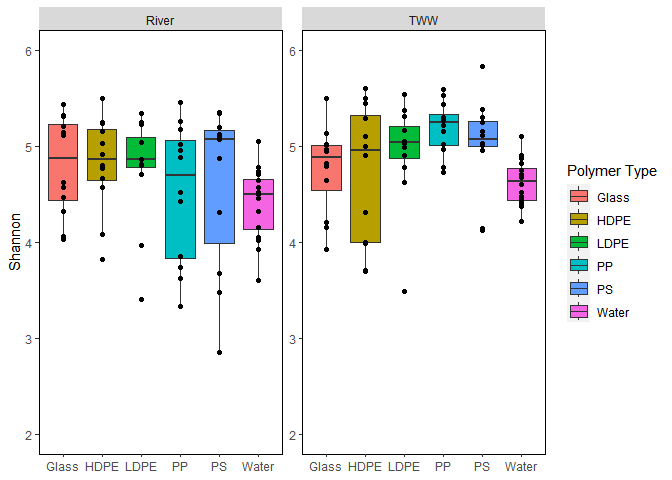
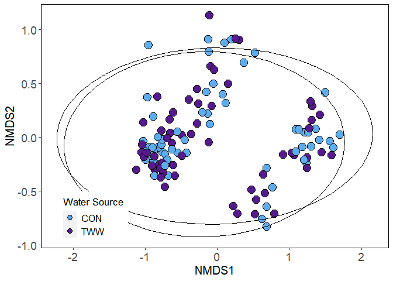
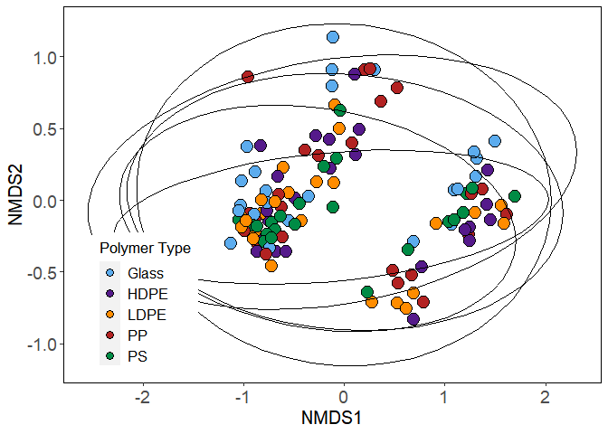
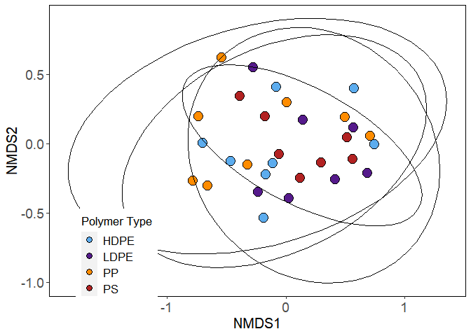

Analysis
================
Sarah Brown
2023-04-28

-   <a href="#1-load-packages-and-import-data"
    id="toc-1-load-packages-and-import-data">1 Load Packages and Import
    Data</a>
-   <a href="#2-preparing-the-data" id="toc-2-preparing-the-data">2
    Preparing the Data</a>
-   <a href="#3-alpha-diversity" id="toc-3-alpha-diversity">3 Alpha
    Diversity</a>
    -   <a href="#31-calculate-shannon-diversity-per-sample"
        id="toc-31-calculate-shannon-diversity-per-sample">3.1 Calculate Shannon
        Diversity per Sample</a>
    -   <a href="#32-create-alpha-diversity-boxplots"
        id="toc-32-create-alpha-diversity-boxplots">3.2 Create Alpha Diversity
        Boxplots</a>
        -   <a href="#321-comparison-particles-vs-water"
            id="toc-321-comparison-particles-vs-water">3.2.1 Comparison: particles
            vs. water</a>
        -   <a
            href="#322-comparison-particle-types-microplastic-glass-or-water-between-effluent-sources"
            id="toc-322-comparison-particle-types-microplastic-glass-or-water-between-effluent-sources">3.2.2
            Comparison: particle types (microplastic, glass, or water) between
            effluent sources</a>
        -   <a href="#323-comparison-polymer-types-by-effluent-source"
            id="toc-323-comparison-polymer-types-by-effluent-source">3.2.3
            Comparison: polymer types by effluent source</a>
        -   <a href="#324-comparison-particle_type-glass-vs-microplastics-over-time"
            id="toc-324-comparison-particle_type-glass-vs-microplastics-over-time">3.2.4
            Comparison: particle_type (glass vs. microplastics) over time</a>
        -   <a href="#325-comparison-polymer-types-over-time"
            id="toc-325-comparison-polymer-types-over-time">3.2.5 Comparison:
            polymer types over time</a>
-   <a href="#4-alpha-diversity-statistics"
    id="toc-4-alpha-diversity-statistics">4 Alpha Diversity statistics</a>
-   <a href="#5-nmds-plots" id="toc-5-nmds-plots">5 NMDS plots</a>
    -   <a href="#51-nmds-of-all-data" id="toc-51-nmds-of-all-data">5.1 NMDS of
        all data</a>
    -   <a
        href="#52-nmds-of-particles-glass-and-mps-only-no-water-bray-curtis-dissimilarity"
        id="toc-52-nmds-of-particles-glass-and-mps-only-no-water-bray-curtis-dissimilarity">5.2
        NMDS of particles (glass and MPs) only, no water, Bray-Curtis
        dissimilarity</a>
    -   <a
        href="#53-nmds-of-particles-glass-and-mps-only-no-water-unifrac-dissimmilarity"
        id="toc-53-nmds-of-particles-glass-and-mps-only-no-water-unifrac-dissimmilarity">5.3
        NMDS of particles (glass and MPs) only, no water, Unifrac
        dissimmilarity</a>
    -   <a
        href="#54-nmds-of-particles-glass-and-mps-only-no-water-at-2-weeks-bray-curtis-dissimilarity"
        id="toc-54-nmds-of-particles-glass-and-mps-only-no-water-at-2-weeks-bray-curtis-dissimilarity">5.4
        NMDS of particles (glass and MPs) only, no water, at 2 weeks,
        Bray-Curtis dissimilarity</a>
    -   <a
        href="#55-nmds-of-particles-glass-and-mps-only-no-water-at-6-weeks-bray-curtis-dissimilarity"
        id="toc-55-nmds-of-particles-glass-and-mps-only-no-water-at-6-weeks-bray-curtis-dissimilarity">5.5
        NMDS of particles (glass and MPs) only, no water, at 6 weeks,
        Bray-Curtis dissimilarity</a>
    -   <a
        href="#56-nmds-of-particles-glass-and-mps-only-no-water-at-10-weeks-bray-curtis-dissimilarity"
        id="toc-56-nmds-of-particles-glass-and-mps-only-no-water-at-10-weeks-bray-curtis-dissimilarity">5.6
        NMDS of particles (glass and MPs) only, no water, at 10 weeks,
        Bray-Curtis dissimilarity</a>
    -   <a href="#57-nmds-of-mps-only-bray-curtis-dissimilarity"
        id="toc-57-nmds-of-mps-only-bray-curtis-dissimilarity">5.7 NMDS of MP’s
        only, Bray-Curtis dissimilarity</a>
    -   <a href="#58-nmds-of-mps-only-at-2-weeks-bray-curtis-dissimilarity"
        id="toc-58-nmds-of-mps-only-at-2-weeks-bray-curtis-dissimilarity">5.8
        NMDS of MP’s only, at 2 weeks, Bray-Curtis dissimilarity</a>
    -   <a href="#59-nmds-of-mps-only-at-6-weeks-bray-curtis-dissimilarity"
        id="toc-59-nmds-of-mps-only-at-6-weeks-bray-curtis-dissimilarity">5.9
        NMDS of MP’s only, at 6 weeks, Bray-Curtis dissimilarity</a>
    -   <a href="#510-nmds-of-mps-only-at-10-weeks-bray-curtis-dissimilarity"
        id="toc-510-nmds-of-mps-only-at-10-weeks-bray-curtis-dissimilarity">5.10
        NMDS of MP’s only, at 10 weeks, Bray-Curtis dissimilarity</a>
-   <a href="#6-permanova-analysis" id="toc-6-permanova-analysis">6
    PERMANOVA Analysis</a>
    -   <a
        href="#61-permanova-analysis-of-particles-glass-and-mps-only-no-water-bray-and-unifrac"
        id="toc-61-permanova-analysis-of-particles-glass-and-mps-only-no-water-bray-and-unifrac">6.1
        PERMANOVA analysis of particles (glass and MPs) only, no water, bray and
        unifrac</a>
    -   <a
        href="#62-permanova-analysis-of-particles-glass-and-mps-only-no-water-at-2-weeks-bray"
        id="toc-62-permanova-analysis-of-particles-glass-and-mps-only-no-water-at-2-weeks-bray">6.2
        PERMANOVA analysis of particles (glass and MPs) only, no water at 2
        weeks, bray</a>
    -   <a
        href="#63-permanova-analysis-of-particles-glass-and-mps-only-no-water-at-6-weeks-bray"
        id="toc-63-permanova-analysis-of-particles-glass-and-mps-only-no-water-at-6-weeks-bray">6.3
        PERMANOVA analysis of particles (glass and MPs) only, no water at 6
        weeks, bray</a>
    -   <a
        href="#64-permanova-analysis-of-particles-glass-and-mps-only-no-water-at-10-weeks-bray"
        id="toc-64-permanova-analysis-of-particles-glass-and-mps-only-no-water-at-10-weeks-bray">6.4
        PERMANOVA analysis of particles (glass and MPs) only, no water at 10
        weeks, bray</a>
    -   <a
        href="#65-permanova-analysis-of-plastics-only-no-water-no-glass-at-2-weeks-bray"
        id="toc-65-permanova-analysis-of-plastics-only-no-water-no-glass-at-2-weeks-bray">6.5
        PERMANOVA analysis of plastics only, no water, no glass, at 2 weeks,
        bray</a>
    -   <a
        href="#66-permanova-analysis-of-plastics-only-no-water-no-glass-at-6-weeks-bray"
        id="toc-66-permanova-analysis-of-plastics-only-no-water-no-glass-at-6-weeks-bray">6.6
        PERMANOVA analysis of plastics only, no water, no glass, at 6 weeks,
        bray</a>
    -   <a
        href="#67-permanova-analysis-of-plastics-only-no-water-no-glass-at-10-weeks-bray"
        id="toc-67-permanova-analysis-of-plastics-only-no-water-no-glass-at-10-weeks-bray">6.7
        PERMANOVA analysis of plastics only, no water, no glass, at 10 weeks,
        bray</a>
-   <a href="#7-preliminary-data-fix" id="toc-7-preliminary-data-fix">7
    Preliminary Data Fix</a>
-   <a href="#8-differential-abundance-with-deseq2"
    id="toc-8-differential-abundance-with-deseq2">8 Differential abundance
    with DESeq2</a>
    -   <a href="#81-filtering-the-phyloseq-object"
        id="toc-81-filtering-the-phyloseq-object">8.1 Filtering the phyloseq
        object</a>
    -   <a href="#82-tww-vs-water-mp-only-all-timepoints"
        id="toc-82-tww-vs-water-mp-only-all-timepoints">8.2 TWW vs Water, MP
        Only, all timepoints</a>
        -   <a href="#821-create-dot-plot-of-results---log-normalized-counts"
            id="toc-821-create-dot-plot-of-results---log-normalized-counts">8.2.1
            Create dot plot of results - log normalized counts</a>
    -   <a
        href="#83-examining-changes-in-bacterial-communities-on-glass-beads-over-time"
        id="toc-83-examining-changes-in-bacterial-communities-on-glass-beads-over-time">8.3
        Examining changes in bacterial communities on glass beads over time</a>
        -   <a
            href="#831-contrasts---2w-6w-10w-river-water-glass-only-vs-river-water"
            id="toc-831-contrasts---2w-6w-10w-river-water-glass-only-vs-river-water">8.3.1
            Contrasts - 2w, 6w, 10w river water glass only, vs river water</a>
        -   <a href="#832-contrasts---2w-6w-10w-tww-glass-only-vs-tww"
            id="toc-832-contrasts---2w-6w-10w-tww-glass-only-vs-tww">8.3.2 Contrasts
            - 2w, 6w, 10w TWW Glass only, vs TWW</a>
    -   <a
        href="#84-examining-changes-in-bacterial-communities-on-microplastics-over-time"
        id="toc-84-examining-changes-in-bacterial-communities-on-microplastics-over-time">8.4
        Examining changes in bacterial communities on microplastics over
        time</a>
        -   <a href="#841-contrasts---2w-6w-10w-river-water-mps-only-vs-river-water"
            id="toc-841-contrasts---2w-6w-10w-river-water-mps-only-vs-river-water">8.4.1
            Contrasts - 2w, 6w, 10w river water MP’s only, vs river water</a>
        -   <a href="#842-contrasts---2w-6w-10w-tww-mps-only-vs-tww"
            id="toc-842-contrasts---2w-6w-10w-tww-mps-only-vs-tww">8.4.2 Contrasts -
            2w, 6w, 10w TWW MP’s only, vs TWW</a>
        -   <a href="#843-venn-diagrams" id="toc-843-venn-diagrams">8.4.3 Venn
            Diagrams</a>
        -   <a href="#844-superexacttest" id="toc-844-superexacttest">8.4.4
            SuperExactTest</a>
    -   <a
        href="#85-comparing-bacterial-community-composition-between-glass-and-microplastics"
        id="toc-85-comparing-bacterial-community-composition-between-glass-and-microplastics">8.5
        Comparing bacterial community composition between glass and
        microplastics</a>
        -   <a href="#851-venn-diagram-river-water"
            id="toc-851-venn-diagram-river-water">8.5.1 Venn Diagram, river
            water</a>
        -   <a href="#852-venn-diagram-tww" id="toc-852-venn-diagram-tww">8.5.2 Venn
            Diagram, TWW</a>
-   <a href="#9-nmds-plots---filtered-dataset"
    id="toc-9-nmds-plots---filtered-dataset">9 NMDS plots - filtered
    dataset</a>
-   <a href="#10-session-info" id="toc-10-session-info">10 Session Info</a>

# 1 Load Packages and Import Data

Here, we import the .qza files exported from QIIME2 using the qiime2R
package. The final object is a phyloseq object called MPphyseq.

``` r
library(ggplot2)
library(vegan)
```

    ## Loading required package: permute

    ## Loading required package: lattice

    ## This is vegan 2.6-4

``` r
library(plyr)
library(dplyr)
```

    ## 
    ## Attaching package: 'dplyr'

    ## The following objects are masked from 'package:plyr':
    ## 
    ##     arrange, count, desc, failwith, id, mutate, rename, summarise,
    ##     summarize

    ## The following objects are masked from 'package:stats':
    ## 
    ##     filter, lag

    ## The following objects are masked from 'package:base':
    ## 
    ##     intersect, setdiff, setequal, union

``` r
library(scales)
library(grid)
library(reshape2)
library(phyloseq)
library(picante)
```

    ## Loading required package: ape

    ## 
    ## Attaching package: 'ape'

    ## The following object is masked from 'package:dplyr':
    ## 
    ##     where

    ## Loading required package: nlme

    ## 
    ## Attaching package: 'nlme'

    ## The following object is masked from 'package:dplyr':
    ## 
    ##     collapse

``` r
library(tidyr)
```

    ## 
    ## Attaching package: 'tidyr'

    ## The following object is masked from 'package:reshape2':
    ## 
    ##     smiths

``` r
library(viridis)
```

    ## Loading required package: viridisLite

    ## 
    ## Attaching package: 'viridis'

    ## The following object is masked from 'package:scales':
    ## 
    ##     viridis_pal

``` r
library(qiime2R)
library(DESeq2)
```

    ## Loading required package: S4Vectors

    ## Loading required package: stats4

    ## Loading required package: BiocGenerics

    ## 
    ## Attaching package: 'BiocGenerics'

    ## The following objects are masked from 'package:dplyr':
    ## 
    ##     combine, intersect, setdiff, union

    ## The following objects are masked from 'package:stats':
    ## 
    ##     IQR, mad, sd, var, xtabs

    ## The following objects are masked from 'package:base':
    ## 
    ##     anyDuplicated, aperm, append, as.data.frame, basename, cbind,
    ##     colnames, dirname, do.call, duplicated, eval, evalq, Filter, Find,
    ##     get, grep, grepl, intersect, is.unsorted, lapply, Map, mapply,
    ##     match, mget, order, paste, pmax, pmax.int, pmin, pmin.int,
    ##     Position, rank, rbind, Reduce, rownames, sapply, setdiff, sort,
    ##     table, tapply, union, unique, unsplit, which.max, which.min

    ## 
    ## Attaching package: 'S4Vectors'

    ## The following object is masked from 'package:tidyr':
    ## 
    ##     expand

    ## The following objects are masked from 'package:dplyr':
    ## 
    ##     first, rename

    ## The following object is masked from 'package:plyr':
    ## 
    ##     rename

    ## The following objects are masked from 'package:base':
    ## 
    ##     expand.grid, I, unname

    ## Loading required package: IRanges

    ## 
    ## Attaching package: 'IRanges'

    ## The following object is masked from 'package:nlme':
    ## 
    ##     collapse

    ## The following object is masked from 'package:phyloseq':
    ## 
    ##     distance

    ## The following objects are masked from 'package:dplyr':
    ## 
    ##     collapse, desc, slice

    ## The following object is masked from 'package:plyr':
    ## 
    ##     desc

    ## The following object is masked from 'package:grDevices':
    ## 
    ##     windows

    ## Loading required package: GenomicRanges

    ## Loading required package: GenomeInfoDb

    ## Loading required package: SummarizedExperiment

    ## Loading required package: MatrixGenerics

    ## Loading required package: matrixStats

    ## 
    ## Attaching package: 'matrixStats'

    ## The following object is masked from 'package:dplyr':
    ## 
    ##     count

    ## The following object is masked from 'package:plyr':
    ## 
    ##     count

    ## 
    ## Attaching package: 'MatrixGenerics'

    ## The following objects are masked from 'package:matrixStats':
    ## 
    ##     colAlls, colAnyNAs, colAnys, colAvgsPerRowSet, colCollapse,
    ##     colCounts, colCummaxs, colCummins, colCumprods, colCumsums,
    ##     colDiffs, colIQRDiffs, colIQRs, colLogSumExps, colMadDiffs,
    ##     colMads, colMaxs, colMeans2, colMedians, colMins, colOrderStats,
    ##     colProds, colQuantiles, colRanges, colRanks, colSdDiffs, colSds,
    ##     colSums2, colTabulates, colVarDiffs, colVars, colWeightedMads,
    ##     colWeightedMeans, colWeightedMedians, colWeightedSds,
    ##     colWeightedVars, rowAlls, rowAnyNAs, rowAnys, rowAvgsPerColSet,
    ##     rowCollapse, rowCounts, rowCummaxs, rowCummins, rowCumprods,
    ##     rowCumsums, rowDiffs, rowIQRDiffs, rowIQRs, rowLogSumExps,
    ##     rowMadDiffs, rowMads, rowMaxs, rowMeans2, rowMedians, rowMins,
    ##     rowOrderStats, rowProds, rowQuantiles, rowRanges, rowRanks,
    ##     rowSdDiffs, rowSds, rowSums2, rowTabulates, rowVarDiffs, rowVars,
    ##     rowWeightedMads, rowWeightedMeans, rowWeightedMedians,
    ##     rowWeightedSds, rowWeightedVars

    ## Loading required package: Biobase

    ## Welcome to Bioconductor
    ## 
    ##     Vignettes contain introductory material; view with
    ##     'browseVignettes()'. To cite Bioconductor, see
    ##     'citation("Biobase")', and for packages 'citation("pkgname")'.

    ## 
    ## Attaching package: 'Biobase'

    ## The following object is masked from 'package:MatrixGenerics':
    ## 
    ##     rowMedians

    ## The following objects are masked from 'package:matrixStats':
    ## 
    ##     anyMissing, rowMedians

    ## The following object is masked from 'package:phyloseq':
    ## 
    ##     sampleNames

``` r
library(patchwork)
library(RColorBrewer)
library(microViz)
```

    ## microViz version 0.10.8 - Copyright (C) 2022 David Barnett
    ## ! Website: https://david-barnett.github.io/microViz
    ## ✔ Useful?  For citation details, run: `citation("microViz")`
    ## ✖ Silence? `suppressPackageStartupMessages(library(microViz))`

``` r
library(speedyseq)
```

    ## 
    ## Attaching package: 'speedyseq'

    ## The following objects are masked from 'package:phyloseq':
    ## 
    ##     filter_taxa, plot_bar, plot_heatmap, plot_tree, psmelt, tax_glom,
    ##     tip_glom, transform_sample_counts

``` r
library(ComplexHeatmap)
```

    ## ========================================
    ## ComplexHeatmap version 2.14.0
    ## Bioconductor page: http://bioconductor.org/packages/ComplexHeatmap/
    ## Github page: https://github.com/jokergoo/ComplexHeatmap
    ## Documentation: http://jokergoo.github.io/ComplexHeatmap-reference
    ## 
    ## If you use it in published research, please cite either one:
    ## - Gu, Z. Complex Heatmap Visualization. iMeta 2022.
    ## - Gu, Z. Complex heatmaps reveal patterns and correlations in multidimensional 
    ##     genomic data. Bioinformatics 2016.
    ## 
    ## 
    ## The new InteractiveComplexHeatmap package can directly export static 
    ## complex heatmaps into an interactive Shiny app with zero effort. Have a try!
    ## 
    ## This message can be suppressed by:
    ##   suppressPackageStartupMessages(library(ComplexHeatmap))
    ## ========================================

``` r
library(ggVennDiagram)
library(SuperExactTest)
```

    ## 
    ## Attaching package: 'SuperExactTest'

    ## The following objects are masked from 'package:GenomicRanges':
    ## 
    ##     intersect, union

    ## The following object is masked from 'package:GenomeInfoDb':
    ## 
    ##     intersect

    ## The following objects are masked from 'package:IRanges':
    ## 
    ##     intersect, union

    ## The following objects are masked from 'package:S4Vectors':
    ## 
    ##     intersect, union

    ## The following objects are masked from 'package:BiocGenerics':
    ## 
    ##     intersect, union

    ## The following objects are masked from 'package:dplyr':
    ## 
    ##     intersect, union

    ## The following objects are masked from 'package:base':
    ## 
    ##     intersect, union

``` r
library(nVennR)

set.seed(13289)

#Create a phyloseq object from the .qza files exported from qiime2 using 
#the qiime2R package
MPphyseq <- qza_to_phyloseq(
  features="Qiime output/dada2-table.qza",
  tree="Qiime output/rooted-tree.qza",
  taxonomy="Qiime output/MP-taxonomy.qza",
  metadata = "Qiime output/MP-metadata.tsv"
)
```

# 2 Preparing the Data

Before performing any analyses, we need to examine the phyloseq object
and remove chloroplast and mitochondrial sequences:

``` r
#Check the rank names to make sure they are accurate
rank_names(MPphyseq)
```

    ## [1] "Kingdom" "Phylum"  "Class"   "Order"   "Family"  "Genus"   "Species"

``` r
#Correct output:[1] "Kingdom" "Phylum"  "Class"   "Order"   "Family"  
#                   "Genus"   "Species"

#Check sample variables
sample_variables(MPphyseq)
```

    ## [1] "effluent"               "week"                   "polymer_type"          
    ## [4] "bead_diameter"          "Channel"                "sample_type"           
    ## [7] "particle_type"          "particle_effluent"      "particle_effluent_time"

``` r
#Remove chloroplast sequences and any contaminant sequences
MPphyseq <- subset_taxa(MPphyseq, Kingdom != "d__Eukaryota")
MPphyseq <- subset_taxa(MPphyseq, Kingdom != "d__Archaea")
MPphyseq <- subset_taxa(MPphyseq, Order != "o__Chloroplast")
MPphyseq <- subset_taxa(MPphyseq, Order != "Chloroplast")
MPphyseq <- subset_taxa(MPphyseq, Family != "f__Mitochondria")
MPphyseq <- subset_taxa(MPphyseq, Family != "Mitochondria")

#Check that contaminant sequences are removed (easiest to save as data frame and search)
taxtabl <- as.data.frame(tax_table(MPphyseq))

#At this point, blanks and positive controls should also be removed
MPphyseq = subset_samples(MPphyseq, effluent != "FB")
```

``` r
#Examining the total number of reads and ASV's
readsumsdf = data.frame(nreads = sort(taxa_sums(MPphyseq), TRUE), 
                        sorted = 1:ntaxa(MPphyseq), type = "ASVs")
readsumsdf = rbind(readsumsdf, data.frame(nreads = sort(sample_sums(MPphyseq), 
                        TRUE), sorted = 1:nsamples(MPphyseq), type = "Samples"))
title = "Total number of reads"
p = ggplot(readsumsdf, aes(x = sorted, y = nreads)) + geom_bar(stat = "identity")
p + ggtitle(title) + scale_y_log10() + facet_wrap(~type, 1, scales = "free")
```

<!-- -->

``` r
#Rarefaction curve using vegan
#From: https://micca.readthedocs.io/en/latest/phyloseq.html
taxa_are_rows(MPphyseq)
```

    ## [1] TRUE

``` r
mat <- t(otu_table(MPphyseq))
class(mat) <- "matrix"
```

    ## Warning in class(mat) <- "matrix": Setting class(x) to "matrix" sets attribute
    ## to NULL; result will no longer be an S4 object

``` r
class(mat)
```

    ## [1] "matrix" "array"

``` r
mat <- as(t(otu_table(MPphyseq)), "matrix")
class(mat)
```

    ## [1] "matrix" "array"

``` r
raremax <- min(rowSums(mat))

system.time(rarecurve(mat, step = 100, sample = raremax, col = "blue", label = FALSE))
```

    ## Warning in rarecurve(mat, step = 100, sample = raremax, col = "blue", label =
    ## FALSE): most observed count data have counts 1, but smallest count is 2

<!-- -->

    ##    user  system elapsed 
    ##   23.69    1.72   25.63

``` r
#Re-label the variables; if you type in MPphyseq you will see that sample_data 
#is the matrix that holds the information that we want to change, so we need to 
#include sample_data in our code here

#Order factors
sample_data(MPphyseq)$effluent <- factor(sample_data(MPphyseq)$effluent, 
                                           levels = c("CON", "TWW"),
                                           labels = c("CON", "TWW"))

sample_data(MPphyseq)$polymer_type <- factor(sample_data(MPphyseq)$polymer_type, 
                                               levels = c("Glass", "HDPE", "LDPE", "PP", "PS", "water"),
                                               labels = c("Glass", "HDPE", "LDPE", "PP", "PS", "Water"))

sample_data(MPphyseq)$week <- factor(sample_data(MPphyseq)$week, 
                                       levels = c("0", "2", "6", "10"),
                                       labels = c("0", "2", "6", "10"))

sample_data(MPphyseq)$sample_type <- factor(sample_data(MPphyseq)$sample_type, 
                                              levels = c("Particle", "water"),
                                              labels = c("Particle", "Water"))

sample_data(MPphyseq)$particle_type <- factor(sample_data(MPphyseq)$particle_type, 
                                                levels = c("MP", "Glass", "water"),
                                                labels = c("MP", "Glass", "Water"))


#Transform to relative abundance. Save as new object.
MPphyseqRA = transform_sample_counts(MPphyseq, function(x){x / sum(x)})

#Subset samples into groups
sample_data(MPphyseqRA)
```

    ## Sample Data:        [ 151 samples by 9 sample variables ]:
    ##                effluent week  polymer_type bead_diameter Channel sample_type
    ##                <fct>    <fct> <fct>                <dbl> <fct>   <fct>      
    ##  1 ESF21MP-100 CON      10    HDPE                  3.18 7.1     Particle   
    ##  2 ESF21MP-101 TWW      10    HDPE                  3.18 5.2     Particle   
    ##  3 ESF21MP-102 CON      10    LDPE                  3.18 7.2     Particle   
    ##  4 ESF21MP-103 TWW      10    PP                    3.18 5.2     Particle   
    ##  5 ESF21MP-104 CON      10    PP                    3.18 7.2     Particle   
    ##  6 ESF21MP-105 TWW      10    HDPE                  3.18 8.1     Particle   
    ##  7 ESF21MP-106 CON      10    LDPE                  3.18 7.1     Particle   
    ##  8 ESF21MP-107 TWW      10    HDPE                  3.18 5.1     Particle   
    ##  9 ESF21MP-108 CON      10    LDPE                  3.18 8.2     Particle   
    ## 10 ESF21MP-109 CON      10    PP                    3.18 8.2     Particle   
    ## # ℹ 141 more samples
    ## # ℹ 3 more variables: particle_type <fct>, particle_effluent <fct>,
    ## #   particle_effluent_time <fct>

``` r
mp.con <- subset_samples(MPphyseqRA, effluent == "CON")
sample_data(mp.con)
```

    ## Sample Data:        [ 75 samples by 9 sample variables ]:
    ##                effluent week  polymer_type bead_diameter Channel sample_type
    ##                <fct>    <fct> <fct>                <dbl> <fct>   <fct>      
    ##  1 ESF21MP-100 CON      10    HDPE                  3.18 7.1     Particle   
    ##  2 ESF21MP-102 CON      10    LDPE                  3.18 7.2     Particle   
    ##  3 ESF21MP-104 CON      10    PP                    3.18 7.2     Particle   
    ##  4 ESF21MP-106 CON      10    LDPE                  3.18 7.1     Particle   
    ##  5 ESF21MP-108 CON      10    LDPE                  3.18 8.2     Particle   
    ##  6 ESF21MP-109 CON      10    PP                    3.18 8.2     Particle   
    ##  7 ESF21MP-111 CON      10    HDPE                  3.18 6.1     Particle   
    ##  8 ESF21MP-112 CON      10    Glass                 3.18 8.2     Particle   
    ##  9 ESF21MP-114 CON      10    PS                    3.18 7.2     Particle   
    ## 10 ESF21MP-117 CON      10    Glass                 3.18 7.1     Particle   
    ## # ℹ 65 more samples
    ## # ℹ 3 more variables: particle_type <fct>, particle_effluent <fct>,
    ## #   particle_effluent_time <fct>

``` r
mp.tww <- subset_samples(MPphyseqRA, effluent == "TWW")
sample_data(mp.tww)
```

    ## Sample Data:        [ 76 samples by 9 sample variables ]:
    ##                effluent week  polymer_type bead_diameter Channel sample_type
    ##                <fct>    <fct> <fct>                <dbl> <fct>   <fct>      
    ##  1 ESF21MP-101 TWW      10    HDPE                  3.18 5.2     Particle   
    ##  2 ESF21MP-103 TWW      10    PP                    3.18 5.2     Particle   
    ##  3 ESF21MP-105 TWW      10    HDPE                  3.18 8.1     Particle   
    ##  4 ESF21MP-107 TWW      10    HDPE                  3.18 5.1     Particle   
    ##  5 ESF21MP-110 TWW      10    HDPE                  3.18 6.2     Particle   
    ##  6 ESF21MP-113 TWW      10    LDPE                  3.18 6.2     Particle   
    ##  7 ESF21MP-115 TWW      10    Glass                 3.18 5.2     Particle   
    ##  8 ESF21MP-116 TWW      10    PP                    3.18 6.2     Particle   
    ##  9 ESF21MP-123 TWW      10    PS                    3.18 6.2     Particle   
    ## 10 ESF21MP-126 TWW      10    PP                    3.18 5.1     Particle   
    ## # ℹ 66 more samples
    ## # ℹ 3 more variables: particle_type <fct>, particle_effluent <fct>,
    ## #   particle_effluent_time <fct>

# 3 Alpha Diversity

Note that these data are not rarefied. We’ll use the Shannon diversity
index (based on richness AND evenness; examines how many different taxa
are present and how evenly they’re distributed within a sample) to
analyze alpha diversity between variable types. This means it considers
both the number of species and the inequality between species
abundances.

## 3.1 Calculate Shannon Diversity per Sample

Using the estimate_richness function in the phyloseq package to
calculate Shannon diversity. The estimate_richness function can also
take measures “Chao1” “ACE” “Simpson” and “Fisher”.

Note that running this code results in an error message stating that the
provided data does not have any singletons. See here for more
information:

<https://github.com/benjjneb/dada2/issues/214>

<https://forum.qiime2.org/t/singletons-and-diversity-richness-indices/2971/9>

``` r
#Calculating richness - Shannon diversity in a new dataframe
richness <- data.frame(estimate_richness(MPphyseqRA, measures = c("Shannon")))
richness <- setNames(cbind(rownames(richness), richness, row.names = NULL), 
                     c("sample-id", "Shannon"))

#Add the sample metadata to the dataframe
s <- data.frame(sample_data(MPphyseqRA))
s <- setNames(cbind(rownames(s), s, row.names = NULL), 
              c("sample-id", "effluent", "week", "polymer_type", 
                "bead_diameter", "Channel", "sample_type", "particle_type",
                "particle_effluent", "particle_effluent_time"))

alphadiv <- merge(s, richness, by = "sample-id")

#Order factors
alphadiv$polymer_type <- factor(alphadiv$polymer_type, 
                        levels = c("Glass", "HDPE", "LDPE", "PP", "PS", "Water"),
                        labels = c("Glass", "HDPE", "LDPE", "PP", "PS", "Water")) 

#Shows the calculated indices
knitr::kable(head(alphadiv)) %>% 
  kableExtra::kable_styling("striped", 
                            latex_options="scale_down") %>% 
  kableExtra::scroll_box(width = "100%")
```

<div
style="border: 1px solid #ddd; padding: 5px; overflow-x: scroll; width:100%; ">

<table class="table table-striped" style="margin-left: auto; margin-right: auto;">
<thead>
<tr>
<th style="text-align:left;">

sample-id

</th>
<th style="text-align:left;">

effluent

</th>
<th style="text-align:left;">

week

</th>
<th style="text-align:left;">

polymer_type

</th>
<th style="text-align:right;">

bead_diameter

</th>
<th style="text-align:left;">

Channel

</th>
<th style="text-align:left;">

sample_type

</th>
<th style="text-align:left;">

particle_type

</th>
<th style="text-align:left;">

particle_effluent

</th>
<th style="text-align:left;">

particle_effluent_time

</th>
<th style="text-align:right;">

Shannon

</th>
</tr>
</thead>
<tbody>
<tr>
<td style="text-align:left;">

ESF21MP-100

</td>
<td style="text-align:left;">

CON

</td>
<td style="text-align:left;">

10

</td>
<td style="text-align:left;">

HDPE

</td>
<td style="text-align:right;">

3.175

</td>
<td style="text-align:left;">

7.1

</td>
<td style="text-align:left;">

Particle

</td>
<td style="text-align:left;">

MP

</td>
<td style="text-align:left;">

MP_CON

</td>
<td style="text-align:left;">

MP_CON_10

</td>
<td style="text-align:right;">

5.500475

</td>
</tr>
<tr>
<td style="text-align:left;">

ESF21MP-101

</td>
<td style="text-align:left;">

TWW

</td>
<td style="text-align:left;">

10

</td>
<td style="text-align:left;">

HDPE

</td>
<td style="text-align:right;">

3.175

</td>
<td style="text-align:left;">

5.2

</td>
<td style="text-align:left;">

Particle

</td>
<td style="text-align:left;">

MP

</td>
<td style="text-align:left;">

MP_TWW

</td>
<td style="text-align:left;">

MP_TWW_10

</td>
<td style="text-align:right;">

5.285657

</td>
</tr>
<tr>
<td style="text-align:left;">

ESF21MP-102

</td>
<td style="text-align:left;">

CON

</td>
<td style="text-align:left;">

10

</td>
<td style="text-align:left;">

LDPE

</td>
<td style="text-align:right;">

3.175

</td>
<td style="text-align:left;">

7.2

</td>
<td style="text-align:left;">

Particle

</td>
<td style="text-align:left;">

MP

</td>
<td style="text-align:left;">

MP_CON

</td>
<td style="text-align:left;">

MP_CON_10

</td>
<td style="text-align:right;">

5.045258

</td>
</tr>
<tr>
<td style="text-align:left;">

ESF21MP-103

</td>
<td style="text-align:left;">

TWW

</td>
<td style="text-align:left;">

10

</td>
<td style="text-align:left;">

PP

</td>
<td style="text-align:right;">

3.175

</td>
<td style="text-align:left;">

5.2

</td>
<td style="text-align:left;">

Particle

</td>
<td style="text-align:left;">

MP

</td>
<td style="text-align:left;">

MP_TWW

</td>
<td style="text-align:left;">

MP_TWW_10

</td>
<td style="text-align:right;">

5.439320

</td>
</tr>
<tr>
<td style="text-align:left;">

ESF21MP-104

</td>
<td style="text-align:left;">

CON

</td>
<td style="text-align:left;">

10

</td>
<td style="text-align:left;">

PP

</td>
<td style="text-align:right;">

3.175

</td>
<td style="text-align:left;">

7.2

</td>
<td style="text-align:left;">

Particle

</td>
<td style="text-align:left;">

MP

</td>
<td style="text-align:left;">

MP_CON

</td>
<td style="text-align:left;">

MP_CON_10

</td>
<td style="text-align:right;">

5.174548

</td>
</tr>
<tr>
<td style="text-align:left;">

ESF21MP-105

</td>
<td style="text-align:left;">

TWW

</td>
<td style="text-align:left;">

10

</td>
<td style="text-align:left;">

HDPE

</td>
<td style="text-align:right;">

3.175

</td>
<td style="text-align:left;">

8.1

</td>
<td style="text-align:left;">

Particle

</td>
<td style="text-align:left;">

MP

</td>
<td style="text-align:left;">

MP_TWW

</td>
<td style="text-align:left;">

MP_TWW_10

</td>
<td style="text-align:right;">

3.987267

</td>
</tr>
</tbody>
</table>

</div>

## 3.2 Create Alpha Diversity Boxplots

### 3.2.1 Comparison: particles vs. water

``` r
#Plot
ggplot(data=alphadiv, aes(x=sample_type, y=Shannon), alpha=0.1) + 
  geom_boxplot(aes(fill=sample_type)) +
  geom_point(position=position_dodge(width=0.75),aes(group=sample_type)) +
  facet_wrap(~effluent, scale="free") +
  theme(legend.position="right",
        panel.border = element_rect(colour = "black", fill = NA, size = 0.5), 
        panel.background = element_blank())
```

<!-- -->

### 3.2.2 Comparison: particle types (microplastic, glass, or water) between effluent sources

``` r
#Plot
ggplot(data=alphadiv, aes(x=effluent, y=Shannon), alpha=0.1) + 
  geom_boxplot(aes(fill=effluent)) +
  geom_point(position=position_dodge(width=0.75),aes(group=effluent)) +
  facet_wrap(~particle_type, scale="free") +
  theme(legend.position="right",
        panel.border = element_rect(colour = "black", fill = NA, size = 0.5), 
        panel.background = element_blank())
```

<!-- -->

### 3.2.3 Comparison: polymer types by effluent source

``` r
#Plot
ggplot(data=alphadiv, aes(x=polymer_type, y=Shannon), alpha=0.1) + 
  geom_boxplot(aes(fill=polymer_type)) +
  geom_point(position=position_dodge(width=0.75),aes(group=polymer_type)) +
  facet_wrap(~effluent, scale="free") +
  theme(legend.position="right",
        panel.border = element_rect(colour = "black", fill = NA, size = 0.5), 
        panel.background = element_blank())
```

<!-- -->

### 3.2.4 Comparison: particle_type (glass vs. microplastics) over time

``` r
#Remove Water from particle_type
alphadiv.particle <- filter(alphadiv, particle_type != "Water")
sample_data(alphadiv.particle)
```

    ## Sample Data:        [ 119 samples by 11 sample variables ]:
    ##          sample.id effluent week  polymer_type bead_diameter Channel sample_type
    ##          <chr>     <fct>    <fct> <fct>                <dbl> <fct>   <fct>      
    ##  1 sa1   ESF21MP-… CON      10    HDPE                  3.18 7.1     Particle   
    ##  2 sa2   ESF21MP-… TWW      10    HDPE                  3.18 5.2     Particle   
    ##  3 sa3   ESF21MP-… CON      10    LDPE                  3.18 7.2     Particle   
    ##  4 sa4   ESF21MP-… TWW      10    PP                    3.18 5.2     Particle   
    ##  5 sa5   ESF21MP-… CON      10    PP                    3.18 7.2     Particle   
    ##  6 sa6   ESF21MP-… TWW      10    HDPE                  3.18 8.1     Particle   
    ##  7 sa7   ESF21MP-… CON      10    LDPE                  3.18 7.1     Particle   
    ##  8 sa8   ESF21MP-… TWW      10    HDPE                  3.18 5.1     Particle   
    ##  9 sa9   ESF21MP-… CON      10    LDPE                  3.18 8.2     Particle   
    ## 10 sa10  ESF21MP-… CON      10    PP                    3.18 8.2     Particle   
    ## # ℹ 109 more samples
    ## # ℹ 4 more variables: particle_type <fct>, particle_effluent <fct>,
    ## #   particle_effluent_time <fct>, Shannon <dbl>

``` r
#Plot
ggplot(data=alphadiv.particle, aes(x=week, y=Shannon), alpha=0.1) + 
  geom_boxplot(aes(fill=particle_type)) +
  geom_point(position=position_dodge(width=0.75),aes(group=particle_type)) +
  facet_wrap(~effluent, scale="free") +
  theme(legend.position="right",
        panel.border = element_rect(colour = "black", fill = NA, size = 0.5), 
        panel.background = element_blank())
```

<!-- -->

### 3.2.5 Comparison: polymer types over time

``` r
#Plot
ggplot(data=alphadiv, aes(x=week, y=Shannon), alpha=0.1) + 
geom_boxplot(aes(fill=polymer_type)) +
  geom_point(position=position_dodge(width=0.75),aes(group=polymer_type)) +
  facet_wrap(~effluent, scale="free") +
  theme(legend.position="right",
        panel.border = element_rect(colour = "black", fill = NA, size = 0.5), 
        panel.background = element_blank())
```

<!-- -->

# 4 Alpha Diversity statistics

Use section 7.2
<https://microbiome.github.io/course_2021_radboud/alpha-diversity.html>

Some information from the tutorial linked above: “To further investigate
if patient status could explain the variation of Shannon index, let’s do
a Wilcoxon test. This is a non-parametric test that doesn’t make
specific assumptions about the distribution, unlike popular parametric
tests, such as the t test, which assumes normally distributed
observations. Wilcoxon test can be used to estimate whether the
differences between two groups is statistically significant.”

``` r
#Wilcoxon test, where Shannon index is the variable that we are comparing
#Wilcoxon pairwise test is a non-parametric alternative to paired t-test

#Subset data by water source
mp.con.shannon <- subset(alphadiv, effluent == "CON")
mp.tww.shannon <- subset(alphadiv, effluent == "TWW")

#Subset by particle type - microplastics only (particle_type = MP)
mp.only.shannon <- subset(alphadiv, particle_type == "MP")

#Subset MP only dataframe by water source
mp.only.con.shannon <- subset(mp.only.shannon, effluent == "CON")
mp.only.tww.shannon <- subset(mp.only.shannon, effluent == "TWW")


#Test for differences in MP alpha diversity between CON and TWW (does not include 
#glass or water)
wilcoxon_shannon_effluent <- wilcox.test(Shannon ~ effluent, data = mp.only.shannon)
wilcoxon_shannon_effluent
```

    ## 
    ##  Wilcoxon rank sum exact test
    ## 
    ## data:  Shannon by effluent
    ## W = 784, p-value = 0.01505
    ## alternative hypothesis: true location shift is not equal to 0

``` r
#Wilcoxon rank sum exact test
#data:  Shannon by effluent
#W = 784, p-value = 0.01505
#alternative hypothesis: true location shift is not equal to 0


#Wilcoxon pairwise test - CON polymer type
con.shan.wil <- pairwise.wilcox.test(mp.con.shannon$Shannon, mp.con.shannon$polymer_type, p.adjust.method="fdr", paired=FALSE) 
con.shan.wil
```

    ## 
    ##  Pairwise comparisons using Wilcoxon rank sum exact test 
    ## 
    ## data:  mp.con.shannon$Shannon and mp.con.shannon$polymer_type 
    ## 
    ##       Glass HDPE  LDPE  PP    PS   
    ## HDPE  0.977 -     -     -     -    
    ## LDPE  0.977 0.977 -     -     -    
    ## PP    0.944 0.944 0.977 -     -    
    ## PS    0.977 0.977 0.977 0.977 -    
    ## Water 0.265 0.084 0.084 0.977 0.608
    ## 
    ## P value adjustment method: fdr

``` r
#Convert output to dataframe
con.shan.wil <- as.data.frame(con.shan.wil$p.value)

#Create table of p-values
knitr::kable(con.shan.wil) %>% 
  kableExtra::kable_styling("striped", 
                            latex_options="scale_down") %>% 
  kableExtra::scroll_box(width = "100%")
```

<div
style="border: 1px solid #ddd; padding: 5px; overflow-x: scroll; width:100%; ">

<table class="table table-striped" style="margin-left: auto; margin-right: auto;">
<thead>
<tr>
<th style="text-align:left;">
</th>
<th style="text-align:right;">

Glass

</th>
<th style="text-align:right;">

HDPE

</th>
<th style="text-align:right;">

LDPE

</th>
<th style="text-align:right;">

PP

</th>
<th style="text-align:right;">

PS

</th>
</tr>
</thead>
<tbody>
<tr>
<td style="text-align:left;">

HDPE

</td>
<td style="text-align:right;">

0.9774022

</td>
<td style="text-align:right;">

NA

</td>
<td style="text-align:right;">

NA

</td>
<td style="text-align:right;">

NA

</td>
<td style="text-align:right;">

NA

</td>
</tr>
<tr>
<td style="text-align:left;">

LDPE

</td>
<td style="text-align:right;">

0.9774022

</td>
<td style="text-align:right;">

0.9774022

</td>
<td style="text-align:right;">

NA

</td>
<td style="text-align:right;">

NA

</td>
<td style="text-align:right;">

NA

</td>
</tr>
<tr>
<td style="text-align:left;">

PP

</td>
<td style="text-align:right;">

0.9442133

</td>
<td style="text-align:right;">

0.9442133

</td>
<td style="text-align:right;">

0.9774022

</td>
<td style="text-align:right;">

NA

</td>
<td style="text-align:right;">

NA

</td>
</tr>
<tr>
<td style="text-align:left;">

PS

</td>
<td style="text-align:right;">

0.9774022

</td>
<td style="text-align:right;">

0.9774022

</td>
<td style="text-align:right;">

0.9774022

</td>
<td style="text-align:right;">

0.9774022

</td>
<td style="text-align:right;">

NA

</td>
</tr>
<tr>
<td style="text-align:left;">

Water

</td>
<td style="text-align:right;">

0.2649686

</td>
<td style="text-align:right;">

0.0844438

</td>
<td style="text-align:right;">

0.0844438

</td>
<td style="text-align:right;">

0.9774022

</td>
<td style="text-align:right;">

0.6084454

</td>
</tr>
</tbody>
</table>

</div>

``` r
#Wilcoxon pairwise test - TWW polymer type
tww.shan.wil <- pairwise.wilcox.test(mp.tww.shannon$Shannon, mp.tww.shannon$polymer_type, p.adjust.method="fdr", paired=FALSE) 
tww.shan.wil
```

    ## 
    ##  Pairwise comparisons using Wilcoxon rank sum exact test 
    ## 
    ## data:  mp.tww.shannon$Shannon and mp.tww.shannon$polymer_type 
    ## 
    ##       Glass   HDPE    LDPE    PP      PS     
    ## HDPE  0.93230 -       -       -       -      
    ## LDPE  0.38182 0.77384 -       -       -      
    ## PP    0.04535 0.38182 0.48557 -       -      
    ## PS    0.23407 0.51503 0.85580 0.51503 -      
    ## Water 0.38496 0.70948 0.01961 0.00019 0.02198
    ## 
    ## P value adjustment method: fdr

``` r
#Convert output to dataframe
tww.shan.wil <- as.data.frame(tww.shan.wil$p.value)

#Create table of p-values
knitr::kable(tww.shan.wil) %>% 
  kableExtra::kable_styling("striped", 
                            latex_options="scale_down") %>% 
  kableExtra::scroll_box(width = "100%")
```

<div
style="border: 1px solid #ddd; padding: 5px; overflow-x: scroll; width:100%; ">

<table class="table table-striped" style="margin-left: auto; margin-right: auto;">
<thead>
<tr>
<th style="text-align:left;">
</th>
<th style="text-align:right;">

Glass

</th>
<th style="text-align:right;">

HDPE

</th>
<th style="text-align:right;">

LDPE

</th>
<th style="text-align:right;">

PP

</th>
<th style="text-align:right;">

PS

</th>
</tr>
</thead>
<tbody>
<tr>
<td style="text-align:left;">

HDPE

</td>
<td style="text-align:right;">

0.9323005

</td>
<td style="text-align:right;">

NA

</td>
<td style="text-align:right;">

NA

</td>
<td style="text-align:right;">

NA

</td>
<td style="text-align:right;">

NA

</td>
</tr>
<tr>
<td style="text-align:left;">

LDPE

</td>
<td style="text-align:right;">

0.3818186

</td>
<td style="text-align:right;">

0.7738379

</td>
<td style="text-align:right;">

NA

</td>
<td style="text-align:right;">

NA

</td>
<td style="text-align:right;">

NA

</td>
</tr>
<tr>
<td style="text-align:left;">

PP

</td>
<td style="text-align:right;">

0.0453524

</td>
<td style="text-align:right;">

0.3818186

</td>
<td style="text-align:right;">

0.4855711

</td>
<td style="text-align:right;">

NA

</td>
<td style="text-align:right;">

NA

</td>
</tr>
<tr>
<td style="text-align:left;">

PS

</td>
<td style="text-align:right;">

0.2340730

</td>
<td style="text-align:right;">

0.5150254

</td>
<td style="text-align:right;">

0.8557986

</td>
<td style="text-align:right;">

0.5150254

</td>
<td style="text-align:right;">

NA

</td>
</tr>
<tr>
<td style="text-align:left;">

Water

</td>
<td style="text-align:right;">

0.3849570

</td>
<td style="text-align:right;">

0.7094812

</td>
<td style="text-align:right;">

0.0196108

</td>
<td style="text-align:right;">

0.0001923

</td>
<td style="text-align:right;">

0.021981

</td>
</tr>
</tbody>
</table>

</div>

``` r
#Test for differences in MP alpha diversity over time (MPs only, does not include 
#glass or water, separated by water source)

#Wilcoxon pairwise test - CON over time
con.shan.wil.time <- pairwise.wilcox.test(mp.only.con.shannon$Shannon, mp.only.con.shannon$week, p.adjust.method="fdr", paired=FALSE) 
con.shan.wil.time
```

    ## 
    ##  Pairwise comparisons using Wilcoxon rank sum exact test 
    ## 
    ## data:  mp.only.con.shannon$Shannon and mp.only.con.shannon$week 
    ## 
    ##    2       6     
    ## 6  5.1e-06 -     
    ## 10 1.0e-08 0.0036
    ## 
    ## P value adjustment method: fdr

``` r
#Convert output to dataframe
con.shan.wil.time <- as.data.frame(con.shan.wil.time$p.value)

#Create table of p-values
knitr::kable(con.shan.wil.time) %>% 
  kableExtra::kable_styling("striped", 
                            latex_options="scale_down") %>% 
  kableExtra::scroll_box(width = "100%")
```

<div
style="border: 1px solid #ddd; padding: 5px; overflow-x: scroll; width:100%; ">

<table class="table table-striped" style="margin-left: auto; margin-right: auto;">
<thead>
<tr>
<th style="text-align:left;">
</th>
<th style="text-align:right;">

2

</th>
<th style="text-align:right;">

6

</th>
</tr>
</thead>
<tbody>
<tr>
<td style="text-align:left;">

6

</td>
<td style="text-align:right;">

5.1e-06

</td>
<td style="text-align:right;">

NA

</td>
</tr>
<tr>
<td style="text-align:left;">

10

</td>
<td style="text-align:right;">

0.0e+00

</td>
<td style="text-align:right;">

0.0036348

</td>
</tr>
</tbody>
</table>

</div>

``` r
#Wilcoxon pairwise test - TWW over time
tww.shan.wil.time <- pairwise.wilcox.test(mp.only.tww.shannon$Shannon, mp.only.tww.shannon$week, p.adjust.method="fdr", paired=FALSE) 
tww.shan.wil.time
```

    ## 
    ##  Pairwise comparisons using Wilcoxon rank sum exact test 
    ## 
    ## data:  mp.only.tww.shannon$Shannon and mp.only.tww.shannon$week 
    ## 
    ##    2       6     
    ## 6  6.9e-05 -     
    ## 10 0.0059  0.0192
    ## 
    ## P value adjustment method: fdr

``` r
#Convert output to dataframe
tww.shan.wil.time <- as.data.frame(tww.shan.wil.time$p.value)

#Create table of p-values
knitr::kable(tww.shan.wil.time) %>% 
  kableExtra::kable_styling("striped", 
                            latex_options="scale_down") %>% 
  kableExtra::scroll_box(width = "100%")
```

<div
style="border: 1px solid #ddd; padding: 5px; overflow-x: scroll; width:100%; ">

<table class="table table-striped" style="margin-left: auto; margin-right: auto;">
<thead>
<tr>
<th style="text-align:left;">
</th>
<th style="text-align:right;">

2

</th>
<th style="text-align:right;">

6

</th>
</tr>
</thead>
<tbody>
<tr>
<td style="text-align:left;">

6

</td>
<td style="text-align:right;">

0.0000686

</td>
<td style="text-align:right;">

NA

</td>
</tr>
<tr>
<td style="text-align:left;">

10

</td>
<td style="text-align:right;">

0.0058854

</td>
<td style="text-align:right;">

0.0191736

</td>
</tr>
</tbody>
</table>

</div>

# 5 NMDS plots

Info below from:
<https://www.researchgate.net/post/How-to-choose-ordination-method-such-as-PCA-CA-PCoA-and-NMDS>

“So, how to choose a method? If you have a dataset that include null
values (e.g. most dataset from genotyping using fingerprinting methods
include null values, when for example a bacterial OTU is present in some
samples and not in others), I would advise you to use Bray-Curtis
similarity matrix and nMDS ordination. Bray-Curtis distance is chosen
because it is not affected by the number of null values between samples
like Euclidean distance, and nMDS is chosen because you can choose any
similarity matrix, not like PCA.”

``` r
#Choose colors
plot.colors <- c("steelblue2","purple4","darkorange","firebrick","springgreen4", "gold", "darkblue", "darkred", "steelblue", "yellowgreen","turquoise4", "orange","indianred","darkslategrey", "lightblue","darkgreen","mediumaquamarine","gray48","mediumorchid1", "#5F7FC7","#DA5724", "#508578", "#CBD588","#CD9BCD","#AD6F3B", "#673770","#D14285", "#652926", "#C84248", "#8569D5", "#5E738F","#D1A33D","#8A7C64", "#599861","dodgerblue","darkmagenta", "forestgreen","steelblue1", "cyan","mediumorchid3", "cadetblue3", "yellow")
```

## 5.1 NMDS of all data

``` r
all.nmds.source.ord <- ordinate(
  physeq = MPphyseqRA, 
  method = "NMDS", 
  distance = "bray"
)
```

    ## Run 0 stress 0.1196114 
    ## Run 1 stress 0.1192042 
    ## ... New best solution
    ## ... Procrustes: rmse 0.003020117  max resid 0.03601633 
    ## Run 2 stress 0.1192043 
    ## ... Procrustes: rmse 0.0001403711  max resid 0.001219389 
    ## ... Similar to previous best
    ## Run 3 stress 0.1192043 
    ## ... Procrustes: rmse 0.000137876  max resid 0.001209355 
    ## ... Similar to previous best
    ## Run 4 stress 0.2556104 
    ## Run 5 stress 0.1192043 
    ## ... Procrustes: rmse 0.0001405248  max resid 0.00122251 
    ## ... Similar to previous best
    ## Run 6 stress 0.1196115 
    ## ... Procrustes: rmse 0.003016129  max resid 0.03604685 
    ## Run 7 stress 0.1196115 
    ## ... Procrustes: rmse 0.003018382  max resid 0.03605449 
    ## Run 8 stress 0.1192043 
    ## ... Procrustes: rmse 0.0001354705  max resid 0.001186504 
    ## ... Similar to previous best
    ## Run 9 stress 0.2525856 
    ## Run 10 stress 0.1192042 
    ## ... Procrustes: rmse 1.322466e-05  max resid 0.0001491013 
    ## ... Similar to previous best
    ## Run 11 stress 0.2497196 
    ## Run 12 stress 0.1196115 
    ## ... Procrustes: rmse 0.003017549  max resid 0.03605093 
    ## Run 13 stress 0.1192043 
    ## ... Procrustes: rmse 0.0001335378  max resid 0.001162118 
    ## ... Similar to previous best
    ## Run 14 stress 0.1192043 
    ## ... Procrustes: rmse 0.00013897  max resid 0.001210276 
    ## ... Similar to previous best
    ## Run 15 stress 0.1192042 
    ## ... Procrustes: rmse 8.600527e-06  max resid 6.064923e-05 
    ## ... Similar to previous best
    ## Run 16 stress 0.1192042 
    ## ... Procrustes: rmse 9.190849e-06  max resid 0.0001056014 
    ## ... Similar to previous best
    ## Run 17 stress 0.1192042 
    ## ... Procrustes: rmse 1.053297e-05  max resid 0.0001210437 
    ## ... Similar to previous best
    ## Run 18 stress 0.1192043 
    ## ... Procrustes: rmse 0.0001360895  max resid 0.001184257 
    ## ... Similar to previous best
    ## Run 19 stress 0.1192043 
    ## ... Procrustes: rmse 0.0001359376  max resid 0.00118731 
    ## ... Similar to previous best
    ## Run 20 stress 0.1196114 
    ## ... Procrustes: rmse 0.003020665  max resid 0.03604157 
    ## *** Best solution repeated 12 times

``` r
#Plot, color coding by particle type
all.nmds.particle_type <- plot_ordination(
  physeq = MPphyseqRA,
  ordination = all.nmds.source.ord) + 
  scale_fill_manual(values = plot.colors, "Particle Type") +
  scale_shape_manual(values = c("MP" = 21, "Glass" = 21, "Water" = 21), name = "Particle Type") +
  geom_point(mapping = aes(fill = factor(particle_type), shape = particle_type, size = 5)) +
  guides(size=FALSE) +
  guides(shape = guide_legend(override.aes = list(size = 3))) +
  theme(plot.title = element_text(size = 18),
        text = element_text(size = 18), 
        axis.title = element_text(size = 15),
        panel.spacing = unit(1, "lines"), 
        panel.border = element_rect(colour = "black", fill = NA, size = 0.5), 
        panel.background = element_blank(), 
        legend.text = element_text(size = 15),
        legend.title = element_text(size = 15),
        legend.position = c(.99, .99),
        legend.justification = c("right", "top"),
        legend.box.just = "right",
        legend.margin = margin(6, 6, 6, 6)) +
  stat_ellipse(aes(group=particle_type))
```

    ## Warning: The `<scale>` argument of `guides()` cannot be `FALSE`. Use "none" instead as
    ## of ggplot2 3.3.4.
    ## This warning is displayed once every 8 hours.
    ## Call `lifecycle::last_lifecycle_warnings()` to see where this warning was
    ## generated.

``` r
print(all.nmds.particle_type)
```

<!-- -->

``` r
#Plot, color coding by water source
all.nmds.source <- plot_ordination(
  physeq = MPphyseqRA,
  ordination = all.nmds.source.ord) + 
  scale_fill_manual(values = plot.colors, "Water Source") +
  scale_shape_manual(values = c("TWW" = 21, "CON" = 21), name = "Water Source") +
  geom_point(mapping = aes(fill = factor(effluent), shape = effluent, size = 5)) +
  guides(size=FALSE) +
  guides(shape = guide_legend(override.aes = list(size = 3))) +
  theme(plot.title = element_text(size = 18),
        text = element_text(size = 18), 
        axis.title = element_text(size = 15),
        panel.spacing = unit(1, "lines"), 
        panel.border = element_rect(colour = "black", fill = NA, size = 0.5), 
        panel.background = element_blank(), 
        legend.text = element_text(size = 15),
        legend.title = element_text(size = 15),
        legend.position = c(.99, .99),
        legend.justification = c("right", "top"),
        legend.box.just = "right",
        legend.margin = margin(6, 6, 6, 6)) +
  stat_ellipse(aes(group=effluent))

print(all.nmds.source)
```

<!-- -->

``` r
#Plot, color coding by week
all.nmds.week <- plot_ordination(
  physeq = MPphyseqRA,
  ordination = all.nmds.source.ord) + 
  scale_fill_manual(values = plot.colors, "Week") +
  scale_shape_manual(values = c("0" = 21, "2" = 21, "6" = 21, "10" = 21), name = "Week") +
  geom_point(mapping = aes(fill = factor(week), shape = week, size = 5)) +
  guides(size=FALSE) +
  guides(shape = guide_legend(override.aes = list(size = 3))) +
  theme(plot.title = element_text(size = 18),
        text = element_text(size = 18), 
        axis.title = element_text(size = 15),
        panel.spacing = unit(1, "lines"), 
        panel.border = element_rect(colour = "black", fill = NA, size = 0.5), 
        panel.background = element_blank(), 
        legend.text = element_text(size = 15),
        legend.title = element_text(size = 15),
        legend.position = c(.99, .99),
        legend.justification = c("right", "top"),
        legend.box.just = "right",
        legend.margin = margin(6, 6, 6, 6)) +
  stat_ellipse(aes(group=week))

print(all.nmds.week)
```

<!-- -->

``` r
#Plot, color coding by sample type
all.nmds.sample.type <- plot_ordination(
  physeq = MPphyseqRA,
  ordination = all.nmds.source.ord) + 
  scale_fill_manual(values = plot.colors, "Sample Type") +
  scale_shape_manual(values = c("Particle" = 21, "Water" = 21), name = "Sample Type") +
  geom_point(mapping = aes(fill = factor(sample_type), shape = sample_type, size = 5)) +
  guides(size=FALSE) +
  guides(shape = guide_legend(override.aes = list(size = 3))) +
  theme(plot.title = element_text(size = 18),
        text = element_text(size = 18), 
        axis.title = element_text(size = 15),
        panel.spacing = unit(1, "lines"), 
        panel.border = element_rect(colour = "black", fill = NA, size = 0.5), 
        panel.background = element_blank(), 
        legend.text = element_text(size = 15),
        legend.title = element_text(size = 15),
        legend.position = c(.99, .99),
        legend.justification = c("right", "top"),
        legend.box.just = "right",
        legend.margin = margin(6, 6, 6, 6)) +
  stat_ellipse(aes(group=sample_type))

print(all.nmds.sample.type)
```

<!-- -->

``` r
#Use patchwork to combine these 4 plots
all_combo <- (all.nmds.particle_type | all.nmds.source)/(all.nmds.week | all.nmds.sample.type)

#Save as an svg file
ggsave(filename="Microplastics_NMDS_all_Bray.svg", plot=all_combo, width=12, height=10, device=svg)
```

## 5.2 NMDS of particles (glass and MPs) only, no water, Bray-Curtis dissimilarity

``` r
#Subset phyloseq object
sample_data(MPphyseqRA)
```

    ## Sample Data:        [ 151 samples by 9 sample variables ]:
    ##                effluent week  polymer_type bead_diameter Channel sample_type
    ##                <fct>    <fct> <fct>                <dbl> <fct>   <fct>      
    ##  1 ESF21MP-100 CON      10    HDPE                  3.18 7.1     Particle   
    ##  2 ESF21MP-101 TWW      10    HDPE                  3.18 5.2     Particle   
    ##  3 ESF21MP-102 CON      10    LDPE                  3.18 7.2     Particle   
    ##  4 ESF21MP-103 TWW      10    PP                    3.18 5.2     Particle   
    ##  5 ESF21MP-104 CON      10    PP                    3.18 7.2     Particle   
    ##  6 ESF21MP-105 TWW      10    HDPE                  3.18 8.1     Particle   
    ##  7 ESF21MP-106 CON      10    LDPE                  3.18 7.1     Particle   
    ##  8 ESF21MP-107 TWW      10    HDPE                  3.18 5.1     Particle   
    ##  9 ESF21MP-108 CON      10    LDPE                  3.18 8.2     Particle   
    ## 10 ESF21MP-109 CON      10    PP                    3.18 8.2     Particle   
    ## # ℹ 141 more samples
    ## # ℹ 3 more variables: particle_type <fct>, particle_effluent <fct>,
    ## #   particle_effluent_time <fct>

``` r
mp.count.particle <- subset_samples(MPphyseqRA, sample_type == "Particle")
sample_data(mp.count.particle)
```

    ## Sample Data:        [ 119 samples by 9 sample variables ]:
    ##                effluent week  polymer_type bead_diameter Channel sample_type
    ##                <fct>    <fct> <fct>                <dbl> <fct>   <fct>      
    ##  1 ESF21MP-100 CON      10    HDPE                  3.18 7.1     Particle   
    ##  2 ESF21MP-101 TWW      10    HDPE                  3.18 5.2     Particle   
    ##  3 ESF21MP-102 CON      10    LDPE                  3.18 7.2     Particle   
    ##  4 ESF21MP-103 TWW      10    PP                    3.18 5.2     Particle   
    ##  5 ESF21MP-104 CON      10    PP                    3.18 7.2     Particle   
    ##  6 ESF21MP-105 TWW      10    HDPE                  3.18 8.1     Particle   
    ##  7 ESF21MP-106 CON      10    LDPE                  3.18 7.1     Particle   
    ##  8 ESF21MP-107 TWW      10    HDPE                  3.18 5.1     Particle   
    ##  9 ESF21MP-108 CON      10    LDPE                  3.18 8.2     Particle   
    ## 10 ESF21MP-109 CON      10    PP                    3.18 8.2     Particle   
    ## # ℹ 109 more samples
    ## # ℹ 3 more variables: particle_type <fct>, particle_effluent <fct>,
    ## #   particle_effluent_time <fct>

``` r
#Create NMDS
particle.nmds.ord <- ordinate(
  physeq = mp.count.particle, 
  method = "NMDS", 
  distance = "bray"
)
```

    ## Run 0 stress 0.1017947 
    ## Run 1 stress 0.1076632 
    ## Run 2 stress 0.1442277 
    ## Run 3 stress 0.1388744 
    ## Run 4 stress 0.1026672 
    ## Run 5 stress 0.1071243 
    ## Run 6 stress 0.1023387 
    ## Run 7 stress 0.1157007 
    ## Run 8 stress 0.1076137 
    ## Run 9 stress 0.1167949 
    ## Run 10 stress 0.145546 
    ## Run 11 stress 0.1018313 
    ## ... Procrustes: rmse 0.01036151  max resid 0.09125091 
    ## Run 12 stress 0.1372268 
    ## Run 13 stress 0.1017993 
    ## ... Procrustes: rmse 0.01162527  max resid 0.07420455 
    ## Run 14 stress 0.1175158 
    ## Run 15 stress 0.1047221 
    ## Run 16 stress 0.1414873 
    ## Run 17 stress 0.1395887 
    ## Run 18 stress 0.1094373 
    ## Run 19 stress 0.1208653 
    ## Run 20 stress 0.114528 
    ## *** Best solution was not repeated -- monoMDS stopping criteria:
    ##      1: no. of iterations >= maxit
    ##     16: stress ratio > sratmax
    ##      3: scale factor of the gradient < sfgrmin

``` r
#Plot, color coding by particle type
particle.nmds.type <- plot_ordination(
  physeq = mp.count.particle,
  ordination = particle.nmds.ord) + 
  scale_fill_manual(values = plot.colors, "Particle Type") +
  scale_shape_manual(values = c("MP" = 21, "Glass" = 21), name = "Particle Type") +
  geom_point(mapping = aes(fill = factor(particle_type), shape = particle_type, size = 5)) +
  guides(size=FALSE) +
  guides(shape = guide_legend(override.aes = list(size = 3))) +
  theme(plot.title = element_text(size = 18),
        text = element_text(size = 18), 
        axis.title = element_text(size = 15),
        panel.spacing = unit(1, "lines"), 
        panel.border = element_rect(colour = "black", fill = NA, size = 0.5), 
        panel.background = element_blank(), 
        legend.text = element_text(size = 12),
        legend.title = element_text(size = 13),
        legend.position = c(.25, .23),
        legend.justification = c("right", "top"),
        legend.box.just = "right",
        legend.margin = margin(6, 6, 6, 6)) +
  stat_ellipse(aes(group=particle_type))

print(particle.nmds.type)
```

<!-- -->

``` r
#Plot, color coding by water source
particle.nmds.source <- plot_ordination(
  physeq = mp.count.particle,
  ordination = particle.nmds.ord) + 
  scale_fill_manual(values = plot.colors, "Water Source") +
  scale_shape_manual(values = c("CON" = 21, "TWW" = 21), name = "Water Source") +
  geom_point(mapping = aes(fill = factor(effluent), shape = effluent, size = 5)) +
  guides(size=FALSE) +
  guides(shape = guide_legend(override.aes = list(size = 3))) +
  theme(plot.title = element_text(size = 18),
        text = element_text(size = 18), 
        axis.title = element_text(size = 15),
        panel.spacing = unit(1, "lines"), 
        panel.border = element_rect(colour = "black", fill = NA, size = 0.5), 
        panel.background = element_blank(), 
        legend.text = element_text(size = 12),
        legend.title = element_text(size = 13),
        legend.position = c(.25, .23),
        legend.justification = c("right", "top"),
        legend.box.just = "right",
        legend.margin = margin(6, 6, 6, 6)) +
  stat_ellipse(aes(group=effluent))

print(particle.nmds.source)
```

<!-- -->

``` r
#Plot, color coding by week
particle.nmds.week <- plot_ordination(
  physeq = mp.count.particle,
  ordination = particle.nmds.ord) + 
  scale_fill_manual(values = plot.colors, "Week") +
  scale_shape_manual(values = c("2" = 21, "6" = 21, "10" = 21), name = "Week") +
  geom_point(mapping = aes(fill = factor(week), shape = week, size = 5)) +
  guides(size=FALSE) +
  guides(shape = guide_legend(override.aes = list(size = 3))) +
  theme(plot.title = element_text(size = 18),
        text = element_text(size = 18), 
        axis.title = element_text(size = 15),
        panel.spacing = unit(1, "lines"), 
        panel.border = element_rect(colour = "black", fill = NA, size = 0.5), 
        panel.background = element_blank(), 
        legend.text = element_text(size = 12),
        legend.title = element_text(size = 13),
        legend.position = c(.14, .27),
        legend.justification = c("right", "top"),
        legend.box.just = "right",
        legend.margin = margin(6, 6, 6, 6)) +
  stat_ellipse(aes(group=week))

print(particle.nmds.week)
```

<!-- -->

``` r
#Plot, color coding by polymer type
particle.nmds.polymer <- plot_ordination(
  physeq = mp.count.particle,
  ordination = particle.nmds.ord) + 
  scale_fill_manual(values = plot.colors, "Polymer Type") +
  scale_shape_manual(values = c("Glass" = 21, "HDPE" = 21, "LDPE" = 21, "PP" = 21,
                                "PS" = 21), name = "Polymer Type") +
  geom_point(mapping = aes(fill = factor(polymer_type), shape = polymer_type, size = 5)) +
  guides(size=FALSE) +
  guides(shape = guide_legend(override.aes = list(size = 3))) +
  theme(plot.title = element_text(size = 18),
        text = element_text(size = 18), 
        axis.title = element_text(size = 15),
        panel.spacing = unit(1, "lines"), 
        panel.border = element_rect(colour = "black", fill = NA, size = 0.5), 
        panel.background = element_blank(), 
        legend.text = element_text(size = 12),
        legend.title = element_text(size = 13),
        legend.position = c(.25, .4),
        legend.justification = c("right", "top"),
        legend.box.just = "right",
        legend.margin = margin(6, 6, 6, 6)) + 
  stat_ellipse(aes(group=polymer_type))

print(particle.nmds.polymer)
```

<!-- -->

``` r
#Use patchwork to combine these 4 plots
particle_combo <- (particle.nmds.type | particle.nmds.source)/(particle.nmds.week | particle.nmds.polymer)

#Save as an svg file
ggsave(filename="Microplastics_NMDS_particle.svg", plot=particle_combo, width=12, height=10, device=svg)
```

## 5.3 NMDS of particles (glass and MPs) only, no water, Unifrac dissimmilarity

``` r
#Subset phyloseq object
sample_data(MPphyseqRA)
```

    ## Sample Data:        [ 151 samples by 9 sample variables ]:
    ##                effluent week  polymer_type bead_diameter Channel sample_type
    ##                <fct>    <fct> <fct>                <dbl> <fct>   <fct>      
    ##  1 ESF21MP-100 CON      10    HDPE                  3.18 7.1     Particle   
    ##  2 ESF21MP-101 TWW      10    HDPE                  3.18 5.2     Particle   
    ##  3 ESF21MP-102 CON      10    LDPE                  3.18 7.2     Particle   
    ##  4 ESF21MP-103 TWW      10    PP                    3.18 5.2     Particle   
    ##  5 ESF21MP-104 CON      10    PP                    3.18 7.2     Particle   
    ##  6 ESF21MP-105 TWW      10    HDPE                  3.18 8.1     Particle   
    ##  7 ESF21MP-106 CON      10    LDPE                  3.18 7.1     Particle   
    ##  8 ESF21MP-107 TWW      10    HDPE                  3.18 5.1     Particle   
    ##  9 ESF21MP-108 CON      10    LDPE                  3.18 8.2     Particle   
    ## 10 ESF21MP-109 CON      10    PP                    3.18 8.2     Particle   
    ## # ℹ 141 more samples
    ## # ℹ 3 more variables: particle_type <fct>, particle_effluent <fct>,
    ## #   particle_effluent_time <fct>

``` r
mp.count.particle <- subset_samples(MPphyseqRA, sample_type == "Particle")
sample_data(mp.count.particle)
```

    ## Sample Data:        [ 119 samples by 9 sample variables ]:
    ##                effluent week  polymer_type bead_diameter Channel sample_type
    ##                <fct>    <fct> <fct>                <dbl> <fct>   <fct>      
    ##  1 ESF21MP-100 CON      10    HDPE                  3.18 7.1     Particle   
    ##  2 ESF21MP-101 TWW      10    HDPE                  3.18 5.2     Particle   
    ##  3 ESF21MP-102 CON      10    LDPE                  3.18 7.2     Particle   
    ##  4 ESF21MP-103 TWW      10    PP                    3.18 5.2     Particle   
    ##  5 ESF21MP-104 CON      10    PP                    3.18 7.2     Particle   
    ##  6 ESF21MP-105 TWW      10    HDPE                  3.18 8.1     Particle   
    ##  7 ESF21MP-106 CON      10    LDPE                  3.18 7.1     Particle   
    ##  8 ESF21MP-107 TWW      10    HDPE                  3.18 5.1     Particle   
    ##  9 ESF21MP-108 CON      10    LDPE                  3.18 8.2     Particle   
    ## 10 ESF21MP-109 CON      10    PP                    3.18 8.2     Particle   
    ## # ℹ 109 more samples
    ## # ℹ 3 more variables: particle_type <fct>, particle_effluent <fct>,
    ## #   particle_effluent_time <fct>

``` r
#Create NMDS
particle.nmds.ord.unifrac <- ordinate(
  physeq = mp.count.particle, 
  method = "NMDS", 
  distance = "unifrac"
)
```

    ## Run 0 stress 0.1264411 
    ## Run 1 stress 0.1332796 
    ## Run 2 stress 0.138241 
    ## Run 3 stress 0.1588469 
    ## Run 4 stress 0.1489849 
    ## Run 5 stress 0.1522587 
    ## Run 6 stress 0.126441 
    ## ... New best solution
    ## ... Procrustes: rmse 7.573144e-05  max resid 0.0007740656 
    ## ... Similar to previous best
    ## Run 7 stress 0.1578381 
    ## Run 8 stress 0.1448147 
    ## Run 9 stress 0.1603287 
    ## Run 10 stress 0.1505072 
    ## Run 11 stress 0.1291196 
    ## Run 12 stress 0.1264395 
    ## ... New best solution
    ## ... Procrustes: rmse 0.0004090938  max resid 0.002927674 
    ## ... Similar to previous best
    ## Run 13 stress 0.1453214 
    ## Run 14 stress 0.1378687 
    ## Run 15 stress 0.1615247 
    ## Run 16 stress 0.1405801 
    ## Run 17 stress 0.1413548 
    ## Run 18 stress 0.1298408 
    ## Run 19 stress 0.1490303 
    ## Run 20 stress 0.1264392 
    ## ... New best solution
    ## ... Procrustes: rmse 6.837453e-05  max resid 0.0006904768 
    ## ... Similar to previous best
    ## *** Best solution repeated 1 times

``` r
#Plot, color coding by particle type
particle.nmds.type.unifrac <- plot_ordination(
  physeq = mp.count.particle,
  ordination = particle.nmds.ord.unifrac) + 
  scale_fill_manual(values = plot.colors, "Particle Type") +
  scale_shape_manual(values = c("MP" = 21, "Glass" = 21), name = "Particle Type") +
  geom_point(mapping = aes(fill = factor(particle_type), shape = particle_type, size = 5)) +
  guides(size=FALSE) +
  guides(shape = guide_legend(override.aes = list(size = 3))) +
  theme(plot.title = element_text(size = 18),
        text = element_text(size = 18), 
        axis.title = element_text(size = 15),
        panel.spacing = unit(1, "lines"), 
        panel.border = element_rect(colour = "black", fill = NA, size = 0.5), 
        panel.background = element_blank(), 
        legend.text = element_text(size = 12),
        legend.title = element_text(size = 13),
        legend.position = c(.25, .23),
        legend.justification = c("right", "top"),
        legend.box.just = "right",
        legend.margin = margin(6, 6, 6, 6)) +
  stat_ellipse(aes(group=particle_type))

print(particle.nmds.type.unifrac)
```

<!-- -->

``` r
#Plot, color coding by water source
particle.nmds.source.unifrac <- plot_ordination(
  physeq = mp.count.particle,
  ordination = particle.nmds.ord.unifrac) + 
  scale_fill_manual(values = plot.colors, "Water Source") +
  scale_shape_manual(values = c("CON" = 21, "TWW" = 21), name = "Water Source") +
  geom_point(mapping = aes(fill = factor(effluent), shape = effluent, size = 5)) +
  guides(size=FALSE) +
  guides(shape = guide_legend(override.aes = list(size = 3))) +
  theme(plot.title = element_text(size = 18),
        text = element_text(size = 18), 
        axis.title = element_text(size = 15),
        panel.spacing = unit(1, "lines"), 
        panel.border = element_rect(colour = "black", fill = NA, size = 0.5), 
        panel.background = element_blank(), 
        legend.text = element_text(size = 12),
        legend.title = element_text(size = 13),
        legend.position = c(.25, .23),
        legend.justification = c("right", "top"),
        legend.box.just = "right",
        legend.margin = margin(6, 6, 6, 6)) +
  stat_ellipse(aes(group=effluent))

print(particle.nmds.source.unifrac)
```

<!-- -->

``` r
#Plot, color coding by week
particle.nmds.week.unifrac <- plot_ordination(
  physeq = mp.count.particle,
  ordination = particle.nmds.ord.unifrac) + 
  scale_fill_manual(values = plot.colors, "Week") +
  scale_shape_manual(values = c("2" = 21, "6" = 21, "10" = 21), name = "Week") +
  geom_point(mapping = aes(fill = factor(week), shape = week, size = 5)) +
  guides(size=FALSE) +
  guides(shape = guide_legend(override.aes = list(size = 3))) +
  theme(plot.title = element_text(size = 18),
        text = element_text(size = 18), 
        axis.title = element_text(size = 15),
        panel.spacing = unit(1, "lines"), 
        panel.border = element_rect(colour = "black", fill = NA, size = 0.5), 
        panel.background = element_blank(), 
        legend.text = element_text(size = 12),
        legend.title = element_text(size = 13),
        legend.position = c(.14, .27),
        legend.justification = c("right", "top"),
        legend.box.just = "right",
        legend.margin = margin(6, 6, 6, 6)) +
  stat_ellipse(aes(group=week))

print(particle.nmds.week.unifrac)
```

<!-- -->

``` r
#Plot, color coding by polymer type
particle.nmds.polymer.unifrac <- plot_ordination(
  physeq = mp.count.particle,
  ordination = particle.nmds.ord.unifrac) + 
  scale_fill_manual(values = plot.colors, "Polymer Type") +
  scale_shape_manual(values = c("Glass" = 21, "HDPE" = 21, "LDPE" = 21, "PP" = 21,
                                "PS" = 21), name = "Polymer Type") +
  geom_point(mapping = aes(fill = factor(polymer_type), shape = polymer_type, size = 5)) +
  guides(size=FALSE) +
  guides(shape = guide_legend(override.aes = list(size = 3))) +
  theme(plot.title = element_text(size = 18),
        text = element_text(size = 18), 
        axis.title = element_text(size = 15),
        panel.spacing = unit(1, "lines"), 
        panel.border = element_rect(colour = "black", fill = NA, size = 0.5), 
        panel.background = element_blank(), 
        legend.text = element_text(size = 12),
        legend.title = element_text(size = 13),
        legend.position = c(.25, .4),
        legend.justification = c("right", "top"),
        legend.box.just = "right",
        legend.margin = margin(6, 6, 6, 6)) + 
  stat_ellipse(aes(group=polymer_type))

print(particle.nmds.polymer.unifrac)
```

<!-- -->

``` r
#Use patchwork to combine these 4 plots
particle_combo_unifrac <- (particle.nmds.type.unifrac | particle.nmds.source.unifrac)/(particle.nmds.week.unifrac | particle.nmds.polymer.unifrac)

#Save as an svg file
ggsave(filename="Microplastics_NMDS_particle_Unifrac.svg", plot=particle_combo_unifrac, width=12, height=10, device=svg)
```

## 5.4 NMDS of particles (glass and MPs) only, no water, at 2 weeks, Bray-Curtis dissimilarity

``` r
#Subset phyloseq object
sample_data(MPphyseqRA)
```

    ## Sample Data:        [ 151 samples by 9 sample variables ]:
    ##                effluent week  polymer_type bead_diameter Channel sample_type
    ##                <fct>    <fct> <fct>                <dbl> <fct>   <fct>      
    ##  1 ESF21MP-100 CON      10    HDPE                  3.18 7.1     Particle   
    ##  2 ESF21MP-101 TWW      10    HDPE                  3.18 5.2     Particle   
    ##  3 ESF21MP-102 CON      10    LDPE                  3.18 7.2     Particle   
    ##  4 ESF21MP-103 TWW      10    PP                    3.18 5.2     Particle   
    ##  5 ESF21MP-104 CON      10    PP                    3.18 7.2     Particle   
    ##  6 ESF21MP-105 TWW      10    HDPE                  3.18 8.1     Particle   
    ##  7 ESF21MP-106 CON      10    LDPE                  3.18 7.1     Particle   
    ##  8 ESF21MP-107 TWW      10    HDPE                  3.18 5.1     Particle   
    ##  9 ESF21MP-108 CON      10    LDPE                  3.18 8.2     Particle   
    ## 10 ESF21MP-109 CON      10    PP                    3.18 8.2     Particle   
    ## # ℹ 141 more samples
    ## # ℹ 3 more variables: particle_type <fct>, particle_effluent <fct>,
    ## #   particle_effluent_time <fct>

``` r
mp.count.particle <- subset_samples(MPphyseqRA, sample_type == "Particle")
sample_data(mp.count.particle)
```

    ## Sample Data:        [ 119 samples by 9 sample variables ]:
    ##                effluent week  polymer_type bead_diameter Channel sample_type
    ##                <fct>    <fct> <fct>                <dbl> <fct>   <fct>      
    ##  1 ESF21MP-100 CON      10    HDPE                  3.18 7.1     Particle   
    ##  2 ESF21MP-101 TWW      10    HDPE                  3.18 5.2     Particle   
    ##  3 ESF21MP-102 CON      10    LDPE                  3.18 7.2     Particle   
    ##  4 ESF21MP-103 TWW      10    PP                    3.18 5.2     Particle   
    ##  5 ESF21MP-104 CON      10    PP                    3.18 7.2     Particle   
    ##  6 ESF21MP-105 TWW      10    HDPE                  3.18 8.1     Particle   
    ##  7 ESF21MP-106 CON      10    LDPE                  3.18 7.1     Particle   
    ##  8 ESF21MP-107 TWW      10    HDPE                  3.18 5.1     Particle   
    ##  9 ESF21MP-108 CON      10    LDPE                  3.18 8.2     Particle   
    ## 10 ESF21MP-109 CON      10    PP                    3.18 8.2     Particle   
    ## # ℹ 109 more samples
    ## # ℹ 3 more variables: particle_type <fct>, particle_effluent <fct>,
    ## #   particle_effluent_time <fct>

``` r
mp.count.particle.2 <- subset_samples(mp.count.particle, week == "2")
sample_data(mp.count.particle.2)
```

    ## Sample Data:        [ 40 samples by 9 sample variables ]:
    ##               effluent week  polymer_type bead_diameter Channel sample_type
    ##               <fct>    <fct> <fct>                <dbl> <fct>   <fct>      
    ##  1 ESF21MP-13 TWW      2     Glass                 3.18 5.1     Particle   
    ##  2 ESF21MP-14 CON      2     PP                    3.18 8.2     Particle   
    ##  3 ESF21MP-15 CON      2     PS                    3.18 7.2     Particle   
    ##  4 ESF21MP-16 TWW      2     LDPE                  3.18 8.1     Particle   
    ##  5 ESF21MP-17 CON      2     PP                    3.18 7.1     Particle   
    ##  6 ESF21MP-18 TWW      2     HDPE                  3.18 6.2     Particle   
    ##  7 ESF21MP-19 CON      2     PP                    3.18 7.2     Particle   
    ##  8 ESF21MP-20 CON      2     PS                    3.18 8.2     Particle   
    ##  9 ESF21MP-21 TWW      2     Glass                 3.18 6.2     Particle   
    ## 10 ESF21MP-22 TWW      2     PP                    3.18 5.2     Particle   
    ## # ℹ 30 more samples
    ## # ℹ 3 more variables: particle_type <fct>, particle_effluent <fct>,
    ## #   particle_effluent_time <fct>

``` r
#Create NMDS
particle.nmds.ord.2 <- ordinate(
  physeq = mp.count.particle.2, 
  method = "NMDS", 
  distance = "bray"
)
```

    ## Run 0 stress 0.1281395 
    ## Run 1 stress 0.1820425 
    ## Run 2 stress 0.1434137 
    ## Run 3 stress 0.1288956 
    ## Run 4 stress 0.1282618 
    ## ... Procrustes: rmse 0.004194574  max resid 0.01984043 
    ## Run 5 stress 0.1654133 
    ## Run 6 stress 0.1518454 
    ## Run 7 stress 0.143509 
    ## Run 8 stress 0.1286093 
    ## ... Procrustes: rmse 0.01132506  max resid 0.06340231 
    ## Run 9 stress 0.1286909 
    ## Run 10 stress 0.151851 
    ## Run 11 stress 0.1434047 
    ## Run 12 stress 0.1284389 
    ## ... Procrustes: rmse 0.005996356  max resid 0.02083784 
    ## Run 13 stress 0.167647 
    ## Run 14 stress 0.1675512 
    ## Run 15 stress 0.1470451 
    ## Run 16 stress 0.1282653 
    ## ... Procrustes: rmse 0.004604908  max resid 0.02096873 
    ## Run 17 stress 0.1282653 
    ## ... Procrustes: rmse 0.004603798  max resid 0.02097218 
    ## Run 18 stress 0.1281626 
    ## ... Procrustes: rmse 0.003687417  max resid 0.01660264 
    ## Run 19 stress 0.1281626 
    ## ... Procrustes: rmse 0.003687687  max resid 0.01660887 
    ## Run 20 stress 0.1518454 
    ## *** Best solution was not repeated -- monoMDS stopping criteria:
    ##     13: stress ratio > sratmax
    ##      7: scale factor of the gradient < sfgrmin

``` r
#Plot, color coding by particle type
particle.nmds.type.2 <- plot_ordination(
  physeq = mp.count.particle.2,
  ordination = particle.nmds.ord.2) + 
  scale_fill_manual(values = plot.colors, "Particle Type") +
  scale_shape_manual(values = c("MP" = 21, "Glass" = 21), name = "Particle Type") +
  geom_point(mapping = aes(fill = factor(particle_type), shape = particle_type, size = 5)) +
  guides(size=FALSE) +
  guides(shape = guide_legend(override.aes = list(size = 3))) +
  theme(plot.title = element_text(size = 18),
        text = element_text(size = 18), 
        axis.title = element_text(size = 15),
        panel.spacing = unit(1, "lines"), 
        panel.border = element_rect(colour = "black", fill = NA, size = 0.5), 
        panel.background = element_blank(), 
        legend.text = element_text(size = 12),
        legend.title = element_text(size = 13),
        legend.position = c(.25, .23),
        legend.justification = c("right", "top"),
        legend.box.just = "right",
        legend.margin = margin(6, 6, 6, 6)) +
  stat_ellipse(aes(group=particle_type))

print(particle.nmds.type.2)
```

<!-- -->

``` r
#Plot, color coding by water source
particle.nmds.source.2 <- plot_ordination(
  physeq = mp.count.particle.2,
  ordination = particle.nmds.ord.2) + 
  scale_fill_manual(values = plot.colors, "Water Source") +
  scale_shape_manual(values = c("CON" = 21, "TWW" = 21), name = "Water Source") +
  geom_point(mapping = aes(fill = factor(effluent), shape = effluent, size = 5)) +
  guides(size=FALSE) +
  guides(shape = guide_legend(override.aes = list(size = 3))) +
  theme(plot.title = element_text(size = 18),
        text = element_text(size = 18), 
        axis.title = element_text(size = 15),
        panel.spacing = unit(1, "lines"), 
        panel.border = element_rect(colour = "black", fill = NA, size = 0.5), 
        panel.background = element_blank(), 
        legend.text = element_text(size = 12),
        legend.title = element_text(size = 13),
        legend.position = c(.26, .23),
        legend.justification = c("right", "top"),
        legend.box.just = "right",
        legend.margin = margin(6, 6, 6, 6)) +
  stat_ellipse(aes(group=effluent))

print(particle.nmds.source.2)
```

<!-- -->

``` r
#Plot, color coding by polymer type
particle.nmds.polymer.2 <- plot_ordination(
  physeq = mp.count.particle.2,
  ordination = particle.nmds.ord.2) + 
  scale_fill_manual(values = plot.colors, "Polymer Type") +
  scale_shape_manual(values = c("Glass" = 21, "HDPE" = 21, "LDPE" = 21, "PP" = 21,
                                "PS" = 21), name = "Polymer Type") +
  geom_point(mapping = aes(fill = factor(polymer_type), shape = polymer_type, size = 5)) +
  guides(size=FALSE) +
  guides(shape = guide_legend(override.aes = list(size = 3))) +
  theme(plot.title = element_text(size = 18),
        text = element_text(size = 18), 
        axis.title = element_text(size = 15),
        panel.spacing = unit(1, "lines"), 
        panel.border = element_rect(colour = "black", fill = NA, size = 0.5), 
        panel.background = element_blank(), 
        legend.text = element_text(size = 12),
        legend.title = element_text(size = 13),
        legend.position = c(.13, .4),
        legend.justification = c("right", "top"),
        legend.box.just = "right",
        legend.margin = margin(6, 6, 6, 6)) + 
  stat_ellipse(aes(group=polymer_type))

print(particle.nmds.polymer.2)
```

<!-- -->

``` r
#Use patchwork to combine these 4 plots
particle_combo_2 <- (particle.nmds.type.2 | particle.nmds.source.2)/particle.nmds.polymer.2

#Save as an svg file
ggsave(filename="Microplastics_NMDS_particle_2w.svg", plot=particle_combo_2, width=12, height=10, device=svg)
```

## 5.5 NMDS of particles (glass and MPs) only, no water, at 6 weeks, Bray-Curtis dissimilarity

``` r
#Subset phyloseq object
sample_data(MPphyseqRA)
```

    ## Sample Data:        [ 151 samples by 9 sample variables ]:
    ##                effluent week  polymer_type bead_diameter Channel sample_type
    ##                <fct>    <fct> <fct>                <dbl> <fct>   <fct>      
    ##  1 ESF21MP-100 CON      10    HDPE                  3.18 7.1     Particle   
    ##  2 ESF21MP-101 TWW      10    HDPE                  3.18 5.2     Particle   
    ##  3 ESF21MP-102 CON      10    LDPE                  3.18 7.2     Particle   
    ##  4 ESF21MP-103 TWW      10    PP                    3.18 5.2     Particle   
    ##  5 ESF21MP-104 CON      10    PP                    3.18 7.2     Particle   
    ##  6 ESF21MP-105 TWW      10    HDPE                  3.18 8.1     Particle   
    ##  7 ESF21MP-106 CON      10    LDPE                  3.18 7.1     Particle   
    ##  8 ESF21MP-107 TWW      10    HDPE                  3.18 5.1     Particle   
    ##  9 ESF21MP-108 CON      10    LDPE                  3.18 8.2     Particle   
    ## 10 ESF21MP-109 CON      10    PP                    3.18 8.2     Particle   
    ## # ℹ 141 more samples
    ## # ℹ 3 more variables: particle_type <fct>, particle_effluent <fct>,
    ## #   particle_effluent_time <fct>

``` r
mp.count.particle <- subset_samples(MPphyseqRA, sample_type == "Particle")
sample_data(mp.count.particle)
```

    ## Sample Data:        [ 119 samples by 9 sample variables ]:
    ##                effluent week  polymer_type bead_diameter Channel sample_type
    ##                <fct>    <fct> <fct>                <dbl> <fct>   <fct>      
    ##  1 ESF21MP-100 CON      10    HDPE                  3.18 7.1     Particle   
    ##  2 ESF21MP-101 TWW      10    HDPE                  3.18 5.2     Particle   
    ##  3 ESF21MP-102 CON      10    LDPE                  3.18 7.2     Particle   
    ##  4 ESF21MP-103 TWW      10    PP                    3.18 5.2     Particle   
    ##  5 ESF21MP-104 CON      10    PP                    3.18 7.2     Particle   
    ##  6 ESF21MP-105 TWW      10    HDPE                  3.18 8.1     Particle   
    ##  7 ESF21MP-106 CON      10    LDPE                  3.18 7.1     Particle   
    ##  8 ESF21MP-107 TWW      10    HDPE                  3.18 5.1     Particle   
    ##  9 ESF21MP-108 CON      10    LDPE                  3.18 8.2     Particle   
    ## 10 ESF21MP-109 CON      10    PP                    3.18 8.2     Particle   
    ## # ℹ 109 more samples
    ## # ℹ 3 more variables: particle_type <fct>, particle_effluent <fct>,
    ## #   particle_effluent_time <fct>

``` r
mp.count.particle.6 <- subset_samples(mp.count.particle, week == "6")
sample_data(mp.count.particle.6)
```

    ## Sample Data:        [ 39 samples by 9 sample variables ]:
    ##               effluent week  polymer_type bead_diameter Channel sample_type
    ##               <fct>    <fct> <fct>                <dbl> <fct>   <fct>      
    ##  1 ESF21MP-56 TWW      6     PS                    3.18 5.1     Particle   
    ##  2 ESF21MP-57 CON      6     LDPE                  3.18 8.2     Particle   
    ##  3 ESF21MP-58 CON      6     HDPE                  3.18 8.2     Particle   
    ##  4 ESF21MP-59 CON      6     PS                    3.18 7.1     Particle   
    ##  5 ESF21MP-60 CON      6     PP                    3.18 6.1     Particle   
    ##  6 ESF21MP-61 TWW      6     Glass                 3.18 8.1     Particle   
    ##  7 ESF21MP-62 TWW      6     PP                    3.18 8.1     Particle   
    ##  8 ESF21MP-63 TWW      6     PP                    3.18 5.2     Particle   
    ##  9 ESF21MP-64 TWW      6     Glass                 3.18 5.2     Particle   
    ## 10 ESF21MP-65 TWW      6     Glass                 3.18 6.2     Particle   
    ## # ℹ 29 more samples
    ## # ℹ 3 more variables: particle_type <fct>, particle_effluent <fct>,
    ## #   particle_effluent_time <fct>

``` r
#Create NMDS
particle.nmds.ord.6 <- ordinate(
  physeq = mp.count.particle.6, 
  method = "NMDS", 
  distance = "bray"
)
```

    ## Run 0 stress 0.1368226 
    ## Run 1 stress 0.193434 
    ## Run 2 stress 0.1368226 
    ## ... New best solution
    ## ... Procrustes: rmse 2.670527e-06  max resid 1.130653e-05 
    ## ... Similar to previous best
    ## Run 3 stress 0.1376895 
    ## Run 4 stress 0.1379991 
    ## Run 5 stress 0.1368226 
    ## ... Procrustes: rmse 1.590819e-06  max resid 7.09089e-06 
    ## ... Similar to previous best
    ## Run 6 stress 0.1368226 
    ## ... Procrustes: rmse 1.783912e-06  max resid 6.414241e-06 
    ## ... Similar to previous best
    ## Run 7 stress 0.1371105 
    ## ... Procrustes: rmse 0.006947133  max resid 0.03289965 
    ## Run 8 stress 0.1371105 
    ## ... Procrustes: rmse 0.006947445  max resid 0.03289998 
    ## Run 9 stress 0.1368226 
    ## ... Procrustes: rmse 4.072151e-06  max resid 2.187141e-05 
    ## ... Similar to previous best
    ## Run 10 stress 0.1376895 
    ## Run 11 stress 0.1368226 
    ## ... Procrustes: rmse 1.879968e-06  max resid 5.637197e-06 
    ## ... Similar to previous best
    ## Run 12 stress 0.1371105 
    ## ... Procrustes: rmse 0.006948261  max resid 0.03290617 
    ## Run 13 stress 0.1368226 
    ## ... Procrustes: rmse 1.481556e-06  max resid 4.126926e-06 
    ## ... Similar to previous best
    ## Run 14 stress 0.1376895 
    ## Run 15 stress 0.1379991 
    ## Run 16 stress 0.1376895 
    ## Run 17 stress 0.1371105 
    ## ... Procrustes: rmse 0.006947755  max resid 0.03290151 
    ## Run 18 stress 0.1368226 
    ## ... Procrustes: rmse 5.241538e-06  max resid 2.720707e-05 
    ## ... Similar to previous best
    ## Run 19 stress 0.1379991 
    ## Run 20 stress 0.1368226 
    ## ... Procrustes: rmse 1.727994e-06  max resid 5.737606e-06 
    ## ... Similar to previous best
    ## *** Best solution repeated 8 times

``` r
#Plot, color coding by particle type
particle.nmds.type.6 <- plot_ordination(
  physeq = mp.count.particle.6,
  ordination = particle.nmds.ord.6) + 
  scale_fill_manual(values = plot.colors, "Particle Type") +
  scale_shape_manual(values = c("MP" = 21, "Glass" = 21), name = "Particle Type") +
  geom_point(mapping = aes(fill = factor(particle_type), shape = particle_type, size = 5)) +
  guides(size=FALSE) +
  guides(shape = guide_legend(override.aes = list(size = 3))) +
  theme(plot.title = element_text(size = 18),
        text = element_text(size = 18), 
        axis.title = element_text(size = 15),
        panel.spacing = unit(1, "lines"), 
        panel.border = element_rect(colour = "black", fill = NA, size = 0.5), 
        panel.background = element_blank(), 
        legend.text = element_text(size = 12),
        legend.title = element_text(size = 13),
        legend.position = c(.25, .23),
        legend.justification = c("right", "top"),
        legend.box.just = "right",
        legend.margin = margin(6, 6, 6, 6)) +
  stat_ellipse(aes(group=particle_type))

print(particle.nmds.type.6)
```

<!-- -->

``` r
#Plot, color coding by water source
particle.nmds.source.6 <- plot_ordination(
  physeq = mp.count.particle.6,
  ordination = particle.nmds.ord.6) + 
  scale_fill_manual(values = plot.colors, "Water Source") +
  scale_shape_manual(values = c("CON" = 21, "TWW" = 21), name = "Water Source") +
  geom_point(mapping = aes(fill = factor(effluent), shape = effluent, size = 5)) +
  guides(size=FALSE) +
  guides(shape = guide_legend(override.aes = list(size = 3))) +
  theme(plot.title = element_text(size = 18),
        text = element_text(size = 18), 
        axis.title = element_text(size = 15),
        panel.spacing = unit(1, "lines"), 
        panel.border = element_rect(colour = "black", fill = NA, size = 0.5), 
        panel.background = element_blank(), 
        legend.text = element_text(size = 12),
        legend.title = element_text(size = 13),
        legend.position = c(.26, .23),
        legend.justification = c("right", "top"),
        legend.box.just = "right",
        legend.margin = margin(6, 6, 6, 6)) +
  stat_ellipse(aes(group=effluent))

print(particle.nmds.source.6)
```

<!-- -->

``` r
#Plot, color coding by polymer type
particle.nmds.polymer.6 <- plot_ordination(
  physeq = mp.count.particle.6,
  ordination = particle.nmds.ord.6) + 
  scale_fill_manual(values = plot.colors, "Polymer Type") +
  scale_shape_manual(values = c("Glass" = 21, "HDPE" = 21, "LDPE" = 21, "PP" = 21,
                                "PS" = 21), name = "Polymer Type") +
  geom_point(mapping = aes(fill = factor(polymer_type), shape = polymer_type, size = 5)) +
  guides(size=FALSE) +
  guides(shape = guide_legend(override.aes = list(size = 3))) +
  theme(plot.title = element_text(size = 18),
        text = element_text(size = 18), 
        axis.title = element_text(size = 15),
        panel.spacing = unit(1, "lines"), 
        panel.border = element_rect(colour = "black", fill = NA, size = 0.5), 
        panel.background = element_blank(), 
        legend.text = element_text(size = 12),
        legend.title = element_text(size = 13),
        legend.position = c(.13, .4),
        legend.justification = c("right", "top"),
        legend.box.just = "right",
        legend.margin = margin(6, 6, 6, 6)) + 
  stat_ellipse(aes(group=polymer_type))

print(particle.nmds.polymer.6)
```

<!-- -->

``` r
#Use patchwork to combine these 4 plots
particle_combo_6 <- (particle.nmds.type.6 | particle.nmds.source.6)/particle.nmds.polymer.6

#Save as an svg file
ggsave(filename="Microplastics_NMDS_particle_6w.svg", plot=particle_combo_6, width=12, height=10, device=svg)
```

## 5.6 NMDS of particles (glass and MPs) only, no water, at 10 weeks, Bray-Curtis dissimilarity

``` r
#Subset phyloseq object
sample_data(MPphyseqRA)
```

    ## Sample Data:        [ 151 samples by 9 sample variables ]:
    ##                effluent week  polymer_type bead_diameter Channel sample_type
    ##                <fct>    <fct> <fct>                <dbl> <fct>   <fct>      
    ##  1 ESF21MP-100 CON      10    HDPE                  3.18 7.1     Particle   
    ##  2 ESF21MP-101 TWW      10    HDPE                  3.18 5.2     Particle   
    ##  3 ESF21MP-102 CON      10    LDPE                  3.18 7.2     Particle   
    ##  4 ESF21MP-103 TWW      10    PP                    3.18 5.2     Particle   
    ##  5 ESF21MP-104 CON      10    PP                    3.18 7.2     Particle   
    ##  6 ESF21MP-105 TWW      10    HDPE                  3.18 8.1     Particle   
    ##  7 ESF21MP-106 CON      10    LDPE                  3.18 7.1     Particle   
    ##  8 ESF21MP-107 TWW      10    HDPE                  3.18 5.1     Particle   
    ##  9 ESF21MP-108 CON      10    LDPE                  3.18 8.2     Particle   
    ## 10 ESF21MP-109 CON      10    PP                    3.18 8.2     Particle   
    ## # ℹ 141 more samples
    ## # ℹ 3 more variables: particle_type <fct>, particle_effluent <fct>,
    ## #   particle_effluent_time <fct>

``` r
mp.count.particle <- subset_samples(MPphyseqRA, sample_type == "Particle")
sample_data(mp.count.particle)
```

    ## Sample Data:        [ 119 samples by 9 sample variables ]:
    ##                effluent week  polymer_type bead_diameter Channel sample_type
    ##                <fct>    <fct> <fct>                <dbl> <fct>   <fct>      
    ##  1 ESF21MP-100 CON      10    HDPE                  3.18 7.1     Particle   
    ##  2 ESF21MP-101 TWW      10    HDPE                  3.18 5.2     Particle   
    ##  3 ESF21MP-102 CON      10    LDPE                  3.18 7.2     Particle   
    ##  4 ESF21MP-103 TWW      10    PP                    3.18 5.2     Particle   
    ##  5 ESF21MP-104 CON      10    PP                    3.18 7.2     Particle   
    ##  6 ESF21MP-105 TWW      10    HDPE                  3.18 8.1     Particle   
    ##  7 ESF21MP-106 CON      10    LDPE                  3.18 7.1     Particle   
    ##  8 ESF21MP-107 TWW      10    HDPE                  3.18 5.1     Particle   
    ##  9 ESF21MP-108 CON      10    LDPE                  3.18 8.2     Particle   
    ## 10 ESF21MP-109 CON      10    PP                    3.18 8.2     Particle   
    ## # ℹ 109 more samples
    ## # ℹ 3 more variables: particle_type <fct>, particle_effluent <fct>,
    ## #   particle_effluent_time <fct>

``` r
mp.count.particle.10 <- subset_samples(mp.count.particle, week == "10")
sample_data(mp.count.particle.10)
```

    ## Sample Data:        [ 40 samples by 9 sample variables ]:
    ##                effluent week  polymer_type bead_diameter Channel sample_type
    ##                <fct>    <fct> <fct>                <dbl> <fct>   <fct>      
    ##  1 ESF21MP-100 CON      10    HDPE                  3.18 7.1     Particle   
    ##  2 ESF21MP-101 TWW      10    HDPE                  3.18 5.2     Particle   
    ##  3 ESF21MP-102 CON      10    LDPE                  3.18 7.2     Particle   
    ##  4 ESF21MP-103 TWW      10    PP                    3.18 5.2     Particle   
    ##  5 ESF21MP-104 CON      10    PP                    3.18 7.2     Particle   
    ##  6 ESF21MP-105 TWW      10    HDPE                  3.18 8.1     Particle   
    ##  7 ESF21MP-106 CON      10    LDPE                  3.18 7.1     Particle   
    ##  8 ESF21MP-107 TWW      10    HDPE                  3.18 5.1     Particle   
    ##  9 ESF21MP-108 CON      10    LDPE                  3.18 8.2     Particle   
    ## 10 ESF21MP-109 CON      10    PP                    3.18 8.2     Particle   
    ## # ℹ 30 more samples
    ## # ℹ 3 more variables: particle_type <fct>, particle_effluent <fct>,
    ## #   particle_effluent_time <fct>

``` r
#Create NMDS
particle.nmds.ord.10 <- ordinate(
  physeq = mp.count.particle.10, 
  method = "NMDS", 
  distance = "bray"
)
```

    ## Run 0 stress 0.1751021 
    ## Run 1 stress 0.1776031 
    ## Run 2 stress 0.1742015 
    ## ... New best solution
    ## ... Procrustes: rmse 0.03559954  max resid 0.1203584 
    ## Run 3 stress 0.173008 
    ## ... New best solution
    ## ... Procrustes: rmse 0.02563651  max resid 0.0975791 
    ## Run 4 stress 0.1751024 
    ## Run 5 stress 0.175103 
    ## Run 6 stress 0.1732016 
    ## ... Procrustes: rmse 0.02882185  max resid 0.1485015 
    ## Run 7 stress 0.1958781 
    ## Run 8 stress 0.1948914 
    ## Run 9 stress 0.1742015 
    ## Run 10 stress 0.1751027 
    ## Run 11 stress 0.1961379 
    ## Run 12 stress 0.1808015 
    ## Run 13 stress 0.175102 
    ## Run 14 stress 0.1742017 
    ## Run 15 stress 0.1732414 
    ## ... Procrustes: rmse 0.02738812  max resid 0.1480146 
    ## Run 16 stress 0.1834873 
    ## Run 17 stress 0.1742016 
    ## Run 18 stress 0.1732415 
    ## ... Procrustes: rmse 0.02744555  max resid 0.1489426 
    ## Run 19 stress 0.1732405 
    ## ... Procrustes: rmse 0.02741634  max resid 0.148507 
    ## Run 20 stress 0.1730081 
    ## ... Procrustes: rmse 6.197389e-05  max resid 0.0002763833 
    ## ... Similar to previous best
    ## *** Best solution repeated 1 times

``` r
#Plot, color coding by particle type
particle.nmds.type.10 <- plot_ordination(
  physeq = mp.count.particle.10,
  ordination = particle.nmds.ord.10) + 
  scale_fill_manual(values = plot.colors, "Particle Type") +
  scale_shape_manual(values = c("MP" = 21, "Glass" = 21), name = "Particle Type") +
  geom_point(mapping = aes(fill = factor(particle_type), shape = particle_type, size = 5)) +
  guides(size=FALSE) +
  guides(shape = guide_legend(override.aes = list(size = 3))) +
  theme(plot.title = element_text(size = 18),
        text = element_text(size = 18), 
        axis.title = element_text(size = 15),
        panel.spacing = unit(1, "lines"), 
        panel.border = element_rect(colour = "black", fill = NA, size = 0.5), 
        panel.background = element_blank(), 
        legend.text = element_text(size = 12),
        legend.title = element_text(size = 13),
        legend.position = c(.25, .23),
        legend.justification = c("right", "top"),
        legend.box.just = "right",
        legend.margin = margin(6, 6, 6, 6)) +
  stat_ellipse(aes(group=particle_type))

print(particle.nmds.type.10)
```

<!-- -->

``` r
#Plot, color coding by water source
particle.nmds.source.10 <- plot_ordination(
  physeq = mp.count.particle.10,
  ordination = particle.nmds.ord.10) + 
  scale_fill_manual(values = plot.colors, "Water Source") +
  scale_shape_manual(values = c("CON" = 21, "TWW" = 21), name = "Water Source") +
  geom_point(mapping = aes(fill = factor(effluent), shape = effluent, size = 5)) +
  guides(size=FALSE) +
  guides(shape = guide_legend(override.aes = list(size = 3))) +
  theme(plot.title = element_text(size = 18),
        text = element_text(size = 18), 
        axis.title = element_text(size = 15),
        panel.spacing = unit(1, "lines"), 
        panel.border = element_rect(colour = "black", fill = NA, size = 0.5), 
        panel.background = element_blank(), 
        legend.text = element_text(size = 12),
        legend.title = element_text(size = 13),
        legend.position = c(.26, .23),
        legend.justification = c("right", "top"),
        legend.box.just = "right",
        legend.margin = margin(6, 6, 6, 6)) +
  stat_ellipse(aes(group=effluent))

print(particle.nmds.source.10)
```

<!-- -->

``` r
#Plot, color coding by polymer type
particle.nmds.polymer.10 <- plot_ordination(
  physeq = mp.count.particle.10,
  ordination = particle.nmds.ord.10) + 
  scale_fill_manual(values = plot.colors, "Polymer Type") +
  scale_shape_manual(values = c("Glass" = 21, "HDPE" = 21, "LDPE" = 21, "PP" = 21,
                                "PS" = 21), name = "Polymer Type") +
  geom_point(mapping = aes(fill = factor(polymer_type), shape = polymer_type, size = 5)) +
  guides(size=FALSE) +
  guides(shape = guide_legend(override.aes = list(size = 3))) +
  theme(plot.title = element_text(size = 18),
        text = element_text(size = 18), 
        axis.title = element_text(size = 15),
        panel.spacing = unit(1, "lines"), 
        panel.border = element_rect(colour = "black", fill = NA, size = 0.5), 
        panel.background = element_blank(), 
        legend.text = element_text(size = 12),
        legend.title = element_text(size = 13),
        legend.position = c(.13, .4),
        legend.justification = c("right", "top"),
        legend.box.just = "right",
        legend.margin = margin(6, 6, 6, 6)) + 
  stat_ellipse(aes(group=polymer_type))

print(particle.nmds.polymer.10)
```

<!-- -->

``` r
#Use patchwork to combine these 4 plots
particle_combo_10 <- (particle.nmds.type.10 | particle.nmds.source.10)/particle.nmds.polymer.10

#Save as an svg file
ggsave(filename="Microplastics_NMDS_particle_10w.svg", plot=particle_combo_10, width=12, height=10, device=svg)
```

## 5.7 NMDS of MP’s only, Bray-Curtis dissimilarity

``` r
#Subset phyloseq object
sample_data(MPphyseqRA)
```

    ## Sample Data:        [ 151 samples by 9 sample variables ]:
    ##                effluent week  polymer_type bead_diameter Channel sample_type
    ##                <fct>    <fct> <fct>                <dbl> <fct>   <fct>      
    ##  1 ESF21MP-100 CON      10    HDPE                  3.18 7.1     Particle   
    ##  2 ESF21MP-101 TWW      10    HDPE                  3.18 5.2     Particle   
    ##  3 ESF21MP-102 CON      10    LDPE                  3.18 7.2     Particle   
    ##  4 ESF21MP-103 TWW      10    PP                    3.18 5.2     Particle   
    ##  5 ESF21MP-104 CON      10    PP                    3.18 7.2     Particle   
    ##  6 ESF21MP-105 TWW      10    HDPE                  3.18 8.1     Particle   
    ##  7 ESF21MP-106 CON      10    LDPE                  3.18 7.1     Particle   
    ##  8 ESF21MP-107 TWW      10    HDPE                  3.18 5.1     Particle   
    ##  9 ESF21MP-108 CON      10    LDPE                  3.18 8.2     Particle   
    ## 10 ESF21MP-109 CON      10    PP                    3.18 8.2     Particle   
    ## # ℹ 141 more samples
    ## # ℹ 3 more variables: particle_type <fct>, particle_effluent <fct>,
    ## #   particle_effluent_time <fct>

``` r
mp.count.plastics <- subset_samples(MPphyseqRA, particle_type == "MP")
sample_data(mp.count.plastics)
```

    ## Sample Data:        [ 94 samples by 9 sample variables ]:
    ##                effluent week  polymer_type bead_diameter Channel sample_type
    ##                <fct>    <fct> <fct>                <dbl> <fct>   <fct>      
    ##  1 ESF21MP-100 CON      10    HDPE                  3.18 7.1     Particle   
    ##  2 ESF21MP-101 TWW      10    HDPE                  3.18 5.2     Particle   
    ##  3 ESF21MP-102 CON      10    LDPE                  3.18 7.2     Particle   
    ##  4 ESF21MP-103 TWW      10    PP                    3.18 5.2     Particle   
    ##  5 ESF21MP-104 CON      10    PP                    3.18 7.2     Particle   
    ##  6 ESF21MP-105 TWW      10    HDPE                  3.18 8.1     Particle   
    ##  7 ESF21MP-106 CON      10    LDPE                  3.18 7.1     Particle   
    ##  8 ESF21MP-107 TWW      10    HDPE                  3.18 5.1     Particle   
    ##  9 ESF21MP-108 CON      10    LDPE                  3.18 8.2     Particle   
    ## 10 ESF21MP-109 CON      10    PP                    3.18 8.2     Particle   
    ## # ℹ 84 more samples
    ## # ℹ 3 more variables: particle_type <fct>, particle_effluent <fct>,
    ## #   particle_effluent_time <fct>

``` r
#Create NMDS
plastics.nmds.ord <- ordinate(
  physeq = mp.count.plastics, 
  method = "NMDS", 
  distance = "bray"
)
```

    ## Run 0 stress 0.0906446 
    ## Run 1 stress 0.1100625 
    ## Run 2 stress 0.0910503 
    ## ... Procrustes: rmse 0.005449012  max resid 0.04369918 
    ## Run 3 stress 0.1096974 
    ## Run 4 stress 0.09118657 
    ## Run 5 stress 0.09906436 
    ## Run 6 stress 0.09216605 
    ## Run 7 stress 0.1025907 
    ## Run 8 stress 0.09942206 
    ## Run 9 stress 0.1279967 
    ## Run 10 stress 0.1379118 
    ## Run 11 stress 0.09019216 
    ## ... New best solution
    ## ... Procrustes: rmse 0.008057865  max resid 0.07473316 
    ## Run 12 stress 0.09372715 
    ## Run 13 stress 0.09063217 
    ## ... Procrustes: rmse 0.007960912  max resid 0.07480319 
    ## Run 14 stress 0.1326301 
    ## Run 15 stress 0.09210116 
    ## Run 16 stress 0.1006688 
    ## Run 17 stress 0.09889356 
    ## Run 18 stress 0.09311166 
    ## Run 19 stress 0.1158858 
    ## Run 20 stress 0.1172545 
    ## *** Best solution was not repeated -- monoMDS stopping criteria:
    ##     16: stress ratio > sratmax
    ##      4: scale factor of the gradient < sfgrmin

``` r
#Plot, color coding by water source
plastics.nmds.source <- plot_ordination(
  physeq = mp.count.plastics,
  ordination = plastics.nmds.ord) + 
  scale_fill_manual(values = plot.colors, "Water Source") +
  scale_shape_manual(values = c("CON" = 21, "TWW" = 21), name = "Water Source") +
  geom_point(mapping = aes(fill = factor(effluent), shape = effluent, size = 5)) +
  guides(size=FALSE) +
  guides(shape = guide_legend(override.aes = list(size = 3))) +
  theme(plot.title = element_text(size = 18),
        text = element_text(size = 18), 
        axis.title = element_text(size = 15),
        panel.spacing = unit(1, "lines"), 
        panel.border = element_rect(colour = "black", fill = NA, size = 0.5), 
        panel.background = element_blank(), 
        legend.text = element_text(size = 12),
        legend.title = element_text(size = 13),
        legend.position = c(.25, .23),
        legend.justification = c("right", "top"),
        legend.box.just = "right",
        legend.margin = margin(6, 6, 6, 6)) +
  stat_ellipse(aes(group=effluent))

print(plastics.nmds.source)
```

<!-- -->

``` r
#Plot, color coding by week
plastics.nmds.week <- plot_ordination(
  physeq = mp.count.plastics,
  ordination = plastics.nmds.ord) + 
  scale_fill_manual(values = plot.colors, "Week") +
  scale_shape_manual(values = c("2" = 21, "6" = 21, "10" = 21), name = "Week") +
  geom_point(mapping = aes(fill = factor(week), shape = week, size = 5)) +
  guides(size=FALSE) +
  guides(shape = guide_legend(override.aes = list(size = 3))) +
  theme(plot.title = element_text(size = 18),
        text = element_text(size = 18), 
        axis.title = element_text(size = 15),
        panel.spacing = unit(1, "lines"), 
        panel.border = element_rect(colour = "black", fill = NA, size = 0.5), 
        panel.background = element_blank(), 
        legend.text = element_text(size = 12),
        legend.title = element_text(size = 13),
        legend.position = c(.14, .27),
        legend.justification = c("right", "top"),
        legend.box.just = "right",
        legend.margin = margin(6, 6, 6, 6)) +
  stat_ellipse(aes(group=week))

print(plastics.nmds.week)
```

<!-- -->

``` r
#Plot, color coding by polymer type
plastics.nmds.polymer <- plot_ordination(
  physeq = mp.count.plastics,
  ordination = plastics.nmds.ord) + 
  scale_fill_manual(values = plot.colors, "Polymer Type") +
  scale_shape_manual(values = c("HDPE" = 21, "LDPE" = 21, "PP" = 21,
                                "PS" = 21), name = "Polymer Type") +
  geom_point(mapping = aes(fill = factor(polymer_type), shape = polymer_type, size = 5)) +
  guides(size=FALSE) +
  guides(shape = guide_legend(override.aes = list(size = 3))) +
  theme(plot.title = element_text(size = 18),
        text = element_text(size = 18), 
        axis.title = element_text(size = 15),
        panel.spacing = unit(1, "lines"), 
        panel.border = element_rect(colour = "black", fill = NA, size = 0.5), 
        panel.background = element_blank(), 
        legend.text = element_text(size = 12),
        legend.title = element_text(size = 13),
        legend.position = c(.25, .4),
        legend.justification = c("right", "top"),
        legend.box.just = "right",
        legend.margin = margin(6, 6, 6, 6)) + 
  stat_ellipse(aes(group=polymer_type))

print(plastics.nmds.polymer)
```

<!-- -->

``` r
#Use patchwork to combine these 4 plots
plastics_combo <- (plastics.nmds.source | plastics.nmds.week)/(plastics.nmds.polymer)

#Save as an svg file
ggsave(filename="Microplastics_NMDS_particle.svg", plot=plastics_combo, width=12, height=10, device=svg)
```

## 5.8 NMDS of MP’s only, at 2 weeks, Bray-Curtis dissimilarity

``` r
#Subset phyloseq object
sample_data(MPphyseqRA)
```

    ## Sample Data:        [ 151 samples by 9 sample variables ]:
    ##                effluent week  polymer_type bead_diameter Channel sample_type
    ##                <fct>    <fct> <fct>                <dbl> <fct>   <fct>      
    ##  1 ESF21MP-100 CON      10    HDPE                  3.18 7.1     Particle   
    ##  2 ESF21MP-101 TWW      10    HDPE                  3.18 5.2     Particle   
    ##  3 ESF21MP-102 CON      10    LDPE                  3.18 7.2     Particle   
    ##  4 ESF21MP-103 TWW      10    PP                    3.18 5.2     Particle   
    ##  5 ESF21MP-104 CON      10    PP                    3.18 7.2     Particle   
    ##  6 ESF21MP-105 TWW      10    HDPE                  3.18 8.1     Particle   
    ##  7 ESF21MP-106 CON      10    LDPE                  3.18 7.1     Particle   
    ##  8 ESF21MP-107 TWW      10    HDPE                  3.18 5.1     Particle   
    ##  9 ESF21MP-108 CON      10    LDPE                  3.18 8.2     Particle   
    ## 10 ESF21MP-109 CON      10    PP                    3.18 8.2     Particle   
    ## # ℹ 141 more samples
    ## # ℹ 3 more variables: particle_type <fct>, particle_effluent <fct>,
    ## #   particle_effluent_time <fct>

``` r
mp.count.plastics <- subset_samples(MPphyseqRA, particle_type == "MP")
sample_data(mp.count.plastics)
```

    ## Sample Data:        [ 94 samples by 9 sample variables ]:
    ##                effluent week  polymer_type bead_diameter Channel sample_type
    ##                <fct>    <fct> <fct>                <dbl> <fct>   <fct>      
    ##  1 ESF21MP-100 CON      10    HDPE                  3.18 7.1     Particle   
    ##  2 ESF21MP-101 TWW      10    HDPE                  3.18 5.2     Particle   
    ##  3 ESF21MP-102 CON      10    LDPE                  3.18 7.2     Particle   
    ##  4 ESF21MP-103 TWW      10    PP                    3.18 5.2     Particle   
    ##  5 ESF21MP-104 CON      10    PP                    3.18 7.2     Particle   
    ##  6 ESF21MP-105 TWW      10    HDPE                  3.18 8.1     Particle   
    ##  7 ESF21MP-106 CON      10    LDPE                  3.18 7.1     Particle   
    ##  8 ESF21MP-107 TWW      10    HDPE                  3.18 5.1     Particle   
    ##  9 ESF21MP-108 CON      10    LDPE                  3.18 8.2     Particle   
    ## 10 ESF21MP-109 CON      10    PP                    3.18 8.2     Particle   
    ## # ℹ 84 more samples
    ## # ℹ 3 more variables: particle_type <fct>, particle_effluent <fct>,
    ## #   particle_effluent_time <fct>

``` r
mp.count.plastics.2 <- subset_samples(mp.count.plastics, week == "2")
sample_data(mp.count.plastics.2)
```

    ## Sample Data:        [ 32 samples by 9 sample variables ]:
    ##               effluent week  polymer_type bead_diameter Channel sample_type
    ##               <fct>    <fct> <fct>                <dbl> <fct>   <fct>      
    ##  1 ESF21MP-14 CON      2     PP                    3.18 8.2     Particle   
    ##  2 ESF21MP-15 CON      2     PS                    3.18 7.2     Particle   
    ##  3 ESF21MP-16 TWW      2     LDPE                  3.18 8.1     Particle   
    ##  4 ESF21MP-17 CON      2     PP                    3.18 7.1     Particle   
    ##  5 ESF21MP-18 TWW      2     HDPE                  3.18 6.2     Particle   
    ##  6 ESF21MP-19 CON      2     PP                    3.18 7.2     Particle   
    ##  7 ESF21MP-20 CON      2     PS                    3.18 8.2     Particle   
    ##  8 ESF21MP-22 TWW      2     PP                    3.18 5.2     Particle   
    ##  9 ESF21MP-23 TWW      2     PP                    3.18 5.1     Particle   
    ## 10 ESF21MP-24 CON      2     LDPE                  3.18 7.1     Particle   
    ## # ℹ 22 more samples
    ## # ℹ 3 more variables: particle_type <fct>, particle_effluent <fct>,
    ## #   particle_effluent_time <fct>

``` r
#Create NMDS
plastics.nmds.ord.2 <- ordinate(
  physeq = mp.count.plastics.2, 
  method = "NMDS", 
  distance = "bray"
)
```

    ## Run 0 stress 0.1006479 
    ## Run 1 stress 0.100644 
    ## ... New best solution
    ## ... Procrustes: rmse 0.009336887  max resid 0.04401116 
    ## Run 2 stress 0.1448678 
    ## Run 3 stress 0.1196414 
    ## Run 4 stress 0.1020324 
    ## Run 5 stress 0.1020467 
    ## Run 6 stress 0.1006479 
    ## ... Procrustes: rmse 0.009335637  max resid 0.04398474 
    ## Run 7 stress 0.123803 
    ## Run 8 stress 0.1006479 
    ## ... Procrustes: rmse 0.009335639  max resid 0.04397973 
    ## Run 9 stress 0.1232929 
    ## Run 10 stress 0.144748 
    ## Run 11 stress 0.1004876 
    ## ... New best solution
    ## ... Procrustes: rmse 0.006551887  max resid 0.0275618 
    ## Run 12 stress 0.1004876 
    ## ... New best solution
    ## ... Procrustes: rmse 5.081744e-06  max resid 2.211711e-05 
    ## ... Similar to previous best
    ## Run 13 stress 0.1236859 
    ## Run 14 stress 0.1015608 
    ## Run 15 stress 0.1015608 
    ## Run 16 stress 0.1020467 
    ## Run 17 stress 0.1196294 
    ## Run 18 stress 0.1196294 
    ## Run 19 stress 0.101698 
    ## Run 20 stress 0.100644 
    ## ... Procrustes: rmse 0.006501823  max resid 0.0273215 
    ## *** Best solution repeated 1 times

``` r
#Plot, color coding by water source
plastics.nmds.source.2 <- plot_ordination(
  physeq = mp.count.plastics.2,
  ordination = plastics.nmds.ord.2) + 
  scale_fill_manual(values = plot.colors, "Water Source") +
  scale_shape_manual(values = c("CON" = 21, "TWW" = 21), name = "Water Source") +
  geom_point(mapping = aes(fill = factor(effluent), shape = effluent, size = 5)) +
  guides(size=FALSE) +
  guides(shape = guide_legend(override.aes = list(size = 3))) +
  theme(plot.title = element_text(size = 18),
        text = element_text(size = 18), 
        axis.title = element_text(size = 15),
        panel.spacing = unit(1, "lines"), 
        panel.border = element_rect(colour = "black", fill = NA, size = 0.5), 
        panel.background = element_blank(), 
        legend.text = element_text(size = 12),
        legend.title = element_text(size = 13),
        legend.position = c(.26, .23),
        legend.justification = c("right", "top"),
        legend.box.just = "right",
        legend.margin = margin(6, 6, 6, 6)) +
  stat_ellipse(aes(group=effluent))

print(plastics.nmds.source.2)
```

<!-- -->

``` r
#Plot, color coding by polymer type
plastics.nmds.polymer.2 <- plot_ordination(
  physeq = mp.count.plastics.2,
  ordination = plastics.nmds.ord.2) + 
  scale_fill_manual(values = plot.colors, "Polymer Type") +
  scale_shape_manual(values = c("Glass" = 21, "HDPE" = 21, "LDPE" = 21, "PP" = 21,
                                "PS" = 21), name = "Polymer Type") +
  geom_point(mapping = aes(fill = factor(polymer_type), shape = polymer_type, size = 5)) +
  guides(size=FALSE) +
  guides(shape = guide_legend(override.aes = list(size = 3))) +
  theme(plot.title = element_text(size = 18),
        text = element_text(size = 18), 
        axis.title = element_text(size = 15),
        panel.spacing = unit(1, "lines"), 
        panel.border = element_rect(colour = "black", fill = NA, size = 0.5), 
        panel.background = element_blank(), 
        legend.text = element_text(size = 12),
        legend.title = element_text(size = 13),
        legend.position = c(.26, .3),
        legend.justification = c("right", "top"),
        legend.box.just = "right",
        legend.margin = margin(6, 6, 6, 6)) + 
  stat_ellipse(aes(group=polymer_type))

print(plastics.nmds.polymer.2)
```

<!-- -->

``` r
#Use patchwork to combine these 4 plots
plastics_combo_2 <- (plastics.nmds.source.2 | plastics.nmds.polymer.2)

#Save as an svg file
ggsave(filename="Microplastics_NMDS_plastics_2w.svg", plot=plastics_combo_2, width=12, height=6, device=svg)
```

## 5.9 NMDS of MP’s only, at 6 weeks, Bray-Curtis dissimilarity

``` r
#Subset phyloseq object
sample_data(MPphyseqRA)
```

    ## Sample Data:        [ 151 samples by 9 sample variables ]:
    ##                effluent week  polymer_type bead_diameter Channel sample_type
    ##                <fct>    <fct> <fct>                <dbl> <fct>   <fct>      
    ##  1 ESF21MP-100 CON      10    HDPE                  3.18 7.1     Particle   
    ##  2 ESF21MP-101 TWW      10    HDPE                  3.18 5.2     Particle   
    ##  3 ESF21MP-102 CON      10    LDPE                  3.18 7.2     Particle   
    ##  4 ESF21MP-103 TWW      10    PP                    3.18 5.2     Particle   
    ##  5 ESF21MP-104 CON      10    PP                    3.18 7.2     Particle   
    ##  6 ESF21MP-105 TWW      10    HDPE                  3.18 8.1     Particle   
    ##  7 ESF21MP-106 CON      10    LDPE                  3.18 7.1     Particle   
    ##  8 ESF21MP-107 TWW      10    HDPE                  3.18 5.1     Particle   
    ##  9 ESF21MP-108 CON      10    LDPE                  3.18 8.2     Particle   
    ## 10 ESF21MP-109 CON      10    PP                    3.18 8.2     Particle   
    ## # ℹ 141 more samples
    ## # ℹ 3 more variables: particle_type <fct>, particle_effluent <fct>,
    ## #   particle_effluent_time <fct>

``` r
mp.count.plastics <- subset_samples(MPphyseqRA, particle_type == "MP")
sample_data(mp.count.plastics)
```

    ## Sample Data:        [ 94 samples by 9 sample variables ]:
    ##                effluent week  polymer_type bead_diameter Channel sample_type
    ##                <fct>    <fct> <fct>                <dbl> <fct>   <fct>      
    ##  1 ESF21MP-100 CON      10    HDPE                  3.18 7.1     Particle   
    ##  2 ESF21MP-101 TWW      10    HDPE                  3.18 5.2     Particle   
    ##  3 ESF21MP-102 CON      10    LDPE                  3.18 7.2     Particle   
    ##  4 ESF21MP-103 TWW      10    PP                    3.18 5.2     Particle   
    ##  5 ESF21MP-104 CON      10    PP                    3.18 7.2     Particle   
    ##  6 ESF21MP-105 TWW      10    HDPE                  3.18 8.1     Particle   
    ##  7 ESF21MP-106 CON      10    LDPE                  3.18 7.1     Particle   
    ##  8 ESF21MP-107 TWW      10    HDPE                  3.18 5.1     Particle   
    ##  9 ESF21MP-108 CON      10    LDPE                  3.18 8.2     Particle   
    ## 10 ESF21MP-109 CON      10    PP                    3.18 8.2     Particle   
    ## # ℹ 84 more samples
    ## # ℹ 3 more variables: particle_type <fct>, particle_effluent <fct>,
    ## #   particle_effluent_time <fct>

``` r
mp.count.plastics.6 <- subset_samples(mp.count.plastics, week == "6")
sample_data(mp.count.plastics.6)
```

    ## Sample Data:        [ 30 samples by 9 sample variables ]:
    ##               effluent week  polymer_type bead_diameter Channel sample_type
    ##               <fct>    <fct> <fct>                <dbl> <fct>   <fct>      
    ##  1 ESF21MP-56 TWW      6     PS                    3.18 5.1     Particle   
    ##  2 ESF21MP-57 CON      6     LDPE                  3.18 8.2     Particle   
    ##  3 ESF21MP-58 CON      6     HDPE                  3.18 8.2     Particle   
    ##  4 ESF21MP-59 CON      6     PS                    3.18 7.1     Particle   
    ##  5 ESF21MP-60 CON      6     PP                    3.18 6.1     Particle   
    ##  6 ESF21MP-62 TWW      6     PP                    3.18 8.1     Particle   
    ##  7 ESF21MP-63 TWW      6     PP                    3.18 5.2     Particle   
    ##  8 ESF21MP-66 CON      6     HDPE                  3.18 6.1     Particle   
    ##  9 ESF21MP-70 CON      6     PP                    3.18 7.1     Particle   
    ## 10 ESF21MP-71 CON      6     PP                    3.18 8.2     Particle   
    ## # ℹ 20 more samples
    ## # ℹ 3 more variables: particle_type <fct>, particle_effluent <fct>,
    ## #   particle_effluent_time <fct>

``` r
#Create NMDS
plastics.nmds.ord.6 <- ordinate(
  physeq = mp.count.plastics.6, 
  method = "NMDS", 
  distance = "bray"
)
```

    ## Run 0 stress 0.132907 
    ## Run 1 stress 0.1329068 
    ## ... New best solution
    ## ... Procrustes: rmse 0.0003393883  max resid 0.001630482 
    ## ... Similar to previous best
    ## Run 2 stress 0.1388296 
    ## Run 3 stress 0.1352466 
    ## Run 4 stress 0.1329072 
    ## ... Procrustes: rmse 0.000312474  max resid 0.001503162 
    ## ... Similar to previous best
    ## Run 5 stress 0.1388296 
    ## Run 6 stress 0.1329072 
    ## ... Procrustes: rmse 0.0004618235  max resid 0.002219865 
    ## ... Similar to previous best
    ## Run 7 stress 0.1388296 
    ## Run 8 stress 0.1388297 
    ## Run 9 stress 0.1329069 
    ## ... Procrustes: rmse 7.709343e-05  max resid 0.0003706832 
    ## ... Similar to previous best
    ## Run 10 stress 0.1432044 
    ## Run 11 stress 0.1329068 
    ## ... Procrustes: rmse 0.000158094  max resid 0.000760204 
    ## ... Similar to previous best
    ## Run 12 stress 0.1388296 
    ## Run 13 stress 0.1992613 
    ## Run 14 stress 0.1388296 
    ## Run 15 stress 0.1352469 
    ## Run 16 stress 0.1352466 
    ## Run 17 stress 0.132907 
    ## ... Procrustes: rmse 0.0003310371  max resid 0.00158784 
    ## ... Similar to previous best
    ## Run 18 stress 0.1388296 
    ## Run 19 stress 0.1329074 
    ## ... Procrustes: rmse 0.0004097312  max resid 0.001969663 
    ## ... Similar to previous best
    ## Run 20 stress 0.1386649 
    ## *** Best solution repeated 7 times

``` r
#Plot, color coding by water source
plastics.nmds.source.6 <- plot_ordination(
  physeq = mp.count.plastics.6,
  ordination = plastics.nmds.ord.6) + 
  scale_fill_manual(values = plot.colors, "Water Source") +
  scale_shape_manual(values = c("CON" = 21, "TWW" = 21), name = "Water Source") +
  geom_point(mapping = aes(fill = factor(effluent), shape = effluent, size = 5)) +
  guides(size=FALSE) +
  guides(shape = guide_legend(override.aes = list(size = 3))) +
  theme(plot.title = element_text(size = 18),
        text = element_text(size = 18), 
        axis.title = element_text(size = 15),
        panel.spacing = unit(1, "lines"), 
        panel.border = element_rect(colour = "black", fill = NA, size = 0.5), 
        panel.background = element_blank(), 
        legend.text = element_text(size = 12),
        legend.title = element_text(size = 13),
        legend.position = c(.26, .23),
        legend.justification = c("right", "top"),
        legend.box.just = "right",
        legend.margin = margin(6, 6, 6, 6)) +
  stat_ellipse(aes(group=effluent))

print(plastics.nmds.source.6)
```

<!-- -->

``` r
#Plot, color coding by polymer type
plastics.nmds.polymer.6 <- plot_ordination(
  physeq = mp.count.plastics.6,
  ordination = plastics.nmds.ord.6) + 
  scale_fill_manual(values = plot.colors, "Polymer Type") +
  scale_shape_manual(values = c("Glass" = 21, "HDPE" = 21, "LDPE" = 21, "PP" = 21,
                                "PS" = 21), name = "Polymer Type") +
  geom_point(mapping = aes(fill = factor(polymer_type), shape = polymer_type, size = 5)) +
  guides(size=FALSE) +
  guides(shape = guide_legend(override.aes = list(size = 3))) +
  theme(plot.title = element_text(size = 18),
        text = element_text(size = 18), 
        axis.title = element_text(size = 15),
        panel.spacing = unit(1, "lines"), 
        panel.border = element_rect(colour = "black", fill = NA, size = 0.5), 
        panel.background = element_blank(), 
        legend.text = element_text(size = 12),
        legend.title = element_text(size = 13),
        legend.position = c(.26, .3),
        legend.justification = c("right", "top"),
        legend.box.just = "right",
        legend.margin = margin(6, 6, 6, 6)) + 
  stat_ellipse(aes(group=polymer_type))

print(plastics.nmds.polymer.6)
```

<!-- -->

``` r
#Use patchwork to combine these 4 plots
plastics_combo_6 <- (plastics.nmds.source.6 | plastics.nmds.polymer.6)

#Save as an svg file
ggsave(filename="Microplastics_NMDS_plastics_6w.svg", plot=plastics_combo_6, width=12, height=6, device=svg)
```

## 5.10 NMDS of MP’s only, at 10 weeks, Bray-Curtis dissimilarity

``` r
#Subset phyloseq object
sample_data(MPphyseqRA)
```

    ## Sample Data:        [ 151 samples by 9 sample variables ]:
    ##                effluent week  polymer_type bead_diameter Channel sample_type
    ##                <fct>    <fct> <fct>                <dbl> <fct>   <fct>      
    ##  1 ESF21MP-100 CON      10    HDPE                  3.18 7.1     Particle   
    ##  2 ESF21MP-101 TWW      10    HDPE                  3.18 5.2     Particle   
    ##  3 ESF21MP-102 CON      10    LDPE                  3.18 7.2     Particle   
    ##  4 ESF21MP-103 TWW      10    PP                    3.18 5.2     Particle   
    ##  5 ESF21MP-104 CON      10    PP                    3.18 7.2     Particle   
    ##  6 ESF21MP-105 TWW      10    HDPE                  3.18 8.1     Particle   
    ##  7 ESF21MP-106 CON      10    LDPE                  3.18 7.1     Particle   
    ##  8 ESF21MP-107 TWW      10    HDPE                  3.18 5.1     Particle   
    ##  9 ESF21MP-108 CON      10    LDPE                  3.18 8.2     Particle   
    ## 10 ESF21MP-109 CON      10    PP                    3.18 8.2     Particle   
    ## # ℹ 141 more samples
    ## # ℹ 3 more variables: particle_type <fct>, particle_effluent <fct>,
    ## #   particle_effluent_time <fct>

``` r
mp.count.plastics <- subset_samples(MPphyseqRA, particle_type == "MP")
sample_data(mp.count.plastics)
```

    ## Sample Data:        [ 94 samples by 9 sample variables ]:
    ##                effluent week  polymer_type bead_diameter Channel sample_type
    ##                <fct>    <fct> <fct>                <dbl> <fct>   <fct>      
    ##  1 ESF21MP-100 CON      10    HDPE                  3.18 7.1     Particle   
    ##  2 ESF21MP-101 TWW      10    HDPE                  3.18 5.2     Particle   
    ##  3 ESF21MP-102 CON      10    LDPE                  3.18 7.2     Particle   
    ##  4 ESF21MP-103 TWW      10    PP                    3.18 5.2     Particle   
    ##  5 ESF21MP-104 CON      10    PP                    3.18 7.2     Particle   
    ##  6 ESF21MP-105 TWW      10    HDPE                  3.18 8.1     Particle   
    ##  7 ESF21MP-106 CON      10    LDPE                  3.18 7.1     Particle   
    ##  8 ESF21MP-107 TWW      10    HDPE                  3.18 5.1     Particle   
    ##  9 ESF21MP-108 CON      10    LDPE                  3.18 8.2     Particle   
    ## 10 ESF21MP-109 CON      10    PP                    3.18 8.2     Particle   
    ## # ℹ 84 more samples
    ## # ℹ 3 more variables: particle_type <fct>, particle_effluent <fct>,
    ## #   particle_effluent_time <fct>

``` r
mp.count.plastics.10 <- subset_samples(mp.count.plastics, week == "10")
sample_data(mp.count.plastics.10)
```

    ## Sample Data:        [ 32 samples by 9 sample variables ]:
    ##                effluent week  polymer_type bead_diameter Channel sample_type
    ##                <fct>    <fct> <fct>                <dbl> <fct>   <fct>      
    ##  1 ESF21MP-100 CON      10    HDPE                  3.18 7.1     Particle   
    ##  2 ESF21MP-101 TWW      10    HDPE                  3.18 5.2     Particle   
    ##  3 ESF21MP-102 CON      10    LDPE                  3.18 7.2     Particle   
    ##  4 ESF21MP-103 TWW      10    PP                    3.18 5.2     Particle   
    ##  5 ESF21MP-104 CON      10    PP                    3.18 7.2     Particle   
    ##  6 ESF21MP-105 TWW      10    HDPE                  3.18 8.1     Particle   
    ##  7 ESF21MP-106 CON      10    LDPE                  3.18 7.1     Particle   
    ##  8 ESF21MP-107 TWW      10    HDPE                  3.18 5.1     Particle   
    ##  9 ESF21MP-108 CON      10    LDPE                  3.18 8.2     Particle   
    ## 10 ESF21MP-109 CON      10    PP                    3.18 8.2     Particle   
    ## # ℹ 22 more samples
    ## # ℹ 3 more variables: particle_type <fct>, particle_effluent <fct>,
    ## #   particle_effluent_time <fct>

``` r
#Create NMDS
plastics.nmds.ord.10 <- ordinate(
  physeq = mp.count.plastics.10, 
  method = "NMDS", 
  distance = "bray"
)
```

    ## Run 0 stress 0.1498502 
    ## Run 1 stress 0.1498499 
    ## ... New best solution
    ## ... Procrustes: rmse 0.001038776  max resid 0.003825573 
    ## ... Similar to previous best
    ## Run 2 stress 0.1524235 
    ## Run 3 stress 0.1524236 
    ## Run 4 stress 0.1498989 
    ## ... Procrustes: rmse 0.003928969  max resid 0.01573983 
    ## Run 5 stress 0.1554437 
    ## Run 6 stress 0.1498501 
    ## ... Procrustes: rmse 0.0001101525  max resid 0.000405424 
    ## ... Similar to previous best
    ## Run 7 stress 0.1540032 
    ## Run 8 stress 0.1524227 
    ## Run 9 stress 0.1600847 
    ## Run 10 stress 0.1498983 
    ## ... Procrustes: rmse 0.00380634  max resid 0.01583073 
    ## Run 11 stress 0.1544375 
    ## Run 12 stress 0.1540031 
    ## Run 13 stress 0.1498496 
    ## ... New best solution
    ## ... Procrustes: rmse 0.0002176203  max resid 0.0008013007 
    ## ... Similar to previous best
    ## Run 14 stress 0.1524229 
    ## Run 15 stress 0.1498503 
    ## ... Procrustes: rmse 0.0004454058  max resid 0.001639545 
    ## ... Similar to previous best
    ## Run 16 stress 0.1524251 
    ## Run 17 stress 0.1524238 
    ## Run 18 stress 0.1540031 
    ## Run 19 stress 0.1524234 
    ## Run 20 stress 0.1554431 
    ## *** Best solution repeated 2 times

``` r
#Plot, color coding by water source
plastics.nmds.source.10 <- plot_ordination(
  physeq = mp.count.plastics.10,
  ordination = plastics.nmds.ord.10) + 
  scale_fill_manual(values = plot.colors, "Water Source") +
  scale_shape_manual(values = c("CON" = 21, "TWW" = 21), name = "Water Source") +
  geom_point(mapping = aes(fill = factor(effluent), shape = effluent, size = 5)) +
  guides(size=FALSE) +
  guides(shape = guide_legend(override.aes = list(size = 3))) +
  theme(plot.title = element_text(size = 18),
        text = element_text(size = 18), 
        axis.title = element_text(size = 15),
        panel.spacing = unit(1, "lines"), 
        panel.border = element_rect(colour = "black", fill = NA, size = 0.5), 
        panel.background = element_blank(), 
        legend.text = element_text(size = 12),
        legend.title = element_text(size = 13),
        legend.position = c(.26, .23),
        legend.justification = c("right", "top"),
        legend.box.just = "right",
        legend.margin = margin(6, 6, 6, 6)) +
  stat_ellipse(aes(group=effluent))

print(plastics.nmds.source.10)
```

<!-- -->

``` r
#Plot, color coding by polymer type
plastics.nmds.polymer.10 <- plot_ordination(
  physeq = mp.count.plastics.10,
  ordination = plastics.nmds.ord.10) + 
  scale_fill_manual(values = plot.colors, "Polymer Type") +
  scale_shape_manual(values = c("Glass" = 21, "HDPE" = 21, "LDPE" = 21, "PP" = 21,
                                "PS" = 21), name = "Polymer Type") +
  geom_point(mapping = aes(fill = factor(polymer_type), shape = polymer_type, size = 5)) +
  guides(size=FALSE) +
  guides(shape = guide_legend(override.aes = list(size = 3))) +
  theme(plot.title = element_text(size = 18),
        text = element_text(size = 18), 
        axis.title = element_text(size = 15),
        panel.spacing = unit(1, "lines"), 
        panel.border = element_rect(colour = "black", fill = NA, size = 0.5), 
        panel.background = element_blank(), 
        legend.text = element_text(size = 12),
        legend.title = element_text(size = 13),
        legend.position = c(.26, .3),
        legend.justification = c("right", "top"),
        legend.box.just = "right",
        legend.margin = margin(6, 6, 6, 6)) + 
  stat_ellipse(aes(group=polymer_type))

print(plastics.nmds.polymer.10)
```

    ## Warning in MASS::cov.trob(data[, vars]): Probable convergence failure

<!-- -->

``` r
#Use patchwork to combine these 2 plots
plastics_combo_10 <- (plastics.nmds.source.10 | plastics.nmds.polymer.10)

#Save as an svg file
ggsave(filename="Microplastics_NMDS_plastics_10w.svg", plot=plastics_combo_10, width=12, height=6, device=svg)
```

    ## Warning in MASS::cov.trob(data[, vars]): Probable convergence failure

# 6 PERMANOVA Analysis

\#Using the relative abundance-transformed phyloseq object here
(MPphyseqRA). The adonis PERMANOVA function requires the input to be an
abundance table; the output of this function will tell you if
environmental factors are influencing differences in bacterial community
composition. Useful sources with information on how to interpret
PERMANOVA results:

<https://forum.qiime2.org/t/adonis-vs-anosim-vs-permanova/9744>

<https://forum.qiime2.org/t/adonis-correct-interpretation-of-interaction-among-factors/10327>

<https://sites.google.com/site/mb3gustame/hypothesis-tests/manova/npmanova>

## 6.1 PERMANOVA analysis of particles (glass and MPs) only, no water, bray and unifrac

``` r
#Subset phyloseq object
mp.particle.RA <- subset_samples(MPphyseqRA, sample_type == "Particle")
sample_data(mp.particle.RA)
```

    ## Sample Data:        [ 119 samples by 9 sample variables ]:
    ##                effluent week  polymer_type bead_diameter Channel sample_type
    ##                <fct>    <fct> <fct>                <dbl> <fct>   <fct>      
    ##  1 ESF21MP-100 CON      10    HDPE                  3.18 7.1     Particle   
    ##  2 ESF21MP-101 TWW      10    HDPE                  3.18 5.2     Particle   
    ##  3 ESF21MP-102 CON      10    LDPE                  3.18 7.2     Particle   
    ##  4 ESF21MP-103 TWW      10    PP                    3.18 5.2     Particle   
    ##  5 ESF21MP-104 CON      10    PP                    3.18 7.2     Particle   
    ##  6 ESF21MP-105 TWW      10    HDPE                  3.18 8.1     Particle   
    ##  7 ESF21MP-106 CON      10    LDPE                  3.18 7.1     Particle   
    ##  8 ESF21MP-107 TWW      10    HDPE                  3.18 5.1     Particle   
    ##  9 ESF21MP-108 CON      10    LDPE                  3.18 8.2     Particle   
    ## 10 ESF21MP-109 CON      10    PP                    3.18 8.2     Particle   
    ## # ℹ 109 more samples
    ## # ℹ 3 more variables: particle_type <fct>, particle_effluent <fct>,
    ## #   particle_effluent_time <fct>

``` r
#Run PERMANOVA with Bray-Curtis dissimilarity
particle_bray <- phyloseq::distance(mp.particle.RA, method = "bray")
particle_bray_df <- data.frame(sample_data(mp.particle.RA))
all <- adonis(particle_bray ~ particle_type*effluent*week*polymer_type, data = particle_bray_df)
```

    ## 'adonis' will be deprecated: use 'adonis2' instead

``` r
all$aov.tab
```

    ## Permutation: free
    ## Number of permutations: 999
    ## 
    ## Terms added sequentially (first to last)
    ## 
    ##                              Df SumsOfSqs MeanSqs F.Model      R2 Pr(>F)    
    ## particle_type                 1     0.589  0.5892   3.856 0.01755  0.002 ** 
    ## effluent                      1     1.094  1.0942   7.161 0.03258  0.001 ***
    ## week                          2    12.137  6.0687  39.717 0.36144  0.001 ***
    ## polymer_type                  4     0.928  0.2321   1.519 0.02765  0.039 *  
    ## particle_type:effluent        1     0.238  0.2382   1.559 0.00709  0.122    
    ## particle_type:week            2     0.693  0.3466   2.268 0.02064  0.010 ** 
    ## effluent:week                 2     1.057  0.5283   3.457 0.03146  0.002 ** 
    ## effluent:polymer_type         3     0.654  0.2181   1.427 0.01948  0.087 .  
    ## week:polymer_type             6     0.990  0.1651   1.080 0.02949  0.298    
    ## particle_type:effluent:week   2     0.461  0.2304   1.508 0.01372  0.082 .  
    ## effluent:week:polymer_type    6     1.292  0.2153   1.409 0.03846  0.033 *  
    ## Residuals                    88    13.446  0.1528         0.40042           
    ## Total                       118    33.580                 1.00000           
    ## ---
    ## Signif. codes:  0 '***' 0.001 '**' 0.01 '*' 0.05 '.' 0.1 ' ' 1

``` r
#Convert output to dataframe
all.pvalue <- as.data.frame(all$aov.tab)

#Create table of p-values
knitr::kable(all.pvalue) %>% 
  kableExtra::kable_styling("striped", 
                            latex_options="scale_down") %>% 
  kableExtra::scroll_box(width = "100%")
```

<div
style="border: 1px solid #ddd; padding: 5px; overflow-x: scroll; width:100%; ">

<table class="table table-striped" style="margin-left: auto; margin-right: auto;">
<thead>
<tr>
<th style="text-align:left;">
</th>
<th style="text-align:right;">

Df

</th>
<th style="text-align:right;">

SumsOfSqs

</th>
<th style="text-align:right;">

MeanSqs

</th>
<th style="text-align:right;">

F.Model

</th>
<th style="text-align:right;">

R2

</th>
<th style="text-align:right;">

Pr(\>F)

</th>
</tr>
</thead>
<tbody>
<tr>
<td style="text-align:left;">

particle_type

</td>
<td style="text-align:right;">

1

</td>
<td style="text-align:right;">

0.5892420

</td>
<td style="text-align:right;">

0.5892420

</td>
<td style="text-align:right;">

3.856355

</td>
<td style="text-align:right;">

0.0175472

</td>
<td style="text-align:right;">

0.002

</td>
</tr>
<tr>
<td style="text-align:left;">

effluent

</td>
<td style="text-align:right;">

1

</td>
<td style="text-align:right;">

1.0941608

</td>
<td style="text-align:right;">

1.0941608

</td>
<td style="text-align:right;">

7.160849

</td>
<td style="text-align:right;">

0.0325834

</td>
<td style="text-align:right;">

0.001

</td>
</tr>
<tr>
<td style="text-align:left;">

week

</td>
<td style="text-align:right;">

2

</td>
<td style="text-align:right;">

12.1373003

</td>
<td style="text-align:right;">

6.0686502

</td>
<td style="text-align:right;">

39.716912

</td>
<td style="text-align:right;">

0.3614409

</td>
<td style="text-align:right;">

0.001

</td>
</tr>
<tr>
<td style="text-align:left;">

polymer_type

</td>
<td style="text-align:right;">

4

</td>
<td style="text-align:right;">

0.9284125

</td>
<td style="text-align:right;">

0.2321031

</td>
<td style="text-align:right;">

1.519023

</td>
<td style="text-align:right;">

0.0276475

</td>
<td style="text-align:right;">

0.039

</td>
</tr>
<tr>
<td style="text-align:left;">

particle_type:effluent

</td>
<td style="text-align:right;">

1

</td>
<td style="text-align:right;">

0.2381740

</td>
<td style="text-align:right;">

0.2381740

</td>
<td style="text-align:right;">

1.558755

</td>
<td style="text-align:right;">

0.0070927

</td>
<td style="text-align:right;">

0.122

</td>
</tr>
<tr>
<td style="text-align:left;">

particle_type:week

</td>
<td style="text-align:right;">

2

</td>
<td style="text-align:right;">

0.6931109

</td>
<td style="text-align:right;">

0.3465555

</td>
<td style="text-align:right;">

2.268068

</td>
<td style="text-align:right;">

0.0206404

</td>
<td style="text-align:right;">

0.010

</td>
</tr>
<tr>
<td style="text-align:left;">

effluent:week

</td>
<td style="text-align:right;">

2

</td>
<td style="text-align:right;">

1.0565792

</td>
<td style="text-align:right;">

0.5282896

</td>
<td style="text-align:right;">

3.457446

</td>
<td style="text-align:right;">

0.0314642

</td>
<td style="text-align:right;">

0.002

</td>
</tr>
<tr>
<td style="text-align:left;">

effluent:polymer_type

</td>
<td style="text-align:right;">

3

</td>
<td style="text-align:right;">

0.6543098

</td>
<td style="text-align:right;">

0.2181033

</td>
<td style="text-align:right;">

1.427399

</td>
<td style="text-align:right;">

0.0194849

</td>
<td style="text-align:right;">

0.087

</td>
</tr>
<tr>
<td style="text-align:left;">

week:polymer_type

</td>
<td style="text-align:right;">

6

</td>
<td style="text-align:right;">

0.9904509

</td>
<td style="text-align:right;">

0.1650751

</td>
<td style="text-align:right;">

1.080351

</td>
<td style="text-align:right;">

0.0294950

</td>
<td style="text-align:right;">

0.298

</td>
</tr>
<tr>
<td style="text-align:left;">

particle_type:effluent:week

</td>
<td style="text-align:right;">

2

</td>
<td style="text-align:right;">

0.4607298

</td>
<td style="text-align:right;">

0.2303649

</td>
<td style="text-align:right;">

1.507647

</td>
<td style="text-align:right;">

0.0137202

</td>
<td style="text-align:right;">

0.082

</td>
</tr>
<tr>
<td style="text-align:left;">

effluent:week:polymer_type

</td>
<td style="text-align:right;">

6

</td>
<td style="text-align:right;">

1.2916572

</td>
<td style="text-align:right;">

0.2152762

</td>
<td style="text-align:right;">

1.408897

</td>
<td style="text-align:right;">

0.0384647

</td>
<td style="text-align:right;">

0.033

</td>
</tr>
<tr>
<td style="text-align:left;">

Residuals

</td>
<td style="text-align:right;">

88

</td>
<td style="text-align:right;">

13.4461919

</td>
<td style="text-align:right;">

0.1527976

</td>
<td style="text-align:right;">

NA

</td>
<td style="text-align:right;">

0.4004188

</td>
<td style="text-align:right;">

NA

</td>
</tr>
<tr>
<td style="text-align:left;">

Total

</td>
<td style="text-align:right;">

118

</td>
<td style="text-align:right;">

33.5803193

</td>
<td style="text-align:right;">

NA

</td>
<td style="text-align:right;">

NA

</td>
<td style="text-align:right;">

1.0000000

</td>
<td style="text-align:right;">

NA

</td>
</tr>
</tbody>
</table>

</div>

``` r
#Run PERMANOVA with Bray-Curtis dissimilarity, only looking at particle type (glass vs. plastic)
particle_only_bray <- phyloseq::distance(mp.particle.RA, method = "bray")
particle_only_bray_df <- data.frame(sample_data(mp.particle.RA))
only_particle <- adonis(particle_only_bray ~ particle_type, data = particle_only_bray_df)
```

    ## 'adonis' will be deprecated: use 'adonis2' instead

``` r
only_particle$aov.tab
```

    ## Permutation: free
    ## Number of permutations: 999
    ## 
    ## Terms added sequentially (first to last)
    ## 
    ##                Df SumsOfSqs MeanSqs F.Model      R2 Pr(>F)  
    ## particle_type   1     0.589 0.58924  2.0897 0.01755  0.034 *
    ## Residuals     117    32.991 0.28198         0.98245         
    ## Total         118    33.580                 1.00000         
    ## ---
    ## Signif. codes:  0 '***' 0.001 '**' 0.01 '*' 0.05 '.' 0.1 ' ' 1

``` r
#Convert output to dataframe
only.particle.pvalue <- as.data.frame(only_particle$aov.tab)

#Create table of p-values
knitr::kable(only.particle.pvalue) %>% 
  kableExtra::kable_styling("striped", 
                            latex_options="scale_down") %>% 
  kableExtra::scroll_box(width = "100%")
```

<div
style="border: 1px solid #ddd; padding: 5px; overflow-x: scroll; width:100%; ">

<table class="table table-striped" style="margin-left: auto; margin-right: auto;">
<thead>
<tr>
<th style="text-align:left;">
</th>
<th style="text-align:right;">

Df

</th>
<th style="text-align:right;">

SumsOfSqs

</th>
<th style="text-align:right;">

MeanSqs

</th>
<th style="text-align:right;">

F.Model

</th>
<th style="text-align:right;">

R2

</th>
<th style="text-align:right;">

Pr(\>F)

</th>
</tr>
</thead>
<tbody>
<tr>
<td style="text-align:left;">

particle_type

</td>
<td style="text-align:right;">

1

</td>
<td style="text-align:right;">

0.589242

</td>
<td style="text-align:right;">

0.589242

</td>
<td style="text-align:right;">

2.089696

</td>
<td style="text-align:right;">

0.0175472

</td>
<td style="text-align:right;">

0.034

</td>
</tr>
<tr>
<td style="text-align:left;">

Residuals

</td>
<td style="text-align:right;">

117

</td>
<td style="text-align:right;">

32.991077

</td>
<td style="text-align:right;">

0.281975

</td>
<td style="text-align:right;">

NA

</td>
<td style="text-align:right;">

0.9824528

</td>
<td style="text-align:right;">

NA

</td>
</tr>
<tr>
<td style="text-align:left;">

Total

</td>
<td style="text-align:right;">

118

</td>
<td style="text-align:right;">

33.580319

</td>
<td style="text-align:right;">

NA

</td>
<td style="text-align:right;">

NA

</td>
<td style="text-align:right;">

1.0000000

</td>
<td style="text-align:right;">

NA

</td>
</tr>
</tbody>
</table>

</div>

``` r
#Run PERMANOVA with Unifrac dissimilarity
particle_unifrac <- phyloseq::distance(mp.particle.RA, method = "unifrac")
particle_unifrac_df <- data.frame(sample_data(mp.particle.RA))
all_unifrac <- adonis(particle_unifrac ~ particle_type*effluent*week*polymer_type, data = particle_unifrac_df)
```

    ## 'adonis' will be deprecated: use 'adonis2' instead

``` r
all_unifrac$aov.tab
```

    ## Permutation: free
    ## Number of permutations: 999
    ## 
    ## Terms added sequentially (first to last)
    ## 
    ##                              Df SumsOfSqs MeanSqs F.Model      R2 Pr(>F)    
    ## particle_type                 1     0.582  0.5819  1.9706 0.01375  0.007 ** 
    ## effluent                      1     0.887  0.8869  3.0032 0.02096  0.001 ***
    ## week                          2     6.417  3.2085 10.8650 0.15167  0.001 ***
    ## polymer_type                  4     1.265  0.3162  1.0708 0.02990  0.199    
    ## particle_type:effluent        1     0.302  0.3020  1.0228 0.00714  0.363    
    ## particle_type:week            2     0.771  0.3854  1.3053 0.01822  0.039 *  
    ## effluent:week                 2     1.046  0.5231  1.7714 0.02473  0.001 ***
    ## effluent:polymer_type         3     0.941  0.3136  1.0620 0.02224  0.263    
    ## week:polymer_type             6     1.726  0.2876  0.9740 0.04079  0.576    
    ## particle_type:effluent:week   2     0.578  0.2889  0.9783 0.01366  0.498    
    ## effluent:week:polymer_type    6     1.808  0.3014  1.0206 0.04274  0.353    
    ## Residuals                    88    25.987  0.2953         0.61421           
    ## Total                       118    42.309                 1.00000           
    ## ---
    ## Signif. codes:  0 '***' 0.001 '**' 0.01 '*' 0.05 '.' 0.1 ' ' 1

``` r
#Convert output to dataframe
all.unifrac.pvalue <- as.data.frame(all_unifrac$aov.tab)

#Create table of p-values
knitr::kable(all.unifrac.pvalue) %>% 
  kableExtra::kable_styling("striped", 
                            latex_options="scale_down") %>% 
  kableExtra::scroll_box(width = "100%")
```

<div
style="border: 1px solid #ddd; padding: 5px; overflow-x: scroll; width:100%; ">

<table class="table table-striped" style="margin-left: auto; margin-right: auto;">
<thead>
<tr>
<th style="text-align:left;">
</th>
<th style="text-align:right;">

Df

</th>
<th style="text-align:right;">

SumsOfSqs

</th>
<th style="text-align:right;">

MeanSqs

</th>
<th style="text-align:right;">

F.Model

</th>
<th style="text-align:right;">

R2

</th>
<th style="text-align:right;">

Pr(\>F)

</th>
</tr>
</thead>
<tbody>
<tr>
<td style="text-align:left;">

particle_type

</td>
<td style="text-align:right;">

1

</td>
<td style="text-align:right;">

0.5819336

</td>
<td style="text-align:right;">

0.5819336

</td>
<td style="text-align:right;">

1.9706402

</td>
<td style="text-align:right;">

0.0137544

</td>
<td style="text-align:right;">

0.007

</td>
</tr>
<tr>
<td style="text-align:left;">

effluent

</td>
<td style="text-align:right;">

1

</td>
<td style="text-align:right;">

0.8868614

</td>
<td style="text-align:right;">

0.8868614

</td>
<td style="text-align:right;">

3.0032373

</td>
<td style="text-align:right;">

0.0209616

</td>
<td style="text-align:right;">

0.001

</td>
</tr>
<tr>
<td style="text-align:left;">

week

</td>
<td style="text-align:right;">

2

</td>
<td style="text-align:right;">

6.4169235

</td>
<td style="text-align:right;">

3.2084617

</td>
<td style="text-align:right;">

10.8650261

</td>
<td style="text-align:right;">

0.1516685

</td>
<td style="text-align:right;">

0.001

</td>
</tr>
<tr>
<td style="text-align:left;">

polymer_type

</td>
<td style="text-align:right;">

4

</td>
<td style="text-align:right;">

1.2648500

</td>
<td style="text-align:right;">

0.3162125

</td>
<td style="text-align:right;">

1.0708113

</td>
<td style="text-align:right;">

0.0298956

</td>
<td style="text-align:right;">

0.199

</td>
</tr>
<tr>
<td style="text-align:left;">

particle_type:effluent

</td>
<td style="text-align:right;">

1

</td>
<td style="text-align:right;">

0.3020229

</td>
<td style="text-align:right;">

0.3020229

</td>
<td style="text-align:right;">

1.0227601

</td>
<td style="text-align:right;">

0.0071385

</td>
<td style="text-align:right;">

0.363

</td>
</tr>
<tr>
<td style="text-align:left;">

particle_type:week

</td>
<td style="text-align:right;">

2

</td>
<td style="text-align:right;">

0.7708856

</td>
<td style="text-align:right;">

0.3854428

</td>
<td style="text-align:right;">

1.3052504

</td>
<td style="text-align:right;">

0.0182204

</td>
<td style="text-align:right;">

0.039

</td>
</tr>
<tr>
<td style="text-align:left;">

effluent:week

</td>
<td style="text-align:right;">

2

</td>
<td style="text-align:right;">

1.0462004

</td>
<td style="text-align:right;">

0.5231002

</td>
<td style="text-align:right;">

1.7714088

</td>
<td style="text-align:right;">

0.0247277

</td>
<td style="text-align:right;">

0.001

</td>
</tr>
<tr>
<td style="text-align:left;">

effluent:polymer_type

</td>
<td style="text-align:right;">

3

</td>
<td style="text-align:right;">

0.9408149

</td>
<td style="text-align:right;">

0.3136050

</td>
<td style="text-align:right;">

1.0619812

</td>
<td style="text-align:right;">

0.0222368

</td>
<td style="text-align:right;">

0.263

</td>
</tr>
<tr>
<td style="text-align:left;">

week:polymer_type

</td>
<td style="text-align:right;">

6

</td>
<td style="text-align:right;">

1.7257006

</td>
<td style="text-align:right;">

0.2876168

</td>
<td style="text-align:right;">

0.9739757

</td>
<td style="text-align:right;">

0.0407881

</td>
<td style="text-align:right;">

0.576

</td>
</tr>
<tr>
<td style="text-align:left;">

particle_type:effluent:week

</td>
<td style="text-align:right;">

2

</td>
<td style="text-align:right;">

0.5777812

</td>
<td style="text-align:right;">

0.2888906

</td>
<td style="text-align:right;">

0.9782893

</td>
<td style="text-align:right;">

0.0136563

</td>
<td style="text-align:right;">

0.498

</td>
</tr>
<tr>
<td style="text-align:left;">

effluent:week:polymer_type

</td>
<td style="text-align:right;">

6

</td>
<td style="text-align:right;">

1.8083474

</td>
<td style="text-align:right;">

0.3013912

</td>
<td style="text-align:right;">

1.0206210

</td>
<td style="text-align:right;">

0.0427416

</td>
<td style="text-align:right;">

0.353

</td>
</tr>
<tr>
<td style="text-align:left;">

Residuals

</td>
<td style="text-align:right;">

88

</td>
<td style="text-align:right;">

25.9865581

</td>
<td style="text-align:right;">

0.2953018

</td>
<td style="text-align:right;">

NA

</td>
<td style="text-align:right;">

0.6142105

</td>
<td style="text-align:right;">

NA

</td>
</tr>
<tr>
<td style="text-align:left;">

Total

</td>
<td style="text-align:right;">

118

</td>
<td style="text-align:right;">

42.3088794

</td>
<td style="text-align:right;">

NA

</td>
<td style="text-align:right;">

NA

</td>
<td style="text-align:right;">

1.0000000

</td>
<td style="text-align:right;">

NA

</td>
</tr>
</tbody>
</table>

</div>

## 6.2 PERMANOVA analysis of particles (glass and MPs) only, no water at 2 weeks, bray

``` r
#Subset phyloseq object
mp.particle.RA <- subset_samples(MPphyseqRA, sample_type == "Particle")
sample_data(mp.particle.RA)
```

    ## Sample Data:        [ 119 samples by 9 sample variables ]:
    ##                effluent week  polymer_type bead_diameter Channel sample_type
    ##                <fct>    <fct> <fct>                <dbl> <fct>   <fct>      
    ##  1 ESF21MP-100 CON      10    HDPE                  3.18 7.1     Particle   
    ##  2 ESF21MP-101 TWW      10    HDPE                  3.18 5.2     Particle   
    ##  3 ESF21MP-102 CON      10    LDPE                  3.18 7.2     Particle   
    ##  4 ESF21MP-103 TWW      10    PP                    3.18 5.2     Particle   
    ##  5 ESF21MP-104 CON      10    PP                    3.18 7.2     Particle   
    ##  6 ESF21MP-105 TWW      10    HDPE                  3.18 8.1     Particle   
    ##  7 ESF21MP-106 CON      10    LDPE                  3.18 7.1     Particle   
    ##  8 ESF21MP-107 TWW      10    HDPE                  3.18 5.1     Particle   
    ##  9 ESF21MP-108 CON      10    LDPE                  3.18 8.2     Particle   
    ## 10 ESF21MP-109 CON      10    PP                    3.18 8.2     Particle   
    ## # ℹ 109 more samples
    ## # ℹ 3 more variables: particle_type <fct>, particle_effluent <fct>,
    ## #   particle_effluent_time <fct>

``` r
mp.particle.RA.2 <- subset_samples(mp.particle.RA, week == "2")
sample_data(mp.particle.RA.2)
```

    ## Sample Data:        [ 40 samples by 9 sample variables ]:
    ##               effluent week  polymer_type bead_diameter Channel sample_type
    ##               <fct>    <fct> <fct>                <dbl> <fct>   <fct>      
    ##  1 ESF21MP-13 TWW      2     Glass                 3.18 5.1     Particle   
    ##  2 ESF21MP-14 CON      2     PP                    3.18 8.2     Particle   
    ##  3 ESF21MP-15 CON      2     PS                    3.18 7.2     Particle   
    ##  4 ESF21MP-16 TWW      2     LDPE                  3.18 8.1     Particle   
    ##  5 ESF21MP-17 CON      2     PP                    3.18 7.1     Particle   
    ##  6 ESF21MP-18 TWW      2     HDPE                  3.18 6.2     Particle   
    ##  7 ESF21MP-19 CON      2     PP                    3.18 7.2     Particle   
    ##  8 ESF21MP-20 CON      2     PS                    3.18 8.2     Particle   
    ##  9 ESF21MP-21 TWW      2     Glass                 3.18 6.2     Particle   
    ## 10 ESF21MP-22 TWW      2     PP                    3.18 5.2     Particle   
    ## # ℹ 30 more samples
    ## # ℹ 3 more variables: particle_type <fct>, particle_effluent <fct>,
    ## #   particle_effluent_time <fct>

``` r
#Run PERMANOVA with bray-curtis dissimilarity
particle_bray_2 <- phyloseq::distance(mp.particle.RA.2, method = "bray")
particle_bray_2_df <- data.frame(sample_data(mp.particle.RA.2))
particle.2.adonis <- adonis(particle_bray_2 ~ particle_type*effluent*polymer_type, data = particle_bray_2_df)
```

    ## 'adonis' will be deprecated: use 'adonis2' instead

``` r
particle.2.adonis$aov.tab
```

    ## Permutation: free
    ## Number of permutations: 999
    ## 
    ## Terms added sequentially (first to last)
    ## 
    ##                        Df SumsOfSqs MeanSqs F.Model      R2 Pr(>F)    
    ## particle_type           1    0.6032 0.60325  4.1091 0.07989  0.001 ***
    ## effluent                1    0.6247 0.62466  4.2549 0.08273  0.002 ** 
    ## polymer_type            3    0.6199 0.20663  1.4075 0.08210  0.095 .  
    ## particle_type:effluent  1    0.3824 0.38242  2.6049 0.05065  0.017 *  
    ## effluent:polymer_type   3    0.9161 0.30537  2.0801 0.12133  0.010 ** 
    ## Residuals              30    4.4042 0.14681         0.58330           
    ## Total                  39    7.5506                 1.00000           
    ## ---
    ## Signif. codes:  0 '***' 0.001 '**' 0.01 '*' 0.05 '.' 0.1 ' ' 1

``` r
#Convert output to dataframe
particle.2.pvalue <- as.data.frame(particle.2.adonis$aov.tab)

#Create table of p-values
knitr::kable(particle.2.pvalue) %>% 
  kableExtra::kable_styling("striped", 
                            latex_options="scale_down") %>% 
  kableExtra::scroll_box(width = "100%")
```

<div
style="border: 1px solid #ddd; padding: 5px; overflow-x: scroll; width:100%; ">

<table class="table table-striped" style="margin-left: auto; margin-right: auto;">
<thead>
<tr>
<th style="text-align:left;">
</th>
<th style="text-align:right;">

Df

</th>
<th style="text-align:right;">

SumsOfSqs

</th>
<th style="text-align:right;">

MeanSqs

</th>
<th style="text-align:right;">

F.Model

</th>
<th style="text-align:right;">

R2

</th>
<th style="text-align:right;">

Pr(\>F)

</th>
</tr>
</thead>
<tbody>
<tr>
<td style="text-align:left;">

particle_type

</td>
<td style="text-align:right;">

1

</td>
<td style="text-align:right;">

0.6032478

</td>
<td style="text-align:right;">

0.6032478

</td>
<td style="text-align:right;">

4.109087

</td>
<td style="text-align:right;">

0.0798941

</td>
<td style="text-align:right;">

0.001

</td>
</tr>
<tr>
<td style="text-align:left;">

effluent

</td>
<td style="text-align:right;">

1

</td>
<td style="text-align:right;">

0.6246612

</td>
<td style="text-align:right;">

0.6246612

</td>
<td style="text-align:right;">

4.254947

</td>
<td style="text-align:right;">

0.0827301

</td>
<td style="text-align:right;">

0.002

</td>
</tr>
<tr>
<td style="text-align:left;">

polymer_type

</td>
<td style="text-align:right;">

3

</td>
<td style="text-align:right;">

0.6198982

</td>
<td style="text-align:right;">

0.2066327

</td>
<td style="text-align:right;">

1.407501

</td>
<td style="text-align:right;">

0.0820993

</td>
<td style="text-align:right;">

0.095

</td>
</tr>
<tr>
<td style="text-align:left;">

particle_type:effluent

</td>
<td style="text-align:right;">

1

</td>
<td style="text-align:right;">

0.3824226

</td>
<td style="text-align:right;">

0.3824226

</td>
<td style="text-align:right;">

2.604912

</td>
<td style="text-align:right;">

0.0506480

</td>
<td style="text-align:right;">

0.017

</td>
</tr>
<tr>
<td style="text-align:left;">

effluent:polymer_type

</td>
<td style="text-align:right;">

3

</td>
<td style="text-align:right;">

0.9161147

</td>
<td style="text-align:right;">

0.3053716

</td>
<td style="text-align:right;">

2.080071

</td>
<td style="text-align:right;">

0.1213302

</td>
<td style="text-align:right;">

0.010

</td>
</tr>
<tr>
<td style="text-align:left;">

Residuals

</td>
<td style="text-align:right;">

30

</td>
<td style="text-align:right;">

4.4042469

</td>
<td style="text-align:right;">

0.1468082

</td>
<td style="text-align:right;">

NA

</td>
<td style="text-align:right;">

0.5832983

</td>
<td style="text-align:right;">

NA

</td>
</tr>
<tr>
<td style="text-align:left;">

Total

</td>
<td style="text-align:right;">

39

</td>
<td style="text-align:right;">

7.5505915

</td>
<td style="text-align:right;">

NA

</td>
<td style="text-align:right;">

NA

</td>
<td style="text-align:right;">

1.0000000

</td>
<td style="text-align:right;">

NA

</td>
</tr>
</tbody>
</table>

</div>

## 6.3 PERMANOVA analysis of particles (glass and MPs) only, no water at 6 weeks, bray

``` r
#Subset phyloseq object
mp.particle.RA <- subset_samples(MPphyseqRA, sample_type == "Particle")
sample_data(mp.particle.RA)
```

    ## Sample Data:        [ 119 samples by 9 sample variables ]:
    ##                effluent week  polymer_type bead_diameter Channel sample_type
    ##                <fct>    <fct> <fct>                <dbl> <fct>   <fct>      
    ##  1 ESF21MP-100 CON      10    HDPE                  3.18 7.1     Particle   
    ##  2 ESF21MP-101 TWW      10    HDPE                  3.18 5.2     Particle   
    ##  3 ESF21MP-102 CON      10    LDPE                  3.18 7.2     Particle   
    ##  4 ESF21MP-103 TWW      10    PP                    3.18 5.2     Particle   
    ##  5 ESF21MP-104 CON      10    PP                    3.18 7.2     Particle   
    ##  6 ESF21MP-105 TWW      10    HDPE                  3.18 8.1     Particle   
    ##  7 ESF21MP-106 CON      10    LDPE                  3.18 7.1     Particle   
    ##  8 ESF21MP-107 TWW      10    HDPE                  3.18 5.1     Particle   
    ##  9 ESF21MP-108 CON      10    LDPE                  3.18 8.2     Particle   
    ## 10 ESF21MP-109 CON      10    PP                    3.18 8.2     Particle   
    ## # ℹ 109 more samples
    ## # ℹ 3 more variables: particle_type <fct>, particle_effluent <fct>,
    ## #   particle_effluent_time <fct>

``` r
mp.particle.RA.6 <- subset_samples(mp.particle.RA, week == "6")
sample_data(mp.particle.RA.6)
```

    ## Sample Data:        [ 39 samples by 9 sample variables ]:
    ##               effluent week  polymer_type bead_diameter Channel sample_type
    ##               <fct>    <fct> <fct>                <dbl> <fct>   <fct>      
    ##  1 ESF21MP-56 TWW      6     PS                    3.18 5.1     Particle   
    ##  2 ESF21MP-57 CON      6     LDPE                  3.18 8.2     Particle   
    ##  3 ESF21MP-58 CON      6     HDPE                  3.18 8.2     Particle   
    ##  4 ESF21MP-59 CON      6     PS                    3.18 7.1     Particle   
    ##  5 ESF21MP-60 CON      6     PP                    3.18 6.1     Particle   
    ##  6 ESF21MP-61 TWW      6     Glass                 3.18 8.1     Particle   
    ##  7 ESF21MP-62 TWW      6     PP                    3.18 8.1     Particle   
    ##  8 ESF21MP-63 TWW      6     PP                    3.18 5.2     Particle   
    ##  9 ESF21MP-64 TWW      6     Glass                 3.18 5.2     Particle   
    ## 10 ESF21MP-65 TWW      6     Glass                 3.18 6.2     Particle   
    ## # ℹ 29 more samples
    ## # ℹ 3 more variables: particle_type <fct>, particle_effluent <fct>,
    ## #   particle_effluent_time <fct>

``` r
#Run PERMANOVA with bray-curtis dissimilarity
particle_bray_6 <- phyloseq::distance(mp.particle.RA.6, method = "bray")
particle_bray_6_df <- data.frame(sample_data(mp.particle.RA.6))
particle.6.adonis <- adonis(particle_bray_6 ~ particle_type*effluent*polymer_type, data = particle_bray_6_df)
```

    ## 'adonis' will be deprecated: use 'adonis2' instead

``` r
particle.6.adonis$aov.tab
```

    ## Permutation: free
    ## Number of permutations: 999
    ## 
    ## Terms added sequentially (first to last)
    ## 
    ##                        Df SumsOfSqs MeanSqs F.Model      R2 Pr(>F)    
    ## particle_type           1    0.3888 0.38881  2.0160 0.04689  0.030 *  
    ## effluent                1    0.8186 0.81863  4.2446 0.09873  0.001 ***
    ## polymer_type            4    0.7984 0.19959  1.0349 0.09629  0.373    
    ## particle_type:effluent  1    0.1859 0.18594  0.9641 0.02243  0.433    
    ## effluent:polymer_type   3    0.6992 0.23307  1.2085 0.08433  0.179    
    ## Residuals              28    5.4002 0.19287         0.65132           
    ## Total                  38    8.2912                 1.00000           
    ## ---
    ## Signif. codes:  0 '***' 0.001 '**' 0.01 '*' 0.05 '.' 0.1 ' ' 1

``` r
#Convert output to dataframe
particle.6.pvalue <- as.data.frame(particle.6.adonis$aov.tab)

#Create table of p-values
knitr::kable(particle.6.pvalue) %>% 
  kableExtra::kable_styling("striped", 
                            latex_options="scale_down") %>% 
  kableExtra::scroll_box(width = "100%")
```

<div
style="border: 1px solid #ddd; padding: 5px; overflow-x: scroll; width:100%; ">

<table class="table table-striped" style="margin-left: auto; margin-right: auto;">
<thead>
<tr>
<th style="text-align:left;">
</th>
<th style="text-align:right;">

Df

</th>
<th style="text-align:right;">

SumsOfSqs

</th>
<th style="text-align:right;">

MeanSqs

</th>
<th style="text-align:right;">

F.Model

</th>
<th style="text-align:right;">

R2

</th>
<th style="text-align:right;">

Pr(\>F)

</th>
</tr>
</thead>
<tbody>
<tr>
<td style="text-align:left;">

particle_type

</td>
<td style="text-align:right;">

1

</td>
<td style="text-align:right;">

0.3888138

</td>
<td style="text-align:right;">

0.3888138

</td>
<td style="text-align:right;">

2.0159829

</td>
<td style="text-align:right;">

0.0468947

</td>
<td style="text-align:right;">

0.030

</td>
</tr>
<tr>
<td style="text-align:left;">

effluent

</td>
<td style="text-align:right;">

1

</td>
<td style="text-align:right;">

0.8186332

</td>
<td style="text-align:right;">

0.8186332

</td>
<td style="text-align:right;">

4.2445784

</td>
<td style="text-align:right;">

0.0987350

</td>
<td style="text-align:right;">

0.001

</td>
</tr>
<tr>
<td style="text-align:left;">

polymer_type

</td>
<td style="text-align:right;">

4

</td>
<td style="text-align:right;">

0.7983766

</td>
<td style="text-align:right;">

0.1995941

</td>
<td style="text-align:right;">

1.0348872

</td>
<td style="text-align:right;">

0.0962919

</td>
<td style="text-align:right;">

0.373

</td>
</tr>
<tr>
<td style="text-align:left;">

particle_type:effluent

</td>
<td style="text-align:right;">

1

</td>
<td style="text-align:right;">

0.1859421

</td>
<td style="text-align:right;">

0.1859421

</td>
<td style="text-align:right;">

0.9641017

</td>
<td style="text-align:right;">

0.0224264

</td>
<td style="text-align:right;">

0.433

</td>
</tr>
<tr>
<td style="text-align:left;">

effluent:polymer_type

</td>
<td style="text-align:right;">

3

</td>
<td style="text-align:right;">

0.6992134

</td>
<td style="text-align:right;">

0.2330711

</td>
<td style="text-align:right;">

1.2084640

</td>
<td style="text-align:right;">

0.0843318

</td>
<td style="text-align:right;">

0.179

</td>
</tr>
<tr>
<td style="text-align:left;">

Residuals

</td>
<td style="text-align:right;">

28

</td>
<td style="text-align:right;">

5.4002371

</td>
<td style="text-align:right;">

0.1928656

</td>
<td style="text-align:right;">

NA

</td>
<td style="text-align:right;">

0.6513203

</td>
<td style="text-align:right;">

NA

</td>
</tr>
<tr>
<td style="text-align:left;">

Total

</td>
<td style="text-align:right;">

38

</td>
<td style="text-align:right;">

8.2912162

</td>
<td style="text-align:right;">

NA

</td>
<td style="text-align:right;">

NA

</td>
<td style="text-align:right;">

1.0000000

</td>
<td style="text-align:right;">

NA

</td>
</tr>
</tbody>
</table>

</div>

## 6.4 PERMANOVA analysis of particles (glass and MPs) only, no water at 10 weeks, bray

``` r
#Subset phyloseq object
mp.particle.RA <- subset_samples(MPphyseqRA, sample_type == "Particle")
sample_data(mp.particle.RA)
```

    ## Sample Data:        [ 119 samples by 9 sample variables ]:
    ##                effluent week  polymer_type bead_diameter Channel sample_type
    ##                <fct>    <fct> <fct>                <dbl> <fct>   <fct>      
    ##  1 ESF21MP-100 CON      10    HDPE                  3.18 7.1     Particle   
    ##  2 ESF21MP-101 TWW      10    HDPE                  3.18 5.2     Particle   
    ##  3 ESF21MP-102 CON      10    LDPE                  3.18 7.2     Particle   
    ##  4 ESF21MP-103 TWW      10    PP                    3.18 5.2     Particle   
    ##  5 ESF21MP-104 CON      10    PP                    3.18 7.2     Particle   
    ##  6 ESF21MP-105 TWW      10    HDPE                  3.18 8.1     Particle   
    ##  7 ESF21MP-106 CON      10    LDPE                  3.18 7.1     Particle   
    ##  8 ESF21MP-107 TWW      10    HDPE                  3.18 5.1     Particle   
    ##  9 ESF21MP-108 CON      10    LDPE                  3.18 8.2     Particle   
    ## 10 ESF21MP-109 CON      10    PP                    3.18 8.2     Particle   
    ## # ℹ 109 more samples
    ## # ℹ 3 more variables: particle_type <fct>, particle_effluent <fct>,
    ## #   particle_effluent_time <fct>

``` r
mp.particle.RA.10 <- subset_samples(mp.particle.RA, week == "10")
sample_data(mp.particle.RA.10)
```

    ## Sample Data:        [ 40 samples by 9 sample variables ]:
    ##                effluent week  polymer_type bead_diameter Channel sample_type
    ##                <fct>    <fct> <fct>                <dbl> <fct>   <fct>      
    ##  1 ESF21MP-100 CON      10    HDPE                  3.18 7.1     Particle   
    ##  2 ESF21MP-101 TWW      10    HDPE                  3.18 5.2     Particle   
    ##  3 ESF21MP-102 CON      10    LDPE                  3.18 7.2     Particle   
    ##  4 ESF21MP-103 TWW      10    PP                    3.18 5.2     Particle   
    ##  5 ESF21MP-104 CON      10    PP                    3.18 7.2     Particle   
    ##  6 ESF21MP-105 TWW      10    HDPE                  3.18 8.1     Particle   
    ##  7 ESF21MP-106 CON      10    LDPE                  3.18 7.1     Particle   
    ##  8 ESF21MP-107 TWW      10    HDPE                  3.18 5.1     Particle   
    ##  9 ESF21MP-108 CON      10    LDPE                  3.18 8.2     Particle   
    ## 10 ESF21MP-109 CON      10    PP                    3.18 8.2     Particle   
    ## # ℹ 30 more samples
    ## # ℹ 3 more variables: particle_type <fct>, particle_effluent <fct>,
    ## #   particle_effluent_time <fct>

``` r
#Run PERMANOVA with bray-curtis dissimilarity
particle_bray_10 <- phyloseq::distance(mp.particle.RA.10, method = "bray")
particle_bray_10_df <- data.frame(sample_data(mp.particle.RA.10))
particle.10.adonis <- adonis(particle_bray_10 ~ particle_type*effluent*polymer_type, data = particle_bray_10_df)
```

    ## 'adonis' will be deprecated: use 'adonis2' instead

``` r
particle.10.adonis$aov.tab
```

    ## Permutation: free
    ## Number of permutations: 999
    ## 
    ## Terms added sequentially (first to last)
    ## 
    ##                        Df SumsOfSqs MeanSqs F.Model      R2 Pr(>F)    
    ## particle_type           1    0.3058 0.30579  2.5190 0.05466  0.002 ** 
    ## effluent                1    0.7139 0.71390  5.8811 0.12760  0.001 ***
    ## polymer_type            3    0.4750 0.15833  1.3043 0.08490  0.067 .  
    ## particle_type:effluent  1    0.1304 0.13039  1.0741 0.02331  0.353    
    ## effluent:polymer_type   3    0.3280 0.10934  0.9007 0.05863  0.724    
    ## Residuals              30    3.6417 0.12139         0.65091           
    ## Total                  39    5.5948                 1.00000           
    ## ---
    ## Signif. codes:  0 '***' 0.001 '**' 0.01 '*' 0.05 '.' 0.1 ' ' 1

``` r
#Convert output to dataframe
particle.10.pvalue <- as.data.frame(particle.10.adonis$aov.tab)

#Create table of p-values
knitr::kable(particle.10.pvalue) %>% 
  kableExtra::kable_styling("striped", 
                            latex_options="scale_down") %>% 
  kableExtra::scroll_box(width = "100%")
```

<div
style="border: 1px solid #ddd; padding: 5px; overflow-x: scroll; width:100%; ">

<table class="table table-striped" style="margin-left: auto; margin-right: auto;">
<thead>
<tr>
<th style="text-align:left;">
</th>
<th style="text-align:right;">

Df

</th>
<th style="text-align:right;">

SumsOfSqs

</th>
<th style="text-align:right;">

MeanSqs

</th>
<th style="text-align:right;">

F.Model

</th>
<th style="text-align:right;">

R2

</th>
<th style="text-align:right;">

Pr(\>F)

</th>
</tr>
</thead>
<tbody>
<tr>
<td style="text-align:left;">

particle_type

</td>
<td style="text-align:right;">

1

</td>
<td style="text-align:right;">

0.3057867

</td>
<td style="text-align:right;">

0.3057867

</td>
<td style="text-align:right;">

2.5190378

</td>
<td style="text-align:right;">

0.0546555

</td>
<td style="text-align:right;">

0.002

</td>
</tr>
<tr>
<td style="text-align:left;">

effluent

</td>
<td style="text-align:right;">

1

</td>
<td style="text-align:right;">

0.7139049

</td>
<td style="text-align:right;">

0.7139049

</td>
<td style="text-align:right;">

5.8810725

</td>
<td style="text-align:right;">

0.1276014

</td>
<td style="text-align:right;">

0.001

</td>
</tr>
<tr>
<td style="text-align:left;">

polymer_type

</td>
<td style="text-align:right;">

3

</td>
<td style="text-align:right;">

0.4749935

</td>
<td style="text-align:right;">

0.1583312

</td>
<td style="text-align:right;">

1.3043151

</td>
<td style="text-align:right;">

0.0848990

</td>
<td style="text-align:right;">

0.067

</td>
</tr>
<tr>
<td style="text-align:left;">

particle_type:effluent

</td>
<td style="text-align:right;">

1

</td>
<td style="text-align:right;">

0.1303871

</td>
<td style="text-align:right;">

0.1303871

</td>
<td style="text-align:right;">

1.0741151

</td>
<td style="text-align:right;">

0.0233050

</td>
<td style="text-align:right;">

0.353

</td>
</tr>
<tr>
<td style="text-align:left;">

effluent:polymer_type

</td>
<td style="text-align:right;">

3

</td>
<td style="text-align:right;">

0.3280247

</td>
<td style="text-align:right;">

0.1093416

</td>
<td style="text-align:right;">

0.9007441

</td>
<td style="text-align:right;">

0.0586302

</td>
<td style="text-align:right;">

0.724

</td>
</tr>
<tr>
<td style="text-align:left;">

Residuals

</td>
<td style="text-align:right;">

30

</td>
<td style="text-align:right;">

3.6417078

</td>
<td style="text-align:right;">

0.1213903

</td>
<td style="text-align:right;">

NA

</td>
<td style="text-align:right;">

0.6509088

</td>
<td style="text-align:right;">

NA

</td>
</tr>
<tr>
<td style="text-align:left;">

Total

</td>
<td style="text-align:right;">

39

</td>
<td style="text-align:right;">

5.5948047

</td>
<td style="text-align:right;">

NA

</td>
<td style="text-align:right;">

NA

</td>
<td style="text-align:right;">

1.0000000

</td>
<td style="text-align:right;">

NA

</td>
</tr>
</tbody>
</table>

</div>

## 6.5 PERMANOVA analysis of plastics only, no water, no glass, at 2 weeks, bray

``` r
#Subset phyloseq object
mp.count.plastics <- subset_samples(MPphyseqRA, particle_type == "MP")
sample_data(mp.count.plastics)
```

    ## Sample Data:        [ 94 samples by 9 sample variables ]:
    ##                effluent week  polymer_type bead_diameter Channel sample_type
    ##                <fct>    <fct> <fct>                <dbl> <fct>   <fct>      
    ##  1 ESF21MP-100 CON      10    HDPE                  3.18 7.1     Particle   
    ##  2 ESF21MP-101 TWW      10    HDPE                  3.18 5.2     Particle   
    ##  3 ESF21MP-102 CON      10    LDPE                  3.18 7.2     Particle   
    ##  4 ESF21MP-103 TWW      10    PP                    3.18 5.2     Particle   
    ##  5 ESF21MP-104 CON      10    PP                    3.18 7.2     Particle   
    ##  6 ESF21MP-105 TWW      10    HDPE                  3.18 8.1     Particle   
    ##  7 ESF21MP-106 CON      10    LDPE                  3.18 7.1     Particle   
    ##  8 ESF21MP-107 TWW      10    HDPE                  3.18 5.1     Particle   
    ##  9 ESF21MP-108 CON      10    LDPE                  3.18 8.2     Particle   
    ## 10 ESF21MP-109 CON      10    PP                    3.18 8.2     Particle   
    ## # ℹ 84 more samples
    ## # ℹ 3 more variables: particle_type <fct>, particle_effluent <fct>,
    ## #   particle_effluent_time <fct>

``` r
mp.count.plastics.2 <- subset_samples(mp.count.plastics, week == "2")
sample_data(mp.count.plastics.2)
```

    ## Sample Data:        [ 32 samples by 9 sample variables ]:
    ##               effluent week  polymer_type bead_diameter Channel sample_type
    ##               <fct>    <fct> <fct>                <dbl> <fct>   <fct>      
    ##  1 ESF21MP-14 CON      2     PP                    3.18 8.2     Particle   
    ##  2 ESF21MP-15 CON      2     PS                    3.18 7.2     Particle   
    ##  3 ESF21MP-16 TWW      2     LDPE                  3.18 8.1     Particle   
    ##  4 ESF21MP-17 CON      2     PP                    3.18 7.1     Particle   
    ##  5 ESF21MP-18 TWW      2     HDPE                  3.18 6.2     Particle   
    ##  6 ESF21MP-19 CON      2     PP                    3.18 7.2     Particle   
    ##  7 ESF21MP-20 CON      2     PS                    3.18 8.2     Particle   
    ##  8 ESF21MP-22 TWW      2     PP                    3.18 5.2     Particle   
    ##  9 ESF21MP-23 TWW      2     PP                    3.18 5.1     Particle   
    ## 10 ESF21MP-24 CON      2     LDPE                  3.18 7.1     Particle   
    ## # ℹ 22 more samples
    ## # ℹ 3 more variables: particle_type <fct>, particle_effluent <fct>,
    ## #   particle_effluent_time <fct>

``` r
#Run PERMANOVA with bray-curtis dissimilarity
plastics_bray_2 <- phyloseq::distance(mp.count.plastics.2, method = "bray")
plastics_bray_2_df <- data.frame(sample_data(mp.count.plastics.2))
plastics.2.adonis <- adonis(plastics_bray_2 ~ effluent*polymer_type, data = plastics_bray_2_df)
```

    ## 'adonis' will be deprecated: use 'adonis2' instead

``` r
plastics.2.adonis$aov.tab
```

    ## Permutation: free
    ## Number of permutations: 999
    ## 
    ## Terms added sequentially (first to last)
    ## 
    ##                       Df SumsOfSqs MeanSqs F.Model      R2 Pr(>F)   
    ## effluent               1    0.6536 0.65357  4.4775 0.11481  0.002 **
    ## polymer_type           3    0.6199 0.20663  1.4156 0.10889  0.146   
    ## effluent:polymer_type  3    0.9161 0.30537  2.0921 0.16093  0.019 * 
    ## Residuals             24    3.5032 0.14597         0.61538          
    ## Total                 31    5.6928                 1.00000          
    ## ---
    ## Signif. codes:  0 '***' 0.001 '**' 0.01 '*' 0.05 '.' 0.1 ' ' 1

``` r
#Convert output to dataframe
plastics.2.pvalue <- as.data.frame(plastics.2.adonis$aov.tab)

#Create table of p-values
knitr::kable(plastics.2.pvalue) %>% 
  kableExtra::kable_styling("striped", 
                            latex_options="scale_down") %>% 
  kableExtra::scroll_box(width = "100%")
```

<div
style="border: 1px solid #ddd; padding: 5px; overflow-x: scroll; width:100%; ">

<table class="table table-striped" style="margin-left: auto; margin-right: auto;">
<thead>
<tr>
<th style="text-align:left;">
</th>
<th style="text-align:right;">

Df

</th>
<th style="text-align:right;">

SumsOfSqs

</th>
<th style="text-align:right;">

MeanSqs

</th>
<th style="text-align:right;">

F.Model

</th>
<th style="text-align:right;">

R2

</th>
<th style="text-align:right;">

Pr(\>F)

</th>
</tr>
</thead>
<tbody>
<tr>
<td style="text-align:left;">

effluent

</td>
<td style="text-align:right;">

1

</td>
<td style="text-align:right;">

0.6535661

</td>
<td style="text-align:right;">

0.6535661

</td>
<td style="text-align:right;">

4.477522

</td>
<td style="text-align:right;">

0.1148065

</td>
<td style="text-align:right;">

0.002

</td>
</tr>
<tr>
<td style="text-align:left;">

polymer_type

</td>
<td style="text-align:right;">

3

</td>
<td style="text-align:right;">

0.6198982

</td>
<td style="text-align:right;">

0.2066327

</td>
<td style="text-align:right;">

1.415622

</td>
<td style="text-align:right;">

0.1088923

</td>
<td style="text-align:right;">

0.146

</td>
</tr>
<tr>
<td style="text-align:left;">

effluent:polymer_type

</td>
<td style="text-align:right;">

3

</td>
<td style="text-align:right;">

0.9161147

</td>
<td style="text-align:right;">

0.3053716

</td>
<td style="text-align:right;">

2.092073

</td>
<td style="text-align:right;">

0.1609262

</td>
<td style="text-align:right;">

0.019

</td>
</tr>
<tr>
<td style="text-align:left;">

Residuals

</td>
<td style="text-align:right;">

24

</td>
<td style="text-align:right;">

3.5031849

</td>
<td style="text-align:right;">

0.1459660

</td>
<td style="text-align:right;">

NA

</td>
<td style="text-align:right;">

0.6153751

</td>
<td style="text-align:right;">

NA

</td>
</tr>
<tr>
<td style="text-align:left;">

Total

</td>
<td style="text-align:right;">

31

</td>
<td style="text-align:right;">

5.6927640

</td>
<td style="text-align:right;">

NA

</td>
<td style="text-align:right;">

NA

</td>
<td style="text-align:right;">

1.0000000

</td>
<td style="text-align:right;">

NA

</td>
</tr>
</tbody>
</table>

</div>

## 6.6 PERMANOVA analysis of plastics only, no water, no glass, at 6 weeks, bray

``` r
#Subset phyloseq object
mp.count.plastics <- subset_samples(MPphyseqRA, particle_type == "MP")
sample_data(mp.count.plastics)
```

    ## Sample Data:        [ 94 samples by 9 sample variables ]:
    ##                effluent week  polymer_type bead_diameter Channel sample_type
    ##                <fct>    <fct> <fct>                <dbl> <fct>   <fct>      
    ##  1 ESF21MP-100 CON      10    HDPE                  3.18 7.1     Particle   
    ##  2 ESF21MP-101 TWW      10    HDPE                  3.18 5.2     Particle   
    ##  3 ESF21MP-102 CON      10    LDPE                  3.18 7.2     Particle   
    ##  4 ESF21MP-103 TWW      10    PP                    3.18 5.2     Particle   
    ##  5 ESF21MP-104 CON      10    PP                    3.18 7.2     Particle   
    ##  6 ESF21MP-105 TWW      10    HDPE                  3.18 8.1     Particle   
    ##  7 ESF21MP-106 CON      10    LDPE                  3.18 7.1     Particle   
    ##  8 ESF21MP-107 TWW      10    HDPE                  3.18 5.1     Particle   
    ##  9 ESF21MP-108 CON      10    LDPE                  3.18 8.2     Particle   
    ## 10 ESF21MP-109 CON      10    PP                    3.18 8.2     Particle   
    ## # ℹ 84 more samples
    ## # ℹ 3 more variables: particle_type <fct>, particle_effluent <fct>,
    ## #   particle_effluent_time <fct>

``` r
mp.count.plastics.6 <- subset_samples(mp.count.plastics, week == "6")
sample_data(mp.count.plastics.6)
```

    ## Sample Data:        [ 30 samples by 9 sample variables ]:
    ##               effluent week  polymer_type bead_diameter Channel sample_type
    ##               <fct>    <fct> <fct>                <dbl> <fct>   <fct>      
    ##  1 ESF21MP-56 TWW      6     PS                    3.18 5.1     Particle   
    ##  2 ESF21MP-57 CON      6     LDPE                  3.18 8.2     Particle   
    ##  3 ESF21MP-58 CON      6     HDPE                  3.18 8.2     Particle   
    ##  4 ESF21MP-59 CON      6     PS                    3.18 7.1     Particle   
    ##  5 ESF21MP-60 CON      6     PP                    3.18 6.1     Particle   
    ##  6 ESF21MP-62 TWW      6     PP                    3.18 8.1     Particle   
    ##  7 ESF21MP-63 TWW      6     PP                    3.18 5.2     Particle   
    ##  8 ESF21MP-66 CON      6     HDPE                  3.18 6.1     Particle   
    ##  9 ESF21MP-70 CON      6     PP                    3.18 7.1     Particle   
    ## 10 ESF21MP-71 CON      6     PP                    3.18 8.2     Particle   
    ## # ℹ 20 more samples
    ## # ℹ 3 more variables: particle_type <fct>, particle_effluent <fct>,
    ## #   particle_effluent_time <fct>

``` r
#Run PERMANOVA with bray-curtis dissimilarity
plastics_bray_6 <- phyloseq::distance(mp.count.plastics.6, method = "bray")
plastics_bray_6_df <- data.frame(sample_data(mp.count.plastics.6))
plastics.6.adonis <- adonis(plastics_bray_6 ~ effluent*polymer_type, data = plastics_bray_6_df)
```

    ## 'adonis' will be deprecated: use 'adonis2' instead

``` r
plastics.6.adonis$aov.tab
```

    ## Permutation: free
    ## Number of permutations: 999
    ## 
    ## Terms added sequentially (first to last)
    ## 
    ##                       Df SumsOfSqs MeanSqs F.Model      R2 Pr(>F)    
    ## effluent               1    0.6744 0.67440  3.7845 0.11356  0.001 ***
    ## polymer_type           3    0.6445 0.21485  1.2056 0.10853  0.213    
    ## effluent:polymer_type  3    0.6992 0.23307  1.3079 0.11774  0.126    
    ## Residuals             22    3.9204 0.17820         0.66016           
    ## Total                 29    5.9386                 1.00000           
    ## ---
    ## Signif. codes:  0 '***' 0.001 '**' 0.01 '*' 0.05 '.' 0.1 ' ' 1

``` r
#Convert output to dataframe
plastics.6.pvalue <- as.data.frame(plastics.6.adonis$aov.tab)

#Create table of p-values
knitr::kable(plastics.6.pvalue) %>% 
  kableExtra::kable_styling("striped", 
                            latex_options="scale_down") %>% 
  kableExtra::scroll_box(width = "100%")
```

<div
style="border: 1px solid #ddd; padding: 5px; overflow-x: scroll; width:100%; ">

<table class="table table-striped" style="margin-left: auto; margin-right: auto;">
<thead>
<tr>
<th style="text-align:left;">
</th>
<th style="text-align:right;">

Df

</th>
<th style="text-align:right;">

SumsOfSqs

</th>
<th style="text-align:right;">

MeanSqs

</th>
<th style="text-align:right;">

F.Model

</th>
<th style="text-align:right;">

R2

</th>
<th style="text-align:right;">

Pr(\>F)

</th>
</tr>
</thead>
<tbody>
<tr>
<td style="text-align:left;">

effluent

</td>
<td style="text-align:right;">

1

</td>
<td style="text-align:right;">

0.6744038

</td>
<td style="text-align:right;">

0.6744038

</td>
<td style="text-align:right;">

3.784521

</td>
<td style="text-align:right;">

0.1135634

</td>
<td style="text-align:right;">

0.001

</td>
</tr>
<tr>
<td style="text-align:left;">

polymer_type

</td>
<td style="text-align:right;">

3

</td>
<td style="text-align:right;">

0.6445374

</td>
<td style="text-align:right;">

0.2148458

</td>
<td style="text-align:right;">

1.205640

</td>
<td style="text-align:right;">

0.1085342

</td>
<td style="text-align:right;">

0.213

</td>
</tr>
<tr>
<td style="text-align:left;">

effluent:polymer_type

</td>
<td style="text-align:right;">

3

</td>
<td style="text-align:right;">

0.6992134

</td>
<td style="text-align:right;">

0.2330711

</td>
<td style="text-align:right;">

1.307915

</td>
<td style="text-align:right;">

0.1177411

</td>
<td style="text-align:right;">

0.126

</td>
</tr>
<tr>
<td style="text-align:left;">

Residuals

</td>
<td style="text-align:right;">

22

</td>
<td style="text-align:right;">

3.9204128

</td>
<td style="text-align:right;">

0.1782006

</td>
<td style="text-align:right;">

NA

</td>
<td style="text-align:right;">

0.6601614

</td>
<td style="text-align:right;">

NA

</td>
</tr>
<tr>
<td style="text-align:left;">

Total

</td>
<td style="text-align:right;">

29

</td>
<td style="text-align:right;">

5.9385674

</td>
<td style="text-align:right;">

NA

</td>
<td style="text-align:right;">

NA

</td>
<td style="text-align:right;">

1.0000000

</td>
<td style="text-align:right;">

NA

</td>
</tr>
</tbody>
</table>

</div>

## 6.7 PERMANOVA analysis of plastics only, no water, no glass, at 10 weeks, bray

``` r
#Subset phyloseq object
mp.count.plastics <- subset_samples(MPphyseqRA, particle_type == "MP")
sample_data(mp.count.plastics)
```

    ## Sample Data:        [ 94 samples by 9 sample variables ]:
    ##                effluent week  polymer_type bead_diameter Channel sample_type
    ##                <fct>    <fct> <fct>                <dbl> <fct>   <fct>      
    ##  1 ESF21MP-100 CON      10    HDPE                  3.18 7.1     Particle   
    ##  2 ESF21MP-101 TWW      10    HDPE                  3.18 5.2     Particle   
    ##  3 ESF21MP-102 CON      10    LDPE                  3.18 7.2     Particle   
    ##  4 ESF21MP-103 TWW      10    PP                    3.18 5.2     Particle   
    ##  5 ESF21MP-104 CON      10    PP                    3.18 7.2     Particle   
    ##  6 ESF21MP-105 TWW      10    HDPE                  3.18 8.1     Particle   
    ##  7 ESF21MP-106 CON      10    LDPE                  3.18 7.1     Particle   
    ##  8 ESF21MP-107 TWW      10    HDPE                  3.18 5.1     Particle   
    ##  9 ESF21MP-108 CON      10    LDPE                  3.18 8.2     Particle   
    ## 10 ESF21MP-109 CON      10    PP                    3.18 8.2     Particle   
    ## # ℹ 84 more samples
    ## # ℹ 3 more variables: particle_type <fct>, particle_effluent <fct>,
    ## #   particle_effluent_time <fct>

``` r
mp.count.plastics.10 <- subset_samples(mp.count.plastics, week == "10")
sample_data(mp.count.plastics.10)
```

    ## Sample Data:        [ 32 samples by 9 sample variables ]:
    ##                effluent week  polymer_type bead_diameter Channel sample_type
    ##                <fct>    <fct> <fct>                <dbl> <fct>   <fct>      
    ##  1 ESF21MP-100 CON      10    HDPE                  3.18 7.1     Particle   
    ##  2 ESF21MP-101 TWW      10    HDPE                  3.18 5.2     Particle   
    ##  3 ESF21MP-102 CON      10    LDPE                  3.18 7.2     Particle   
    ##  4 ESF21MP-103 TWW      10    PP                    3.18 5.2     Particle   
    ##  5 ESF21MP-104 CON      10    PP                    3.18 7.2     Particle   
    ##  6 ESF21MP-105 TWW      10    HDPE                  3.18 8.1     Particle   
    ##  7 ESF21MP-106 CON      10    LDPE                  3.18 7.1     Particle   
    ##  8 ESF21MP-107 TWW      10    HDPE                  3.18 5.1     Particle   
    ##  9 ESF21MP-108 CON      10    LDPE                  3.18 8.2     Particle   
    ## 10 ESF21MP-109 CON      10    PP                    3.18 8.2     Particle   
    ## # ℹ 22 more samples
    ## # ℹ 3 more variables: particle_type <fct>, particle_effluent <fct>,
    ## #   particle_effluent_time <fct>

``` r
#Run PERMANOVA with bray-curtis dissimilarity
plastics_bray_10 <- phyloseq::distance(mp.count.plastics.10, method = "bray")
plastics_bray_10_df <- data.frame(sample_data(mp.count.plastics.10))
plastics.10.adonis <- adonis(plastics_bray_10 ~ effluent*polymer_type, data = plastics_bray_10_df)
```

    ## 'adonis' will be deprecated: use 'adonis2' instead

``` r
plastics.10.adonis$aov.tab
```

    ## Permutation: free
    ## Number of permutations: 999
    ## 
    ## Terms added sequentially (first to last)
    ## 
    ##                       Df SumsOfSqs MeanSqs F.Model      R2 Pr(>F)    
    ## effluent               1    0.6089 0.60890  5.2855 0.14578  0.001 ***
    ## polymer_type           3    0.4750 0.15833  1.3744 0.11372  0.033 *  
    ## effluent:polymer_type  3    0.3280 0.10934  0.9491 0.07854  0.572    
    ## Residuals             24    2.7649 0.11520         0.66196           
    ## Total                 31    4.1768                 1.00000           
    ## ---
    ## Signif. codes:  0 '***' 0.001 '**' 0.01 '*' 0.05 '.' 0.1 ' ' 1

``` r
#Convert output to dataframe
plastics.10.pvalue <- as.data.frame(plastics.10.adonis$aov.tab)

#Create table of p-values
knitr::kable(plastics.10.pvalue) %>% 
  kableExtra::kable_styling("striped", 
                            latex_options="scale_down") %>% 
  kableExtra::scroll_box(width = "100%")
```

<div
style="border: 1px solid #ddd; padding: 5px; overflow-x: scroll; width:100%; ">

<table class="table table-striped" style="margin-left: auto; margin-right: auto;">
<thead>
<tr>
<th style="text-align:left;">
</th>
<th style="text-align:right;">

Df

</th>
<th style="text-align:right;">

SumsOfSqs

</th>
<th style="text-align:right;">

MeanSqs

</th>
<th style="text-align:right;">

F.Model

</th>
<th style="text-align:right;">

R2

</th>
<th style="text-align:right;">

Pr(\>F)

</th>
</tr>
</thead>
<tbody>
<tr>
<td style="text-align:left;">

effluent

</td>
<td style="text-align:right;">

1

</td>
<td style="text-align:right;">

0.6089026

</td>
<td style="text-align:right;">

0.6089026

</td>
<td style="text-align:right;">

5.2854854

</td>
<td style="text-align:right;">

0.1457825

</td>
<td style="text-align:right;">

0.001

</td>
</tr>
<tr>
<td style="text-align:left;">

polymer_type

</td>
<td style="text-align:right;">

3

</td>
<td style="text-align:right;">

0.4749935

</td>
<td style="text-align:right;">

0.1583312

</td>
<td style="text-align:right;">

1.3743693

</td>
<td style="text-align:right;">

0.1137222

</td>
<td style="text-align:right;">

0.033

</td>
</tr>
<tr>
<td style="text-align:left;">

effluent:polymer_type

</td>
<td style="text-align:right;">

3

</td>
<td style="text-align:right;">

0.3280247

</td>
<td style="text-align:right;">

0.1093416

</td>
<td style="text-align:right;">

0.9491226

</td>
<td style="text-align:right;">

0.0785352

</td>
<td style="text-align:right;">

0.572

</td>
</tr>
<tr>
<td style="text-align:left;">

Residuals

</td>
<td style="text-align:right;">

24

</td>
<td style="text-align:right;">

2.7648666

</td>
<td style="text-align:right;">

0.1152028

</td>
<td style="text-align:right;">

NA

</td>
<td style="text-align:right;">

0.6619601

</td>
<td style="text-align:right;">

NA

</td>
</tr>
<tr>
<td style="text-align:left;">

Total

</td>
<td style="text-align:right;">

31

</td>
<td style="text-align:right;">

4.1767873

</td>
<td style="text-align:right;">

NA

</td>
<td style="text-align:right;">

NA

</td>
<td style="text-align:right;">

1.0000000

</td>
<td style="text-align:right;">

NA

</td>
</tr>
</tbody>
</table>

</div>

# 7 Preliminary Data Fix

This section should be run prior to running any subsequent code for
generating community composition heatmaps or analyses with DESeq2.
Currently, some of the taxonomic levels have NA’s or short values such
as “g\_” or “uncultured” which are uninformative. The tax_fix function
from the microViz package fills in these unknown values with useful
information from higher taxonomic levels.

``` r
#First, view the tax_table
knitr::kable(head(tax_table(MPphyseq))) %>% 
  kableExtra::kable_styling("striped") %>% 
  kableExtra::scroll_box(width = "100%")
```

<div
style="border: 1px solid #ddd; padding: 5px; overflow-x: scroll; width:100%; ">

<table class="table table-striped" style="margin-left: auto; margin-right: auto;">
<thead>
<tr>
<th style="text-align:left;">
</th>
<th style="text-align:left;">

Kingdom

</th>
<th style="text-align:left;">

Phylum

</th>
<th style="text-align:left;">

Class

</th>
<th style="text-align:left;">

Order

</th>
<th style="text-align:left;">

Family

</th>
<th style="text-align:left;">

Genus

</th>
<th style="text-align:left;">

Species

</th>
</tr>
</thead>
<tbody>
<tr>
<td style="text-align:left;">

6c6329563025798ecf5ed71379c5a80d

</td>
<td style="text-align:left;">

d\_\_Bacteria

</td>
<td style="text-align:left;">

Verrucomicrobiota

</td>
<td style="text-align:left;">

Omnitrophia

</td>
<td style="text-align:left;">

Omnitrophales

</td>
<td style="text-align:left;">

Omnitrophaceae

</td>
<td style="text-align:left;">

Candidatus_Omnitrophus

</td>
<td style="text-align:left;">

Omnitrophica_bacterium

</td>
</tr>
<tr>
<td style="text-align:left;">

e8f4924f7b107e750183e75895f01be5

</td>
<td style="text-align:left;">

d\_\_Bacteria

</td>
<td style="text-align:left;">

Verrucomicrobiota

</td>
<td style="text-align:left;">

Omnitrophia

</td>
<td style="text-align:left;">

Omnitrophales

</td>
<td style="text-align:left;">

Omnitrophaceae

</td>
<td style="text-align:left;">

Candidatus_Omnitrophus

</td>
<td style="text-align:left;">

NA

</td>
</tr>
<tr>
<td style="text-align:left;">

89e245aa21af297e0166a1520b72a118

</td>
<td style="text-align:left;">

d\_\_Bacteria

</td>
<td style="text-align:left;">

Verrucomicrobiota

</td>
<td style="text-align:left;">

Omnitrophia

</td>
<td style="text-align:left;">

Omnitrophales

</td>
<td style="text-align:left;">

Omnitrophaceae

</td>
<td style="text-align:left;">

Candidatus_Omnitrophus

</td>
<td style="text-align:left;">

NA

</td>
</tr>
<tr>
<td style="text-align:left;">

598d8abf02b1b98c72d280347e4109c1

</td>
<td style="text-align:left;">

d\_\_Bacteria

</td>
<td style="text-align:left;">

Verrucomicrobiota

</td>
<td style="text-align:left;">

Omnitrophia

</td>
<td style="text-align:left;">

Omnitrophales

</td>
<td style="text-align:left;">

Omnitrophaceae

</td>
<td style="text-align:left;">

Candidatus_Omnitrophus

</td>
<td style="text-align:left;">

Omnitrophica_bacterium

</td>
</tr>
<tr>
<td style="text-align:left;">

fade98ffb166e21509a32d9aeed9fb61

</td>
<td style="text-align:left;">

d\_\_Bacteria

</td>
<td style="text-align:left;">

Verrucomicrobiota

</td>
<td style="text-align:left;">

Omnitrophia

</td>
<td style="text-align:left;">

Omnitrophales

</td>
<td style="text-align:left;">

Omnitrophales

</td>
<td style="text-align:left;">

Omnitrophales

</td>
<td style="text-align:left;">

uncultured_bacterium

</td>
</tr>
<tr>
<td style="text-align:left;">

45f49fc1186bbb96ca8cf83f830dee51

</td>
<td style="text-align:left;">

d\_\_Bacteria

</td>
<td style="text-align:left;">

Verrucomicrobiota

</td>
<td style="text-align:left;">

Omnitrophia

</td>
<td style="text-align:left;">

Omnitrophales

</td>
<td style="text-align:left;">

Omnitrophaceae

</td>
<td style="text-align:left;">

Candidatus_Omnitrophus

</td>
<td style="text-align:left;">

uncultured_bacterium

</td>
</tr>
</tbody>
</table>

</div>

``` r
#Now fix the labels
MPphyseq <- tax_fix(MPphyseq)

#View the relabeled tax_table
knitr::kable(head(tax_table(MPphyseq))) %>% 
  kableExtra::kable_styling("striped") %>% 
  kableExtra::scroll_box(width = "100%")
```

<div
style="border: 1px solid #ddd; padding: 5px; overflow-x: scroll; width:100%; ">

<table class="table table-striped" style="margin-left: auto; margin-right: auto;">
<thead>
<tr>
<th style="text-align:left;">
</th>
<th style="text-align:left;">

Kingdom

</th>
<th style="text-align:left;">

Phylum

</th>
<th style="text-align:left;">

Class

</th>
<th style="text-align:left;">

Order

</th>
<th style="text-align:left;">

Family

</th>
<th style="text-align:left;">

Genus

</th>
<th style="text-align:left;">

Species

</th>
</tr>
</thead>
<tbody>
<tr>
<td style="text-align:left;">

6c6329563025798ecf5ed71379c5a80d

</td>
<td style="text-align:left;">

d\_\_Bacteria

</td>
<td style="text-align:left;">

Verrucomicrobiota

</td>
<td style="text-align:left;">

Omnitrophia

</td>
<td style="text-align:left;">

Omnitrophales

</td>
<td style="text-align:left;">

Omnitrophaceae

</td>
<td style="text-align:left;">

Candidatus_Omnitrophus

</td>
<td style="text-align:left;">

Omnitrophica_bacterium

</td>
</tr>
<tr>
<td style="text-align:left;">

e8f4924f7b107e750183e75895f01be5

</td>
<td style="text-align:left;">

d\_\_Bacteria

</td>
<td style="text-align:left;">

Verrucomicrobiota

</td>
<td style="text-align:left;">

Omnitrophia

</td>
<td style="text-align:left;">

Omnitrophales

</td>
<td style="text-align:left;">

Omnitrophaceae

</td>
<td style="text-align:left;">

Candidatus_Omnitrophus

</td>
<td style="text-align:left;">

Candidatus_Omnitrophus Genus

</td>
</tr>
<tr>
<td style="text-align:left;">

89e245aa21af297e0166a1520b72a118

</td>
<td style="text-align:left;">

d\_\_Bacteria

</td>
<td style="text-align:left;">

Verrucomicrobiota

</td>
<td style="text-align:left;">

Omnitrophia

</td>
<td style="text-align:left;">

Omnitrophales

</td>
<td style="text-align:left;">

Omnitrophaceae

</td>
<td style="text-align:left;">

Candidatus_Omnitrophus

</td>
<td style="text-align:left;">

Candidatus_Omnitrophus Genus

</td>
</tr>
<tr>
<td style="text-align:left;">

598d8abf02b1b98c72d280347e4109c1

</td>
<td style="text-align:left;">

d\_\_Bacteria

</td>
<td style="text-align:left;">

Verrucomicrobiota

</td>
<td style="text-align:left;">

Omnitrophia

</td>
<td style="text-align:left;">

Omnitrophales

</td>
<td style="text-align:left;">

Omnitrophaceae

</td>
<td style="text-align:left;">

Candidatus_Omnitrophus

</td>
<td style="text-align:left;">

Omnitrophica_bacterium

</td>
</tr>
<tr>
<td style="text-align:left;">

fade98ffb166e21509a32d9aeed9fb61

</td>
<td style="text-align:left;">

d\_\_Bacteria

</td>
<td style="text-align:left;">

Verrucomicrobiota

</td>
<td style="text-align:left;">

Omnitrophia

</td>
<td style="text-align:left;">

Omnitrophales

</td>
<td style="text-align:left;">

Omnitrophales

</td>
<td style="text-align:left;">

Omnitrophales

</td>
<td style="text-align:left;">

uncultured_bacterium

</td>
</tr>
<tr>
<td style="text-align:left;">

45f49fc1186bbb96ca8cf83f830dee51

</td>
<td style="text-align:left;">

d\_\_Bacteria

</td>
<td style="text-align:left;">

Verrucomicrobiota

</td>
<td style="text-align:left;">

Omnitrophia

</td>
<td style="text-align:left;">

Omnitrophales

</td>
<td style="text-align:left;">

Omnitrophaceae

</td>
<td style="text-align:left;">

Candidatus_Omnitrophus

</td>
<td style="text-align:left;">

uncultured_bacterium

</td>
</tr>
</tbody>
</table>

</div>

# 8 Differential abundance with DESeq2

## 8.1 Filtering the phyloseq object

Before importing the data into DESeq2, we’ll filter the full phyloseq
object, removing sparse features with \>90% zeros.

``` r
ps.taxa.all.filt <- prune_taxa(rowSums(otu_table(MPphyseq) == 0) < ncol(otu_table(MPphyseq)) * 0.9, MPphyseq)
```

## 8.2 TWW vs Water, MP Only, all timepoints

``` r
#Need to use the count data here, not the relative abundance data

#Important note from http://bioconductor.org/packages/devel/bioc/vignettes/DESeq2/inst/doc/DESeq2.html#variations-to-the-standard-workflow
#"Typically, we recommend users to run samples from all groups together, and then
#use the contrast argument of the results function to extract comparisons of 
#interest after fitting the model using DESeq."

#Convert phyloseq object to DESeqDataSet and then estimate dispersions
#Note: The default multiple-inference correction is Benjamini-Hochberg, and 
#occurs within the DESeq function.

#Convert phyloseq object to deseq object
mp_effluent_deseq = phyloseq_to_deseq2(ps.taxa.all.filt, ~ particle_effluent)
```

    ## converting counts to integer mode

``` r
#If you try to run the DESeq function on this data set as is, you will receive the 
#following error message: 

#estimating size factors
#Error in estimateSizeFactorsForMatrix(counts(object), locfunc = locfunc,: 
#every gene contains at least one zero, cannot compute log geometric means

#So we need to estimate the size factors using estimateSizeFactors, because when there are zeros in each row,
#the default size factor estimation will not work. In the past, it was
#recommended to use pseudocounts to account for zeros in microbiome analyses, but the 
#latest version of DESeq provides estimateSizeFactors as an alternative estimator for transformed
#values. These alternative estimators are capable of accounting for the fact that zeros 
#exist in the each row of the dataset.

#See the following sources for more information:
#https://yanhui09.github.io/microbiome_analysis/1_microbiome_r.html
#https://support.bioconductor.org/p/63229/
#vignette("DESeq2")

#Estimate the size factors; using type="poscounts" which calculates a modified geometric
#mean by "taking the n-th root of the product of the non-zero counts" Source:
#https://support.bioconductor.org/p/9138471/#:~:text=From%20help%3A%20The%20%22poscounts%22%20estimator%20deals%20with%20a,root%20of%20the%20product%20of%20the%20non-zero%20counts.
mp_effluent_deseq <- estimateSizeFactors(mp_effluent_deseq, type = "poscounts")

#Make sure that the control is the first level in the sample_type group so that 
#the default log2 changes are calculated as treatment vs. control instead of 
#vice versa
mp_effluent_deseq$particle_effluent <- relevel(factor(mp_effluent_deseq$particle_effluent), "MP_CON")

#Now we can run DESeq
mp_effluent_deseq = DESeq(mp_effluent_deseq, test="Wald", fitType="parametric")
```

    ## using pre-existing size factors

    ## estimating dispersions

    ## gene-wise dispersion estimates

    ## mean-dispersion relationship

    ## -- note: fitType='parametric', but the dispersion trend was not well captured by the
    ##    function: y = a/x + b, and a local regression fit was automatically substituted.
    ##    specify fitType='local' or 'mean' to avoid this message next time.

    ## final dispersion estimates

    ## fitting model and testing

    ## -- replacing outliers and refitting for 33 genes
    ## -- DESeq argument 'minReplicatesForReplace' = 7 
    ## -- original counts are preserved in counts(dds)

    ## estimating dispersions

    ## fitting model and testing

``` r
#Check which comparisons are contained in the deseq object:
resultsNames(mp_effluent_deseq)
```

    ## [1] "Intercept"                            
    ## [2] "particle_effluent_Glass_CON_vs_MP_CON"
    ## [3] "particle_effluent_Glass_TWW_vs_MP_CON"
    ## [4] "particle_effluent_MP_TWW_vs_MP_CON"   
    ## [5] "particle_effluent_water_vs_MP_CON"

``` r
#We just want to look at the difference between microplastics in TWW and those in river
#Creating a results table with the information we're interested in
res_mp <- results(mp_effluent_deseq, contrast=c("particle_effluent","MP_TWW","MP_CON"), alpha=0.05)

#Show results summary
summary(res_mp)
```

    ## 
    ## out of 994 with nonzero total read count
    ## adjusted p-value < 0.05
    ## LFC > 0 (up)       : 25, 2.5%
    ## LFC < 0 (down)     : 14, 1.4%
    ## outliers [1]       : 0, 0%
    ## low counts [2]     : 0, 0%
    ## (mean count < 1)
    ## [1] see 'cooksCutoff' argument of ?results
    ## [2] see 'independentFiltering' argument of ?results

``` r
#Note that results here are the log2 fold changes and p-values for the last variable in the design formula

#We can also examine the metadata information to understand what each results column shows us:
mcols(res_mp, use.names=TRUE)
```

    ## DataFrame with 6 rows and 2 columns
    ##                        type            description
    ##                 <character>            <character>
    ## baseMean       intermediate mean of normalized c..
    ## log2FoldChange      results log2 fold change (ML..
    ## lfcSE               results standard error: part..
    ## stat                results Wald statistic: part..
    ## pvalue              results Wald test p-value: p..
    ## padj                results   BH adjusted p-values

``` r
#Here are what the columns represent:
#baseMean: mean of normalized counts for all samples
#log2FoldChange: log2 fold change
#lfcSE: standard error
#stat: Wald statistic
#pvalue: Wald test p-value
#padj: BH adjusted p-values

#Log fold change shrinkage on the effluent_TWW_vs_CON comparison
resLFC <- lfcShrink(mp_effluent_deseq, coef="particle_effluent_MP_TWW_vs_MP_CON", type="apeglm")
```

    ## using 'apeglm' for LFC shrinkage. If used in published research, please cite:
    ##     Zhu, A., Ibrahim, J.G., Love, M.I. (2018) Heavy-tailed prior distributions for
    ##     sequence count data: removing the noise and preserving large differences.
    ##     Bioinformatics. https://doi.org/10.1093/bioinformatics/bty895

``` r
resLFC
```

    ## log2 fold change (MAP): particle effluent MP TWW vs MP CON 
    ## Wald test p-value: particle effluent MP TWW vs MP CON 
    ## DataFrame with 994 rows and 5 columns
    ##                                   baseMean log2FoldChange     lfcSE      pvalue
    ##                                  <numeric>      <numeric> <numeric>   <numeric>
    ## 76986812e0cdb639a25c936952004967  43.84147     2.09236366  2.120506 6.12826e-01
    ## 143eedc0b2cf4ff8f1ca0448594d1191   8.39989    -0.02466287  1.015511 9.79050e-01
    ## cdc12d12977ac7193527fac20a6c8711   1.72097     0.14570305  0.779933 7.86091e-01
    ## 0e8d660cbd4a72352ad4109b2440286e   8.97585     6.91489118  1.402556 1.51553e-07
    ## a94d8fee872266a54b1e5706d6bcfbac  20.51734    -0.00952737  0.605032 9.80758e-01
    ## ...                                    ...            ...       ...         ...
    ## 3c0d84f8bf9a3a8ea5cc05ad9b99c209   7.92815      0.3232889  0.741761    0.538155
    ## 2b0dbc8ca8b74471b0029ee9d61a4c60  41.23416     -0.0549949  0.709436    0.905863
    ## 15456227e48f1103584e352c6ba34637  36.36373      0.1012571  0.657843    0.845854
    ## 6c0bf239702859ae989d886f1985b1e4 440.45002     -0.1629733  0.619760    0.734338
    ## 84bc6ce045f212f439b979e3862bb33e 178.19931     -0.1348485  0.739012    0.775982
    ##                                         padj
    ##                                    <numeric>
    ## 76986812e0cdb639a25c936952004967 9.86025e-01
    ## 143eedc0b2cf4ff8f1ca0448594d1191 9.94963e-01
    ## cdc12d12977ac7193527fac20a6c8711 9.94963e-01
    ## 0e8d660cbd4a72352ad4109b2440286e 1.25536e-05
    ## a94d8fee872266a54b1e5706d6bcfbac 9.94963e-01
    ## ...                                      ...
    ## 3c0d84f8bf9a3a8ea5cc05ad9b99c209    0.972157
    ## 2b0dbc8ca8b74471b0029ee9d61a4c60    0.994963
    ## 15456227e48f1103584e352c6ba34637    0.994963
    ## 6c0bf239702859ae989d886f1985b1e4    0.994963
    ## 84bc6ce045f212f439b979e3862bb33e    0.994963

``` r
#"It is more useful visualize the MA-plot for the shrunken log2 fold changes, 
#which remove the noise associated with log2 fold changes from low count genes 
#without requiring arbitrary filtering thresholds."
#https://www.bioconductor.org/packages/devel/bioc/vignettes/DESeq2/inst/doc/DESeq2.html#why-un-normalized-counts
plotMA(resLFC)
```

<!-- -->

``` r
#Add taxonomic information
sigtab = cbind(as(res_mp, "data.frame"), as(tax_table(MPphyseq)[rownames(res_mp), ], "matrix"))

#Convert to dataframe
df_mp_effluent_deseq <- as.data.frame(sigtab)

#Filter based on adj p-value, removing non-significant values (p>0.05)
#This also removes p-values that are NA; NA p-values exist because when p-values do not
#pass the filter threshold (p-values less than 0.1) they are set to NA 
#More information in vignette("DESeq2") under "Note on p-values set to NA"
df_mp_effluent_deseq_filt <- filter(df_mp_effluent_deseq, padj <= 0.05)

#Order by adjusted p-value
df_mp_effluent_deseq_filt = df_mp_effluent_deseq_filt[order(df_mp_effluent_deseq_filt$padj, na.last=NA), ]
```

### 8.2.1 Create dot plot of results - log normalized counts

``` r
#Find normalized counts
mp_effluent_deseq_norm_counts <- as.data.frame(counts(mp_effluent_deseq, normalize = TRUE))

#Make the rownames a column
sig_norm_counts <- tibble::rownames_to_column(mp_effluent_deseq_norm_counts, var = "ASV")

#Gathering the normalized counts into 2 columns
sig_norm_counts_a <- gather(sig_norm_counts, key = "samplename",
                                value = "normalized_counts", -ASV)

#Create a column with the filtered deseq dataframe rownames as well
taxa_all <- data.frame(df_mp_effluent_deseq_filt) %>%
  tibble::rownames_to_column(var = "ASV")

#Add normalized counts to the deseq dataframe
sig_norm_counts_filt <- taxa_all %>%
  left_join(sig_norm_counts_a, by = "ASV") %>%
  filter(ASV == ASV) 

#Create dataframe out of the phyloseq metadata so that we can ID these samples
meta <- data.frame(sample_data(MPphyseq)) %>%
  tibble::rownames_to_column(var = "samplename")

#Merge metadata with sig_norm_counts_filt
sig_norm_counts_filt <- sig_norm_counts_filt %>%
  left_join(meta, by = "samplename")

#Filter: Remove deseq results columns that aren't relevant for the following graph,
#and filter the particle_effluent column so that the dataset includes only the 
#samples contrasted in deseq
sig_norm_counts_filt <- sig_norm_counts_filt %>% 
  select(-baseMean, -lfcSE, -stat, -pvalue, -padj) %>%
  filter(particle_effluent %in% c("MP_CON", "MP_TWW"))

#Add 1 to account for 0's and then log transform the count data
sig_norm_counts_filt$log_normalized_counts <- log(sig_norm_counts_filt$normalized_counts+1)

#Creating a new column that combines both the Class and Species level information
#so that Species level identifiers that are not unique to one Class (such as Ambiguous_taxa or
#uncultured bacterium) aren't merged into a single large category when graphed
sig_norm_counts_filt$Class_species <- paste(sig_norm_counts_filt$Class, sig_norm_counts_filt$Species, sep="_")

#Ordering the ASV's according to the LFC - checked the df_mp_effluent_deseq_filt 
#dataframe, sorted the LFC column from highest to lowest, and then listed those
#ASV's in order below. I'm also changing the names here, since some of them were 
#the same and resulted in compiled results of individual ASV's.
sig_norm_counts_filt$ASV <- factor(sig_norm_counts_filt$ASV, 
    levels = c("b31be1b89bb580e3611089a09fd79e29", "95af0bbbf415e44ac7854156b9d705ee", "f882c09fa8f86b1dacf0e446785efef2", 
"29d2ec379830cfcfc5578be97c3dec89", "f85a8d563437c3cea39fc5f2af7e6e63", "3c7e95f662321ce2f815e078166c202c", "0e8d660cbd4a72352ad4109b2440286e", "422dfd34b05fa810d62aeb6e3aeb58d6", "f62a44b4783d1735155f79805963c684",
"389974c99c6715e7c7106d51898c674f", "d26d64c914d51eba60fac72e280f924b", "059fcc1d8c88fd6bfeb5b46f47153e51", "9ec9e77a8f648020b9abcdbd083f380c", "1bbd65d1eaae9bbeb8a62e899f84279f", "dfe1441045b1f7bf092220bb04fe44dd",
"ba0c17748bcff9933f301d83964993b9", "bcac6add792dd24ab3bf3f6ffbb04fb4", "f9bd449cffe24a59560af012e7f138e9", "fa0218d20cc873b75d9f44d0cf83b289", "19232e46a609413e5ff35c0a827cbce3", "5246be93b22bbff1860fb674ac8fae76",
"e4763bb938478b368fd72e9a60aff0a5", "fb12f0dcfe3e7c59dcdfd8b205764d43", "0836b1890d1fb5eaa54f48ccc4542828", "ae16f3705ee4d4b892616eb6d9a1c133", "7921c20395343a1e79eb8bca4c057597", "6c929215c17f0fd84f034a9d95dce8ce",
"5dc375716659a1f435f14a8187d63e1c", "c78f0af35b685d61df034ab8c3d15c13", "cc1842a912c816f43f297d1ec736dc50", "d98b02d9e03f0ebb0f00a0147d720d93", "cac60cec0955acc359ab0ef9171dd831", "f29b7d44e1eee8fb456e135e369f884b",
"2e443e898dc4bc5a287aa6491d69d932", "e787389f8bbfabef66615e5e72558118", "f06e759c41e4de352d45170a911e2eda", "8fae55cee0eca1189a65b2b220858bb2", "f513f17828d5fb1a8a8f372dd0196b20", "003e1af271c8df544128140b451ed817"),
    labels = c("Hyphomicrobium Genus", 
"Pseudomonas Genus", "Mycobacterium Genus", 
"Rhizobiaceae Family", "Flavobacterium_longum", 
"Terrimonas Genus", "Uncultured Rickettsiaceae bacterium", 
"Pirellula Genus", "Aquabacterium Genus", 
"Comamonadaceae Family", "Gemmatimonadetes bacterium", 
"Uncultured Rhizobiales ASV 1", "Brevundimonas Genus", 
"Uncultured Chryseoglobus bacterium", "Uncultured Rhizobiales ASV 2", 
"Uncultured OM190 bacterium", "Uncultured Micavibrionales bacterium", "Sphingorhabdus Genus", "Sphingomonadaceae Family", 
"Luteolibacter Genus", "Uncultured Rickettsiales bacterium",
"Uncultured Rhizobiales Genus", "HgcI clade Genus", 
"Uncultured OLB12 bacterium", "Reyranella Genus", 
"Tychonema CCAP 1459-11B Genus", "Nocardioidaceae Family",
"Comamonadaceae Family ASV 2", "Pedobacter Genus", 
"AKYH767 Genus", "Uncultured Acanthamoeba", 
"Parcubacteria bacterium", "Comamonadaceae Family ASV 3", 
"Hyphomicrobium Metagenome", "Gracilibacteria Genus", 
"Leeia oryzae", "Haliangium Metagenome", 
"Uncultured Hyphomicrobiaceae", "Pedobacter sp."))

#Create dot plot
mp_effluent_plot <- ggplot(sig_norm_counts_filt) +
  geom_point(aes(x = Species, y = log_normalized_counts, color = effluent)) +
  xlab("Species") +
  ylab("Log transformed normalized counts") +
  theme_bw() +
  theme(axis.text.x = element_text(angle = 45, hjust = 1),
        panel.grid.major = element_blank(),
        panel.grid.minor = element_blank())

print(mp_effluent_plot)
```

<!-- -->

``` r
#Boxplot version
mp_effluent_boxplot <- ggplot(sig_norm_counts_filt, aes(x = Species, y = log_normalized_counts, fill = effluent)) +    
  geom_boxplot() +
  scale_y_continuous(limits=c(0, 10)) +
  xlab("Species") +
  ylab("Log transformed normalized counts") +
  theme_bw() +
  theme(axis.text.x = element_text(angle = 45, hjust = 1),
        panel.grid.major = element_blank(),
        panel.grid.minor = element_blank())

print(mp_effluent_boxplot)
```

<!-- -->

``` r
#Barplot version
mp_effluent_barplot <- ggplot(sig_norm_counts_filt, aes(x = ASV, y = log_normalized_counts, fill = effluent)) +
  stat_summary(geom = "bar", fun = mean, position = "dodge", colour = "black") +
  stat_summary(geom = "errorbar", fun.data = mean_se, position = "dodge") +
  xlab("Species") +
  ylab("Log transformed normalized counts") +
  theme_bw() +
  theme(axis.text.x = element_text(angle = 45, hjust = 1),
        panel.grid.major = element_blank(),
        panel.grid.minor = element_blank()) 
  
#facet_grid(. ~ Class, scales = "free") 

print(mp_effluent_barplot)
```

<!-- -->

## 8.3 Examining changes in bacterial communities on glass beads over time

### 8.3.1 Contrasts - 2w, 6w, 10w river water glass only, vs river water

``` r
#Convert phyloseq object from above to deseq object with the correct category
mp_glass_deseq = phyloseq_to_deseq2(ps.taxa.all.filt, ~ particle_effluent_time)
```

    ## converting counts to integer mode

``` r
#Estimate the size factors
mp_glass_deseq <- estimateSizeFactors(mp_glass_deseq, type = "poscounts")

#Make sure that the control is the first level in the sample_type group so that 
#the default log2 changes are calculated as treatment vs. control instead of 
#vice versa
mp_glass_deseq$particle_effluent_time <- relevel(factor(mp_glass_deseq$particle_effluent_time), "CON_water")

#Now we can run DESeq
mp_glass_deseq = DESeq(mp_glass_deseq, test="Wald", fitType="parametric")
```

    ## using pre-existing size factors

    ## estimating dispersions

    ## gene-wise dispersion estimates

    ## mean-dispersion relationship

    ## final dispersion estimates

    ## fitting model and testing

    ## -- replacing outliers and refitting for 5 genes
    ## -- DESeq argument 'minReplicatesForReplace' = 7 
    ## -- original counts are preserved in counts(dds)

    ## estimating dispersions

    ## fitting model and testing

``` r
#Check which comparisons are contained in the deseq object:
resultsNames(mp_glass_deseq)
```

    ##  [1] "Intercept"                                       
    ##  [2] "particle_effluent_time_Glass_CON_10_vs_CON_water"
    ##  [3] "particle_effluent_time_Glass_CON_2_vs_CON_water" 
    ##  [4] "particle_effluent_time_Glass_CON_6_vs_CON_water" 
    ##  [5] "particle_effluent_time_Glass_TWW_10_vs_CON_water"
    ##  [6] "particle_effluent_time_Glass_TWW_2_vs_CON_water" 
    ##  [7] "particle_effluent_time_Glass_TWW_6_vs_CON_water" 
    ##  [8] "particle_effluent_time_MP_CON_10_vs_CON_water"   
    ##  [9] "particle_effluent_time_MP_CON_2_vs_CON_water"    
    ## [10] "particle_effluent_time_MP_CON_6_vs_CON_water"    
    ## [11] "particle_effluent_time_MP_TWW_10_vs_CON_water"   
    ## [12] "particle_effluent_time_MP_TWW_2_vs_CON_water"    
    ## [13] "particle_effluent_time_MP_TWW_6_vs_CON_water"    
    ## [14] "particle_effluent_time_TWW_water_vs_CON_water"

``` r
#We just want to look at the difference between microplastics at 2, 6, and 10 weeks compared to water
#Creating results tables with the information we're interested in
res_CON_2_glass <- results(mp_glass_deseq, contrast=c("particle_effluent_time","Glass_CON_2","CON_water"), alpha=0.05)
res_CON_6_glass <- results(mp_glass_deseq, contrast=c("particle_effluent_time","Glass_CON_6","CON_water"), alpha=0.05)
res_CON_10_glass <- results(mp_glass_deseq, contrast=c("particle_effluent_time","Glass_CON_10","CON_water"), alpha=0.05)

#Show results summary
summary(res_CON_2_glass)
```

    ## 
    ## out of 994 with nonzero total read count
    ## adjusted p-value < 0.05
    ## LFC > 0 (up)       : 97, 9.8%
    ## LFC < 0 (down)     : 121, 12%
    ## outliers [1]       : 1, 0.1%
    ## low counts [2]     : 154, 15%
    ## (mean count < 3)
    ## [1] see 'cooksCutoff' argument of ?results
    ## [2] see 'independentFiltering' argument of ?results

``` r
summary(res_CON_6_glass)
```

    ## 
    ## out of 994 with nonzero total read count
    ## adjusted p-value < 0.05
    ## LFC > 0 (up)       : 153, 15%
    ## LFC < 0 (down)     : 54, 5.4%
    ## outliers [1]       : 1, 0.1%
    ## low counts [2]     : 250, 25%
    ## (mean count < 4)
    ## [1] see 'cooksCutoff' argument of ?results
    ## [2] see 'independentFiltering' argument of ?results

``` r
summary(res_CON_10_glass)
```

    ## 
    ## out of 994 with nonzero total read count
    ## adjusted p-value < 0.05
    ## LFC > 0 (up)       : 128, 13%
    ## LFC < 0 (down)     : 66, 6.6%
    ## outliers [1]       : 1, 0.1%
    ## low counts [2]     : 308, 31%
    ## (mean count < 5)
    ## [1] see 'cooksCutoff' argument of ?results
    ## [2] see 'independentFiltering' argument of ?results

``` r
#Log fold change shrinkage on each comparison
resLFC_CON2_glass <- lfcShrink(mp_glass_deseq, coef="particle_effluent_time_Glass_CON_2_vs_CON_water", type="apeglm")
```

    ## using 'apeglm' for LFC shrinkage. If used in published research, please cite:
    ##     Zhu, A., Ibrahim, J.G., Love, M.I. (2018) Heavy-tailed prior distributions for
    ##     sequence count data: removing the noise and preserving large differences.
    ##     Bioinformatics. https://doi.org/10.1093/bioinformatics/bty895

``` r
resLFC_CON2_glass
```

    ## log2 fold change (MAP): particle effluent time Glass CON 2 vs CON water 
    ## Wald test p-value: particle effluent time Glass CON 2 vs CON water 
    ## DataFrame with 994 rows and 5 columns
    ##                                   baseMean log2FoldChange     lfcSE      pvalue
    ##                                  <numeric>      <numeric> <numeric>   <numeric>
    ## 76986812e0cdb639a25c936952004967  43.84147     -0.4793783   1.19744  0.00061644
    ## 143eedc0b2cf4ff8f1ca0448594d1191   8.39989     -0.0779034   1.02459  0.08054731
    ## cdc12d12977ac7193527fac20a6c8711   1.72097      0.6934611   1.33599  0.27269965
    ## 0e8d660cbd4a72352ad4109b2440286e   8.97585     -0.0343689   1.01374  0.01794138
    ## a94d8fee872266a54b1e5706d6bcfbac  20.51734      0.9138497   1.23466  0.14929058
    ## ...                                    ...            ...       ...         ...
    ## 3c0d84f8bf9a3a8ea5cc05ad9b99c209   7.92815       0.156213  0.944743 6.88354e-01
    ## 2b0dbc8ca8b74471b0029ee9d61a4c60  41.23416       0.326183  0.938493 5.06624e-01
    ## 15456227e48f1103584e352c6ba34637  36.36373      -0.224270  0.970812 5.34335e-01
    ## 6c0bf239702859ae989d886f1985b1e4 440.45002      -0.494712  1.033739 2.48874e-01
    ## 84bc6ce045f212f439b979e3862bb33e 178.19931      -0.066335  1.008724 1.48440e-06
    ##                                         padj
    ##                                    <numeric>
    ## 76986812e0cdb639a25c936952004967  0.00295603
    ## 143eedc0b2cf4ff8f1ca0448594d1191  0.18925155
    ## cdc12d12977ac7193527fac20a6c8711          NA
    ## 0e8d660cbd4a72352ad4109b2440286e  0.05572701
    ## a94d8fee872266a54b1e5706d6bcfbac  0.28829851
    ## ...                                      ...
    ## 3c0d84f8bf9a3a8ea5cc05ad9b99c209 8.61756e-01
    ## 2b0dbc8ca8b74471b0029ee9d61a4c60 6.94701e-01
    ## 15456227e48f1103584e352c6ba34637 7.27487e-01
    ## 6c0bf239702859ae989d886f1985b1e4 4.07339e-01
    ## 84bc6ce045f212f439b979e3862bb33e 1.25486e-05

``` r
resLFC_CON6_glass <- lfcShrink(mp_glass_deseq, coef="particle_effluent_time_Glass_CON_6_vs_CON_water", type="apeglm")
```

    ## using 'apeglm' for LFC shrinkage. If used in published research, please cite:
    ##     Zhu, A., Ibrahim, J.G., Love, M.I. (2018) Heavy-tailed prior distributions for
    ##     sequence count data: removing the noise and preserving large differences.
    ##     Bioinformatics. https://doi.org/10.1093/bioinformatics/bty895

``` r
resLFC_CON6_glass
```

    ## log2 fold change (MAP): particle effluent time Glass CON 6 vs CON water 
    ## Wald test p-value: particle effluent time Glass CON 6 vs CON water 
    ## DataFrame with 994 rows and 5 columns
    ##                                   baseMean log2FoldChange     lfcSE      pvalue
    ##                                  <numeric>      <numeric> <numeric>   <numeric>
    ## 76986812e0cdb639a25c936952004967  43.84147     -0.4870979   1.20691 1.41276e-05
    ## 143eedc0b2cf4ff8f1ca0448594d1191   8.39989     -0.0779116   1.02456 1.26196e-01
    ## cdc12d12977ac7193527fac20a6c8711   1.72097      0.3787666   1.07445 6.63804e-01
    ## 0e8d660cbd4a72352ad4109b2440286e   8.97585     -0.0192750   1.01524 7.65938e-02
    ## a94d8fee872266a54b1e5706d6bcfbac  20.51734      0.6526118   1.06407 2.40325e-01
    ## ...                                    ...            ...       ...         ...
    ## 3c0d84f8bf9a3a8ea5cc05ad9b99c209   7.92815       0.767982  1.247909 1.74793e-01
    ## 2b0dbc8ca8b74471b0029ee9d61a4c60  41.23416       0.234230  0.921747 6.15758e-01
    ## 15456227e48f1103584e352c6ba34637  36.36373      -0.136966  0.935876 7.21488e-01
    ## 6c0bf239702859ae989d886f1985b1e4 440.45002       0.933183  1.030854 1.64314e-01
    ## 84bc6ce045f212f439b979e3862bb33e 178.19931       7.116306  2.785629 1.19540e-21
    ##                                         padj
    ##                                    <numeric>
    ## 76986812e0cdb639a25c936952004967 0.000112732
    ## 143eedc0b2cf4ff8f1ca0448594d1191 0.277986325
    ## cdc12d12977ac7193527fac20a6c8711          NA
    ## 0e8d660cbd4a72352ad4109b2440286e 0.193839333
    ## a94d8fee872266a54b1e5706d6bcfbac 0.426154614
    ## ...                                      ...
    ## 3c0d84f8bf9a3a8ea5cc05ad9b99c209 3.41720e-01
    ## 2b0dbc8ca8b74471b0029ee9d61a4c60 7.82964e-01
    ## 15456227e48f1103584e352c6ba34637 8.70684e-01
    ## 6c0bf239702859ae989d886f1985b1e4 3.28628e-01
    ## 84bc6ce045f212f439b979e3862bb33e 6.67718e-20

``` r
resLFC_CON10_glass <- lfcShrink(mp_glass_deseq, coef="particle_effluent_time_Glass_CON_10_vs_CON_water", type="apeglm")
```

    ## using 'apeglm' for LFC shrinkage. If used in published research, please cite:
    ##     Zhu, A., Ibrahim, J.G., Love, M.I. (2018) Heavy-tailed prior distributions for
    ##     sequence count data: removing the noise and preserving large differences.
    ##     Bioinformatics. https://doi.org/10.1093/bioinformatics/bty895

``` r
resLFC_CON10_glass
```

    ## log2 fold change (MAP): particle effluent time Glass CON 10 vs CON water 
    ## Wald test p-value: particle effluent time Glass CON 10 vs CON water 
    ## DataFrame with 994 rows and 5 columns
    ##                                   baseMean log2FoldChange     lfcSE      pvalue
    ##                                  <numeric>      <numeric> <numeric>   <numeric>
    ## 76986812e0cdb639a25c936952004967  43.84147     -0.4870961  1.206906 1.45417e-05
    ## 143eedc0b2cf4ff8f1ca0448594d1191   8.39989     -0.0778513  1.024556 1.26921e-01
    ## cdc12d12977ac7193527fac20a6c8711   1.72097      0.5523149  1.189585 4.25699e-01
    ## 0e8d660cbd4a72352ad4109b2440286e   8.97585     -0.0190247  1.015285 7.86622e-02
    ## a94d8fee872266a54b1e5706d6bcfbac  20.51734      0.3576865  0.942627 4.47568e-01
    ## ...                                    ...            ...       ...         ...
    ## 3c0d84f8bf9a3a8ea5cc05ad9b99c209   7.92815       0.317617  0.974651 4.71472e-01
    ## 2b0dbc8ca8b74471b0029ee9d61a4c60  41.23416      -0.424999  1.153524 2.89134e-02
    ## 15456227e48f1103584e352c6ba34637  36.36373       1.019289  1.250420 1.42531e-01
    ## 6c0bf239702859ae989d886f1985b1e4 440.45002       4.383119  1.366312 4.53207e-04
    ## 84bc6ce045f212f439b979e3862bb33e 178.19931      13.230130  2.862007 7.80233e-35
    ##                                         padj
    ##                                    <numeric>
    ## 76986812e0cdb639a25c936952004967  0.00011391
    ## 143eedc0b2cf4ff8f1ca0448594d1191  0.25667209
    ## cdc12d12977ac7193527fac20a6c8711          NA
    ## 0e8d660cbd4a72352ad4109b2440286e  0.18302591
    ## a94d8fee872266a54b1e5706d6bcfbac  0.63094831
    ## ...                                      ...
    ## 3c0d84f8bf9a3a8ea5cc05ad9b99c209 6.49195e-01
    ## 2b0dbc8ca8b74471b0029ee9d61a4c60 8.26396e-02
    ## 15456227e48f1103584e352c6ba34637 2.82259e-01
    ## 6c0bf239702859ae989d886f1985b1e4 2.34935e-03
    ## 84bc6ce045f212f439b979e3862bb33e 7.85806e-33

``` r
#"It is more useful visualize the MA-plot for the shrunken log2 fold changes, 
#which remove the noise associated with log2 fold changes from low count genes 
#without requiring arbitrary filtering thresholds."
#https://www.bioconductor.org/packages/devel/bioc/vignettes/DESeq2/inst/doc/DESeq2.html#why-un-normalized-counts
plotMA(resLFC_CON2_glass)
```

<!-- -->

``` r
plotMA(resLFC_CON6_glass)
```

<!-- -->

``` r
plotMA(resLFC_CON10_glass)
```

<!-- -->

``` r
#Add taxonomic information
sigtab_CON2_glass = cbind(as(res_CON_2_glass, "data.frame"), as(tax_table(MPphyseq)[rownames(res_CON_2_glass), ], "matrix"))
sigtab_CON6_glass = cbind(as(res_CON_6_glass, "data.frame"), as(tax_table(MPphyseq)[rownames(res_CON_6_glass), ], "matrix"))
sigtab_CON10_glass = cbind(as(res_CON_10_glass, "data.frame"), as(tax_table(MPphyseq)[rownames(res_CON_10_glass), ], "matrix"))

#Convert to dataframe
df_mp_glass_deseq_CON2 <- as.data.frame(sigtab_CON2_glass)
df_mp_glass_deseq_CON6 <- as.data.frame(sigtab_CON6_glass)
df_mp_glass_deseq_CON10 <- as.data.frame(sigtab_CON10_glass)

#Filter based on adj p-value, removing non-significant values (p>0.05)
#This also removes p-values that are NA; NA p-values exist because when p-values do not pass the filter threshold (p-values less than 0.1) they are set to NA 
#More information in vignette("DESeq2") under "Note on p-values set to NA"
df_mp_glass_deseq_CON2_filt <- filter(df_mp_glass_deseq_CON2, padj <= 0.05)
df_mp_glass_deseq_CON6_filt <- filter(df_mp_glass_deseq_CON6, padj <= 0.05)
df_mp_glass_deseq_CON10_filt <- filter(df_mp_glass_deseq_CON10, padj <= 0.05)

#Order by adjusted p-value
df_mp_glass_deseq_CON2_filt = df_mp_glass_deseq_CON2_filt[order(df_mp_glass_deseq_CON2_filt$padj, na.last=NA), ]
df_mp_glass_deseq_CON6_filt = df_mp_glass_deseq_CON6_filt[order(df_mp_glass_deseq_CON6_filt$padj, na.last=NA), ]
df_mp_glass_deseq_CON10_filt = df_mp_glass_deseq_CON10_filt[order(df_mp_glass_deseq_CON10_filt$padj, na.last=NA), ]
```

### 8.3.2 Contrasts - 2w, 6w, 10w TWW Glass only, vs TWW

``` r
#Convert phyloseq object from above to deseq object with the correct category
mp_glass_deseq_TWW = phyloseq_to_deseq2(ps.taxa.all.filt, ~ particle_effluent_time)
```

    ## converting counts to integer mode

``` r
#Estimate the size factors
mp_glass_deseq_TWW <- estimateSizeFactors(mp_glass_deseq_TWW, type = "poscounts")

#Make sure that the control is the first level in the sample_type group so that 
#the default log2 changes are calculated as treatment vs. control instead of 
#vice versa
mp_glass_deseq_TWW$particle_effluent_time <- relevel(factor(mp_glass_deseq_TWW$particle_effluent_time), "TWW_water")

#Now we can run DESeq
mp_glass_deseq_TWW = DESeq(mp_glass_deseq_TWW, test="Wald", fitType="parametric")
```

    ## using pre-existing size factors

    ## estimating dispersions

    ## gene-wise dispersion estimates

    ## mean-dispersion relationship

    ## final dispersion estimates

    ## fitting model and testing

    ## -- replacing outliers and refitting for 5 genes
    ## -- DESeq argument 'minReplicatesForReplace' = 7 
    ## -- original counts are preserved in counts(dds)

    ## estimating dispersions

    ## fitting model and testing

``` r
#Check which comparisons are contained in the deseq object:
resultsNames(mp_glass_deseq_TWW)
```

    ##  [1] "Intercept"                                       
    ##  [2] "particle_effluent_time_CON_water_vs_TWW_water"   
    ##  [3] "particle_effluent_time_Glass_CON_10_vs_TWW_water"
    ##  [4] "particle_effluent_time_Glass_CON_2_vs_TWW_water" 
    ##  [5] "particle_effluent_time_Glass_CON_6_vs_TWW_water" 
    ##  [6] "particle_effluent_time_Glass_TWW_10_vs_TWW_water"
    ##  [7] "particle_effluent_time_Glass_TWW_2_vs_TWW_water" 
    ##  [8] "particle_effluent_time_Glass_TWW_6_vs_TWW_water" 
    ##  [9] "particle_effluent_time_MP_CON_10_vs_TWW_water"   
    ## [10] "particle_effluent_time_MP_CON_2_vs_TWW_water"    
    ## [11] "particle_effluent_time_MP_CON_6_vs_TWW_water"    
    ## [12] "particle_effluent_time_MP_TWW_10_vs_TWW_water"   
    ## [13] "particle_effluent_time_MP_TWW_2_vs_TWW_water"    
    ## [14] "particle_effluent_time_MP_TWW_6_vs_TWW_water"

``` r
#We just want to look at the difference between microplastics at 2, 6, and 10 weeks compared to water
#Creating results tables with the information we're interested in
res_TWW_2_glass <- results(mp_glass_deseq_TWW, contrast=c("particle_effluent_time","Glass_TWW_2","TWW_water"), alpha=0.05)
res_TWW_6_glass <- results(mp_glass_deseq_TWW, contrast=c("particle_effluent_time","Glass_TWW_6","TWW_water"), alpha=0.05)
res_TWW_10_glass <- results(mp_glass_deseq_TWW, contrast=c("particle_effluent_time","Glass_TWW_10","TWW_water"), alpha=0.05)

#Show results summary
summary(res_TWW_2_glass)
```

    ## 
    ## out of 994 with nonzero total read count
    ## adjusted p-value < 0.05
    ## LFC > 0 (up)       : 85, 8.6%
    ## LFC < 0 (down)     : 126, 13%
    ## outliers [1]       : 1, 0.1%
    ## low counts [2]     : 154, 15%
    ## (mean count < 3)
    ## [1] see 'cooksCutoff' argument of ?results
    ## [2] see 'independentFiltering' argument of ?results

``` r
summary(res_TWW_6_glass)
```

    ## 
    ## out of 994 with nonzero total read count
    ## adjusted p-value < 0.05
    ## LFC > 0 (up)       : 130, 13%
    ## LFC < 0 (down)     : 60, 6%
    ## outliers [1]       : 1, 0.1%
    ## low counts [2]     : 173, 17%
    ## (mean count < 3)
    ## [1] see 'cooksCutoff' argument of ?results
    ## [2] see 'independentFiltering' argument of ?results

``` r
summary(res_TWW_10_glass)
```

    ## 
    ## out of 994 with nonzero total read count
    ## adjusted p-value < 0.05
    ## LFC > 0 (up)       : 142, 14%
    ## LFC < 0 (down)     : 64, 6.4%
    ## outliers [1]       : 1, 0.1%
    ## low counts [2]     : 173, 17%
    ## (mean count < 3)
    ## [1] see 'cooksCutoff' argument of ?results
    ## [2] see 'independentFiltering' argument of ?results

``` r
#Log fold change shrinkage on each comparison
resLFC_TWW2_glass <- lfcShrink(mp_glass_deseq_TWW, coef="particle_effluent_time_Glass_TWW_2_vs_TWW_water", type="apeglm")
```

    ## using 'apeglm' for LFC shrinkage. If used in published research, please cite:
    ##     Zhu, A., Ibrahim, J.G., Love, M.I. (2018) Heavy-tailed prior distributions for
    ##     sequence count data: removing the noise and preserving large differences.
    ##     Bioinformatics. https://doi.org/10.1093/bioinformatics/bty895

``` r
resLFC_TWW2_glass
```

    ## log2 fold change (MAP): particle effluent time Glass TWW 2 vs TWW water 
    ## Wald test p-value: particle effluent time Glass TWW 2 vs TWW water 
    ## DataFrame with 994 rows and 5 columns
    ##                                   baseMean log2FoldChange     lfcSE      pvalue
    ##                                  <numeric>      <numeric> <numeric>   <numeric>
    ## 76986812e0cdb639a25c936952004967  43.84147     -0.4875368   1.20746 2.30629e-06
    ## 143eedc0b2cf4ff8f1ca0448594d1191   8.39989     -0.0778935   1.02458 9.07146e-02
    ## cdc12d12977ac7193527fac20a6c8711   1.72097     -0.0421560   1.01260 8.18923e-01
    ## 0e8d660cbd4a72352ad4109b2440286e   8.97585      1.1363312   2.08682 6.93813e-02
    ## a94d8fee872266a54b1e5706d6bcfbac  20.51734      0.9967925   1.28642 1.39388e-01
    ## ...                                    ...            ...       ...         ...
    ## 3c0d84f8bf9a3a8ea5cc05ad9b99c209   7.92815      -0.256057   1.05965 3.24241e-01
    ## 2b0dbc8ca8b74471b0029ee9d61a4c60  41.23416       0.553671   1.01865 3.22246e-01
    ## 15456227e48f1103584e352c6ba34637  36.36373      -0.579519   1.28754 2.06378e-03
    ## 6c0bf239702859ae989d886f1985b1e4 440.45002      -8.229461   3.45559 1.81393e-05
    ## 84bc6ce045f212f439b979e3862bb33e 178.19931      -0.496796   1.17727 1.14427e-16
    ##                                         padj
    ##                                    <numeric>
    ## 76986812e0cdb639a25c936952004967 1.85407e-05
    ## 143eedc0b2cf4ff8f1ca0448594d1191 2.22712e-01
    ## cdc12d12977ac7193527fac20a6c8711          NA
    ## 0e8d660cbd4a72352ad4109b2440286e 1.81588e-01
    ## a94d8fee872266a54b1e5706d6bcfbac 2.98558e-01
    ## ...                                      ...
    ## 3c0d84f8bf9a3a8ea5cc05ad9b99c209 5.34965e-01
    ## 2b0dbc8ca8b74471b0029ee9d61a4c60 5.33606e-01
    ## 15456227e48f1103584e352c6ba34637 8.63420e-03
    ## 6c0bf239702859ae989d886f1985b1e4 1.30476e-04
    ## 84bc6ce045f212f439b979e3862bb33e 3.60884e-15

``` r
resLFC_TWW6_glass <- lfcShrink(mp_glass_deseq_TWW, coef="particle_effluent_time_Glass_TWW_6_vs_TWW_water", type="apeglm")
```

    ## using 'apeglm' for LFC shrinkage. If used in published research, please cite:
    ##     Zhu, A., Ibrahim, J.G., Love, M.I. (2018) Heavy-tailed prior distributions for
    ##     sequence count data: removing the noise and preserving large differences.
    ##     Bioinformatics. https://doi.org/10.1093/bioinformatics/bty895

``` r
resLFC_TWW6_glass
```

    ## log2 fold change (MAP): particle effluent time Glass TWW 6 vs TWW water 
    ## Wald test p-value: particle effluent time Glass TWW 6 vs TWW water 
    ## DataFrame with 994 rows and 5 columns
    ##                                   baseMean log2FoldChange     lfcSE      pvalue
    ##                                  <numeric>      <numeric> <numeric>   <numeric>
    ## 76986812e0cdb639a25c936952004967  43.84147     -0.6609997   1.38760 2.61021e-06
    ## 143eedc0b2cf4ff8f1ca0448594d1191   8.39989     -0.0974161   1.02707 1.03579e-01
    ## cdc12d12977ac7193527fac20a6c8711   1.72097      0.8252723   1.52691 1.62107e-01
    ## 0e8d660cbd4a72352ad4109b2440286e   8.97585      0.7815483   1.37977 1.32124e-01
    ## a94d8fee872266a54b1e5706d6bcfbac  20.51734      0.8034034   1.13447 1.83514e-01
    ## ...                                    ...            ...       ...         ...
    ## 3c0d84f8bf9a3a8ea5cc05ad9b99c209   7.92815      0.5432372  1.081080 2.49803e-01
    ## 2b0dbc8ca8b74471b0029ee9d61a4c60  41.23416     -0.0628121  0.917810 8.62848e-01
    ## 15456227e48f1103584e352c6ba34637  36.36373     -0.2102681  0.937833 5.96148e-01
    ## 6c0bf239702859ae989d886f1985b1e4 440.45002      0.5855465  0.883000 3.13858e-01
    ## 84bc6ce045f212f439b979e3862bb33e 178.19931     -0.5427491  1.182113 3.41035e-16
    ##                                         padj
    ##                                    <numeric>
    ## 76986812e0cdb639a25c936952004967 2.23481e-05
    ## 143eedc0b2cf4ff8f1ca0448594d1191 2.45880e-01
    ## cdc12d12977ac7193527fac20a6c8711          NA
    ## 0e8d660cbd4a72352ad4109b2440286e 2.89305e-01
    ## a94d8fee872266a54b1e5706d6bcfbac 3.57641e-01
    ## ...                                      ...
    ## 3c0d84f8bf9a3a8ea5cc05ad9b99c209 4.34243e-01
    ## 2b0dbc8ca8b74471b0029ee9d61a4c60 9.77611e-01
    ## 15456227e48f1103584e352c6ba34637 7.83484e-01
    ## 6c0bf239702859ae989d886f1985b1e4 5.03494e-01
    ## 84bc6ce045f212f439b979e3862bb33e 1.03947e-14

``` r
resLFC_TWW10_glass <- lfcShrink(mp_glass_deseq_TWW, coef="particle_effluent_time_Glass_TWW_10_vs_TWW_water", type="apeglm")
```

    ## using 'apeglm' for LFC shrinkage. If used in published research, please cite:
    ##     Zhu, A., Ibrahim, J.G., Love, M.I. (2018) Heavy-tailed prior distributions for
    ##     sequence count data: removing the noise and preserving large differences.
    ##     Bioinformatics. https://doi.org/10.1093/bioinformatics/bty895

``` r
resLFC_TWW10_glass
```

    ## log2 fold change (MAP): particle effluent time Glass TWW 10 vs TWW water 
    ## Wald test p-value: particle effluent time Glass TWW 10 vs TWW water 
    ## DataFrame with 994 rows and 5 columns
    ##                                   baseMean log2FoldChange     lfcSE      pvalue
    ##                                  <numeric>      <numeric> <numeric>   <numeric>
    ## 76986812e0cdb639a25c936952004967  43.84147     -0.4869512   1.20673 2.11947e-05
    ## 143eedc0b2cf4ff8f1ca0448594d1191   8.39989     -0.0778053   1.02454 1.40407e-01
    ## cdc12d12977ac7193527fac20a6c8711   1.72097      0.7080536   1.35407 2.60868e-01
    ## 0e8d660cbd4a72352ad4109b2440286e   8.97585     -0.1308129   1.02215 4.62254e-05
    ## a94d8fee872266a54b1e5706d6bcfbac  20.51734      1.7202632   1.80739 6.05395e-02
    ## ...                                    ...            ...       ...         ...
    ## 3c0d84f8bf9a3a8ea5cc05ad9b99c209   7.92815       1.586674   2.60789 5.24739e-02
    ## 2b0dbc8ca8b74471b0029ee9d61a4c60  41.23416      -0.301245   1.04534 2.72297e-01
    ## 15456227e48f1103584e352c6ba34637  36.36373       1.613610   1.61211 7.18010e-02
    ## 6c0bf239702859ae989d886f1985b1e4 440.45002       4.561955   1.36649 3.00788e-04
    ## 84bc6ce045f212f439b979e3862bb33e 178.19931       7.210432   1.76290 2.89668e-05
    ##                                         padj
    ##                                    <numeric>
    ## 76986812e0cdb639a25c936952004967 0.000204139
    ## 143eedc0b2cf4ff8f1ca0448594d1191 0.332828919
    ## cdc12d12977ac7193527fac20a6c8711          NA
    ## 0e8d660cbd4a72352ad4109b2440286e 0.000399022
    ## a94d8fee872266a54b1e5706d6bcfbac 0.187775116
    ## ...                                      ...
    ## 3c0d84f8bf9a3a8ea5cc05ad9b99c209 0.168468898
    ## 2b0dbc8ca8b74471b0029ee9d61a4c60 0.493357991
    ## 15456227e48f1103584e352c6ba34637 0.212614758
    ## 6c0bf239702859ae989d886f1985b1e4 0.002133494
    ## 84bc6ce045f212f439b979e3862bb33e 0.000262422

``` r
#"It is more useful visualize the MA-plot for the shrunken log2 fold changes, 
#which remove the noise associated with log2 fold changes from low count genes 
#without requiring arbitrary filtering thresholds."
#https://www.bioconductor.org/packages/devel/bioc/vignettes/DESeq2/inst/doc/DESeq2.html#why-un-normalized-counts
plotMA(resLFC_TWW2_glass)
```

<!-- -->

``` r
plotMA(resLFC_TWW6_glass)
```

<!-- -->

``` r
plotMA(resLFC_TWW10_glass)
```

<!-- -->

``` r
#Add taxonomic information
sigtab_TWW2_glass = cbind(as(res_TWW_2_glass, "data.frame"), as(tax_table(MPphyseq)[rownames(res_TWW_2_glass), ], "matrix"))
sigtab_TWW6_glass = cbind(as(res_TWW_6_glass, "data.frame"), as(tax_table(MPphyseq)[rownames(res_TWW_6_glass), ], "matrix"))
sigtab_TWW10_glass = cbind(as(res_TWW_10_glass, "data.frame"), as(tax_table(MPphyseq)[rownames(res_TWW_10_glass), ], "matrix"))

#Convert to dataframe
df_mp_glass_deseq_TWW2 <- as.data.frame(sigtab_TWW2_glass)
df_mp_glass_deseq_TWW6 <- as.data.frame(sigtab_TWW6_glass)
df_mp_glass_deseq_TWW10 <- as.data.frame(sigtab_TWW10_glass)

#Filter based on adj p-value, removing non-significant values (p>0.05)
#This also removes p-values that are NA; NA p-values exist because when p-values do not pass the filter threshold (p-values less than 0.1) they are set to NA 
#More information in vignette("DESeq2") under "Note on p-values set to NA"
df_mp_glass_deseq_TWW2_filt <- filter(df_mp_glass_deseq_TWW2, padj <= 0.05)
df_mp_glass_deseq_TWW6_filt <- filter(df_mp_glass_deseq_TWW6, padj <= 0.05)
df_mp_glass_deseq_TWW10_filt <- filter(df_mp_glass_deseq_TWW10, padj <= 0.05)

#Order by adjusted p-value
df_mp_glass_deseq_TWW2_filt = df_mp_glass_deseq_TWW2_filt[order(df_mp_glass_deseq_TWW2_filt$padj, na.last=NA), ]
df_mp_glass_deseq_TWW6_filt = df_mp_glass_deseq_TWW6_filt[order(df_mp_glass_deseq_TWW6_filt$padj, na.last=NA), ]
df_mp_glass_deseq_TWW10_filt = df_mp_glass_deseq_TWW10_filt[order(df_mp_glass_deseq_TWW10_filt$padj, na.last=NA), ]
```

## 8.4 Examining changes in bacterial communities on microplastics over time

### 8.4.1 Contrasts - 2w, 6w, 10w river water MP’s only, vs river water

``` r
#Convert phyloseq object from above to deseq object with the correct category
mp_time_deseq = phyloseq_to_deseq2(ps.taxa.all.filt, ~ particle_effluent_time)
```

    ## converting counts to integer mode

``` r
#Estimate the size factors
mp_time_deseq <- estimateSizeFactors(mp_time_deseq, type = "poscounts")

#Make sure that the control is the first level in the sample_type group so that 
#the default log2 changes are calculated as treatment vs. control instead of 
#vice versa
mp_time_deseq$particle_effluent_time <- relevel(factor(mp_time_deseq$particle_effluent_time), "CON_water")

#Now we can run DESeq
mp_time_deseq = DESeq(mp_time_deseq, test="Wald", fitType="parametric")
```

    ## using pre-existing size factors

    ## estimating dispersions

    ## gene-wise dispersion estimates

    ## mean-dispersion relationship

    ## final dispersion estimates

    ## fitting model and testing

    ## -- replacing outliers and refitting for 5 genes
    ## -- DESeq argument 'minReplicatesForReplace' = 7 
    ## -- original counts are preserved in counts(dds)

    ## estimating dispersions

    ## fitting model and testing

``` r
#Check which comparisons are contained in the deseq object:
resultsNames(mp_time_deseq)
```

    ##  [1] "Intercept"                                       
    ##  [2] "particle_effluent_time_Glass_CON_10_vs_CON_water"
    ##  [3] "particle_effluent_time_Glass_CON_2_vs_CON_water" 
    ##  [4] "particle_effluent_time_Glass_CON_6_vs_CON_water" 
    ##  [5] "particle_effluent_time_Glass_TWW_10_vs_CON_water"
    ##  [6] "particle_effluent_time_Glass_TWW_2_vs_CON_water" 
    ##  [7] "particle_effluent_time_Glass_TWW_6_vs_CON_water" 
    ##  [8] "particle_effluent_time_MP_CON_10_vs_CON_water"   
    ##  [9] "particle_effluent_time_MP_CON_2_vs_CON_water"    
    ## [10] "particle_effluent_time_MP_CON_6_vs_CON_water"    
    ## [11] "particle_effluent_time_MP_TWW_10_vs_CON_water"   
    ## [12] "particle_effluent_time_MP_TWW_2_vs_CON_water"    
    ## [13] "particle_effluent_time_MP_TWW_6_vs_CON_water"    
    ## [14] "particle_effluent_time_TWW_water_vs_CON_water"

``` r
#We just want to look at the difference between microplastics at 2, 6, and 10 weeks compared to water
#Creating results tables with the information we're interested in
res_CON_2 <- results(mp_time_deseq, contrast=c("particle_effluent_time","MP_CON_2","CON_water"), alpha=0.05)
res_CON_6 <- results(mp_time_deseq, contrast=c("particle_effluent_time","MP_CON_6","CON_water"), alpha=0.05)
res_CON_10 <- results(mp_time_deseq, contrast=c("particle_effluent_time","MP_CON_10","CON_water"), alpha=0.05)

#Show results summary
summary(res_CON_2)
```

    ## 
    ## out of 994 with nonzero total read count
    ## adjusted p-value < 0.05
    ## LFC > 0 (up)       : 189, 19%
    ## LFC < 0 (down)     : 175, 18%
    ## outliers [1]       : 1, 0.1%
    ## low counts [2]     : 154, 15%
    ## (mean count < 3)
    ## [1] see 'cooksCutoff' argument of ?results
    ## [2] see 'independentFiltering' argument of ?results

``` r
summary(res_CON_6)
```

    ## 
    ## out of 994 with nonzero total read count
    ## adjusted p-value < 0.05
    ## LFC > 0 (up)       : 287, 29%
    ## LFC < 0 (down)     : 70, 7%
    ## outliers [1]       : 1, 0.1%
    ## low counts [2]     : 78, 7.8%
    ## (mean count < 2)
    ## [1] see 'cooksCutoff' argument of ?results
    ## [2] see 'independentFiltering' argument of ?results

``` r
summary(res_CON_10)
```

    ## 
    ## out of 994 with nonzero total read count
    ## adjusted p-value < 0.05
    ## LFC > 0 (up)       : 286, 29%
    ## LFC < 0 (down)     : 92, 9.3%
    ## outliers [1]       : 1, 0.1%
    ## low counts [2]     : 97, 9.8%
    ## (mean count < 2)
    ## [1] see 'cooksCutoff' argument of ?results
    ## [2] see 'independentFiltering' argument of ?results

``` r
#Log fold change shrinkage on each comparison
resLFC_CON2 <- lfcShrink(mp_time_deseq, coef="particle_effluent_time_MP_CON_2_vs_CON_water", type="apeglm")
```

    ## using 'apeglm' for LFC shrinkage. If used in published research, please cite:
    ##     Zhu, A., Ibrahim, J.G., Love, M.I. (2018) Heavy-tailed prior distributions for
    ##     sequence count data: removing the noise and preserving large differences.
    ##     Bioinformatics. https://doi.org/10.1093/bioinformatics/bty895

``` r
resLFC_CON2
```

    ## log2 fold change (MAP): particle effluent time MP CON 2 vs CON water 
    ## Wald test p-value: particle effluent time MP CON 2 vs CON water 
    ## DataFrame with 994 rows and 5 columns
    ##                                   baseMean log2FoldChange     lfcSE      pvalue
    ##                                  <numeric>      <numeric> <numeric>   <numeric>
    ## 76986812e0cdb639a25c936952004967  43.84147    -13.8583112   3.69332 1.53772e-13
    ## 143eedc0b2cf4ff8f1ca0448594d1191   8.39989     -0.3261683   1.10049 1.09495e-02
    ## cdc12d12977ac7193527fac20a6c8711   1.72097     -0.0949198   1.01061 8.90876e-01
    ## 0e8d660cbd4a72352ad4109b2440286e   8.97585      0.5770999   1.19805 1.67008e-11
    ## a94d8fee872266a54b1e5706d6bcfbac  20.51734      2.7047724   1.58883 3.85209e-03
    ## ...                                    ...            ...       ...         ...
    ## 3c0d84f8bf9a3a8ea5cc05ad9b99c209   7.92815      -0.487542   1.01354 3.03590e-01
    ## 2b0dbc8ca8b74471b0029ee9d61a4c60  41.23416       3.809938   1.54505 6.92603e-04
    ## 15456227e48f1103584e352c6ba34637  36.36373      -1.149220   1.19550 7.31343e-02
    ## 6c0bf239702859ae989d886f1985b1e4 440.45002     -10.841899   3.24093 3.69398e-12
    ## 84bc6ce045f212f439b979e3862bb33e 178.19931      -0.119171   1.00925 8.12648e-38
    ##                                         padj
    ##                                    <numeric>
    ## 76986812e0cdb639a25c936952004967 1.32407e-12
    ## 143eedc0b2cf4ff8f1ca0448594d1191 2.92688e-02
    ## cdc12d12977ac7193527fac20a6c8711 9.43486e-01
    ## 0e8d660cbd4a72352ad4109b2440286e 1.18612e-10
    ## a94d8fee872266a54b1e5706d6bcfbac 1.13578e-02
    ## ...                                      ...
    ## 3c0d84f8bf9a3a8ea5cc05ad9b99c209 4.58822e-01
    ## 2b0dbc8ca8b74471b0029ee9d61a4c60 2.30789e-03
    ## 15456227e48f1103584e352c6ba34637 1.42891e-01
    ## 6c0bf239702859ae989d886f1985b1e4 2.78623e-11
    ## 84bc6ce045f212f439b979e3862bb33e 2.47096e-36

``` r
resLFC_CON6 <- lfcShrink(mp_time_deseq, coef="particle_effluent_time_MP_CON_6_vs_CON_water", type="apeglm")
```

    ## using 'apeglm' for LFC shrinkage. If used in published research, please cite:
    ##     Zhu, A., Ibrahim, J.G., Love, M.I. (2018) Heavy-tailed prior distributions for
    ##     sequence count data: removing the noise and preserving large differences.
    ##     Bioinformatics. https://doi.org/10.1093/bioinformatics/bty895

``` r
resLFC_CON6
```

    ## log2 fold change (MAP): particle effluent time MP CON 6 vs CON water 
    ## Wald test p-value: particle effluent time MP CON 6 vs CON water 
    ## DataFrame with 994 rows and 5 columns
    ##                                   baseMean log2FoldChange     lfcSE      pvalue
    ##                                  <numeric>      <numeric> <numeric>   <numeric>
    ## 76986812e0cdb639a25c936952004967  43.84147    -13.0844032   3.58950 4.48631e-12
    ## 143eedc0b2cf4ff8f1ca0448594d1191   8.39989     -0.3036095   1.08938 1.82321e-02
    ## cdc12d12977ac7193527fac20a6c8711   1.72097      1.0107606   1.92598 4.16091e-02
    ## 0e8d660cbd4a72352ad4109b2440286e   8.97585     -0.0509433   1.01120 3.59577e-09
    ## a94d8fee872266a54b1e5706d6bcfbac  20.51734      1.8324203   1.58547 1.83379e-02
    ## ...                                    ...            ...       ...         ...
    ## 3c0d84f8bf9a3a8ea5cc05ad9b99c209   7.92815       0.822295  1.253996 1.13398e-01
    ## 2b0dbc8ca8b74471b0029ee9d61a4c60  41.23416      -1.923814  1.906905 1.93144e-02
    ## 15456227e48f1103584e352c6ba34637  36.36373       0.834987  1.016279 1.56278e-01
    ## 6c0bf239702859ae989d886f1985b1e4 440.45002       3.051548  0.998299 1.90823e-04
    ## 84bc6ce045f212f439b979e3862bb33e 178.19931      11.170496  2.492420 3.00333e-62
    ##                                         padj
    ##                                    <numeric>
    ## 76986812e0cdb639a25c936952004967 3.87261e-11
    ## 143eedc0b2cf4ff8f1ca0448594d1191 4.53326e-02
    ## cdc12d12977ac7193527fac20a6c8711          NA
    ## 0e8d660cbd4a72352ad4109b2440286e 2.36700e-08
    ## a94d8fee872266a54b1e5706d6bcfbac 4.54721e-02
    ## ...                                      ...
    ## 3c0d84f8bf9a3a8ea5cc05ad9b99c209 2.00050e-01
    ## 2b0dbc8ca8b74471b0029ee9d61a4c60 4.76234e-02
    ## 15456227e48f1103584e352c6ba34637 2.55294e-01
    ## 6c0bf239702859ae989d886f1985b1e4 7.27512e-04
    ## 84bc6ce045f212f439b979e3862bb33e 2.49823e-60

``` r
resLFC_CON10 <- lfcShrink(mp_time_deseq, coef="particle_effluent_time_MP_CON_10_vs_CON_water", type="apeglm")
```

    ## using 'apeglm' for LFC shrinkage. If used in published research, please cite:
    ##     Zhu, A., Ibrahim, J.G., Love, M.I. (2018) Heavy-tailed prior distributions for
    ##     sequence count data: removing the noise and preserving large differences.
    ##     Bioinformatics. https://doi.org/10.1093/bioinformatics/bty895

``` r
resLFC_CON10
```

    ## log2 fold change (MAP): particle effluent time MP CON 10 vs CON water 
    ## Wald test p-value: particle effluent time MP CON 10 vs CON water 
    ## DataFrame with 994 rows and 5 columns
    ##                                   baseMean log2FoldChange     lfcSE      pvalue
    ##                                  <numeric>      <numeric> <numeric>   <numeric>
    ## 76986812e0cdb639a25c936952004967  43.84147    -13.1899950  3.586325 1.85160e-12
    ## 143eedc0b2cf4ff8f1ca0448594d1191   8.39989     -0.3259026  1.100255 1.64552e-02
    ## cdc12d12977ac7193527fac20a6c8711   1.72097      0.8340468  1.539917 1.16249e-01
    ## 0e8d660cbd4a72352ad4109b2440286e   8.97585     -0.0529339  1.011099 3.29486e-10
    ## a94d8fee872266a54b1e5706d6bcfbac  20.51734      0.5396414  0.925387 2.81892e-01
    ## ...                                    ...            ...       ...         ...
    ## 3c0d84f8bf9a3a8ea5cc05ad9b99c209   7.92815       0.450512  0.980786 3.35991e-01
    ## 2b0dbc8ca8b74471b0029ee9d61a4c60  41.23416      -1.515499  1.617677 3.51298e-02
    ## 15456227e48f1103584e352c6ba34637  36.36373       2.910889  1.390106 2.28895e-03
    ## 6c0bf239702859ae989d886f1985b1e4 440.45002       5.887280  0.948420 3.38677e-11
    ## 84bc6ce045f212f439b979e3862bb33e 178.19931      14.788981  2.561968 2.67101e-84
    ##                                         padj
    ##                                    <numeric>
    ## 76986812e0cdb639a25c936952004967 1.54950e-11
    ## 143eedc0b2cf4ff8f1ca0448594d1191 4.00466e-02
    ## cdc12d12977ac7193527fac20a6c8711 2.09643e-01
    ## 0e8d660cbd4a72352ad4109b2440286e 2.34574e-09
    ## a94d8fee872266a54b1e5706d6bcfbac 4.17585e-01
    ## ...                                      ...
    ## 3c0d84f8bf9a3a8ea5cc05ad9b99c209 4.80563e-01
    ## 2b0dbc8ca8b74471b0029ee9d61a4c60 7.70832e-02
    ## 15456227e48f1103584e352c6ba34637 7.11290e-03
    ## 6c0bf239702859ae989d886f1985b1e4 2.56427e-10
    ## 84bc6ce045f212f439b979e3862bb33e 3.18518e-82

``` r
#"It is more useful visualize the MA-plot for the shrunken log2 fold changes, 
#which remove the noise associated with log2 fold changes from low count genes 
#without requiring arbitrary filtering thresholds."
#https://www.bioconductor.org/packages/devel/bioc/vignettes/DESeq2/inst/doc/DESeq2.html#why-un-normalized-counts
plotMA(resLFC_CON2)
```

<!-- -->

``` r
plotMA(resLFC_CON6)
```

<!-- -->

``` r
plotMA(resLFC_CON10)
```

<!-- -->

``` r
#Add taxonomic information
sigtab_CON2 = cbind(as(res_CON_2, "data.frame"), as(tax_table(MPphyseq)[rownames(res_CON_2), ], "matrix"))
sigtab_CON6 = cbind(as(res_CON_6, "data.frame"), as(tax_table(MPphyseq)[rownames(res_CON_6), ], "matrix"))
sigtab_CON10 = cbind(as(res_CON_10, "data.frame"), as(tax_table(MPphyseq)[rownames(res_CON_10), ], "matrix"))

#Convert to dataframe
df_mp_time_deseq_CON2 <- as.data.frame(sigtab_CON2)
df_mp_time_deseq_CON6 <- as.data.frame(sigtab_CON6)
df_mp_time_deseq_CON10 <- as.data.frame(sigtab_CON10)

#Filter based on adj p-value, removing non-significant values (p>0.05)
#This also removes p-values that are NA; NA p-values exist because when p-values do not
#pass the filter threshold (p-values less than 0.1) they are set to NA 
#More information in vignette("DESeq2") under "Note on p-values set to NA"
df_mp_time_deseq_CON2_filt <- filter(df_mp_time_deseq_CON2, padj <= 0.05)
df_mp_time_deseq_CON6_filt <- filter(df_mp_time_deseq_CON6, padj <= 0.05)
df_mp_time_deseq_CON10_filt <- filter(df_mp_time_deseq_CON10, padj <= 0.05)

#Order by adjusted p-value
df_mp_time_deseq_CON2_filt = df_mp_time_deseq_CON2_filt[order(df_mp_time_deseq_CON2_filt$padj, na.last=NA), ]
df_mp_time_deseq_CON6_filt = df_mp_time_deseq_CON6_filt[order(df_mp_time_deseq_CON6_filt$padj, na.last=NA), ]
df_mp_time_deseq_CON10_filt = df_mp_time_deseq_CON10_filt[order(df_mp_time_deseq_CON10_filt$padj, na.last=NA), ]
```

### 8.4.2 Contrasts - 2w, 6w, 10w TWW MP’s only, vs TWW

``` r
#Estimate the size factors
mp_time_deseq_TWW <- estimateSizeFactors(mp_time_deseq, type = "poscounts")

#Make sure that the control is the first level in the sample_type group so that 
#the default log2 changes are calculated as treatment vs. control instead of 
#vice versa
mp_time_deseq_TWW$particle_effluent_time <- relevel(factor(mp_time_deseq_TWW$particle_effluent_time), "TWW_water")

#Now we can run DESeq
mp_time_deseq_TWW = DESeq(mp_time_deseq_TWW, test="Wald", fitType="parametric")
```

    ## using pre-existing size factors

    ## estimating dispersions

    ## found already estimated dispersions, replacing these

    ## gene-wise dispersion estimates

    ## mean-dispersion relationship

    ## final dispersion estimates

    ## fitting model and testing

    ## -- replacing outliers and refitting for 5 genes
    ## -- DESeq argument 'minReplicatesForReplace' = 7 
    ## -- original counts are preserved in counts(dds)

    ## estimating dispersions

    ## fitting model and testing

``` r
#Check which comparisons are contained in the deseq object:
resultsNames(mp_time_deseq_TWW)
```

    ##  [1] "Intercept"                                       
    ##  [2] "particle_effluent_time_CON_water_vs_TWW_water"   
    ##  [3] "particle_effluent_time_Glass_CON_10_vs_TWW_water"
    ##  [4] "particle_effluent_time_Glass_CON_2_vs_TWW_water" 
    ##  [5] "particle_effluent_time_Glass_CON_6_vs_TWW_water" 
    ##  [6] "particle_effluent_time_Glass_TWW_10_vs_TWW_water"
    ##  [7] "particle_effluent_time_Glass_TWW_2_vs_TWW_water" 
    ##  [8] "particle_effluent_time_Glass_TWW_6_vs_TWW_water" 
    ##  [9] "particle_effluent_time_MP_CON_10_vs_TWW_water"   
    ## [10] "particle_effluent_time_MP_CON_2_vs_TWW_water"    
    ## [11] "particle_effluent_time_MP_CON_6_vs_TWW_water"    
    ## [12] "particle_effluent_time_MP_TWW_10_vs_TWW_water"   
    ## [13] "particle_effluent_time_MP_TWW_2_vs_TWW_water"    
    ## [14] "particle_effluent_time_MP_TWW_6_vs_TWW_water"

``` r
#We just want to look at the difference between microplastics at 2, 6, and 10 weeks compared to water
#Creating results tables with the information we're interested in
res_TWW_2 <- results(mp_time_deseq_TWW, contrast=c("particle_effluent_time","MP_TWW_2","TWW_water"), alpha=0.05)
res_TWW_6 <- results(mp_time_deseq_TWW, contrast=c("particle_effluent_time","MP_TWW_6","TWW_water"), alpha=0.05)
res_TWW_10 <- results(mp_time_deseq_TWW, contrast=c("particle_effluent_time","MP_TWW_10","TWW_water"), alpha=0.05)

#Show results summary
summary(res_TWW_2)
```

    ## 
    ## out of 994 with nonzero total read count
    ## adjusted p-value < 0.05
    ## LFC > 0 (up)       : 206, 21%
    ## LFC < 0 (down)     : 141, 14%
    ## outliers [1]       : 1, 0.1%
    ## low counts [2]     : 134, 13%
    ## (mean count < 3)
    ## [1] see 'cooksCutoff' argument of ?results
    ## [2] see 'independentFiltering' argument of ?results

``` r
summary(res_TWW_6)
```

    ## 
    ## out of 994 with nonzero total read count
    ## adjusted p-value < 0.05
    ## LFC > 0 (up)       : 303, 30%
    ## LFC < 0 (down)     : 64, 6.4%
    ## outliers [1]       : 1, 0.1%
    ## low counts [2]     : 192, 19%
    ## (mean count < 4)
    ## [1] see 'cooksCutoff' argument of ?results
    ## [2] see 'independentFiltering' argument of ?results

``` r
summary(res_TWW_10)
```

    ## 
    ## out of 994 with nonzero total read count
    ## adjusted p-value < 0.05
    ## LFC > 0 (up)       : 289, 29%
    ## LFC < 0 (down)     : 92, 9.3%
    ## outliers [1]       : 1, 0.1%
    ## low counts [2]     : 173, 17%
    ## (mean count < 3)
    ## [1] see 'cooksCutoff' argument of ?results
    ## [2] see 'independentFiltering' argument of ?results

``` r
#Log fold change shrinkage on each comparison
resLFC_TWW2 <- lfcShrink(mp_time_deseq_TWW, coef="particle_effluent_time_MP_TWW_2_vs_TWW_water", type="apeglm")
```

    ## using 'apeglm' for LFC shrinkage. If used in published research, please cite:
    ##     Zhu, A., Ibrahim, J.G., Love, M.I. (2018) Heavy-tailed prior distributions for
    ##     sequence count data: removing the noise and preserving large differences.
    ##     Bioinformatics. https://doi.org/10.1093/bioinformatics/bty895

``` r
resLFC_TWW2
```

    ## log2 fold change (MAP): particle effluent time MP TWW 2 vs TWW water 
    ## Wald test p-value: particle effluent time MP TWW 2 vs TWW water 
    ## DataFrame with 994 rows and 5 columns
    ##                                   baseMean log2FoldChange     lfcSE      pvalue
    ##                                  <numeric>      <numeric> <numeric>   <numeric>
    ## 76986812e0cdb639a25c936952004967  43.84147      -8.597891   1.43283 1.96467e-11
    ## 143eedc0b2cf4ff8f1ca0448594d1191   8.39989      -0.326257   1.10056 1.00429e-02
    ## cdc12d12977ac7193527fac20a6c8711   1.72097       0.676455   1.30902 2.88804e-01
    ## 0e8d660cbd4a72352ad4109b2440286e   8.97585       5.873365   2.52589 9.48496e-04
    ## a94d8fee872266a54b1e5706d6bcfbac  20.51734       0.644411   0.96442 2.26383e-01
    ## ...                                    ...            ...       ...         ...
    ## 3c0d84f8bf9a3a8ea5cc05ad9b99c209   7.92815       0.547451  1.048343 2.27529e-01
    ## 2b0dbc8ca8b74471b0029ee9d61a4c60  41.23416       2.672872  1.635449 6.49877e-03
    ## 15456227e48f1103584e352c6ba34637  36.36373      -3.869537  1.468462 3.03362e-04
    ## 6c0bf239702859ae989d886f1985b1e4 440.45002      -1.430503  0.957625 2.91033e-02
    ## 84bc6ce045f212f439b979e3862bb33e 178.19931      -4.694362  2.920044 5.84493e-47
    ##                                         padj
    ##                                    <numeric>
    ## 76986812e0cdb639a25c936952004967 1.44974e-10
    ## 143eedc0b2cf4ff8f1ca0448594d1191 2.62551e-02
    ## cdc12d12977ac7193527fac20a6c8711          NA
    ## 0e8d660cbd4a72352ad4109b2440286e 3.01345e-03
    ## a94d8fee872266a54b1e5706d6bcfbac 3.65327e-01
    ## ...                                      ...
    ## 3c0d84f8bf9a3a8ea5cc05ad9b99c209 3.66531e-01
    ## 2b0dbc8ca8b74471b0029ee9d61a4c60 1.81801e-02
    ## 15456227e48f1103584e352c6ba34637 1.07588e-03
    ## 6c0bf239702859ae989d886f1985b1e4 6.49501e-02
    ## 84bc6ce045f212f439b979e3862bb33e 2.67406e-45

``` r
resLFC_TWW6 <- lfcShrink(mp_time_deseq_TWW, coef="particle_effluent_time_MP_TWW_6_vs_TWW_water", type="apeglm")
```

    ## using 'apeglm' for LFC shrinkage. If used in published research, please cite:
    ##     Zhu, A., Ibrahim, J.G., Love, M.I. (2018) Heavy-tailed prior distributions for
    ##     sequence count data: removing the noise and preserving large differences.
    ##     Bioinformatics. https://doi.org/10.1093/bioinformatics/bty895

``` r
resLFC_TWW6
```

    ## log2 fold change (MAP): particle effluent time MP TWW 6 vs TWW water 
    ## Wald test p-value: particle effluent time MP TWW 6 vs TWW water 
    ## DataFrame with 994 rows and 5 columns
    ##                                   baseMean log2FoldChange     lfcSE      pvalue
    ##                                  <numeric>      <numeric> <numeric>   <numeric>
    ## 76986812e0cdb639a25c936952004967  43.84147     -13.235342   3.60058 2.19410e-12
    ## 143eedc0b2cf4ff8f1ca0448594d1191   8.39989      -0.303658   1.08942 1.71039e-02
    ## cdc12d12977ac7193527fac20a6c8711   1.72097       4.723576   5.18178 3.07672e-02
    ## 0e8d660cbd4a72352ad4109b2440286e   8.97585       4.452482   3.01444 4.73519e-03
    ## a94d8fee872266a54b1e5706d6bcfbac  20.51734       0.926941   1.12256 1.13751e-01
    ## ...                                    ...            ...       ...         ...
    ## 3c0d84f8bf9a3a8ea5cc05ad9b99c209   7.92815       2.112242  2.903989 1.17986e-02
    ## 2b0dbc8ca8b74471b0029ee9d61a4c60  41.23416      -0.336570  0.874533 4.87656e-01
    ## 15456227e48f1103584e352c6ba34637  36.36373       0.784793  0.988285 1.81593e-01
    ## 6c0bf239702859ae989d886f1985b1e4 440.45002       2.318857  1.006838 2.38238e-03
    ## 84bc6ce045f212f439b979e3862bb33e 178.19931       4.833327  1.350656 1.87357e-05
    ##                                         padj
    ##                                    <numeric>
    ## 76986812e0cdb639a25c936952004967 1.95623e-11
    ## 143eedc0b2cf4ff8f1ca0448594d1191 4.44607e-02
    ## cdc12d12977ac7193527fac20a6c8711 7.22954e-02
    ## 0e8d660cbd4a72352ad4109b2440286e 1.45253e-02
    ## a94d8fee872266a54b1e5706d6bcfbac 2.03484e-01
    ## ...                                      ...
    ## 3c0d84f8bf9a3a8ea5cc05ad9b99c209 3.28158e-02
    ## 2b0dbc8ca8b74471b0029ee9d61a4c60 6.08454e-01
    ## 15456227e48f1103584e352c6ba34637 2.93130e-01
    ## 6c0bf239702859ae989d886f1985b1e4 7.89164e-03
    ## 84bc6ce045f212f439b979e3862bb33e 8.84843e-05

``` r
resLFC_TWW10 <- lfcShrink(mp_time_deseq_TWW, coef="particle_effluent_time_MP_TWW_10_vs_TWW_water", type="apeglm")
```

    ## using 'apeglm' for LFC shrinkage. If used in published research, please cite:
    ##     Zhu, A., Ibrahim, J.G., Love, M.I. (2018) Heavy-tailed prior distributions for
    ##     sequence count data: removing the noise and preserving large differences.
    ##     Bioinformatics. https://doi.org/10.1093/bioinformatics/bty895

``` r
resLFC_TWW10
```

    ## log2 fold change (MAP): particle effluent time MP TWW 10 vs TWW water 
    ## Wald test p-value: particle effluent time MP TWW 10 vs TWW water 
    ## DataFrame with 994 rows and 5 columns
    ##                                   baseMean log2FoldChange     lfcSE      pvalue
    ##                                  <numeric>      <numeric> <numeric>   <numeric>
    ## 76986812e0cdb639a25c936952004967  43.84147     -13.175902  3.585905 2.00706e-12
    ## 143eedc0b2cf4ff8f1ca0448594d1191   8.39989      -0.325836  1.100194 1.76963e-02
    ## cdc12d12977ac7193527fac20a6c8711   1.72097       0.736885  1.387166 2.10293e-01
    ## 0e8d660cbd4a72352ad4109b2440286e   8.97585      -0.489586  1.138423 1.34889e-15
    ## a94d8fee872266a54b1e5706d6bcfbac  20.51734       0.587063  0.937743 2.64226e-01
    ## ...                                    ...            ...       ...         ...
    ## 3c0d84f8bf9a3a8ea5cc05ad9b99c209   7.92815       1.745913  2.619183 1.57554e-02
    ## 2b0dbc8ca8b74471b0029ee9d61a4c60  41.23416      -0.804576  1.094359 1.46545e-01
    ## 15456227e48f1103584e352c6ba34637  36.36373       2.281240  1.400908 8.94309e-03
    ## 6c0bf239702859ae989d886f1985b1e4 440.45002       5.756139  0.950055 8.45052e-11
    ## 84bc6ce045f212f439b979e3862bb33e 178.19931       8.863189  1.274677 1.94435e-13
    ##                                         padj
    ##                                    <numeric>
    ## 76986812e0cdb639a25c936952004967 1.51741e-11
    ## 143eedc0b2cf4ff8f1ca0448594d1191 4.04157e-02
    ## cdc12d12977ac7193527fac20a6c8711          NA
    ## 0e8d660cbd4a72352ad4109b2440286e 1.31442e-14
    ## a94d8fee872266a54b1e5706d6bcfbac 3.67820e-01
    ## ...                                      ...
    ## 3c0d84f8bf9a3a8ea5cc05ad9b99c209 3.68466e-02
    ## 2b0dbc8ca8b74471b0029ee9d61a4c60 2.25473e-01
    ## 15456227e48f1103584e352c6ba34637 2.34122e-02
    ## 6c0bf239702859ae989d886f1985b1e4 5.78992e-10
    ## 84bc6ce045f212f439b979e3862bb33e 1.56440e-12

``` r
#"It is more useful visualize the MA-plot for the shrunken log2 fold changes, 
#which remove the noise associated with log2 fold changes from low count genes 
#without requiring arbitrary filtering thresholds."
#https://www.bioconductor.org/packages/devel/bioc/vignettes/DESeq2/inst/doc/DESeq2.html#why-un-normalized-counts
plotMA(resLFC_TWW2)
```

<!-- -->

``` r
plotMA(resLFC_TWW6)
```

<!-- -->

``` r
plotMA(resLFC_TWW10)
```

<!-- -->

``` r
#Add taxonomic information
sigtab_TWW2 = cbind(as(res_TWW_2, "data.frame"), as(tax_table(MPphyseq)[rownames(res_TWW_2), ], "matrix"))
sigtab_TWW6 = cbind(as(res_TWW_6, "data.frame"), as(tax_table(MPphyseq)[rownames(res_TWW_6), ], "matrix"))
sigtab_TWW10 = cbind(as(res_TWW_10, "data.frame"), as(tax_table(MPphyseq)[rownames(res_TWW_10), ], "matrix"))

#Convert to dataframe
df_mp_time_deseq_TWW2 <- as.data.frame(sigtab_TWW2)
df_mp_time_deseq_TWW6 <- as.data.frame(sigtab_TWW6)
df_mp_time_deseq_TWW10 <- as.data.frame(sigtab_TWW10)

#Filter based on adj p-value, removing non-significant values (p>0.05)
#This also removes p-values that are NA; NA p-values exist because when p-values do not
#pass the filter threshold (p-values less than 0.1) they are set to NA 
#More information in vignette("DESeq2") under "Note on p-values set to NA"
df_mp_time_deseq_TWW2_filt <- filter(df_mp_time_deseq_TWW2, padj <= 0.05)
df_mp_time_deseq_TWW6_filt <- filter(df_mp_time_deseq_TWW6, padj <= 0.05)
df_mp_time_deseq_TWW10_filt <- filter(df_mp_time_deseq_TWW10, padj <= 0.05)

#Order by adjusted p-value
df_mp_time_deseq_TWW2_filt = df_mp_time_deseq_TWW2_filt[order(df_mp_time_deseq_TWW2_filt$padj, na.last=NA), ]
df_mp_time_deseq_TWW6_filt = df_mp_time_deseq_TWW6_filt[order(df_mp_time_deseq_TWW6_filt$padj, na.last=NA), ]
df_mp_time_deseq_TWW10_filt = df_mp_time_deseq_TWW10_filt[order(df_mp_time_deseq_TWW10_filt$padj, na.last=NA), ]
```

### 8.4.3 Venn Diagrams

``` r
#Using the method used above (prepping the data for plots) to prep
#the deseq output for plotting with ggVennDiagram

#Filter deseq dataframes so that they only include ASV's with positive 
#log2foldchanges - the point here is to keep only ASV's that were higher in abundance on MP
#then in the water
df_mp_time_deseq_CON2_filt <- filter(df_mp_time_deseq_CON2_filt, 
                                     log2FoldChange > 0)
df_mp_time_deseq_CON6_filt <- filter(df_mp_time_deseq_CON6_filt, 
                                     log2FoldChange > 0)
df_mp_time_deseq_CON10_filt <- filter(df_mp_time_deseq_CON10_filt, 
                                      log2FoldChange > 0)

df_mp_time_deseq_TWW2_filt <- filter(df_mp_time_deseq_TWW2_filt, 
                                     log2FoldChange > 0)
df_mp_time_deseq_TWW6_filt <- filter(df_mp_time_deseq_TWW6_filt, 
                                     log2FoldChange > 0)
df_mp_time_deseq_TWW10_filt <- filter(df_mp_time_deseq_TWW10_filt, 
                                      log2FoldChange > 0)

#Create a column with the filtered deseq dataframe rownames and then filter to 
#contain only ASV's
taxa_MP_CON2 <- data.frame(df_mp_time_deseq_CON2_filt) %>%
  tibble::rownames_to_column(var = "MP_CON_2") %>%
  select(MP_CON_2)

taxa_MP_CON6 <- data.frame(df_mp_time_deseq_CON6_filt) %>%
  tibble::rownames_to_column(var = "MP_CON_6") %>%
  select(MP_CON_6)

taxa_MP_CON10 <- data.frame(df_mp_time_deseq_CON10_filt) %>%
  tibble::rownames_to_column(var = "MP_CON_10") %>%
  select(MP_CON_10)


taxa_MP_TWW2 <- data.frame(df_mp_time_deseq_TWW2_filt) %>%
  tibble::rownames_to_column(var = "MP_TWW_2") %>%
  select(MP_TWW_2)

taxa_MP_TWW6 <- data.frame(df_mp_time_deseq_TWW6_filt) %>%
  tibble::rownames_to_column(var = "MP_TWW_6") %>%
  select(MP_TWW_6)

taxa_MP_TWW10 <- data.frame(df_mp_time_deseq_TWW10_filt) %>%
  tibble::rownames_to_column(var = "MP_TWW_10") %>%
  select(MP_TWW_10)

#Make each dataframe into a list
lista <- list(taxa_MP_CON2$MP_CON_2)
listb <- list(taxa_MP_CON6$MP_CON_6)
listc <- list(taxa_MP_CON10$MP_CON_10)

listd <- list(taxa_MP_TWW2$MP_TWW_2)
liste <- list(taxa_MP_TWW6$MP_TWW_6)
listf <- list(taxa_MP_TWW10$MP_TWW_10)

#Change to characters
taxa_MP_CON2_chr <- as.character(lista[[1]])
taxa_MP_CON6_chr <- as.character(listb[[1]])
taxa_MP_CON10_chr <- as.character(listc[[1]])

taxa_MP_TWW2_chr <- as.character(listd[[1]])
taxa_MP_TWW6_chr <- as.character(liste[[1]])
taxa_MP_TWW10_chr <- as.character(listf[[1]])


#Make list for ggVennDiagram
MP_time_comparisons <- list(taxa_MP_CON2_chr, taxa_MP_CON6_chr, taxa_MP_CON10_chr, taxa_MP_TWW2_chr, taxa_MP_TWW6_chr, taxa_MP_TWW10_chr) %>%
  setNames(c("MP_CON_2", "MP_CON_6", "MP_CON_10", "MP_TWW_2", "MP_TWW_6", "MP_TWW_10"))

#Make Venn Diagram - all comparisons
ggVennDiagram(MP_time_comparisons) + scale_fill_gradient(low="blue",high = "red")
```

<!-- -->

``` r
#Another test of ggVennDiagram - Only the river water comparisons
MP_time_comparisons2 <- list(taxa_MP_CON2_chr, taxa_MP_CON6_chr, taxa_MP_CON10_chr) %>%
  setNames(c("Week 2", "Week 6", "Week 10"))

#Make Venn Diagram
ggVennDiagram(MP_time_comparisons2, label_alpha = 0) + scale_fill_gradient(low="blue",high = "red") +
  theme(legend.position = "bottom", legend.direction = "horizontal")
```

<!-- -->

``` r
#Another test of ggVennDiagram - only the TWW comparisons
MP_time_comparisons3 <- list(taxa_MP_TWW2_chr, taxa_MP_TWW6_chr, taxa_MP_TWW10_chr) %>%
  setNames(c("Week 2", "Week 6", "Week 10"))

#Make Venn Diagram
ggVennDiagram(MP_time_comparisons3, label_alpha = 0) + scale_fill_gradient(low="blue",high = "red") +
  theme(legend.position = "bottom", legend.direction = "horizontal")


#Testing out the nVennR package as an alternative way to create Venn Diagrams
#River water
nVennR_plot_test <- plotVenn(list(taxa_MP_CON2_chr, taxa_MP_CON6_chr, taxa_MP_CON10_chr), sNames=c("Week 2", "Week 6", "Week 10"))
showSVG(nVennR_plot_test, opacity=0.2)
```

    ## $def
    ##  [1] "nVenn1.2" "3"        "Week 2"   "Week 6"   "Week 10"  "0"       
    ##  [7] "75"       "41"       "119"      "58"       "4"        "39"      
    ## [13] "88"      
    ## 
    ## $set
    ## [1] "_F\n0\n_L\n7.7875\n23.8513\n7.48487\n24.0785\n7.18233\n24.3054\n6.87927\n24.5326\n6.49288\n24.6955\n6.14361\n24.4615\n5.93345\n24.1583\n5.72299\n23.8551\n5.51273\n23.5521\n5.30217\n23.2493\n5.09201\n22.9461\n4.88211\n22.6429\n4.6713\n22.339\n4.46084\n22.0357\n4.25052\n21.7326\n4.04013\n21.4295\n3.8296\n21.1264\n3.619\n20.823\n3.43074\n20.5024\n3.32769\n20.1446\n3.31806\n19.7727\n3.40238\n19.4103\n3.57501\n19.0811\n3.82501\n18.8057\n4.13637\n18.602\n4.48894\n18.4826\n4.85389\n18.4267\n5.21883\n18.3708\n5.58375\n18.3146\n5.94855\n18.2586\n6.31363\n18.2024\n6.67864\n18.146\n7.04354\n18.09\n7.41471\n18.0595\n7.77861\n18.1414\n8.10017\n18.3295\n8.34973\n18.6064\n8.49931\n18.9489\n8.54033\n19.4066\n8.58966\n19.8151\n8.63907\n20.2236\n8.6887\n20.632\n8.7382\n21.0408\n8.78746\n21.449\n8.8368\n21.8577\n8.84741\n22.4323\n8.77389\n22.7942\n8.61587\n23.1257\n8.39337\n23.418\n8.11529\n23.6576\n_L\n12.1593\n23.7513\n11.7553\n23.9993\n11.3057\n24.1487\n10.8336\n24.1921\n10.3643\n24.1269\n9.92202\n23.9561\n9.52328\n23.6855\n9.08305\n23.5397\n8.61998\n23.5229\n8.17035\n23.6349\n7.76323\n23.8504\n7.31564\n23.9678\n6.85282\n23.9667\n6.39538\n23.843\n5.98688\n23.6037\n5.65556\n23.2658\n5.42438\n22.8526\n5.3096\n22.3937\n5.31924\n21.9202\n5.45282\n21.4658\n5.70065\n21.0619\n6.01384\n20.7067\n6.1999\n20.2705\n6.23662\n19.7979\n6.12181\n19.3321\n6.19262\n18.8586\n6.44093\n18.4496\n6.82782\n18.1685\n7.29234\n18.0565\n7.75922\n18.01\n8.226\n17.9636\n8.69289\n17.9171\n9.16006\n17.8706\n9.62701\n17.8242\n10.1024\n17.8767\n10.5237\n18.1035\n10.8303\n18.4707\n11.1025\n18.8567\n11.375\n19.2422\n11.6472\n19.628\n11.9193\n20.0138\n12.1917\n20.3995\n12.464\n20.7856\n12.7249\n21.1812\n12.8908\n21.6254\n12.9513\n22.0959\n12.9031\n22.5677\n12.7488\n23.0161\n12.4965\n23.4176\n_L\n11.6441\n24.4045\n11.3646\n24.7278\n11.0847\n25.051\n10.8047\n25.3738\n10.525\n25.6967\n10.2454\n26.0196\n9.96569\n26.3428\n9.62436\n26.6049\n9.22745\n26.7706\n8.80124\n26.8286\n8.37468\n26.7752\n7.97634\n26.6139\n7.63238\n26.3551\n7.36563\n26.0186\n7.10607\n25.6772\n6.84621\n25.3356\n6.58676\n24.9945\n6.32764\n24.653\n6.09547\n24.26\n5.90794\n23.8676\n5.7207\n23.4759\n5.5334\n23.0838\n5.36569\n22.6809\n5.29887\n22.2489\n5.33852\n21.8138\n5.48271\n21.4011\n5.72566\n21.0372\n6.06878\n20.7221\n6.48269\n20.509\n6.9397\n20.4161\n7.53816\n20.464\n8.01321\n20.4298\n8.48826\n20.3955\n8.9632\n20.3613\n9.43823\n20.3268\n9.91333\n20.2926\n10.3923\n20.1162\n10.8179\n20.0536\n11.2466\n20.085\n11.6594\n20.2042\n12.0387\n20.4061\n12.3683\n20.6821\n12.6336\n21.0199\n12.8236\n21.4055\n12.9299\n21.8223\n12.9478\n22.2518\n12.8767\n22.6754\n12.7196\n23.0758\n12.4834\n23.4354\n12.2036\n23.7584\n11.9239\n24.0813\n_C\n0\n4.29497e+09\n0\n4.77698\n19.9211\n1.39627\n7.3334\n19.2715\n1.14496\n7.08769\n22.1929\n1.71988\n9.73527\n19.0635\n1.17395\n10.8816\n22.1227\n2\n8.79248\n25.1712\n1.58777\n6.53319\n24.2669\n0.366679\n"
    ## 
    ## $reg
    ## $reg[[1]]
    ##  [1] "49e1ac2aaf103304e7737e0560c1d291" "68986c579b02ae70f0c94723348f67e3"
    ##  [3] "9ec9e77a8f648020b9abcdbd083f380c" "7267a3df6ecca94716a20572b8ffdd92"
    ##  [5] "61aabbeb06c2f40348c40c8053c86b18" "508119d31073fad177cedcecbdffb2b1"
    ##  [7] "4f615576acf981faa27f65216ef54deb" "84f295cc0efa62d8ce1058b303fc7d16"
    ##  [9] "eb90fdefb558eac480b5681a5be0e135" "6d4a790c521c7d0abe28dee8a3bbe1be"
    ## [11] "0a3934f0cdc5625b3234370dd0ad64ad" "4f6e06d73dbccc2816111750e66d0dac"
    ## [13] "87dfdcb2a28aa5ff3a581f1676e6c83a" "223fabe32320a7e61015aa8bdb9b34b7"
    ## [15] "d445c17d3507ef68861f392e8d3d6fa8" "b11a5c7f35001268287e9da14796c658"
    ## [17] "e95ca0a460e7864c7f081d48d2ac7b3f" "5db69e722c78d247c014ef7eda35a466"
    ## [19] "992a506a4d165db5630b66e8558fa0db" "eda9038d76e3d187bb533a3bf9c69572"
    ## [21] "5d5bcb362ab303007970ea2a66ca6a4f" "1f84c994ed76a681244635129d45afb1"
    ## [23] "a082d61432f1376c81ce1a300684607c" "15456227e48f1103584e352c6ba34637"
    ## [25] "ac983c4999b994f8cc0d50899930208d" "6e14f3b73a7b23f80af1b20da1879073"
    ## [27] "d459a221d49830ff0ac9b7ca7c7e74b8" "ad944660c5dc1fe4f8ec42e82dac3586"
    ## [29] "e38aad168c4c83e152902aa20c4d606b" "f258bdb4cf46614a407aa9e510bbe7e2"
    ## [31] "bc712a9cdc707bad53d6f5bc304f77bf" "21446eeb931ab4982671848a625427c3"
    ## [33] "ad7717fbac45c22b7eaee1837eb7890a" "3d5d667586c613318405c652f7da6189"
    ## [35] "eb000f29c8de866f4f00c2f9f8b936f1" "024d1530bde785a3d09c57992d1c32d9"
    ## [37] "4521afd72e0101b30d46c8c5192731ab" "b1c1744a2e9d6e9a3a0b76e6363a81aa"
    ## [39] "019979c656994aff8fc4f0ac7cc76f26" "a2202910eb63129ff1bc2671b0f1e97f"
    ## [41] "bbc64e2e9a820a461c9110996a550476" "3a45645fc53551a3e90908f39c80ea88"
    ## [43] "e50ae72ff30f9926f2c3a67785e0da4d" "8fae55cee0eca1189a65b2b220858bb2"
    ## [45] "1cde23872dfe6fbe0be46acfb05e97f4" "03ade159ea72e5ce832aeabce7b1ee10"
    ## [47] "f513f17828d5fb1a8a8f372dd0196b20" "b32c0acc84b61034def60552ffbc45b3"
    ## [49] "aca5a198d98a6f08022edf5c9d9afc48" "10ddc3e327033f12a05e18ad0c00dc7a"
    ## [51] "9fd28cac88e776acb1d31f291c210bf8" "bc3a435fb31a51f9704cd8ee46d6a39b"
    ## [53] "db8504b88caf12ec4d4439a8eff576b0" "596a9ea28ef4a1ddcd05615d3cc79f8e"
    ## [55] "45183dcc4ae37290a6a7a1baca5fa7dd" "05dea4e3cf93c880e10e0b9ba3380de3"
    ## [57] "ef77ae02d2fc7305b4f8a9ae13725131" "2e443e898dc4bc5a287aa6491d69d932"
    ## [59] "759981bd9dff0f5c9b0c6d5675d78dbb" "bea3672886376020539cbd24ae559916"
    ## [61] "7e3ca0d5c105a87f4d7f79720d505380" "71712885a6cc11367f2f55fb285e7cb2"
    ## [63] "83202425ed2c33e124962cee68358427" "a3094802b0fef5b8f1e65f1ebd0a6057"
    ## [65] "c503136f017a999fc8489f1235d7ec42" "af96fa42263c875e8046672192f627a2"
    ## [67] "a95e1ac9cc3cb387894d32a12fe26029" "785dbbe7ed389648b1d0522284d87e53"
    ## [69] "f7a0c0329f5ecaca02fccd2c338f59fa" "874ca34eeb8bbff4ac3aa9de7108f0e3"
    ## [71] "74b0c0dd904bbb32cff008bc513b74d2" "6bdc85134a0192d99709599fdc12b448"
    ## [73] "89c589e18239553d989e1f6ed8f4ee9a" "5bef8ba85b7ab8a4b48ca401e97513a6"
    ## [75] "cfd0cd17c85fc790b5bf730245653b50"
    ## 
    ## $reg[[2]]
    ##  [1] "bcac6add792dd24ab3bf3f6ffbb04fb4" "3c7e95f662321ce2f815e078166c202c"
    ##  [3] "33ceaa3fed98090d535496959104c75a" "63c998b1becea41ebc5ff3157947ec0c"
    ##  [5] "8e41c8dcbd322ea1fb44b4c6fc2509b5" "906b324e809f8b6c27ad0fda85b72ab4"
    ##  [7] "1662a5811fd6fb27159d4e5a4a61cfbc" "cac60cec0955acc359ab0ef9171dd831"
    ##  [9] "01d4b6911d831a55b64e5e2ead78f9d9" "c3613eb623a08774cb561781585a41d1"
    ## [11] "0af1aa8027504f8e262c813f1a105956" "d4fad67eb706ab86122fb36afee869c7"
    ## [13] "5c703d95db653db1a4c5c0f47d5b2246" "dbe3dbcc928bdef85b910d5665b08cf2"
    ## [15] "25a958acb77cd495c521b56ae500fb64" "30ccf290598808febd1eaaed90f4a68a"
    ## [17] "09b63638bd517482cd1f7988e4e6462a" "a2c81eed46456e502a81027ffbf8ca12"
    ## [19] "166dc8037be4288c063dc88655428add" "d98b02d9e03f0ebb0f00a0147d720d93"
    ## [21] "9e4644e245da272a465302d892652f65" "0bcc0f508a93d83c972032c7c1bd6589"
    ## [23] "e5fda54e0a8c8c07a8f5ac34c5a76458" "753ec501f392b0cd16e3e04ea95f9ad4"
    ## [25] "71a5c37154de935fff94761ce59ac82c" "ac0e7cdc059f2055d79572a61d20c715"
    ## [27] "2d37ffca47fe5824a470909338fec905" "af4978e1f3e54ec981950df431ef50df"
    ## [29] "e83a6a8619fb9176c8c7bfd276835e7c" "e2544f90a411cb4b935d40c83b01c933"
    ## [31] "d76ba0b7aed0394a548ad1e5ccb8d0fe" "135a9589da9553e6d0e36c2a504be20d"
    ## [33] "929d0d883b2a6cd9957536ae4d22215a" "4fe733484d5eada5a294908ac21f0188"
    ## [35] "1bf834043265c0accda0413d393b1611" "49cab62dbe6dadb1d4e978d72919a351"
    ## [37] "8be5171abe1df417e0f5078942b9999f" "d61e95adec762ae421115179a2e2e57a"
    ## [39] "28e2b56220974c5a80d2715b29d11dc4" "511edfdaaa000431a2ef4608cb899c9b"
    ## [41] "6bc5a89b396e66cddcaf085d71133cbb"
    ## 
    ## $reg[[3]]
    ##   [1] "ebea36365777bd01f7a2392732d898bd" "84bc6ce045f212f439b979e3862bb33e"
    ##   [3] "dd0b81b53dfcca016c3a67c0e5c6c48e" "e54de549032a1326d6a55c2a269250aa"
    ##   [5] "7300b96b40471e6129a659d2418a7907" "21e99fe5c4f938c48c2f7069ab9f610a"
    ##   [7] "5dacb579663156dad6205a9fe3256377" "cc761a4f31e6771b929aac7cc817f1d1"
    ##   [9] "e4763bb938478b368fd72e9a60aff0a5" "fa9f727d57fa4f41d697cd46038bf64c"
    ##  [11] "addab92b984c30ca70eb5c24dba68b9d" "2e70f4b0292118bb79e04f97e0fbf2c9"
    ##  [13] "1dcb2212cc9d9cf41a609f9a5b37ff60" "b54768b69d5232c811022985c5f87ba1"
    ##  [15] "aa0ee917a8dc36eaf78efb83fba77ed5" "7fa49741de083ef7b236562545599e33"
    ##  [17] "9943198d8600ba3300ddd2a55a23ea03" "7d3e36bd1b7de8f400d1c6fcd708d640"
    ##  [19] "903cd9171aadd27179fb51786c7170d2" "291a6c9f0f851992bf926dbf9a38b686"
    ##  [21] "574e3638b2a0734d17cf4677544db213" "9158ad9569910f7f5d5da4ae41a18887"
    ##  [23] "d27f40408b64515d72da95423d68b0b8" "d921f18656f3701ba8073d0c3dee85c8"
    ##  [25] "fee66e230fa30c21bc9c5b04c59be954" "ee58be4d62175c6016d804c963f873fa"
    ##  [27] "660b9068bde159e796065089f1a02c8d" "698efa3367bdfade818ea2c90c4bf0ca"
    ##  [29] "ce9a1772a026edb18c13e9bc12ee5f8e" "be41a03722589632d727a128cc9c4167"
    ##  [31] "ebb384b9749d0cddc4db50edf42fc930" "6239f9b05b4d67add0e16120725b698f"
    ##  [33] "004ee5606a47f51fcc6bc734cd3208a9" "9efc4fc95e6bb6462e24fc527a71c2c3"
    ##  [35] "e808e1c5642115b737ecb921304fefc1" "d40b62cc96be2f2e83efd4412fed82e3"
    ##  [37] "3fad284dcba1c58a6949eeaf7ea44bf4" "a45dc0cdbe32e3a32fa6bdb0a7db8f10"
    ##  [39] "0117867a9ba93735abe1d3efa8fa8955" "12d8b8ed493ae5149f6f598da0d5df53"
    ##  [41] "c2ad9f1e151e1131c6e4460f9bbfcbe8" "0bde8a25e6f2ff4a3b30ff5e78a7290b"
    ##  [43] "628baedc604a9b4c9711819b7184ec32" "f3c0b7307fa3a0f3e72ddb28e8b6aaf4"
    ##  [45] "0a3a25fe271fa3dbb0951048645fa9a1" "3d9dadd9f06cabeb9a241ac07e1f0b67"
    ##  [47] "3d530dada2c6e5f710013bb4833ca876" "74d69fd27ce98e30efe3080a35b93f1a"
    ##  [49] "c7182f5b04146de5f14f442b2b5d62b2" "6016955f71bd982363040e8921f0f5e3"
    ##  [51] "e582b6e0d5066cbec5e4a9dcadc6f2a9" "5e3237bab61c077efa7ff7de3da973c0"
    ##  [53] "9b9586f4ee971734202c21eb49e48b39" "f5fb5183a6a846e7cd74cc7263484793"
    ##  [55] "c422ab6a332c8b3d4352f9918b0121f9" "cbc9c4c32b4cb83e040a059f0efbc264"
    ##  [57] "31faddb3b5b7176c5b9898671082de18" "4d18e6d6e0039a7075756f1ceb852049"
    ##  [59] "e41a12b513ff11bb3ae47220a0dda390" "ac14e7880e293f51174b794d5a030107"
    ##  [61] "6c8d662cbe8111257a463827b60ecfea" "b6b30df14a74be386d793a655e5c3f5a"
    ##  [63] "ae3fb80642ecc01c124115e63a705835" "b42325272b4c9abd14d3cd816b31e4ee"
    ##  [65] "cac4ece48472d33e180eef98093b6b6c" "e1cdc45d861ab6a0f13152b84d6fc229"
    ##  [67] "f461fb25a69dcc1a1e80c8ceb11dbbe2" "370949f510f881d19bc60de1d83e4ead"
    ##  [69] "82b6e9ac3cb2816eef0942342ac93846" "cd1debf4a8d99381146c78b455ce4cfc"
    ##  [71] "2db93eec92e9f257357b4602132cd244" "a0ffff106699f3e3ce0f94968a7163bb"
    ##  [73] "6c0bf239702859ae989d886f1985b1e4" "8797ea3440904a0d42f950150b92f4e1"
    ##  [75] "d917306c4c8d0ea86cbc8696c91d037b" "7e4cbef8b21a8f0ed39eda834bfac75f"
    ##  [77] "abd0fbdd7476bd431022c83b9996b932" "8439d0f0d485b88cb830aa006a94775e"
    ##  [79] "b1a8935489e7797b00fabf970e8375eb" "02647c4d438e5d5d85d9c60a8e091d08"
    ##  [81] "02680fb27de40537190da374721a1753" "6bfcb65c060ad1b5ffa6a38d74077d3e"
    ##  [83] "08cb2baa9252356b194c8ffa99ff388f" "8f2833a34dc99cf9662ff3fbf66700a8"
    ##  [85] "d1c36eab2d59a64805ab7d08ed43a812" "03c8cea8f166e10c919f86287b029108"
    ##  [87] "421aa959fd23fcedb89ed8d8e63efc9f" "96048083eb3777f81f272b91f5b301a6"
    ##  [89] "0e5d0956dbf7e8a582543a0e48749f23" "29468914cfd0458997db92c2d12f6ea1"
    ##  [91] "ec646d93f7eb22c0e713efc48c25db8b" "c08f974f6714b91a799d8df094c5eac1"
    ##  [93] "69d4ebdd6032c7a9be54ad84b0d2e362" "c49477a4c4e26cd506cccecfc13b2eb9"
    ##  [95] "396d8c5e388cd6370d19d5095ccfaaec" "dad247830785d0420ee254e0694769e6"
    ##  [97] "72c659c5151b43410bfced46533303f4" "40b435e5674c6078b9d5f8060d88e771"
    ##  [99] "46818903d787927ae5525ec67d66d2bc" "76e06e178cf790167ac7685cd99f62fa"
    ## [101] "0295cbe666314a27f251a26b521091ce" "e19ffd09ddcd963ec97b1f87061daa3d"
    ## [103] "1d946a3133fec4b7567cc21f626d7756" "4a0972f5318ca24d8ec9bdf5131cff99"
    ## [105] "35e669f29c648b7198710753d58430c4" "3d59dfb3780680fccc9440e16fdf3370"
    ## [107] "cc6e9a08ef43af24d1c092c913a7f29b" "f42e78dbbd0f72b18b83a5704a5efa6b"
    ## [109] "c0a6b6bf73297a8fd766ca7793112f64" "ed091ed6e1210b8a5f867ae5a2ec8c1b"
    ## [111] "14cbc8ea821822d4096c19aa6062bf67" "008ee034f582ba974f046e6b56bff504"
    ## [113] "03d603f406e50b013b7d0645b72bc507" "01169913773c94596b60157a154a6401"
    ## [115] "245006be6cb03b28d9c2f84033f79cbc" "a91e1037bb22ad2cf89dff794df117aa"
    ## [117] "2a935f852276a0fa465afad4aef1526d" "0c6671ebf3dec2215f8da62a80b6cf18"
    ## [119] "c3dbf41ed1b8e2e51e190cddb6f60e45"
    ## 
    ## $reg[[4]]
    ##  [1] "777802441241504d1fed2b77daa4fef5" "8665a3597d4d4a91d6d740410703140c"
    ##  [3] "1906cb6358f38d0ae5aa315ef00a0a71" "9f8b3118e08bc92b20dccf1a0f0ef018"
    ##  [5] "9e00e2e85b7a4d5dedca001cda062af9" "7ebc360a7d9e6bf6d09f5c861cf77eaa"
    ##  [7] "0e8d660cbd4a72352ad4109b2440286e" "43bb4040fcebc6f5b5b3bbf9351d1b79"
    ##  [9] "7552e27f8054c16a9d78e32787c2a27d" "cffb21d28a9912629dbeb0231a15145b"
    ## [11] "c03960dd2503185574bd3a3e4d4a98a3" "30b314d93b23928c68e0c8da410b03e7"
    ## [13] "70525e61f8896a5eaf837858d677458d" "38d29ddd1fb248645f80ba68e2e7e62f"
    ## [15] "1668c2c9b8d56257977288479d75c290" "003af54128f08f88f4cc7f3d30c22bc7"
    ## [17] "cff8112900c93927bd5a685201e2d902" "6e678220347dfaff5e6949fa73dce40b"
    ## [19] "7b8e2178f80169722ad87575a3b70f2f" "96bbfac18d1f7f13c4572ff34481c337"
    ## [21] "04fe639fd136e8365d18a092529648eb" "22abbf44268e9ed6c8fc970b8414f6c7"
    ## [23] "f8367e2b20da5a27a9a4bba9beacd01e" "0c18b85116708d55b6cbea237b96525b"
    ## [25] "9761d928d5de6a325502f15050f9b961" "0a3ccb90245c8f84bfbda3c58f3eacc5"
    ## [27] "9e1fd6a6141200e5610a0ea3911d6006" "ebfbc7b35234a42a899f633d1ebd0485"
    ## [29] "d18be0ed6a08bb48c01d46fbe3b7ab9e" "2041c7ff34b21552a0af72753974d2bf"
    ## [31] "fa6510c9e980eaa30617c672e90ad082" "2b0dbc8ca8b74471b0029ee9d61a4c60"
    ## [33] "fa0218d20cc873b75d9f44d0cf83b289" "f7f5baacba98d73f745d7a6b02c54cdb"
    ## [35] "4fe873352f09745cce4b1b014cac1eed" "ed8b535aed5997b3b266e0ea9d898136"
    ## [37] "9f46abfb938487f0aa711df28f4f0412" "7cf1fe0262bdd789a550c1b9a418ffdf"
    ## [39] "3ac5a519014ada35464c1299daf000d2" "bd10c1c9dfe866a3e568941d39361d5f"
    ## [41] "1088ef9a6107c7269bb30393d3f3db41" "078f499e4fcb5690f47accb10b3b4f2d"
    ## [43] "854aba6e257399a8c03c5324bda9c990" "97f0707f0565cf3c4a3d1e77cedd5aa3"
    ## [45] "b8119da8e2feaf69fba6b39159823d3b" "d12afb35d31c7d7e3c581249f11985e7"
    ## [47] "b644212b82eca6c12c76ef975069e278" "3ad6059cf09768d3ce5e70b438da0f10"
    ## [49] "fd5f3f199153ef09acfd2f1347cf2771" "6fa74a2dd7a1a7594d88ac26e06758c5"
    ## [51] "0f856893d22bc27834d83f861a9ee614" "9b5ba30c2f8aae257690a556bba1a295"
    ## [53] "030dbbb00fc8b67d161ce83113d5e125" "1f2b82832cf70122f61da691993af785"
    ## [55] "e91b53dc74978289576c73257d218974" "80dfc7a01e7f1a59030cc7009ce644c4"
    ## [57] "5bd5cf8447f372b7da1789807bf31056" "141e907da9c585151e08c5b9811b7723"
    ## 
    ## $reg[[5]]
    ## [1] "c255450be9edddca124eed4a6c0d81cc" "b27b16c6c33fea7155ed51d440624370"
    ## [3] "a09a44b4f12b35b7d2f3b6355ffab2eb" "56530b6128d8756ae7861edae0e9d721"
    ## 
    ## $reg[[6]]
    ##  [1] "1284d0cd1f496848851b63197c931a12" "b214ae87c66eade48767078ed14f564f"
    ##  [3] "74ad381e9372fd1db6ac76aa766e1d43" "585b0935354ab5352daba1259605c26f"
    ##  [5] "f9bd449cffe24a59560af012e7f138e9" "4b9ec1e85d49003e97f518a4dca29882"
    ##  [7] "c2aab74e136fb634b1af41d20eeb7f8a" "1205b1ceb6bc665ee9c9ff7777702229"
    ##  [9] "47d1a216e45b781c3502fd2859efd875" "d53e8d3d5e370ac1a993f48eaf24567b"
    ## [11] "c05c3925f1ed194a8cada4faed0d0239" "b6153c6f0918e711e23dd7ab752974cf"
    ## [13] "d5d450d02f6aedb908030d49f999d3fe" "9df517b3f6356b68cdff3bd4c1a5f68e"
    ## [15] "a5146a2f02a75661dddcde0b55d011ff" "e1aff31c92bea9be3ad6857d9fdcbfc4"
    ## [17] "e782f6bfe9343f586c431a75aab548ea" "43e7785fcfd6a38e1b2eca6b90c1d55a"
    ## [19] "7ecbf406dc3f6f333a519ce74b301023" "e976584396be1aaf289a043643fef02d"
    ## [21] "1fc38e467d309ae2119780e63150843e" "9e8b6fe0f83968bb3f6e83b5480ccfc7"
    ## [23] "6dc71e1a6b132d3e7b7d9cc1819f86d7" "5dc375716659a1f435f14a8187d63e1c"
    ## [25] "385f98df359e91790e07c2cb748d3dde" "2431cd23bb22a066752b0565a00e7c72"
    ## [27] "e797350616765ebc353f7db9202f7ed5" "e028f45f70441498cf9422ed19a45c4f"
    ## [29] "d25c5394c5c8b8371fe4bef69c14cbe2" "81febb4c432de5a4419d54dde0747ddc"
    ## [31] "9a40244307e335d1e9b88f1a32153bf0" "a94d8fee872266a54b1e5706d6bcfbac"
    ## [33] "0ddee29dbce212f1e552515e33a03daa" "83c1a35def56c6aa91c75d114b788856"
    ## [35] "5862e04f024f2a3a3ab86980c93bbd84" "71c53c6a37053e7d434496143599861e"
    ## [37] "0132278ac2aa36023994ebf3d99874c8" "82f604781f0a733f3cadde378f654c64"
    ## [39] "0836b1890d1fb5eaa54f48ccc4542828"
    ## 
    ## $reg[[7]]
    ##  [1] "e9d595ecb807790e60534c0cae55b9ae" "054e74172c4bfa7b3f17a2621b23ec46"
    ##  [3] "801ac70bd97e0acf24d78757bc0c4a63" "e60e6623788897e5665e14807bbdaeb9"
    ##  [5] "bd17406aa68a2af93f87df0e45b7368d" "c436dc67b676f98d091ac4c0ad7c340d"
    ##  [7] "c6a1db334b738c55bc3460b5aabffa07" "5bb0d9c1b42e96a7095bc4d686e38363"
    ##  [9] "8369c51b146d25f46cfc9bcecec81a1d" "63b7bee3b253e9e92fe81667f0728235"
    ## [11] "281fc6085c84205551e126fe2e99bd11" "f8845f54634ff554437b29a5116a748c"
    ## [13] "212b0396860f119d035b5964aad3b498" "7fc48e52eb254b37318c41821d0094f7"
    ## [15] "0dd0282527f32d7534e8b25bd8070e05" "0b79218c40c2157254c6b3e792ec3c2d"
    ## [17] "2ddb3fbdfd9ab21d2f063bb428628ad2" "642ba0fce2b417d95bd2e5d4a53b7f17"
    ## [19] "8c4cec6e98cea9bde7e38c90077ae964" "30659e41fa4b2f628db60ae54d7fa031"
    ## [21] "f89a3f319aee4abfc2e002e63b9a0a7c" "dafdc5719dd9462554f050696d57a897"
    ## [23] "87ec06a7e891bc5c6e8efa0eeced342b" "6c86f7748b5b1c8f46558c78ee7c1b55"
    ## [25] "61dc6caa907f3120c32c648b6118ac9c" "cc07410e0bcaa30936fd5cce14b4ca66"
    ## [27] "e83d3a9ae4b566edc8ec920cc3e8f0f8" "1af605105d06b8b23dbda027b7f56516"
    ## [29] "af336b9ff59d0cc43097a16e4dabebc1" "ba21b0881bf7f1be9b96c67633f7c782"
    ## [31] "e4bd78ea6c8dbdc8a7b6b5fa3b5145ad" "f29b7d44e1eee8fb456e135e369f884b"
    ## [33] "5b5adb9e7226d029b43de63086a14f52" "ef6264405ac7d445c9c6cbfb2433182b"
    ## [35] "21132e5c0d7987e05c879573ce44d29e" "2f552815996dfc27273632a1d226abe1"
    ## [37] "ab6263b5c92afe21d3ceee8b555383b3" "0f95836a0dff166e4a57fc9eae0c4148"
    ## [39] "66535460961286c9481cc4c1122b467e" "f3f6c4d101813bad866b9a7e79468934"
    ## [41] "383c0dd41e3275cce2f82dea5f6a17c6" "acafcd8c3b29657a0898eef798fa1130"
    ## [43] "6e3f7a4e5285c4c17f3138be5a91d0ff" "98feeb7c5de77b4910f4315ad42371f1"
    ## [45] "4e3f676699e9e82c2c857f0f512f6e8e" "4187a2441b4caa03144a8126d4576615"
    ## [47] "4551fa93b93912e430376b39d3a7ab66" "e787389f8bbfabef66615e5e72558118"
    ## [49] "bf49809769af933f740df88d9b4b8cf0" "c0824e391ee2243112234404d1fc3fe5"
    ## [51] "6fc06167882ae179ab7c577bade962a9" "d3d1e84295033baefd6a1e89d8723635"
    ## [53] "a761e859355039395824c375d161e32e" "8aaf7109cebfa92679a49880ebfd80a4"
    ## [55] "4d9149ccd9bba7f1b5afeb88d0604a60" "f19a6fdb3e559e5bcf0d514fc0f97d33"
    ## [57] "35733b4629d96dbaa97fa17a3a5fc133" "9bbceca2e8d18f3aec56a00b448892b8"
    ## [59] "e916bc8b4b153d3d0103159b941ee071" "62c0c4fd52961e0a06cad686e55cd4e8"
    ## [61] "7b1b46921a2d2b57a78a84f243e5fc9c" "566dcce23831f01974d7faa119d1a04b"
    ## [63] "b3024ead76a455bee792deeaa8f99e67" "6d91f11bb1ee51e78c6a71668f27cd51"
    ## [65] "565ad82315a8a7ac1e10b5f688547ece" "d75502deb38927d3ef6d2468b6739bdf"
    ## [67] "12f255e4729fa1e28527bebdbd01b665" "dec54c185f0d58bdbaa59936dd7306af"
    ## [69] "105c8c20b86e93ee958d1e2a76e39c1a" "b4b40b4843572fc1248373762f4141af"
    ## [71] "6b215ea81a2cfb52147c93e3d0ac73eb" "e6eb78585d7fd46ab8cc28481c0a17bf"
    ## [73] "c13ad8b0c5600fea448e6259170acc95" "6c929215c17f0fd84f034a9d95dce8ce"
    ## [75] "145442a98875f8e1c901b57132e3f2b8" "26b1b7c2cf6645c09628164d8a151cc3"
    ## [77] "9b3474bd2148382712c8e93ff8971ef3" "2b8958aca7b054643c3aaa383fb339ee"
    ## [79] "2f7862c3c7a03a873cf524a2d9cb12ee" "403ca22e6c6abcdc7c4cd2a9b200d3ec"
    ## [81] "dece12de754bd71facf31dd631e4e365" "b49591c0c7a246ddb594baeefbae62b9"
    ## [83] "17bb4907c8c278121e08bd58c65689a1" "366e866734c792c9cd90d1b74227127a"
    ## [85] "98d31549e02be1d0545d751e5f065343" "cbfcd314ba0e663377fdbbcc777c904d"
    ## [87] "fac89bef8aba259524236d1cddd0186e" "9937fe5099010b99e563efdc75914997"
    ## 
    ## 
    ## $orig
    ## $orig$`Week 2`
    ##   [1] "e9d595ecb807790e60534c0cae55b9ae" "054e74172c4bfa7b3f17a2621b23ec46"
    ##   [3] "801ac70bd97e0acf24d78757bc0c4a63" "e60e6623788897e5665e14807bbdaeb9"
    ##   [5] "bd17406aa68a2af93f87df0e45b7368d" "c436dc67b676f98d091ac4c0ad7c340d"
    ##   [7] "c6a1db334b738c55bc3460b5aabffa07" "5bb0d9c1b42e96a7095bc4d686e38363"
    ##   [9] "8369c51b146d25f46cfc9bcecec81a1d" "1284d0cd1f496848851b63197c931a12"
    ##  [11] "63b7bee3b253e9e92fe81667f0728235" "b214ae87c66eade48767078ed14f564f"
    ##  [13] "281fc6085c84205551e126fe2e99bd11" "f8845f54634ff554437b29a5116a748c"
    ##  [15] "212b0396860f119d035b5964aad3b498" "7fc48e52eb254b37318c41821d0094f7"
    ##  [17] "777802441241504d1fed2b77daa4fef5" "74ad381e9372fd1db6ac76aa766e1d43"
    ##  [19] "0dd0282527f32d7534e8b25bd8070e05" "0b79218c40c2157254c6b3e792ec3c2d"
    ##  [21] "585b0935354ab5352daba1259605c26f" "f9bd449cffe24a59560af012e7f138e9"
    ##  [23] "2ddb3fbdfd9ab21d2f063bb428628ad2" "642ba0fce2b417d95bd2e5d4a53b7f17"
    ##  [25] "4b9ec1e85d49003e97f518a4dca29882" "8c4cec6e98cea9bde7e38c90077ae964"
    ##  [27] "30659e41fa4b2f628db60ae54d7fa031" "8665a3597d4d4a91d6d740410703140c"
    ##  [29] "f89a3f319aee4abfc2e002e63b9a0a7c" "c2aab74e136fb634b1af41d20eeb7f8a"
    ##  [31] "dafdc5719dd9462554f050696d57a897" "87ec06a7e891bc5c6e8efa0eeced342b"
    ##  [33] "1205b1ceb6bc665ee9c9ff7777702229" "6c86f7748b5b1c8f46558c78ee7c1b55"
    ##  [35] "61dc6caa907f3120c32c648b6118ac9c" "cc07410e0bcaa30936fd5cce14b4ca66"
    ##  [37] "e83d3a9ae4b566edc8ec920cc3e8f0f8" "1af605105d06b8b23dbda027b7f56516"
    ##  [39] "af336b9ff59d0cc43097a16e4dabebc1" "ba21b0881bf7f1be9b96c67633f7c782"
    ##  [41] "1906cb6358f38d0ae5aa315ef00a0a71" "e4bd78ea6c8dbdc8a7b6b5fa3b5145ad"
    ##  [43] "f29b7d44e1eee8fb456e135e369f884b" "5b5adb9e7226d029b43de63086a14f52"
    ##  [45] "ef6264405ac7d445c9c6cbfb2433182b" "47d1a216e45b781c3502fd2859efd875"
    ##  [47] "d53e8d3d5e370ac1a993f48eaf24567b" "c255450be9edddca124eed4a6c0d81cc"
    ##  [49] "21132e5c0d7987e05c879573ce44d29e" "2f552815996dfc27273632a1d226abe1"
    ##  [51] "ab6263b5c92afe21d3ceee8b555383b3" "9f8b3118e08bc92b20dccf1a0f0ef018"
    ##  [53] "0f95836a0dff166e4a57fc9eae0c4148" "9e00e2e85b7a4d5dedca001cda062af9"
    ##  [55] "66535460961286c9481cc4c1122b467e" "c05c3925f1ed194a8cada4faed0d0239"
    ##  [57] "f3f6c4d101813bad866b9a7e79468934" "b6153c6f0918e711e23dd7ab752974cf"
    ##  [59] "7ebc360a7d9e6bf6d09f5c861cf77eaa" "383c0dd41e3275cce2f82dea5f6a17c6"
    ##  [61] "acafcd8c3b29657a0898eef798fa1130" "0e8d660cbd4a72352ad4109b2440286e"
    ##  [63] "6e3f7a4e5285c4c17f3138be5a91d0ff" "98feeb7c5de77b4910f4315ad42371f1"
    ##  [65] "d5d450d02f6aedb908030d49f999d3fe" "4e3f676699e9e82c2c857f0f512f6e8e"
    ##  [67] "9df517b3f6356b68cdff3bd4c1a5f68e" "a5146a2f02a75661dddcde0b55d011ff"
    ##  [69] "43bb4040fcebc6f5b5b3bbf9351d1b79" "4187a2441b4caa03144a8126d4576615"
    ##  [71] "4551fa93b93912e430376b39d3a7ab66" "b27b16c6c33fea7155ed51d440624370"
    ##  [73] "e787389f8bbfabef66615e5e72558118" "7552e27f8054c16a9d78e32787c2a27d"
    ##  [75] "e1aff31c92bea9be3ad6857d9fdcbfc4" "cffb21d28a9912629dbeb0231a15145b"
    ##  [77] "bf49809769af933f740df88d9b4b8cf0" "c0824e391ee2243112234404d1fc3fe5"
    ##  [79] "e782f6bfe9343f586c431a75aab548ea" "43e7785fcfd6a38e1b2eca6b90c1d55a"
    ##  [81] "6fc06167882ae179ab7c577bade962a9" "7ecbf406dc3f6f333a519ce74b301023"
    ##  [83] "e976584396be1aaf289a043643fef02d" "d3d1e84295033baefd6a1e89d8723635"
    ##  [85] "c03960dd2503185574bd3a3e4d4a98a3" "a761e859355039395824c375d161e32e"
    ##  [87] "30b314d93b23928c68e0c8da410b03e7" "1fc38e467d309ae2119780e63150843e"
    ##  [89] "70525e61f8896a5eaf837858d677458d" "8aaf7109cebfa92679a49880ebfd80a4"
    ##  [91] "4d9149ccd9bba7f1b5afeb88d0604a60" "f19a6fdb3e559e5bcf0d514fc0f97d33"
    ##  [93] "35733b4629d96dbaa97fa17a3a5fc133" "9bbceca2e8d18f3aec56a00b448892b8"
    ##  [95] "9e8b6fe0f83968bb3f6e83b5480ccfc7" "e916bc8b4b153d3d0103159b941ee071"
    ##  [97] "38d29ddd1fb248645f80ba68e2e7e62f" "1668c2c9b8d56257977288479d75c290"
    ##  [99] "003af54128f08f88f4cc7f3d30c22bc7" "62c0c4fd52961e0a06cad686e55cd4e8"
    ## [101] "6dc71e1a6b132d3e7b7d9cc1819f86d7" "7b1b46921a2d2b57a78a84f243e5fc9c"
    ## [103] "cff8112900c93927bd5a685201e2d902" "566dcce23831f01974d7faa119d1a04b"
    ## [105] "6e678220347dfaff5e6949fa73dce40b" "b3024ead76a455bee792deeaa8f99e67"
    ## [107] "6d91f11bb1ee51e78c6a71668f27cd51" "7b8e2178f80169722ad87575a3b70f2f"
    ## [109] "565ad82315a8a7ac1e10b5f688547ece" "96bbfac18d1f7f13c4572ff34481c337"
    ## [111] "5dc375716659a1f435f14a8187d63e1c" "04fe639fd136e8365d18a092529648eb"
    ## [113] "d75502deb38927d3ef6d2468b6739bdf" "12f255e4729fa1e28527bebdbd01b665"
    ## [115] "dec54c185f0d58bdbaa59936dd7306af" "385f98df359e91790e07c2cb748d3dde"
    ## [117] "105c8c20b86e93ee958d1e2a76e39c1a" "22abbf44268e9ed6c8fc970b8414f6c7"
    ## [119] "f8367e2b20da5a27a9a4bba9beacd01e" "2431cd23bb22a066752b0565a00e7c72"
    ## [121] "e797350616765ebc353f7db9202f7ed5" "e028f45f70441498cf9422ed19a45c4f"
    ## [123] "d25c5394c5c8b8371fe4bef69c14cbe2" "b4b40b4843572fc1248373762f4141af"
    ## [125] "0c18b85116708d55b6cbea237b96525b" "9761d928d5de6a325502f15050f9b961"
    ## [127] "81febb4c432de5a4419d54dde0747ddc" "6b215ea81a2cfb52147c93e3d0ac73eb"
    ## [129] "e6eb78585d7fd46ab8cc28481c0a17bf" "0a3ccb90245c8f84bfbda3c58f3eacc5"
    ## [131] "9e1fd6a6141200e5610a0ea3911d6006" "ebfbc7b35234a42a899f633d1ebd0485"
    ## [133] "d18be0ed6a08bb48c01d46fbe3b7ab9e" "c13ad8b0c5600fea448e6259170acc95"
    ## [135] "6c929215c17f0fd84f034a9d95dce8ce" "2041c7ff34b21552a0af72753974d2bf"
    ## [137] "145442a98875f8e1c901b57132e3f2b8" "9a40244307e335d1e9b88f1a32153bf0"
    ## [139] "26b1b7c2cf6645c09628164d8a151cc3" "9b3474bd2148382712c8e93ff8971ef3"
    ## [141] "fa6510c9e980eaa30617c672e90ad082" "2b0dbc8ca8b74471b0029ee9d61a4c60"
    ## [143] "2b8958aca7b054643c3aaa383fb339ee" "fa0218d20cc873b75d9f44d0cf83b289"
    ## [145] "f7f5baacba98d73f745d7a6b02c54cdb" "a09a44b4f12b35b7d2f3b6355ffab2eb"
    ## [147] "4fe873352f09745cce4b1b014cac1eed" "2f7862c3c7a03a873cf524a2d9cb12ee"
    ## [149] "ed8b535aed5997b3b266e0ea9d898136" "9f46abfb938487f0aa711df28f4f0412"
    ## [151] "7cf1fe0262bdd789a550c1b9a418ffdf" "403ca22e6c6abcdc7c4cd2a9b200d3ec"
    ## [153] "56530b6128d8756ae7861edae0e9d721" "3ac5a519014ada35464c1299daf000d2"
    ## [155] "bd10c1c9dfe866a3e568941d39361d5f" "1088ef9a6107c7269bb30393d3f3db41"
    ## [157] "078f499e4fcb5690f47accb10b3b4f2d" "dece12de754bd71facf31dd631e4e365"
    ## [159] "854aba6e257399a8c03c5324bda9c990" "a94d8fee872266a54b1e5706d6bcfbac"
    ## [161] "b49591c0c7a246ddb594baeefbae62b9" "17bb4907c8c278121e08bd58c65689a1"
    ## [163] "97f0707f0565cf3c4a3d1e77cedd5aa3" "b8119da8e2feaf69fba6b39159823d3b"
    ## [165] "d12afb35d31c7d7e3c581249f11985e7" "366e866734c792c9cd90d1b74227127a"
    ## [167] "98d31549e02be1d0545d751e5f065343" "b644212b82eca6c12c76ef975069e278"
    ## [169] "3ad6059cf09768d3ce5e70b438da0f10" "fd5f3f199153ef09acfd2f1347cf2771"
    ## [171] "0ddee29dbce212f1e552515e33a03daa" "83c1a35def56c6aa91c75d114b788856"
    ## [173] "5862e04f024f2a3a3ab86980c93bbd84" "71c53c6a37053e7d434496143599861e"
    ## [175] "6fa74a2dd7a1a7594d88ac26e06758c5" "cbfcd314ba0e663377fdbbcc777c904d"
    ## [177] "0f856893d22bc27834d83f861a9ee614" "9b5ba30c2f8aae257690a556bba1a295"
    ## [179] "0132278ac2aa36023994ebf3d99874c8" "030dbbb00fc8b67d161ce83113d5e125"
    ## [181] "1f2b82832cf70122f61da691993af785" "e91b53dc74978289576c73257d218974"
    ## [183] "82f604781f0a733f3cadde378f654c64" "fac89bef8aba259524236d1cddd0186e"
    ## [185] "80dfc7a01e7f1a59030cc7009ce644c4" "0836b1890d1fb5eaa54f48ccc4542828"
    ## [187] "5bd5cf8447f372b7da1789807bf31056" "9937fe5099010b99e563efdc75914997"
    ## [189] "141e907da9c585151e08c5b9811b7723"
    ## 
    ## $orig$`Week 6`
    ##   [1] "054e74172c4bfa7b3f17a2621b23ec46" "e9d595ecb807790e60534c0cae55b9ae"
    ##   [3] "e60e6623788897e5665e14807bbdaeb9" "801ac70bd97e0acf24d78757bc0c4a63"
    ##   [5] "c436dc67b676f98d091ac4c0ad7c340d" "8369c51b146d25f46cfc9bcecec81a1d"
    ##   [7] "63b7bee3b253e9e92fe81667f0728235" "c6a1db334b738c55bc3460b5aabffa07"
    ##   [9] "ebea36365777bd01f7a2392732d898bd" "bd17406aa68a2af93f87df0e45b7368d"
    ##  [11] "84bc6ce045f212f439b979e3862bb33e" "f8845f54634ff554437b29a5116a748c"
    ##  [13] "dd0b81b53dfcca016c3a67c0e5c6c48e" "e54de549032a1326d6a55c2a269250aa"
    ##  [15] "1284d0cd1f496848851b63197c931a12" "7300b96b40471e6129a659d2418a7907"
    ##  [17] "212b0396860f119d035b5964aad3b498" "5bb0d9c1b42e96a7095bc4d686e38363"
    ##  [19] "0dd0282527f32d7534e8b25bd8070e05" "21e99fe5c4f938c48c2f7069ab9f610a"
    ##  [21] "2ddb3fbdfd9ab21d2f063bb428628ad2" "30659e41fa4b2f628db60ae54d7fa031"
    ##  [23] "b214ae87c66eade48767078ed14f564f" "61dc6caa907f3120c32c648b6118ac9c"
    ##  [25] "5dacb579663156dad6205a9fe3256377" "7fc48e52eb254b37318c41821d0094f7"
    ##  [27] "d53e8d3d5e370ac1a993f48eaf24567b" "66535460961286c9481cc4c1122b467e"
    ##  [29] "cc761a4f31e6771b929aac7cc817f1d1" "e4763bb938478b368fd72e9a60aff0a5"
    ##  [31] "74ad381e9372fd1db6ac76aa766e1d43" "87ec06a7e891bc5c6e8efa0eeced342b"
    ##  [33] "1af605105d06b8b23dbda027b7f56516" "fa9f727d57fa4f41d697cd46038bf64c"
    ##  [35] "addab92b984c30ca70eb5c24dba68b9d" "2f552815996dfc27273632a1d226abe1"
    ##  [37] "ba21b0881bf7f1be9b96c67633f7c782" "8c4cec6e98cea9bde7e38c90077ae964"
    ##  [39] "dafdc5719dd9462554f050696d57a897" "6c86f7748b5b1c8f46558c78ee7c1b55"
    ##  [41] "2e70f4b0292118bb79e04f97e0fbf2c9" "642ba0fce2b417d95bd2e5d4a53b7f17"
    ##  [43] "281fc6085c84205551e126fe2e99bd11" "1205b1ceb6bc665ee9c9ff7777702229"
    ##  [45] "e4bd78ea6c8dbdc8a7b6b5fa3b5145ad" "4551fa93b93912e430376b39d3a7ab66"
    ##  [47] "585b0935354ab5352daba1259605c26f" "f9bd449cffe24a59560af012e7f138e9"
    ##  [49] "f89a3f319aee4abfc2e002e63b9a0a7c" "ab6263b5c92afe21d3ceee8b555383b3"
    ##  [51] "1dcb2212cc9d9cf41a609f9a5b37ff60" "af336b9ff59d0cc43097a16e4dabebc1"
    ##  [53] "c0824e391ee2243112234404d1fc3fe5" "4b9ec1e85d49003e97f518a4dca29882"
    ##  [55] "b54768b69d5232c811022985c5f87ba1" "aa0ee917a8dc36eaf78efb83fba77ed5"
    ##  [57] "bcac6add792dd24ab3bf3f6ffbb04fb4" "6c929215c17f0fd84f034a9d95dce8ce"
    ##  [59] "ef6264405ac7d445c9c6cbfb2433182b" "0b79218c40c2157254c6b3e792ec3c2d"
    ##  [61] "cc07410e0bcaa30936fd5cce14b4ca66" "f3f6c4d101813bad866b9a7e79468934"
    ##  [63] "7b1b46921a2d2b57a78a84f243e5fc9c" "6fc06167882ae179ab7c577bade962a9"
    ##  [65] "7fa49741de083ef7b236562545599e33" "9943198d8600ba3300ddd2a55a23ea03"
    ##  [67] "383c0dd41e3275cce2f82dea5f6a17c6" "7d3e36bd1b7de8f400d1c6fcd708d640"
    ##  [69] "0f95836a0dff166e4a57fc9eae0c4148" "f29b7d44e1eee8fb456e135e369f884b"
    ##  [71] "e83d3a9ae4b566edc8ec920cc3e8f0f8" "acafcd8c3b29657a0898eef798fa1130"
    ##  [73] "21132e5c0d7987e05c879573ce44d29e" "62c0c4fd52961e0a06cad686e55cd4e8"
    ##  [75] "3c7e95f662321ce2f815e078166c202c" "c2aab74e136fb634b1af41d20eeb7f8a"
    ##  [77] "903cd9171aadd27179fb51786c7170d2" "98feeb7c5de77b4910f4315ad42371f1"
    ##  [79] "2f7862c3c7a03a873cf524a2d9cb12ee" "47d1a216e45b781c3502fd2859efd875"
    ##  [81] "291a6c9f0f851992bf926dbf9a38b686" "574e3638b2a0734d17cf4677544db213"
    ##  [83] "9158ad9569910f7f5d5da4ae41a18887" "d27f40408b64515d72da95423d68b0b8"
    ##  [85] "566dcce23831f01974d7faa119d1a04b" "d921f18656f3701ba8073d0c3dee85c8"
    ##  [87] "4187a2441b4caa03144a8126d4576615" "33ceaa3fed98090d535496959104c75a"
    ##  [89] "f19a6fdb3e559e5bcf0d514fc0f97d33" "fee66e230fa30c21bc9c5b04c59be954"
    ##  [91] "d5d450d02f6aedb908030d49f999d3fe" "ee58be4d62175c6016d804c963f873fa"
    ##  [93] "e787389f8bbfabef66615e5e72558118" "105c8c20b86e93ee958d1e2a76e39c1a"
    ##  [95] "660b9068bde159e796065089f1a02c8d" "698efa3367bdfade818ea2c90c4bf0ca"
    ##  [97] "d3d1e84295033baefd6a1e89d8723635" "a761e859355039395824c375d161e32e"
    ##  [99] "ce9a1772a026edb18c13e9bc12ee5f8e" "63c998b1becea41ebc5ff3157947ec0c"
    ## [101] "dece12de754bd71facf31dd631e4e365" "4e3f676699e9e82c2c857f0f512f6e8e"
    ## [103] "be41a03722589632d727a128cc9c4167" "ebb384b9749d0cddc4db50edf42fc930"
    ## [105] "9df517b3f6356b68cdff3bd4c1a5f68e" "6239f9b05b4d67add0e16120725b698f"
    ## [107] "cbfcd314ba0e663377fdbbcc777c904d" "35733b4629d96dbaa97fa17a3a5fc133"
    ## [109] "004ee5606a47f51fcc6bc734cd3208a9" "8e41c8dcbd322ea1fb44b4c6fc2509b5"
    ## [111] "c05c3925f1ed194a8cada4faed0d0239" "6e3f7a4e5285c4c17f3138be5a91d0ff"
    ## [113] "9efc4fc95e6bb6462e24fc527a71c2c3" "e808e1c5642115b737ecb921304fefc1"
    ## [115] "c13ad8b0c5600fea448e6259170acc95" "1fc38e467d309ae2119780e63150843e"
    ## [117] "a5146a2f02a75661dddcde0b55d011ff" "9bbceca2e8d18f3aec56a00b448892b8"
    ## [119] "8aaf7109cebfa92679a49880ebfd80a4" "d40b62cc96be2f2e83efd4412fed82e3"
    ## [121] "3fad284dcba1c58a6949eeaf7ea44bf4" "a45dc0cdbe32e3a32fa6bdb0a7db8f10"
    ## [123] "0117867a9ba93735abe1d3efa8fa8955" "12d8b8ed493ae5149f6f598da0d5df53"
    ## [125] "c2ad9f1e151e1131c6e4460f9bbfcbe8" "0bde8a25e6f2ff4a3b30ff5e78a7290b"
    ## [127] "628baedc604a9b4c9711819b7184ec32" "98d31549e02be1d0545d751e5f065343"
    ## [129] "f3c0b7307fa3a0f3e72ddb28e8b6aaf4" "565ad82315a8a7ac1e10b5f688547ece"
    ## [131] "0a3a25fe271fa3dbb0951048645fa9a1" "5b5adb9e7226d029b43de63086a14f52"
    ## [133] "3d9dadd9f06cabeb9a241ac07e1f0b67" "b49591c0c7a246ddb594baeefbae62b9"
    ## [135] "3d530dada2c6e5f710013bb4833ca876" "74d69fd27ce98e30efe3080a35b93f1a"
    ## [137] "e916bc8b4b153d3d0103159b941ee071" "c7182f5b04146de5f14f442b2b5d62b2"
    ## [139] "906b324e809f8b6c27ad0fda85b72ab4" "6016955f71bd982363040e8921f0f5e3"
    ## [141] "e582b6e0d5066cbec5e4a9dcadc6f2a9" "e1aff31c92bea9be3ad6857d9fdcbfc4"
    ## [143] "5e3237bab61c077efa7ff7de3da973c0" "b4b40b4843572fc1248373762f4141af"
    ## [145] "9b9586f4ee971734202c21eb49e48b39" "f5fb5183a6a846e7cd74cc7263484793"
    ## [147] "366e866734c792c9cd90d1b74227127a" "c422ab6a332c8b3d4352f9918b0121f9"
    ## [149] "cbc9c4c32b4cb83e040a059f0efbc264" "31faddb3b5b7176c5b9898671082de18"
    ## [151] "6d91f11bb1ee51e78c6a71668f27cd51" "4d18e6d6e0039a7075756f1ceb852049"
    ## [153] "e782f6bfe9343f586c431a75aab548ea" "e41a12b513ff11bb3ae47220a0dda390"
    ## [155] "ac14e7880e293f51174b794d5a030107" "dec54c185f0d58bdbaa59936dd7306af"
    ## [157] "6c8d662cbe8111257a463827b60ecfea" "b6b30df14a74be386d793a655e5c3f5a"
    ## [159] "ae3fb80642ecc01c124115e63a705835" "fac89bef8aba259524236d1cddd0186e"
    ## [161] "1662a5811fd6fb27159d4e5a4a61cfbc" "2b8958aca7b054643c3aaa383fb339ee"
    ## [163] "cac60cec0955acc359ab0ef9171dd831" "b42325272b4c9abd14d3cd816b31e4ee"
    ## [165] "cac4ece48472d33e180eef98093b6b6c" "5862e04f024f2a3a3ab86980c93bbd84"
    ## [167] "01d4b6911d831a55b64e5e2ead78f9d9" "c3613eb623a08774cb561781585a41d1"
    ## [169] "81febb4c432de5a4419d54dde0747ddc" "e1cdc45d861ab6a0f13152b84d6fc229"
    ## [171] "f461fb25a69dcc1a1e80c8ceb11dbbe2" "b6153c6f0918e711e23dd7ab752974cf"
    ## [173] "0836b1890d1fb5eaa54f48ccc4542828" "17bb4907c8c278121e08bd58c65689a1"
    ## [175] "0132278ac2aa36023994ebf3d99874c8" "bf49809769af933f740df88d9b4b8cf0"
    ## [177] "370949f510f881d19bc60de1d83e4ead" "6b215ea81a2cfb52147c93e3d0ac73eb"
    ## [179] "d75502deb38927d3ef6d2468b6739bdf" "82b6e9ac3cb2816eef0942342ac93846"
    ## [181] "cd1debf4a8d99381146c78b455ce4cfc" "e6eb78585d7fd46ab8cc28481c0a17bf"
    ## [183] "4d9149ccd9bba7f1b5afeb88d0604a60" "26b1b7c2cf6645c09628164d8a151cc3"
    ## [185] "2db93eec92e9f257357b4602132cd244" "a0ffff106699f3e3ce0f94968a7163bb"
    ## [187] "145442a98875f8e1c901b57132e3f2b8" "6c0bf239702859ae989d886f1985b1e4"
    ## [189] "8797ea3440904a0d42f950150b92f4e1" "0af1aa8027504f8e262c813f1a105956"
    ## [191] "d917306c4c8d0ea86cbc8696c91d037b" "e028f45f70441498cf9422ed19a45c4f"
    ## [193] "7e4cbef8b21a8f0ed39eda834bfac75f" "d4fad67eb706ab86122fb36afee869c7"
    ## [195] "5c703d95db653db1a4c5c0f47d5b2246" "abd0fbdd7476bd431022c83b9996b932"
    ## [197] "dbe3dbcc928bdef85b910d5665b08cf2" "385f98df359e91790e07c2cb748d3dde"
    ## [199] "9937fe5099010b99e563efdc75914997" "25a958acb77cd495c521b56ae500fb64"
    ## [201] "30ccf290598808febd1eaaed90f4a68a" "8439d0f0d485b88cb830aa006a94775e"
    ## [203] "e797350616765ebc353f7db9202f7ed5" "09b63638bd517482cd1f7988e4e6462a"
    ## [205] "5dc375716659a1f435f14a8187d63e1c" "a2c81eed46456e502a81027ffbf8ca12"
    ## [207] "b1a8935489e7797b00fabf970e8375eb" "02647c4d438e5d5d85d9c60a8e091d08"
    ## [209] "02680fb27de40537190da374721a1753" "166dc8037be4288c063dc88655428add"
    ## [211] "7ecbf406dc3f6f333a519ce74b301023" "6bfcb65c060ad1b5ffa6a38d74077d3e"
    ## [213] "d98b02d9e03f0ebb0f00a0147d720d93" "08cb2baa9252356b194c8ffa99ff388f"
    ## [215] "403ca22e6c6abcdc7c4cd2a9b200d3ec" "8f2833a34dc99cf9662ff3fbf66700a8"
    ## [217] "d1c36eab2d59a64805ab7d08ed43a812" "71c53c6a37053e7d434496143599861e"
    ## [219] "03c8cea8f166e10c919f86287b029108" "2431cd23bb22a066752b0565a00e7c72"
    ## [221] "421aa959fd23fcedb89ed8d8e63efc9f" "96048083eb3777f81f272b91f5b301a6"
    ## [223] "b3024ead76a455bee792deeaa8f99e67" "0e5d0956dbf7e8a582543a0e48749f23"
    ## [225] "9e4644e245da272a465302d892652f65" "0bcc0f508a93d83c972032c7c1bd6589"
    ## [227] "e5fda54e0a8c8c07a8f5ac34c5a76458" "753ec501f392b0cd16e3e04ea95f9ad4"
    ## [229] "71a5c37154de935fff94761ce59ac82c" "43e7785fcfd6a38e1b2eca6b90c1d55a"
    ## [231] "29468914cfd0458997db92c2d12f6ea1" "ec646d93f7eb22c0e713efc48c25db8b"
    ## [233] "6dc71e1a6b132d3e7b7d9cc1819f86d7" "c08f974f6714b91a799d8df094c5eac1"
    ## [235] "69d4ebdd6032c7a9be54ad84b0d2e362" "c49477a4c4e26cd506cccecfc13b2eb9"
    ## [237] "396d8c5e388cd6370d19d5095ccfaaec" "82f604781f0a733f3cadde378f654c64"
    ## [239] "dad247830785d0420ee254e0694769e6" "72c659c5151b43410bfced46533303f4"
    ## [241] "ac0e7cdc059f2055d79572a61d20c715" "2d37ffca47fe5824a470909338fec905"
    ## [243] "af4978e1f3e54ec981950df431ef50df" "e83a6a8619fb9176c8c7bfd276835e7c"
    ## [245] "e2544f90a411cb4b935d40c83b01c933" "40b435e5674c6078b9d5f8060d88e771"
    ## [247] "46818903d787927ae5525ec67d66d2bc" "d76ba0b7aed0394a548ad1e5ccb8d0fe"
    ## [249] "76e06e178cf790167ac7685cd99f62fa" "0295cbe666314a27f251a26b521091ce"
    ## [251] "135a9589da9553e6d0e36c2a504be20d" "e19ffd09ddcd963ec97b1f87061daa3d"
    ## [253] "929d0d883b2a6cd9957536ae4d22215a" "1d946a3133fec4b7567cc21f626d7756"
    ## [255] "83c1a35def56c6aa91c75d114b788856" "4a0972f5318ca24d8ec9bdf5131cff99"
    ## [257] "d25c5394c5c8b8371fe4bef69c14cbe2" "35e669f29c648b7198710753d58430c4"
    ## [259] "3d59dfb3780680fccc9440e16fdf3370" "cc6e9a08ef43af24d1c092c913a7f29b"
    ## [261] "4fe733484d5eada5a294908ac21f0188" "1bf834043265c0accda0413d393b1611"
    ## [263] "49cab62dbe6dadb1d4e978d72919a351" "f42e78dbbd0f72b18b83a5704a5efa6b"
    ## [265] "c0a6b6bf73297a8fd766ca7793112f64" "8be5171abe1df417e0f5078942b9999f"
    ## [267] "ed091ed6e1210b8a5f867ae5a2ec8c1b" "14cbc8ea821822d4096c19aa6062bf67"
    ## [269] "9b3474bd2148382712c8e93ff8971ef3" "d61e95adec762ae421115179a2e2e57a"
    ## [271] "12f255e4729fa1e28527bebdbd01b665" "e976584396be1aaf289a043643fef02d"
    ## [273] "008ee034f582ba974f046e6b56bff504" "03d603f406e50b013b7d0645b72bc507"
    ## [275] "01169913773c94596b60157a154a6401" "9e8b6fe0f83968bb3f6e83b5480ccfc7"
    ## [277] "28e2b56220974c5a80d2715b29d11dc4" "245006be6cb03b28d9c2f84033f79cbc"
    ## [279] "511edfdaaa000431a2ef4608cb899c9b" "0ddee29dbce212f1e552515e33a03daa"
    ## [281] "a91e1037bb22ad2cf89dff794df117aa" "9a40244307e335d1e9b88f1a32153bf0"
    ## [283] "2a935f852276a0fa465afad4aef1526d" "a94d8fee872266a54b1e5706d6bcfbac"
    ## [285] "0c6671ebf3dec2215f8da62a80b6cf18" "c3dbf41ed1b8e2e51e190cddb6f60e45"
    ## [287] "6bc5a89b396e66cddcaf085d71133cbb"
    ## 
    ## $orig$`Week 10`
    ##   [1] "054e74172c4bfa7b3f17a2621b23ec46" "8369c51b146d25f46cfc9bcecec81a1d"
    ##   [3] "e9d595ecb807790e60534c0cae55b9ae" "c436dc67b676f98d091ac4c0ad7c340d"
    ##   [5] "ebea36365777bd01f7a2392732d898bd" "e60e6623788897e5665e14807bbdaeb9"
    ##   [7] "63b7bee3b253e9e92fe81667f0728235" "84bc6ce045f212f439b979e3862bb33e"
    ##   [9] "801ac70bd97e0acf24d78757bc0c4a63" "c6a1db334b738c55bc3460b5aabffa07"
    ##  [11] "dd0b81b53dfcca016c3a67c0e5c6c48e" "bd17406aa68a2af93f87df0e45b7368d"
    ##  [13] "21e99fe5c4f938c48c2f7069ab9f610a" "7300b96b40471e6129a659d2418a7907"
    ##  [15] "f8845f54634ff554437b29a5116a748c" "2ddb3fbdfd9ab21d2f063bb428628ad2"
    ##  [17] "30659e41fa4b2f628db60ae54d7fa031" "0dd0282527f32d7534e8b25bd8070e05"
    ##  [19] "e54de549032a1326d6a55c2a269250aa" "5bb0d9c1b42e96a7095bc4d686e38363"
    ##  [21] "cc761a4f31e6771b929aac7cc817f1d1" "5dacb579663156dad6205a9fe3256377"
    ##  [23] "aa0ee917a8dc36eaf78efb83fba77ed5" "e4763bb938478b368fd72e9a60aff0a5"
    ##  [25] "66535460961286c9481cc4c1122b467e" "ba21b0881bf7f1be9b96c67633f7c782"
    ##  [27] "1dcb2212cc9d9cf41a609f9a5b37ff60" "49e1ac2aaf103304e7737e0560c1d291"
    ##  [29] "1af605105d06b8b23dbda027b7f56516" "6c929215c17f0fd84f034a9d95dce8ce"
    ##  [31] "61dc6caa907f3120c32c648b6118ac9c" "212b0396860f119d035b5964aad3b498"
    ##  [33] "2e70f4b0292118bb79e04f97e0fbf2c9" "8c4cec6e98cea9bde7e38c90077ae964"
    ##  [35] "addab92b984c30ca70eb5c24dba68b9d" "dafdc5719dd9462554f050696d57a897"
    ##  [37] "281fc6085c84205551e126fe2e99bd11" "f89a3f319aee4abfc2e002e63b9a0a7c"
    ##  [39] "c255450be9edddca124eed4a6c0d81cc" "b54768b69d5232c811022985c5f87ba1"
    ##  [41] "c0824e391ee2243112234404d1fc3fe5" "af336b9ff59d0cc43097a16e4dabebc1"
    ##  [43] "62c0c4fd52961e0a06cad686e55cd4e8" "6fc06167882ae179ab7c577bade962a9"
    ##  [45] "7fc48e52eb254b37318c41821d0094f7" "21132e5c0d7987e05c879573ce44d29e"
    ##  [47] "2f552815996dfc27273632a1d226abe1" "fa9f727d57fa4f41d697cd46038bf64c"
    ##  [49] "87ec06a7e891bc5c6e8efa0eeced342b" "574e3638b2a0734d17cf4677544db213"
    ##  [51] "ab6263b5c92afe21d3ceee8b555383b3" "6c86f7748b5b1c8f46558c78ee7c1b55"
    ##  [53] "642ba0fce2b417d95bd2e5d4a53b7f17" "7b1b46921a2d2b57a78a84f243e5fc9c"
    ##  [55] "9943198d8600ba3300ddd2a55a23ea03" "383c0dd41e3275cce2f82dea5f6a17c6"
    ##  [57] "dece12de754bd71facf31dd631e4e365" "f29b7d44e1eee8fb456e135e369f884b"
    ##  [59] "903cd9171aadd27179fb51786c7170d2" "4551fa93b93912e430376b39d3a7ab66"
    ##  [61] "e4bd78ea6c8dbdc8a7b6b5fa3b5145ad" "7d3e36bd1b7de8f400d1c6fcd708d640"
    ##  [63] "9158ad9569910f7f5d5da4ae41a18887" "68986c579b02ae70f0c94723348f67e3"
    ##  [65] "ce9a1772a026edb18c13e9bc12ee5f8e" "d921f18656f3701ba8073d0c3dee85c8"
    ##  [67] "d27f40408b64515d72da95423d68b0b8" "acafcd8c3b29657a0898eef798fa1130"
    ##  [69] "e582b6e0d5066cbec5e4a9dcadc6f2a9" "f3f6c4d101813bad866b9a7e79468934"
    ##  [71] "ef6264405ac7d445c9c6cbfb2433182b" "fee66e230fa30c21bc9c5b04c59be954"
    ##  [73] "cc07410e0bcaa30936fd5cce14b4ca66" "6016955f71bd982363040e8921f0f5e3"
    ##  [75] "7fa49741de083ef7b236562545599e33" "f19a6fdb3e559e5bcf0d514fc0f97d33"
    ##  [77] "a761e859355039395824c375d161e32e" "6c0bf239702859ae989d886f1985b1e4"
    ##  [79] "6239f9b05b4d67add0e16120725b698f" "8797ea3440904a0d42f950150b92f4e1"
    ##  [81] "e83d3a9ae4b566edc8ec920cc3e8f0f8" "8aaf7109cebfa92679a49880ebfd80a4"
    ##  [83] "291a6c9f0f851992bf926dbf9a38b686" "105c8c20b86e93ee958d1e2a76e39c1a"
    ##  [85] "98feeb7c5de77b4910f4315ad42371f1" "ae3fb80642ecc01c124115e63a705835"
    ##  [87] "35733b4629d96dbaa97fa17a3a5fc133" "4187a2441b4caa03144a8126d4576615"
    ##  [89] "698efa3367bdfade818ea2c90c4bf0ca" "0117867a9ba93735abe1d3efa8fa8955"
    ##  [91] "ebb384b9749d0cddc4db50edf42fc930" "ac14e7880e293f51174b794d5a030107"
    ##  [93] "c2ad9f1e151e1131c6e4460f9bbfcbe8" "004ee5606a47f51fcc6bc734cd3208a9"
    ##  [95] "0a3a25fe271fa3dbb0951048645fa9a1" "74d69fd27ce98e30efe3080a35b93f1a"
    ##  [97] "4e3f676699e9e82c2c857f0f512f6e8e" "f3c0b7307fa3a0f3e72ddb28e8b6aaf4"
    ##  [99] "628baedc604a9b4c9711819b7184ec32" "565ad82315a8a7ac1e10b5f688547ece"
    ## [101] "9ec9e77a8f648020b9abcdbd083f380c" "cbfcd314ba0e663377fdbbcc777c904d"
    ## [103] "ee58be4d62175c6016d804c963f873fa" "0bde8a25e6f2ff4a3b30ff5e78a7290b"
    ## [105] "31faddb3b5b7176c5b9898671082de18" "c7182f5b04146de5f14f442b2b5d62b2"
    ## [107] "c422ab6a332c8b3d4352f9918b0121f9" "17bb4907c8c278121e08bd58c65689a1"
    ## [109] "7267a3df6ecca94716a20572b8ffdd92" "d40b62cc96be2f2e83efd4412fed82e3"
    ## [111] "2f7862c3c7a03a873cf524a2d9cb12ee" "12d8b8ed493ae5149f6f598da0d5df53"
    ## [113] "3fad284dcba1c58a6949eeaf7ea44bf4" "5b5adb9e7226d029b43de63086a14f52"
    ## [115] "e808e1c5642115b737ecb921304fefc1" "3d530dada2c6e5f710013bb4833ca876"
    ## [117] "a45dc0cdbe32e3a32fa6bdb0a7db8f10" "660b9068bde159e796065089f1a02c8d"
    ## [119] "dad247830785d0420ee254e0694769e6" "9b9586f4ee971734202c21eb49e48b39"
    ## [121] "e916bc8b4b153d3d0103159b941ee071" "2db93eec92e9f257357b4602132cd244"
    ## [123] "b27b16c6c33fea7155ed51d440624370" "6c8d662cbe8111257a463827b60ecfea"
    ## [125] "9bbceca2e8d18f3aec56a00b448892b8" "6e3f7a4e5285c4c17f3138be5a91d0ff"
    ## [127] "d3d1e84295033baefd6a1e89d8723635" "4d9149ccd9bba7f1b5afeb88d0604a60"
    ## [129] "cac4ece48472d33e180eef98093b6b6c" "4d18e6d6e0039a7075756f1ceb852049"
    ## [131] "26b1b7c2cf6645c09628164d8a151cc3" "566dcce23831f01974d7faa119d1a04b"
    ## [133] "d75502deb38927d3ef6d2468b6739bdf" "69d4ebdd6032c7a9be54ad84b0d2e362"
    ## [135] "b49591c0c7a246ddb594baeefbae62b9" "fac89bef8aba259524236d1cddd0186e"
    ## [137] "403ca22e6c6abcdc7c4cd2a9b200d3ec" "be41a03722589632d727a128cc9c4167"
    ## [139] "cbc9c4c32b4cb83e040a059f0efbc264" "9efc4fc95e6bb6462e24fc527a71c2c3"
    ## [141] "5e3237bab61c077efa7ff7de3da973c0" "f461fb25a69dcc1a1e80c8ceb11dbbe2"
    ## [143] "370949f510f881d19bc60de1d83e4ead" "c13ad8b0c5600fea448e6259170acc95"
    ## [145] "61aabbeb06c2f40348c40c8053c86b18" "cd1debf4a8d99381146c78b455ce4cfc"
    ## [147] "3d9dadd9f06cabeb9a241ac07e1f0b67" "7e4cbef8b21a8f0ed39eda834bfac75f"
    ## [149] "dec54c185f0d58bdbaa59936dd7306af" "b3024ead76a455bee792deeaa8f99e67"
    ## [151] "2b8958aca7b054643c3aaa383fb339ee" "abd0fbdd7476bd431022c83b9996b932"
    ## [153] "8439d0f0d485b88cb830aa006a94775e" "35e669f29c648b7198710753d58430c4"
    ## [155] "82b6e9ac3cb2816eef0942342ac93846" "98d31549e02be1d0545d751e5f065343"
    ## [157] "8f2833a34dc99cf9662ff3fbf66700a8" "e787389f8bbfabef66615e5e72558118"
    ## [159] "02680fb27de40537190da374721a1753" "2a935f852276a0fa465afad4aef1526d"
    ## [161] "0f95836a0dff166e4a57fc9eae0c4148" "01169913773c94596b60157a154a6401"
    ## [163] "96048083eb3777f81f272b91f5b301a6" "f42e78dbbd0f72b18b83a5704a5efa6b"
    ## [165] "14cbc8ea821822d4096c19aa6062bf67" "508119d31073fad177cedcecbdffb2b1"
    ## [167] "d917306c4c8d0ea86cbc8696c91d037b" "76e06e178cf790167ac7685cd99f62fa"
    ## [169] "72c659c5151b43410bfced46533303f4" "0295cbe666314a27f251a26b521091ce"
    ## [171] "e6eb78585d7fd46ab8cc28481c0a17bf" "4f615576acf981faa27f65216ef54deb"
    ## [173] "bf49809769af933f740df88d9b4b8cf0" "84f295cc0efa62d8ce1058b303fc7d16"
    ## [175] "eb90fdefb558eac480b5681a5be0e135" "b1a8935489e7797b00fabf970e8375eb"
    ## [177] "b42325272b4c9abd14d3cd816b31e4ee" "08cb2baa9252356b194c8ffa99ff388f"
    ## [179] "c08f974f6714b91a799d8df094c5eac1" "008ee034f582ba974f046e6b56bff504"
    ## [181] "e1cdc45d861ab6a0f13152b84d6fc229" "0b79218c40c2157254c6b3e792ec3c2d"
    ## [183] "9b3474bd2148382712c8e93ff8971ef3" "e41a12b513ff11bb3ae47220a0dda390"
    ## [185] "a91e1037bb22ad2cf89dff794df117aa" "145442a98875f8e1c901b57132e3f2b8"
    ## [187] "6d4a790c521c7d0abe28dee8a3bbe1be" "b4b40b4843572fc1248373762f4141af"
    ## [189] "0a3934f0cdc5625b3234370dd0ad64ad" "6d91f11bb1ee51e78c6a71668f27cd51"
    ## [191] "03c8cea8f166e10c919f86287b029108" "c0a6b6bf73297a8fd766ca7793112f64"
    ## [193] "396d8c5e388cd6370d19d5095ccfaaec" "4f6e06d73dbccc2816111750e66d0dac"
    ## [195] "87dfdcb2a28aa5ff3a581f1676e6c83a" "cc6e9a08ef43af24d1c092c913a7f29b"
    ## [197] "ec646d93f7eb22c0e713efc48c25db8b" "223fabe32320a7e61015aa8bdb9b34b7"
    ## [199] "6b215ea81a2cfb52147c93e3d0ac73eb" "12f255e4729fa1e28527bebdbd01b665"
    ## [201] "d445c17d3507ef68861f392e8d3d6fa8" "b11a5c7f35001268287e9da14796c658"
    ## [203] "e95ca0a460e7864c7f081d48d2ac7b3f" "5db69e722c78d247c014ef7eda35a466"
    ## [205] "992a506a4d165db5630b66e8558fa0db" "eda9038d76e3d187bb533a3bf9c69572"
    ## [207] "c49477a4c4e26cd506cccecfc13b2eb9" "5d5bcb362ab303007970ea2a66ca6a4f"
    ## [209] "1f84c994ed76a681244635129d45afb1" "a082d61432f1376c81ce1a300684607c"
    ## [211] "02647c4d438e5d5d85d9c60a8e091d08" "15456227e48f1103584e352c6ba34637"
    ## [213] "ac983c4999b994f8cc0d50899930208d" "0e5d0956dbf7e8a582543a0e48749f23"
    ## [215] "6e14f3b73a7b23f80af1b20da1879073" "29468914cfd0458997db92c2d12f6ea1"
    ## [217] "d459a221d49830ff0ac9b7ca7c7e74b8" "ad944660c5dc1fe4f8ec42e82dac3586"
    ## [219] "e38aad168c4c83e152902aa20c4d606b" "ed091ed6e1210b8a5f867ae5a2ec8c1b"
    ## [221] "f258bdb4cf46614a407aa9e510bbe7e2" "bc712a9cdc707bad53d6f5bc304f77bf"
    ## [223] "f5fb5183a6a846e7cd74cc7263484793" "21446eeb931ab4982671848a625427c3"
    ## [225] "ad7717fbac45c22b7eaee1837eb7890a" "366e866734c792c9cd90d1b74227127a"
    ## [227] "3d5d667586c613318405c652f7da6189" "eb000f29c8de866f4f00c2f9f8b936f1"
    ## [229] "024d1530bde785a3d09c57992d1c32d9" "4521afd72e0101b30d46c8c5192731ab"
    ## [231] "b1c1744a2e9d6e9a3a0b76e6363a81aa" "019979c656994aff8fc4f0ac7cc76f26"
    ## [233] "a0ffff106699f3e3ce0f94968a7163bb" "a2202910eb63129ff1bc2671b0f1e97f"
    ## [235] "b6b30df14a74be386d793a655e5c3f5a" "e19ffd09ddcd963ec97b1f87061daa3d"
    ## [237] "bbc64e2e9a820a461c9110996a550476" "3a45645fc53551a3e90908f39c80ea88"
    ## [239] "e50ae72ff30f9926f2c3a67785e0da4d" "8fae55cee0eca1189a65b2b220858bb2"
    ## [241] "1cde23872dfe6fbe0be46acfb05e97f4" "03ade159ea72e5ce832aeabce7b1ee10"
    ## [243] "f513f17828d5fb1a8a8f372dd0196b20" "b32c0acc84b61034def60552ffbc45b3"
    ## [245] "aca5a198d98a6f08022edf5c9d9afc48" "10ddc3e327033f12a05e18ad0c00dc7a"
    ## [247] "9fd28cac88e776acb1d31f291c210bf8" "bc3a435fb31a51f9704cd8ee46d6a39b"
    ## [249] "db8504b88caf12ec4d4439a8eff576b0" "56530b6128d8756ae7861edae0e9d721"
    ## [251] "596a9ea28ef4a1ddcd05615d3cc79f8e" "45183dcc4ae37290a6a7a1baca5fa7dd"
    ## [253] "3d59dfb3780680fccc9440e16fdf3370" "6bfcb65c060ad1b5ffa6a38d74077d3e"
    ## [255] "1d946a3133fec4b7567cc21f626d7756" "05dea4e3cf93c880e10e0b9ba3380de3"
    ## [257] "ef77ae02d2fc7305b4f8a9ae13725131" "d1c36eab2d59a64805ab7d08ed43a812"
    ## [259] "40b435e5674c6078b9d5f8060d88e771" "2e443e898dc4bc5a287aa6491d69d932"
    ## [261] "759981bd9dff0f5c9b0c6d5675d78dbb" "bea3672886376020539cbd24ae559916"
    ## [263] "7e3ca0d5c105a87f4d7f79720d505380" "421aa959fd23fcedb89ed8d8e63efc9f"
    ## [265] "71712885a6cc11367f2f55fb285e7cb2" "46818903d787927ae5525ec67d66d2bc"
    ## [267] "0c6671ebf3dec2215f8da62a80b6cf18" "83202425ed2c33e124962cee68358427"
    ## [269] "a3094802b0fef5b8f1e65f1ebd0a6057" "c503136f017a999fc8489f1235d7ec42"
    ## [271] "af96fa42263c875e8046672192f627a2" "a95e1ac9cc3cb387894d32a12fe26029"
    ## [273] "785dbbe7ed389648b1d0522284d87e53" "f7a0c0329f5ecaca02fccd2c338f59fa"
    ## [275] "245006be6cb03b28d9c2f84033f79cbc" "874ca34eeb8bbff4ac3aa9de7108f0e3"
    ## [277] "74b0c0dd904bbb32cff008bc513b74d2" "c3dbf41ed1b8e2e51e190cddb6f60e45"
    ## [279] "6bdc85134a0192d99709599fdc12b448" "9937fe5099010b99e563efdc75914997"
    ## [281] "a09a44b4f12b35b7d2f3b6355ffab2eb" "89c589e18239553d989e1f6ed8f4ee9a"
    ## [283] "4a0972f5318ca24d8ec9bdf5131cff99" "5bef8ba85b7ab8a4b48ca401e97513a6"
    ## [285] "cfd0cd17c85fc790b5bf730245653b50" "03d603f406e50b013b7d0645b72bc507"
    ## 
    ## 
    ## $svg
    ## [1] "<svg xmlns=\"http://www.w3.org/2000/svg\" xmlns:xlink=\"http://www.w3.org/1999/xlink\" width=\"700\" height=\"500\">\n<defs>\n<style type=\"text/css\"><![CDATA[\n  .borderLine {\n\t   stroke: none;\n\t   fill-opacity:  0.2 ;\n  }\n  .outLine {\n\t   stroke-width:  1 ;\n\t   fill: none;\n  }\n  .circle {\n\t   stroke: #888888;\n\t   stroke-width: 0.5;\n\t   fill: none;\n    pointer-events: all;\n  }\n  .nLabel {\n\t   font-family: Arial;\n    pointer-events: none;\n\t   font-size: 10px;\n\t   text-anchor: middle;\n\t   alignment-baseline: central;\n  }\n  .belong {\n\t   font-family: Arial;\n    pointer-events: none;\n\t   font-size: 5px;\n\t   text-anchor: middle;\n\t   alignment-baseline: central;\n  }\n  .legend {\n    font-family: Arial;\n    font-size: 15px;\n  }\n  #legendBox {\n    display:  inline ;\n  }\n  .p0{\n    stroke: none;\n    fill: #e6194b;\n  }\n  .q0{\n    fill: none;\n    stroke: #e6194b;\n  }\n  .p1{\n    stroke: none;\n    fill: #3cb44b;\n  }\n  .q1{\n    fill: none;\n    stroke: #3cb44b;\n  }\n  .p2{\n    stroke: none;\n    fill: #ffe119;\n  }\n  .q2{\n    fill: none;\n    stroke: #ffe119;\n  }\n]]>\n</style>\n<symbol id=\"bl0\">\n<path d=\"M 248.58 316.38 L 243.49 320.00 L 238.28 323.51 L 233.04 327.03 L 227.84 330.63 L 222.71 334.32 L 217.61 338.06 L 212.54 341.83 L 207.46 345.60 L 202.36 349.35 L 197.18 353.04 L 191.84 356.60 L 186.28 360.00 L 180.50 363.33 L 174.36 366.11 L 167.94 366.62 L 161.73 364.95 L 156.36 361.18 L 151.85 356.49 L 147.58 351.76 L 143.64 346.91 L 139.93 341.95 L 136.34 336.92 L 132.80 331.87 L 129.28 326.82 L 125.76 321.76 L 122.25 316.70 L 118.73 311.64 L 115.22 306.58 L 111.70 301.52 L 108.19 296.46 L 104.68 291.40 L 101.17 286.34 L 97.66 281.28 L 94.16 276.21 L 90.65 271.14 L 87.14 266.08 L 83.63 261.01 L 80.12 255.94 L 76.60 250.87 L 73.09 245.80 L 69.58 240.74 L 66.08 235.67 L 62.57 230.61 L 59.07 225.55 L 55.56 220.49 L 52.06 215.43 L 48.56 210.37 L 45.05 205.31 L 41.55 200.25 L 38.05 195.19 L 34.56 190.12 L 31.10 185.03 L 27.69 179.91 L 24.38 174.71 L 21.24 169.42 L 18.34 164.01 L 15.78 158.44 L 13.65 152.70 L 11.99 146.82 L 10.81 140.82 L 10.15 134.75 L 10.00 128.64 L 10.37 122.54 L 11.25 116.50 L 12.64 110.54 L 14.52 104.73 L 16.90 99.10 L 19.74 93.69 L 23.02 88.54 L 26.73 83.69 L 30.83 79.16 L 35.30 74.99 L 40.11 71.22 L 45.22 67.86 L 50.59 64.93 L 56.18 62.44 L 61.95 60.35 L 67.84 58.64 L 73.82 57.24 L 79.85 56.06 L 85.91 55.02 L 91.99 54.05 L 98.07 53.09 L 104.15 52.15 L 110.24 51.20 L 116.33 50.26 L 122.41 49.31 L 128.50 48.37 L 134.59 47.42 L 140.68 46.48 L 146.77 45.54 L 152.86 44.60 L 158.96 43.65 L 165.05 42.71 L 171.14 41.77 L 177.24 40.85 L 183.34 39.95 L 189.46 39.12 L 195.59 38.41 L 201.73 37.90 L 207.88 37.70 L 214.00 37.94 L 220.05 38.72 L 225.99 40.07 L 231.77 42.01 L 237.31 44.53 L 242.56 47.59 L 247.47 51.18 L 251.98 55.27 L 256.04 59.80 L 259.61 64.77 L 262.64 70.18 L 265.12 76.04 L 267.07 82.38 L 268.54 89.15 L 269.64 96.22 L 270.55 103.36 L 271.38 110.44 L 272.20 117.41 L 273.02 124.30 L 273.84 131.15 L 274.67 137.98 L 275.50 144.81 L 276.32 151.63 L 277.15 158.46 L 277.98 165.29 L 278.81 172.11 L 279.64 178.94 L 280.46 185.77 L 281.29 192.60 L 282.11 199.43 L 282.91 206.26 L 283.67 213.12 L 284.35 220.03 L 284.89 226.99 L 285.25 234.01 L 285.40 241.03 L 285.30 247.96 L 284.87 254.68 L 284.05 261.13 L 282.80 267.30 L 281.11 273.23 L 278.96 278.94 L 276.39 284.46 L 273.43 289.76 L 270.09 294.84 L 266.40 299.67 L 262.39 304.24 L 258.07 308.54 L 253.46 312.58 Z\" />\n</symbol>\n<symbol id=\"bl1\">\n<path d=\"M 467.31 303.84 L 462.20 309.74 L 456.66 315.25 L 450.71 320.31 L 444.40 324.89 L 437.75 328.99 L 430.82 332.56 L 423.63 335.59 L 416.23 338.06 L 408.67 339.97 L 400.98 341.28 L 393.21 342.00 L 385.41 342.14 L 377.62 341.66 L 369.89 340.60 L 362.26 338.94 L 354.77 336.71 L 347.44 333.92 L 340.28 330.66 L 333.27 327.05 L 326.31 323.34 L 319.31 319.87 L 312.17 316.88 L 304.87 314.50 L 297.44 312.80 L 289.89 311.81 L 282.29 311.53 L 274.70 311.95 L 267.17 313.06 L 259.75 314.81 L 252.47 317.11 L 245.32 319.81 L 238.22 322.68 L 231.08 325.41 L 223.82 327.77 L 216.42 329.62 L 208.90 330.88 L 201.29 331.50 L 193.64 331.46 L 185.99 330.76 L 178.39 329.38 L 170.91 327.34 L 163.62 324.65 L 156.60 321.32 L 149.88 317.39 L 143.54 312.89 L 137.63 307.83 L 132.19 302.28 L 127.25 296.27 L 122.87 289.85 L 119.07 283.06 L 115.89 275.97 L 113.34 268.63 L 111.46 261.09 L 110.24 253.41 L 109.72 245.65 L 109.88 237.87 L 110.72 230.14 L 112.24 222.51 L 114.43 215.04 L 117.25 207.77 L 120.67 200.75 L 124.60 193.98 L 128.92 187.43 L 133.47 181.03 L 138.00 174.63 L 142.22 168.07 L 145.90 161.23 L 148.90 154.09 L 151.14 146.68 L 152.59 139.08 L 153.25 131.35 L 153.21 123.55 L 152.65 115.74 L 151.95 107.94 L 151.58 100.14 L 151.91 92.39 L 153.12 84.75 L 155.27 77.35 L 158.37 70.31 L 162.35 63.72 L 167.17 57.71 L 172.74 52.39 L 178.97 47.83 L 185.74 44.10 L 192.94 41.20 L 200.42 38.95 L 208.07 37.25 L 215.81 35.96 L 223.59 34.93 L 231.38 34.05 L 239.17 33.24 L 246.96 32.46 L 254.76 31.68 L 262.55 30.91 L 270.35 30.14 L 278.15 29.37 L 285.95 28.61 L 293.74 27.85 L 301.54 27.14 L 309.34 26.53 L 317.16 26.13 L 324.97 26.11 L 332.77 26.61 L 340.48 27.70 L 348.04 29.51 L 355.31 32.26 L 362.15 35.92 L 368.46 40.48 L 374.21 45.75 L 379.58 51.46 L 384.65 57.50 L 389.48 63.73 L 394.17 70.08 L 398.77 76.49 L 403.34 82.91 L 407.89 89.34 L 412.44 95.78 L 416.98 102.21 L 421.53 108.65 L 426.07 115.09 L 430.60 121.53 L 435.14 127.97 L 439.68 134.41 L 444.22 140.85 L 448.75 147.29 L 453.28 153.74 L 457.79 160.20 L 462.27 166.68 L 466.68 173.21 L 470.95 179.82 L 474.99 186.56 L 478.67 193.48 L 481.89 200.60 L 484.60 207.94 L 486.75 215.44 L 488.32 223.09 L 489.31 230.84 L 489.71 238.64 L 489.51 246.45 L 488.72 254.22 L 487.34 261.91 L 485.37 269.47 L 482.83 276.86 L 479.74 284.03 L 476.10 290.94 L 471.95 297.56 Z\" />\n</symbol>\n<symbol id=\"bl2\">\n<path d=\"M 439.85 338.00 L 435.19 343.39 L 430.52 348.79 L 425.86 354.18 L 421.19 359.57 L 416.53 364.97 L 411.86 370.36 L 407.19 375.76 L 402.52 381.15 L 397.85 386.54 L 393.18 391.92 L 388.51 397.31 L 383.84 402.69 L 379.16 408.08 L 374.49 413.46 L 369.82 418.83 L 365.14 424.21 L 360.46 429.58 L 355.76 434.93 L 350.99 440.22 L 346.10 445.38 L 341.00 450.31 L 335.62 454.92 L 329.94 459.15 L 323.95 462.92 L 317.68 466.17 L 311.16 468.89 L 304.43 471.03 L 297.54 472.59 L 290.55 473.54 L 283.50 473.89 L 276.44 473.63 L 269.44 472.76 L 262.54 471.30 L 255.80 469.23 L 249.25 466.60 L 242.96 463.41 L 236.97 459.68 L 231.30 455.47 L 225.98 450.81 L 221.01 445.76 L 216.30 440.43 L 211.78 434.92 L 207.36 429.31 L 202.98 423.66 L 198.63 417.98 L 194.29 412.30 L 189.94 406.61 L 185.61 400.92 L 181.27 395.23 L 176.94 389.53 L 172.61 383.82 L 168.32 378.06 L 164.06 372.21 L 159.82 366.27 L 155.52 360.33 L 151.73 353.89 L 148.38 347.17 L 145.04 340.57 L 141.77 334.01 L 138.58 327.46 L 135.42 320.91 L 132.29 314.36 L 129.17 307.81 L 126.07 301.25 L 123.02 294.66 L 120.07 288.03 L 117.30 281.33 L 114.79 274.54 L 112.68 267.63 L 111.06 260.61 L 109.97 253.49 L 109.46 246.31 L 109.53 239.12 L 110.19 231.95 L 111.42 224.86 L 113.24 217.89 L 115.63 211.10 L 118.58 204.51 L 122.08 198.18 L 126.14 192.11 L 130.74 186.33 L 135.87 180.88 L 141.50 175.81 L 147.56 171.20 L 154.03 167.12 L 160.83 163.64 L 167.92 160.77 L 175.22 158.57 L 182.68 157.02 L 190.20 156.11 L 197.75 155.77 L 205.31 155.80 L 212.91 155.96 L 220.59 156.03 L 228.37 155.89 L 236.22 155.56 L 244.12 155.09 L 252.05 154.55 L 259.99 153.99 L 267.93 153.42 L 275.87 152.85 L 283.80 152.28 L 291.74 151.70 L 299.68 151.13 L 307.62 150.54 L 315.56 149.89 L 323.50 149.11 L 331.44 148.08 L 339.37 146.64 L 347.26 144.80 L 355.06 142.75 L 362.70 140.82 L 370.15 139.26 L 377.43 138.19 L 384.62 137.65 L 391.75 137.64 L 398.84 138.14 L 405.86 139.15 L 412.79 140.64 L 419.60 142.62 L 426.25 145.06 L 432.72 147.96 L 438.97 151.30 L 444.98 155.06 L 450.71 159.24 L 456.14 163.80 L 461.24 168.72 L 465.98 173.99 L 470.35 179.57 L 474.33 185.44 L 477.89 191.57 L 481.01 197.94 L 483.69 204.51 L 485.91 211.25 L 487.66 218.13 L 488.93 225.11 L 489.71 232.17 L 490.00 239.26 L 489.80 246.35 L 489.12 253.41 L 487.94 260.40 L 486.29 267.30 L 484.16 274.07 L 481.58 280.69 L 478.55 287.12 L 475.12 293.34 L 471.32 299.36 L 467.22 305.18 L 462.89 310.83 L 458.39 316.35 L 453.80 321.80 L 449.17 327.21 L 444.51 332.61 Z\" />\n</symbol>\n</defs>\n<!-- isDone: 0 -->\n<rect width=\"700\" height=\"500\" style=\"fill:#fff;stroke-width:0\" />\n<use class=\"p0 borderLine\" xlink:href=\"#bl0\"/>\n<use class=\"p1 borderLine\" xlink:href=\"#bl1\"/>\n<use class=\"p2 borderLine\" xlink:href=\"#bl2\"/>\n<use class=\"q0 outLine\" xlink:href=\"#bl0\"/>\n<use class=\"q1 outLine\" xlink:href=\"#bl1\"/>\n<use class=\"q2 outLine\" xlink:href=\"#bl2\"/>\n<circle onclick=\"fromCircle(4)\" class=\"circle\" cx=\"81.2828\" cy=\"129.3024\" r=\"70.2630\" />\n<text class=\"nLabel\" x=\"81.28\" y=\"124.30\">58</text>\n<text class=\"belong\" x=\"81.28\" y=\"134.30\">(1)</text>\n<circle onclick=\"fromCircle(6)\" class=\"circle\" cx=\"209.9265\" cy=\"96.6133\" r=\"57.6163\" />\n<text class=\"nLabel\" x=\"209.93\" y=\"91.61\">39</text>\n<text class=\"belong\" x=\"209.93\" y=\"101.61\">(1, 2)</text>\n<circle onclick=\"fromCircle(7)\" class=\"circle\" cx=\"197.5619\" cy=\"243.6234\" r=\"86.5474\" />\n<text class=\"nLabel\" x=\"197.56\" y=\"238.62\">88</text>\n<text class=\"belong\" x=\"197.56\" y=\"248.62\">(1, 2, 3)</text>\n<circle onclick=\"fromCircle(2)\" class=\"circle\" cx=\"330.7929\" cy=\"86.1463\" r=\"59.0751\" />\n<text class=\"nLabel\" x=\"330.79\" y=\"81.15\">41</text>\n<text class=\"belong\" x=\"330.79\" y=\"91.15\">(2)</text>\n<circle onclick=\"fromCircle(3)\" class=\"circle\" cx=\"388.4784\" cy=\"240.0908\" r=\"100.6437\" />\n<text class=\"nLabel\" x=\"388.48\" y=\"235.09\">119</text>\n<text class=\"belong\" x=\"388.48\" y=\"245.09\">(2, 3)</text>\n<circle onclick=\"fromCircle(1)\" class=\"circle\" cx=\"283.3501\" cy=\"393.4969\" r=\"79.8994\" />\n<text class=\"nLabel\" x=\"283.35\" y=\"388.50\">75</text>\n<text class=\"belong\" x=\"283.35\" y=\"398.50\">(3)</text>\n<circle onclick=\"fromCircle(5)\" class=\"circle\" cx=\"169.6585\" cy=\"347.9908\" r=\"18.4520\" />\n<text class=\"nLabel\" x=\"169.66\" y=\"342.99\">4</text>\n<text class=\"belong\" x=\"169.66\" y=\"352.99\">(1, 3)</text>\n<g id=\"legendBox\">\n<rect class=\"p0 borderLine\" x=\"500.00\" y=\"50.00\" width=\"30.00\" height=\"15.00\" />\n<rect class=\"q0\" x=\"500.00\" y=\"50.00\" width=\"30.00\" height=\"15.00\" />\n<text class=\"legend\" x=\"540.00\" y=\"65.00\">Week 2</text>\n<rect class=\"p1 borderLine\" x=\"500.00\" y=\"90.00\" width=\"30.00\" height=\"15.00\" />\n<rect class=\"q1\" x=\"500.00\" y=\"90.00\" width=\"30.00\" height=\"15.00\" />\n<text class=\"legend\" x=\"540.00\" y=\"105.00\">Week 6</text>\n<rect class=\"p2 borderLine\" x=\"500.00\" y=\"130.00\" width=\"30.00\" height=\"15.00\" />\n<rect class=\"q2\" x=\"500.00\" y=\"130.00\" width=\"30.00\" height=\"15.00\" />\n<text class=\"legend\" x=\"540.00\" y=\"145.00\">Week 10</text>\n</g>\n</svg>\n"
    ## 
    ## attr(,"class")
    ## [1] "list"     "nVennObj"

``` r
#Testing out the nVennR package as an alternative way to create Venn Diagrams
#River water
nVennR_plot_test_2 <- plotVenn(list(taxa_MP_TWW2_chr, taxa_MP_TWW6_chr, taxa_MP_TWW10_chr), sNames=c("Week 2", "Week 6", "Week 10"))
showSVG(nVennR_plot_test_2, opacity=0.2)
```

<!-- -->

    ## $def
    ##  [1] "nVenn1.2" "3"        "Week 2"   "Week 6"   "Week 10"  "0"       
    ##  [7] "55"       "34"       "124"      "57"       "4"        "39"      
    ## [13] "106"     
    ## 
    ## $set
    ## [1] "_F\n0\n_L\n6.98188\n24.8477\n6.72447\n25.1269\n6.427\n25.4045\n6.05744\n25.6251\n5.69155\n25.4445\n5.50502\n25.1541\n5.26616\n24.8086\n5.06974\n24.5092\n4.88001\n24.213\n4.65677\n23.8787\n4.49529\n23.5372\n4.37883\n23.1729\n4.25973\n22.8068\n4.12896\n22.4512\n4.00177\n22.0903\n3.88552\n21.7263\n3.76723\n21.3667\n3.64169\n21.0041\n3.52383\n20.62\n3.4059\n20.255\n3.38189\n19.8871\n3.45782\n19.52\n3.63133\n19.1737\n3.89466\n18.8846\n4.21283\n18.6835\n4.57698\n18.5701\n4.95915\n18.5625\n5.31349\n18.6163\n5.68428\n18.6544\n6.06741\n18.6966\n6.4359\n18.7531\n6.80972\n18.8149\n7.18715\n18.8628\n7.55382\n18.9206\n7.92691\n19.0271\n8.2559\n19.2506\n8.468\n19.5602\n8.58531\n19.9303\n8.56579\n20.4026\n8.5068\n20.8037\n8.45104\n21.201\n8.39689\n21.611\n8.34676\n22.0084\n8.29323\n22.4123\n8.23912\n22.8236\n8.18804\n23.4102\n8.0669\n23.788\n7.87254\n24.1031\n7.60332\n24.3876\n7.31638\n24.6192\n_L\n11.9629\n24.4464\n11.6611\n24.8041\n11.2801\n25.0888\n10.8594\n25.2736\n10.3991\n25.3618\n9.92368\n25.3429\n9.46351\n25.216\n9.03934\n24.9854\n8.68804\n24.6793\n8.2291\n24.4969\n7.69994\n24.4882\n7.26979\n24.6391\n6.81173\n24.7992\n6.33271\n24.8751\n5.83034\n24.8004\n5.38686\n24.6279\n5.00432\n24.3236\n4.68851\n23.9548\n4.50381\n23.5406\n4.42246\n23.0808\n4.45143\n22.5906\n4.60127\n22.134\n4.83804\n21.7462\n5.17291\n21.4173\n5.58519\n21.1783\n5.9366\n20.8462\n6.15614\n20.4217\n6.23283\n19.9412\n6.39468\n19.4813\n6.71003\n19.143\n7.14838\n18.9393\n7.64143\n18.9256\n8.11327\n18.9682\n8.58182\n19.0068\n9.05203\n19.0421\n9.52705\n19.0917\n9.99545\n19.1486\n10.4145\n19.3909\n10.6939\n19.7786\n10.9132\n20.1905\n11.1405\n20.6033\n11.358\n21.007\n11.5679\n21.405\n11.7885\n21.8053\n12.0095\n22.216\n12.2055\n22.6429\n12.3019\n23.099\n12.2936\n23.5652\n12.1776\n24.0285\n_L\n10.6636\n25.5681\n10.3196\n25.8384\n9.97568\n26.0944\n9.62925\n26.3616\n9.29125\n26.6196\n8.9558\n26.8633\n8.61175\n27.1021\n8.20357\n27.2462\n7.7679\n27.2574\n7.36357\n27.1403\n6.98858\n26.8897\n6.7193\n26.5641\n6.42451\n26.2527\n6.14571\n25.9317\n5.87363\n25.6149\n5.61829\n25.248\n5.37292\n24.8894\n5.12484\n24.5302\n4.86981\n24.1978\n4.62821\n23.8448\n4.47698\n23.4426\n4.41231\n23.0427\n4.44763\n22.5989\n4.57922\n22.1641\n4.79306\n21.7863\n5.09649\n21.4851\n5.46793\n21.2387\n5.86293\n21.0674\n6.29174\n21.0094\n6.73158\n21.0721\n7.28078\n21.2841\n7.73904\n21.299\n8.19917\n21.309\n8.65836\n21.3236\n9.12991\n21.3311\n9.59294\n21.3284\n10.1154\n21.2333\n10.5301\n21.2477\n10.9308\n21.3455\n11.3167\n21.5286\n11.6549\n21.7845\n11.9355\n22.1076\n12.1427\n22.482\n12.2715\n22.8867\n12.3142\n23.3035\n12.2715\n23.7151\n12.1435\n24.1152\n11.9382\n24.484\n11.6673\n24.8026\n11.3419\n25.0558\n11.0126\n25.3156\n_C\n0\n4.29497e+09\n0\n4.80562\n19.9789\n1.35599\n7.41343\n20.1042\n1.12163\n6.33355\n22.9477\n1.84915\n9.66276\n20.2126\n1.04727\n10.241\n23.2967\n2\n7.94721\n25.8678\n1.33199\n6.04281\n25.2\n0.359211\n"
    ## 
    ## $reg
    ## $reg[[1]]
    ##  [1] "7d3e36bd1b7de8f400d1c6fcd708d640" "291a6c9f0f851992bf926dbf9a38b686"
    ##  [3] "ebb384b9749d0cddc4db50edf42fc930" "12d8b8ed493ae5149f6f598da0d5df53"
    ##  [5] "d40b62cc96be2f2e83efd4412fed82e3" "628baedc604a9b4c9711819b7184ec32"
    ##  [7] "01169913773c94596b60157a154a6401" "eb90fdefb558eac480b5681a5be0e135"
    ##  [9] "008ee034f582ba974f046e6b56bff504" "d445c17d3507ef68861f392e8d3d6fa8"
    ## [11] "508119d31073fad177cedcecbdffb2b1" "e95ca0a460e7864c7f081d48d2ac7b3f"
    ## [13] "ad7717fbac45c22b7eaee1837eb7890a" "4d18e6d6e0039a7075756f1ceb852049"
    ## [15] "f42e78dbbd0f72b18b83a5704a5efa6b" "96048083eb3777f81f272b91f5b301a6"
    ## [17] "0c6671ebf3dec2215f8da62a80b6cf18" "b11a5c7f35001268287e9da14796c658"
    ## [19] "bea3672886376020539cbd24ae559916" "a082d61432f1376c81ce1a300684607c"
    ## [21] "aca5a198d98a6f08022edf5c9d9afc48" "49e1ac2aaf103304e7737e0560c1d291"
    ## [23] "7f19a4562410a14448ff303b602da84c" "ec33e3a0b12a36bbecbab978e5c3d285"
    ## [25] "15456227e48f1103584e352c6ba34637" "0a3934f0cdc5625b3234370dd0ad64ad"
    ## [27] "019979c656994aff8fc4f0ac7cc76f26" "c2475a24bb2470fc76e4cbd21eb84d71"
    ## [29] "08cb2baa9252356b194c8ffa99ff388f" "aad670faa4a136367fc62281300476a8"
    ## [31] "016877611e2fe48c9d1c6f72a87e99a0" "0bcc0f508a93d83c972032c7c1bd6589"
    ## [33] "d2c8f95d88c0869736acf50d7a887318" "370949f510f881d19bc60de1d83e4ead"
    ## [35] "e38aad168c4c83e152902aa20c4d606b" "52e5524a6e2ce31bfcb205de002f0269"
    ## [37] "245006be6cb03b28d9c2f84033f79cbc" "759981bd9dff0f5c9b0c6d5675d78dbb"
    ## [39] "74b0c0dd904bbb32cff008bc513b74d2" "ad944660c5dc1fe4f8ec42e82dac3586"
    ## [41] "a3094802b0fef5b8f1e65f1ebd0a6057" "eb000f29c8de866f4f00c2f9f8b936f1"
    ## [43] "5bef8ba85b7ab8a4b48ca401e97513a6" "a91e1037bb22ad2cf89dff794df117aa"
    ## [45] "8439d0f0d485b88cb830aa006a94775e" "db8504b88caf12ec4d4439a8eff576b0"
    ## [47] "69d4ebdd6032c7a9be54ad84b0d2e362" "615c776a4b385cac49ee4fbc41797f0c"
    ## [49] "f7a0c0329f5ecaca02fccd2c338f59fa" "43adcb719dafe832475eb1a80a4158e3"
    ## [51] "d459a221d49830ff0ac9b7ca7c7e74b8" "596a9ea28ef4a1ddcd05615d3cc79f8e"
    ## [53] "a95e1ac9cc3cb387894d32a12fe26029" "b980088bc90b1608f940645ce4764538"
    ## [55] "56dfd3a857d6d28af59709494a394146"
    ## 
    ## $reg[[2]]
    ##  [1] "e4bd78ea6c8dbdc8a7b6b5fa3b5145ad" "e787389f8bbfabef66615e5e72558118"
    ##  [3] "566dcce23831f01974d7faa119d1a04b" "af4978e1f3e54ec981950df431ef50df"
    ##  [5] "1662a5811fd6fb27159d4e5a4a61cfbc" "0af1aa8027504f8e262c813f1a105956"
    ##  [7] "511edfdaaa000431a2ef4608cb899c9b" "25a958acb77cd495c521b56ae500fb64"
    ##  [9] "abd0fbdd7476bd431022c83b9996b932" "d61e95adec762ae421115179a2e2e57a"
    ## [11] "166dc8037be4288c063dc88655428add" "e2544f90a411cb4b935d40c83b01c933"
    ## [13] "01d4b6911d831a55b64e5e2ead78f9d9" "bcac6add792dd24ab3bf3f6ffbb04fb4"
    ## [15] "5246be93b22bbff1860fb674ac8fae76" "ac0e7cdc059f2055d79572a61d20c715"
    ## [17] "96050a68d7cc36ee7db73c1dca70bb03" "de20414ed676f940ebabaa16c5230346"
    ## [19] "29468914cfd0458997db92c2d12f6ea1" "e5fda54e0a8c8c07a8f5ac34c5a76458"
    ## [21] "71a5c37154de935fff94761ce59ac82c" "250b3741ab97faee29ce3f485f6ca693"
    ## [23] "7583f3e8bd25cea09fd93c46fe9a7ae2" "544a2fccd4424034ad383f9b5c19da6a"
    ## [25] "ed091ed6e1210b8a5f867ae5a2ec8c1b" "5c703d95db653db1a4c5c0f47d5b2246"
    ## [27] "25803d13372d703d797574d40b45502a" "9fd28cac88e776acb1d31f291c210bf8"
    ## [29] "2a2243baf6753b2ef1966b60e6aad77e" "03d603f406e50b013b7d0645b72bc507"
    ## [31] "7921c20395343a1e79eb8bca4c057597" "4f6e06d73dbccc2816111750e66d0dac"
    ## [33] "c503136f017a999fc8489f1235d7ec42" "6bfcb65c060ad1b5ffa6a38d74077d3e"
    ## 
    ## $reg[[3]]
    ##   [1] "ebea36365777bd01f7a2392732d898bd" "63b7bee3b253e9e92fe81667f0728235"
    ##   [3] "dd0b81b53dfcca016c3a67c0e5c6c48e" "21e99fe5c4f938c48c2f7069ab9f610a"
    ##   [5] "0421106b66647db14d8ed69d01ea3611" "e54de549032a1326d6a55c2a269250aa"
    ##   [7] "b31be1b89bb580e3611089a09fd79e29" "cc761a4f31e6771b929aac7cc817f1d1"
    ##   [9] "aa0ee917a8dc36eaf78efb83fba77ed5" "addab92b984c30ca70eb5c24dba68b9d"
    ##  [11] "c255450be9edddca124eed4a6c0d81cc" "903cd9171aadd27179fb51786c7170d2"
    ##  [13] "fa9f727d57fa4f41d697cd46038bf64c" "2f552815996dfc27273632a1d226abe1"
    ##  [15] "383c0dd41e3275cce2f82dea5f6a17c6" "1dcb2212cc9d9cf41a609f9a5b37ff60"
    ##  [17] "b54768b69d5232c811022985c5f87ba1" "c0824e391ee2243112234404d1fc3fe5"
    ##  [19] "574e3638b2a0734d17cf4677544db213" "660b9068bde159e796065089f1a02c8d"
    ##  [21] "9943198d8600ba3300ddd2a55a23ea03" "ce9a1772a026edb18c13e9bc12ee5f8e"
    ##  [23] "8e41c8dcbd322ea1fb44b4c6fc2509b5" "63c998b1becea41ebc5ff3157947ec0c"
    ##  [25] "29d2ec379830cfcfc5578be97c3dec89" "d27f40408b64515d72da95423d68b0b8"
    ##  [27] "004ee5606a47f51fcc6bc734cd3208a9" "4c4a823cad28a748fc4f7b3456d60c0a"
    ##  [29] "8aaf7109cebfa92679a49880ebfd80a4" "be41a03722589632d727a128cc9c4167"
    ##  [31] "4a0972f5318ca24d8ec9bdf5131cff99" "4f21b7663b40127efbf90c804dfc0c01"
    ##  [33] "3fad284dcba1c58a6949eeaf7ea44bf4" "a45dc0cdbe32e3a32fa6bdb0a7db8f10"
    ##  [35] "e582b6e0d5066cbec5e4a9dcadc6f2a9" "cac4ece48472d33e180eef98093b6b6c"
    ##  [37] "d921f18656f3701ba8073d0c3dee85c8" "3d530dada2c6e5f710013bb4833ca876"
    ##  [39] "dbe3dbcc928bdef85b910d5665b08cf2" "9b9586f4ee971734202c21eb49e48b39"
    ##  [41] "cbfcd314ba0e663377fdbbcc777c904d" "96f2ea1bc29e65821a2d41321f44bbe9"
    ##  [43] "8be5171abe1df417e0f5078942b9999f" "3d9dadd9f06cabeb9a241ac07e1f0b67"
    ##  [45] "cd1debf4a8d99381146c78b455ce4cfc" "0bde8a25e6f2ff4a3b30ff5e78a7290b"
    ##  [47] "b42325272b4c9abd14d3cd816b31e4ee" "cbc9c4c32b4cb83e040a059f0efbc264"
    ##  [49] "c3613eb623a08774cb561781585a41d1" "6016955f71bd982363040e8921f0f5e3"
    ##  [51] "403ca22e6c6abcdc7c4cd2a9b200d3ec" "d75502deb38927d3ef6d2468b6739bdf"
    ##  [53] "6d4a790c521c7d0abe28dee8a3bbe1be" "4f615576acf981faa27f65216ef54deb"
    ##  [55] "6c8d662cbe8111257a463827b60ecfea" "84bc6ce045f212f439b979e3862bb33e"
    ##  [57] "2a935f852276a0fa465afad4aef1526d" "b6b30df14a74be386d793a655e5c3f5a"
    ##  [59] "fac89bef8aba259524236d1cddd0186e" "af96fa42263c875e8046672192f627a2"
    ##  [61] "ac14e7880e293f51174b794d5a030107" "f5fb5183a6a846e7cd74cc7263484793"
    ##  [63] "31faddb3b5b7176c5b9898671082de18" "30ccf290598808febd1eaaed90f4a68a"
    ##  [65] "14cbc8ea821822d4096c19aa6062bf67" "0a3a25fe271fa3dbb0951048645fa9a1"
    ##  [67] "2db93eec92e9f257357b4602132cd244" "82b6e9ac3cb2816eef0942342ac93846"
    ##  [69] "f461fb25a69dcc1a1e80c8ceb11dbbe2" "e41a12b513ff11bb3ae47220a0dda390"
    ##  [71] "09b63638bd517482cd1f7988e4e6462a" "7e4cbef8b21a8f0ed39eda834bfac75f"
    ##  [73] "8f2833a34dc99cf9662ff3fbf66700a8" "b1a8935489e7797b00fabf970e8375eb"
    ##  [75] "dad247830785d0420ee254e0694769e6" "35e669f29c648b7198710753d58430c4"
    ##  [77] "74d69fd27ce98e30efe3080a35b93f1a" "5e3237bab61c077efa7ff7de3da973c0"
    ##  [79] "84f295cc0efa62d8ce1058b303fc7d16" "d3730d2ea6f0bd97baada418fbafe0ea"
    ##  [81] "e1cdc45d861ab6a0f13152b84d6fc229" "ae3fb80642ecc01c124115e63a705835"
    ##  [83] "0e5d0956dbf7e8a582543a0e48749f23" "308c77da094f92bc8d72e19bc189980d"
    ##  [85] "02680fb27de40537190da374721a1753" "61aabbeb06c2f40348c40c8053c86b18"
    ##  [87] "6c0bf239702859ae989d886f1985b1e4" "a0ffff106699f3e3ce0f94968a7163bb"
    ##  [89] "4521afd72e0101b30d46c8c5192731ab" "46818903d787927ae5525ec67d66d2bc"
    ##  [91] "422dfd34b05fa810d62aeb6e3aeb58d6" "263a8852574830e626fffd9f37dfae2f"
    ##  [93] "49cab62dbe6dadb1d4e978d72919a351" "e19ffd09ddcd963ec97b1f87061daa3d"
    ##  [95] "45d56e0f4181e23e94846640660e2a4f" "10ddc3e327033f12a05e18ad0c00dc7a"
    ##  [97] "135a9589da9553e6d0e36c2a504be20d" "c08f974f6714b91a799d8df094c5eac1"
    ##  [99] "02647c4d438e5d5d85d9c60a8e091d08" "f258bdb4cf46614a407aa9e510bbe7e2"
    ## [101] "cc6e9a08ef43af24d1c092c913a7f29b" "1a97184c6eb51c28c91e545f2c5670b1"
    ## [103] "5db69e722c78d247c014ef7eda35a466" "0836b1890d1fb5eaa54f48ccc4542828"
    ## [105] "0295cbe666314a27f251a26b521091ce" "3a45645fc53551a3e90908f39c80ea88"
    ## [107] "33eb097fa2020689c74765f69e597433" "03c8cea8f166e10c919f86287b029108"
    ## [109] "e6608048edd6ac9283b9a520959fc92d" "59c0df61c5681fc16930b34d7f16484e"
    ## [111] "0ed7039c73efb1ef597a6c91e456c595" "3c0d84f8bf9a3a8ea5cc05ad9b99c209"
    ## [113] "ac983c4999b994f8cc0d50899930208d" "a2202910eb63129ff1bc2671b0f1e97f"
    ## [115] "2a6dae61b2de8737200dbe19c7d59bf8" "ef77ae02d2fc7305b4f8a9ae13725131"
    ## [117] "87dfdcb2a28aa5ff3a581f1676e6c83a" "8797ea3440904a0d42f950150b92f4e1"
    ## [119] "2e70f4b0292118bb79e04f97e0fbf2c9" "72c659c5151b43410bfced46533303f4"
    ## [121] "223fabe32320a7e61015aa8bdb9b34b7" "a0222761fcaff1d31b3989547a61585c"
    ## [123] "ff8d1852cc3c9dc71215e4599040adb6" "30659e41fa4b2f628db60ae54d7fa031"
    ## 
    ## $reg[[4]]
    ##  [1] "9f46abfb938487f0aa711df28f4f0412" "9f8b3118e08bc92b20dccf1a0f0ef018"
    ##  [3] "c05c3925f1ed194a8cada4faed0d0239" "43bb4040fcebc6f5b5b3bbf9351d1b79"
    ##  [5] "f29b7d44e1eee8fb456e135e369f884b" "a5146a2f02a75661dddcde0b55d011ff"
    ##  [7] "9145226ceadf751f775e029451da1af7" "7552e27f8054c16a9d78e32787c2a27d"
    ##  [9] "54872d114b686c741881a9e8f1490c38" "7ebc360a7d9e6bf6d09f5c861cf77eaa"
    ## [11] "c03960dd2503185574bd3a3e4d4a98a3" "003af54128f08f88f4cc7f3d30c22bc7"
    ## [13] "7b8e2178f80169722ad87575a3b70f2f" "30b314d93b23928c68e0c8da410b03e7"
    ## [15] "0a3ccb90245c8f84bfbda3c58f3eacc5" "70525e61f8896a5eaf837858d677458d"
    ## [17] "9761d928d5de6a325502f15050f9b961" "04fe639fd136e8365d18a092529648eb"
    ## [19] "cff8112900c93927bd5a685201e2d902" "854aba6e257399a8c03c5324bda9c990"
    ## [21] "ed8b535aed5997b3b266e0ea9d898136" "fa6510c9e980eaa30617c672e90ad082"
    ## [23] "0c18b85116708d55b6cbea237b96525b" "e976584396be1aaf289a043643fef02d"
    ## [25] "96bbfac18d1f7f13c4572ff34481c337" "bf49809769af933f740df88d9b4b8cf0"
    ## [27] "585b0935354ab5352daba1259605c26f" "38d29ddd1fb248645f80ba68e2e7e62f"
    ## [29] "2041c7ff34b21552a0af72753974d2bf" "22abbf44268e9ed6c8fc970b8414f6c7"
    ## [31] "7cf1fe0262bdd789a550c1b9a418ffdf" "078f499e4fcb5690f47accb10b3b4f2d"
    ## [33] "e028f45f70441498cf9422ed19a45c4f" "c47f2ca6b0a12c9e3e5365d1124ba227"
    ## [35] "5798cab1b7f6bb1402038540f9a1ce58" "bd10c1c9dfe866a3e568941d39361d5f"
    ## [37] "73000169a5403b78bdba446eb3341ad3" "d12afb35d31c7d7e3c581249f11985e7"
    ## [39] "2b0dbc8ca8b74471b0029ee9d61a4c60" "3ac5a519014ada35464c1299daf000d2"
    ## [41] "141e907da9c585151e08c5b9811b7723" "2431cd23bb22a066752b0565a00e7c72"
    ## [43] "4fe873352f09745cce4b1b014cac1eed" "ba7514af0613a537e7c3898eb68f26fd"
    ## [45] "f8367e2b20da5a27a9a4bba9beacd01e" "f7084ae926cc6dc493e235d38c6268ea"
    ## [47] "84b1ac7156d2cfffc75f32498516c27b" "81febb4c432de5a4419d54dde0747ddc"
    ## [49] "9e1fd6a6141200e5610a0ea3911d6006" "6e678220347dfaff5e6949fa73dce40b"
    ## [51] "28e2b56220974c5a80d2715b29d11dc4" "d18be0ed6a08bb48c01d46fbe3b7ab9e"
    ## [53] "6fa74a2dd7a1a7594d88ac26e06758c5" "80dfc7a01e7f1a59030cc7009ce644c4"
    ## [55] "fd5f3f199153ef09acfd2f1347cf2771" "e797350616765ebc353f7db9202f7ed5"
    ## [57] "b644212b82eca6c12c76ef975069e278"
    ## 
    ## $reg[[5]]
    ## [1] "cac60cec0955acc359ab0ef9171dd831" "d3d1e84295033baefd6a1e89d8723635"
    ## [3] "12f255e4729fa1e28527bebdbd01b665" "103184d8cd0e4e5314a832452c411097"
    ## 
    ## $reg[[6]]
    ##  [1] "43e7785fcfd6a38e1b2eca6b90c1d55a" "777802441241504d1fed2b77daa4fef5"
    ##  [3] "8c4cec6e98cea9bde7e38c90077ae964" "4b9ec1e85d49003e97f518a4dca29882"
    ##  [5] "c2aab74e136fb634b1af41d20eeb7f8a" "d53e8d3d5e370ac1a993f48eaf24567b"
    ##  [7] "642ba0fce2b417d95bd2e5d4a53b7f17" "1205b1ceb6bc665ee9c9ff7777702229"
    ##  [9] "b8fb10ff84dac2887c68af3765c299a0" "1906cb6358f38d0ae5aa315ef00a0a71"
    ## [11] "0b79218c40c2157254c6b3e792ec3c2d" "d5d450d02f6aedb908030d49f999d3fe"
    ## [13] "1fc38e467d309ae2119780e63150843e" "9df517b3f6356b68cdff3bd4c1a5f68e"
    ## [15] "9e8b6fe0f83968bb3f6e83b5480ccfc7" "b6153c6f0918e711e23dd7ab752974cf"
    ## [17] "6239f9b05b4d67add0e16120725b698f" "6dc71e1a6b132d3e7b7d9cc1819f86d7"
    ## [19] "f3c0b7307fa3a0f3e72ddb28e8b6aaf4" "7ecbf406dc3f6f333a519ce74b301023"
    ## [21] "1668c2c9b8d56257977288479d75c290" "e782f6bfe9343f586c431a75aab548ea"
    ## [23] "b89167e054fe7c610f28568f7856e09a" "74ad381e9372fd1db6ac76aa766e1d43"
    ## [25] "ebfbc7b35234a42a899f633d1ebd0485" "b3024ead76a455bee792deeaa8f99e67"
    ## [27] "9937fe5099010b99e563efdc75914997" "d4fad67eb706ab86122fb36afee869c7"
    ## [29] "1088ef9a6107c7269bb30393d3f3db41" "516cbbb75c0b06047ea38d8266bb02ca"
    ## [31] "0e8d660cbd4a72352ad4109b2440286e" "97f0707f0565cf3c4a3d1e77cedd5aa3"
    ## [33] "9a40244307e335d1e9b88f1a32153bf0" "e5c8f31705ae991221de2a5dff050a57"
    ## [35] "f89a3f319aee4abfc2e002e63b9a0a7c" "906b324e809f8b6c27ad0fda85b72ab4"
    ## [37] "d1c36eab2d59a64805ab7d08ed43a812" "e91b53dc74978289576c73257d218974"
    ## [39] "71c53c6a37053e7d434496143599861e"
    ## 
    ## $reg[[7]]
    ##   [1] "e60e6623788897e5665e14807bbdaeb9" "cffb21d28a9912629dbeb0231a15145b"
    ##   [3] "c436dc67b676f98d091ac4c0ad7c340d" "8369c51b146d25f46cfc9bcecec81a1d"
    ##   [5] "5bd5cf8447f372b7da1789807bf31056" "f8845f54634ff554437b29a5116a748c"
    ##   [7] "f9bd449cffe24a59560af012e7f138e9" "b214ae87c66eade48767078ed14f564f"
    ##   [9] "c6a1db334b738c55bc3460b5aabffa07" "1284d0cd1f496848851b63197c931a12"
    ##  [11] "281fc6085c84205551e126fe2e99bd11" "0132278ac2aa36023994ebf3d99874c8"
    ##  [13] "212b0396860f119d035b5964aad3b498" "7fc48e52eb254b37318c41821d0094f7"
    ##  [15] "7300b96b40471e6129a659d2418a7907" "4551fa93b93912e430376b39d3a7ab66"
    ##  [17] "8665a3597d4d4a91d6d740410703140c" "dafdc5719dd9462554f050696d57a897"
    ##  [19] "0dd0282527f32d7534e8b25bd8070e05" "344290542e48f66d0f4415ffa9a38c5d"
    ##  [21] "61dc6caa907f3120c32c648b6118ac9c" "2ddb3fbdfd9ab21d2f063bb428628ad2"
    ##  [23] "e4763bb938478b368fd72e9a60aff0a5" "e83d3a9ae4b566edc8ec920cc3e8f0f8"
    ##  [25] "f85a8d563437c3cea39fc5f2af7e6e63" "af336b9ff59d0cc43097a16e4dabebc1"
    ##  [27] "ab6263b5c92afe21d3ceee8b555383b3" "66535460961286c9481cc4c1122b467e"
    ##  [29] "6c86f7748b5b1c8f46558c78ee7c1b55" "0f95836a0dff166e4a57fc9eae0c4148"
    ##  [31] "47d1a216e45b781c3502fd2859efd875" "bd92fe8e683cd9c1bee36e9928e8badb"
    ##  [33] "21132e5c0d7987e05c879573ce44d29e" "9e00e2e85b7a4d5dedca001cda062af9"
    ##  [35] "1d946a3133fec4b7567cc21f626d7756" "87ec06a7e891bc5c6e8efa0eeced342b"
    ##  [37] "3c7e95f662321ce2f815e078166c202c" "acafcd8c3b29657a0898eef798fa1130"
    ##  [39] "9ec9e77a8f648020b9abcdbd083f380c" "ef6264405ac7d445c9c6cbfb2433182b"
    ##  [41] "9e4644e245da272a465302d892652f65" "f3f6c4d101813bad866b9a7e79468934"
    ##  [43] "396d8c5e388cd6370d19d5095ccfaaec" "98feeb7c5de77b4910f4315ad42371f1"
    ##  [45] "054e74172c4bfa7b3f17a2621b23ec46" "7f68b5cb17ef3b54f27e21f466aea988"
    ##  [47] "7fa49741de083ef7b236562545599e33" "6fc06167882ae179ab7c577bade962a9"
    ##  [49] "5b5adb9e7226d029b43de63086a14f52" "4d9149ccd9bba7f1b5afeb88d0604a60"
    ##  [51] "fa0218d20cc873b75d9f44d0cf83b289" "7b1b46921a2d2b57a78a84f243e5fc9c"
    ##  [53] "62c0c4fd52961e0a06cad686e55cd4e8" "e9d595ecb807790e60534c0cae55b9ae"
    ##  [55] "b715ac10e42a625caaf8578574b409d5" "5dc375716659a1f435f14a8187d63e1c"
    ##  [57] "b4b40b4843572fc1248373762f4141af" "801ac70bd97e0acf24d78757bc0c4a63"
    ##  [59] "e6eb78585d7fd46ab8cc28481c0a17bf" "698efa3367bdfade818ea2c90c4bf0ca"
    ##  [61] "a761e859355039395824c375d161e32e" "e86f59429ce9ded69f030efabd334c6a"
    ##  [63] "1af605105d06b8b23dbda027b7f56516" "df626b652a656ed681a97a0148443c7d"
    ##  [65] "98d31549e02be1d0545d751e5f065343" "f19a6fdb3e559e5bcf0d514fc0f97d33"
    ##  [67] "6b215ea81a2cfb52147c93e3d0ac73eb" "366e866734c792c9cd90d1b74227127a"
    ##  [69] "7267a3df6ecca94716a20572b8ffdd92" "9efc4fc95e6bb6462e24fc527a71c2c3"
    ##  [71] "cfd0cd17c85fc790b5bf730245653b50" "385f98df359e91790e07c2cb748d3dde"
    ##  [73] "e916bc8b4b153d3d0103159b941ee071" "fee66e230fa30c21bc9c5b04c59be954"
    ##  [75] "83c1a35def56c6aa91c75d114b788856" "145442a98875f8e1c901b57132e3f2b8"
    ##  [77] "c7182f5b04146de5f14f442b2b5d62b2" "2f7862c3c7a03a873cf524a2d9cb12ee"
    ##  [79] "565ad82315a8a7ac1e10b5f688547ece" "9055fdc0bf9fa7dd4d49a67d6c705dfe"
    ##  [81] "2b8958aca7b054643c3aaa383fb339ee" "0ddee29dbce212f1e552515e33a03daa"
    ##  [83] "26b1b7c2cf6645c09628164d8a151cc3" "6c929215c17f0fd84f034a9d95dce8ce"
    ##  [85] "c49477a4c4e26cd506cccecfc13b2eb9" "9b3474bd2148382712c8e93ff8971ef3"
    ##  [87] "b49591c0c7a246ddb594baeefbae62b9" "c2ad9f1e151e1131c6e4460f9bbfcbe8"
    ##  [89] "6d91f11bb1ee51e78c6a71668f27cd51" "105c8c20b86e93ee958d1e2a76e39c1a"
    ##  [91] "9bbceca2e8d18f3aec56a00b448892b8" "33ceaa3fed98090d535496959104c75a"
    ##  [93] "a09a44b4f12b35b7d2f3b6355ffab2eb" "82f604781f0a733f3cadde378f654c64"
    ##  [95] "c13ad8b0c5600fea448e6259170acc95" "d917306c4c8d0ea86cbc8696c91d037b"
    ##  [97] "2ca52274a8215581e9a5d1e7bebe9f13" "dec54c185f0d58bdbaa59936dd7306af"
    ##  [99] "56530b6128d8756ae7861edae0e9d721" "ee58be4d62175c6016d804c963f873fa"
    ## [101] "bc3a435fb31a51f9704cd8ee46d6a39b" "dece12de754bd71facf31dd631e4e365"
    ## [103] "a7e72d531eb0cdf659428d2c5b4d7d7c" "17bb4907c8c278121e08bd58c65689a1"
    ## [105] "e808e1c5642115b737ecb921304fefc1" "bc712a9cdc707bad53d6f5bc304f77bf"
    ## 
    ## 
    ## $orig
    ## $orig$`Week 2`
    ##   [1] "e60e6623788897e5665e14807bbdaeb9" "cffb21d28a9912629dbeb0231a15145b"
    ##   [3] "c436dc67b676f98d091ac4c0ad7c340d" "8369c51b146d25f46cfc9bcecec81a1d"
    ##   [5] "43e7785fcfd6a38e1b2eca6b90c1d55a" "5bd5cf8447f372b7da1789807bf31056"
    ##   [7] "f8845f54634ff554437b29a5116a748c" "f9bd449cffe24a59560af012e7f138e9"
    ##   [9] "b214ae87c66eade48767078ed14f564f" "c6a1db334b738c55bc3460b5aabffa07"
    ##  [11] "1284d0cd1f496848851b63197c931a12" "281fc6085c84205551e126fe2e99bd11"
    ##  [13] "0132278ac2aa36023994ebf3d99874c8" "212b0396860f119d035b5964aad3b498"
    ##  [15] "7fc48e52eb254b37318c41821d0094f7" "777802441241504d1fed2b77daa4fef5"
    ##  [17] "7300b96b40471e6129a659d2418a7907" "8c4cec6e98cea9bde7e38c90077ae964"
    ##  [19] "4551fa93b93912e430376b39d3a7ab66" "4b9ec1e85d49003e97f518a4dca29882"
    ##  [21] "c2aab74e136fb634b1af41d20eeb7f8a" "d53e8d3d5e370ac1a993f48eaf24567b"
    ##  [23] "8665a3597d4d4a91d6d740410703140c" "642ba0fce2b417d95bd2e5d4a53b7f17"
    ##  [25] "dafdc5719dd9462554f050696d57a897" "0dd0282527f32d7534e8b25bd8070e05"
    ##  [27] "344290542e48f66d0f4415ffa9a38c5d" "61dc6caa907f3120c32c648b6118ac9c"
    ##  [29] "1205b1ceb6bc665ee9c9ff7777702229" "b8fb10ff84dac2887c68af3765c299a0"
    ##  [31] "1906cb6358f38d0ae5aa315ef00a0a71" "2ddb3fbdfd9ab21d2f063bb428628ad2"
    ##  [33] "e4763bb938478b368fd72e9a60aff0a5" "e83d3a9ae4b566edc8ec920cc3e8f0f8"
    ##  [35] "f85a8d563437c3cea39fc5f2af7e6e63" "af336b9ff59d0cc43097a16e4dabebc1"
    ##  [37] "9f46abfb938487f0aa711df28f4f0412" "ab6263b5c92afe21d3ceee8b555383b3"
    ##  [39] "66535460961286c9481cc4c1122b467e" "6c86f7748b5b1c8f46558c78ee7c1b55"
    ##  [41] "0f95836a0dff166e4a57fc9eae0c4148" "47d1a216e45b781c3502fd2859efd875"
    ##  [43] "bd92fe8e683cd9c1bee36e9928e8badb" "21132e5c0d7987e05c879573ce44d29e"
    ##  [45] "9e00e2e85b7a4d5dedca001cda062af9" "1d946a3133fec4b7567cc21f626d7756"
    ##  [47] "87ec06a7e891bc5c6e8efa0eeced342b" "0b79218c40c2157254c6b3e792ec3c2d"
    ##  [49] "3c7e95f662321ce2f815e078166c202c" "acafcd8c3b29657a0898eef798fa1130"
    ##  [51] "9ec9e77a8f648020b9abcdbd083f380c" "ef6264405ac7d445c9c6cbfb2433182b"
    ##  [53] "9f8b3118e08bc92b20dccf1a0f0ef018" "9e4644e245da272a465302d892652f65"
    ##  [55] "c05c3925f1ed194a8cada4faed0d0239" "f3f6c4d101813bad866b9a7e79468934"
    ##  [57] "396d8c5e388cd6370d19d5095ccfaaec" "cac60cec0955acc359ab0ef9171dd831"
    ##  [59] "98feeb7c5de77b4910f4315ad42371f1" "d5d450d02f6aedb908030d49f999d3fe"
    ##  [61] "054e74172c4bfa7b3f17a2621b23ec46" "43bb4040fcebc6f5b5b3bbf9351d1b79"
    ##  [63] "7f68b5cb17ef3b54f27e21f466aea988" "7fa49741de083ef7b236562545599e33"
    ##  [65] "f29b7d44e1eee8fb456e135e369f884b" "1fc38e467d309ae2119780e63150843e"
    ##  [67] "6fc06167882ae179ab7c577bade962a9" "9df517b3f6356b68cdff3bd4c1a5f68e"
    ##  [69] "5b5adb9e7226d029b43de63086a14f52" "a5146a2f02a75661dddcde0b55d011ff"
    ##  [71] "9145226ceadf751f775e029451da1af7" "7552e27f8054c16a9d78e32787c2a27d"
    ##  [73] "4d9149ccd9bba7f1b5afeb88d0604a60" "9e8b6fe0f83968bb3f6e83b5480ccfc7"
    ##  [75] "fa0218d20cc873b75d9f44d0cf83b289" "7b1b46921a2d2b57a78a84f243e5fc9c"
    ##  [77] "b6153c6f0918e711e23dd7ab752974cf" "62c0c4fd52961e0a06cad686e55cd4e8"
    ##  [79] "54872d114b686c741881a9e8f1490c38" "e9d595ecb807790e60534c0cae55b9ae"
    ##  [81] "b715ac10e42a625caaf8578574b409d5" "6239f9b05b4d67add0e16120725b698f"
    ##  [83] "5dc375716659a1f435f14a8187d63e1c" "b4b40b4843572fc1248373762f4141af"
    ##  [85] "801ac70bd97e0acf24d78757bc0c4a63" "7ebc360a7d9e6bf6d09f5c861cf77eaa"
    ##  [87] "e6eb78585d7fd46ab8cc28481c0a17bf" "698efa3367bdfade818ea2c90c4bf0ca"
    ##  [89] "a761e859355039395824c375d161e32e" "d3d1e84295033baefd6a1e89d8723635"
    ##  [91] "c03960dd2503185574bd3a3e4d4a98a3" "e86f59429ce9ded69f030efabd334c6a"
    ##  [93] "003af54128f08f88f4cc7f3d30c22bc7" "1af605105d06b8b23dbda027b7f56516"
    ##  [95] "6dc71e1a6b132d3e7b7d9cc1819f86d7" "f3c0b7307fa3a0f3e72ddb28e8b6aaf4"
    ##  [97] "7ecbf406dc3f6f333a519ce74b301023" "df626b652a656ed681a97a0148443c7d"
    ##  [99] "98d31549e02be1d0545d751e5f065343" "1668c2c9b8d56257977288479d75c290"
    ## [101] "f19a6fdb3e559e5bcf0d514fc0f97d33" "6b215ea81a2cfb52147c93e3d0ac73eb"
    ## [103] "7b8e2178f80169722ad87575a3b70f2f" "30b314d93b23928c68e0c8da410b03e7"
    ## [105] "0a3ccb90245c8f84bfbda3c58f3eacc5" "70525e61f8896a5eaf837858d677458d"
    ## [107] "9761d928d5de6a325502f15050f9b961" "366e866734c792c9cd90d1b74227127a"
    ## [109] "e782f6bfe9343f586c431a75aab548ea" "7267a3df6ecca94716a20572b8ffdd92"
    ## [111] "9efc4fc95e6bb6462e24fc527a71c2c3" "cfd0cd17c85fc790b5bf730245653b50"
    ## [113] "385f98df359e91790e07c2cb748d3dde" "04fe639fd136e8365d18a092529648eb"
    ## [115] "e916bc8b4b153d3d0103159b941ee071" "cff8112900c93927bd5a685201e2d902"
    ## [117] "854aba6e257399a8c03c5324bda9c990" "fee66e230fa30c21bc9c5b04c59be954"
    ## [119] "83c1a35def56c6aa91c75d114b788856" "145442a98875f8e1c901b57132e3f2b8"
    ## [121] "12f255e4729fa1e28527bebdbd01b665" "c7182f5b04146de5f14f442b2b5d62b2"
    ## [123] "b89167e054fe7c610f28568f7856e09a" "2f7862c3c7a03a873cf524a2d9cb12ee"
    ## [125] "103184d8cd0e4e5314a832452c411097" "565ad82315a8a7ac1e10b5f688547ece"
    ## [127] "ed8b535aed5997b3b266e0ea9d898136" "9055fdc0bf9fa7dd4d49a67d6c705dfe"
    ## [129] "2b8958aca7b054643c3aaa383fb339ee" "74ad381e9372fd1db6ac76aa766e1d43"
    ## [131] "ebfbc7b35234a42a899f633d1ebd0485" "b3024ead76a455bee792deeaa8f99e67"
    ## [133] "0ddee29dbce212f1e552515e33a03daa" "26b1b7c2cf6645c09628164d8a151cc3"
    ## [135] "6c929215c17f0fd84f034a9d95dce8ce" "9937fe5099010b99e563efdc75914997"
    ## [137] "c49477a4c4e26cd506cccecfc13b2eb9" "9b3474bd2148382712c8e93ff8971ef3"
    ## [139] "fa6510c9e980eaa30617c672e90ad082" "0c18b85116708d55b6cbea237b96525b"
    ## [141] "d4fad67eb706ab86122fb36afee869c7" "b49591c0c7a246ddb594baeefbae62b9"
    ## [143] "e976584396be1aaf289a043643fef02d" "c2ad9f1e151e1131c6e4460f9bbfcbe8"
    ## [145] "1088ef9a6107c7269bb30393d3f3db41" "6d91f11bb1ee51e78c6a71668f27cd51"
    ## [147] "96bbfac18d1f7f13c4572ff34481c337" "bf49809769af933f740df88d9b4b8cf0"
    ## [149] "516cbbb75c0b06047ea38d8266bb02ca" "105c8c20b86e93ee958d1e2a76e39c1a"
    ## [151] "9bbceca2e8d18f3aec56a00b448892b8" "33ceaa3fed98090d535496959104c75a"
    ## [153] "0e8d660cbd4a72352ad4109b2440286e" "585b0935354ab5352daba1259605c26f"
    ## [155] "38d29ddd1fb248645f80ba68e2e7e62f" "a09a44b4f12b35b7d2f3b6355ffab2eb"
    ## [157] "97f0707f0565cf3c4a3d1e77cedd5aa3" "82f604781f0a733f3cadde378f654c64"
    ## [159] "2041c7ff34b21552a0af72753974d2bf" "22abbf44268e9ed6c8fc970b8414f6c7"
    ## [161] "c13ad8b0c5600fea448e6259170acc95" "7cf1fe0262bdd789a550c1b9a418ffdf"
    ## [163] "9a40244307e335d1e9b88f1a32153bf0" "078f499e4fcb5690f47accb10b3b4f2d"
    ## [165] "d917306c4c8d0ea86cbc8696c91d037b" "2ca52274a8215581e9a5d1e7bebe9f13"
    ## [167] "e028f45f70441498cf9422ed19a45c4f" "e5c8f31705ae991221de2a5dff050a57"
    ## [169] "dec54c185f0d58bdbaa59936dd7306af" "c47f2ca6b0a12c9e3e5365d1124ba227"
    ## [171] "5798cab1b7f6bb1402038540f9a1ce58" "56530b6128d8756ae7861edae0e9d721"
    ## [173] "bd10c1c9dfe866a3e568941d39361d5f" "73000169a5403b78bdba446eb3341ad3"
    ## [175] "d12afb35d31c7d7e3c581249f11985e7" "2b0dbc8ca8b74471b0029ee9d61a4c60"
    ## [177] "3ac5a519014ada35464c1299daf000d2" "141e907da9c585151e08c5b9811b7723"
    ## [179] "ee58be4d62175c6016d804c963f873fa" "f89a3f319aee4abfc2e002e63b9a0a7c"
    ## [181] "2431cd23bb22a066752b0565a00e7c72" "4fe873352f09745cce4b1b014cac1eed"
    ## [183] "ba7514af0613a537e7c3898eb68f26fd" "f8367e2b20da5a27a9a4bba9beacd01e"
    ## [185] "f7084ae926cc6dc493e235d38c6268ea" "84b1ac7156d2cfffc75f32498516c27b"
    ## [187] "81febb4c432de5a4419d54dde0747ddc" "9e1fd6a6141200e5610a0ea3911d6006"
    ## [189] "906b324e809f8b6c27ad0fda85b72ab4" "d1c36eab2d59a64805ab7d08ed43a812"
    ## [191] "e91b53dc74978289576c73257d218974" "bc3a435fb31a51f9704cd8ee46d6a39b"
    ## [193] "6e678220347dfaff5e6949fa73dce40b" "dece12de754bd71facf31dd631e4e365"
    ## [195] "28e2b56220974c5a80d2715b29d11dc4" "a7e72d531eb0cdf659428d2c5b4d7d7c"
    ## [197] "17bb4907c8c278121e08bd58c65689a1" "d18be0ed6a08bb48c01d46fbe3b7ab9e"
    ## [199] "71c53c6a37053e7d434496143599861e" "6fa74a2dd7a1a7594d88ac26e06758c5"
    ## [201] "80dfc7a01e7f1a59030cc7009ce644c4" "e808e1c5642115b737ecb921304fefc1"
    ## [203] "bc712a9cdc707bad53d6f5bc304f77bf" "fd5f3f199153ef09acfd2f1347cf2771"
    ## [205] "e797350616765ebc353f7db9202f7ed5" "b644212b82eca6c12c76ef975069e278"
    ## 
    ## $orig$`Week 6`
    ##   [1] "e60e6623788897e5665e14807bbdaeb9" "ebea36365777bd01f7a2392732d898bd"
    ##   [3] "8369c51b146d25f46cfc9bcecec81a1d" "c436dc67b676f98d091ac4c0ad7c340d"
    ##   [5] "63b7bee3b253e9e92fe81667f0728235" "c6a1db334b738c55bc3460b5aabffa07"
    ##   [7] "dd0b81b53dfcca016c3a67c0e5c6c48e" "f8845f54634ff554437b29a5116a748c"
    ##   [9] "cffb21d28a9912629dbeb0231a15145b" "0132278ac2aa36023994ebf3d99874c8"
    ##  [11] "5bd5cf8447f372b7da1789807bf31056" "0dd0282527f32d7534e8b25bd8070e05"
    ##  [13] "212b0396860f119d035b5964aad3b498" "21e99fe5c4f938c48c2f7069ab9f610a"
    ##  [15] "7300b96b40471e6129a659d2418a7907" "1284d0cd1f496848851b63197c931a12"
    ##  [17] "43e7785fcfd6a38e1b2eca6b90c1d55a" "e4763bb938478b368fd72e9a60aff0a5"
    ##  [19] "2ddb3fbdfd9ab21d2f063bb428628ad2" "0421106b66647db14d8ed69d01ea3611"
    ##  [21] "e54de549032a1326d6a55c2a269250aa" "4551fa93b93912e430376b39d3a7ab66"
    ##  [23] "f9bd449cffe24a59560af012e7f138e9" "61dc6caa907f3120c32c648b6118ac9c"
    ##  [25] "b31be1b89bb580e3611089a09fd79e29" "1d946a3133fec4b7567cc21f626d7756"
    ##  [27] "66535460961286c9481cc4c1122b467e" "9e4644e245da272a465302d892652f65"
    ##  [29] "7fc48e52eb254b37318c41821d0094f7" "6c86f7748b5b1c8f46558c78ee7c1b55"
    ##  [31] "cc761a4f31e6771b929aac7cc817f1d1" "aa0ee917a8dc36eaf78efb83fba77ed5"
    ##  [33] "addab92b984c30ca70eb5c24dba68b9d" "c255450be9edddca124eed4a6c0d81cc"
    ##  [35] "903cd9171aadd27179fb51786c7170d2" "b214ae87c66eade48767078ed14f564f"
    ##  [37] "3c7e95f662321ce2f815e078166c202c" "281fc6085c84205551e126fe2e99bd11"
    ##  [39] "1205b1ceb6bc665ee9c9ff7777702229" "dafdc5719dd9462554f050696d57a897"
    ##  [41] "642ba0fce2b417d95bd2e5d4a53b7f17" "af336b9ff59d0cc43097a16e4dabebc1"
    ##  [43] "fa9f727d57fa4f41d697cd46038bf64c" "2f552815996dfc27273632a1d226abe1"
    ##  [45] "383c0dd41e3275cce2f82dea5f6a17c6" "c2aab74e136fb634b1af41d20eeb7f8a"
    ##  [47] "ab6263b5c92afe21d3ceee8b555383b3" "f85a8d563437c3cea39fc5f2af7e6e63"
    ##  [49] "d53e8d3d5e370ac1a993f48eaf24567b" "b8fb10ff84dac2887c68af3765c299a0"
    ##  [51] "777802441241504d1fed2b77daa4fef5" "87ec06a7e891bc5c6e8efa0eeced342b"
    ##  [53] "396d8c5e388cd6370d19d5095ccfaaec" "1dcb2212cc9d9cf41a609f9a5b37ff60"
    ##  [55] "b54768b69d5232c811022985c5f87ba1" "344290542e48f66d0f4415ffa9a38c5d"
    ##  [57] "8c4cec6e98cea9bde7e38c90077ae964" "7fa49741de083ef7b236562545599e33"
    ##  [59] "4b9ec1e85d49003e97f518a4dca29882" "c0824e391ee2243112234404d1fc3fe5"
    ##  [61] "e4bd78ea6c8dbdc8a7b6b5fa3b5145ad" "6fc06167882ae179ab7c577bade962a9"
    ##  [63] "21132e5c0d7987e05c879573ce44d29e" "8665a3597d4d4a91d6d740410703140c"
    ##  [65] "ef6264405ac7d445c9c6cbfb2433182b" "bd92fe8e683cd9c1bee36e9928e8badb"
    ##  [67] "f3f6c4d101813bad866b9a7e79468934" "7b1b46921a2d2b57a78a84f243e5fc9c"
    ##  [69] "0f95836a0dff166e4a57fc9eae0c4148" "ee58be4d62175c6016d804c963f873fa"
    ##  [71] "e83d3a9ae4b566edc8ec920cc3e8f0f8" "acafcd8c3b29657a0898eef798fa1130"
    ##  [73] "62c0c4fd52961e0a06cad686e55cd4e8" "054e74172c4bfa7b3f17a2621b23ec46"
    ##  [75] "1906cb6358f38d0ae5aa315ef00a0a71" "33ceaa3fed98090d535496959104c75a"
    ##  [77] "9e00e2e85b7a4d5dedca001cda062af9" "9ec9e77a8f648020b9abcdbd083f380c"
    ##  [79] "2f7862c3c7a03a873cf524a2d9cb12ee" "574e3638b2a0734d17cf4677544db213"
    ##  [81] "47d1a216e45b781c3502fd2859efd875" "660b9068bde159e796065089f1a02c8d"
    ##  [83] "9943198d8600ba3300ddd2a55a23ea03" "ce9a1772a026edb18c13e9bc12ee5f8e"
    ##  [85] "98feeb7c5de77b4910f4315ad42371f1" "7f68b5cb17ef3b54f27e21f466aea988"
    ##  [87] "6c929215c17f0fd84f034a9d95dce8ce" "dece12de754bd71facf31dd631e4e365"
    ##  [89] "8e41c8dcbd322ea1fb44b4c6fc2509b5" "63c998b1becea41ebc5ff3157947ec0c"
    ##  [91] "29d2ec379830cfcfc5578be97c3dec89" "e9d595ecb807790e60534c0cae55b9ae"
    ##  [93] "9df517b3f6356b68cdff3bd4c1a5f68e" "d27f40408b64515d72da95423d68b0b8"
    ##  [95] "105c8c20b86e93ee958d1e2a76e39c1a" "a761e859355039395824c375d161e32e"
    ##  [97] "801ac70bd97e0acf24d78757bc0c4a63" "7267a3df6ecca94716a20572b8ffdd92"
    ##  [99] "004ee5606a47f51fcc6bc734cd3208a9" "98d31549e02be1d0545d751e5f065343"
    ## [101] "e916bc8b4b153d3d0103159b941ee071" "f19a6fdb3e559e5bcf0d514fc0f97d33"
    ## [103] "4c4a823cad28a748fc4f7b3456d60c0a" "698efa3367bdfade818ea2c90c4bf0ca"
    ## [105] "9efc4fc95e6bb6462e24fc527a71c2c3" "8aaf7109cebfa92679a49880ebfd80a4"
    ## [107] "be41a03722589632d727a128cc9c4167" "4a0972f5318ca24d8ec9bdf5131cff99"
    ## [109] "4f21b7663b40127efbf90c804dfc0c01" "fee66e230fa30c21bc9c5b04c59be954"
    ## [111] "3fad284dcba1c58a6949eeaf7ea44bf4" "1fc38e467d309ae2119780e63150843e"
    ## [113] "a45dc0cdbe32e3a32fa6bdb0a7db8f10" "e582b6e0d5066cbec5e4a9dcadc6f2a9"
    ## [115] "cac4ece48472d33e180eef98093b6b6c" "c2ad9f1e151e1131c6e4460f9bbfcbe8"
    ## [117] "f3c0b7307fa3a0f3e72ddb28e8b6aaf4" "d921f18656f3701ba8073d0c3dee85c8"
    ## [119] "3d530dada2c6e5f710013bb4833ca876" "dbe3dbcc928bdef85b910d5665b08cf2"
    ## [121] "9b9586f4ee971734202c21eb49e48b39" "366e866734c792c9cd90d1b74227127a"
    ## [123] "cbfcd314ba0e663377fdbbcc777c904d" "6239f9b05b4d67add0e16120725b698f"
    ## [125] "e808e1c5642115b737ecb921304fefc1" "c13ad8b0c5600fea448e6259170acc95"
    ## [127] "96f2ea1bc29e65821a2d41321f44bbe9" "8be5171abe1df417e0f5078942b9999f"
    ## [129] "3d9dadd9f06cabeb9a241ac07e1f0b67" "cd1debf4a8d99381146c78b455ce4cfc"
    ## [131] "0bde8a25e6f2ff4a3b30ff5e78a7290b" "c7182f5b04146de5f14f442b2b5d62b2"
    ## [133] "b4b40b4843572fc1248373762f4141af" "0b79218c40c2157254c6b3e792ec3c2d"
    ## [135] "9e8b6fe0f83968bb3f6e83b5480ccfc7" "fa0218d20cc873b75d9f44d0cf83b289"
    ## [137] "b42325272b4c9abd14d3cd816b31e4ee" "e787389f8bbfabef66615e5e72558118"
    ## [139] "566dcce23831f01974d7faa119d1a04b" "b715ac10e42a625caaf8578574b409d5"
    ## [141] "af4978e1f3e54ec981950df431ef50df" "5b5adb9e7226d029b43de63086a14f52"
    ## [143] "cbc9c4c32b4cb83e040a059f0efbc264" "c3613eb623a08774cb561781585a41d1"
    ## [145] "b49591c0c7a246ddb594baeefbae62b9" "1662a5811fd6fb27159d4e5a4a61cfbc"
    ## [147] "6016955f71bd982363040e8921f0f5e3" "1af605105d06b8b23dbda027b7f56516"
    ## [149] "403ca22e6c6abcdc7c4cd2a9b200d3ec" "565ad82315a8a7ac1e10b5f688547ece"
    ## [151] "df626b652a656ed681a97a0148443c7d" "cfd0cd17c85fc790b5bf730245653b50"
    ## [153] "d75502deb38927d3ef6d2468b6739bdf" "6d4a790c521c7d0abe28dee8a3bbe1be"
    ## [155] "4f615576acf981faa27f65216ef54deb" "6c8d662cbe8111257a463827b60ecfea"
    ## [157] "83c1a35def56c6aa91c75d114b788856" "2b8958aca7b054643c3aaa383fb339ee"
    ## [159] "84bc6ce045f212f439b979e3862bb33e" "9937fe5099010b99e563efdc75914997"
    ## [161] "2a935f852276a0fa465afad4aef1526d" "5dc375716659a1f435f14a8187d63e1c"
    ## [163] "6d91f11bb1ee51e78c6a71668f27cd51" "4d9149ccd9bba7f1b5afeb88d0604a60"
    ## [165] "bc3a435fb31a51f9704cd8ee46d6a39b" "b6b30df14a74be386d793a655e5c3f5a"
    ## [167] "fac89bef8aba259524236d1cddd0186e" "af96fa42263c875e8046672192f627a2"
    ## [169] "d4fad67eb706ab86122fb36afee869c7" "9055fdc0bf9fa7dd4d49a67d6c705dfe"
    ## [171] "ac14e7880e293f51174b794d5a030107" "6b215ea81a2cfb52147c93e3d0ac73eb"
    ## [173] "f5fb5183a6a846e7cd74cc7263484793" "e6eb78585d7fd46ab8cc28481c0a17bf"
    ## [175] "31faddb3b5b7176c5b9898671082de18" "30ccf290598808febd1eaaed90f4a68a"
    ## [177] "14cbc8ea821822d4096c19aa6062bf67" "0a3a25fe271fa3dbb0951048645fa9a1"
    ## [179] "2db93eec92e9f257357b4602132cd244" "82b6e9ac3cb2816eef0942342ac93846"
    ## [181] "0af1aa8027504f8e262c813f1a105956" "f461fb25a69dcc1a1e80c8ceb11dbbe2"
    ## [183] "71c53c6a37053e7d434496143599861e" "e41a12b513ff11bb3ae47220a0dda390"
    ## [185] "511edfdaaa000431a2ef4608cb899c9b" "09b63638bd517482cd1f7988e4e6462a"
    ## [187] "145442a98875f8e1c901b57132e3f2b8" "7e4cbef8b21a8f0ed39eda834bfac75f"
    ## [189] "e782f6bfe9343f586c431a75aab548ea" "8f2833a34dc99cf9662ff3fbf66700a8"
    ## [191] "25a958acb77cd495c521b56ae500fb64" "e86f59429ce9ded69f030efabd334c6a"
    ## [193] "b89167e054fe7c610f28568f7856e09a" "17bb4907c8c278121e08bd58c65689a1"
    ## [195] "b1a8935489e7797b00fabf970e8375eb" "abd0fbdd7476bd431022c83b9996b932"
    ## [197] "dad247830785d0420ee254e0694769e6" "26b1b7c2cf6645c09628164d8a151cc3"
    ## [199] "35e669f29c648b7198710753d58430c4" "74d69fd27ce98e30efe3080a35b93f1a"
    ## [201] "5e3237bab61c077efa7ff7de3da973c0" "84f295cc0efa62d8ce1058b303fc7d16"
    ## [203] "d61e95adec762ae421115179a2e2e57a" "b3024ead76a455bee792deeaa8f99e67"
    ## [205] "166dc8037be4288c063dc88655428add" "e2544f90a411cb4b935d40c83b01c933"
    ## [207] "01d4b6911d831a55b64e5e2ead78f9d9" "906b324e809f8b6c27ad0fda85b72ab4"
    ## [209] "d3730d2ea6f0bd97baada418fbafe0ea" "0ddee29dbce212f1e552515e33a03daa"
    ## [211] "e1cdc45d861ab6a0f13152b84d6fc229" "ae3fb80642ecc01c124115e63a705835"
    ## [213] "0e5d0956dbf7e8a582543a0e48749f23" "ebfbc7b35234a42a899f633d1ebd0485"
    ## [215] "9bbceca2e8d18f3aec56a00b448892b8" "bcac6add792dd24ab3bf3f6ffbb04fb4"
    ## [217] "a09a44b4f12b35b7d2f3b6355ffab2eb" "56530b6128d8756ae7861edae0e9d721"
    ## [219] "dec54c185f0d58bdbaa59936dd7306af" "74ad381e9372fd1db6ac76aa766e1d43"
    ## [221] "308c77da094f92bc8d72e19bc189980d" "a7e72d531eb0cdf659428d2c5b4d7d7c"
    ## [223] "02680fb27de40537190da374721a1753" "82f604781f0a733f3cadde378f654c64"
    ## [225] "9a40244307e335d1e9b88f1a32153bf0" "61aabbeb06c2f40348c40c8053c86b18"
    ## [227] "6c0bf239702859ae989d886f1985b1e4" "a0ffff106699f3e3ce0f94968a7163bb"
    ## [229] "5246be93b22bbff1860fb674ac8fae76" "4521afd72e0101b30d46c8c5192731ab"
    ## [231] "46818903d787927ae5525ec67d66d2bc" "d1c36eab2d59a64805ab7d08ed43a812"
    ## [233] "422dfd34b05fa810d62aeb6e3aeb58d6" "263a8852574830e626fffd9f37dfae2f"
    ## [235] "49cab62dbe6dadb1d4e978d72919a351" "e19ffd09ddcd963ec97b1f87061daa3d"
    ## [237] "e91b53dc74978289576c73257d218974" "45d56e0f4181e23e94846640660e2a4f"
    ## [239] "10ddc3e327033f12a05e18ad0c00dc7a" "c49477a4c4e26cd506cccecfc13b2eb9"
    ## [241] "135a9589da9553e6d0e36c2a504be20d" "ac0e7cdc059f2055d79572a61d20c715"
    ## [243] "516cbbb75c0b06047ea38d8266bb02ca" "2ca52274a8215581e9a5d1e7bebe9f13"
    ## [245] "0e8d660cbd4a72352ad4109b2440286e" "d5d450d02f6aedb908030d49f999d3fe"
    ## [247] "385f98df359e91790e07c2cb748d3dde" "c08f974f6714b91a799d8df094c5eac1"
    ## [249] "02647c4d438e5d5d85d9c60a8e091d08" "f258bdb4cf46614a407aa9e510bbe7e2"
    ## [251] "96050a68d7cc36ee7db73c1dca70bb03" "de20414ed676f940ebabaa16c5230346"
    ## [253] "29468914cfd0458997db92c2d12f6ea1" "f89a3f319aee4abfc2e002e63b9a0a7c"
    ## [255] "cc6e9a08ef43af24d1c092c913a7f29b" "1a97184c6eb51c28c91e545f2c5670b1"
    ## [257] "5db69e722c78d247c014ef7eda35a466" "e5fda54e0a8c8c07a8f5ac34c5a76458"
    ## [259] "0836b1890d1fb5eaa54f48ccc4542828" "71a5c37154de935fff94761ce59ac82c"
    ## [261] "0295cbe666314a27f251a26b521091ce" "250b3741ab97faee29ce3f485f6ca693"
    ## [263] "7583f3e8bd25cea09fd93c46fe9a7ae2" "3a45645fc53551a3e90908f39c80ea88"
    ## [265] "33eb097fa2020689c74765f69e597433" "03c8cea8f166e10c919f86287b029108"
    ## [267] "e6608048edd6ac9283b9a520959fc92d" "59c0df61c5681fc16930b34d7f16484e"
    ## [269] "0ed7039c73efb1ef597a6c91e456c595" "544a2fccd4424034ad383f9b5c19da6a"
    ## [271] "1088ef9a6107c7269bb30393d3f3db41" "3c0d84f8bf9a3a8ea5cc05ad9b99c209"
    ## [273] "ed091ed6e1210b8a5f867ae5a2ec8c1b" "ac983c4999b994f8cc0d50899930208d"
    ## [275] "a2202910eb63129ff1bc2671b0f1e97f" "2a6dae61b2de8737200dbe19c7d59bf8"
    ## [277] "5c703d95db653db1a4c5c0f47d5b2246" "d917306c4c8d0ea86cbc8696c91d037b"
    ## [279] "7ecbf406dc3f6f333a519ce74b301023" "25803d13372d703d797574d40b45502a"
    ## [281] "bc712a9cdc707bad53d6f5bc304f77bf" "6dc71e1a6b132d3e7b7d9cc1819f86d7"
    ## [283] "9fd28cac88e776acb1d31f291c210bf8" "97f0707f0565cf3c4a3d1e77cedd5aa3"
    ## [285] "9b3474bd2148382712c8e93ff8971ef3" "2a2243baf6753b2ef1966b60e6aad77e"
    ## [287] "ef77ae02d2fc7305b4f8a9ae13725131" "87dfdcb2a28aa5ff3a581f1676e6c83a"
    ## [289] "8797ea3440904a0d42f950150b92f4e1" "03d603f406e50b013b7d0645b72bc507"
    ## [291] "7921c20395343a1e79eb8bca4c057597" "2e70f4b0292118bb79e04f97e0fbf2c9"
    ## [293] "4f6e06d73dbccc2816111750e66d0dac" "72c659c5151b43410bfced46533303f4"
    ## [295] "c503136f017a999fc8489f1235d7ec42" "b6153c6f0918e711e23dd7ab752974cf"
    ## [297] "e5c8f31705ae991221de2a5dff050a57" "223fabe32320a7e61015aa8bdb9b34b7"
    ## [299] "a0222761fcaff1d31b3989547a61585c" "1668c2c9b8d56257977288479d75c290"
    ## [301] "ff8d1852cc3c9dc71215e4599040adb6" "6bfcb65c060ad1b5ffa6a38d74077d3e"
    ## [303] "30659e41fa4b2f628db60ae54d7fa031"
    ## 
    ## $orig$`Week 10`
    ##   [1] "e60e6623788897e5665e14807bbdaeb9" "ebea36365777bd01f7a2392732d898bd"
    ##   [3] "8369c51b146d25f46cfc9bcecec81a1d" "c436dc67b676f98d091ac4c0ad7c340d"
    ##   [5] "63b7bee3b253e9e92fe81667f0728235" "dd0b81b53dfcca016c3a67c0e5c6c48e"
    ##   [7] "c6a1db334b738c55bc3460b5aabffa07" "21e99fe5c4f938c48c2f7069ab9f610a"
    ##   [9] "f8845f54634ff554437b29a5116a748c" "7300b96b40471e6129a659d2418a7907"
    ##  [11] "e4763bb938478b368fd72e9a60aff0a5" "2ddb3fbdfd9ab21d2f063bb428628ad2"
    ##  [13] "5bd5cf8447f372b7da1789807bf31056" "cc761a4f31e6771b929aac7cc817f1d1"
    ##  [15] "0132278ac2aa36023994ebf3d99874c8" "0dd0282527f32d7534e8b25bd8070e05"
    ##  [17] "aa0ee917a8dc36eaf78efb83fba77ed5" "b31be1b89bb580e3611089a09fd79e29"
    ##  [19] "1d946a3133fec4b7567cc21f626d7756" "66535460961286c9481cc4c1122b467e"
    ##  [21] "4551fa93b93912e430376b39d3a7ab66" "281fc6085c84205551e126fe2e99bd11"
    ##  [23] "903cd9171aadd27179fb51786c7170d2" "f9bd449cffe24a59560af012e7f138e9"
    ##  [25] "c255450be9edddca124eed4a6c0d81cc" "0421106b66647db14d8ed69d01ea3611"
    ##  [27] "1dcb2212cc9d9cf41a609f9a5b37ff60" "9e4644e245da272a465302d892652f65"
    ##  [29] "cffb21d28a9912629dbeb0231a15145b" "addab92b984c30ca70eb5c24dba68b9d"
    ##  [31] "f85a8d563437c3cea39fc5f2af7e6e63" "61dc6caa907f3120c32c648b6118ac9c"
    ##  [33] "3c7e95f662321ce2f815e078166c202c" "1284d0cd1f496848851b63197c931a12"
    ##  [35] "212b0396860f119d035b5964aad3b498" "7fc48e52eb254b37318c41821d0094f7"
    ##  [37] "574e3638b2a0734d17cf4677544db213" "e54de549032a1326d6a55c2a269250aa"
    ##  [39] "396d8c5e388cd6370d19d5095ccfaaec" "6c86f7748b5b1c8f46558c78ee7c1b55"
    ##  [41] "c0824e391ee2243112234404d1fc3fe5" "ab6263b5c92afe21d3ceee8b555383b3"
    ##  [43] "af336b9ff59d0cc43097a16e4dabebc1" "b54768b69d5232c811022985c5f87ba1"
    ##  [45] "62c0c4fd52961e0a06cad686e55cd4e8" "383c0dd41e3275cce2f82dea5f6a17c6"
    ##  [47] "dafdc5719dd9462554f050696d57a897" "87ec06a7e891bc5c6e8efa0eeced342b"
    ##  [49] "b214ae87c66eade48767078ed14f564f" "6fc06167882ae179ab7c577bade962a9"
    ##  [51] "7b1b46921a2d2b57a78a84f243e5fc9c" "8665a3597d4d4a91d6d740410703140c"
    ##  [53] "fa9f727d57fa4f41d697cd46038bf64c" "21132e5c0d7987e05c879573ce44d29e"
    ##  [55] "cac60cec0955acc359ab0ef9171dd831" "7fa49741de083ef7b236562545599e33"
    ##  [57] "9e00e2e85b7a4d5dedca001cda062af9" "acafcd8c3b29657a0898eef798fa1130"
    ##  [59] "344290542e48f66d0f4415ffa9a38c5d" "dece12de754bd71facf31dd631e4e365"
    ##  [61] "054e74172c4bfa7b3f17a2621b23ec46" "ef6264405ac7d445c9c6cbfb2433182b"
    ##  [63] "ce9a1772a026edb18c13e9bc12ee5f8e" "6c929215c17f0fd84f034a9d95dce8ce"
    ##  [65] "2f552815996dfc27273632a1d226abe1" "f3f6c4d101813bad866b9a7e79468934"
    ##  [67] "4c4a823cad28a748fc4f7b3456d60c0a" "84bc6ce045f212f439b979e3862bb33e"
    ##  [69] "d27f40408b64515d72da95423d68b0b8" "7d3e36bd1b7de8f400d1c6fcd708d640"
    ##  [71] "e582b6e0d5066cbec5e4a9dcadc6f2a9" "0f95836a0dff166e4a57fc9eae0c4148"
    ##  [73] "9943198d8600ba3300ddd2a55a23ea03" "ee58be4d62175c6016d804c963f873fa"
    ##  [75] "6016955f71bd982363040e8921f0f5e3" "e83d3a9ae4b566edc8ec920cc3e8f0f8"
    ##  [77] "291a6c9f0f851992bf926dbf9a38b686" "bd92fe8e683cd9c1bee36e9928e8badb"
    ##  [79] "98feeb7c5de77b4910f4315ad42371f1" "660b9068bde159e796065089f1a02c8d"
    ##  [81] "6c0bf239702859ae989d886f1985b1e4" "cac4ece48472d33e180eef98093b6b6c"
    ##  [83] "7f68b5cb17ef3b54f27e21f466aea988" "8aaf7109cebfa92679a49880ebfd80a4"
    ##  [85] "b715ac10e42a625caaf8578574b409d5" "29d2ec379830cfcfc5578be97c3dec89"
    ##  [87] "8e41c8dcbd322ea1fb44b4c6fc2509b5" "9ec9e77a8f648020b9abcdbd083f380c"
    ##  [89] "3fad284dcba1c58a6949eeaf7ea44bf4" "698efa3367bdfade818ea2c90c4bf0ca"
    ##  [91] "004ee5606a47f51fcc6bc734cd3208a9" "e916bc8b4b153d3d0103159b941ee071"
    ##  [93] "fee66e230fa30c21bc9c5b04c59be954" "8797ea3440904a0d42f950150b92f4e1"
    ##  [95] "801ac70bd97e0acf24d78757bc0c4a63" "9efc4fc95e6bb6462e24fc527a71c2c3"
    ##  [97] "4a0972f5318ca24d8ec9bdf5131cff99" "14cbc8ea821822d4096c19aa6062bf67"
    ##  [99] "4f21b7663b40127efbf90c804dfc0c01" "a761e859355039395824c375d161e32e"
    ## [101] "ebb384b9749d0cddc4db50edf42fc930" "3d530dada2c6e5f710013bb4833ca876"
    ## [103] "7267a3df6ecca94716a20572b8ffdd92" "ac14e7880e293f51174b794d5a030107"
    ## [105] "105c8c20b86e93ee958d1e2a76e39c1a" "cbfcd314ba0e663377fdbbcc777c904d"
    ## [107] "4f615576acf981faa27f65216ef54deb" "c7182f5b04146de5f14f442b2b5d62b2"
    ## [109] "a45dc0cdbe32e3a32fa6bdb0a7db8f10" "63c998b1becea41ebc5ff3157947ec0c"
    ## [111] "47d1a216e45b781c3502fd2859efd875" "6c8d662cbe8111257a463827b60ecfea"
    ## [113] "565ad82315a8a7ac1e10b5f688547ece" "6d4a790c521c7d0abe28dee8a3bbe1be"
    ## [115] "e9d595ecb807790e60534c0cae55b9ae" "2f7862c3c7a03a873cf524a2d9cb12ee"
    ## [117] "c2ad9f1e151e1131c6e4460f9bbfcbe8" "8be5171abe1df417e0f5078942b9999f"
    ## [119] "12d8b8ed493ae5149f6f598da0d5df53" "f19a6fdb3e559e5bcf0d514fc0f97d33"
    ## [121] "bc3a435fb31a51f9704cd8ee46d6a39b" "98d31549e02be1d0545d751e5f065343"
    ## [123] "403ca22e6c6abcdc7c4cd2a9b200d3ec" "d921f18656f3701ba8073d0c3dee85c8"
    ## [125] "9055fdc0bf9fa7dd4d49a67d6c705dfe" "cd1debf4a8d99381146c78b455ce4cfc"
    ## [127] "4d9149ccd9bba7f1b5afeb88d0604a60" "0bde8a25e6f2ff4a3b30ff5e78a7290b"
    ## [129] "61aabbeb06c2f40348c40c8053c86b18" "e6eb78585d7fd46ab8cc28481c0a17bf"
    ## [131] "d3d1e84295033baefd6a1e89d8723635" "d40b62cc96be2f2e83efd4412fed82e3"
    ## [133] "35e669f29c648b7198710753d58430c4" "96f2ea1bc29e65821a2d41321f44bbe9"
    ## [135] "b42325272b4c9abd14d3cd816b31e4ee" "628baedc604a9b4c9711819b7184ec32"
    ## [137] "cfd0cd17c85fc790b5bf730245653b50" "9b9586f4ee971734202c21eb49e48b39"
    ## [139] "1af605105d06b8b23dbda027b7f56516" "17bb4907c8c278121e08bd58c65689a1"
    ## [141] "df626b652a656ed681a97a0148443c7d" "3d9dadd9f06cabeb9a241ac07e1f0b67"
    ## [143] "be41a03722589632d727a128cc9c4167" "fac89bef8aba259524236d1cddd0186e"
    ## [145] "31faddb3b5b7176c5b9898671082de18" "2db93eec92e9f257357b4602132cd244"
    ## [147] "2a935f852276a0fa465afad4aef1526d" "af96fa42263c875e8046672192f627a2"
    ## [149] "c13ad8b0c5600fea448e6259170acc95" "d75502deb38927d3ef6d2468b6739bdf"
    ## [151] "dad247830785d0420ee254e0694769e6" "33ceaa3fed98090d535496959104c75a"
    ## [153] "7e4cbef8b21a8f0ed39eda834bfac75f" "366e866734c792c9cd90d1b74227127a"
    ## [155] "83c1a35def56c6aa91c75d114b788856" "5b5adb9e7226d029b43de63086a14f52"
    ## [157] "ae3fb80642ecc01c124115e63a705835" "8f2833a34dc99cf9662ff3fbf66700a8"
    ## [159] "01169913773c94596b60157a154a6401" "c08f974f6714b91a799d8df094c5eac1"
    ## [161] "0a3a25fe271fa3dbb0951048645fa9a1" "e19ffd09ddcd963ec97b1f87061daa3d"
    ## [163] "b49591c0c7a246ddb594baeefbae62b9" "d917306c4c8d0ea86cbc8696c91d037b"
    ## [165] "30ccf290598808febd1eaaed90f4a68a" "b4b40b4843572fc1248373762f4141af"
    ## [167] "cbc9c4c32b4cb83e040a059f0efbc264" "2b8958aca7b054643c3aaa383fb339ee"
    ## [169] "0ed7039c73efb1ef597a6c91e456c595" "f461fb25a69dcc1a1e80c8ceb11dbbe2"
    ## [171] "b6b30df14a74be386d793a655e5c3f5a" "e808e1c5642115b737ecb921304fefc1"
    ## [173] "eb90fdefb558eac480b5681a5be0e135" "5e3237bab61c077efa7ff7de3da973c0"
    ## [175] "145442a98875f8e1c901b57132e3f2b8" "f258bdb4cf46614a407aa9e510bbe7e2"
    ## [177] "4521afd72e0101b30d46c8c5192731ab" "5dc375716659a1f435f14a8187d63e1c"
    ## [179] "2a6dae61b2de8737200dbe19c7d59bf8" "b1a8935489e7797b00fabf970e8375eb"
    ## [181] "6b215ea81a2cfb52147c93e3d0ac73eb" "02680fb27de40537190da374721a1753"
    ## [183] "46818903d787927ae5525ec67d66d2bc" "008ee034f582ba974f046e6b56bff504"
    ## [185] "cc6e9a08ef43af24d1c092c913a7f29b" "422dfd34b05fa810d62aeb6e3aeb58d6"
    ## [187] "82b6e9ac3cb2816eef0942342ac93846" "fa0218d20cc873b75d9f44d0cf83b289"
    ## [189] "d445c17d3507ef68861f392e8d3d6fa8" "49cab62dbe6dadb1d4e978d72919a351"
    ## [191] "508119d31073fad177cedcecbdffb2b1" "e95ca0a460e7864c7f081d48d2ac7b3f"
    ## [193] "26b1b7c2cf6645c09628164d8a151cc3" "84f295cc0efa62d8ce1058b303fc7d16"
    ## [195] "9b3474bd2148382712c8e93ff8971ef3" "308c77da094f92bc8d72e19bc189980d"
    ## [197] "74d69fd27ce98e30efe3080a35b93f1a" "5db69e722c78d247c014ef7eda35a466"
    ## [199] "30659e41fa4b2f628db60ae54d7fa031" "a0222761fcaff1d31b3989547a61585c"
    ## [201] "dec54c185f0d58bdbaa59936dd7306af" "87dfdcb2a28aa5ff3a581f1676e6c83a"
    ## [203] "03c8cea8f166e10c919f86287b029108" "ac983c4999b994f8cc0d50899930208d"
    ## [205] "ad7717fbac45c22b7eaee1837eb7890a" "e41a12b513ff11bb3ae47220a0dda390"
    ## [207] "4d18e6d6e0039a7075756f1ceb852049" "dbe3dbcc928bdef85b910d5665b08cf2"
    ## [209] "82f604781f0a733f3cadde378f654c64" "f42e78dbbd0f72b18b83a5704a5efa6b"
    ## [211] "e6608048edd6ac9283b9a520959fc92d" "56530b6128d8756ae7861edae0e9d721"
    ## [213] "96048083eb3777f81f272b91f5b301a6" "59c0df61c5681fc16930b34d7f16484e"
    ## [215] "c3613eb623a08774cb561781585a41d1" "0c6671ebf3dec2215f8da62a80b6cf18"
    ## [217] "0e5d0956dbf7e8a582543a0e48749f23" "263a8852574830e626fffd9f37dfae2f"
    ## [219] "b11a5c7f35001268287e9da14796c658" "6d91f11bb1ee51e78c6a71668f27cd51"
    ## [221] "0295cbe666314a27f251a26b521091ce" "bc712a9cdc707bad53d6f5bc304f77bf"
    ## [223] "a2202910eb63129ff1bc2671b0f1e97f" "e86f59429ce9ded69f030efabd334c6a"
    ## [225] "2e70f4b0292118bb79e04f97e0fbf2c9" "bea3672886376020539cbd24ae559916"
    ## [227] "2ca52274a8215581e9a5d1e7bebe9f13" "3a45645fc53551a3e90908f39c80ea88"
    ## [229] "a7e72d531eb0cdf659428d2c5b4d7d7c" "a082d61432f1376c81ce1a300684607c"
    ## [231] "ef77ae02d2fc7305b4f8a9ae13725131" "1a97184c6eb51c28c91e545f2c5670b1"
    ## [233] "0ddee29dbce212f1e552515e33a03daa" "aca5a198d98a6f08022edf5c9d9afc48"
    ## [235] "49e1ac2aaf103304e7737e0560c1d291" "7f19a4562410a14448ff303b602da84c"
    ## [237] "ec33e3a0b12a36bbecbab978e5c3d285" "15456227e48f1103584e352c6ba34637"
    ## [239] "0a3934f0cdc5625b3234370dd0ad64ad" "019979c656994aff8fc4f0ac7cc76f26"
    ## [241] "12f255e4729fa1e28527bebdbd01b665" "e1cdc45d861ab6a0f13152b84d6fc229"
    ## [243] "10ddc3e327033f12a05e18ad0c00dc7a" "c2475a24bb2470fc76e4cbd21eb84d71"
    ## [245] "08cb2baa9252356b194c8ffa99ff388f" "02647c4d438e5d5d85d9c60a8e091d08"
    ## [247] "aad670faa4a136367fc62281300476a8" "016877611e2fe48c9d1c6f72a87e99a0"
    ## [249] "a0ffff106699f3e3ce0f94968a7163bb" "0bcc0f508a93d83c972032c7c1bd6589"
    ## [251] "103184d8cd0e4e5314a832452c411097" "45d56e0f4181e23e94846640660e2a4f"
    ## [253] "d2c8f95d88c0869736acf50d7a887318" "0836b1890d1fb5eaa54f48ccc4542828"
    ## [255] "370949f510f881d19bc60de1d83e4ead" "a09a44b4f12b35b7d2f3b6355ffab2eb"
    ## [257] "135a9589da9553e6d0e36c2a504be20d" "e38aad168c4c83e152902aa20c4d606b"
    ## [259] "52e5524a6e2ce31bfcb205de002f0269" "d3730d2ea6f0bd97baada418fbafe0ea"
    ## [261] "223fabe32320a7e61015aa8bdb9b34b7" "245006be6cb03b28d9c2f84033f79cbc"
    ## [263] "759981bd9dff0f5c9b0c6d5675d78dbb" "74b0c0dd904bbb32cff008bc513b74d2"
    ## [265] "3c0d84f8bf9a3a8ea5cc05ad9b99c209" "ad944660c5dc1fe4f8ec42e82dac3586"
    ## [267] "a3094802b0fef5b8f1e65f1ebd0a6057" "eb000f29c8de866f4f00c2f9f8b936f1"
    ## [269] "5bef8ba85b7ab8a4b48ca401e97513a6" "385f98df359e91790e07c2cb748d3dde"
    ## [271] "9bbceca2e8d18f3aec56a00b448892b8" "ff8d1852cc3c9dc71215e4599040adb6"
    ## [273] "a91e1037bb22ad2cf89dff794df117aa" "c49477a4c4e26cd506cccecfc13b2eb9"
    ## [275] "8439d0f0d485b88cb830aa006a94775e" "09b63638bd517482cd1f7988e4e6462a"
    ## [277] "db8504b88caf12ec4d4439a8eff576b0" "69d4ebdd6032c7a9be54ad84b0d2e362"
    ## [279] "f5fb5183a6a846e7cd74cc7263484793" "615c776a4b385cac49ee4fbc41797f0c"
    ## [281] "72c659c5151b43410bfced46533303f4" "f7a0c0329f5ecaca02fccd2c338f59fa"
    ## [283] "43adcb719dafe832475eb1a80a4158e3" "33eb097fa2020689c74765f69e597433"
    ## [285] "d459a221d49830ff0ac9b7ca7c7e74b8" "596a9ea28ef4a1ddcd05615d3cc79f8e"
    ## [287] "a95e1ac9cc3cb387894d32a12fe26029" "b980088bc90b1608f940645ce4764538"
    ## [289] "56dfd3a857d6d28af59709494a394146"
    ## 
    ## 
    ## $svg
    ## [1] "<svg xmlns=\"http://www.w3.org/2000/svg\" xmlns:xlink=\"http://www.w3.org/1999/xlink\" width=\"700\" height=\"500\">\n<defs>\n<style type=\"text/css\"><![CDATA[\n  .borderLine {\n\t   stroke: none;\n\t   fill-opacity:  0.2 ;\n  }\n  .outLine {\n\t   stroke-width:  1 ;\n\t   fill: none;\n  }\n  .circle {\n\t   stroke: #888888;\n\t   stroke-width: 0.5;\n\t   fill: none;\n    pointer-events: all;\n  }\n  .nLabel {\n\t   font-family: Arial;\n    pointer-events: none;\n\t   font-size: 10px;\n\t   text-anchor: middle;\n\t   alignment-baseline: central;\n  }\n  .belong {\n\t   font-family: Arial;\n    pointer-events: none;\n\t   font-size: 5px;\n\t   text-anchor: middle;\n\t   alignment-baseline: central;\n  }\n  .legend {\n    font-family: Arial;\n    font-size: 15px;\n  }\n  #legendBox {\n    display:  inline ;\n  }\n  .p0{\n    stroke: none;\n    fill: #e6194b;\n  }\n  .q0{\n    fill: none;\n    stroke: #e6194b;\n  }\n  .p1{\n    stroke: none;\n    fill: #3cb44b;\n  }\n  .q1{\n    fill: none;\n    stroke: #3cb44b;\n  }\n  .p2{\n    stroke: none;\n    fill: #ffe119;\n  }\n  .q2{\n    fill: none;\n    stroke: #ffe119;\n  }\n]]>\n</style>\n<symbol id=\"bl0\">\n<path d=\"M 220.84 342.74 L 215.27 346.99 L 209.69 351.32 L 204.25 355.80 L 199.02 360.47 L 193.93 365.30 L 188.84 370.20 L 183.60 375.08 L 178.11 379.85 L 172.33 384.43 L 166.30 388.92 L 159.95 393.00 L 153.18 394.60 L 146.28 393.69 L 139.92 390.43 L 134.46 384.64 L 129.11 378.58 L 124.04 372.16 L 119.23 365.53 L 114.52 358.73 L 109.76 351.70 L 104.88 344.37 L 99.93 336.85 L 95.05 329.38 L 90.38 322.18 L 86.02 315.37 L 81.99 308.90 L 78.33 302.63 L 75.02 296.43 L 72.03 290.19 L 69.33 283.88 L 66.88 277.47 L 64.59 270.98 L 62.39 264.44 L 60.21 257.88 L 58.03 251.32 L 55.80 244.80 L 53.54 238.30 L 51.24 231.83 L 48.94 225.37 L 46.65 218.89 L 44.39 212.38 L 42.18 205.87 L 40.00 199.34 L 37.87 192.81 L 35.74 186.28 L 33.61 179.76 L 31.47 173.25 L 29.30 166.73 L 27.12 160.19 L 24.92 153.59 L 22.74 146.92 L 20.58 140.19 L 18.46 133.42 L 16.39 126.67 L 14.43 119.97 L 12.69 113.32 L 11.30 106.71 L 10.38 100.10 L 10.00 93.49 L 10.19 86.89 L 10.97 80.31 L 12.34 73.79 L 14.29 67.36 L 16.82 61.07 L 19.92 54.99 L 23.55 49.17 L 27.70 43.69 L 32.31 38.61 L 37.31 33.98 L 42.68 29.85 L 48.37 26.22 L 54.34 23.13 L 60.57 20.59 L 67.04 18.60 L 73.73 17.20 L 80.66 16.38 L 87.93 16.13 L 95.57 16.36 L 103.49 16.96 L 111.38 17.75 L 118.97 18.58 L 126.20 19.38 L 133.19 20.14 L 140.07 20.91 L 146.90 21.71 L 153.69 22.56 L 160.44 23.47 L 167.15 24.44 L 173.86 25.46 L 180.58 26.50 L 187.31 27.54 L 194.06 28.54 L 200.83 29.52 L 207.58 30.47 L 214.31 31.45 L 221.00 32.51 L 227.67 33.72 L 234.32 35.15 L 240.94 36.91 L 247.46 39.09 L 253.81 41.81 L 259.86 45.12 L 265.50 49.03 L 270.63 53.51 L 275.15 58.52 L 279.05 64.00 L 282.32 69.92 L 284.95 76.27 L 286.93 83.06 L 288.22 90.31 L 288.83 97.95 L 288.86 105.82 L 288.46 113.66 L 287.76 121.33 L 286.88 128.80 L 285.91 136.12 L 284.91 143.37 L 283.91 150.61 L 282.92 157.88 L 281.93 165.17 L 280.97 172.47 L 280.01 179.77 L 279.07 187.03 L 278.14 194.28 L 277.21 201.52 L 276.26 208.78 L 275.31 216.09 L 274.35 223.43 L 273.40 230.85 L 272.48 238.34 L 271.60 245.95 L 270.75 253.65 L 269.87 261.38 L 268.83 269.03 L 267.50 276.48 L 265.77 283.63 L 263.60 290.44 L 260.99 296.89 L 257.92 303.01 L 254.42 308.81 L 250.49 314.35 L 246.17 319.65 L 241.52 324.71 L 236.63 329.52 L 231.55 334.09 L 226.28 338.47 Z\" />\n</symbol>\n<symbol id=\"bl1\">\n<path d=\"M 482.78 310.01 L 479.53 317.76 L 475.72 325.22 L 471.36 332.36 L 466.47 339.14 L 461.08 345.53 L 455.21 351.50 L 448.90 357.02 L 442.19 362.05 L 435.17 366.55 L 427.86 370.47 L 420.30 373.82 L 412.51 376.58 L 404.50 378.74 L 396.31 380.30 L 387.99 381.24 L 379.59 381.54 L 371.15 381.21 L 362.75 380.24 L 354.42 378.61 L 346.22 376.36 L 338.20 373.49 L 330.40 370.02 L 322.87 366.02 L 315.62 361.58 L 308.57 356.87 L 301.55 352.14 L 294.29 347.73 L 286.62 343.90 L 278.48 340.84 L 269.93 338.68 L 261.09 337.48 L 252.18 337.25 L 243.42 337.94 L 234.95 339.45 L 226.72 341.57 L 218.59 344.04 L 210.43 346.62 L 202.16 349.10 L 193.77 351.28 L 185.25 352.99 L 176.61 354.09 L 167.87 354.47 L 159.07 354.07 L 150.33 352.90 L 141.75 351.03 L 133.45 348.47 L 125.47 345.25 L 117.84 341.33 L 110.59 336.72 L 103.73 331.49 L 97.27 325.74 L 91.29 319.54 L 85.84 312.97 L 81.02 306.08 L 76.89 298.90 L 73.47 291.43 L 70.71 283.70 L 68.62 275.71 L 67.18 267.49 L 66.39 259.08 L 66.27 250.54 L 66.83 241.95 L 68.07 233.44 L 70.00 225.10 L 72.57 217.01 L 75.74 209.25 L 79.49 201.85 L 83.79 194.82 L 88.65 188.18 L 94.07 181.93 L 100.00 176.08 L 106.39 170.62 L 113.12 165.49 L 120.01 160.47 L 126.81 155.29 L 133.32 149.75 L 139.36 143.73 L 144.79 137.20 L 149.49 130.16 L 153.45 122.65 L 156.67 114.77 L 159.29 106.59 L 161.58 98.25 L 163.89 89.90 L 166.55 81.70 L 169.78 73.82 L 173.73 66.44 L 178.49 59.70 L 184.07 53.68 L 190.40 48.45 L 197.43 44.05 L 205.06 40.57 L 213.15 38.07 L 221.55 36.50 L 230.14 35.73 L 238.79 35.57 L 247.41 35.82 L 255.98 36.34 L 264.50 36.97 L 272.99 37.66 L 281.47 38.36 L 289.94 39.04 L 298.41 39.73 L 306.90 40.44 L 315.41 41.20 L 323.93 42.02 L 332.44 42.93 L 340.92 43.97 L 349.32 45.25 L 357.58 46.95 L 365.69 49.15 L 373.54 52.20 L 380.84 56.40 L 387.46 61.60 L 393.24 67.74 L 398.42 74.40 L 403.25 81.33 L 407.72 88.50 L 411.95 95.81 L 416.06 103.19 L 420.12 110.60 L 424.17 118.00 L 428.18 125.37 L 432.16 132.70 L 436.08 139.99 L 439.97 147.24 L 443.83 154.46 L 447.68 161.67 L 451.54 168.88 L 455.44 176.10 L 459.37 183.35 L 463.31 190.65 L 467.23 198.01 L 471.09 205.43 L 474.82 212.95 L 478.35 220.57 L 481.58 228.31 L 484.38 236.19 L 486.65 244.20 L 488.34 252.35 L 489.43 260.58 L 489.89 268.88 L 489.73 277.22 L 488.93 285.56 L 487.50 293.84 L 485.44 302.02 Z\" />\n</symbol>\n<symbol id=\"bl2\">\n<path d=\"M 421.20 380.09 L 414.98 384.79 L 408.75 389.46 L 402.53 394.15 L 396.30 398.88 L 390.09 403.64 L 383.88 408.39 L 377.68 413.11 L 371.47 417.82 L 365.25 422.52 L 359.03 427.26 L 352.80 432.02 L 346.52 436.81 L 340.13 441.66 L 333.49 446.66 L 326.47 451.87 L 319.13 457.21 L 311.75 462.45 L 304.58 467.31 L 297.64 471.64 L 290.74 475.37 L 283.71 478.48 L 276.47 480.93 L 269.03 482.67 L 261.45 483.66 L 253.83 483.87 L 246.27 483.31 L 238.83 481.97 L 231.55 479.86 L 224.48 476.99 L 217.66 473.38 L 211.17 469.12 L 205.09 464.32 L 199.43 459.09 L 194.08 453.59 L 188.88 447.96 L 183.71 442.29 L 178.52 436.61 L 173.35 430.92 L 168.23 425.21 L 163.17 419.47 L 158.17 413.70 L 153.23 407.89 L 148.36 401.99 L 143.55 395.92 L 138.84 389.68 L 134.20 383.28 L 129.63 376.80 L 125.11 370.31 L 120.63 363.83 L 116.16 357.36 L 111.69 350.93 L 107.19 344.54 L 102.68 338.24 L 98.15 332.02 L 93.64 325.84 L 89.20 319.63 L 84.90 313.31 L 80.84 306.79 L 77.14 300.01 L 73.88 292.82 L 71.09 285.11 L 68.81 276.80 L 67.14 267.98 L 66.16 259.01 L 65.93 250.24 L 66.41 241.82 L 67.55 233.70 L 69.30 225.81 L 71.62 218.13 L 74.46 210.72 L 77.83 203.62 L 81.70 196.88 L 86.09 190.55 L 91.00 184.63 L 96.38 179.12 L 102.20 173.99 L 108.41 169.23 L 114.93 164.87 L 121.71 160.92 L 128.68 157.45 L 135.84 154.51 L 143.17 152.17 L 150.67 150.47 L 158.32 149.45 L 166.07 149.12 L 173.86 149.49 L 181.66 150.50 L 189.39 152.08 L 197.04 154.11 L 204.66 156.37 L 212.31 158.54 L 220.10 160.34 L 228.05 161.60 L 236.17 162.38 L 244.38 162.84 L 252.65 163.15 L 260.94 163.39 L 269.25 163.61 L 277.56 163.84 L 285.90 164.06 L 294.27 164.26 L 302.69 164.43 L 311.13 164.54 L 319.60 164.56 L 328.11 164.45 L 336.73 164.12 L 345.57 163.52 L 354.73 162.67 L 364.27 161.81 L 374.23 161.28 L 384.50 161.39 L 394.83 162.32 L 404.83 164.05 L 414.13 166.47 L 422.53 169.42 L 430.09 172.80 L 437.01 176.57 L 443.46 180.76 L 449.53 185.35 L 455.25 190.35 L 460.61 195.75 L 465.59 201.51 L 470.17 207.60 L 474.31 213.99 L 478.01 220.65 L 481.25 227.54 L 484.01 234.61 L 486.29 241.86 L 488.06 249.29 L 489.29 256.98 L 489.95 265.05 L 490.00 273.60 L 489.39 282.50 L 488.15 291.32 L 486.34 299.69 L 484.04 307.46 L 481.27 314.73 L 478.04 321.63 L 474.37 328.26 L 470.22 334.64 L 465.53 340.83 L 460.20 346.92 L 454.16 352.99 L 447.53 358.99 L 440.66 364.77 L 433.94 370.20 L 427.48 375.27 Z\" />\n</symbol>\n</defs>\n<!-- isDone: 0 -->\n<rect width=\"700\" height=\"500\" style=\"fill:#fff;stroke-width:0\" />\n<use class=\"p0 borderLine\" xlink:href=\"#bl0\"/>\n<use class=\"p1 borderLine\" xlink:href=\"#bl1\"/>\n<use class=\"p2 borderLine\" xlink:href=\"#bl2\"/>\n<use class=\"q0 outLine\" xlink:href=\"#bl0\"/>\n<use class=\"q1 outLine\" xlink:href=\"#bl1\"/>\n<use class=\"q2 outLine\" xlink:href=\"#bl2\"/>\n<circle onclick=\"fromCircle(4)\" class=\"circle\" cx=\"84.9370\" cy=\"91.0171\" r=\"73.7023\" />\n<text class=\"nLabel\" x=\"84.94\" y=\"86.02\">57</text>\n<text class=\"belong\" x=\"84.94\" y=\"96.02\">(1)</text>\n<circle onclick=\"fromCircle(6)\" class=\"circle\" cx=\"226.6795\" cy=\"97.8275\" r=\"60.9643\" />\n<text class=\"nLabel\" x=\"226.68\" y=\"92.83\">39</text>\n<text class=\"belong\" x=\"226.68\" y=\"102.83\">(1, 2)</text>\n<circle onclick=\"fromCircle(7)\" class=\"circle\" cx=\"167.9847\" cy=\"252.3806\" r=\"100.5070\" />\n<text class=\"nLabel\" x=\"167.98\" y=\"247.38\">106</text>\n<text class=\"belong\" x=\"167.98\" y=\"257.38\">(1, 2, 3)</text>\n<circle onclick=\"fromCircle(2)\" class=\"circle\" cx=\"348.9376\" cy=\"103.7194\" r=\"56.9224\" />\n<text class=\"nLabel\" x=\"348.94\" y=\"98.72\">34</text>\n<text class=\"belong\" x=\"348.94\" y=\"108.72\">(2)</text>\n<circle onclick=\"fromCircle(3)\" class=\"circle\" cx=\"380.3668\" cy=\"271.3498\" r=\"108.7062\" />\n<text class=\"nLabel\" x=\"380.37\" y=\"266.35\">124</text>\n<text class=\"belong\" x=\"380.37\" y=\"276.35\">(2, 3)</text>\n<circle onclick=\"fromCircle(1)\" class=\"circle\" cx=\"255.6921\" cy=\"411.0970\" r=\"72.3977\" />\n<text class=\"nLabel\" x=\"255.69\" y=\"406.10\">55</text>\n<text class=\"belong\" x=\"255.69\" y=\"416.10\">(3)</text>\n<circle onclick=\"fromCircle(5)\" class=\"circle\" cx=\"152.1821\" cy=\"374.8001\" r=\"19.5242\" />\n<text class=\"nLabel\" x=\"152.18\" y=\"369.80\">4</text>\n<text class=\"belong\" x=\"152.18\" y=\"379.80\">(1, 3)</text>\n<g id=\"legendBox\">\n<rect class=\"p0 borderLine\" x=\"500.00\" y=\"50.00\" width=\"30.00\" height=\"15.00\" />\n<rect class=\"q0\" x=\"500.00\" y=\"50.00\" width=\"30.00\" height=\"15.00\" />\n<text class=\"legend\" x=\"540.00\" y=\"65.00\">Week 2</text>\n<rect class=\"p1 borderLine\" x=\"500.00\" y=\"90.00\" width=\"30.00\" height=\"15.00\" />\n<rect class=\"q1\" x=\"500.00\" y=\"90.00\" width=\"30.00\" height=\"15.00\" />\n<text class=\"legend\" x=\"540.00\" y=\"105.00\">Week 6</text>\n<rect class=\"p2 borderLine\" x=\"500.00\" y=\"130.00\" width=\"30.00\" height=\"15.00\" />\n<rect class=\"q2\" x=\"500.00\" y=\"130.00\" width=\"30.00\" height=\"15.00\" />\n<text class=\"legend\" x=\"540.00\" y=\"145.00\">Week 10</text>\n</g>\n</svg>\n"
    ## 
    ## attr(,"class")
    ## [1] "list"     "nVennObj"

### 8.4.4 SuperExactTest

``` r
#Using the list MP_time_comparisons from ggVennDiagram above 

#Run the super exact test; n is the total number in the deseq datasets from above
res=supertest(MP_time_comparisons, n=994)

#Plot SuperExactTest results - circular plot
plot(res, sort.by="size", margin=c(2,2,2,2), color.scale.pos=c(0.85,1), legend.pos=c(0.9,0.15))
```

<!-- -->

``` r
#Another plot - bar plot,  only intersections among 4 to 6 sets
plot(res, Layout="landscape", degree=4:6, sort.by="size", margin=c(0.5,5,1,2))
```

<!-- -->

``` r
#Plot 
plot(res, Layout="landscape", sort.by="size", margin=c(0.5,5,1,2))
```

<!-- -->

``` r
#View a summary of the SuperExactTest results
summary(res)
```

    ## A msets object with 6 sets: MP_CON_2 MP_CON_6 MP_CON_10 MP_TWW_2 MP_TWW_6 MP_TWW_10 
    ## Background size: 994 
    ## Summary of intersections:
    ##                                                            Intersections Degree
    ## 000001                                                         MP_TWW_10      1
    ## 000010                                                          MP_TWW_6      1
    ## 000011                                              MP_TWW_6 & MP_TWW_10      2
    ## 000100                                                          MP_TWW_2      1
    ## 000101                                              MP_TWW_2 & MP_TWW_10      2
    ## 000110                                               MP_TWW_2 & MP_TWW_6      2
    ## 000111                                   MP_TWW_2 & MP_TWW_6 & MP_TWW_10      3
    ## 001000                                                         MP_CON_10      1
    ## 001001                                             MP_CON_10 & MP_TWW_10      2
    ## 001010                                              MP_CON_10 & MP_TWW_6      2
    ## 001011                                  MP_CON_10 & MP_TWW_6 & MP_TWW_10      3
    ## 001100                                              MP_CON_10 & MP_TWW_2      2
    ## 001101                                  MP_CON_10 & MP_TWW_2 & MP_TWW_10      3
    ## 001110                                   MP_CON_10 & MP_TWW_2 & MP_TWW_6      3
    ## 001111                       MP_CON_10 & MP_TWW_2 & MP_TWW_6 & MP_TWW_10      4
    ## 010000                                                          MP_CON_6      1
    ## 010001                                              MP_CON_6 & MP_TWW_10      2
    ## 010010                                               MP_CON_6 & MP_TWW_6      2
    ## 010011                                   MP_CON_6 & MP_TWW_6 & MP_TWW_10      3
    ## 010100                                               MP_CON_6 & MP_TWW_2      2
    ## 010101                                   MP_CON_6 & MP_TWW_2 & MP_TWW_10      3
    ## 010110                                    MP_CON_6 & MP_TWW_2 & MP_TWW_6      3
    ## 010111                        MP_CON_6 & MP_TWW_2 & MP_TWW_6 & MP_TWW_10      4
    ## 011000                                              MP_CON_6 & MP_CON_10      2
    ## 011001                                  MP_CON_6 & MP_CON_10 & MP_TWW_10      3
    ## 011010                                   MP_CON_6 & MP_CON_10 & MP_TWW_6      3
    ## 011011                       MP_CON_6 & MP_CON_10 & MP_TWW_6 & MP_TWW_10      4
    ## 011100                                   MP_CON_6 & MP_CON_10 & MP_TWW_2      3
    ## 011101                       MP_CON_6 & MP_CON_10 & MP_TWW_2 & MP_TWW_10      4
    ## 011110                        MP_CON_6 & MP_CON_10 & MP_TWW_2 & MP_TWW_6      4
    ## 011111            MP_CON_6 & MP_CON_10 & MP_TWW_2 & MP_TWW_6 & MP_TWW_10      5
    ## 100000                                                          MP_CON_2      1
    ## 100001                                              MP_CON_2 & MP_TWW_10      2
    ## 100010                                               MP_CON_2 & MP_TWW_6      2
    ## 100011                                   MP_CON_2 & MP_TWW_6 & MP_TWW_10      3
    ## 100100                                               MP_CON_2 & MP_TWW_2      2
    ## 100101                                   MP_CON_2 & MP_TWW_2 & MP_TWW_10      3
    ## 100110                                    MP_CON_2 & MP_TWW_2 & MP_TWW_6      3
    ## 100111                        MP_CON_2 & MP_TWW_2 & MP_TWW_6 & MP_TWW_10      4
    ## 101000                                              MP_CON_2 & MP_CON_10      2
    ## 101001                                  MP_CON_2 & MP_CON_10 & MP_TWW_10      3
    ## 101010                                   MP_CON_2 & MP_CON_10 & MP_TWW_6      3
    ## 101011                       MP_CON_2 & MP_CON_10 & MP_TWW_6 & MP_TWW_10      4
    ## 101100                                   MP_CON_2 & MP_CON_10 & MP_TWW_2      3
    ## 101101                       MP_CON_2 & MP_CON_10 & MP_TWW_2 & MP_TWW_10      4
    ## 101110                        MP_CON_2 & MP_CON_10 & MP_TWW_2 & MP_TWW_6      4
    ## 101111            MP_CON_2 & MP_CON_10 & MP_TWW_2 & MP_TWW_6 & MP_TWW_10      5
    ## 110000                                               MP_CON_2 & MP_CON_6      2
    ## 110001                                   MP_CON_2 & MP_CON_6 & MP_TWW_10      3
    ## 110010                                    MP_CON_2 & MP_CON_6 & MP_TWW_6      3
    ## 110011                        MP_CON_2 & MP_CON_6 & MP_TWW_6 & MP_TWW_10      4
    ## 110100                                    MP_CON_2 & MP_CON_6 & MP_TWW_2      3
    ## 110101                        MP_CON_2 & MP_CON_6 & MP_TWW_2 & MP_TWW_10      4
    ## 110110                         MP_CON_2 & MP_CON_6 & MP_TWW_2 & MP_TWW_6      4
    ## 110111             MP_CON_2 & MP_CON_6 & MP_TWW_2 & MP_TWW_6 & MP_TWW_10      5
    ## 111000                                   MP_CON_2 & MP_CON_6 & MP_CON_10      3
    ## 111001                       MP_CON_2 & MP_CON_6 & MP_CON_10 & MP_TWW_10      4
    ## 111010                        MP_CON_2 & MP_CON_6 & MP_CON_10 & MP_TWW_6      4
    ## 111011            MP_CON_2 & MP_CON_6 & MP_CON_10 & MP_TWW_6 & MP_TWW_10      5
    ## 111100                        MP_CON_2 & MP_CON_6 & MP_CON_10 & MP_TWW_2      4
    ## 111101            MP_CON_2 & MP_CON_6 & MP_CON_10 & MP_TWW_2 & MP_TWW_10      5
    ## 111110             MP_CON_2 & MP_CON_6 & MP_CON_10 & MP_TWW_2 & MP_TWW_6      5
    ## 111111 MP_CON_2 & MP_CON_6 & MP_CON_10 & MP_TWW_2 & MP_TWW_6 & MP_TWW_10      6
    ##        Observed.Overlap Expected.Overlap         FE       P.value
    ## 000001              289               NA         NA            NA
    ## 000010              303               NA         NA            NA
    ## 000011              230       88.0955734   2.610801 1.010697e-101
    ## 000100              206               NA         NA            NA
    ## 000101              110       59.8933602   1.836598  7.995186e-17
    ## 000110              145       62.7947686   2.309110  2.189809e-41
    ## 000111              106       18.2572315   5.805919  2.655990e-67
    ## 001000              286               NA         NA            NA
    ## 001001              217       83.1529175   2.609650  3.182250e-92
    ## 001010              192       87.1810865   2.202313  4.577616e-55
    ## 001011              172       25.3474185   6.785701 2.147026e-142
    ## 001100               91       59.2716298   1.535305  7.468240e-08
    ## 001101               80       17.2328984   4.642284  4.452684e-39
    ## 001110               87       18.0677101   4.815220  9.126304e-45
    ## 001111               78        5.2530867  14.848413  2.505083e-78
    ## 010000              287               NA         NA            NA
    ## 010001              194       83.4436620   2.324922  2.381821e-62
    ## 010010              221       87.4859155   2.526121  8.780386e-90
    ## 010011              172       25.4360459   6.762057 5.232847e-142
    ## 010100              125       59.4788732   2.101587  2.013492e-27
    ## 010101               87       17.2931533   5.030893  1.512828e-46
    ## 010110              111       18.1308839   6.122151  1.751854e-74
    ## 010111               84        5.2714542  15.934882  2.141028e-88
    ## 011000              207       82.5774648   2.506737  1.520289e-79
    ## 011001              169       24.0089410   7.039044 8.029487e-143
    ## 011010              166       25.1720039   6.594628 1.388764e-132
    ## 011011              149        7.3186208  20.359027 8.853439e-199
    ## 011100               84       17.1136396   4.908366  1.265147e-43
    ## 011101               73        4.9756960  14.671314  4.145274e-72
    ## 011110               80        5.2167332  15.335268  5.928816e-82
    ## 011111               71        1.5167363  46.811037 1.027720e-107
    ## 100000              189               NA         NA            NA
    ## 100001               88       54.9507042   1.601435  9.555425e-09
    ## 100010              119       57.6126761   2.065518  3.416470e-25
    ## 100011               86       16.7505668   5.134155  4.784749e-47
    ## 100100              154       39.1690141   3.931679  7.877889e-99
    ## 100101               76       11.3881741   6.673590  4.350725e-50
    ## 100110              104       11.9398504   8.710327  5.924501e-89
    ## 100111               74        3.4714454  21.316769  1.845297e-87
    ## 101000               92       54.3802817   1.691790  7.487868e-11
    ## 101001               72       15.8107660   4.553859  4.905307e-34
    ## 101010               79       16.5766855   4.765730  1.090707e-39
    ## 101011               70        4.8195796  14.524088  1.351375e-68
    ## 101100               69       11.2699578   6.122472  8.017066e-42
    ## 101101               61        3.2766779  18.616417  4.654361e-66
    ## 101110               65        3.4354097  18.920596  1.567841e-71
    ## 101111               59        0.9988264  59.069327  1.354224e-94
    ## 110000              127       54.5704225   2.327268  5.977167e-35
    ## 110001               80       15.8660484   5.042213  2.276138e-42
    ## 110010              103       16.6346459   6.191896  8.223814e-69
    ## 110011               78        4.8364313  16.127594  8.476789e-82
    ## 110100              101       11.3093632   8.930653  6.885368e-87
    ## 110101               69        3.2881348  20.984541  4.325730e-80
    ## 110110               89        3.4474216  25.816396 1.153417e-117
    ## 110111               67        1.0023188  66.845003 3.890562e-113
    ## 111000               88       15.7013489   5.604614  4.371825e-52
    ## 111001               69        4.5650803  15.114740  8.629426e-69
    ## 111010               76        4.7862261  15.878899  8.994727e-79
    ## 111011               67        1.3915688  48.147100 4.817212e-102
    ## 111100               67        3.2540019  20.590031  8.418052e-77
    ## 111101               59        0.9460830  62.362390  3.913562e-96
    ## 111110               63        0.9919141  63.513567 5.342109e-104
    ## 111111               57        0.2883935 197.646602 1.256553e-122
    ##                        Elements
    ## 000001 004ee5606a47f51fcc6b ...
    ## 000010 004ee5606a47f51fcc6b ...
    ## 000011 004ee5606a47f51fcc6b ...
    ## 000100 003af54128f08f88f4cc ...
    ## 000101 0132278ac2aa36023994 ...
    ## 000110 0132278ac2aa36023994 ...
    ## 000111 0132278ac2aa36023994 ...
    ## 001000 004ee5606a47f51fcc6b ...
    ## 001001 004ee5606a47f51fcc6b ...
    ## 001010 004ee5606a47f51fcc6b ...
    ## 001011 004ee5606a47f51fcc6b ...
    ## 001100 054e74172c4bfa7b3f17 ...
    ## 001101 054e74172c4bfa7b3f17 ...
    ## 001110 054e74172c4bfa7b3f17 ...
    ## 001111 054e74172c4bfa7b3f17 ...
    ## 010000 004ee5606a47f51fcc6b ...
    ## 010001 004ee5606a47f51fcc6b ...
    ## 010010 004ee5606a47f51fcc6b ...
    ## 010011 004ee5606a47f51fcc6b ...
    ## 010100 0132278ac2aa36023994 ...
    ## 010101 0132278ac2aa36023994 ...
    ## 010110 0132278ac2aa36023994 ...
    ## 010111 0132278ac2aa36023994 ...
    ## 011000 004ee5606a47f51fcc6b ...
    ## 011001 004ee5606a47f51fcc6b ...
    ## 011010 004ee5606a47f51fcc6b ...
    ## 011011 004ee5606a47f51fcc6b ...
    ## 011100 054e74172c4bfa7b3f17 ...
    ## 011101 054e74172c4bfa7b3f17 ...
    ## 011110 054e74172c4bfa7b3f17 ...
    ## 011111 054e74172c4bfa7b3f17 ...
    ## 100000 003af54128f08f88f4cc ...
    ## 100001 0132278ac2aa36023994 ...
    ## 100010 0132278ac2aa36023994 ...
    ## 100011 0132278ac2aa36023994 ...
    ## 100100 003af54128f08f88f4cc ...
    ## 100101 0132278ac2aa36023994 ...
    ## 100110 0132278ac2aa36023994 ...
    ## 100111 0132278ac2aa36023994 ...
    ## 101000 054e74172c4bfa7b3f17 ...
    ## 101001 054e74172c4bfa7b3f17 ...
    ## 101010 054e74172c4bfa7b3f17 ...
    ## 101011 054e74172c4bfa7b3f17 ...
    ## 101100 054e74172c4bfa7b3f17 ...
    ## 101101 054e74172c4bfa7b3f17 ...
    ## 101110 054e74172c4bfa7b3f17 ...
    ## 101111 054e74172c4bfa7b3f17 ...
    ## 110000 0132278ac2aa36023994 ...
    ## 110001 0132278ac2aa36023994 ...
    ## 110010 0132278ac2aa36023994 ...
    ## 110011 0132278ac2aa36023994 ...
    ## 110100 0132278ac2aa36023994 ...
    ## 110101 0132278ac2aa36023994 ...
    ## 110110 0132278ac2aa36023994 ...
    ## 110111 0132278ac2aa36023994 ...
    ## 111000 054e74172c4bfa7b3f17 ...
    ## 111001 054e74172c4bfa7b3f17 ...
    ## 111010 054e74172c4bfa7b3f17 ...
    ## 111011 054e74172c4bfa7b3f17 ...
    ## 111100 054e74172c4bfa7b3f17 ...
    ## 111101 054e74172c4bfa7b3f17 ...
    ## 111110 054e74172c4bfa7b3f17 ...
    ## 111111 054e74172c4bfa7b3f17 ...

## 8.5 Comparing bacterial community composition between glass and microplastics

### 8.5.1 Venn Diagram, river water

``` r
#Using the method from above (prepping the data for plots) to prep the deseq output for plotting with ggVennDiagram

#Filter deseq dataframes so that they only include ASV's with positive 
#log2foldchanges - the point here is to keep only ASV's that were higher in abundance on microplastics then in the water

#Filter the MP dataframes
df_mp_time_deseq_CON2_filt <- filter(df_mp_time_deseq_CON2_filt, 
                                     log2FoldChange > 0)
df_mp_time_deseq_CON6_filt <- filter(df_mp_time_deseq_CON6_filt, 
                                     log2FoldChange > 0)
df_mp_time_deseq_CON10_filt <- filter(df_mp_time_deseq_CON10_filt, 
                                      log2FoldChange > 0)

#Filter the glass dataframes
df_mp_glass_deseq_CON2_filt <- filter(df_mp_glass_deseq_CON2_filt, 
                                     log2FoldChange > 0)
df_mp_glass_deseq_CON6_filt <- filter(df_mp_glass_deseq_CON6_filt, 
                                     log2FoldChange > 0)
df_mp_glass_deseq_CON10_filt <- filter(df_mp_glass_deseq_CON10_filt, 
                                      log2FoldChange > 0)

#Create a column with the filtered deseq dataframe rownames and then filter to 
#contain only ASV's
taxa_MP_CON2 <- data.frame(df_mp_time_deseq_CON2_filt) %>%
  tibble::rownames_to_column(var = "MP_CON_2") %>%
  select(MP_CON_2)

taxa_MP_CON6 <- data.frame(df_mp_time_deseq_CON6_filt) %>%
  tibble::rownames_to_column(var = "MP_CON_6") %>%
  select(MP_CON_6)

taxa_MP_CON10 <- data.frame(df_mp_time_deseq_CON10_filt) %>%
  tibble::rownames_to_column(var = "MP_CON_10") %>%
  select(MP_CON_10)


taxa_glass_CON2 <- data.frame(df_mp_glass_deseq_CON2_filt) %>%
  tibble::rownames_to_column(var = "Glass_CON_2") %>%
  select(Glass_CON_2)

taxa_glass_CON6 <- data.frame(df_mp_glass_deseq_CON6_filt) %>%
  tibble::rownames_to_column(var = "Glass_CON_6") %>%
  select(Glass_CON_6)

taxa_glass_CON10 <- data.frame(df_mp_glass_deseq_CON10_filt) %>%
  tibble::rownames_to_column(var = "Glass_CON_10") %>%
  select(Glass_CON_10)

#Make each dataframe into a list
lista <- list(taxa_MP_CON2$MP_CON_2)
listb <- list(taxa_MP_CON6$MP_CON_6)
listc <- list(taxa_MP_CON10$MP_CON_10)

listd <- list(taxa_glass_CON2$Glass_CON_2)
liste <- list(taxa_glass_CON6$Glass_CON_6)
listf <- list(taxa_glass_CON10$Glass_CON_10)

#Change to characters
taxa_MP_CON2_chr <- as.character(lista[[1]])
taxa_MP_CON6_chr <- as.character(listb[[1]])
taxa_MP_CON10_chr <- as.character(listc[[1]])

taxa_glass_CON2_chr <- as.character(listd[[1]])
taxa_glass_CON6_chr <- as.character(liste[[1]])
taxa_glass_CON10_chr <- as.character(listf[[1]])


#Make Venn Diagram - all comparisons
CON_MP_glass_comparisons <- list(taxa_MP_CON2_chr, taxa_MP_CON6_chr, taxa_MP_CON10_chr, taxa_glass_CON2_chr, taxa_glass_CON6_chr, taxa_glass_CON10_chr) %>%
  setNames(c("MP_CON_2", "MP_CON_6", "MP_CON_10", "Glass_CON_2", "Glass_CON_6", "Glass_CON_10"))

ggVennDiagram(CON_MP_glass_comparisons) + scale_fill_gradient(low="blue",high = "red")
```

<!-- -->

``` r
#Make Venn Diagram - only the glass comparisons
CON_glass_comparisons <- list(taxa_glass_CON2_chr, taxa_glass_CON6_chr, taxa_glass_CON10_chr) %>%
  setNames(c("Week 2", "Week 6", "Week 10"))

ggVennDiagram(CON_glass_comparisons, label_alpha = 0) + scale_fill_gradient(low="blue",high = "red") +
  theme(legend.position = "bottom", legend.direction = "horizontal")
```

<!-- -->

### 8.5.2 Venn Diagram, TWW

``` r
#Using the method from above (prepping the data for plots) to prep the deseq output for plotting with ggVennDiagram

#Filter deseq dataframes so that they only include ASV's with positive 
#log2foldchanges - the point here is to keep only ASV's that were higher in abundance on microplastics then in the water

#Filter the MP dataframes
df_mp_time_deseq_TWW2_filt <- filter(df_mp_time_deseq_TWW2_filt, 
                                     log2FoldChange > 0)
df_mp_time_deseq_TWW6_filt <- filter(df_mp_time_deseq_TWW6_filt, 
                                     log2FoldChange > 0)
df_mp_time_deseq_TWW10_filt <- filter(df_mp_time_deseq_TWW10_filt, 
                                      log2FoldChange > 0)

#Filter the glass dataframes
df_mp_glass_deseq_TWW2_filt <- filter(df_mp_glass_deseq_TWW2_filt, 
                                     log2FoldChange > 0)
df_mp_glass_deseq_TWW6_filt <- filter(df_mp_glass_deseq_TWW6_filt, 
                                     log2FoldChange > 0)
df_mp_glass_deseq_TWW10_filt <- filter(df_mp_glass_deseq_TWW10_filt, 
                                      log2FoldChange > 0)

#Create a column with the filtered deseq dataframe rownames and then filter to 
#contain only ASV's
taxa_MP_TWW2 <- data.frame(df_mp_time_deseq_TWW2_filt) %>%
  tibble::rownames_to_column(var = "MP_TWW_2") %>%
  select(MP_TWW_2)

taxa_MP_TWW6 <- data.frame(df_mp_time_deseq_TWW6_filt) %>%
  tibble::rownames_to_column(var = "MP_TWW_6") %>%
  select(MP_TWW_6)

taxa_MP_TWW10 <- data.frame(df_mp_time_deseq_TWW10_filt) %>%
  tibble::rownames_to_column(var = "MP_TWW_10") %>%
  select(MP_TWW_10)


taxa_glass_TWW2 <- data.frame(df_mp_glass_deseq_TWW2_filt) %>%
  tibble::rownames_to_column(var = "Glass_TWW_2") %>%
  select(Glass_TWW_2)

taxa_glass_TWW6 <- data.frame(df_mp_glass_deseq_TWW6_filt) %>%
  tibble::rownames_to_column(var = "Glass_TWW_6") %>%
  select(Glass_TWW_6)

taxa_glass_TWW10 <- data.frame(df_mp_glass_deseq_TWW10_filt) %>%
  tibble::rownames_to_column(var = "Glass_TWW_10") %>%
  select(Glass_TWW_10)

#Make each dataframe into a list
lista <- list(taxa_MP_TWW2$MP_TWW_2)
listb <- list(taxa_MP_TWW6$MP_TWW_6)
listc <- list(taxa_MP_TWW10$MP_TWW_10)

listd <- list(taxa_glass_TWW2$Glass_TWW_2)
liste <- list(taxa_glass_TWW6$Glass_TWW_6)
listf <- list(taxa_glass_TWW10$Glass_TWW_10)

#Change to characters
taxa_MP_TWW2_chr <- as.character(lista[[1]])
taxa_MP_TWW6_chr <- as.character(listb[[1]])
taxa_MP_TWW10_chr <- as.character(listc[[1]])

taxa_glass_TWW2_chr <- as.character(listd[[1]])
taxa_glass_TWW6_chr <- as.character(liste[[1]])
taxa_glass_TWW10_chr <- as.character(listf[[1]])


#Make Venn Diagram - all comparisons
TWW_MP_glass_comparisons <- list(taxa_MP_TWW2_chr, taxa_MP_TWW6_chr, taxa_MP_TWW10_chr, taxa_glass_TWW2_chr, taxa_glass_TWW6_chr, taxa_glass_TWW10_chr) %>%
  setNames(c("MP_TWW_2", "MP_TWW_6", "MP_TWW_10", "Glass_TWW_2", "Glass_TWW_6", "Glass_TWW_10"))

ggVennDiagram(TWW_MP_glass_comparisons) + scale_fill_gradient(low="blue",high = "red")
```

<!-- -->

``` r
#Make Venn Diagram - only the glass comparisons
TWW_glass_comparisons <- list(taxa_glass_TWW2_chr, taxa_glass_TWW6_chr, taxa_glass_TWW10_chr) %>%
  setNames(c("Week 2", "Week 6", "Week 10"))

ggVennDiagram(TWW_glass_comparisons, label_alpha = 0) + scale_fill_gradient(low="blue",high = "red") +
  theme(legend.position = "bottom", legend.direction = "horizontal")
```

<!-- -->

# 9 NMDS plots - filtered dataset

# 10 Session Info

``` r
devtools::session_info()
```

    ## ─ Session info ───────────────────────────────────────────────────────────────
    ##  setting  value
    ##  version  R version 4.2.1 (2022-06-23 ucrt)
    ##  os       Windows 10 x64 (build 22000)
    ##  system   x86_64, mingw32
    ##  ui       RTerm
    ##  language (EN)
    ##  collate  English_United States.utf8
    ##  ctype    English_United States.utf8
    ##  tz       America/New_York
    ##  date     2023-06-23
    ##  pandoc   2.18 @ C:/Program Files/RStudio/bin/quarto/bin/tools/ (via rmarkdown)
    ## 
    ## ─ Packages ───────────────────────────────────────────────────────────────────
    ##  ! package              * version    date (UTC) lib source
    ##    ade4                   1.7-22     2023-02-06 [1] CRAN (R 4.2.3)
    ##    annotate               1.76.0     2022-11-03 [1] Bioconductor
    ##    AnnotationDbi          1.60.2     2023-03-10 [1] Bioconductor
    ##    ape                  * 5.7-1      2023-03-13 [1] CRAN (R 4.2.3)
    ##    apeglm                 1.20.0     2022-11-01 [1] Bioconductor
    ##    backports              1.4.1      2021-12-13 [1] CRAN (R 4.2.0)
    ##    base64enc              0.1-3      2015-07-28 [1] CRAN (R 4.2.0)
    ##    bbmle                  1.0.25     2022-05-11 [1] CRAN (R 4.2.3)
    ##    bdsmatrix              1.3-6      2022-06-03 [1] CRAN (R 4.2.0)
    ##    Biobase              * 2.58.0     2022-11-01 [1] Bioconductor
    ##    BiocGenerics         * 0.44.0     2022-11-01 [1] Bioconductor
    ##    BiocParallel           1.32.6     2023-03-17 [1] Bioconductor
    ##    biomformat             1.26.0     2022-11-01 [1] Bioconductor
    ##    Biostrings             2.66.0     2022-11-01 [1] Bioconductor
    ##    bit                    4.0.5      2022-11-15 [1] CRAN (R 4.2.3)
    ##    bit64                  4.0.5      2020-08-30 [1] CRAN (R 4.2.3)
    ##    bitops                 1.0-7      2021-04-24 [1] CRAN (R 4.2.0)
    ##    blob                   1.2.4      2023-03-17 [1] CRAN (R 4.2.3)
    ##    cachem                 1.0.8      2023-05-01 [1] CRAN (R 4.2.3)
    ##    callr                  3.7.3      2022-11-02 [1] CRAN (R 4.2.3)
    ##    checkmate              2.2.0      2023-04-27 [1] CRAN (R 4.2.3)
    ##    circlize               0.4.15     2022-05-10 [1] CRAN (R 4.2.3)
    ##    class                  7.3-22     2023-05-03 [1] CRAN (R 4.2.3)
    ##    classInt               0.4-9      2023-02-28 [1] CRAN (R 4.2.3)
    ##    cli                    3.6.1      2023-03-23 [1] CRAN (R 4.2.3)
    ##    clue                   0.3-64     2023-01-31 [1] CRAN (R 4.2.3)
    ##    cluster                2.1.4      2022-08-22 [1] CRAN (R 4.2.3)
    ##    coda                   0.19-4     2020-09-30 [1] CRAN (R 4.2.3)
    ##    codetools              0.2-19     2023-02-01 [1] CRAN (R 4.2.2)
    ##    colorspace             2.1-0      2023-01-23 [1] CRAN (R 4.2.3)
    ##    ComplexHeatmap       * 2.14.0     2022-11-01 [1] Bioconductor
    ##    crayon                 1.5.2      2022-09-29 [1] CRAN (R 4.2.3)
    ##    data.table             1.14.8     2023-02-17 [1] CRAN (R 4.2.3)
    ##    DBI                    1.1.3      2022-06-18 [1] CRAN (R 4.2.3)
    ##    DelayedArray           0.24.0     2022-11-01 [1] Bioconductor
    ##    DESeq2               * 1.38.3     2023-01-19 [1] Bioconductor
    ##    devtools               2.4.5      2022-10-11 [1] CRAN (R 4.2.3)
    ##    digest                 0.6.31     2022-12-11 [1] CRAN (R 4.2.3)
    ##    doParallel             1.0.17     2022-02-07 [1] CRAN (R 4.2.3)
    ##    dplyr                * 1.1.2      2023-04-20 [1] CRAN (R 4.2.3)
    ##    DT                     0.28       2023-05-18 [1] CRAN (R 4.2.3)
    ##    e1071                  1.7-13     2023-02-01 [1] CRAN (R 4.2.3)
    ##    ellipsis               0.3.2      2021-04-29 [1] CRAN (R 4.2.3)
    ##    emdbook                1.3.12     2020-02-19 [1] CRAN (R 4.2.3)
    ##    evaluate               0.21       2023-05-05 [1] CRAN (R 4.2.3)
    ##    fansi                  1.0.4      2023-01-22 [1] CRAN (R 4.2.3)
    ##    farver                 2.1.1      2022-07-06 [1] CRAN (R 4.2.3)
    ##    fastmap                1.1.1      2023-02-24 [1] CRAN (R 4.2.3)
    ##    foreach                1.5.2      2022-02-02 [1] CRAN (R 4.2.3)
    ##    foreign                0.8-84     2022-12-06 [1] CRAN (R 4.2.2)
    ##    Formula                1.2-5      2023-02-24 [1] CRAN (R 4.2.2)
    ##    fs                     1.6.2      2023-04-25 [1] CRAN (R 4.2.3)
    ##    geneplotter            1.76.0     2022-11-01 [1] Bioconductor
    ##    generics               0.1.3      2022-07-05 [1] CRAN (R 4.2.3)
    ##    GenomeInfoDb         * 1.34.9     2023-02-02 [1] Bioconductor
    ##    GenomeInfoDbData       1.2.9      2023-04-07 [1] Bioconductor
    ##    GenomicRanges        * 1.50.2     2022-12-27 [1] Bioconductor
    ##    GetoptLong             1.0.5      2020-12-15 [1] CRAN (R 4.2.3)
    ##    ggplot2              * 3.4.2      2023-04-03 [1] CRAN (R 4.2.3)
    ##    ggVennDiagram        * 1.2.2      2023-06-16 [1] Github (gaospecial/ggVennDiagram@2c5ef0d)
    ##    GlobalOptions          0.1.2      2020-06-10 [1] CRAN (R 4.2.3)
    ##    glue                   1.6.2      2022-02-24 [1] CRAN (R 4.2.3)
    ##    gridExtra              2.3        2017-09-09 [1] CRAN (R 4.2.3)
    ##    grImport2              0.2-0      2019-11-25 [1] CRAN (R 4.2.3)
    ##    gtable                 0.3.3      2023-03-21 [1] CRAN (R 4.2.3)
    ##    highr                  0.10       2022-12-22 [1] CRAN (R 4.2.3)
    ##    Hmisc                  5.1-0      2023-05-08 [1] CRAN (R 4.2.3)
    ##    htmlTable              2.4.1      2022-07-07 [1] CRAN (R 4.2.3)
    ##    htmltools              0.5.5      2023-03-23 [1] CRAN (R 4.2.3)
    ##    htmlwidgets            1.6.2      2023-03-17 [1] CRAN (R 4.2.3)
    ##    httpuv                 1.6.11     2023-05-11 [1] CRAN (R 4.2.3)
    ##    httr                   1.4.6      2023-05-08 [1] CRAN (R 4.2.3)
    ##    igraph                 1.4.3      2023-05-22 [1] CRAN (R 4.2.3)
    ##    IRanges              * 2.32.0     2022-11-01 [1] Bioconductor
    ##    iterators              1.0.14     2022-02-05 [1] CRAN (R 4.2.3)
    ##    jpeg                   0.1-10     2022-11-29 [1] CRAN (R 4.2.2)
    ##    jsonlite               1.8.5      2023-06-05 [1] CRAN (R 4.2.3)
    ##    kableExtra             1.3.4      2021-02-20 [1] CRAN (R 4.2.3)
    ##    KEGGREST               1.38.0     2022-11-01 [1] Bioconductor
    ##    KernSmooth             2.23-21    2023-05-03 [1] CRAN (R 4.2.3)
    ##    knitr                  1.43       2023-05-25 [1] CRAN (R 4.2.3)
    ##    labeling               0.4.2      2020-10-20 [1] CRAN (R 4.2.0)
    ##    later                  1.3.1      2023-05-02 [1] CRAN (R 4.2.3)
    ##    lattice              * 0.21-8     2023-04-05 [1] CRAN (R 4.2.3)
    ##    lifecycle              1.0.3      2022-10-07 [1] CRAN (R 4.2.3)
    ##    locfit                 1.5-9.7    2023-01-02 [1] CRAN (R 4.2.3)
    ##    magrittr               2.0.3      2022-03-30 [1] CRAN (R 4.2.3)
    ##    MASS                   7.3-60     2023-05-04 [1] CRAN (R 4.2.3)
    ##    Matrix                 1.5-4.1    2023-05-18 [1] CRAN (R 4.2.3)
    ##    MatrixGenerics       * 1.10.0     2022-11-01 [1] Bioconductor
    ##    matrixStats          * 1.0.0      2023-06-02 [1] CRAN (R 4.2.3)
    ##    memoise                2.0.1      2021-11-26 [1] CRAN (R 4.2.3)
    ##    mgcv                   1.8-42     2023-03-02 [1] CRAN (R 4.2.3)
    ##    microViz             * 0.10.8     2023-05-01 [1] Github (david-barnett/microViz@f37d835)
    ##    mime                   0.12       2021-09-28 [1] CRAN (R 4.2.0)
    ##    miniUI                 0.1.1.1    2018-05-18 [1] CRAN (R 4.2.3)
    ##    multtest               2.54.0     2022-11-01 [1] Bioconductor
    ##    munsell                0.5.0      2018-06-12 [1] CRAN (R 4.2.3)
    ##    mvtnorm                1.2-1      2023-06-04 [1] CRAN (R 4.2.3)
    ##    NADA                   1.6-1.1    2020-03-22 [1] CRAN (R 4.2.3)
    ##    nlme                 * 3.1-162    2023-01-31 [1] CRAN (R 4.2.3)
    ##    nnet                   7.3-19     2023-05-03 [1] CRAN (R 4.2.3)
    ##    numDeriv               2016.8-1.1 2019-06-06 [1] CRAN (R 4.2.0)
    ##    nVennR               * 0.2.3      2023-06-21 [1] Github (vqf/nVennR@9821db4)
    ##    patchwork            * 1.1.2.9000 2023-04-24 [1] Github (thomasp85/patchwork@c14c960)
    ##    permute              * 0.9-7      2022-01-27 [1] CRAN (R 4.2.3)
    ##    phyloseq             * 1.42.0     2022-11-01 [1] Bioconductor
    ##    picante              * 1.8.2      2020-06-10 [1] CRAN (R 4.2.3)
    ##    pillar                 1.9.0      2023-03-22 [1] CRAN (R 4.2.3)
    ##    pkgbuild               1.4.0      2022-11-27 [1] CRAN (R 4.2.3)
    ##    pkgconfig              2.0.3      2019-09-22 [1] CRAN (R 4.2.3)
    ##    pkgload                1.3.2      2022-11-16 [1] CRAN (R 4.2.3)
    ##    plyr                 * 1.8.8      2022-11-11 [1] CRAN (R 4.2.3)
    ##    png                    0.1-8      2022-11-29 [1] CRAN (R 4.2.2)
    ##    prettyunits            1.1.1      2020-01-24 [1] CRAN (R 4.2.3)
    ##    processx               3.8.1      2023-04-18 [1] CRAN (R 4.2.1)
    ##    profvis                0.3.8      2023-05-02 [1] CRAN (R 4.2.3)
    ##    promises               1.2.0.1    2021-02-11 [1] CRAN (R 4.2.3)
    ##    proxy                  0.4-27     2022-06-09 [1] CRAN (R 4.2.3)
    ##    ps                     1.7.5      2023-04-18 [1] CRAN (R 4.2.3)
    ##    purrr                  1.0.1      2023-01-10 [1] CRAN (R 4.2.3)
    ##    qiime2R              * 0.99.6     2023-04-07 [1] Github (jbisanz/qiime2R@2a3cee1)
    ##    R6                     2.5.1      2021-08-19 [1] CRAN (R 4.2.3)
    ##    RColorBrewer         * 1.1-3      2022-04-03 [1] CRAN (R 4.2.0)
    ##    Rcpp                   1.0.10     2023-01-22 [1] CRAN (R 4.2.3)
    ##    RCurl                  1.98-1.12  2023-03-27 [1] CRAN (R 4.2.3)
    ##    remotes                2.4.2      2021-11-30 [1] CRAN (R 4.2.3)
    ##    reshape2             * 1.4.4      2020-04-09 [1] CRAN (R 4.2.3)
    ##    rhdf5                  2.42.0     2022-11-01 [1] Bioconductor
    ##  D rhdf5filters           1.10.1     2023-03-24 [1] Bioconductor
    ##    Rhdf5lib               1.20.0     2022-11-01 [1] Bioconductor
    ##    rjson                  0.2.21     2022-01-09 [1] CRAN (R 4.2.0)
    ##    rlang                  1.1.1      2023-04-28 [1] CRAN (R 4.2.3)
    ##    rmarkdown              2.22       2023-06-01 [1] CRAN (R 4.2.3)
    ##    rpart                  4.1.19     2022-10-21 [1] CRAN (R 4.2.3)
    ##    RSQLite                2.3.1      2023-04-03 [1] CRAN (R 4.2.3)
    ##    rstudioapi             0.14       2022-08-22 [1] CRAN (R 4.2.3)
    ##    rsvg                   2.4.0      2022-11-21 [1] CRAN (R 4.2.3)
    ##    RVenn                  1.1.0      2019-07-18 [1] CRAN (R 4.2.3)
    ##    rvest                  1.0.3      2022-08-19 [1] CRAN (R 4.2.3)
    ##    S4Vectors            * 0.36.2     2023-02-26 [1] Bioconductor
    ##    scales               * 1.2.1      2022-08-20 [1] CRAN (R 4.2.3)
    ##    sessioninfo            1.2.2      2021-12-06 [1] CRAN (R 4.2.3)
    ##    sf                     1.0-13     2023-05-24 [1] CRAN (R 4.2.3)
    ##    shape                  1.4.6      2021-05-19 [1] CRAN (R 4.2.0)
    ##    shiny                  1.7.4      2022-12-15 [1] CRAN (R 4.2.3)
    ##    speedyseq            * 0.5.3.9018 2023-05-01 [1] Github (mikemc/speedyseq@ceb941f)
    ##    stringi                1.7.12     2023-01-11 [1] CRAN (R 4.2.2)
    ##    stringr                1.5.0      2022-12-02 [1] CRAN (R 4.2.3)
    ##    SummarizedExperiment * 1.28.0     2022-11-01 [1] Bioconductor
    ##    SuperExactTest       * 1.1.0      2022-03-23 [1] CRAN (R 4.2.3)
    ##    survival               3.5-5      2023-03-12 [1] CRAN (R 4.2.3)
    ##    svglite                2.1.1      2023-01-10 [1] CRAN (R 4.2.3)
    ##    systemfonts            1.0.4      2022-02-11 [1] CRAN (R 4.2.3)
    ##    tibble                 3.2.1      2023-03-20 [1] CRAN (R 4.2.3)
    ##    tidyr                * 1.3.0      2023-01-24 [1] CRAN (R 4.2.3)
    ##    tidyselect             1.2.0      2022-10-10 [1] CRAN (R 4.2.3)
    ##    truncnorm              1.0-9      2023-03-20 [1] CRAN (R 4.2.3)
    ##    units                  0.8-2      2023-04-27 [1] CRAN (R 4.2.3)
    ##    urlchecker             1.0.1      2021-11-30 [1] CRAN (R 4.2.3)
    ##    usethis                2.2.0      2023-06-06 [1] CRAN (R 4.2.3)
    ##    utf8                   1.2.3      2023-01-31 [1] CRAN (R 4.2.3)
    ##    vctrs                  0.6.2      2023-04-19 [1] CRAN (R 4.2.3)
    ##    vegan                * 2.6-4      2022-10-11 [1] CRAN (R 4.2.3)
    ##    viridis              * 0.6.3      2023-05-03 [1] CRAN (R 4.2.3)
    ##    viridisLite          * 0.4.2      2023-05-02 [1] CRAN (R 4.2.3)
    ##    webshot                0.5.4      2022-09-26 [1] CRAN (R 4.2.3)
    ##    withr                  2.5.0      2022-03-03 [1] CRAN (R 4.2.3)
    ##    xfun                   0.39       2023-04-20 [1] CRAN (R 4.2.3)
    ##    XML                    3.99-0.14  2023-03-19 [1] CRAN (R 4.2.3)
    ##    xml2                   1.3.4      2023-04-27 [1] CRAN (R 4.2.3)
    ##    xtable                 1.8-4      2019-04-21 [1] CRAN (R 4.2.3)
    ##    XVector                0.38.0     2022-11-01 [1] Bioconductor
    ##    yaml                   2.3.7      2023-01-23 [1] CRAN (R 4.2.3)
    ##    zCompositions          1.4.0-1    2022-03-26 [1] CRAN (R 4.2.3)
    ##    zlibbioc               1.44.0     2022-11-01 [1] Bioconductor
    ## 
    ##  [1] C:/Program Files/R/R-4.2.1/library
    ## 
    ##  D ── DLL MD5 mismatch, broken installation.
    ## 
    ## ──────────────────────────────────────────────────────────────────────────────
